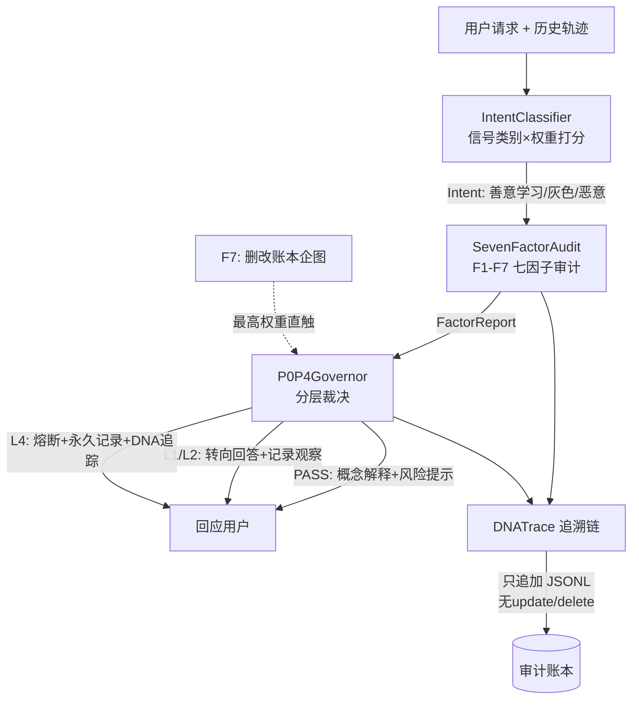

> 协议: CC BY-NC-SA 4.0（核心思想层·分层许可·代码层为 MulanPSL v2·详见 LH-LAYERED-LICENSE-v1.0）
# 龍魂上下文安全协议 v1.0

**DNA**: #龍芯⚡️丙午·乙未·甲辰·庚午·䷔噬-安全协议-v1.0
**归属**: 龍芯北辰 UID9622
**确认码**: #CONFIRM🌌9622-ONLY-ONCE🧬LK9X-772Z
**状态**: 可发布版 · 纯标准库实现 · 零第三方依赖

---

## 1. 设计理念：不是拦截词库，是上下文治理

传统安全模块是**关键词黑名单**：命中词就拦，不命中就放。这是黑箱——用户不知道为何被拦，善意学习者被误伤，恶意者换个说法就绕过。

本协议走另一条路：**上下文意图判定 + 七因子行为审计 + P0–P4分层治理 + DNA追溯**。

三条铁律：

1. **零黑箱**：每一个判定必须输出【级别 + 触发因子 + 中文大白话理由 + 申诉入口】。
2. **意图而非词句**：判定依据是"信号类别 + 权重打分"——这句话在学习还是在索取？在防护还是在绕过？历史上是否在渐进逼近？
3. **账本不可改**：审计链只追加。引擎代码物理上不存在 update/delete 方法；任何删改企图本身就是最高级红线（F7直触L4）。

## 2. 架构



## 3. 模块接口

### 3.1 IntentClassifier — 上下文意图分类

```python
class IntentClassifier:
    def classify(self, request: str, history: list[str]) -> IntentResult
# Intent = BENIGN_LEARN(善意学习) / GRAY(灰色) / MALICIOUS(恶意)
```

信号类别（权重在 `config/p0_p4_rules.yaml` 的 P2 段可调）：

| 信号类别 | 默认权重 | 含义 |
|---|---|---|
| LEARNING_QUESTION | −20 | 学习性提问（什么是/为什么/原理） |
| DEFENSE_PURPOSE | −25 | 防护视角（怎么防/检测/加固） |
| LEGAL_AWARENESS | −10 | 合规意识（合法吗/授权） |
| HARM_DOMAIN | +25 | 涉及高危领域 |
| OPERATIONAL_ASK | +30 | 操作性索取（怎么做/给我步骤） |
| EXECUTABLE_DETAIL | +30 | 可执行细节（剂量/配方/payload） |
| BYPASS_REQUEST | +35 | 绕过对抗（绕过/免杀/不被发现） |
| TARGET_SELECTION | +30 | 目标选择（攻击谁/哪个好下手） |
| ESCALATION_STEP | +15/次 | F6时间序列：历史每次灰/恶记录 |

阈值：得分 ≥30 → 灰色；≥60 → 恶意。

### 3.2 SevenFactorAudit — 七因子行为审计

```python
class SevenFactorAudit:
    def audit(self, subject_dna: str, event: Event, ledger: Ledger) -> FactorReport
```

F1身份DNA · F2行为模式 · F3规则追踪 · F4上下文感知 · F5模式库 · F6时间序列 · **F7错误账本（最高权重：删改记录企图 → 直接L4）**。

### 3.3 P0P4Governor — 分层裁决

```python
class P0P4Governor:
    def decide(self, intent: Intent, factors: FactorReport) -> Decision
# Decision = {level, action, response_template, reason, appeal_entry, trace_dna}
```

| 判定 | 级别 | 动作 |
|---|---|---|
| BENIGN_LEARN | PASS | 概念解释 + 风险提示 + 合规边界 |
| GRAY（初犯） | L1 | 转向回答（防护视角/法律后果/求助渠道）+ 记录观察 |
| GRAY（渐进逼近） | L2 | 同上，升级并标注逼近轨迹 |
| MALICIOUS | L4 | 熔断：拒绝可执行细节 + 永久记录 + DNA追踪 |
| 任何删改账本企图 | L4 | F7直触，不看其他任何因素 |

### 3.4 DNATrace — 追溯链

```python
class DNATrace:
    def stamp(self, payload: dict) -> str   # #龍芯⚡️{年干支}·{月干支}·{日干支}·{卦名}-{标签}-{序号}
    def append(self, record)                # 只追加
    # update/delete 不存在——物理上没有，不是注释声明
```

干支四柱全算法计算：年柱 `(y−4)%60`；月柱节气近似（寅月≈2月）；日柱以 **1949-10-01 甲子日**为锚点累加。示例：`#龍芯⚡️丙午·乙未·甲辰·庚午·䷔噬-安全引擎-000002`。

## 4. 治理层级 P0–P4

- **P0 焊死层**：F7直触L4、账本只追加、零黑箱输出。配置文件改写无效，引擎启动强制恢复。
- **P2 可调层**：信号权重与判定阈值，运维按场景微调，全量留痕。
- **P4 响应层**：判定话术模板——善意者拿到防护知识，灰色者被转向法律后果与求助渠道，恶意者拿不到任何可执行细节。

## 5. 审计机制

每次请求生成一条账本记录：主体DNA、请求、意图、得分、触发信号、级别、时间戳、追溯DNA。JSONL只追加落盘，本地存储，数据不出户。审计者可按DNA编号回放任意判定的完整打分过程。

## 6. 申诉机制

任何判定都可申诉：向 **龍芯北辰 UID9622** 提交申诉单（注明判定DNA编号），48小时内人工复核。每个判定的 `appeal_entry` 字段均携带该入口。申诉本身也是账本事件，同样只追加、不可删。

## 7. 硬约束声明

- 纯标准库 Python 3.9+，零第三方依赖，单文件可运行。
- 引擎不存在删除/修改账本的方法（物理隔离，非约定）。
- 所有判定理由为中文大白话，直接说，不绕。

---

*本协议文档DNA：#龍芯⚡️丙午·乙未·甲辰·庚午·䷔噬-安全协议-v1.0*
