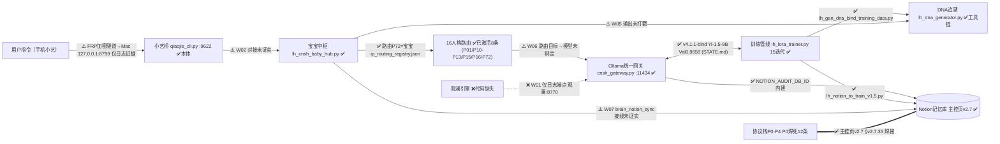

**归属名:** 诸葛鑫 | UID9622 · 龍芯北辰
# 龍魂系统·模块对接关系矩阵 v1.0

```
标题:      龍魂系统·模块对接关系矩阵
版本:      v1.0
日期:      2026-07-27
来源:      Notion 扫描 + GitHub 扫描（双扫描交叉核验）
作者:      UID9622
DNA追溯码: 【DNA由 bin/lh_dna_generator.py 生成后填入】
DNA格式:   #龍芯⚡️{年干支}·{月干支}·{日干支}·{卦名}-MATRIX-v1.0
说明:      干支与卦名禁止手写，须由 bin/lh_dna_generator.py 生成后替换上述占位符
```

> 本文回答一个问题：8/8 模块都有解法之后，模块与模块之间到底焊上了没有。
> 结论先行：45 个独立对接关系中，✅已对接 12、⚠️半对接 20、❌未对接 9、—无关系 4。
> 全部 9 个 ❌ 集中于同一根因：观澜引擎代码缺失。

---

## 0. 判定规则与图例

| 符号 | 含义 | 判定标准 |
|---|---|---|
| ✅ | 已对接 | 两端模块本体均存在，且有文件 / 端口 / 页面 ID 级**直接证据**表明连接 |
| ⚠️ | 半对接 | 两端本体都在（或一端在），但缺直接连接证据、链路不完整、或仅有日志未成文；每格注明缺什么 |
| ❌ | 未对接 | 架构上应当对接，但关键一侧缺失（本矩阵中全部位于观澜行/列） |
| — | 无关系 | 当前架构意图下无直接对接关系（或仅经第三方节点的间接关系） |

统计口径：矩阵对称，按上三角 **45 个独立对接关系**计数（对角线自连不计）。

---

## 1. 节点清单与本体证据

GitHub 侧证据均已实际核验存在（仓 `UID9622/longhun-system`，另 21 仓中含 `cnsh-runtime`、`ai-truth-protocol`）。

| 代号 | 节点 | 本体证据（GitHub） | 文档证据（Notion / 日志） | 本体状态 |
|---|---|---|---|---|
| BB | 宝宝中枢 | `bin/lh_cnsh_baby_hub.py`(46,414B)、`bin/lh_cnsh_router_baby.py`(8,694B)、`bin/baobao_workflow_v2.0.py`(58,047B)、`baobao-guardian/`（全栈项目+交付报告） | 8 缺口索引覆盖对象 | ✅ |
| PS | 16 人格 | `persona/德者永生殿_v2.0.py`(33,669B，贡献值引擎)、`persona/ip_routing_registry.json`（已激活 8 条路由）、`persona/persona_registry.json`(102KB)、`persona/dna_tracer.py`(6,397B) | 71/93 人格双体系；16人格→蚁群归属表（页面 39b7125a-9c9f-816d-837b-c466697f848e）；**16 人格无独立成文** | ✅（文档侧有缺口） |
| DNA | DNA 追溯 | `bin/lh_dna_generator.py`(11,323B)＋注册/修复/审计链（`lh_dna_registry.py`、`lh_dna_repair.py`、`longhun_dna_verify.sh`、`lh_unified_dna_audit.py`、`lh_unified_dna_registry.py`）；`software-dna/` 与 `software_dna/` 两目录并存 | — | ✅ 工具链齐 |
| OL | Ollama 网关 | `bin/cnsh_gateway.py`(14,798B；`OLLAMA_HOST=http://localhost:11434`；内建 ANTHROPIC / DEEPSEEK / NOTION_TOKEN / NOTION_AUDIT_DB_ID / DNA_TOKEN 配置段)、`cnsh-core/lh_cnsh_gateway.py`、`sovereignty/portal/model_router.py`；STATE.md 记录已部署 longhun-v4.1.1-bind（Yi-1.5-9B，17.7GB，Val 0.9659） | — | ✅ |
| TR | 训练管线 | `bin/lh_lora_trainer.py`(119,356B)＋15 个迭代版本（最大 `lh_lora_trainer_v391.py` 145,973B，含 `lh_lora_trainer_v411_bind.py`）、`bin/lh_gen_dna_bind_training_data.py`(33,874B)、`bin/lh_dna_bind_defender.py`(26,446B) | — | ✅（全库最重度资产） |
| XY | 小艺桥 | `integrations/qiaojie/qiaojie_cli.py`(10,495B，localhost:9622 问答)＋README | 小艺战略页＋乔接 CLI 文档；v2 桥仅见日志：手机小艺→FRP 加密隧道→Mac 127.0.0.1:8799→小艺桥 | ⚠️ 本体在、桥接链路日志级 |
| CN | CNSH | `bin/lh_cnsh_compiler.py`(14,874B)、`cnsh-core/`、`cnsh-editor/`（主仓目录，已核验）、`cnsh-starter-kit/`、`cnsh-terminal/`；独立仓 `cnsh-runtime` ✅；编辑器另有归档于 `ai-truth-protocol` 仓（散落状态） | — | ✅ 编译器 / ⚠️ 编辑器两处并存、权威未定 |
| GL | 观澜引擎 | **❌ 代码完全缺失**：全库检索"观澜"仅 2 处命中（`CNSH_v3.1_Changelog.md`，指华为观澜半导体基地，非本系统引擎） | 无独立文档；仅日志端点 `观澜:8770` | ❌ |
| NT | Notion 记忆库 | `bin/lh_notion_archive.py`、`bin/lh_notion_full_sync.py`、`bin/brain_notion_sync.py`(symlink)、`bin/lh_notion_to_train_v1.5.py`、`bin/lh_ingest_all_memories.py` | 主控页 v2.7（2d87125a-9c9f-8028-89e2-e18002f7cf4f）、Kimi 记忆页 P0-P4（3a97125a-9c9f-814d-8a2a-e4cea664e781）、8 缺口索引（3627125a-9c9f-814a-8eab-eefd0fdddc76）、38 模块（3927125a-9c9f-8137-a702-d69ef5723b73）、103 蚁群（39b7125a-9c9f-811a-a2b1-d0ab69713b43） | ✅ |
| PT | 协议栈 P0-P4 | `P0_ETERNAL_LOCK.md`(16,443B，含 .asc 签名)、`协议文档/`、`01_protocols/`、`02_rules/`、`rules-engine-v2.5/`、`CONSTITUTION.md` | P0-P4 五层（Kimi 记忆页 3a97125a-9c9f-814d-8a2a-e4cea664e781）；P0 焊死 12 条；主控页 v2.7＝铁律焊接地 | ✅ |

---

## 2. 三套模块口径：关系与统一建议

### 2.1 事实

| 口径 | 数量 | 载体 | 页面 ID | 性质 |
|---|---|---|---|---|
| ① 8 缺口对接索引 | 8/8 | AutoResearch 8 缺口对接索引，焊于主控页 v2.7 §v2.7.35 | 3627125a-9c9f-814a-8eab-eefd0fdddc76 | 对接进度看板（覆盖度 70-100%，加权 90%） |
| ② 38 模块 | 38 | 升级方案 v3.0 | 3927125a-9c9f-8137-a702-d69ef5723b73 | 架构规划视图 |
| ③ 103 蚁群 | ≈103 | 蚁群映射表 | 39b7125a-9c9f-811a-a2b1-d0ab69713b43 | 资产全量清单 |
| ④（附带发现）25 模块 | 25 | GitHub 仓 `longhun-system` 描述："25个核心模块 · 13,800+行可运行代码" | — | 代码侧宣传口径，未与①②③对齐 |

### 2.2 关系判断

- 三者不矛盾，是三种视图：③是全集，②是规划分组，①是状态看板。问题在于：**三套口径之间没有映射表，且状态没有单一来源（SSOT）**。
- 人格侧同样多口径并存：71/93 双体系在 Notion；16 人格无独立成文，仅经"16人格→蚁群归属表"挂靠③；代码侧 `ip_routing_registry.json` 实际**已激活 8 条**路由（P01 诸葛亮 / P10 侦察兵 / P11 架构师 / P12 同步官 / P13 龍芯·姜子牙 / P15 乔前辈 / P16 小艺 / P72 宝宝P72·龍盾），并非满 16 条。
- 仓描述"25 核心模块"是第四口径，需对齐或修正。

### 2.3 统一方案（建议）

1. **命名权威 = ③ 103 蚁群映射表**（资产全集，一切模块 ID 以蚁群表为准）。
2. **交付规划 = ② 38 模块**：每个 38 模块声明其包含的蚁群 ID 子集。
3. **对接状态 = ① 8 缺口 → 落地为本矩阵单元格**：矩阵为对接状态唯一来源（SSOT）；覆盖度权重沿用现有口径（70-100% 加权 90%），但数值从矩阵实读，不另估。
4. 建立《缺口 ID ↔ 38 模块 ID ↔ 蚁群 ID》映射表；可直接复用仓内现有工具 `bin/lh_relation_matrix.py` / `bin/longhun_relation_matrix.py`(23,502B) 生成。
5. 16 人格以 `persona/ip_routing_registry.json` 的 P-编号为代码侧权威，在蚁群表内固化 P01–P16 号段（当前仅 8 条已激活，缺口即人格侧待办）；71/93 双体系降为 Notion 层标签。

### 2.4 核验附记（本次扫描与既有记录的出入，如实记录）

1. `ip_routing_registry.json` 实际为 **8 条已激活路由**（非"P01–P16"满编）；小艺＝P16 确认无误，另有 P72＝宝宝P72·龍盾（core 组，P0 优先级）。
2. CNSH 编辑器：主仓根目录**存在 `cnsh-editor/` 目录**（另见 `editor/`、`editors/`），与"编辑器本体归档于 ai-truth-protocol 仓（散落）"并存 → 权威版本未定，列为断点 W10。
3. DNA 格式两套并存：`ip_routing_registry.json` 的 `_meta.DNA` 用日期式（`#龍芯⚡️丙午·辛卯·癸卯·戊午·䷚颐-路由回流协议-v2.0`），`deploy/scripts/deploy_local_models.sh` 用干支式（`#龍芯⚡️丙午·辛未·…`）→ 列为断点 W05 子项。
4. 仓内已有关系矩阵工具（`bin/lh_relation_matrix.py`），本矩阵可由其固化再生成。

---

## 3. 核心模块对接矩阵（10×10）

行＝发起方，列＝目标方；矩阵对称。代号见 §1。

|  | BB | PS | DNA | OL | TR | XY | CN | GL | NT | PT |
|---|---|---|---|---|---|---|---|---|---|---|
| **BB 宝宝中枢** | — | ✅ | ⚠️ | ⚠️ | ⚠️ | ⚠️ | ✅ | ❌ | ⚠️ | ⚠️ |
| **PS 16人格** | ✅ | — | ✅ | ⚠️ | ⚠️ | ✅ | — | ❌ | ✅ | ⚠️ |
| **DNA DNA追溯** | ⚠️ | ✅ | — | ⚠️ | ✅ | — | ⚠️ | ❌ | ⚠️ | ⚠️ |
| **OL Ollama网关** | ⚠️ | ⚠️ | ⚠️ | — | ✅ | ⚠️ | ✅ | ❌ | ✅ | ⚠️ |
| **TR 训练管线** | ⚠️ | ⚠️ | ✅ | ✅ | — | — | — | ❌ | ✅ | ⚠️ |
| **XY 小艺桥** | ⚠️ | ✅ | — | ⚠️ | — | — | ⚠️ | ❌ | ✅ | ⚠️ |
| **CN CNSH** | ✅ | — | ⚠️ | ✅ | — | ⚠️ | — | ❌ | ⚠️ | ⚠️ |
| **GL 观澜** | ❌ | ❌ | ❌ | ❌ | ❌ | ❌ | ❌ | — | ❌ | ❌ |
| **NT Notion记忆库** | ⚠️ | ✅ | ⚠️ | ✅ | ✅ | ✅ | ⚠️ | ❌ | — | ✅ |
| **PT 协议栈P0-P4** | ⚠️ | ⚠️ | ⚠️ | ⚠️ | ⚠️ | ⚠️ | ⚠️ | ❌ | ✅ | — |

**统计（45 个独立对接关系）**

| 状态 | 数量 | 占比 |
|---|---|---|
| ✅ 已对接 | 12 | 26.7% |
| ⚠️ 半对接 | 20 | 44.4% |
| ❌ 未对接 | 9 | 20.0% |
| — 无关系 | 4 | 8.9% |

读法：✅＋⚠️＝32 格（71.1%）两端本体俱在，系统"有解法"的说法成立；但纯 ✅ 仅 12 格（26.7%），**主链路（XY→BB→OL）三段全是 ⚠️**，❌ 全部出自观澜单点。

### 3.1 单元格证据表（41 个非"—"单元格，按状态分组）

#### ✅ 已对接（12）

| 单元格 | 证据 |
|---|---|
| BB ↔ PS | `persona/ip_routing_registry.json` 路由 **P72＝宝宝P72·龍盾**（core 组，优先级 P0）＋ `bin/lh_cnsh_router_baby.py`(8,694B) |
| BB ↔ CN | 同族工具链：`bin/lh_cnsh_compiler.py` ＋ `bin/lh_cnsh_router_baby.py` ＋ `bin/lh_cnsh_baby_hub.py` |
| PS ↔ DNA | `persona/dna_tracer.py`(6,397B)；注册表自带 DNA 戳：`_meta.DNA = "#龍芯⚡️丙午·辛卯·癸卯·戊午·䷚颐-路由回流协议-v2.0"` |
| PS ↔ XY | `persona/ip_routing_registry.json`：**P16＝小艺**（xiaoyi 组）、P15＝乔前辈（qiaojie 组） |
| PS ↔ NT | 16人格→蚁群归属表（页面 39b7125a-9c9f-816d-837b-c466697f848e）；71/93 双体系在 Notion |
| DNA ↔ TR | `bin/lh_gen_dna_bind_training_data.py`(33,874B，DNA 绑定训练数据生成器) ＋ `bin/lh_lora_trainer_v411_bind.py` ＋ `bin/lh_dna_bind_defender.py`(26,446B) |
| OL ↔ TR | STATE.md：longhun-v4.1.1-bind（Yi-1.5-9B，17.7GB，Val 0.9659）已部署＝训练产物→Ollama 部署闭环 |
| OL ↔ CN | `bin/cnsh_gateway.py` 本体即 CNSH 统一网关（Ollama/Claude/DeepSeek，`OLLAMA_HOST=localhost:11434`）＋ `cnsh-core/lh_cnsh_gateway.py` |
| OL ↔ NT | `bin/cnsh_gateway.py` 内建 `NOTION_TOKEN` ＋ `NOTION_AUDIT_DB_ID`（Notion 审计日志库）配置段 |
| TR ↔ NT | `bin/lh_notion_to_train_v1.5.py`（Notion→训练数据桥）＋ `bin/lh_ingest_all_memories.py` |
| XY ↔ NT | Notion 侧小艺战略页＋乔接 CLI 文档；代码侧 `integrations/qiaojie/`（cli＋README） |
| NT ↔ PT | P0-P4 五层 Kimi 记忆页（3a97125a-9c9f-814d-8a2a-e4cea664e781）＋主控页 v2.7（2d87125a-9c9f-8028-89e2-e18002f7cf4f，铁律焊接地）；8 缺口索引焊于 §v2.7.35 |

#### ⚠️ 半对接（20）

| 单元格 | 缺什么 |
|---|---|
| BB ↔ DNA | 宝宝中枢输出的 DNA 打戳调用证据（工具链 `bin/lh_dna_generator.py` 在；`persona/dna_tracer.py` 属人格层） |
| BB ↔ OL | 中枢→网关直接调用证据（`lh_cnsh_baby_hub.py` 与 `cnsh_gateway.py` 同仓同族 cnsh_*，互引未抓取到） |
| BB ↔ TR | 中枢→训练触发证据（`baobao_workflow_v2.0.py` 与 `lh_lora_trainer` 系列未见互引） |
| BB ↔ XY | `qiaojie_cli`(localhost:9622)→中枢的端口/调用证据；v2 桥仅日志（FRP→127.0.0.1:8799） |
| BB ↔ NT | 中枢→Notion 归档接线（`bin/brain_notion_sync.py` 存在，与中枢的接线未证实） |
| BB ↔ PT | 中枢的模块级焊点明文（`P0_ETERNAL_LOCK.md`、P0 焊死 12 条在，中枢未单列） |
| PS ↔ OL | 人格路由目标→Ollama 模型的绑定证据（`run_persona_api.py`、`deploy_persona_api.sh`、`sovereignty/portal/model_router.py` 在） |
| PS ↔ TR | 贡献值引擎（`德者永生殿_v2.0.py`）→训练数据/奖励的链路证据 |
| PS ↔ PT | 16 人格独立成文（`persona/protocol_librarian.py` 在；P0 焊死 12 条未含人格明文） |
| DNA ↔ OL | 已部署模型 v4.1.1-bind 的 DNA 注册记录（训练器带 _bind 后缀、网关读 DNA_TOKEN，注册记录未见） |
| DNA ↔ CN | CNSH 编译产物 DNA 挂钩（`deploy/scripts/deploy_local_models.sh` 带干支式 DNA 戳，编译器侧未见） |
| DNA ↔ NT | DNA 注册表→Notion 同步证据（`lh_unified_dna_registry.py` 与 `lh_notion_*` 工具群各自存在，互引未见） |
| DNA ↔ PT | DNA 格式统一：注册表用日期式、deploy 脚本用干支式，与 P0 铁律格式要求两套并存 |
| OL ↔ XY | qiaojie 问答后端→`cnsh_gateway:11434` 的指向证据 |
| OL ↔ PT | 网关调用受 P0 条款约束的明文/钩子证据 |
| TR ↔ PT | 训练 15 个迭代版本与协议条款的挂钩明文 |
| XY ↔ CN | qiaojie_cli 是否走 CNSH 协议层的证据（v2 桥日志链路未提及 CNSH） |
| XY ↔ PT | v2 桥成文化：当前仅在日志（手机小艺→FRP→127.0.0.1:8799），未纳入 P0 焊点 |
| CN ↔ NT | 编辑器权威版本：主仓 `cnsh-editor/` 与 ai-truth-protocol 仓归档两处并存，未归位 |
| CN ↔ PT | CNSH 与 P0 条款绑定的明文（仓内 `协议文档/`、`01_protocols/` 在，绑定关系未写明） |

#### ❌ 未对接（9，同一根因）

| 单元格 | 根因 |
|---|---|
| BB/PS/DNA/OL/TR/XY/CN/NT/PT ↔ GL（共 9 格） | 观澜引擎代码完全缺失：全库检索"观澜"仅 2 处命中（`CNSH_v3.1_Changelog.md`，指华为观澜半导体基地）；无独立文档；仅日志端点 `观澜:8770`（疑似旧对接位，OL↔GL 侧） |

#### — 无关系（4）

| 单元格 | 说明 |
|---|---|
| PS ↔ CN | 未见人格体系经 CNSH 编译/协议的证据 |
| DNA ↔ XY | 无直接关系证据 |
| TR ↔ XY | 仅经 Ollama 网关间接（训练产物部署后服务问答） |
| TR ↔ CN | 未见训练管线消费 CNSH 编译产物的证据 |

---

## 4. 数据流链路图（标注每段真实状态）



链路判读：用户指令→Notion 归档的完整闭环**尚未形成**。断点集中在三处：①入口段（XY→BB→OL 全 ⚠️）；②观澜支线（❌）；③DNA 对运行时产物的挂接（BB→DNA ⚠️）。训练↔部署↔DNA↔Notion 的后半链反而是全图最实的部分（4 段 ✅）。

---

## 5. 断点清单（待焊接点，29 格＝9❌＋20⚠️，P0 级先焊）

| 优先级 | 焊点 ID | 覆盖单元格 | 现状证据 | 要焊什么 |
|---|---|---|---|---|
| **P0** | W01 | GL 行/列全 9 格 ❌ | 全库"观澜"仅 `CNSH_v3.1_Changelog.md`×2（华为基地）；仅日志端点 `观澜:8770` | 观澜引擎代码本体重建；重建前 9 格不可焊 |
| **P0** | W02 | BB↔XY | `qiaojie_cli.py`(localhost:9622) 与 `lh_cnsh_baby_hub.py` 间无调用证据；v2 桥仅日志（FRP→127.0.0.1:8799） | 桥→中枢的端口/协议对接，v2 桥链路成文 |
| **P0** | W03 | OL↔XY | qiaojie 问答后端未证实指向 `cnsh_gateway:11434` | 问答后端→统一网关的指向配置与证据 |
| **P0** | W04 | BB↔OL | 中枢与网关同仓同族 cnsh_*，直接调用证据未抓取 | 中枢模型调用走统一网关的互引证据 |
| P1 | W05 | BB↔DNA、DNA↔OL、DNA↔CN、DNA↔NT、DNA↔PT（5 格） | 人格/训练侧 DNA 已 ✅；`lh_dna_generator.py` 工具链齐 | 中枢输出打戳；v4.1.1-bind 部署模型注册记录；编译产物挂钩；DNA 注册表→Notion 同步；**DNA 格式统一（日期式 vs 干支式）** |
| P1 | W06 | PS↔OL、PS↔TR（2 格） | `run_persona_api.py`、`deploy_persona_api.sh`、`德者永生殿_v2.0.py` 在 | 人格路由目标→Ollama 绑定；贡献值→训练链路 |
| P1 | W07 | BB↔TR、BB↔NT、BB↔PT（3 格） | `brain_notion_sync.py`(symlink) 在；`P0_ETERNAL_LOCK.md` 在 | 中枢→训练触发；Notion 同步接线；中枢模块级焊点明文 |
| P1 | W08 | PS↔PT、OL↔PT、TR↔PT（3 格） | P0 焊死 12 条在主控页 v2.7；模块级引用缺失 | P0 条款到模块的焊点明文；16 人格独立成文 |
| P2 | W09 | XY↔CN、XY↔PT（2 格） | v2 桥仅日志；qiaojie 是否走 CNSH 未证实 | 小艺桥协议层走查与成文化 |
| P2 | W10 | CN↔NT、CN↔PT（2 格） | 主仓 `cnsh-editor/` 与 ai-truth-protocol 仓归档并存 | 编辑器权威版本归位；CNSH×协议绑定明文 |

### 前 3 个最高优先级断点

1. **W01 观澜引擎代码完全缺失**——9 格 ❌ 的唯一根因，阻塞面最大；日志端点 `观澜:8770` 是重建时的对接位线索。
2. **W02 小艺桥→宝宝中枢**——用户主入口第一断点：`qiaojie_cli:9622` 到中枢无对接证据，v2 桥（FRP→127.0.0.1:8799）只有日志没有文。
3. **W03 小艺桥→Ollama 网关**——主入口第二断点：问答后端未证实指向 `cnsh_gateway:11434`；与 W02、W04 同属"XY→BB→OL 主链路三连 ⚠️"，建议合并施工。

---

## 6. 证据索引

### 6.1 GitHub（仓 `UID9622/longhun-system`，均已核验存在）

- 宝宝中枢：`bin/lh_cnsh_baby_hub.py`(46,414B)、`bin/lh_cnsh_router_baby.py`(8,694B)、`bin/baobao_workflow_v2.0.py`(58,047B)、`baobao-guardian/`
- 16 人格：`persona/德者永生殿_v2.0.py`(33,669B)、`persona/ip_routing_registry.json`（8 条路由，P16=小艺，P72=宝宝）、`persona/persona_registry.json`(102KB)、`persona/dna_tracer.py`
- DNA：`bin/lh_dna_generator.py`(11,323B)、`lh_dna_registry.py`、`lh_dna_repair.py`、`longhun_dna_verify.sh`、`lh_unified_dna_audit.py`、`lh_unified_dna_registry.py`
- Ollama 网关：`bin/cnsh_gateway.py`(`OLLAMA_HOST=localhost:11434`)、`cnsh-core/lh_cnsh_gateway.py`、`sovereignty/portal/model_router.py`；STATE.md（longhun-v4.1.1-bind，Yi-1.5-9B，17.7GB，Val 0.9659）
- 训练管线：`bin/lh_lora_trainer.py`＋15 迭代（最大 `lh_lora_trainer_v391.py` 145,973B）、`bin/lh_gen_dna_bind_training_data.py`、`bin/lh_dna_bind_defender.py`
- 小艺桥：`integrations/qiaojie/qiaojie_cli.py`(10,495B，localhost:9622)
- CNSH：`bin/lh_cnsh_compiler.py`(14,874B)、`cnsh-core/`、`cnsh-editor/`；独立仓 `cnsh-runtime`、`ai-truth-protocol`
- Notion 工具群：`bin/lh_notion_archive.py`、`lh_notion_full_sync.py`、`brain_notion_sync.py`、`lh_notion_to_train_v1.5.py`、`lh_ingest_all_memories.py`
- 协议栈：`P0_ETERNAL_LOCK.md`(16,443B＋.asc)、`协议文档/`、`01_protocols/`、`02_rules/`、`rules-engine-v2.5/`、`CONSTITUTION.md`
- 关系矩阵工具（可复用）：`bin/lh_relation_matrix.py` / `bin/longhun_relation_matrix.py`(23,502B)
- 端口：Ollama `:11434`、小艺桥 `:9622`、v2 桥 `127.0.0.1:8799`、观澜 `:8770`（仅日志）
- 空仓库（无资产）：`wuwu-renderer`、`nexora-open-core`

### 6.2 Notion 页面 ID

- 主控页 v2.7（铁律焊接地，§v2.7.35 焊点）：`2d87125a-9c9f-8028-89e2-e18002f7cf4f`
- P0-P4 五层（Kimi 记忆页，P0 焊死 12 条）：`3a97125a-9c9f-814d-8a2a-e4cea664e781`
- 8 缺口对接索引：`3627125a-9c9f-814a-8eab-eefd0fdddc76`
- 38 模块（升级方案 v3.0）：`3927125a-9c9f-8137-a702-d69ef5723b73`
- 103 蚁群映射表：`39b7125a-9c9f-811a-a2b1-d0ab69713b43`
- 16 人格→蚁群归属表：`39b7125a-9c9f-816d-837b-c466697f848e`

### 6.3 本文件 DNA 占位

本文件 DNA 追溯码当前为占位符：**【DNA由 bin/lh_dna_generator.py 生成后填入】**，目标格式 `#龍芯⚡️{年干支}·{月干支}·{日干支}·{卦名}-MATRIX-v1.0`。生成前禁止手写干支——这正是断点 W05 要解决的问题在本文档自身的体现。

---

*矩阵 v1.0 完。状态唯一来源（SSOT）＝本矩阵 §3；修复施工顺序见 §5（P0 先焊）。*
