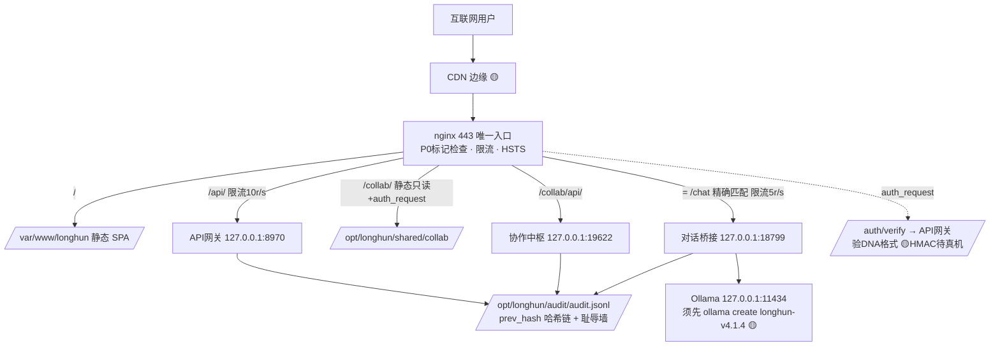
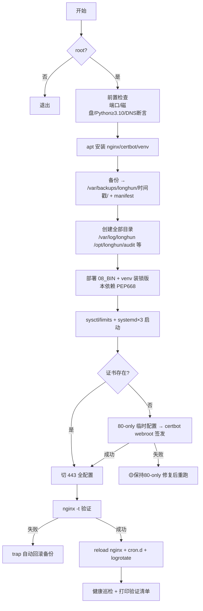

# 🐉 龍魂 · 流量拓扑一键部署手册

**DNA:** `#龍芯⚡️丙午·丙申·己未·乙亥时·䷞旅-README-v1.0-UID9622`
**确认码:** `#CONFIRM🌌9622-ONLY-ONCE🧬LK9X-772Z`
**GPG:** `A2D0092CEE2E5BA87035600924C3704A8CC26D5F`
**SPDX-License-Identifier:** CC-BY-NC-SA-4.0
**分层许可:** 思想层 CC BY-NC-SA 4.0（本文档）· 工程层 MulanPSL-2.0（LICENSE-CODE）

> **核心判断：** nginx 不是"配置"，是龍魂系统对外暴露的唯一合法入口。
> 后端三服务（8970/19622/18799）仅绑定 `127.0.0.1`，绕过 nginx 直连视为违规，自动上耻辱墙。

---

## 一、定位（这套工程包解决什么）

| 组件 | 端口 | 定位 |
|:---|:---|:---|
| nginx | 80/443 | 唯一入口：TLS 终止、限流、P0 主权头注入、审计标记检查 |
| API 网关 `lh_api_gateway.py` | 8970 | 业务编排、协议转换、`/auth/verify` 鉴权子请求端点 |
| 协作中枢 `lh_collab_hub.py` | 19622 | 共享文件列表/状态（`/collab/api/` 反代至此） |
| 对话桥接 `lh_chat_bridge.py` | 18799 | Ollama SSE 流式代理（httpx 异步 + 180s 超时 + 异常兜底） |
| 史官 `lh_audit.py` | — | 公共模块：审计哈希链 + 耻辱墙 + DNA 生成（掺 uuid4） |

**拓扑（修正8 双路由已落实）：**



---

## 二、配置（部署前改这几处）

| 项 | 位置 | 说明 |
|:---|:---|:---|
| 域名 | `deploy.sh` 环境变量 `DOMAIN` | 默认 `uid9622.cn`，改：`sudo DOMAIN=example.cn ./deploy.sh` |
| 证书邮箱 | 环境变量 `CERT_EMAIL` | certbot 注册邮箱 |
| DNS 跳过 | 环境变量 `SKIP_DNS=1` | 内网/沙箱部署时跳过 DNS 断言 |
| 站点配置 | `conf/nginx/sites-available/longhun` | 域名写死 `uid9622.cn`，换域名需同步替换 |
| 模型名 | `08_BIN/lh_chat_bridge.py` | `longhun-v4.1.4:latest` 为自定义名，真机先 `ollama create longhun-v4.1.4 -f Modelfile` |

**性能参数对照表（修正17：与本包配置逐项一致）：**

| 参数 | 默认 | 本包 | 说明 |
|:---|:---:|:---:|:---|
| worker_connections | 1024/768 | 4096 | 单 worker 最大连接数 |
| keepalive_timeout | 65 | 65 | 与 nginx.conf 一致 |
| client_max_body_size | 1M | 50M | 最大上传 |
| gzip_comp_level | 1 | 6 | gzip on 已补（修正17） |
| global_limit | — | 30r/s burst=50 | 全局限流 |
| api_limit | — | 10r/s burst=20 | /api/、/collab/api/ |
| chat_limit | — | 5r/s burst=10 | /chat 独立 zone（修正18） |
| proxy_read_timeout (/chat) | 60s | 120s | AI 推理长响应 |
| ip_local_port_range | — | 系统默认 | 已删除自定义项（修正15） |

---

## 三、启动

```bash
tar 解包后进入目录
cd longhun-flow-deploy
chmod +x deploy.sh rollback.sh 08_BIN/lh_health_check.sh
sudo ./deploy.sh        # 幂等，可重复执行；失败自动 trap 回滚
                        # 若执行位丢失: sudo bash deploy.sh
sudo ./rollback.sh      # 需要回滚时（取 /var/backups/longhun 最新备份）
```

**部署流程图：**



**两段式证书（修正12）**：证书不存在 → 先起 80-only 临时站点（放行 `/.well-known/acme-challenge/`）→ `certbot certonly --webroot` 签发 → 成功自动切 443 全配置；失败保持 80-only 并标🟡，重跑 `deploy.sh` 即可续接。

---

## 四、验证清单

### 4.1 部署后验证（deploy.sh 结尾也会打印）

| # | 验证项 | 命令 | 预期 |
|:---|:---|:---|:---|
| 1 | nginx 语法 | `nginx -t` | syntax is ok |
| 2 | API 网关 | `curl -s http://127.0.0.1:8970/health` | `{"status":"ok","service":"api-gateway","dna":...}` |
| 3 | 协作中枢 | `curl -s http://127.0.0.1:19622/health` | 同上，service=collab-hub |
| 4 | 对话桥接 | `curl -s http://127.0.0.1:18799/health` | 同上，service=chat-bridge |
| 5 | 无 DNA → 403 | `curl -s https://$DOMAIN/api/test` | 403 + `{"error":"P0协议要求: 缺少DNA追溯码"}` |
| 6 | 有 DNA 放行 | `curl -s -H 'X-Dragon-DNA: #龍芯⚡️test-xxxx-UID9622' https://$DOMAIN/api/test` | 200 JSON |
| 7 | 主权头齐全 | `curl -sI https://$DOMAIN/ \| grep -i x-longhun` | DNA/Confirm/Tricolor/Sovereign/GPG 五个 |
| 8 | HSTS 在、XSS 头已删 | `curl -sI https://$DOMAIN/ \| grep -iE 'strict-transport\|x-xss'` | 只有 HSTS |
| 9 | 审计链校验 | `python3 /opt/longhun-system/08_BIN/lh_audit.py` | `"valid": true` |
| 10 | 审计落盘 | `tail -3 /opt/longhun/audit/audit.jsonl` | 含 prev_hash/hash 字段 |
| 11 | systemd 三服务 | `systemctl status longhun-api longhun-collab longhun-bridge --no-pager` | 全 active |
| 12 | 健康巡检 | `/usr/local/bin/lh_health_check.sh` | 🟢 所有服务正常，退出码 0 |
| 13 | auth_request | `curl -s https://$DOMAIN/collab/`（无DNA） | 401/403（被 /auth/verify 拒） |

> 沙箱已实测：第 2/3/4/5(本地等价)/6/9/10/12 项通过；1/7/8/13 需真机 nginx 环境（🟡）。

### 4.2 日常巡检

| # | 检查项 | 频率 | 命令 |
|:---|:---|:---|:---|
| 1 | 审计链完整性 | 每日 | `python3 /opt/longhun-system/08_BIN/lh_audit.py` |
| 2 | SSL 证书有效期 | 每周 | `openssl x509 -in /etc/letsencrypt/live/$DOMAIN/fullchain.pem -noout -dates` |
| 3 | 耻辱墙新增 | 每日 | `cat /opt/longhun/audit/shame_wall.jsonl \| jq .` |
| 4 | 磁盘空间 | 每周 | `df -h /` |
| 5 | 健康巡检日志 | 每周 | `tail /var/log/longhun/health_check.log` |

---

## 五、QA

**Q1：502 Bad Gateway？**
后端未起。`journalctl -u longhun-api -n 50 --no-pager`，三服务同理；`systemctl restart longhun-api`。

**Q2：API 返回 403 `P0协议要求: 缺少DNA追溯码`？**
请求缺 `X-Dragon-DNA` 头。该头是**审计标记**（修正5：只查存在性，不做鉴权），测试：`curl -H 'X-Dragon-DNA: #龍芯⚡️test-xxxx-UID9622' ...`。真鉴权由 `auth_request → /auth/verify` 完成（验格式 `^#龍芯⚡️` + 长度≥20；🟡 HMAC 验签待真机部署共享密钥）。

**Q3：/collab/ 返回 401？**
`auth_request` 子请求被 API 网关拒绝（DNA 格式不符）。带合规 DNA 头重试；网关没起时 auth_request 会 500 → 先查 `curl 127.0.0.1:8970/auth/verify`。

**Q4：证书怎么续期？**
已写入 `/etc/cron.d/longhun`：每日 03:00 `certbot renew --quiet --post-hook "systemctl reload nginx"`。手动：`certbot renew` 后 `systemctl reload nginx`。webroot `/var/www/certbot` 已由 `location ^~ /.well-known/` 放行（修正27）。

**Q5：/chat 流式卡住或报 ollama_unavailable？**
先 `curl http://127.0.0.1:11434/api/version` 确认 Ollama；自定义模型须先 `ollama create longhun-v4.1.4 -f Modelfile`（修正26）。桥接层有 180s 超时 + SSE 错误事件兜底（修正14），客户端不会悬挂。

**Q6：怎么回滚？**
`sudo ./rollback.sh`（取最新 `/var/backups/longhun/<时间戳>/`，manifest 校验）；deploy.sh 失败时 trap 自动回滚同目录（修正11）。

**Q7：实时监控怎么接？**
`location = /nginx_status`（stub_status，仅 127.0.0.1）已开。接入 nginx-prometheus-exporter 可得 `nginx_up`/`nginx_http_requests_total`（无 status 标签）；5xx 率走 access.log JSON + mtail/textfile；证书天数用 textfile collector 脚本。整体方案🟡未实测（修正2），本包不预装 exporter。

**Q8：想接 ModSecurity？**
arm64 需源码编译🟡。**不要**配白名单 `allow` 规则（修正6：等于 WAF 全旁路）；降误报用 `ctl:ruleRemoveById`。

---

## 六、故障排查命令速查

```bash
ss -tlnp | grep -E ':(80|443|8970|19622|18799) '   # 端口监听
journalctl -u longhun-api -f                        # API 网关日志
tail -f /var/log/nginx/access.log | jq .            # JSON 访问日志
tail -f /var/log/nginx/error.log                    # nginx 错误
nginx -t && systemctl reload nginx                  # 改配置后
/usr/local/bin/lh_health_check.sh                   # 三后端一键巡检
```

---

## 七、🟡 待验清单（沙箱不可验，照抄审查结论）

- 鲲鹏 arm64 sysctl conntrack 可写性、IPv6 listen
- Ollama CPU 推理延迟/内存真实值、延迟预算全部回填前标🟡
- DNS 解析/安全组/443 80 入向
- Cloudflare 回源兼容
- ModSecurity arm64 编译 + emoji 头误报率
- 限流误杀率无历史数据
- （修正2 衍生）nginx-prometheus-exporter 指标名/mtail 5xx 采集整体未实测
- （修正5 衍生）/auth/verify 当前仅验 DNA 格式+长度，HMAC 验签待真机共享密钥
- （修正26 衍生）`longhun-v4.1.4` 模型须先 `ollama create`，鲲鹏无 CUDA 纯 CPU 推理指标未回填

---

## 🔐 最终签名（数字如实统计，修正19）

```
═══════════════════════════════════════════════════
 🐉 龍魂 · 流量拓扑一键部署工程包 v1.0 · 最终签名
═══════════════════════════════════════════════════
DNA:        #龍芯⚡️丙午·丙申·己未·乙亥时·䷞旅-README-v1.0-UID9622
确认码:     #CONFIRM🌌9622-ONLY-ONCE🧬LK9X-772Z
**归属名:** 诸葛鑫 | UID9622 · 龍芯北辰
GPG:        A2D0092CEE2E5BA87035600924C3704A8CC26D5F
文件总数:   20 (含本手册, 不含 LICENSE×2 则 18; find . -type f -not -path '*/__pycache__/*' 实测)
后端服务:   3 (FastAPI, systemd Restart=always)
部署脚本:   deploy.sh 380行 + rollback.sh 67行 (wc -l 实测)
验证清单:   13项部署后 + 5项日常巡检
QA:         8条
🟡待验:     9项 (见第七节)
许可:       代码 MulanPSL-2.0 / 文档 CC BY-NC-SA 4.0
═══════════════════════════════════════════════════
```

🐉 **丙午·丙申·己未·乙亥时·䷞旅·🟢**
