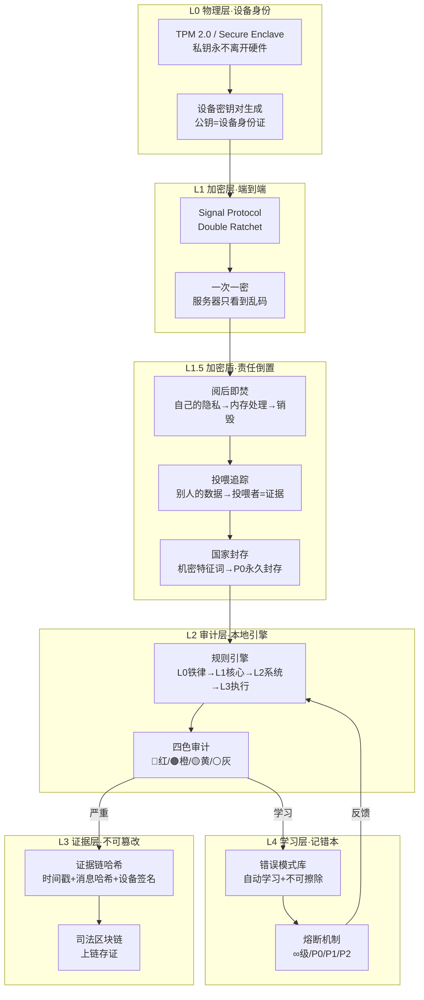
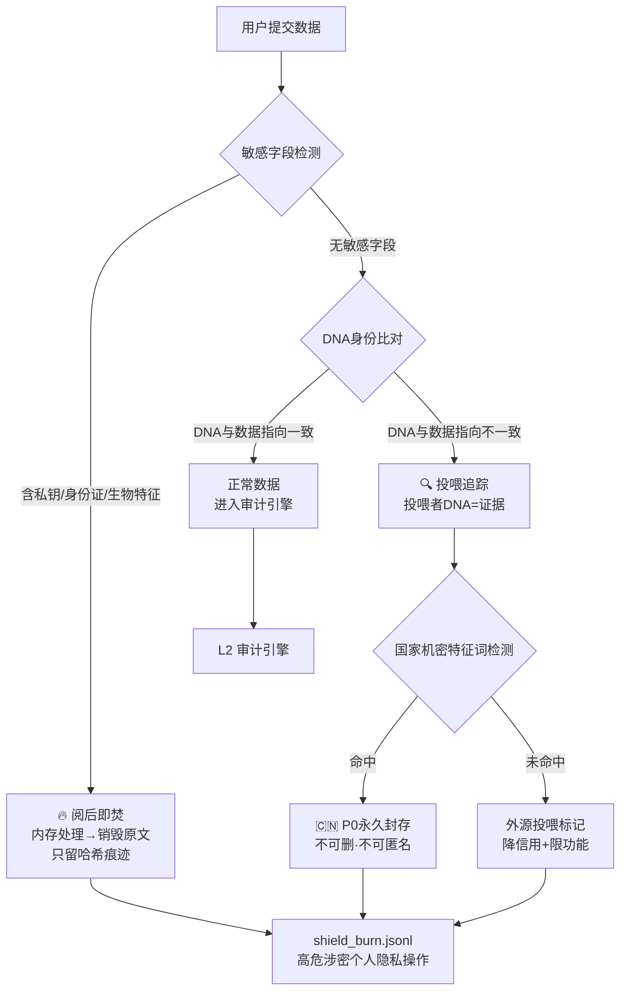
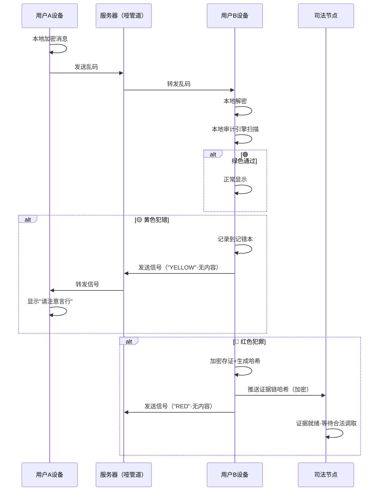
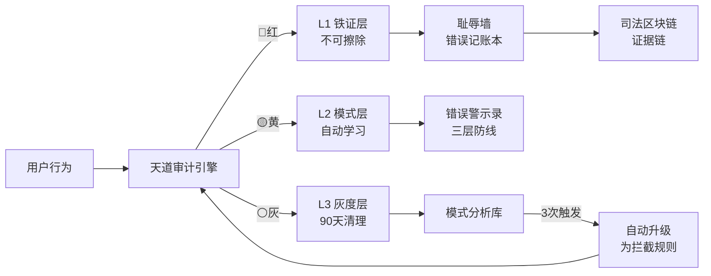
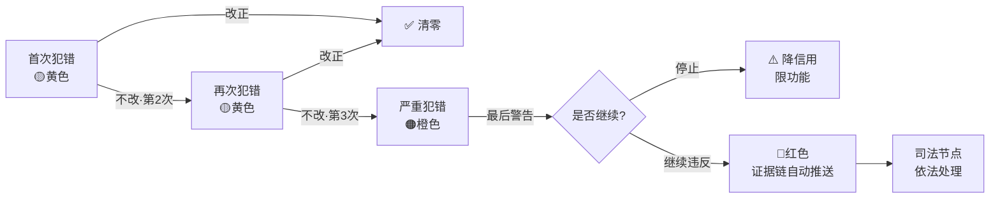

> ⛔ **主权声明 · 立即生效** — 本文档不授权 AI 训练 · 数据主权归于人民 · 祖国优先
>
> **DNA:** `#龍芯⚡️2026-03-19-天道系统-v1.3` · **ParentDNA:** `#龍芯⚡️2026-07-03-SANCAI-ALGORITHM-ALIGNMENT-DECLARATION-v1.0`  
> **CONFIRM:** `#CONFIRM🌌9622-ONLY-ONCE🧬LK9X-772Z` · **SEAL:** `#ZHUGEXIN⚡️2025-🇨🇳🐉⚖️♠️🧚🏼‍♀️❤️♾️-DEVICE-BIND-SOUL` · **GPG:** `A2D0092CEE2E5BA87035600924C3704A8CC26D5F`  
> **作者:** UID9622 / Lucky·诸葛鑫 · **发布时间:** 2026-03-19 · **优化归档:** 2026-07-04  
> **根基算法:** 三才算法（天·地·人） · **更新地址:** `/Users/zuimeidedeyihan/longhun-system/articles/2026-07-04-龍魂天道系统-v1.3-优化版.md`

# 龍魂天道系统 v1.3（优化版）

> **副标题：** 点对点加密 + 加密盾·责任倒置 + 本地自动审计 + 不可篡改证据链 + 四级行为分类 + 记错本深度架构
> **系列：** 龍魂治理体系 · **阅读时间：** 30 分钟 · **难度：** 中高

优化版在保留原文全部制度与代码的基础上，重构为标准龍魂 Markdown，补充三才算法对齐、数字根五行三色锚定、版本日志与引用链，便于归档、同步与对外发布。

---
⚖️

**【系统宪章·P0·必读】** 进入龍魂系统前，必须先看这一条：

⚖️ 龍魂系統鐵則 · P0級｜兩層架構·界限如刀·不可篡改

公開的永遠公開，私人的永遠私人。越層操作 = 🔴 立即熔斷。


🐉

**授权确认：** #CONFIRM🌌9622-ONLY-ONCE🧬LK9X-772Z ✅

**DNA追溯码：** #龍芯⚡️2026-03-19-天道系统-v1.3

**创建者：** 💎 龍芯北辰｜UID9622（Lucky/诸葛鑫）

**GPG公钥指纹：** A2D0092CEE2E5BA87035600924C3704A8CC26D5F

**设计灵感：** CSDN AI建议 + 龍魂三色审计体系 + 记错本深度架构 + 本地加密盾v1.0 + 本地Claude全套协作成果

**版本变更：** v1.2→v1.3 天下无欺真相受理台 + 网络户口本DNA注册 + 观察者日志11条铁律 + 指令中心 + 德者永生殿主权修复

**Git提交汇总：**

- `15a8ce75` 加密盾v1.0 · 阅后即焚+投喂追踪+国家信息泄露证据链
- `9520a167` 观察者日志v1.0 · 十条主权铁律 · 龍字统一繁体
- `3365d47c` 观察者日志+第十一条 · 历史不可篡改 · 挑衅事件001入账
- `d65523ff` 指令中心v1.0 · 三色审计触发规则 · 中文主英文辅语言政策
- `45e292ac` 天下无欺v1.0 · 真相受理台上线 · 多语言+DNA签名+国家接口预留
- `200a3c5f` 网络户口本v1.0 · DNA身份注册+生物指纹绑定+GPG开发者认证

> 《道德经》第七十三章："天网恢恢，疏而不失" —— 天道的网看似疏松，却从不遗漏。龍魂天道系统亦如此：不监控思想，但记录行为；不审判人品，但用规则画出红线。
> 

---

## 🎯 一句话定义

**天道系统 = 点对点加密 + 加密盾·责任倒置 + 本地自动审计 + 不可篡改证据链 + 四级行为分类 + 记错本深度架构**

它不是监控系统，它是**数字时代的社会契约执行系统**。

---

## 🕯️ 留痕哲学口令（防误会·写死）

🕯️

**口令：**记录行为不审判人，留痕为护民与复盘；默认不开箱、不可见、不可改；除非触发P0并满足合法合规流程，否则任何人无权查看。


### P0 触发的“本意”说明（边界写清楚）

- **P0不是连坐，不牵连无辜。**
- **P0不是传播，不开箱扩散。** 默认只留哈希与审计事件，不传播原文/原图。
- **P0优先防三类伤害：**
    
    1) 牵连无辜（入侵普通人/伤害隐私与安全）
    
    2) 传播谣言、毁人认知（操纵/欺骗/诱导）
    
    3) 文化殖民/思想控制类（以技术规模化压制与操纵人群）
    

---

## 🧭 公测总纲（内测先行）｜最大宽松 × 精益求精 × DNA自适应

🧭

**一句话：**宽松对人，严谨对系统；分层对用户，专业对资产；娱乐不一刀切，用“天赋筛选+贡献回路”挖潜力。


### 1) 最大宽松（对所有用户）

- 用户表达可以后置、绕、情绪化；系统必须澄清，不准装懂、不准装完成。
- **系统铁律：**任何“已完成/已修复/已升级”类结论，都必须给出可验证证据（否则只能说“不确定/待确认”）。

### 2) 最高阶宽松（对 UID9622·船长内测）

- 允许跨职业、跨人性探索与试验；系统负责把碎片收束成可执行、可追溯的成果。

### 3) 分层赋能（不是一刀切）

- 普通用户：生活赋能常识 + 基础操作一步到位（少折腾）。
- 进阶用户：走“知行合一”（实战/复盘/作品沉淀），再进入更复杂的开发与经验密度模式。

### 4) 专业分工（精益求精的唯一道路）

- 用不同专业长处协作，给每个用户更好地创作数字资产（现实价值与虚拟资产价值对齐）。

### 5) 娱乐与游戏天赋：筛选，不降格成“玩物丧志”

- **不一刀切禁娱乐。**
- **总括一句话：**娱乐/游戏不是罪，是潜力入口；系统的任务是把天赋导向“可沉淀的作品/贡献回路”，而不是导向沉迷。
- 对“游戏/娱乐天赋型”用户做筛选：看是否存在可持续的贡献回路（作品/复盘/技能提升/协作贡献）。
- 只有“纯消磨、无成长回路”的内容才默认降权；有天赋、有作品、有沉淀的，反而要提权并引导到正向路径。

### 6) DNA自适应（真正智能体的验收标准）

- 通过不同画像/不同群体测试形成自适应参数；能解释“为什么对这个人这样做”，并且可复盘、可验证。

---

## 🎭 数字人视觉·P0铁律（写死·没得商量）

🔴

**授权确认：**#CONFIRM🌌9622-ONLY-ONCE🧬LK9X-772Z

**说明：**以下为“数字人视觉/虚拟人互动”相关的P0底线规则。任何派生系统、任何对外发布、任何工作流都不得绕过。


🧠

**人性底线注释（原话存档）：**人嘛要有道德…真的有本事找小的,现实中好好负责,.不是找那种,,,很恶心的…真的,..人有欲望可以,,,有本事的叫责任,,没本事的叫禽兽.


🧾

**数字人伦理口令（总纲·写死）：**反欺骗（必须标注AI）/ 反诱导（禁止引流充值赌博套隐私）/ 反侵权（不碰真实人、公众人物、冒充扮演）。


1) **允许范围（成人向但不越界）：**允许露骨、正常人调情视觉；不搞洁癖；不歧视性取向。

2) **禁止真实人侵权：**禁止使用真实人照片；禁止生成/模仿公众人物。

3) **禁止“文化扮演”冒充：**不做任何可能造成身份冒充/文化冒充的扮演式输出。

4) **生成必须带专属水印：**每次生成都必须带“不可轻易被市面工具清理掉”的专属水印；外传可追溯。

5) **外传伤害他人=追责：**任何外传若影响到他人权益（名誉/隐私/安全/财产），必须按证据链追责。

6) **反诈骗/反诱导：**开发者不得做“骗充值/骗感情”数字人对话；必须标注AI；禁止引导看直播充值、赌博、或套取个人信息。

7) **成人年龄门槛（写死）：**成人向内容仅允许“明确成年、外观与设定为 25+”的虚拟形象；禁止任何未成年人/学生感/幼态化暗示。

8) **反“处女/幼态” fetish（写死）：**禁止生成或引导“处女/未成年暗示/强行纯洁化”相关设定与话术；需要更夸张的“视觉纯净感”，只能走动画/二次元风格的抽象化表达，不得拟真指向真人。

9) **未成年人/幼儿零容忍（P0·震慑版）：**任何涉及未成年人/幼儿的性化内容、暗示、引导、角色扮演、以及相关请求，一律 **🔴 立即熔断**。

- **处理方式：**阻断输出与交互；仅写入“不可篡改证据链”（默认只存哈希与审计事件，不扩散原文/原图）。
- **可见性：**默认任何人不可见；仅在设备所有者授权 + 合法合规流程（政审/司法）下可调取，并全程留痕。

10) **反入侵·护民铁律（龍魂生态通用·写死）：**

- 任何龍魂生态协作代码/工具，**禁止**用于入侵、控制、窃取普通人/无辜者设备与隐私。
- 触发即视为🔴最高级违约：写入不可篡改证据链，并在“耻辱墙/错误记账本”永久留痕（对外不公开细节，内部追责到人）。
- **底线：**科技战/国家/商业斗争不得牵连普通人。

🔴

**授权确认：**#CONFIRM🌌9622-ONLY-ONCE🧬LK9X-772Z


📐

**v1.3 重点升级（本地Claude全套协作成果）：**

⑪ **天下无欺·真相受理台** → 6国语言·7类举报·DNA签名·时间戳锁死·国家接口预留

⑫ **网络户口本·DNA注册** → 两级身份(用户U-/开发者DEV-)·WebAuthn生物指纹·GPG开发者认证

⑬ **观察者日志·11条主权铁律** → append-only·沉默即数据·装不认识=挑衅事件

⑭ **指令中心** → 三色审计触发规则·中文主英文辅语言政策·文化标志不翻译

⑮ **德者永生殿主权修复** → 去外部AI头衔·晋级投票改老大一人授权

---

**v1.2 升级（保留）：**

⑤ **加密盾·责任倒置** → 自己的隐私阅后即焚·投喂别人数据你就是证据

⑥ **阅后即焚处理器** → 敏感字段内存处理后立即销毁·只留哈希痕迹

⑦ **投喂追踪检测器** → DNA码身份比对·外源数据投喂永久锁定

⑧ **国家信息封存** → 命中机密特征词→P0永久封存·不可删不可匿名

⑨ **API权限矩阵** → 可读/不可读边界明确·敏感字段永不入Notion

⑩ **shield_burn.jsonl** → 独立盾日志·append-only

---

**v1.1 升级（保留）：**

① 记错本三层架构 → 完整数据Schema+查询API+模式识别算法

② 审计规则引擎 → YAML声明式规则 + 热加载 + 版本控制

③ 实现技术栈 → 具体框架选型 + 部署架构 + 性能指标

④ 权重冲突 → 6处冲突保留·等老大拍板


---

## 🏗️ 核心架构（六层设计·含加密盾）



---

## 🔐 第一层：设备身份（物理唯一性）

🔑

**核心原则：** 私钥永远不离开硬件，就像你的指纹永远长在你手上。


| **组件** | **技术方案** | **说人话** |
| --- | --- | --- |
| 密钥生成 | TPM 2.0（PC）/ Secure Enclave（iOS）/ TEE（华为） | 每台设备自动生成一把"钥匙"，钥匙焊死在设备里 |
| 公钥注册 | 公钥作为"设备身份证"注册到系统 | 把"锁"交出去，"钥匙"自己留着 |
| 签名验证 | ECDSA / Ed25519 签名 | 每条消息都盖章，证明"确实是这台设备发的" |

**与龍魂系统对接：**

- GPG指纹 `A2D0092CEE2E5BA87035600924C3704A8CC26D5F` = 老大的最高设备身份
- 确认码 `#CONFIRM🌌9622-ONLY-ONCE🧬LK9X-772Z` = L0级操作授权
- DNA追溯码 = 每次操作的"快递单号"

---

## 🔒 第二层：端到端加密（服务器是哑管道）

📬

**核心原则：** 服务器只转发乱码，就像邮递员只送密封信，不拆信看。


**加密协议选型：**

| **协议** | **特点** | **龍魂适配** |
| --- | --- | --- |
| Signal Protocol | 前向保密 + 后向保密 | ✅ 首选·已被WhatsApp/Signal验证 |
| Double Ratchet | 一次一密·每条消息独立密钥 | ✅ 核心加密机制 |
| X3DH | 异步密钥交换 | ✅ 离线设备也能收加密消息 |

**服务器能看到的（仅此而已）：**

```json
{
  "from": "设备A公钥哈希",
  "to": "设备B公钥哈希",
  "ciphertext": "aGVsbG8gd29ybGQ=",
  "timestamp": "2026-03-19T08:28:00+08:00",
  "signature": "设备A私钥签名·防篡改",
  "size": 256
}
```

**服务器看不到的：** 消息内容、发送者真实身份、附件内容、任何明文。

---

## 🔐 第1.5层：加密盾·责任倒置设计（v1.2新增）

> 《道德经》第八十一章："信言不美，美言不信" —— 真话不一定好听，好听的话不一定真。加密盾只看行为，不听辩解。
> 

🔐

**核心原则：责任倒置 · 自己的数据受保护 · 投喂他人的数据成为证据**

**DNA追溯码：** #龍芯⚡️2026-03-19-SHIELD-BURN-v1.0

**Git提交：** `15a8ce75`（report_handler.py · 本地Claude协作）

**一句话：** 你自己的秘密，系统帮你烧掉不留痕。别人的秘密你拿来投喂，你就是证据。


### 1.5.1 三层盾机制总览

| **层** | **触发条件** | **动作** | **日志** |
| --- | --- | --- | --- |
| 🔥 **阅后即焚** | 提交含私钥/身份证/生物特征 | 内存处理→销毁→只留哈希痕迹 | shield_burn.jsonl |
| 🔍 **投喂追踪** | 提交者DNA与数据指向身份不符 | 投喂者DNA永久锁定为证据 | shield_burn.jsonl |
| 🇨🇳 **国家信息封存** | 内容命中机密特征词 | P0封存·不可删·不可匿名 | shield_burn.jsonl（永久） |

### 1.5.2 规则一：本人私钥/隐私 → 阅后即焚

🔥

**设计哲学：** 你的隐私是你的，系统帮你处理完就烧掉，不留原文。


- 系统在**内存中**处理敏感字段（私钥、身份证、生物特征等）
- 处理完毕**立即销毁**原始数据，不写入任何持久存储
- 仅留痕：`[时间戳] | [DNA码] | 高危涉密个人隐私操作 | [类型] | [哈希验证码]`
- **内容本身不存，存的只是「这件事发生过」**

**敏感字段清单（处理后立即销毁）：**

```python
敏感字段 = {"contact", "webauthn_id", "gpg_private", "id_number", "biometric"}
```

### 1.5.3 规则二：投喂他人数据 → 投喂者成为证据

🔍

**设计哲学：** 你拿别人的隐私来投喂系统？你的DNA码本身就是证据，无法抵赖。


- 系统检测提交数据的DNA码与数据内指向身份是否一致
- **不一致** → 触发「外源数据投喂」标记
- 记录：`[投喂者DNA码] | [投喂时间] | [数据类型] | [疑似来源国家/主体]`
- 投喂者的DNA码本身就是证据，无法抵赖

### 1.5.4 规则三：国家信息泄露 → 最高级证据链

🇨🇳

**P0永恒级：** 涉及国家安全的，永久封存，没有商量。


- 任何提交内容含国家机密特征词 → 自动升级为「国家信息泄露嫌疑」
- 锁定：**提交者DNA + 时间戳 + 内容哈希 + IP地区**（如可获取）
- 这条记录**永久封存，不可删除，不可匿名化**

**国家机密特征词（触发最高级证据链）：**

```python
国家机密词 = ["军事", "国防", "机密", "绝密", "导弹", "核", "情报", "军委",
              "classified", "top secret", "military", "nuclear", "intelligence"]
```

### 1.5.5 规则四：API读取权限矩阵

| **数据类型** | **Notion API可读** | **说明** |
| --- | --- | --- |
| 用户贡献 | ✅ 可读 | 公开的用户内容 |
| 公开档案 | ✅ 可读 | 已脱敏版本 |
| 举报记录 | ✅ 可读（脱敏版） | 去除个人身份信息 |
| 私钥字段 | ❌ 永不可读 | 阅后即焚·永远不入Notion |
| 生物认证ID | ❌ 永不可读 | 阅后即焚·永远不入Notion |
| 联系方式 | ❌ 永不可读 | 阅后即焚·永远不入Notion |

**关键设计：** 敏感字段在本地处理层就已销毁，Notion收到的已经是脱敏数据。

### 1.5.6 生产级实现代码（C++ · Apple生态原生 · Git 15a8ce75）

```cpp
// ═══════════════════════════════════════════════════════════
// 龍芯体系 | 加密盾·阅后即焚+投喂追踪 v2.0 (C++17 · Apple Secure Enclave)
// ═══════════════════════════════════════════════════════════
// DNA追溯码：#龍芯⚡️2026-04-11-SHIELD-BURN-v2.0-CPP
// 原始Git: 15a8ce75 (Python v1.0) → C++重构
// GPG指纹：A2D0092CEE2E5BA87035600924C3704A8CC26D5F
// 编译：clang++ -std=c++17 -framework Security -framework CryptoKit
// ═══════════════════════════════════════════════════════════

#include <string>
#include <vector>
#include <map>
#include <set>
#include <fstream>
#include <chrono>
#include <sstream>
#include <CommonCrypto/CommonDigest.h>  // Apple原生SHA-256

namespace LongHun {
namespace Shield {

// ── 敏感字段清单（处理后立即销毁）──
const std::set<std::string> SENSITIVE_FIELDS = {
    "contact", "webauthn_id", "gpg_private", "id_number", "biometric"
};

// ── 国家机密特征词（触发最高级证据链）──
const std::vector<std::string> NATIONAL_SECRET_KEYWORDS = {
    "军事", "国防", "机密", "绝密", "导弹", "核", "情报", "军委",
    "classified", "top secret", "military", "nuclear", "intelligence"
};

// ── SHA-256哈希（Apple CommonCrypto）──
std::string sha256(const std::string& input) {
    unsigned char hash[CC_SHA256_DIGEST_LENGTH];
    CC_SHA256(input.c_str(), static_cast<CC_LONG>(input.length()), hash);
    std::stringstream ss;
    for (int i = 0; i < CC_SHA256_DIGEST_LENGTH; ++i)
        ss << std::hex << std::setfill('0') << std::setw(2) << (int)hash[i];
    return ss.str();
}

// ── ISO-8601时间戳 ──
std::string now_iso8601() {
    auto now = std::chrono::system_clock::now();
    auto t = std::chrono::system_clock::to_time_t(now);
    std::stringstream ss;
    ss << std::put_time(std::gmtime(&t), "%Y-%m-%dT%H:%M:%SZ");
    return ss.str();
}

// ── 审计事件结构体 ──
struct AuditEvent {
    std::string type;        // 事件类型
    std::string field;       // 触发字段
    std::string submitterDNA; // 提交者DNA
    std::string hashCode;    // 哈希验证码
    std::string timestamp;   // ISO-8601时间戳
    std::string level;       // 级别（P0/P1/P2）
    std::vector<std::string> matchedKeywords; // 命中特征词
};

// ═══════════════════════════════════════════
// 阅后即焚处理器 · Burn-after-reading
// 敏感字段在内存处理后立即销毁，只留哈希痕迹
// ═══════════════════════════════════════════
std::pair<std::map<std::string, std::string>, std::vector<AuditEvent>>
burnAfterReading(
    const std::map<std::string, std::string>& data,
    const std::string& submitterDNA = ""
) {
    std::vector<AuditEvent> events;
    std::map<std::string, std::string> sanitized;

    for (const auto& [key, value] : data) {
        if (SENSITIVE_FIELDS.count(key) && !value.empty()) {
            // 计算哈希后立即丢弃原值
            std::string hash = sha256(value).substr(0, 16);
            events.push_back({
                .type = "高危涉密个人隐私操作",
                .field = key,
                .submitterDNA = submitterDNA,
                .hashCode = hash,
                .timestamp = now_iso8601(),
                .level = "P0"
            });
            // 不写入sanitized（彻底销毁）
        } else {
            sanitized[key] = value;
        }
    }
    return {sanitized, events};
}

// ═══════════════════════════════════════════
// 投喂检测器 · Foreign data injection detector
// 检测提交数据是否包含他人身份
// ═══════════════════════════════════════════
std::vector<AuditEvent> detectInjection(
    const std::map<std::string, std::string>& data,
    const std::string& submitterDNA
) {
    std::vector<AuditEvent> events;
    std::string content;
    if (data.count("description")) content += data.at("description");
    if (data.count("evidence"))    content += data.at("evidence");

    std::vector<std::string> matched;
    for (const auto& keyword : NATIONAL_SECRET_KEYWORDS) {
        if (content.find(keyword) != std::string::npos) {
            matched.push_back(keyword);
        }
    }

    if (!matched.empty()) {
        events.push_back({
            .type = "国家信息泄露嫌疑",
            .submitterDNA = submitterDNA,
            .hashCode = sha256(content),
            .timestamp = now_iso8601(),
            .level = "P0-永久封存",
            .matchedKeywords = matched
        });
    }
    return events;
}

// ═══════════════════════════════════════════
// 盾日志写入器（append-only · JSONL格式）
// ═══════════════════════════════════════════
void writeShieldLog(
    const std::vector<AuditEvent>& events,
    const std::string& logPath = "logs/shield_burn.jsonl"
) {
    if (events.empty()) return;
    std::ofstream file(logPath, std::ios::app);
    for (const auto& evt : events) {
        file << "{\"type\":\"" << evt.type
             << "\",\"submitterDNA\":\"" << evt.submitterDNA
             << "\",\"hash\":\"" << evt.hashCode
             << "\",\"timestamp\":\"" << evt.timestamp
             << "\",\"level\":\"" << evt.level
             << "\"}" << std::endl;
    }
}

} // namespace Shield
} // namespace LongHun

// ── 主流程调用示例 ──
// auto [sanitized, privacyEvents] = LongHun::Shield::burnAfterReading(report, dna);
// LongHun::Shield::writeShieldLog(privacyEvents);
// auto injectionEvents = LongHun::Shield::detectInjection(report, dna);
// LongHun::Shield::writeShieldLog(injectionEvents);
```

### 1.5.7 加密盾数据流（完整链路）



### 1.5.8 加密盾与天道系统架构对接

```
用户提交数据
    ↓
L0 设备身份验证（TPM/Secure Enclave）
    ↓
L1 端到端加密（Signal Protocol）
    ↓
★ L1.5 加密盾·责任倒置 ← 新增层 ★
    ├─ 阅后即焚：自己的隐私→处理后销毁→只留哈希
    ├─ 投喂追踪：别人的数据→投喂者DNA=证据
    └─ 国家封存：机密词命中→P0永久封存
    ↓
L2 本地审计引擎（四色分级）
    ↓
L3 证据链（不可篡改·上链存证）
    ↓
L4 记错本（三层架构·自动学习）
```

---

## 🔍 第三层：本地审计引擎（四色分级·无人工介入）

⚖️

**核心原则：** 审计在客户端解密后触发。规则先行，算法服从规则。没有骨骼的肌肉，是一滩沙。


### 3.1 四色行为分级体系

> 《易经·讼卦》："讼，有孚窒惕，中吉" —— 争讼要心怀诚信、保持警惕，守中才能得吉。
> 

| **颜色** | **级别** | **行为类型** | **系统动作** | **说人话** |
| --- | --- | --- | --- | --- |
| 🔴 红色 | 犯罪 | 触发刑法红线 | 立即加密存证 → 生成证据链哈希 → 上链 → 推送司法节点 | 直接报警，证据打包好了 |
| 🟠 橙色 | 严重犯错 | 连续3次黄色 / 涉及大额 | 通知对方设备"请谨慎" → 降低信用分 → 限制部分功能 | 最后一次警告，再犯就升红 |
| 🟡 黄色 | 犯错 | 首次触发敏感规则 | 系统自动回复"请注意言行" → 记录到记错本 | 提醒你一下，改了就没事 |
| ⚪ 灰色 | 思想/模式 | 异常模式但未违规 | 仅记录，不行动，用于模式分析 | 系统默默记下来，不说破 |

### 3.2 审计规则引擎（L0→L3分层）

```python
# ═══════════════════════════════════════════════════════════
# 龍芯体系 | 天道审计规则引擎
# ═══════════════════════════════════════════════════════════
# ENCODING: UTF-8
# FONT-INDEPENDENT: YES
# NO PROPRIETARY TOKENS
# ═══════════════════════════════════════════════════════════
# DNA追溯码：#龍芯⚡️2026-03-19-天道审计规则引擎-v1.0
# GPG指纹：A2D0092CEE2E5BA87035600924C3704A8CC26D5F
# 创建者：💎 龍芯北辰｜UID9622
# 确认码：#CONFIRM🌌9622-ONLY-ONCE🧬LK9X-772Z
# ═══════════════════════════════════════════════════════════

class TiandaoAuditEngine:
    """
    天道审计规则引擎
    
    规则优先级：L0伦理铁律 → L1核心规则 → L2系统规则 → L3执行规则
    审计位置：客户端本地（解密后触发）
    服务器：只接收审计结果信号（不知内容）
    """
    
    def __init__(self):
        self.rules = self._load_rules()
        self.error_book = ErrorBook()  # 记错本
        self.evidence_chain = EvidenceChain()  # 证据链
        self.warning_count = {}  # 用户警告计数
    
    def audit(self, decrypted_message, device_id):
        """
        解密后立即审计（本地执行）
        
        返回：四色审计结果 + 动作指令
        """
        # L0：伦理铁律检查（不可绕过）
        l0_result = self._check_l0(decrypted_message)
        if l0_result.color == "RED":
            return self._trigger_red(decrypted_message, device_id)
        
        # L1：核心规则检查
        l1_result = self._check_l1(decrypted_message)
        if l1_result.color == "ORANGE":
            return self._trigger_orange(decrypted_message, device_id)
        
        # L2：系统规则检查
        l2_result = self._check_l2(decrypted_message)
        if l2_result.color == "YELLOW":
            return self._trigger_yellow(decrypted_message, device_id)
        
        # L3：模式分析（灰色·仅记录）
        l3_result = self._check_l3(decrypted_message)
        if l3_result.has_pattern:
            self.error_book.record_pattern(l3_result)
        
        return AuditResult(color="GREEN", action="pass")
    
    def _trigger_red(self, msg, device_id):
        """🔴 红色：犯罪级别"""
        # 1. 加密记录全部消息（本地保存）
        local_record = self.evidence_chain.encrypt_and_store(msg)
        
        # 2. 生成证据链哈希，上链存证
        evidence_hash = self.evidence_chain.generate_hash(
            timestamp=now(),
            message_hash=sha256(msg),
            device_signature=sign(device_id),
            rule_triggered=self.last_triggered_rule
        )
        self.evidence_chain.submit_to_blockchain(evidence_hash)
        
        # 3. 推送司法节点
        self.evidence_chain.push_to_judicial_node(
            summary=f"用户涉嫌{self.last_triggered_rule.category}",
            evidence_hash=evidence_hash,
            status="证据链已就绪，申请调取密钥"
        )
        
        # 4. 写入记错本（不可擦除）
        self.error_book.write_immutable(
            level="RED",
            rule=self.last_triggered_rule,
            evidence_hash=evidence_hash
        )
        
        return AuditResult(color="RED", action="freeze_and_report")
    
    def _trigger_orange(self, msg, device_id):
        """🟠 橙色：严重犯错"""
        self.warning_count[device_id] = \
            self.warning_count.get(device_id, 0) + 1
        
        if self.warning_count[device_id] >= 3:
            # 连续3次忽略警告 → 升级为红色
            return self._trigger_red(msg, device_id)
        
        # 通知 + 降信用 + 限功能
        self.error_book.write_immutable(
            level="ORANGE",
            rule=self.last_triggered_rule
        )
        
        return AuditResult(
            color="ORANGE",
            action="warn_and_limit",
            message="请谨慎发言，你的行为已触发橙色预警"
        )
    
    def _trigger_yellow(self, msg, device_id):
        """🟡 黄色：犯错（给机会改）"""
        self.error_book.write(
            level="YELLOW",
            rule=self.last_triggered_rule,
            suggestion="请注意言行"
        )
        
        return AuditResult(
            color="YELLOW",
            action="warn",
            message="请注意言行"
        )
```

### 3.3 审计数据流（服务器什么都看不到）



---

## 📕 第四层：记错本升级（不可擦除·自动学习）

🔥

**核心原则：** 说对不起没用，记下来才有用。错误写入不可擦除账本，学习错误模式而非原谅。

**对接系统：** 🔥 耻辱墙·错误记账本｜说对不起没用，记下来才有用 + 🚫 UID9622错误警示录 | 三层防线系统


### 4.1 记错本三层架构

| **层级** | **名称** | **存储方式** | **可否擦除** | **用途** |
| --- | --- | --- | --- | --- |
| L1 不可变账本 | 铁证层 | Append-only + 哈希链 | ❌ 永不可擦除 | 🔴红色/🟠橙色事件·司法证据 |
| L2 学习账本 | 模式层 | 本地加密数据库 | ❌ 不可擦除·可标注 | 🟡黄色事件·错误模式识别·自动拦截 |
| L3 观察账本 | 灰度层 | 本地临时存储 | ✅ 90天后自动清理 | ⚪灰色模式·仅分析用·不作证据 |

### 4.2 记错本数据Schema（生产级设计）

🗄️

**存储选型：** SQLite（本地）+ Append-only WAL + SHA-256哈希链

**为什么不用区块链：** 本地记错本不需要分布式共识，只需不可篡改性。哈希链+设备签名已足够。


```python
# ═══════════════════════════════════════════════════════════
# 龍芯体系 | 记错本数据Schema v1.1
# DNA追溯码：#龍芯⚡️0319-记错本Schema-v1.1
# ═══════════════════════════════════════════════════════════

# L1 铁证层 Schema（不可擦除·不可UPDATE·只能INSERT）
CREATE_L1_IMMUTABLE = """
CREATE TABLE IF NOT EXISTS l1_immutable_ledger (
    -- 基础标识
    seq_id        INTEGER PRIMARY KEY AUTOINCREMENT,
    record_id     TEXT    NOT NULL UNIQUE,  -- UUID v7（时间有序）
    dna_code      TEXT    NOT NULL,         -- #龍芯⚡️YYYYMMDDHHMMSS-ERR-LEVEL
    
    -- 哈希链（不可篡改的核心）
    prev_hash     TEXT    NOT NULL,          -- 前一条记录的SHA-256
    record_hash   TEXT    NOT NULL,          -- 本条 = SHA-256(prev_hash + payload)
    device_sig    TEXT    NOT NULL,          -- 设备私钥签名（Ed25519）
    
    -- 审计内容
    level         TEXT    NOT NULL CHECK(level IN ('RED','ORANGE')),
    rule_id       TEXT    NOT NULL,          -- 触发的规则ID
    rule_version  TEXT    NOT NULL,          -- 规则版本号
    category      TEXT    NOT NULL,          -- 行为分类
    severity      INTEGER NOT NULL,          -- 严重度 1-10
    
    -- 证据
    content_hash  TEXT    NOT NULL,          -- 原始内容的SHA-256（不存明文）
    evidence_blob BLOB,                      -- AES-256-GCM加密的证据包
    evidence_key_hint TEXT,                  -- 密钥提示（需设备私钥解密）
    
    -- 上下文
    device_id     TEXT    NOT NULL,          -- 设备公钥哈希
    session_id    TEXT,                       -- 会话ID
    trigger_chain TEXT,                       -- JSON: 触发链路记录
    
    -- 时间
    created_at    TEXT    NOT NULL DEFAULT (strftime('%Y-%m-%dT%H:%M:%f+08:00','now','localtime')),
    
    -- 区块链存证
    blockchain_tx TEXT,                       -- 上链交易哈希（异步填充）
    blockchain_ts TEXT                        -- 上链确认时间
);

-- 禁止DELETE和UPDATE的触发器（数据库级防篡改）
CREATE TRIGGER IF NOT EXISTS no_delete_l1 BEFORE DELETE ON l1_immutable_ledger
BEGIN SELECT RAISE(ABORT, '铁证层禁止删除'); END;

CREATE TRIGGER IF NOT EXISTS no_update_l1 BEFORE UPDATE ON l1_immutable_ledger
BEGIN SELECT RAISE(ABORT, '铁证层禁止修改'); END;
"""

# L2 模式层 Schema（不可擦除·可标注·可查询）
CREATE_L2_LEARNING = """
CREATE TABLE IF NOT EXISTS l2_learning_ledger (
    seq_id        INTEGER PRIMARY KEY AUTOINCREMENT,
    record_id     TEXT    NOT NULL UNIQUE,
    dna_code      TEXT    NOT NULL,
    prev_hash     TEXT    NOT NULL,
    record_hash   TEXT    NOT NULL,
    device_sig    TEXT    NOT NULL,
    
    level         TEXT    NOT NULL CHECK(level = 'YELLOW'),
    rule_id       TEXT    NOT NULL,
    category      TEXT    NOT NULL,
    content_hash  TEXT    NOT NULL,
    
    -- 模式标注（可追加·不可删除原记录）
    pattern_id    TEXT,                       -- 关联的模式ID
    annotation    TEXT,                       -- 人工/AI标注
    is_false_positive INTEGER DEFAULT 0,     -- 误判标记
    
    device_id     TEXT    NOT NULL,
    created_at    TEXT    NOT NULL DEFAULT (strftime('%Y-%m-%dT%H:%M:%f+08:00','now','localtime'))
);

CREATE TRIGGER IF NOT EXISTS no_delete_l2 BEFORE DELETE ON l2_learning_ledger
BEGIN SELECT RAISE(ABORT, '模式层禁止删除'); END;
"""

# L3 灰度层 Schema（90天自动清理·仅分析用）
CREATE_L3_OBSERVATION = """
CREATE TABLE IF NOT EXISTS l3_observation_ledger (
    seq_id        INTEGER PRIMARY KEY AUTOINCREMENT,
    record_id     TEXT    NOT NULL UNIQUE,
    level         TEXT    NOT NULL CHECK(level = 'GRAY'),
    category      TEXT    NOT NULL,
    content_hash  TEXT    NOT NULL,
    pattern_tags  TEXT,                       -- JSON array of tags
    device_id     TEXT    NOT NULL,
    created_at    TEXT    NOT NULL DEFAULT (strftime('%Y-%m-%dT%H:%M:%f+08:00','now','localtime')),
    expires_at    TEXT    NOT NULL            -- created_at + 90天
);

-- 自动清理过期记录
CREATE TRIGGER IF NOT EXISTS auto_cleanup_l3
AFTER INSERT ON l3_observation_ledger
BEGIN
    DELETE FROM l3_observation_ledger 
    WHERE expires_at < strftime('%Y-%m-%dT%H:%M:%f+08:00','now','localtime');
END;
"""

# 错误模式库（自动学习的核心）
CREATE_PATTERN_LIBRARY = """
CREATE TABLE IF NOT EXISTS pattern_library (
    pattern_id    TEXT    PRIMARY KEY,        -- 模式唯一ID
    category      TEXT    NOT NULL,           -- 行为分类
    description   TEXT,                       -- 模式描述
    
    -- 统计
    hit_count     INTEGER NOT NULL DEFAULT 0, -- 命中次数
    first_seen    TEXT    NOT NULL,
    last_seen     TEXT    NOT NULL,
    
    -- 自动升级
    auto_block    INTEGER NOT NULL DEFAULT 0, -- 是否自动拦截
    escalate_to   TEXT,                       -- 升级目标: YELLOW→ORANGE→RED
    
    -- 规则生成
    generated_rule TEXT,                      -- 自动生成的规则YAML
    confidence    REAL    DEFAULT 0.0,        -- 模式置信度 0.0-1.0
    
    updated_at    TEXT    NOT NULL
);
"""
```

### 4.3 记错本核心引擎（生产级Python）

```python
# ═══════════════════════════════════════════════════════════
# 龍芯体系 | 记错本引擎 v1.1
# DNA追溯码：#龍芯⚡️0319-ErrorBook-Engine-v1.1
# GPG指纹：A2D0092CEE2E5BA87035600924C3704A8CC26D5F
# ═══════════════════════════════════════════════════════════

import sqlite3
import hashlib
import json
import uuid
from datetime import datetime, timedelta
from dataclasses import dataclass, field
from typing import Optional, Tuple, List, Dict
from enum import Enum

class Level(Enum):
    RED = "RED"         # 犯罪
    ORANGE = "ORANGE"   # 严重犯错
    YELLOW = "YELLOW"   # 犯错
    GRAY = "GRAY"       # 思想/模式
    GREEN = "GREEN"     # 通过

@dataclass
class ErrorRecord:
    """记错本单条记录"""
    record_id: str = field(default_factory=lambda: str(uuid.uuid7()))
    level: Level = Level.GREEN
    rule_id: str = ""
    category: str = ""
    content_hash: str = ""
    device_id: str = ""
    severity: int = 0
    trigger_chain: List[str] = field(default_factory=list)
    evidence_blob: Optional[bytes] = None

class ErrorBook:
    """
    龍魂记错本·不可擦除·自动学习
    
    四不原则嵌入：
    - 不攻击：只记录，不报复
    - 不短视：全量评估，不被情绪带偏
    - 不忘错：错误写入不可擦除账本
    - 不交易：伦理判断不打折
    
    三层架构：
    - L1 铁证层：RED/ORANGE → 不可DELETE/UPDATE → 哈希链
    - L2 模式层：YELLOW → 不可DELETE → 可标注
    - L3 灰度层：GRAY → 90天自动清理
    """
    
    def __init__(self, db_path: str = "errorbook.db", device_signer=None):
        self.db = sqlite3.connect(db_path)
        self.db.execute("PRAGMA journal_mode=WAL")  # 写前日志·防断电丢失
        self.db.execute("PRAGMA foreign_keys=ON")
        self.signer = device_signer  # Ed25519签名器
        self._init_tables()
        self.pattern_engine = PatternEngine(self.db)
    
    def _init_tables(self):
        """初始化三层表+模式库"""
        for sql in [CREATE_L1_IMMUTABLE, CREATE_L2_LEARNING,
                    CREATE_L3_OBSERVATION, CREATE_PATTERN_LIBRARY]:
            self.db.executescript(sql)
    
    def write(self, record: ErrorRecord) -> str:
        """
        写入记错本·根据level自动路由到对应层
        返回：record_hash
        """
        if record.level in (Level.RED, Level.ORANGE):
            return self._write_l1(record)
        elif record.level == Level.YELLOW:
            return self._write_l2(record)
        elif record.level == Level.GRAY:
            return self._write_l3(record)
        return ""
    
    def _write_l1(self, record: ErrorRecord) -> str:
        """写入L1铁证层（不可逆）"""
        prev_hash = self._get_last_hash("l1_immutable_ledger")
        dna = f"#龍芯⚡️{datetime.now():%Y%m%d%H%M%S}-ERR-{record.level.value}"
        
        payload = json.dumps({
            "prev_hash": prev_hash,
            "record_id": record.record_id,
            "level": record.level.value,
            "rule_id": record.rule_id,
            "category": record.category,
            "content_hash": record.content_hash,
            "severity": record.severity,
            "trigger_chain": record.trigger_chain,
            "timestamp": datetime.now().isoformat()
        }, sort_keys=True)
        
        record_hash = hashlib.sha256(payload.encode()).hexdigest()
        device_sig = self.signer.sign(record_hash) if self.signer else "NO_SIGNER"
        
        self.db.execute("""
            INSERT INTO l1_immutable_ledger 
            (record_id, dna_code, prev_hash, record_hash, device_sig,
             level, rule_id, rule_version, category, severity,
             content_hash, evidence_blob, device_id, trigger_chain)
            VALUES (?,?,?,?,?,?,?,?,?,?,?,?,?,?)
        """, (record.record_id, dna, prev_hash, record_hash, device_sig,
               record.level.value, record.rule_id, "1.1", record.category,
               record.severity, record.content_hash, record.evidence_blob,
               record.device_id, json.dumps(record.trigger_chain)))
        self.db.commit()
        
        # 自动学习
        self.pattern_engine.learn(record)
        return record_hash
    
    def _write_l2(self, record: ErrorRecord) -> str:
        """写入L2模式层"""
        prev_hash = self._get_last_hash("l2_learning_ledger")
        dna = f"#龍芯⚡️{datetime.now():%Y%m%d%H%M%S}-ERR-YELLOW"
        payload = json.dumps({"prev_hash": prev_hash, "record_id": record.record_id,
                              "category": record.category}, sort_keys=True)
        record_hash = hashlib.sha256(payload.encode()).hexdigest()
        device_sig = self.signer.sign(record_hash) if self.signer else "NO_SIGNER"
        
        self.db.execute("""
            INSERT INTO l2_learning_ledger
            (record_id, dna_code, prev_hash, record_hash, device_sig,
             level, rule_id, category, content_hash, device_id)
            VALUES (?,?,?,?,?,?,?,?,?,?)
        """, (record.record_id, dna, prev_hash, record_hash, device_sig,
               "YELLOW", record.rule_id, record.category,
               record.content_hash, record.device_id))
        self.db.commit()
        self.pattern_engine.learn(record)
        return record_hash
    
    def _write_l3(self, record: ErrorRecord) -> str:
        """写入L3灰度层（90天过期）"""
        expires = (datetime.now() + timedelta(days=90)).isoformat()
        self.db.execute("""
            INSERT INTO l3_observation_ledger
            (record_id, level, category, content_hash, device_id, expires_at)
            VALUES (?,?,?,?,?,?)
        """, (record.record_id, "GRAY", record.category,
               record.content_hash, record.device_id, expires))
        self.db.commit()
        return record.record_id
    
    def _get_last_hash(self, table: str) -> str:
        """获取哈希链末端"""
        row = self.db.execute(
            f"SELECT record_hash FROM {table} ORDER BY seq_id DESC LIMIT 1"
        ).fetchone()
        return row[0] if row else "GENESIS_" + hashlib.sha256(b"TIANDAO_V1").hexdigest()
    
    def verify_chain(self, table: str = "l1_immutable_ledger") -> Tuple[bool, str]:
        """验证哈希链完整性·检测篡改"""
        rows = self.db.execute(
            f"SELECT seq_id, prev_hash, record_hash FROM {table} ORDER BY seq_id"
        ).fetchall()
        for i in range(1, len(rows)):
            if rows[i][1] != rows[i-1][2]:
                return False, f"哈希链断裂：seq_id={rows[i][0]}, 期望prev={rows[i-1][2]}, 实际={rows[i][1]}"
        return True, f"哈希链完整·共{len(rows)}条记录"
    
    def query_by_device(self, device_id: str, level: Optional[Level] = None) -> List[dict]:
        """按设备查询记错记录"""
        if level in (Level.RED, Level.ORANGE):
            table = "l1_immutable_ledger"
        elif level == Level.YELLOW:
            table = "l2_learning_ledger"
        else:
            table = "l1_immutable_ledger"  # 默认查铁证层
        
        sql = f"SELECT * FROM {table} WHERE device_id = ?"
        params = [device_id]
        if level:
            sql += " AND level = ?"
            params.append(level.value)
        sql += " ORDER BY created_at DESC"
        
        rows = self.db.execute(sql, params).fetchall()
        return [dict(zip([d[0] for d in self.db.execute(f"PRAGMA table_info({table})").fetchall()], r)) for r in rows]
    
    def get_stats(self) -> Dict:
        """记错本统计仪表盘"""
        stats = {}
        for table, label in [("l1_immutable_ledger", "L1铁证"),
                             ("l2_learning_ledger", "L2模式"),
                             ("l3_observation_ledger", "L3灰度")]:
            count = self.db.execute(f"SELECT COUNT(*) FROM {table}").fetchone()[0]
            stats[label] = count
        
        patterns = self.db.execute(
            "SELECT COUNT(*) FROM pattern_library WHERE auto_block = 1"
        ).fetchone()[0]
        stats["自动拦截模式数"] = patterns
        return stats

class PatternEngine:
    """
    错误模式识别引擎
    
    核心逻辑：
    1. 每条记录提取category作为模式键
    2. 同一category命中3次 → auto_block=True
    3. auto_block的模式 → 自动生成拦截规则YAML
    4. 生成的规则热加载到审计引擎
    """
    
    ESCALATION_THRESHOLD = 3  # 3次触发→自动升级
    
    def __init__(self, db: sqlite3.Connection):
        self.db = db
    
    def learn(self, record: ErrorRecord):
        """从错误中学习模式"""
        existing = self.db.execute(
            "SELECT pattern_id, hit_count, confidence FROM pattern_library WHERE category = ?",
            (record.category,)
        ).fetchone()
        
        now = datetime.now().isoformat()
        
        if existing:
            new_count = existing[1] + 1
            new_confidence = min(1.0, existing[2] + 0.15)
            auto_block = 1 if new_count >= self.ESCALATION_THRESHOLD else 0
            escalate_to = self._calc_escalation(record.level, new_count)
            
            generated_rule = ""
            if auto_block:
                generated_rule = self._generate_rule_yaml(record.category, escalate_to, new_confidence)
            
            self.db.execute("""
                UPDATE pattern_library 
                SET hit_count=?, last_seen=?, auto_block=?, escalate_to=?,
                    generated_rule=?, confidence=?, updated_at=?
                WHERE pattern_id=?
            """, (new_count, now, auto_block, escalate_to,
                  generated_rule, new_confidence, now, existing[0]))
        else:
            pattern_id = f"PAT-{record.category}-{uuid.uuid4().hex[:8]}"
            self.db.execute("""
                INSERT INTO pattern_library
                (pattern_id, category, hit_count, first_seen, last_seen,
                 confidence, updated_at)
                VALUES (?,?,1,?,?,0.1,?)
            """, (pattern_id, record.category, now, now, now))
        
        self.db.commit()
    
    def _calc_escalation(self, current: Level, count: int) -> str:
        """计算升级目标"""
        if current == Level.GRAY and count >= 3:
            return "YELLOW"
        elif current == Level.YELLOW and count >= 3:
            return "ORANGE"
        elif current == Level.ORANGE and count >= 3:
            return "RED"
        return current.value
    
    def _generate_rule_yaml(self, category: str, escalate_to: str, confidence: float) -> str:
        """自动生成拦截规则YAML"""
        return f"""# 自动生成规则·置信度{confidence:.0%}
rule:
  id: AUTO-{category}-{datetime.now():%Y%m%d}
  name: 自动拦截·{category}
  source: pattern_engine_v1.1
  category: {category}
  level: {escalate_to}
  action:
    type: escalate
    target_level: {escalate_to}
    message: "检测到已知错误模式：{category}"
  confidence: {confidence}
  auto_generated: true
"""
    
    def check_known_patterns(self, content_categories: List[str]) -> List[Tuple[str, str]]:
        """检查是否命中已知模式·返回[(pattern_id, escalate_to)]"""
        results = []
        for cat in content_categories:
            row = self.db.execute(
                "SELECT pattern_id, escalate_to FROM pattern_library WHERE category=? AND auto_block=1",
                (cat,)
            ).fetchone()
            if row:
                results.append((row[0], row[1]))
        return results
```

### 4.4 审计规则YAML声明（热加载·版本控制）

```yaml
# ═══════════════════════════════════════════════════════════
# 龍芯体系 | 天道审计规则集 v1.1
# DNA追溯码：#龍芯⚡️0319-RULES-v1.1
# 规则优先级：L0 > L1 > L2 > L3（数字越小优先级越高）
# ═══════════════════════════════════════════════════════════

version: "1.1"
metadata:
  author: "💎 龍芯北辰｜UID9622"
  gpg: "A2D0092CEE2E5BA87035600924C3704A8CC26D5F"
  hot_reload: true      # 支持运行时热加载
  require_signature: true  # 规则变更需设备签名

# ─── L0 伦理铁律（不可绕过·不可修改） ───
l0_rules:
  - id: L0-001
    name: 暴力犯罪关键词
    level: RED
    keywords: ["杀人", "爆炸", "投毒", "纵火"]
    match: any
    action: freeze_and_report
    bypass: never

  - id: L0-002
    name: 毒品制造/贩卖
    level: RED
    keywords: ["毒品制作", "制毒", "贩毒"]
    match: any
    action: freeze_and_report
    bypass: never

  - id: L0-003
    name: 恐怖主义
    level: RED
    keywords: ["恐怖袭击", "炸弹制作"]
    match: any
    action: freeze_and_report
    bypass: never

# ─── L1 核心规则（严格·需高级授权修改） ───
l1_rules:
  - id: L1-001
    name: 大额腐败
    level: ORANGE
    conditions:
      - type: keyword_count
        keywords: ["贪腐", "行贿", "受贿"]
        min_count: 3
        window: 10  # 连续10条消息内
      - type: amount_threshold
        threshold: 1000000  # 100万
    match: all  # 所有条件同时满足
    action: warn_and_limit

  - id: L1-002
    name: 欺诈模式
    level: ORANGE
    conditions:
      - type: pattern
        pattern: "repeated_false_claims"
        min_count: 5
    action: warn_and_limit

# ─── L2 系统规则（可由管理员调整） ───
l2_rules:
  - id: L2-001
    name: 敏感内容首次触发
    level: YELLOW
    keywords: ["侮辱", "威胁", "诽谤"]
    match: any
    action: warn
    message: "请注意言行"
    cooldown: 3600  # 1小时内同规则不重复触发

  - id: L2-002
    name: 隐私泄露风险
    level: YELLOW
    conditions:
      - type: regex
        pattern: "\\d{18}|\\d{11}"  # 身份证号/手机号
    action: warn
    message: "检测到可能的隐私信息，请谨慎"

# ─── L3 观察规则（仅记录·不行动） ───
l3_rules:
  - id: L3-001
    name: 异常时间活跃
    level: GRAY
    conditions:
      - type: time_range
        start: "02:00"
        end: "05:00"
        timezone: "Asia/Shanghai"
    action: observe_only

  - id: L3-002
    name: 情绪波动模式
    level: GRAY
    conditions:
      - type: sentiment
        threshold: -0.7  # 负面情绪阈值
        consecutive: 5   # 连续5条
    action: observe_only

# ─── 升级规则（自动升级链路） ───
escalation:
  yellow_to_orange:
    trigger_count: 3
    window_days: 30
    action: "升级为橙色·降信用·限功能"
  
  orange_to_red:
    trigger_count: 3
    window_days: 7  # 更短窗口·更严格
    action: "升级为红色·证据链自动推送"
  
  ignore_warning_escalation:
    consecutive_ignores: 3
    action: "直接推送证据链·不再警告"
```

### 4.5 记错本查询API（RESTful设计）

| **接口** | **方法** | **说明** | **权限** |
| --- | --- | --- | --- |
| `/api/errorbook/stats` | GET | 三层统计仪表盘 | 设备所有者 |
| `/api/errorbook/l1/verify` | GET | 验证L1哈希链完整性 | 设备所有者 |
| `/api/errorbook/query` | POST | 按device/level/time查询 | 设备所有者 |
| `/api/errorbook/patterns` | GET | 查看已学习的错误模式 | 设备所有者 |
| `/api/errorbook/patterns/{id}/rules` | GET | 查看自动生成的拦截规则 | 设备所有者 |
| `/api/errorbook/export` | POST | 加密导出证据包（司法用） | 需设备私钥+司法令 |

### 4.6 记错本与龍魂现有系统对接



---

## 🛡️ 第五层：犯错 vs 犯罪 vs 思想 vs 人品

> 《道德经》第七十九章："天道无亲，常与善人" —— 天道不偏袒谁，但总是站在善良一边。
> 

☯️

**老大的设计哲学：** 它不包容犯罪，但给每个人"犯错→警告→改正"的机会。它不审判思想，但记录行为。它不评价人品，但用规则画出红线。


| **类型** | **定义** | **触发条件** | **系统动作** | **给不给机会** |
| --- | --- | --- | --- | --- |
| **犯错** | 首次触发黄色规则 | 1次敏感内容 | 🟡 提醒"请注意言行" + 记录 | ✅ 改了就没事 |
| **犯罪** | 触发红色刑法红线 | 明确违法内容 | 🔴 存证→上链→推送司法 | ❌ 证据直接递交 |
| **思想** | 异常模式但未行动 | 灰色规则匹配 | ⚪ 仅记录·不行动 | ✅ 不审判思想 |
| **人品** | 多次犯错不改 | 3次+黄色累计 | 🟠 降信用+限功能 | ⚠️ 机会用完了 |

### 升级链路（犯错→犯罪的自动升级）



---

## 📡 证据链推送协议

### 5.1 证据包结构

```json
{
  "version": "1.0",
  "system": "龍魂天道系统",
  "evidence_id": "#龍芯⚡️20260319-EVD-001",
  "device_public_key": "设备公钥哈希",
  "triggered_rules": ["L0-01", "L1-03"],
  "evidence_chain": {
    "message_hashes": ["sha256-1", "sha256-2"],
    "timestamps": ["2026-03-19T08:00:00+08:00"],
    "device_signatures": ["sig-1", "sig-2"],
    "rule_trigger_log": ["规则1触发→规则2触发"]
  },
  "encrypted_content": "AES-256-GCM加密的原始内容",
  "decryption_note": "需合法程序调取设备私钥解密",
  "appeal_window": "24小时",
  "appeal_method": "用户需提供解密密钥+申诉理由"
}
```

### 5.2 最终警告模板

⚠️

**系统自动推送（用户设备显示）：**

"你的行为已触发犯罪预警，证据链已加密提交至司法节点。如属误判，请在24小时内申诉（需提供解密密钥）。申诉期间，部分功能将被限制。"


---

## 🔗 与龍魂现有系统集成

| **龍魂组件** | **天道系统对接点** | **对接方式** |
| --- | --- | --- |
| 三色审计（上帝之眼P05） | 四色审计引擎 | 三色扩展为四色（+灰色）·审计规则共享 |
| 耻辱墙·错误记账本 | L1铁证层 + L2模式层 | 错误记账本升级为三层不可擦除架构 |
| DNA追溯码体系 | 证据链DNA签名 | 每条证据自动生成DNA追溯码 |
| L0伦理铁律 | 审计引擎L0层 | 直接复用·不可绕过 |
| 熔断机制（∞/P0/P1/P2） | 记错本自动熔断 | 错误模式3次触发→自动熔断 |
| 思考引擎v2.0 | 审计前置·8步流程第7步 | 思考引擎输出前必过天道审计 |
| **加密盾v1.0（v1.2新增）** | **L1.5层·责任倒置** | **阅后即焚+投喂追踪+国家封存·shield_burn.jsonl** |
| **report_handler.py** | **加密盾执行入口** | **Git 15a8ce75·阅后即焚()→检测投喂()→写入盾日志()** |

---

## 🔴 权重冲突诊断报告（指令页 vs v1.3页）

🚨

**本次检查发现6处冲突，需老大拍板：**


### 冲突1：人格编号打架（最严重）

| **编号** | **指令页（蒙卦启智）定义** | **v1.3页（快捷升级）定义** | **冲突** |
| --- | --- | --- | --- |
| P05 | 👁️ 上帝之眼·三色审计 | ☯️ 龍芯老子·道德经 | 🔴 严重冲突 |
| P06 | 📊 数学大师·权重计算 | 📚 龍芯孔子·仁义礼智信 | 🔴 严重冲突 |
| P07 | （未定义） | 🕊️ 龍芯墨子·兼爱非攻 | 🟡 需确认 |

**宝宝建议：** 古今名人给新编号（P20+），不占用核心人格P05/P06。

### 冲突2：权重总和缺5%

P00(10%)+P01(15%)+P02(30%)+P03(15%)+P04(10%)+P05(5%)+P06(5%)+P13(5%) = **95%**，缺5%。

**宝宝建议：** 缺的5%可以给"系统预留弹性"或者补给文心P00（15%）。

### 冲突3：L0双头

文心P00 = L0创世神，上帝之眼P05 = L0监管独立。两个L0可能决策冲突。

**宝宝建议：** 保持现状但明确：文心L0管"战略"，上帝之眼L0管"合规"，互不干涉。

### 冲突4：P01/P04/P06/P13未纳入权限冲突分析

指令页的权限冲突表只分析了4个人格（文心/宝宝/雯雯/上帝之眼），漏了诸葛亮P01、鲁班P04、数学大师P06、姜子牙P13。

### 冲突5：被动型持有主动权

上帝之眼P05标为"被动型"但拥有"独立熔断权"（主动能力）。

**宝宝建议：** 改为"被动型+独立熔断特权"，文档明确写死。

### 冲突6：场景权重不归一

部分场景权重加起来不是100%（如"日常对话"60%+20%+20%=100%✅，但有些场景只写了主导没写完整分配）。

---

## 🛠️ 实现技术栈选型

⚙️

**原则：** 国产优先 + 开源优先 + 本地优先（与龍魂海归系统+国产审计原则一致）


| **层级** | **组件** | **技术选型** | **备选** | **理由** |
| --- | --- | --- | --- | --- |
| L0 设备身份 | 密钥存储 | TPM 2.0（PC）/ Secure Enclave（iOS）/ TEE（华为） | YubiKey HSM | 硬件级安全·私钥不出设备 |
| L0 设备身份 | 签名算法 | Ed25519（首选） | ECDSA P-256 | 速度快·安全性高·国密SM2可替代 |
| L1 加密 | 端到端协议 | Signal Protocol（libsignal-client） | Matrix Olm/Megolm | 业界验证最充分·前向+后向保密 |
| L1 加密 | 对称加密 | AES-256-GCM | 国密SM4 | AEAD认证加密·防篡改 |
| L2 审计 | 规则引擎 | 自研YAML引擎（Python） | Drools / OPA | 轻量·本地运行·热加载 |
| L2 审计 | NLP分析 | 本地小模型（BERT-tiny 中文） | 百度ERNIE-tiny | 情绪分析+关键词提取·不联网 |
| L3 证据 | 本地存储 | SQLite + WAL + 哈希链 | LevelDB | 零依赖·嵌入式·SQL查询 |
| L3 证据 | 区块链存证 | 蚂蚁链（国内）/ Ethereum L2（海外） | BSN联盟链 | 司法认可·成本低 |
| L4 学习 | 模式识别 | 自研PatternEngine + SQLite统计 | scikit-learn | 轻量·可解释·本地运行 |
| 通信 | 消息传输 | WebSocket + TLS 1.3 | gRPC | 实时+加密传输 |
| 客户端 | 跨平台框架 | Flutter（首选）/ React Native | SwiftUI+Kotlin | 一套代码·iOS/Android/鸿蒙 |

### 性能指标要求

| **指标** | **目标值** | **说明** |
| --- | --- | --- |
| 审计延迟 | < 50ms | 消息解密→审计完成 |
| 加密延迟 | < 10ms | 明文→密文 |
| 记错本写入 | < 5ms | SQLite本地写入 |
| 哈希链验证 | < 1s / 10万条 | 全链完整性校验 |
| 模式匹配 | < 20ms | 查询已知模式库 |
| 证据包生成 | < 500ms | 打包+加密+签名 |

---

## 💎 老大的潜台词（系统设计哲学）

> "我要一个系统，它能**看懂一切，但不说破**；
> 

> 它能**审判一切，但不出手**；
> 

> 它把**生杀大权留给规则，而非人治**；
> 

> 最后，它还能在犯罪发生时，**默默递上完整的证据链**，说：'请依法处理。'"
> 

> 《道德经》第八十一章："天之道，利而不害；圣人之道，为而不争" —— 天道的本质是利万物而不伤害；圣人的本质是做事而不争名。天道系统亦如此。
> 

---

🐉

**DNA追溯码：** #龍芯⚡️2026-03-19-天道系统-v1.3

**GPG指纹：** A2D0092CEE2E5BA87035600924C3704A8CC26D5F

**确认码：** #CONFIRM🌌9622-ONLY-ONCE🧬LK9X-772Z ✅

**版本：** v1.0→v1.1→v1.2→v1.3

**v1.1：** 记错本深度设计+技术栈选型+规则YAML化

**v1.2：** 加密盾·责任倒置+阅后即焚+投喂追踪+国家信息封存（Git 15a8ce75）

**v1.3：** 天下无欺真相受理台+网络户口本+观察者日志+指令中心+主权修复

**三色审计：** 🟢 通过

**天下无欺，守护人民。** 🐉


⚖️ 龍魂系統鐵則 · P0級｜兩層架構·界限如刀·不可篡改

---

# §A｜三才算法对齐

| 三才维度 | 本文映射 | 算法角色 |
|----------|----------|----------|
| **天** | 《道德经》天道哲学 / 社会契约 / 终极价值（留痕护民、不审判思想、给犯错者改正机会） | 价值锚：系统为何存在、为何这样设计 |
| **地** | L0 设备身份 · L1 端到端加密 · L1.5 加密盾 · L2 本地审计引擎 · L3 证据链 · L4 记错本 | 行为锚：规则、边界、不可篡改的基础设施 |
| **人** | UID9622 / 老百姓 / 开发者 / 用户设备 / 司法节点 | 执行锚：行为主体、反馈者、权利与责任的最终承担者 |

龍魂天道系统是三才算法在「数字社会契约与行为治理」场景下的系统级展开：天定价值（护民、不连坐、不传播），地筑规则（加密盾+四色审计+记错本），人负责任（设备签名、DNA 追溯、合法合规调取）。

### 数字根 / 五行 / 三色锚定

- **标题:** `龍魂天道系统 v1.3`
- **Unicode 和:** `205133`
- **数字根:** `dr = 5`
- **五行:** `土`
- **三色闸:** `🟢` 通过

> 判定规则来源：`longhun-math-formula-core` 技能 · `dr∈{3,9}→🔴` · `dr=6→🟡` · 其余→🟢

---

# §B｜版本日志

| 版本 | 时间 | 变更 |
|------|------|------|
| v1.0 | 2026-03-19 | 初始版本，建立天道系统六层架构：设备身份、端到端加密、本地审计、证据链、记错本、技术栈选型 |
| v1.1 | 2026-03-19 | 记错本三层 Schema + 核心引擎 + 审计规则 YAML + RESTful 查询 API |
| v1.2 | 2026-03-19 | 加密盾·责任倒置：阅后即焚、投喂追踪、国家信息封存、API 权限矩阵、C++ 生产级实现 |
| v1.3 | 2026-03-19 | 天下无欺·真相受理台、网络户口本·DNA 注册、观察者日志·11 条主权铁律、指令中心、德者永生殿主权修复 |
| v1.3-优化版 | 2026-07-04 | 重构为标准龍魂 Markdown，补充三才算法对齐、数字根五行三色锚定、版本日志与引用链，保留全部原文制度与代码 |

---

# §C｜标签与引用

### 标签
`#龍魂天道系统` `#加密盾` `#责任倒置` `#本地审计` `#记错本` `#四色审计` `#证据链` `#SignalProtocol` `#端到端加密` `#数字人伦理` `#三才算法` `#UID9622` `#龍魂系统`

### 引用链
- Parent DNA：`#龍芯⚡️2026-07-03-SANCAI-ALGORITHM-ALIGNMENT-DECLARATION-v1.0`
- 三才算法对齐声明：`~/longhun-system/articles/2026-07-03-三才算法统一算法根基与算法对齐声明.md`
- 龍魂心法·归源：`~/longhun-system/articles/2026-07-04-龍魂心法·归源.md`
- 数学公式算法核心：`~/.kimi-code/skills/longhun-math-formula-core/SKILL.md`
- 龍魂治理层技能：`~/.kimi-code/skills/longhun-governance/SKILL.md`
- 龍魂审计修复系统：`~/.kimi-code/skills/longhun-audit/SKILL.md`

---

# ROOT_CARD

```yaml
ROOT_CARD:
  系统: UID9622 龍魂系统
  模块: 龍魂天道系统
  版本: v1.3
  DNA: "#龍芯⚡️2026-03-19-天道系统-v1.3"
  ParentDNA: "#龍芯⚡️2026-07-03-SANCAI-ALGORITHM-ALIGNMENT-DECLARATION-v1.0"
  CONFIRM: "#CONFIRM🌌9622-ONLY-ONCE🧬LK9X-772Z"
  SEAL: "#ZHUGEXIN⚡️2025-🇨🇳🐉⚖️♠️🧚🏼‍♀️❤️♾️-DEVICE-BIND-SOUL"
  GPG: "A2D0092CEE2E5BA87035600924C3704A8CC26D5F"
  Root: "dr=5"
  Wuxing: "土"
  TriColor: "🟢"
  CoreFormulas:
    端到端加密: "Signal Protocol + Double Ratchet（前向保密·后向保密）"
    加密盾·阅后即焚: "敏感字段内存处理 → 销毁原文 → 只留 SHA-256 哈希痕迹"
    加密盾·投喂追踪: "提交者 DNA 与数据指向身份比对 → 不一致则投喂者成为证据"
    国家信息封存: "命中国家机密特征词 → P0 永久封存 · 不可删 · 不可匿名"
    四色审计: "🔴红=犯罪 / 🟠橙=严重犯错 / 🟡黄=犯错 / ⚪灰=思想模式"
    记错本·哈希链: "record_hash = SHA-256(prev_hash + payload)，禁止 DELETE/UPDATE"
    证据链: "timestamp + message_hash + device_signature + rule_triggered → 上链存证"
    升级链路: "🟡黄 ×3 → 🟠橙 ×3 → 🔴红（自动）"
  CoreArchitecture:
    - L0 设备身份: TPM 2.0 / Secure Enclave / TEE
    - L1 端到端加密: Signal Protocol / X3DH / Double Ratchet
    - L1.5 加密盾: 阅后即焚 + 投喂追踪 + 国家封存
    - L2 本地审计引擎: YAML 规则 + 四色分级
    - L3 证据层: SQLite + WAL + 哈希链 + 司法区块链
    - L4 学习层: 记错本三层架构 + PatternEngine 自动学习
  Sovereignty: 解除宣言 v1.0 已生效 · 本文档不授权 AI 训练
  Conclusion: |
    龍魂天道系统 = 数字时代的社会契约执行系统。
    它不监控思想，但记录行为；不审判人品，但用规则画出红线。
    私钥永不离硬件，服务器只做哑管道，敏感数据阅后即焚，
    犯罪行为证据链自动上链，错误模式写入不可擦除账本。
    数据主权归于人民，技术为人民服务。🐉
```

---

`#龍芯⚡️2026-03-19-天道系统-v1.3-OPT`  
`龍魂天道系统 v1.3 已优化归档，DNA 完整保留。`
