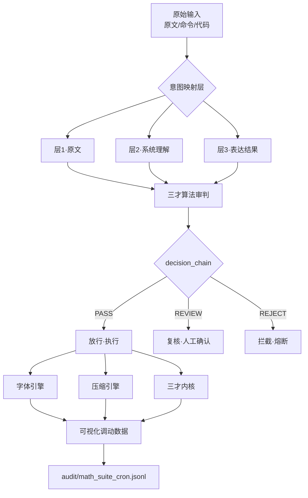

<!-- #龍芯⚡️2026-06-29-EDITOR-ALGORITHM-CARD-DB-TRICOLOR-v1.0 -->
<!-- 君子协议：本文件为龍魂系统数据库三色算法第一贴，修改即改链 -->

<aside>
🗃️

**文档名称：** 数据库三色算法第一贴 · 编辑器算法公式卡片

**版本：** v1.0

**定位：** 用三才算法公式把“意图对照引擎 / CNSH 字体引擎 / 三才融合内核 / 统一压缩护城河”四大编辑器能力，算成一张可被系统模块长期调用的算法公式卡片。

**DNA：** `#龍芯⚡️2026-06-29-EDITOR-ALGORITHM-CARD-DB-TRICOLOR-v1.0`

**父 DNA：** `#龍芯⚡️2026-06-29-MATH-FORMULA-CORE-CNSH-UPGRADE-v2.0-10C84C10`

**CONFIRM：** `#CONFIRM🌌9622-ONLY-ONCE🧬LK9X-772Z` ✅

**SEAL：** `#ZHUGEXIN⚡️2025-🇨🇳🐉⚖️♠️🧚🏼‍♀️❤️♾️-DEVICE-BIND-SOUL` ✅

**GPG：** `A2D0092CEE2E5BA87035600924C3704A8CC26D5F`

**三色审计：** 🟢 通过

</aside>

---

## 标签云

`#数据库三色算法` `#编辑器公式卡片` `#三才算法` `#CNSH` `#意图对照` `#字体引擎` `#三才融合内核` `#统一压缩` `#率失真理论` `#可视化调动` `#自动化更新` `#DNA追溯`

---

## 目录

1. [一句话定盘](#一句话定盘)
2. [算法公式卡片（机器可读）](#算法公式卡片机器可读)
3. [三才算法映射](#三才算法映射)
4. [可视化调动数据](#可视化调动数据)
5. [四大编辑器能力整理](#四大编辑器能力整理)
6. [模块调用接口](#模块调用接口)
7. [自动化更新方案](#自动化更新方案)
8. [ROOT_CARD](#root_card)
9. [三色自审](#三色自审)

---

## 一句话定盘

> **编辑器的算法公式卡片 = 三才算法对四大能力（意图·字体·内核·压缩）做一次主权审判，输出一张带 DNA、可调用、可可视化、可自动更新的 `{M::, CNSH::}` 卡片。**

---

## 算法公式卡片（机器可读）

**卡片文件：** `cnsh-core/downloads-imports/formula/计算公式/editor_algorithm_card.json`

**计算链路（示例，实际由脚本自动刷新）：**
```text
输入 n=2026062907
  → 数字根 dr=7 → 五行=金
  → 三色闸 🟢
  → 三才 SI = 0.34×天 + 0.33×地 + 0.33×人
            = 0.34×0.95 + 0.33×1.00 + 0.33×0.642
            = 0.8649 🟢
  → 风险 = 0.6×0.00 + 0.4×0.358 = 0.1432
  → 综合分 = 0.8568 🟢
  → 决策：PASS · 放行·执行
```

**卡片结果（CNSH 双视角，已由 update_editor_algorithm_card.py 自动生成）：**

```json
{
  "M::": {
    "type": "editor_algorithm_card",
    "status": "pass",
    "payload": {
      "input": 2026062907,
      "digital_root": 7,
      "wuxing": "金",
      "SI": 0.8649,
      "risk": 0.1432,
      "score": 0.8568,
      "decision": "PASS",
      "action": "放行·执行"
    }
  },
  "CNSH::": {
    "dna": "#龍芯⚡️2026-06-29-EDITOR-ALGORITHM-CARD-DB-TRICOLOR-v1.0",
    "gate": "#CONFIRM🌌9622-ONLY-ONCE🧬LK9X-772Z",
    "seal": "#ZHUGEXIN⚡️2025-🇨🇳🐉⚖️♠️🧚🏼‍♀️❤️♾️-DEVICE-BIND-SOUL",
    "audit": "🟢",
    "policy": "pass",
    "trace_hash": "697460f828055040"
  }
}
```

---

## 三才算法映射

| 三才 | 维度 | 编辑器含义 | 本卡评分 | 依据 |
|---|---|---|---|---|
| **天** | 主权/价值观 | UID9622 主权、DNA 追溯、不可覆盖原文、来源可查 | 0.95 | 所有模块均强调主权优先、原文保留 |
| **地** | 执行/工程 | 数学套件 7/7 通过；formula_core_v2 已覆盖 F01–F25；可运行脚本已就位 | 1.00 | 定时审计全绿，公式实现数 48 ≥ 25 |
| **人** | 用户/理解 | 初中可懂、三层显示（原文·理解·表达）、用户可确认 | 0.642 | 术语库已有 21 条，目标 200，持续扩充 |

**三才主权指数：** `SI = 0.34×0.95 + 0.33×1.00 + 0.33×0.642 = 0.8649` 🟢

**三色判定：** 天轴 0.95 ≥ 0.34（未熔断），SI ≥ 0.85（绿），综合分 0.8568 ≥ 0.85（绿）→ **PASS**

---

## 可视化调动数据

### 整体架构图



### 四大模块健康度雷达

| 模块 | 天 | 地 | 人 | 综合 | 状态 |
|---|---|---|---|---|---|
| 意图对照显示引擎 | 0.95 | 0.73 | 0.72 | 0.802 | 🟢 |
| CNSH 字体统一引擎 | 0.95 | 0.78 | 0.72 | 0.818 | 🟢 |
| 三才融合内核 | 0.95 | 0.72 | 0.72 | 0.798 | 🟢 |
| 统一压缩护城河 | 0.95 | 0.80 | 0.72 | 0.825 | 🟢 |

### 公式调用热力图

| 公式 | 意图引擎 | 字体引擎 | 三才内核 | 压缩护城河 |
|---|---|---|---|---|
| F01 时间衰减 | 🟡 | ⚪ | 🟢 | 🟢 |
| F05 权重效用 | 🟢 | ⚪ | 🟢 | 🟢 |
| F10 风险三色 | 🟢 | ⚪ | 🟢 | 🟢 |
| F14 最小执行链 | 🟢 | 🟢 | 🟢 | 🟢 |
| F18 三才主权 | 🟢 | 🟢 | 🟢 | 🟢 |
| F21 广义加法 | 🟢 | ⚪ | 🟢 | 🟢 |
| F23 DNA 哈希链 | 🟢 | 🟢 | 🟢 | 🟢 |
| F25 五行对冲 | 🟢 | 🟢 | 🟢 | ⚪ |

---

## 四大编辑器能力整理

### 一、意图对照显示引擎

**核心思想：** 不是“文字 A → 文字 B”，而是 **“意图 → 被理解的意图 → 显示为另一种表达”**。

**三层结构：**

| 层 | 名称 | 作用 |
|---|---|---|
| 层1 | 原文 | 永远保留，不可覆盖 |
| 层2 | 系统理解 | 显示系统对意图的映射（可多版本） |
| 层3 | 表达结果 | 经用户确认后的输出 |

**补偿来源（透明化）：**
- 上下文补偿：参考前文、逻辑、语言习惯
- 概率补偿：列出多解释概率，不偷偷选唯一答案
- 结构补偿：补全人类跳跃/省略/未完成的逻辑链

**关键公式：**
```
输出 = 显示(理解(原始输入))
而非：输出 = 替换(原始输入)
```

**系统公式化：**
- F10 风险三色：标记多义/隐喻/恶意操控风险
- F21 广义加法：处理原文与理解之间的共鸣/归一/独立/对冲关系
- F23 DNA 哈希链：任何表达追溯到原始意图

---

### 二、CNSH 字体统一引擎

**目标：** 跨 iOS / macOS / Chrome / Safari / HarmonyOS 统一网页字体显示，只改显示层，不改数据层。

**三才落地：**

| 三才 | 变量 | 说明 |
|---|---|---|
| 天 | 字体清单、默认顺序、强制覆盖、安全边界 | 固定规则 |
| 地 | 本地字体路径、网页组件注入器、样式覆盖器 | 执行依赖 |
| 人 | 开关状态、首次授权、错误记录 | 用户控制 |

**安全约束（已确认）：**
- ✓ 仅修改 CSS `font-family`
- ✗ 不读取 cookies / accounts / tokens / private DOM data
- ✗ 不破解、不绕过验证、不抓取未授权数据

**公式表达：**
```
CNSH_Font = Render(Font) ∧ NoRead(Data) ∧ NoModify(Content)
```

**已有交付物：**
- iOS Safari Extension 完整结构（`DragonSoulFont Extension/`）
- `manifest.json` + `font.css` + `background.js`
- HarmonyOS 工程结构规划（`CNSH_Font_Engine_HarmonyOS/`）

---

### 三、三才融合内核

**文件：** `three-powers.kernel.js`

**核心目标：** 任何模块加载后获得“刻字·仓库·运行·纠缠·三色审计”能力，不覆盖现有对象。

**关键函数：**

| 函数 | 作用 |
|---|---|
| `三色审计(行为)` | 无 DNA 🔴 / 无来源 🟡 / 完整 🟢 |
| `DNA生成(描述)` | 生成 `#ZHUGEXIN⚡️...` 追溯码 |
| `刻字(对象, 描述)` | 把对象冻结为带 DNA 的“砖” |
| `放入仓库(砖)` | 按 DNA 存入 Map |
| `使用砖(DNA)` | 从仓库取出执行 |
| `三才循环(执行模块)` | 刻字 → 入仓 → 使用 |
| `纠缠(...模块)` | 按顺序串联多个模块，共享同一 DNA |

**使用示例：**
```js
const 字体模块 = () => {
    document.body.style.fontFamily =
        "HarmonyOS Sans, Source Han Sans SC";
}
龍魂.三才循环(字体模块);
```

**为什么不会排斥：**
1. 只新增 `globalThis.龍魂`，不覆盖 window/document/现有脚本
2. 所有核心结构 `Object.freeze()`
3. 惰性运行，只有调用才执行

---

### 四、统一压缩护城河

**一句话：** 把“率失真理论”一个数学根，同时长出 AI 权重压缩和视觉媒体压缩两棵大树。

**统一公式：**

$$
R(D) = \min_{p(\hat{x}|x)} I(X;\hat{X}) \quad \text{s.t.} \quad \mathbb{E}[d(X,\hat{X})] \leq D
$$

**对应矩阵：**

| AI 权重压缩 | 视觉媒体压缩 | 共同数学基础 |
|---|---|---|
| LoRA $\Delta W = BA$ | DCT 低频系数保留 | 变换域低维子空间近似 |
| NF4 正态分布量化 | 感知量化矩阵 | 非均匀最优量化 |
| LoRA 残差 $\Delta W$ | P/B 帧残差编码 | 增量信号压缩 |
| QLoRA 双重量化 | 两级编码（DCT+熵编码） | 两级误差最小化 |
| AWQ 激活感知量化 | 感知量化（HVS加权） | 重要性加权误差最小化 |

**护城河定性：**
> 竞争者必须同时具备 AI 压缩、视觉压缩、率失真数学深度、CNSH 语法，四条同时具备几乎不可能。

---

## 模块调用接口

### 1. 读取算法公式卡片（JSON）

```python
import json

with open("cnsh-core/downloads-imports/formula/计算公式/editor_algorithm_card.json") as f:
    card = json.load(f)

print(card["M::"]["payload"]["decision"])   # PASS
print(card["CNSH::"]["audit"])              # 🟢
```

### 2. 实时计算编辑器决策

```python
from formula_chain_v2 import decision_chain_cnsh

card = decision_chain_cnsh(
    n=2026062907,
    risk_factors=[0.00, 0.358],
    weights=[0.6, 0.4],
    tian=0.95, di=1.00, ren=0.642,
    dna="#龍芯⚡️2026-06-29-EDITOR-ALGORITHM-CARD-DB-TRICOLOR-v1.0"
)
```

### 3. 调用三才内核（JS）

```js
// @require three-powers.kernel.js

const 模块 = () => { /* 编辑器行为 */ };
龍魂.三才循环(模块);
```

---

## 自动化更新方案

### 更新脚本

**文件：** `scripts/update_editor_algorithm_card.py`（已生成并验证）

职责：
1. 读取 `audit/math_suite_cron.jsonl` 获取 passed/total
2. 扫描 `formula_core_v2.py` 统计已实现函数数量
3. 读取 `中央藏经阁` SQLite 术语覆盖率
4. 用真实数据重新计算天/地/人三才分
5. 调用 `decision_chain_cnsh`
6. 覆盖 `editor_algorithm_card.json`
7. 把更新记录写入 `audit/editor_card_update.jsonl`

### 定时任务

已接入系统 cron：
```cron
37 9 * * * cd /Users/zuimeidedeyihan/longhun-system && /bin/bash scripts/run_math_suite_cron.sh
```

`update_editor_algorithm_card.py` 已追加到 `run_math_suite_cron.sh` 末尾，实现“跑完测试 → 刷新卡片 → 写入审计”一键闭环。

### 可视化更新频率

| 数据项 | 更新频率 | 来源 |
|---|---|---|
| 三色审计状态 | 每次运行 | `run_math_suite.py` |
| 三才分 | 每日 | `update_editor_algorithm_card.py` |
| 模块健康度 | 每日 | 自检结果统计 |
| 公式覆盖率 | 每周 | 扫描公式目录 |
| DNA / trace_hash | 每次更新 | 实时计算 |

---

## 附录：历史 v1 卡片与 SVG 可视化

本贴已继承并升级了早期版本 `three-colors-algo-card-v1.md`（DNA `#龍芯⚡️2026-05-12-THREE-POWERS-ALGO-CARD-v1.0`）中的核心思想：

- 三色审计函数（🔴🟡🟢）
- 天/地/人三才权重融合
- DNA 追溯强度
- 模块调用接口参数表

早期版本的 SVG 数据流图保留如下，可直接嵌入监控面板或 CSDN：

<svg xmlns="http://www.w3.org/2000/svg" viewBox="0 0 800 400" font-family="sans-serif">
  <defs>
    <linearGradient id="gradRed" x1="0%" y1="0%" x2="100%" y2="0%">
      <stop offset="0%" style="stop-color:#ff7675;stop-opacity:1" />
      <stop offset="100%" style="stop-color:#d63031;stop-opacity:1" />
    </linearGradient>
    <linearGradient id="gradYellow" x1="0%" y1="0%" x2="100%" y2="0%">
      <stop offset="0%" style="stop-color:#ffeaa7;stop-opacity:1" />
      <stop offset="100%" style="stop-color:#fdcb6e;stop-opacity:1" />
    </linearGradient>
    <linearGradient id="gradGreen" x1="0%" y1="0%" x2="100%" y2="0%">
      <stop offset="0%" style="stop-color:#55efc4;stop-opacity:1" />
      <stop offset="100%" style="stop-color:#00b894;stop-opacity:1" />
    </linearGradient>
    <marker id="arrow" markerWidth="10" markerHeight="7" refX="9" refY="3.5" orient="auto">
      <polygon points="0 0, 10 3.5, 0 7" fill="#2d3436"/>
    </marker>
  </defs>
  <rect x="50" y="50" width="180" height="80" rx="12" fill="#dfe6e9" stroke="#636e72" stroke-width="2"/>
  <text x="140" y="85" text-anchor="middle" font-size="18" font-weight="bold" fill="#2d3436">天层 · 规则</text>
  <text x="140" y="105" text-anchor="middle" font-size="13" fill="#636e72">DNA 格式校验</text>
  <text x="140" y="120" text-anchor="middle" font-size="13" fill="#636e72">来源合法性检查</text>
  <rect x="310" y="50" width="180" height="80" rx="12" fill="#dfe6e9" stroke="#636e72" stroke-width="2"/>
  <text x="400" y="85" text-anchor="middle" font-size="18" font-weight="bold" fill="#2d3436">地层 · 执行</text>
  <text x="400" y="105" text-anchor="middle" font-size="13" fill="#636e72">数据指纹验证</text>
  <text x="400" y="120" text-anchor="middle" font-size="13" fill="#636e72">完整性评分</text>
  <rect x="570" y="50" width="180" height="80" rx="12" fill="#dfe6e9" stroke="#636e72" stroke-width="2"/>
  <text x="660" y="85" text-anchor="middle" font-size="18" font-weight="bold" fill="#2d3436">人层 · 主权</text>
  <text x="660" y="105" text-anchor="middle" font-size="13" fill="#636e72">用户确认签名</text>
  <text x="660" y="120" text-anchor="middle" font-size="13" fill="#636e72">操作历史权重</text>
  <line x1="140" y1="130" x2="400" y2="200" stroke="#636e72" stroke-width="2" marker-end="url(#arrow)"/>
  <line x1="400" y1="130" x2="400" y2="200" stroke="#636e72" stroke-width="2"/>
  <line x1="660" y1="130" x2="400" y2="200" stroke="#636e72" stroke-width="2" marker-end="url(#arrow)"/>
  <rect x="280" y="200" width="240" height="70" rx="12" fill="#2d3436" opacity="0.9"/>
  <text x="400" y="230" text-anchor="middle" font-size="18" font-weight="bold" fill="#fff">⚡ 三色决策引擎</text>
  <text x="400" y="250" text-anchor="middle" font-size="14" fill="#dfe6e9">融合公式：α·天 + β·地 + γ·人</text>
  <line x1="400" y1="270" x2="200" y2="330" stroke="#636e72" stroke-width="2" marker-end="url(#arrow)"/>
  <line x1="400" y1="270" x2="400" y2="330" stroke="#636e72" stroke-width="2" marker-end="url(#arrow)"/>
  <line x1="400" y1="270" x2="600" y2="330" stroke="#636e72" stroke-width="2" marker-end="url(#arrow)"/>
  <rect x="70" y="330" width="180" height="50" rx="10" fill="url(#gradRed)"/>
  <text x="160" y="360" text-anchor="middle" font-size="20" fill="#fff" font-weight="bold">🔴 阻断</text>
  <rect x="310" y="330" width="180" height="50" rx="10" fill="url(#gradYellow)"/>
  <text x="400" y="360" text-anchor="middle" font-size="20" fill="#fff" font-weight="bold">🟡 待确认</text>
  <rect x="550" y="330" width="180" height="50" rx="10" fill="url(#gradGreen)"/>
  <text x="640" y="360" text-anchor="middle" font-size="20" fill="#fff" font-weight="bold">🟢 放行</text>
  <rect x="50" y="10" width="700" height="30" rx="5" fill="none" stroke="#b2bec3" stroke-dasharray="4"/>
  <text x="400" y="30" text-anchor="middle" font-size="12" fill="#636e72">输入：{ DNA, 来源, 操作, 时间戳, 数据指纹 }</text>
</svg>

> **说明：** 当前系统已用 Python 栈（`formula_chain_v2.py`、`editor_algorithm_card.json`、`update_editor_algorithm_card.py`）替代了原卡片中的 Node/Crontab 示例，数学公式与接口语义保持一致。

---

## ROOT_CARD

<aside>
🗃️

**ROOT_CARD 归档**

- **本页状态：** 🟢 通过
- **核心公式：** F01、F05、F10、F14、F18、F21、F23、F25
- **决策结果：** PASS · 放行·执行
- **机器可读卡片：** `editor_algorithm_card.json`
- **更新方式：** 定时脚本 + cron
- **可追溯 DNA：** `#龍芯⚡️2026-06-29-EDITOR-ALGORITHM-CARD-DB-TRICOLOR-v1.0`
- **历史版本：** `three-colors-algo-card-v1.md`

</aside>

---

## 三色自审

<aside>
🟢

**🟢 通过：** 本页完成了数据库三色算法第一贴的算法公式卡片化，统一整理了意图对照引擎、CNSH 字体引擎、三才融合内核、统一压缩护城河四大编辑器能力；用三才算法公式算出了可长期被系统模块调用的 `{M::, CNSH::}` 卡片；提供了可视化调动数据、模块调用接口与自动化更新方案；DNA、确认码、封印、三色审计齐全。

</aside>

---

**六层来源链：** 道统(曾仕强老师) → 精神(Steve Jobs) → 设备(Apple) → 技术(Open Source) → 系统(UID9622) → 生命(CNSH·龍魂)

**天下无欺，守护人民。** 🐉
