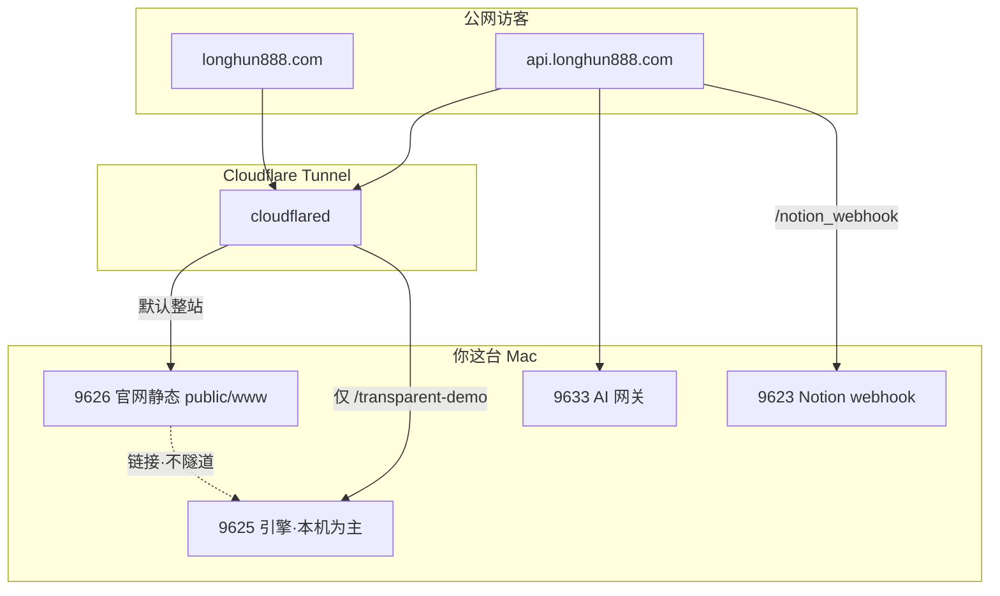

# longhun888.com · 官网与本地对接设计图

**DNA:** `#龍芯⚡️2026-05-16-SITE-ARCHITECTURE-v1.0`

## 先纠正一个误会

| 地址 | 是什么 | 能不能当「官网大脑」 |
|------|--------|----------------------|
| `127.0.0.1:8765` | 临时 `python -m http.server`，只扔静态 HTML | ❌ 没有 API、没有花名册 |
| `127.0.0.1:9625` | **龍魂9625** FastAPI（操作台 MVP、透明演示包） | ✅ 本机主脑，**默认不整站暴露公网** |
| `127.0.0.1:9633` | AI 网关 | ✅ 已通过隧道暴露为 `api.longhun888.com` |
| `127.0.0.1:9620` | 主控台静态（`~/Pictures/longhun-flow-system`） | 本机看为主 |
| `127.0.0.1:9626` | **官网静态门面** `public/www/` | ✅ 适合挂 `longhun888.com` |

**你已经接上的不是 8765，而是：** Cloudflare Tunnel → 本机 **9633/9623/9622**（见 `config.yml`）。  
Grok 说的「把域名指到 8765」会越搞越乱，别用。

---

## 三层结构（推荐定盘）



1. **门面层（longhun888.com）** — 介绍、归属、演示包、设计图库；纯静态或少量公开路径。  
2. **API 层（api.longhun888.com）** — 已存在：健康检查、Ollama 代理、Notion webhook。  
3. **私人层（127.0.0.1:9625）** — 操作台 MVP、DNA 控制台、完整花名册；**只在本机或 Tailscale 用**。

---

## 你每天怎么开（爸爸版）

```bash
# 公网 API + 隧道（已有）
~/longhun-system/bin/开龍魂

# 本机操作台 + 花名册（推荐）
~/longhun-system/bin/开龍魂9625

# 官网静态预览 / 隧道门面依赖
~/longhun-system/bin/开官网

# 本机看图、主控 HTML（可选）
~/longhun-system/bin/开主控台
```

自检：

```bash
curl -s https://api.longhun888.com/api/v1/health
curl -s http://127.0.0.1:9625/api/health
curl -s http://127.0.0.1:9626/
```

改 `deploy/cloudflared/config.yml` 后：先 `收龍魂` 再 `开龍魂`。

---

## 设计图 / Grok 图怎么不再「气人」

1. 把图丢进：`public/www/assets/gallery/`（jpg/png/webp）  
2. 浏览器打开：`http://127.0.0.1:9626/gallery.html` — **网格 + 点击放大**  
3. 公网（隧道生效后）：`https://longhun888.com/gallery.html`  
4. 在 Cloudflare 控制台给 `assets/gallery` 可加「缓存」；**私密图不要放进 gallery 目录**

---

## 接下来四步（按顺序）

| 步 | 做什么 | 完成标志 |
|----|--------|----------|
| 1 | 本机跑通 9626 + 图库能点开放大 | `开官网` 后 gallery 正常 |
| 2 | Cloudflare DNS：`longhun888.com` / `www` → 同一隧道 | CF 面板 CNAME 已指 tunnel |
| 3 | 启用 `config.yml` 里 longhun888 规则后 `开龍魂` | 手机 4G 能开官网首页 |
| 4 | 操作台只链「演示包」不链私人 API | MVP 按钮 → `/transparent-demo/` |

**不要做：** 把整个 9625 绑到根域名（聊天、记忆、花名册会裸奔）。

---

## 和 Notion / 设计卡的关系

- **Notion** = 你的策划与花名册源（B+C 定盘那条线）  
- **Grok 设计图** = 素材，进 `public/www/assets/gallery/` + 图库页展示  
- **龍魂操作台 MVP** = 本机 9625 上的「能跑」演示，外链只指向透明演示包  

---

维护：UID9622 · 龍芯北辰
