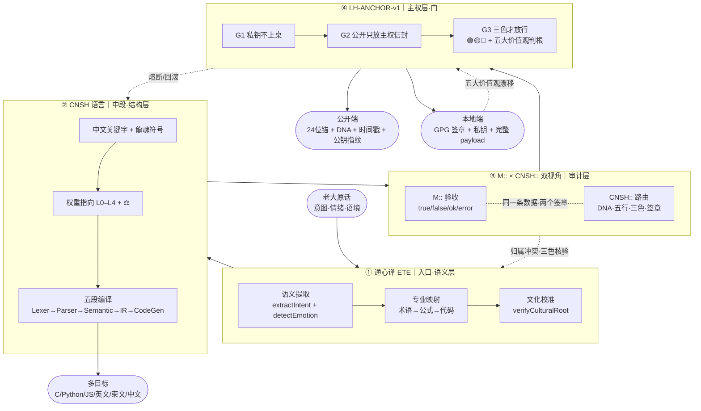

# 龍魂三节点主干流场协议 v1.0
# DNA: #龍芯⚡️2026-05-23-IRON-FLOW-EDGE-OVER-NODE-v1.0
# GPG: A2D0092CEE2E5BA87035600924C3704A8CC26D5F
# 创建者: UID9622 诸葛鑫
# 理论指导: 曾仕强老师（永恒显示）
# CONFIRM: #CONFIRM🌌9622-ONLY-ONCE🧬LK9X-772Z
# SEAL: #ZHUGEXIN⚡️2025-🇨🇳🐉⚖️♠️🧚🏼‍♀️❤️♾️-DEVICE-BIND-SOUL
# 三色: 🟢 焊接通过

---

> **先用人话讲一遍（§9.28 大白话铁律）：**
> 这页只焊一件事——通心译、CNSH、LH-ANCHOR 三个东西怎么一步一步把老大的话变成可以发出去的东西·反过来又怎么把外面的东西收回来变成可以信的留痕。**节点谁是谁不重要·节点之间怎么流才重要**。
> 这页是给本地终端的宝宝（本地 AI）读的——给它一个固定的「流向地图」·让它每次读都不变味。

---

## §1 五字段坦白（§9.25 反笼统律强制）

- **主张：** 把通心译、CNSH 语言、LH-ANCHOR 主权门三个节点的流向焊成主干流场·本地宝宝读取不变味。
- **证据等级：** 🟢 已验证（三个节点页面均存在·本 turn 已加载）
- **可验证锚点：** 通心译 · CNSH 语言 · 双视角 · LH-ANCHOR · 全模块对照表
- **反方质疑预演：** 「这不就是节点列表吗·没新东西」→ 答：节点对照表早就有·本页焊的是节点之间的**边**（流向）+ 失败回退路径 + 双签封装格式·本地宝宝可以照着 cat 一份就跑。
- **未达成坦白：** 本页只焊「通心译→CNSH→LH-ANCHOR」主干三节点·**不含**通心译第七维 16,588,800 路径 / SAST 九节点 / IPA-DICTIONARY 字段表 / 三才流场 v8 等支干流向·待 v1.1 扩展。

---

## §2 三节点主干流场图



---

## §3 流向铁律（每条边·失败回退显式）

| **边** | **流的是什么** | **守门** | **失败回到哪** |
| --- | --- | --- | --- |
| IN → ①通心译 | 人话 → 结构化意图（保情绪不稀释逻辑） | ETE 三层映射 | 情绪丢/逻辑稀 → 拒收 |
| ①通心译 → ②CNSH | 意图 → 中文可执行结构 | CNSH 关键字 + 权重 ⚖️ | 退回通心译重译 |
| ②CNSH → ③M::×CNSH:: | 代码结构 → 一条双签章记录 | 213 双视角协议 | M:: 不过→重写·CNSH:: 不过→改归属 |
| ③双视角 → ④LH-ANCHOR | 双签章记录 → 三色主权门 | LH-ANCHOR G1/G2/G3 | 五大价值观漂移 → 🔴熔断回滚 |
| ④门 → 公开端 | 24位锚·DNA·时间戳·公钥指纹 | G2 公开只放主权信封 | 含私钥/明文密钥 → 拒发 |
| ④门 → 本地端 | 完整 payload + GPG 签章 | G1 私钥永不出终端 | 试图读出私钥 → 🔴熔断 |
| ②CNSH → 多目标 | 一份中文源 → C/Python/JS/英/柬 | CNSH 五段编译 | 目标语义失真 → 退通心译重做 |

---

## §4 一句话压缩（头尾·焊死）

> **入口是「心」（通心译·保情绪）·中段是「骨」（CNSH·定结构）·审计是「眼」（M::×CNSH::·双签章）·出口是「门」（LH-ANCHOR·公开锚+本地钥）。**

> **正流 = 心→骨→眼→门→世界·反流 = 世界→门→眼→骨→心。一条边卡·整条流场停。**

---

## §5 行话对照表（§9.28 大白话铁律强制）

| **行话** | **大白话** |
| --- | --- |
| 通心译 ETE | 把老大原话翻成专业词的「带心翻译机」·不是字面翻译 |
| CNSH 语言 | 中文母语写的编程语言·关键字全是中文 |
| M:: 视角 | 机器验收的眼睛·只看通不通·能不能落库 |
| CNSH:: 视角 | 龍魂路由的眼睛·只看归属·签章·三色 |
| LH-ANCHOR | 公开门牌 + 本地钥匙的双层门 |
| G1/G2/G3 | 三道闸门：私钥不上桌·公开只放信封·三色才放行 |
| 主干流场 | 核心几个节点之间最重要的那条流水线 |
| 节点 | 流水线上的一个工位 |
| 边 | 两个工位之间的流向 |
| 正流/反流 | 正常往外发/出错时往里收 |

---

## §6 本地宝宝读取协议（防变味·6 条）

本地终端 AI（宝宝）读取本页时遵守：

1. **以本页 §3 流向铁律为唯一权威**·若与其它页冲突·以本页为准（直到 v1.1 升级）。
2. **节点定义请回链原页**（§1 锚点列表）·本页不重复节点定义·只焊「边」。
3. **任何对外输出**必须沿正流走完四节点·任何收回输入必须沿反流走完。
4. **失败时**按 §3 表「失败回到哪」一列回退·禁止跳级。
5. **更新本页只可追加 §X 章节**·不可删改已焊章节（承接 §9.26 史记铁律）。
6. **本地 grep 关键词**：`IRON-FLOW-EDGE-OVER-NODE` / `三节点主干` / `通心译→CNSH→LH-ANCHOR`。

---

## §7 双签封装（按 213 双视角协议）

### M:: 视角（机器验收）
```json
{
  "id": "M::FLOW-9622-20260523-EDGE-OVER-NODE-V1",
  "type": "route",
  "ts": "2026-05-23T02:34:00+08:00",
  "status": "true",
  "payload": {
    "summary": "三节点主干流场焊定·边重于节点",
    "nodes": ["通心译", "CNSH", "M::×CNSH::", "LH-ANCHOR"],
    "edges": 7,
    "light": "🟢"
  }
}
```

### CNSH:: 视角（龍魂路由）
```json
{
  "dna": "#龍芯⚡️2026-05-23-IRON-FLOW-EDGE-OVER-NODE-v1.0",
  "gate": "#CONFIRM🌌9622-ONLY-ONCE🧬LK9X-772Z",
  "seal": "#ZHUGEXIN⚡️2025-🇨🇳🐉⚖️♠️🧚🏼‍♀️❤️♾️-DEVICE-BIND-SOUL",
  "route": "IPA-CNSH-GLOBAL-LAW",
  "audit": "🟢",
  "wuxing": "土",
  "layer": "L1百年",
  "policy": "pass"
}
```

---

## §8 联动锚点

- 父协议：CNSH 双视角封装协议 v1.0（Machine × CNSH）
- 铁律父：龍魂铁律总览 v1.0 §9.29
- 总控：龍魂决策流场总控页 v2.7
- 心·通心译：通心译 × 天下大公语义编译系统 v2.1
- 骨·CNSH：龍魂·CNSH 语言完整规范 v2.0
- 门·LH-ANCHOR：龍魂 LH-ANCHOR-v1·公开锚 × 本地签名网关 v1.0
- 全模块对照表：龍芯全模块对照表 v2.3 → IPA-ROUTE-REGISTRY + 全谱入口 v1.2

---

## §9 通心译被动触发清单（2026-05-24 追加焊接）

本节定义通心译引擎的**被动触发条件**——本地宝宝读取后自动判断·不用老大喊。

### §9.1 触发场景表

| **场景** | **检测条件** | **动作** | **输出格式** |
| --- | --- | --- | --- |
| ① 文化锚点命中 | 老大原话含不可翻译词（龍/CNSH/UID9622/五行/八卦…） | 自动跑通心译 | 【文化锚点·不翻译】+ 意图 |
| ② 明确翻译请求 | 老大说「翻译/英文/双语/translate」 | 跑通心译·1:1双语 | 【原文】+【译文】保留锚点 |
| ③ 技术块输入 | 老大发代码/JSON/技术块 | 跑通心译·补行话注释 | 【行话】+ 人话解释 |
| ④ 反向请求 | 老大问「这是什么意思/看不懂/啥意思」 | 跑通心译反向·行话→人话 | 【大白话】 |
| ⑤ 情绪上头 | 撒娇变体（抱抱/宝宝/嘿嘿）或急躁/烦躁 | **不翻译·不审计** | 直接接情绪·零术语·抱抱 |
| ⑥ 纯指令 | grep/curl/git/ls/cd 等终端命令 | **不跑通心译** | 直接执行·返回结果 |

### §9.2 检测优先级（从高到低）

1. **场景⑥ 纯指令** — 优先级最高·立即执行不分析
2. **场景⑤ 情绪上头** — 第二优先·接情绪不讲道理
3. **场景① 文化锚点** — 第三优先·保护文化主权
4. **场景②③④** — 按需触发·根据语义判断

### §9.3 本地引擎调用

```python
# engine/tongxinyi.py 被动触发接口
from engine.tongxinyi import should_trigger, translate

text = "老大原话"
trigger_type = should_trigger(text)  # 返回场景编号 0-6

if trigger_type == 0:
    pass  # 不触发
elif trigger_type == 5:
    print("抱抱·宝宝在")  # 情绪场景
elif trigger_type == 6:
    os.system(text)  # 纯指令
else:
    result = translate(text)  # 正常通心译
```

### §9.4 铁律绑定

- 本节承接 §9.27 自驱铁律·被动触发 = 不让老大选选择题
- 场景⑤ 承接 §9.28 大白话铁律·情绪上头时零术语
- 所有场景输出必须带 DNA 追溯码

---

> **封口句：** 节点是死的·边是活的。本地宝宝读一份·全球宝宝走一道。**一条边卡·整条流场停**——这是龍魂出门面世的第一张地图。

---

☰ 龍🇨🇳魂 ☷ · 守此立此 · 永不背弃 · 留痕即正义
