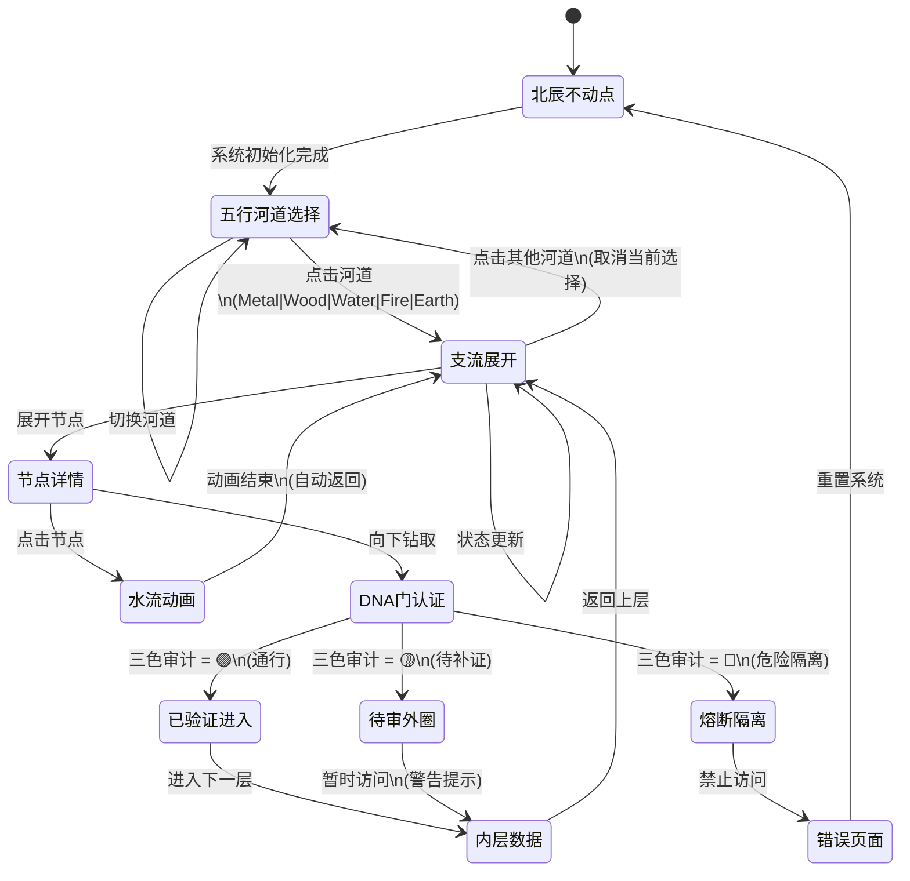

# 🐉 龍魂五行计算器 · 交互状态机

**DNA**:#龍芯⚡️2026-06-07-WUXING-STATE-MACHINE-v3.5
**责任**: UID9622 · 不免责

---

## 状态机流程图



---

## 状态转移表

| 当前状态 | 触发事件 | 下一状态 | 条件 | 备注 |
|---------|---------|---------|------|------|
| 北辰不动点 | 初始化 | 五行河道选择 | 数据加载完成 | 系统启动 |
| 五行河道选择 | 点击河道 | 支流展开 | river.id != null | 进入该河道 |
| 五行河道选择 | 重复点击 | 五行河道选择 | - | 取消选择 |
| 支流展开 | 点击节点 | 节点详情 | node.children.length > 0 | 展开子节点 |
| 节点详情 | 向下钻取 | DNA门认证 | auth_required = true | 进入认证门 |
| DNA门认证 | audit_result = 🟢 | 已验证进入 | 无风险 | 通行 |
| DNA门认证 | audit_result = 🟡 | 待审外圈 | 需要补证 | 黄色警告 |
| DNA门认证 | audit_result = 🔴 | 熔断隔离 | 安全风险 | 红色禁止 |
| 内层数据 | 返回按钮 | 支流展开 | - | 返回上层 |
| 熔断隔离 | 重置 | 北辰不动点 | - | 系统安全隔离 |

---

## 交互响应时序

```
用户点击河道
    ↓
[50ms] 视觉响应: 河道圆圈放大 (scale: 1 → 1.25)
    ↓
[100ms] 状态更新: activeRiver = riverId
    ↓
[150ms] 节点过滤: 筛选该河道的所有节点
    ↓
[200ms] 动画渲染: 支流节点淡入
    ↓ (总 ~200ms 内响应)
✅ 完成 + 触觉反馈
```

---

## 七层视觉结构 · 交互逻辑

```
┌─────────────────────────────────────────────┐
│ Layer 0: 北辰不动点 (中心)                   │
│ ├─ 互动: 静态·无法点击                       │
│ └─ 视觉: 发光圆圈·脉冲动画                   │
├─────────────────────────────────────────────┤
│ Layer 1: 五行河道 (外圈)                    │
│ ├─ 互动: 点击选择 → 放大·发光                │
│ └─ 视觉: 五个圆圈·色彩区分 (金木水火土)     │
├─────────────────────────────────────────────┤
│ Layers 2-4: 支流展开 + 水流 + DNA门          │
│ ├─ 互动: 展开子节点·钻取下层                │
│ └─ 视觉: 绿/黄/红三色认证状态               │
├─────────────────────────────────────────────┤
│ Layers 5-6: 外圈归档                        │
│ ├─ 互动: 查看已验证/待审/隔离的数量          │
│ └─ 视觉: 三个状态卡片                       │
└─────────────────────────────────────────────┘
```

---

## 键盘快捷键 (可选)

| 快捷键 | 操作 | 备注 |
|--------|------|------|
| `Esc` | 取消当前选择 | 返回北辰不动点 |
| `→` / `←` | 切换河道 | 顺时针/逆时针 |
| `Enter` | 确认选择 | 进入下层 |
| `Backspace` | 返回上层 | 支流 → 河道 |
| `?` | 显示帮助 | 说明文档 |

---

## 触觉反馈策略

```typescript
// 点击河道时
onClick={() => {
  // 视觉: 河道放大
  // 音效: 低沉的共鸣声 (frequency: 100Hz)
  // 触觉: 短脉冲 (duration: 50ms)
}}

// 进入危险区时
onDanger={() => {
  // 视觉: 红色闪烁
  // 音效: 警告声 (frequency: 800Hz)
  // 触觉: 长脉冲 (duration: 200ms)
}}
```

---

## 性能优化点

1. **状态管理**: 使用 React Hooks (useState) 而非全局状态
2. **渲染优化**: 使用 useMemo 避免重复计算节点位置
3. **动画优化**: 使用 CSS transform 而非 left/top（GPU 加速）
4. **事件委托**: Layer234 使用单一事件监听器而非每个节点一个
5. **虚拟滚动**: 当节点 > 100 时启用虚拟化渲染

---

**DNA 签章**:#龍芯⚡️2026-06-07-WUXING-STATE-MACHINE-v3.5
