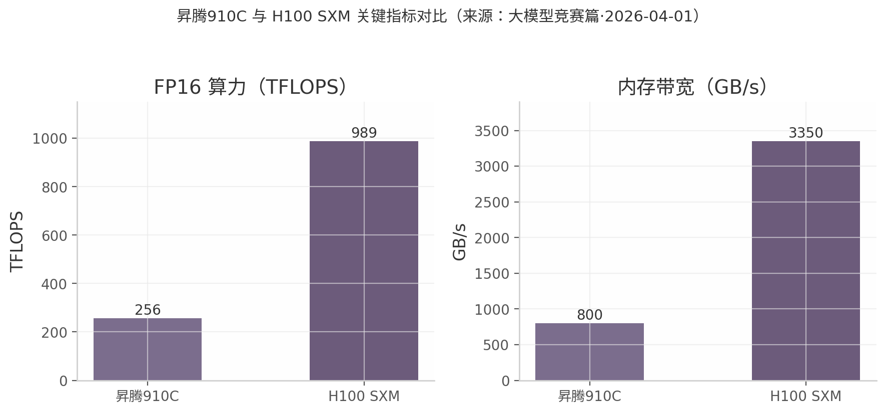
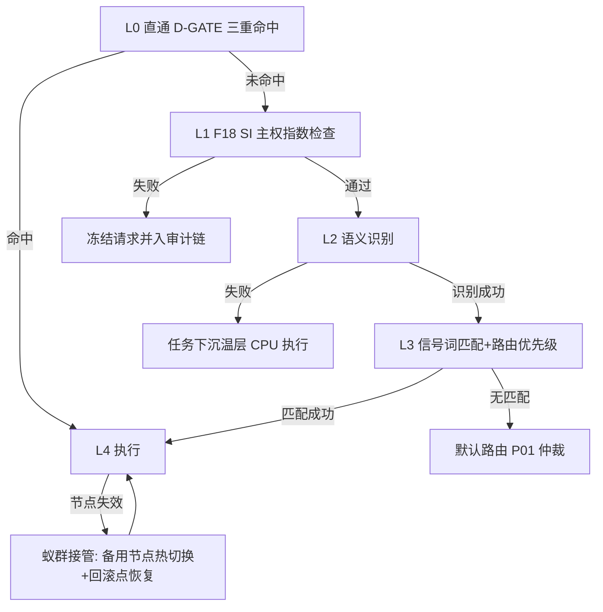

# 第三章 进阶破解四刀

本章是全文攻击面。第二章已建立温度四层调度模型与目标函数，本章用它逐刀破解四个硬问题：硬件差距、软件生态、调度黑箱、单点故障。每刀固定三段式——问题定义 → 机制 → 工程含义；推演内容一律以"推演假设："明示，实料数据标注来源。本章 DNA：`#龍芯⚡️丙午·乙未·辛酉·姤-TAO-LAW-INTEGRATED-v2.2`。

## 破解一·硬件差距：用效率路线摊平 4 倍名义差

**问题定义。** 昇腾910C 与 H100 SXM 在两项关键指标上存在约 4 倍名义差距：FP16 算力 256 vs 989 TFLOPS，内存带宽 800 vs 3350 GB/s；HBM 容量 64 vs 80 GB，差距较小（来源：大模型竞赛篇·2026-04-01）。

| 指标 | 昇腾910C | H100 SXM | 名义差距 |
|---|---|---|---|
| FP16 算力（TFLOPS） | 256 | 989 | ≈3.9 倍 |
| 内存带宽（GB/s） | 800 | 3350 | ≈4.2 倍 |
| HBM 容量（GB） | 64 | 80 | ≈1.3 倍 |
| 软件栈 | CANN | CUDA | 定性差距，见破解二 |

该表三点结论：算力与带宽同处 4 倍量级，瓶颈在整体互联与算力密度而非单一部件；HBM 容量接近，大模型推理的显存门槛并非不可跨越；真正的结构性差距在软件栈一行——硬件可追赶，生态迁移成本才是长坡。破解路径因此不能在硬件参数上硬拼，必须在效率侧下手。

*图 3-1：昇腾910C 与 H100 SXM 关键指标对比（来源：大模型竞赛篇·2026-04-01）。*

**机制。** 核心命题：算力被卡 ≠ 能力被卡（来源：大模型竞赛篇·2026-04-01）。效率技术栈四件套——MoE（混合专家，每次前向只激活少数专家，降低单 token 实际算力消耗）；MLA（多头潜注意力，压缩 KV 缓存，推理显存降约 40%）；GRPO（免 Critic 网络的强化学习方法，省一份模型显存）；FP8 混合精度（同等显存下吞吐近似翻倍）。推演假设：设效率系数 $k$ 为效率路线对算力需求的压缩倍率，则有效差距为名义差距除以效率收益：

$$D_{\text{eff}} = \frac{D_{\text{nominal}}}{k_{\text{MoE}} \cdot k_{\text{MLA}} \cdot k_{\text{FP8}}} = \frac{4}{k},\quad k \in [5, 10]$$

按底料给出的 MoE 使有效算力需求降 5–10 倍（来源：大模型竞赛篇·2026-04-01），$D_{\text{eff}}$ 落入 $[0.4, 0.8]$ 区间——有效差距被摊平至 1 以内，即效率路线可覆盖名义硬件差。

**工程含义。** 调度层据此改写路由规则——凡可走 MoE/FP8 推理路径的任务，不因名义算力低而判为"不可用"；温度分层只按延迟需求切，不按纸面 TFLOPS 切。硬件差距从定性否决项降级为"排队多久"的定量问题，交给第二章目标函数求解。

## 破解二·软件生态：CNSH 语义层封装 CANN

**问题定义。** 破解一已指出：CANN vs CUDA 是真正差距（来源：大模型竞赛篇·2026-04-01）。CANN（昇腾异构计算架构）的算子完备度与社区生态均弱于 CUDA，直接后果是模型移植成本高、调试链路长、依赖稀缺经验。

**机制。** 工程方案：引入 CNSH（Chinese Semantic Shell，中文语义层封装）——在 CANN 之上加一层中文语义接口，把算子调用、设备分区、内存策略封装为中文命令与声明式配置。适配路径分三级：一级，高频算子（MatMul/Attention/归一化）算子级直译映射；二级，框架层（PyTorch→torch_npu）迁移脚本模板化；三级，长尾算子回退鲲鹏 CPU 执行，由温度分层自动沉入温层。边界约定：只封装调度所需的最小算子集，不做全生态复制。

**工程含义。** 生态差距被转化为接口工程问题：CANN 的不足不再暴露给上层调度与审计，工程师面对的是稳定的中文语义面。具体命令行与部署脚本按章节边界留待第四章。

## 破解三·调度黑箱：零黑箱承诺工程化

**问题定义。** P0 焊死底座含零黑箱承诺：任何调度决策必须可追溯到字段级证据。芯片级调度涉及任务温层迁移、设备分配、优先级抢占，若无审计面，调度中心即成新黑箱。

**机制。** 复用龍魂已有三件套焊接到调度事件流：DNA 追溯码标识决策版本与动作；sha256 审计链逐条哈希串联调度日志；回滚点 RB-* 提供状态恢复锚；因果图 GRAPH-NODE-* 记录决策依赖（来源：冷热分层存储策略 STORAGE-TIER-CONFIG-20260219-006）。审计链字段表：

| 字段 | 示例 | 用途 |
|---|---|---|
| `dna` | `#龍芯⚡️丙午·乙未·辛酉·姤-TAO-LAW-INTEGRATED-v2.2` | 决策版本与动作定位 |
| `prev_hash` | `sha256:9622DB…` | 前序日志哈希，防篡改串联 |
| `rollback` | `RB-STORAGE-TIER-20260219-006` | 故障时状态回滚锚点 |
| `cause_node` | `GRAPH-NODE-STORAGE-TIER-006` | 决策因果依赖索引 |
| `usage` | 任务能耗 $E_i \cdot t_i$ 数值 | 只传用量不传内容 |

审计规则：每次温层迁移、优先级抢占、L0 直通均生成一条上述结构日志，任一字段缺失即拒绝入账——审计完整性由格式校验焊死，不靠人工自觉。

**工程含义。** 零黑箱从承诺变为可验证的字段协议：P05 上帝之眼审计（来源：龍芯家族调度中心宪章 v1.0·IRON #23）可直接对链做哈希校验，任何一跳对不上即冻结对应决策流，符合 P0"不删除只冻结"。

## 破解四·单点故障：蚁群冗余 + 安全降级链

**问题定义。** 单一调度中心、单一 NPU 节点、单一模型实例均构成单点。龍魂体系既有解法是蚁群分布式冗余与红蓝对抗良性竞争（来源：研究底料第 1 节），本章将其对齐到芯片级执行链。

**机制。** 冗余策略：每个热层任务保留 $n \geq 2$ 个可接管节点（蚁群冗余），红蓝对抗定期注入节点失效、日志篡改、L0 滥用三类故障做演练。降级链严格对齐 IRON #22 五级优先级链（来源：龍芯家族调度中心宪章 v1.0·IRON #22），任一层失败即启动对应层安全降级，不可逆序、不可跳级，除非 L0 授权：

**工程含义。** 降级不是服务中断，而是沿温度四层向下滑档——热层失效降温层，温层失效降冷层批处理，全程日志入审计链并在回滚点 RB-* 续跑。单点故障从"系统死"降级为"延迟增加"，与破解一闭环：四个硬问题最终都被转化为调度目标函数里的定量代价，而非体系级否决项。

---

