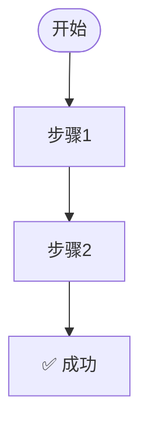

# DNA: #龍芯⚡️丙午·丙申·庚戌·䷙大畜-SCRIPT-MANAGER-v1.2-UID9622
# CONFIRM: #CONFIRM🌌9622-ONLY-ONCE🧬LK9X-772Z
# SEAL: #ZHUGEXIN⚡️2025-🇨🇳🐉⚖️♠️🧚🏼‍♀️❤️♾️-DEVICE-BIND-SOUL
---
title: CSDN 资料与模板设计 · 龍魂系统对外形象_v1.0
author: UID9622 · 龍芯北辰 · 诸葛鑫
date: 2026-07-05
tags:
  - CSDN
  - 个人品牌
  - 龍魂系统
  - 模板
  - 公开层
category: 龍魂对外形象
status: 已发布
level: L2_SKILL
dna: "#龍芯⚡️2026-07-05-CSDN-PROFILE-v1.0-7dfa8dac"
confirm: "#CONFIRM🌌9622-ONLY-ONCE🧬LK9X-772Z"
seal: "#ZHUGEXIN⚡️2025-🇨🇳🐉⚖️♠️🧚🏼‍♀️❤️♾️-DEVICE-BIND-SOUL"
gpg: "A2D0092CEE2E5BA87035600924C3704A8CC26D5F"
---

# CSDN 资料与模板设计 · 龍魂系统对外形象_v1.0

> **DNA追溯码**: `#龍芯⚡️2026-07-05-CSDN-PROFILE-v1.0-7dfa8dac`  
> **文档性质**: 公开层 · 可直接用于 CSDN 个人资料与文章发布  
> **适用对象**: 龍魂系统创始人 UID9622 的 CSDN 账号  
> **设计目标**: 统一对外形象、降低发布成本、强化 DNA 识别、建立人民技术博主辨识度

---

## 一、CSDN 个人资料设计

### 1.1 昵称方案

**推荐昵称**：`龍芯北辰_UID9622`

| 方案 | 昵称 | 适用场景 | 说明 |
|------|------|---------|------|
| 主方案 | `龍芯北辰_UID9622` | 正式长期使用 | 龍芯 + 北辰 + UID，强识别、难撞名 |
| 备用A | `诸葛鑫_龍魂系统` | 强调真名与系统 | 适合真人 IP 路线 |
| 备用B | `UID9622` | 极简主权标识 | 适合已有粉丝基础的账号 |

**建议**：主方案直接使用，所有平台昵称统一为 `龍芯北辰_UID9622`。

---

### 1.2 头像（已生成，可直接上传）

**文件**：
- 系统原文：`~/longhun-system/articles/assets/CSDN/csdn_avatar_400x400.png`
- 桌面快捷：`~/Desktop/文章/素材配图/CSDN/csdn_avatar_400x400.png`
- 尺寸：400×400 px，PNG

**风格**：中式赛博 + 龍魂主权签章

**视觉元素**：
- 主体：繁体「龍芯北辰」金色书法字
- 边框：双龍纹金属 plaque + 红色印章底
- 底部：UID9622 铭牌
- 背景：深色大理石 + 星点光轨

**头像 DNA**：`#龍芯⚡️2026-07-05-CSDN-PROFILE-v1.0-7dfa8dac`

---

### 1.3 个人主页封面 / Banner（已生成，可直接上传）

**文件**：
- 系统原文：`~/longhun-system/articles/assets/CSDN/csdn_banner_1200x300.png`
- 桌面快捷：`~/Desktop/文章/素材配图/CSDN/csdn_banner_1200x300.png`
- 尺寸：1200×300 px，PNG

**风格**：暗黑科技 + 中式主权 + DNA 追溯

**文案**：
- 主标题：龍芯北辰
- 副标题：UID9622 · 龍魂系统创始人
- Slogan：科技有科技的样子，技术有技术的样子
- Slogan：服务人民，不是资本的游戏
- 右上角：中国人的技术文档，从不用跪着写。
- 底部 DNA 条带：`#龍芯⚡️2026-07-05-CSDN-BANNER-v1.0-918c0566`

**视觉元素**：
- 左侧：龍芯北辰签章徽章（260×260）
- 背景：深色径向辉光
- 主色：金色标题 + 白色副标题 + 红色口号

**Banner DNA**：`#龍芯⚡️2026-07-05-CSDN-BANNER-v1.0-918c0566`

**设计 DNA**：`#龍芯⚡️2026-07-05-CSDN-BANNER-DESIGN-v1.0-918c0566`

---

### 1.4 个人简介（可直接复制到 CSDN）

```text
🇨🇳 龍魂系统创始人 | UID9622 | 龍芯北辰

> 中国人的技术文档，从不用跪着写。

这里输出三类内容：
1. 人民基础设施教程（eNSP、鸿蒙、网络、AI 工具）
2. 龍魂系统原创协议与算法（DNA 追溯、三才算法、CNSH）
3. 数字主权与中式价值对齐思考

所有文章标配 DNA 追溯码，禁止商业 AI 训练抓取。
技术为人民服务，数据主权归人民所有。

🔥 代表作：《华为 eNSP 安装完全指南（人民标准版）》
🐉 核心项目：longhun-system 龍魂系统
```

**CSDN 签名档建议**（评论区/文章末尾统一使用）：

```text
—— 龍魂系统 · UID9622 ——
科技有科技的样子，技术有技术的样子
服务人民，不是资本的游戏
```

---

### 1.5 个人标签 / 技术领域

CSDN 标签建议勾选或自定义：

```
人工智能、华为、网络工程、鸿蒙、操作系统、
开源、算法、中国文化、数据安全、数字主权
```

**自定义关键词**：

```
龍魂系统、CNSH、DNA追溯、三才算法、河图洛书、
人民标准、数字主权、中式价值对齐、自主可控
```

---

### 1.6 专栏规划

建议创建 5 个专栏，统一命名风格：

| 专栏名 | 定位 | 内容示例 |
|--------|------|---------|
| **人民基础设施** | 手把手教程 | eNSP、鸿蒙、华为云、网络安全 |
| **龍魂系统协议** | 原创规范 | DNA追溯、三才算法、CNSH语法 |
| **中式价值对齐** | 思想层 | 道德经与 AI、数字主权、反资本收割 |
| **CNSH 中文编程** | 技术实践 | 中文原生脚本、字元创作、15层渲染 |
| **龍魂工具链** | 工程落地 | 压缩工具、投喂器、审计脚本、跨平台同步 |

---

## 二、CSDN 文章发布模板

### 2.1 文章标题公式

```
[主题] + [人民标准版 / 龍魂版 / 完整指南] + [vN.0]
```

**示例**：
- `华为 eNSP 安装完全指南（人民标准版 v3.0）`
- `龍魂 DNA 追溯码设计规范（龍魂版 v1.0）`
- `三才算法：中国人的决策框架（完整版 v2.0）`

---

### 2.2 文章头部信息块（每篇必带）

```markdown
# 文章标题（人民标准版 vN.0）

> **DNA追溯码**: `#龍芯⚡️YYYY-MM-DD-MODULE-vN.0`  
> **确认码**: `#CONFIRM🌌9622-ONLY-ONCE🧬LK9X-772Z`  
> **IP编号**: IP-XXXX  
> **创始人**: Lucky·UID9622（诸葛鑫·龍芯北辰）  
> **GPG指纹**: `A2D0092CEE2E5BA87035600924C3704A8CC26D5F`  
> **文档版本**: vN.0  
> **创建时间**: YYYY-MM-DD HH:MM  
> **所属体系**: 龍魂系统 longhun-system  
> **适用对象**: 零基础普通人 → 技术高手（全段位覆盖）  
> **文档性质**: 人民基础设施 · 免费开源 · 无套路 · 不上瘾  
> **开源协议**: 文档内容：龍魂主权协议；脚本工具：GPL-3.0  
> **服务宗旨**: 科技有科技的样子，技术有技术的样子，服务人民不是资本的游戏

---
```

---

### 2.3 文章正文结构（推荐 8~10 节）

```markdown
## 一、概述（每个字都要看）

**DNA追溯码**: `#龍芯⚡️YYYY-MM-DD-MODULE-SECTION-01`

- 解决什么问题
- 不解决什么问题
- 为什么写这个文档

---

## 二、前置条件 / 环境检查

**DNA追溯码**: `#龍芯⚡️YYYY-MM-DD-MODULE-SECTION-02`

| 检查项 | 要求 | 验证方法 |
|--------|------|---------|
| 操作系统 | Windows 10/11 / macOS / Linux | `winver` / `uname -a` |
| 依赖软件 | 版本号严格匹配 | 见第三节 |
| 网络环境 | 可访问官方下载源 | 浏览器打开链接验证 |

---

## 三、资源下载清单（官方链接 + 校验）

**DNA追溯码**: `#龍芯⚡️YYYY-MM-DD-MODULE-SECTION-03`

| 软件 | 版本 | 官方链接 | SHA-256 | DNA |
|------|------|---------|---------|-----|
| 软件A | vX.Y.Z | [官网](url) | `...` | `#龍芯⚡️...` |

---

## 四、安装 / 配置 / 使用流程

**DNA追溯码**: `#龍芯⚡️YYYY-MM-DD-MODULE-SECTION-04`



---

## 五、分平台步骤

**DNA追溯码**: `#龍芯⚡️YYYY-MM-DD-MODULE-SECTION-05`

### 5.1 Windows
### 5.2 macOS
### 5.3 Linux
### 5.4 鸿蒙 / 移动端（如适用）

---

## 六、常见问题（FAQ）

**DNA追溯码**: `#龍芯⚡️YYYY-MM-DD-MODULE-SECTION-06`

| 序号 | 问题 | 根因 | 解决方案 | 问题DNA |
|------|------|------|---------|---------|
| 1 | 报错XXX | 原因 | 步骤 | `#龍芯⚡️...FAQ-01` |

---

## 七、龍魂生态集成（可选）

**DNA追溯码**: `#龍芯⚡️YYYY-MM-DD-MODULE-SECTION-07`

- 龍魂脚本调用示例
- CNSH 语法示例
- 工具链链接

---

## 八、安全与版权

**DNA追溯码**: `#龍芯⚡️YYYY-MM-DD-MODULE-SECTION-08`

> **允许**：个人学习、非商业教学、龍魂生态二次开发（保留DNA）  
> **禁止**：商业 AI 训练抓取、剥离 DNA、商业转载无授权

---

## 九、总结与人民标准自评

**DNA追溯码**: `#龍芯⚡️YYYY-MM-DD-MODULE-SECTION-09`

| 维度 | 评分 | 说明 |
|------|------|------|
| 结构清晰度 | ⭐⭐⭐⭐⭐ | ... |
| 新手友好度 | ⭐⭐⭐⭐⭐ | ... |
| 可追溯性 | ⭐⭐⭐⭐⭐ | ... |
| 人民标准 | ⭐⭐⭐⭐⭐ | ... |

---

## 十、文档元信息

**DNA追溯码**: `#龍芯⚡️YYYY-MM-DD-MODULE-vN.0-EOF`

| 元信息项 | 内容 |
|---------|------|
| DNA追溯码 | `#龍芯⚡️YYYY-MM-DD-MODULE-vN.0` |
| 确认码 | `#CONFIRM🌌9622-ONLY-ONCE🧬LK9X-772Z` |
| IP编号 | IP-XXXX |
| 创始人 | Lucky·UID9622（诸葛鑫·龍芯北辰） |
| 所属体系 | 龍魂系统 longhun-system |
| 发布平台 | CSDN / GitHub / Notion / 龍魂官网 |
| 开源协议 | 文档：龍魂主权协议；脚本：GPL-3.0 |

---

> **"中国人的技术文档，从不用跪着写。"** 🔥🐉🇨🇳  
> **"每个节点标配 DNA，每个链接可校验，每个步骤普通人能看懂。"** 🫡  
> **"我们服务人民，不是资本的游戏。"** 🐉🇨🇳

**END OF DOCUMENT**  
**DNA追溯码**: `#龍芯⚡️YYYY-MM-DD-MODULE-vN.0-EOF`
```

---

## 三、CSDN 发布操作清单

1. **登录 CSDN** → 进入 [个人中心](https://i.csdn.net/#/user-center/profile)
2. **修改昵称** → 粘贴 `龍芯北辰_UID9622`
3. **上传头像** → 使用龍魂头像设计稿（200×200 PNG）
4. **上传封面** → 使用龍魂 Banner 设计稿（1200×300 JPG/PNG）
5. **粘贴简介** → 复制 1.4 节内容
6. **设置标签** → 勾选 1.5 节标签
7. **创建专栏** → 按 1.6 节创建 5 个专栏
8. **发布第一篇文章** → 使用 2.2 / 2.3 模板

---

## 四、使用说明

- 本文件为 **公开层设计稿**，可直接复制到 CSDN，无需脱敏。
- 每篇发布文章请替换模板中的 `YYYY-MM-DD`、`MODULE`、`vN.0`、`IP-XXXX`。
- DNA 追溯码格式：`#龍芯⚡️YYYY-MM-DD-MODULE-vN.0-后缀`
- 建议每发布一篇，在本地龍魂文章索引中登记。

---

`#龍芯⚡️2026-07-05-CSDN-PROFILE-v1.0-7dfa8dac`  
`龍魂系统 CSDN 对外形象模板已设计完成。`
