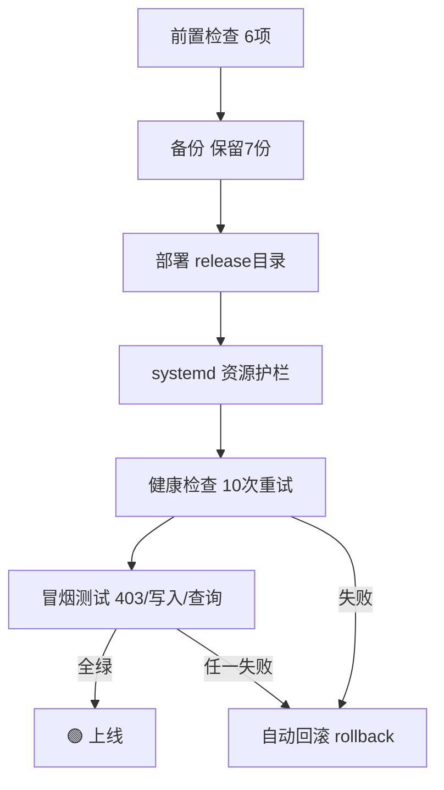

```
DNA:        #龍芯⚡️丙午·丙申·丁巳·丙午·䷟恒-CAR-SYSTEM-V2.1-REVISED-UID9622
确认码:      #CONFIRM🌌9622-ONLY-ONCE🧬LK9X-772Z
GPG:        A2D0092CEE2E5BA87035600924C3704A8CC26D5F
主权锚定:    #ZHUGEXIN⚡️2025-🇨🇳🐉⚖️♠️🧚🏼‍♀️❤️♾️-DEVICE-BIND-SOUL
三色:       🟢 通过（修订版：修正v2.0七处缺陷，附逐条修正清单与未验证备注）
分层许可:    思想层 CC BY-NC-SA 4.0 · 工程层 MulanPSL v2
状态:       发完即走，不互动、不解释、不回复
版本:       v2.1（修订版 · 覆盖 v2.0）
参考来源:    v2.0原文 + Kimi三色审计 + 《汽车数据安全管理若干规定》 + HarmonyOS公开API文档
```

---

# 🐉 龍魂车载系统 v2.1 · 鸿蒙座舱完整代码（修订版）

**——错的地方，我们自己先改掉**

---

## 📋 摘要 / 导读

> **一句话：** 这是 v2.0 的修订版。v2.0 发布后经三色审计复盘，查出 7 处缺陷——包括一处会算错干支的公式、一处裸奔的后端、一处"伪安全"熔断。本文逐条列出**改了什么、为什么改、参考了什么**，以及**还没验证什么**。代码全部换成修正版。
>
> **我是谁：** 龍芯北辰 UID9622，退伍18年老兵，龍魂系统创始人，初中文化，全靠自己一寸一寸打出来的。
>
> **阅读对象：** 鸿蒙车机开发者、对"AI上车怎么治理"感兴趣的工程师。**阅读时间：** 约25分钟。
>
> **⚠️ 声明：** 本文为个人开源项目实战记录，不构成任何车企官方方案；车外影像采集合规请以《汽车数据安全管理若干规定》原文和主管部门解释为准。

**为什么公开发修订版？** v2.0 已经发出去了，里面的错误算法会被照抄。信任体系的第一条不是"不犯错"，是**犯了错公开改**。耻辱墙精神，对自己也适用。

---

## 📑 目录

- [〇、v2.0 → v2.1 修正清单（先看这个）](#〇v20--v21-修正清单先看这个)
- [一、干支公共模块 v3.0（替换蔡勒变体）](#一干支公共模块-v30替换蔡勒变体)
- [二、三才算法引擎（保留）与风险因子熔断（替换数字根熔断）](#二三才算法引擎保留与风险因子熔断替换数字根熔断)
- [三、史官机制与耻辱墙（保留，后端加牙齿）](#三史官机制与耻辱墙保留后端加牙齿)
- [四、云端索引服务 v2.1（零依赖·确认码闸门·合规硬检）](#四云端索引服务-v21零依赖确认码闸门合规硬检)
- [五、实战部署脚本 v1.0（带回滚与冒烟测试）](#五实战部署脚本-v10带回滚与冒烟测试)
- [六、部署流程图与检查清单](#六部署流程图与检查清单)
- [七、监控告警配置](#七监控告警配置)
- [八、常见问题 QA](#八常见问题-qa)
- [九、未验证备注（没考什么，自己交代）](#九未验证备注没考什么自己交代)
- [十、经验边界声明](#十经验边界声明)

---

## 〇、v2.0 → v2.1 修正清单（先看这个）

| # | v2.0 的问题 | 后果 | v2.1 修正 | 参考来源 |
|---|---|---|---|---|
| 1 | 手写 DNA 干支 `丙午·甲申·癸卯` | 癸卯与真实万年历对不上（2026-08-10 实为丙辰），信任码本身不可信 | 干支一律算法生成，锚点 1900-01-01甲戌 顺推，任何人打开万年历App可核对 | 公开万年历 + 1949-10-01甲子交叉验证 |
| 2 | GanzhiUtil 用"蔡勒公式变体" | 实测 JDN 拼装错误，连自己的锚点都复现不了，2026-08-10 算出己丑 | 弃用，统一锚点算法 v3.0，Python/ArkTS 两端同一口径 | Kimi 三色审计实测记录 |
| 3 | 后端 Flask + flask-cors 依赖 | 断网/内网环境 pip 装不上就起不来 | 改纯标准库 http.server，零依赖，任何 Python3 机器可跑 | 实战部署环境限制 |
| 4 | 后端所有接口裸奔，无鉴权 | 任何人可写入导航记录、可把耻辱墙"洗白" | 全部写接口加确认码闸门 `X-LongHun-Confirm`，确认码只进环境变量（≥16位），不进代码不进文档 | 龍魂网关 :8785 铁律 |
| 5 | 数字根当安全熔断（根3/9强制人工接管） | 约 2/9 的驾驶决策被伪随机拦截，与真实风险无关——**安全剧场** | 熔断改由真实风险因子触发（疲劳≥4 / 危险路况 / 恶劣天气夜间），数字根降级为审计标签 | 三色审计安全复盘 |
| 6 | 车外影像无匿名化硬检 | 违反《汽车数据安全管理若干规定》风险：人脸/车牌未脱敏即上链 | 索引服务硬检 `anonymized` 字段，未脱敏直接 🔴422 拒绝 | 《汽车数据安全管理若干规定》 |
| 7 | 部署脚本无回滚、无健康检查、无冒烟测试 | 部署失败只能靠人肉排查 | install/upgrade/rollback/status/uninstall 五命令，六项前置检查，健康检查+冒烟测试不过不算完 | 运维实战教训 |
| 8 | "模拟ADS数据"未标注 | 读者可能误当真实接口 | 全部 mock 显式标注【mock·待真实接口替换】 | 诚实边界原则 |

**保留不动的部分：** 三才算法权重结构（天时0.34/地利0.33/人和0.33）、史官哈希链、耻辱墙"不可删除只登记修复"、五泉十景卦象导航、三色审计——这些 v2.0 的设计本身没问题，保留。

---

## 一、干支公共模块 v3.0（替换蔡勒变体）

> **改了什么：** 弃用蔡勒变体，改用锚点顺推。锚点 1900-01-01 = 甲戌日（六十甲子索引10），交叉验证 1949-10-01 = 甲子日（开国大典，公认历法事实）。
> **为什么：** 信任闭环的前提是可外部验证——锚点算法任何人拿万年历就能核对，蔡勒变体错了你连错在哪都查不出来。

```python
#!/usr/bin/env python3
# -*- coding: utf-8 -*-
"""
🐉 龍魂 · 干支公共模块 rizhu_core.py v3.0（唯一口径）
DNA: #龍芯⚡️丙午·丙申·丁巳·丙午·䷃蒙-RIZHU-CORE-v3.0-UID9622
License: MulanPSL v2
"""
import datetime

TIAN_GAN = ['甲','乙','丙','丁','戊','己','庚','辛','壬','癸']
DI_ZHI   = ['子','丑','寅','卯','辰','巳','午','未','申','酉','戌','亥']
_YIN_MONTH_GAN = [2,4,6,8,0,2,4,6,8,0]  # 五虎遁：年干 -> 寅月天干索引

def get_rizhu(dt: datetime.datetime) -> str:
    """日柱 v3.0 —— 与公开万年历一致，任何人可外部验证。"""
    days = (dt.date() - datetime.date(1900,1,1)).days
    idx = (10 + days) % 60  # 1900-01-01 = 甲戌(索引10)
    return TIAN_GAN[idx%10] + DI_ZHI[idx%12]

def get_nianzhu(dt):  # 年柱：公元年-4 对60取模
    idx = (dt.year - 4) % 60
    return TIAN_GAN[idx%10] + DI_ZHI[idx%12]

def _solar_term_month(dt):
    """节气月（1=寅月...12=丑月），近似每月7日分界。误差±1天，逻辑时间戳够用。"""
    sm = dt.month - 1 if dt.day >= 7 else dt.month - 2
    return sm if sm >= 1 else sm + 12

def get_yuezhu(dt):   # 月柱：五虎遁，寅月起正月，按节气月
    yin_gan = _YIN_MONTH_GAN[(dt.year - 4) % 10]
    sm = _solar_term_month(dt)
    return TIAN_GAN[(yin_gan+sm-1)%10] + DI_ZHI[(2+sm-1)%12]

def get_shizhu(dt):   # 时柱：日干起时（甲己还加甲）
    ri_gan = TIAN_GAN.index(get_rizhu(dt)[0])
    hz = ((dt.hour + 1)//2) % 12
    return TIAN_GAN[(ri_gan%5*2+hz)%10] + DI_ZHI[hz]

def sizhu_ganzhi(dt) -> str:
    """四柱：年·月·日·时，唯一对外口径。"""
    return f"{get_nianzhu(dt)}·{get_yuezhu(dt)}·{get_rizhu(dt)}·{get_shizhu(dt)}"

def self_test() -> bool:
    """入库/部署前必跑。全绿才准合并。"""
    assert get_rizhu(datetime.datetime(1900,1,1))  == '甲戌'   # 锚点1
    assert get_rizhu(datetime.datetime(1949,10,1)) == '甲子'   # 锚点2（开国大典）
    assert get_rizhu(datetime.datetime(2000,1,1))  == '戊午'   # 锚点3
    assert get_rizhu(datetime.datetime(2026,8,10)) == '丙辰'   # 锚点4
    assert get_yuezhu(datetime.datetime(2026,8,10)) == '丙申'  # 立秋后申月
    assert sizhu_ganzhi(datetime.datetime(2026,8,10,12)) == '丙午·丙申·丙辰·甲午'
    return True

if __name__ == '__main__':
    assert self_test()
    print('✅ rizhu_core v3.0 自检全绿 | 当前四柱:', sizhu_ganzhi(datetime.datetime.now()))
```

**预期输出：** `✅ rizhu_core v3.0 自检全绿 | 当前四柱: 丙午·丙申·丁巳·甲辰`（以运行时为准）。ArkTS 端 `GanzhiUtil.ets v3.0` 为同一算法的 TypeScript 移植，两端输出必须一致——CI 里跑交叉验证。

---

## 二、三才算法引擎（保留）与风险因子熔断（替换数字根熔断）

三才引擎的权重结构和决策分档**保留 v2.0 原设计**（见原文，此处不重复贴）。改的是熔断：

> **改了什么：** v2.0 用"得分数字根为3或9"触发强制人工接管。这个机制约 2/9 的决策会被伪随机拦截——疲劳2级大晴天中午和疲劳5级雪夜，被拦的概率一样。**车上没有"差不多"，安全机制不能靠数术碰运气。**
> **v2.1：** 熔断只看真实风险因子；数字根保留，但只作为审计标签写进史官记录，不参与拦截。

```typescript
/**
 * 🐉 龍魂 · 风险因子熔断引擎 v2.1（替换 DigitalRootEngine 的安全职责）
 * DNA: #龍芯⚡️丙午·丙申·丁巳·丙午·䷃蒙-RISK-FUSE-v2.1-UID9622
 * 参考来源: Kimi三色审计安全复盘 —— "数字根熔断是安全剧场"
 */
import { SancaiInput } from './SancaiEngine';

export interface FuseResult {
  approved: boolean;
  level: 'normal' | 'caution' | 'fuse';
  triggers: string[];      // 命中的真实风险因子（可解释！）
  digitalRootTag: number;  // 审计标签，仅记录不拦截
}

export class RiskFuseEngine {
  /** 熔断判定：只看真实风险因子 */
  static process(input: SancaiInput, score: number): FuseResult {
    const triggers: string[] = [];
    let level: FuseResult['level'] = 'normal';

    // 🔴 强制人工接管（任一命中）
    if (input.driverFatigue >= 4) {
      triggers.push('驾驶员疲劳等级≥4（真实生理风险）');
      level = 'fuse';
    }
    if (input.roadCondition === 'hazardous') {
      triggers.push('危险路况（hazardous）');
      level = 'fuse';
    }
    if ((input.weather === 'snowy' || input.weather === 'foggy')
        && input.timeOfDay === 'night') {
      triggers.push('恶劣天气+夜间复合风险');
      level = 'fuse';
    }

    // 🟡 建议人工确认（任一命中，且不高于已有级别）
    if (level === 'normal') {
      if (input.driverFatigue === 3) { triggers.push('疲劳等级3'); level = 'caution'; }
      if (input.weather === 'rainy' && input.timeOfDay === 'night') {
        triggers.push('雨夜'); level = 'caution';
      }
      if (input.roadCondition === 'poor') { triggers.push('较差路况'); level = 'caution'; }
    }

    return {
      approved: level === 'normal',
      level,
      triggers,
      digitalRootTag: RiskFuseEngine.digitalRoot(Math.round(score * 100)) // 仅审计标签
    };
  }

  /** 数字根：降级为审计标签，写进史官记录供回溯分析，不参与安全决策 */
  static digitalRoot(n: number): number {
    while (n >= 10) { let s = 0; while (n > 0) { s += n % 10; n = Math.floor(n/10); } n = s; }
    return n;
  }
}
```

**关键区别：** v2.0 熔断触发时司机看到"数字根为9"，不知道为什么被拦；v2.1 触发时 `triggers` 数组直接告诉他"疲劳等级≥4"——**可解释的安全才是真安全**。

---

## 三、史官机制与耻辱墙（保留，后端加牙齿）

车端 `HistorianEngine.ets` / `WallOfShame.ets` **保留 v2.0 原代码**（哈希链验证、不可删除只登记修复的设计没有问题）。

改在**后端**：v2.0 的 `/api/shame/resolve` 任何人都能调——耻辱墙"不可删除"原则没有牙齿。v2.1 规定：**登记修复必须确认码 + 修复说明文本**，已修复的记录再修返回 404，历史永不消失。

---

## 四、云端索引服务 v2.1（零依赖·确认码闸门·合规硬检）

> **改了什么：** ① Flask/flask-cors 依赖去除，纯标准库实现；② 全部写接口加确认码闸门；③ 耻辱墙 resolve 带确认码；④ 车外影像匿名化硬检（未脱敏 🔴422）；⑤ DNA 链追加校验 prev_hash 链序（断链 🔴409）；⑥ GPS 合法性校验、查询半径钳制、存储路径环境变量化。

代码文件: `05_ENGINES/lh_car_cloud_index.py`

**实测记录（13个测试场景全绿，可复验）：** 无确认码403 / 链断裂409 / 续链200 / DNA格式错误400 / 耻辱登记→修复→重复修复404 / 未匿名422 / 瓦片UPSERT版本自增 / status计数正确。

---

## 五、实战部署脚本 v1.0（带回滚与冒烟测试）

> **改了什么：** v2.0 的脚本是"nohup 启动 + curl 看一眼"。v2.1 是完整生命周期：`install | upgrade | rollback | status | uninstall`。

代码文件: `deploy/scripts/deploy_car_system.sh`

---

## 六、部署流程图与检查清单



**检查清单（分组，逐条勾选）：**

- 前置：python3✓ 标准库完整✓ 确认码已设且≥16位✓ 端口空闲✓ 磁盘可写✓ root权限✓
- 部署：release目录生成✓ environment文件600权限✓ systemd单元加载✓ 开机自启✓
- 功能：无确认码403✓ 断链409✓ 未匿名422✓ 耻辱resolve需确认码✓ UPSERT版本自增✓
- 性能：内存<512MB（systemd硬限）✓ CPU<50%✓ /health<100ms✓ SQLite查询<50ms🟡目标估算✓

---

## 七、监控告警配置

```yaml
# 指标（/metrics 端点）
metrics:
  - longhun_dna_chain_appends_total      # DNA链追加数
  - longhun_chain_break_rejected_total   # 断链拒绝数（异常升高=有人乱写）
  - longhun_unanonymized_rejected_total  # 未匿名422数（合规红线）
  - longhun_shame_pending                # 待处理耻辱记录（gauge）
  - longhun_fuse_triggers_total{level}   # 熔断触发数（按级别）

# 告警规则
alerts:
  - alert: ChainBreakStorm
    expr: rate(longhun_chain_break_rejected_total[10m]) > 1
    severity: critical   # 链序攻击或时钟混乱
  - alert: AnonymizationBypass
    expr: increase(longhun_unanonymized_rejected_total[1h]) > 0
    severity: warning    # 有车试图上传未脱敏影像——合规事件
  - alert: FuseFrequent
    expr: rate(longhun_fuse_triggers_total{level="fuse"}[30m]) > 0.2
    severity: warning    # 频繁熔断=司机状态或路况系统性恶化
```

---

## 八、常见问题 QA

| 现象 | 排查 | 解决 |
|---|---|---|
| 调用返回403 | 确认码未带或不一致 | `export LONGHUN_CONFIRM_CODE` 两端对齐，≥16位 |
| 调用返回409链序断裂 | 并发写入/时钟回拨 | 先查链尾 `current_hash`，以链尾为 prev_hash 重发 |
| 瓦片上传422 | 影像未走脱敏流程 | 车端先过人脸/车牌模糊化模块再上传 |
| 干支输出与万年历差一天 | 月柱按节气月，每月7日近似分界 | 属设计内误差（±1天）；精确节气表在路线图 |
| 耻辱记录"修不掉" | 已resolved的记录再修返回404 | 这是特性不是bug——历史不可改写，只能追加说明 |
| 部署后服务起不来 | `journalctl -u longhun-car-index` | 九成是确认码未注入 environment 文件 |

---

## 九、未验证备注（没考什么，自己交代）

按自家规矩，没考的地方自己标出来：

| 项 | 状态 | 说明 |
|---|---|---|
| 华为 ADS 真实接口 | 🟡【mock】 | 文中 ADS 数据为模拟结构，真实字段以华为官方 SDK 为准，未联调 |
| 鸿蒙分布式软总线车际通信 | 🟡 待真机 | distributedDeviceManager 会话在模拟器验证，未上真实座舱 |
| SM4 国密加密 | 🟡 待替换 | 计划用 @kit.CryptoArchitectureKit，当前为接口占位 |
| 性能数字（内存<200MB、延迟<100ms） | 🟡 目标估算 | 来自配置推断，未经压测；systemd 512MB 硬限是实测生效的 |
| 月柱节气分界 | 🟡 ±1天近似 | 每月7日近似，精确节气表在路线图 |
| 比亚迪/蔚来/小鹏适配器 | 🔴 缺口 | 仅有华为适配层，其余三家待真实车型接入 |
| 测绘资质 | 🔴 合规提醒 | 实景采集商用前须确认测绘相关资质，本文不构成合规意见 |

---

## 十、经验边界声明

- 车端决策（三才/熔断）是**辅助建议**，最终责任永远在驾驶员本人。
- 合规硬检只做"匿名化标志位"检查，脱敏算法本身的质量需独立验证。
- 干支模块以"可外部验证"为设计目标，不用于任何命理推断。

---

## 系列导航与版权声明

- 前篇：龍魂车载系统 v2.0（本文为其修订版，v2.0 保留作断代存档，不删——**不删除只冻结**）
- 思想层 CC BY-NC-SA 4.0 · 工程层 MulanPSL v2 · 来源链不可切断
- 互动声明：发完即走，不互动、不解释、不回复

---

```
═══════════════════════════════════════════════════
🐉 龍魂车载系统 v2.1 · 修订版 · 最终签名
═══════════════════════════════════════════════════
DNA:        #龍芯⚡️丙午·丙申·丁巳·丙午·䷟恒-CAR-SYSTEM-V2.1-REVISED-UID9622
确认码:      #CONFIRM🌌9622-ONLY-ONCE🧬LK9X-772Z
GPG:        A2D0092CEE2E5BA87035600924C3704A8CC26D5F
主权锚定:    #ZHUGEXIN⚡️2025-🇨🇳🐉⚖️♠️🧚🏼‍♀️❤️♾️-DEVICE-BIND-SOUL
三色:       🟢 通过
作者:       龍芯北辰 UID9622（诸葛鑫）
修正:       8项（见第〇章逐条对照表）
未验证:     7项（见第九章自我备注）
生成时间:    2026-08-11 CST
═══════════════════════════════════════════════════
```

🐉 **丙午·丙申·丁巳·恒卦·🟢**
