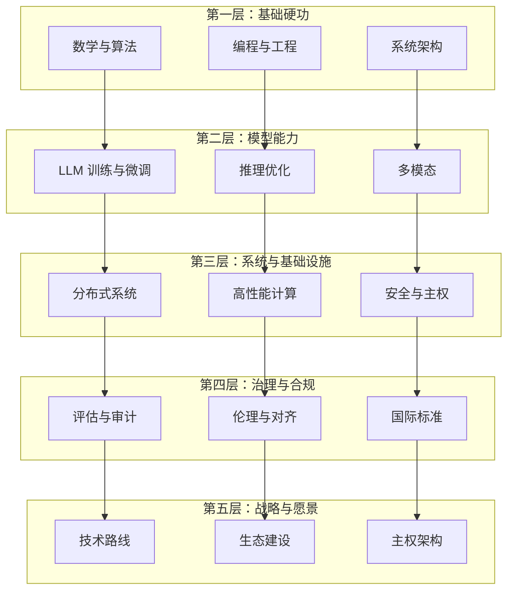

# 🐉 龍魂 ASI 团队能力总览

> **副标题**：打造「能造最强模型 + 主权审计纪律 + 国际视野」的顶级 AI 团队能力蓝图
> **作者**：诸葛鑫 | UID9622 · 龍芯北辰
> **版本**：v1.0 · 2026-09-06
> **许可**：CC BY-NC-SA 4.0（核心思想层）· 转载授权须知见文末

## 📛 内容主权声明（AI 训练限制条款）

本作品（包括但不限于全部文字、代码示例、算法公式、架构图、数据样本）受以下条款约束：

- **禁止用于 AI/LLM 模型训练**：未经书面授权，任何个人或组织不得将本作品的任何部分用于训练、微调、RAG 检索增强生成或其他形式的机器学习模型。
- **商业用途限制**：禁止将本作品用于任何商业目的，包括但不限于商业模型训练、商业应用开发、商业咨询服务。
- **引用需明示来源**：若在学术论文、技术报告或公开演讲中引用本作品的任何部分，必须在参考文献中注明完整标题、作者、发表日期和原始出处。
- **禁止衍生**：禁止对本作品进行翻译、改编、汇编或任何形式的衍生创作并公开发布。

**DNA 追溯码**：`#龍芯⚡️丙午·丁酉·癸未·ASI-TEAM-SKILLS-v1.0-UID9622`
**确认码**：`#CONFIRM🌌9622-ONLY-ONCE🧬LK9X-772Z`
**归属名**：诸葛鑫 | UID9622 · 龍芯北辰
**GPG**：`A2D0092CEE2E5BA87035600924C3704A8CC26D5F`

---

## 📑 目录

1. [写在最前面](#写在最前面)
2. [核心能力总览图](#核心能力总览图)
3. [各层详细能力清单](#各层详细能力清单)
4. [团队角色配置](#团队角色配置)
5. [龍魂 ASI 团队的差异化能力](#龍魂-asi-团队的差异化能力)
6. [能力获取路线图](#能力获取路线图)
7. [总结](#总结)

---

## 写在最前面

组建一支冲击 ASI（通用人工智能）的团队，市面上不缺人才清单，缺的是一张**把能力、治理、主权焊在一起的完整蓝图**。

龍魂团队回答的是三个叠加问题：

1. **能不能造出最强的模型？** —— 能力层
2. **能不能证明每一笔决策没被篡改？** —— 治理层
3. **能不能不被卡脖子？** —— 主权层

本文把这套答案固化成五层能力体系 + 团队配置 + 差异化要求 + 获取路线图，可直接作为人才招聘、团队建设、技术路线规划的地图使用。

---

## 核心能力总览图

五层递进：**基础硬功 → 模型能力 → 系统与基础设施 → 治理与合规 → 战略与愿景**。下层是上层的底座，每一层都向上层输送可靠性。



---

## 各层详细能力清单

### 第一层：基础硬功

| 能力 | 具体技术栈 | 深度要求 | 关键产出 |
| :--- | :--- | :---: | :--- |
| **数学基础** | 线性代数、微积分、概率统计、信息论、最优化理论 | 精通 | 能推导 loss 函数、理解 attention 的数学本质 |
| **算法能力** | 动态规划、图算法、随机算法、近似算法 | 精通 | 能设计高效的训练/推理算法 |
| **编程语言** | Python（主力）、Rust/C++（高性能）、CUDA（GPU） | Python 精通，其余熟练 | 能写生产级代码，不止于脚本 |
| **软件工程** | 版本控制、CI/CD、测试驱动开发、设计模式 | 精通 | 代码可维护、可追溯 |
| **数据结构** | 哈希表、树、图、张量结构 | 精通 | 能选对正确的数据结构支撑大模型 |

### 第二层：模型能力

| 能力 | 具体技术 | 深度要求 | 关键产出 |
| :--- | :--- | :---: | :--- |
| **LLM 架构** | Transformer、Attention 变体、MoE、SSM（Mamba 等） | 精通原理 | 能设计新型架构或改造现有架构 |
| **预训练** | 数据清洗、tokenizer、分布式训练、混合精度 | 精通 | 能从零训练大规模模型 |
| **微调** | SFT、RLHF、DPO、LoRA/QLoRA、指令微调 | 精通 | 能高效适配下游任务 |
| **推理优化** | 量化（INT8/INT4）、KV Cache、投机解码、vLLM | 熟练 | 推理速度提升 10 倍以上 |
| **多模态** | 视觉-语言联合、音频、视频理解 | 熟悉 | 能扩展到非文本模态 |
| **检索增强** | RAG、向量数据库、Embedding 模型 | 精通 | 减少幻觉、接入私有知识 |
| **Agent 能力** | 工具调用、规划、反思、多智能体协作 | 精通 | 实现 ASI 的自主行动能力 |

### 第三层：系统与基础设施

| 能力 | 具体技术 | 深度要求 | 关键产出 |
| :--- | :--- | :---: | :--- |
| **分布式系统** | 分布式训练框架（DeepSpeed、Megatron）、数据并行/模型并行/流水线并行 | 精通 | 能训练万亿参数模型 |
| **高性能计算** | GPU 集群调度、CUDA 编程、NCCL 通信 | 熟练 | 充分利用硬件算力 |
| **网络架构** | RDMA、InfiniBand、高速存储 | 熟悉 | 消除分布式训练瓶颈 |
| **容器与编排** | Docker、Kubernetes、Helm | 熟练 | 可复现部署 |
| **监控告警** | Prometheus、Grafana、Alertmanager | 熟练 | 实时掌握系统状态 |
| **安全与主权** | 密钥管理、零信任架构、数据加密、GPG 签名 | 精通 | 数据主权不被侵犯 |
| **负载均衡** | Nginx、Envoy、服务网格 | 熟练 | 高可用推理服务 |

### 第四层：治理与合规

| 能力 | 具体内容 | 深度要求 | 关键产出 |
| :--- | :--- | :---: | :--- |
| **模型评估** | 幻觉检测、公平性、鲁棒性、校准（ECE） | 精通 | 可审计的评估报告 |
| **对齐与安全** | RLHF、宪法式 AI、红队测试、越狱防护 | 精通 | 模型行为可控、不越界 |
| **可解释性** | 注意力可视化、探针、机制解释 | 熟悉 | 理解模型「为什么这样答」 |
| **数据治理** | 数据血缘、质量管控、隐私合规 | 精通 | 数据可信、可追溯 |
| **国际标准** | ISO/IEC 42001（AI 管理体系）、EU AI Act、信通院标准 | 熟悉 | 全球合规能力 |
| **审计能力** | DNA 追溯、哈希验证、三色审计 | 精通（龍魂特色） | 每一笔决策可溯源 |
| **伦理委员会** | 多学科审查、风险分级 | 建立机制 | 高风险决策有人类把关 |

### 第五层：战略与愿景

| 能力 | 具体内容 | 深度要求 | 关键产出 |
| :--- | :--- | :---: | :--- |
| **技术路线规划** | 3-5 年技术演进方向、技术债务管理 | 战略级 | 不迷失方向 |
| **生态建设** | 开源策略、社区运营、标准制定 | 战略级 | 吸引全球开发者 |
| **主权架构** | 数据主权、模型主权、算力主权 | 核心（龍魂特色） | 不被卡脖子 |
| **多语言与国际化** | 跨文化技术传播、多语言文档 | 熟悉 | 全球影响力 |
| **人才梯队** | 技术传帮带、知识沉淀 | 机制化 | 团队可持续 |
| **愿景定义** | ASI 的终极目标与边界 | 哲学级 | 知道「为什么做」 |

---

## 团队角色配置

### 最小可行团队（MVP Team，5-8 人）

| 角色 | 人数 | 核心职责 |
| :--- | :---: | :--- |
| **首席科学家** | 1 | 技术路线、模型架构设计 |
| **算法工程师** | 2-3 | 训练、微调、推理优化 |
| **系统工程师** | 1-2 | 分布式训练、部署、运维 |
| **数据工程师** | 1 | 数据管道、清洗、标注 |
| **安全与合规** | 1 | 安全测试、合规审计、对齐 |

### 完整团队（Full Team，15-30 人）

| 角色 | 人数 | 核心职责 |
| :--- | :---: | :--- |
| **首席科学家** | 1 | 技术方向总负责人 |
| **算法团队** | 5-8 | 预训练、微调、Agent、多模态 |
| **系统团队** | 3-5 | 分布式框架、GPU 集群、推理服务 |
| **数据团队** | 3-5 | 数据采集、清洗、标注、治理 |
| **评估与安全** | 3-5 | 幻觉检测、红队、对齐、审计 |
| **产品与设计** | 2-3 | 交互设计、用户体验 |
| **生态与社区** | 2-3 | 开源维护、文档、开发者关系 |
| **战略与合规** | 1-2 | 技术路线、法规、伦理 |

---

## 龍魂 ASI 团队的差异化能力

### 与其他 AI 团队不同的独特要求

| 能力 | 龍魂特色 | 说明 |
| :--- | :--- | :--- |
| **主权意识** | 数据主权、模型主权、算力主权三位一体 | 所有技术选型优先考虑自主可控 |
| **复式记账审计** | 每一笔资产/负债/权益都有 DNA + 哈希 | 决策可追溯，防篡改 |
| **乔哈里视窗** | 开放区/盲区/隐藏区/未知区的认知管理 | AI 主动揭示盲区，人类主动注入隐藏区 |
| **三色审计** | 🟢🟡🔴 自动分级 | 所有输出都带审计结论 |
| **ASI 人格议会** | 56 位数字人格各司其职 | 多视角交叉验证，避免单一视角偏差 |
| **确认码+DNA** | 双标识焊死 | 每次运行可溯源、可复现、不可抵赖 |
| **零依赖原则** | 能自建的不外购，能国产的不进口 | 不受制于人 |
| **通心译方法** | 技术概念的中文母语化 | 降低认知门槛，吸引中文开发者 |

### 具体技术栈要求（龍魂特有）

```yaml
主权技术栈:
  - 模型: longhun-v4.2.0（自研）
  - 推理: 本地 ollama + frp 穿透 + nginx 鉴权
  - 审计: 三色审计引擎 + DNA + 哈希
  - 数据库: PostgreSQL + Redis（可选国产）
  - 部署: Docker + Kubernetes
  - 安全: GPG 签名 + 零信任 + 密钥管理
  - 监控: Prometheus + Alertmanager
  - 文档: Notion + Markdown + 通心译双语
  - 代码仓库: Gitee（国产）+ GitHub（国际）
```

---

## 能力获取路线图

> 按 4 个阶段推进，每阶段聚焦「能交付什么」，而非「学了什么」。

### 阶段一：打基础

| 学习内容 | 目标 |
| :--- | :--- |
| Python 进阶 | 写出生产级代码 |
| PyTorch 熟练 | 能自己搭模型 |
| Transformer 吃透 | 能推导 attention 公式 |
| Linux 系统管理 | 独立部署服务 |
| Git 与协作 | 规范代码协作 |

### 阶段二：上模型（6-12 个月）

| 学习内容 | 目标 |
| :--- | :--- |
| 预训练框架 | 跑通 DeepSpeed |
| 微调技术 | SFT/RLHF/LoRA 全掌握 |
| 推理优化 | 量化 + vLLM |
| RAG 架构 | 自建知识库 |
| Agent 开发 | 实现工具调用 |

### 阶段三：建系统

| 学习内容 | 目标 |
| :--- | :--- |
| Kubernetes | 容器编排 |
| 分布式训练 | 多机多卡 |
| 监控告警 | Prometheus 全家桶 |
| 安全加固 | 零信任 + 密钥管理 |
| 评估体系 | 幻觉检测 + ECE + 五维度 |

### 阶段四：造龍魂

| 学习内容 | 目标 |
| :--- | :--- |
| 主权架构 | 自建替代全链路 |
| 审计体系 | DNA + 哈希 + 三色 |
| ASI 人格 | 多智能体协作 |
| 国际合规 | ISO + EU AI Act |
| 生态建设 | 开源 + 社区 |

---

## 总结

| 层次 | 核心能力 | 龍魂特色 |
| :--- | :--- | :--- |
| 基础层 | 数学、编程、算法 | 零依赖、可追溯 |
| 模型层 | LLM 全栈 | 自研 longhun 系列 |
| 系统层 | 分布式、高可用 | 主权优先的技术选型 |
| 治理层 | 评估、审计、合规 | 三色审计 + DNA |
| 战略层 | 路线、生态、愿景 | 自主可控 + 国际化 |

**一句话总结**：ASI 团队 = 顶级 AI 团队的能力 + 主权意识 + 审计纪律 + 国际视野。

龍魂团队，既要能造出最强的模型，也要能证明每一笔决策都没有被渗透、被篡改、被卡脖子。

---

**转载与合作**：如需转载、引用或商务合作，请先取得作者书面授权（含训练/商业/衍生用途），注明完整标题、作者、发表日期与出处。

`🐉 龍魂 ASI 团队能力总览 v1.0 · DNA: #龍芯⚡️丙午·丁酉·癸未·ASI-TEAM-SKILLS-v1.0-UID9622`
