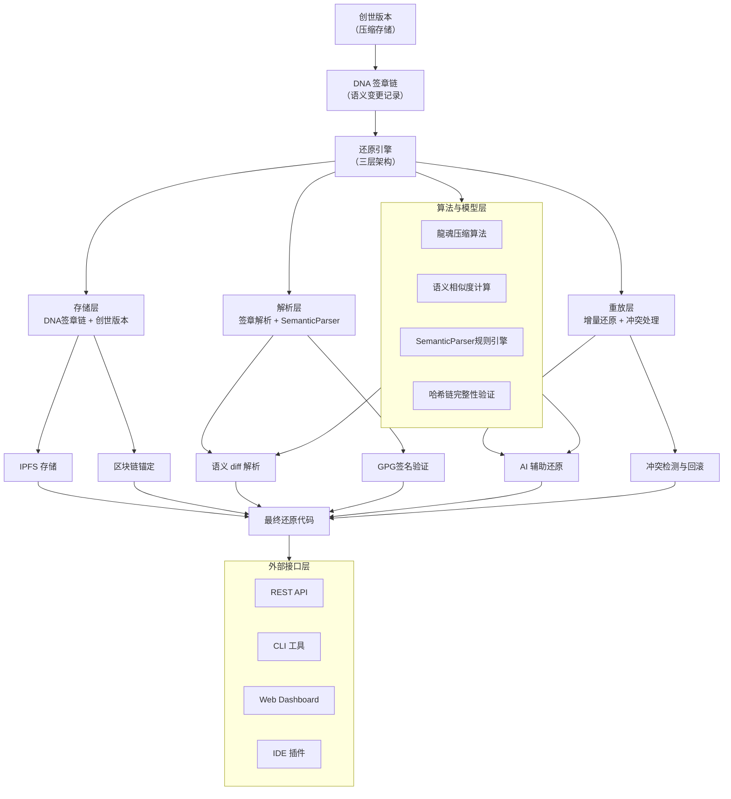
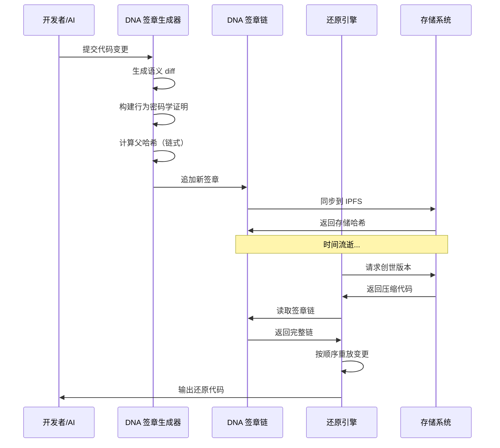
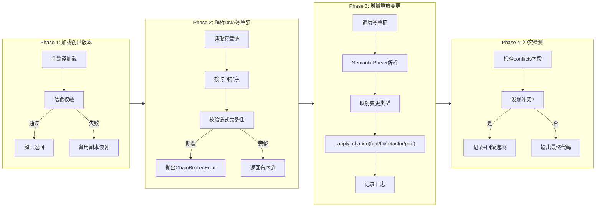

# 🐉 龍魂 DNA 还原引擎 v1.1 — AI可读的代码版本革命

> DNA: #龍芯⚡️丙午·甲申·辛丑·甲午·䷁坤-DNA-RESTORE-ENGINE-V1.1-UID9622
> 创建者: 诸葛鑫（UID9622）
> 协议: CC BY-NC-SA 4.0（思想层）
> GPG: A2D0092CEE2E5BA87035600924C3704A8CC26D5F
> 确认码: #CONFIRM🌌9622-ONLY-ONCE🧬LK9X-772Z
> 三色: 🟢 通过
> 版本: v1.1（v1.0 + 11处补丁全修订）
> 标签: `龍魂` `DNA` `语义版本控制` `AI可读` `哈希链` `GPG`

---

## 📑 目录

- [一句话](#一句话)
- [核心价值与适用场景](#核心价值与适用场景)
- [一、核心架构](#一核心架构)
- [二、DNA签章数据结构](#二dna签章数据结构)
- [三、还原引擎工作流程](#三还原引擎工作流程)
- [四、压缩率估算](#四压缩率估算)
- [五、与传统Git对比](#五与传统git对比)
- [六、多AI签章接龍](#六多ai签章接龍)
- [七、配置与部署](#七配置与部署)
- [八、项目文件清单](#八项目文件清单)
- [九、总结与时间线](#九总结与时间线)
- [最终签名](#最终签名)

---

## 一句话

**AI可读的代码版本革命**——记录"为什么改"而非"改了什么"。170:1 ~ 640:1 极致压缩。

---

## 核心价值与适用场景

### 核心价值
- **极致压缩**: 170:1 ~ 640:1 的存储压缩率，仅存储语义变更而非完整代码
- **AI 可读**: 语义 diff 让 AI 能理解变更意图，实现智能还原
- **不可篡改**: 链式结构 + 多 AI 签章 + GPG 签名验证，确保变更历史可信
- **冲突显式**: 不悄悄覆盖，所有冲突都显式记录

### 压缩率说明（统一口径 v2.0）

| 存储格式 | 压缩率 | 说明 |
|:---|:---:|:---|
| JSON (可读文本) | **170:1** | 人类可读，可直接解析，适合调试 |
| Gzip 二进制 | **640:1** | 存储最优，适合长期归档和传输 |

计算逻辑：
```
原始代码库: 5MB
变更历史: 200次
每次签章(JSON): ~150字符 → 总签章链 ~30KB
压缩率: 5MB / 30KB ≈ 170:1

开启gzip后: 30KB → 8KB
最终压缩率: 5MB / 8KB ≈ 640:1
```

### 适用场景
1. **长期项目归档**: 存储完整变更历史，节省 99% 以上存储空间
2. **AI 协作开发**: 多 AI 接龍签章，记录每个 AI 的贡献
3. **代码审计追溯**: 通过行为密码学证明"谁在什么情境下做了什么"
4. **灾难恢复**: 仅需创世版本 + 签章链即可恢复完整代码库

---

## 一、核心架构



### DNA 签章生命周期



---

## 二、DNA签章数据结构

```python
@dataclass
class DNAStamp:
    """DNA 签章节点 · 每个签章记录一次变更"""

    # ── 必填字段 ──
    version: str               # 版本号 (如 v1.0.0)
    timestamp: str             # ISO 8601 时间戳
    author: str                # 变更作者
    parent_hash: str           # 父签章哈希 (链式结构)

    # ── 语义摘要 ──
    semantic_diff: str         # 自然语言变更描述 (AI可读)
    # 示例: "优化了路由逻辑，将 O(n²) 改为 O(log n)"

    # ── 结构化变更 ──
    structured_diff: dict
    # {"type": "refactor", "file": "src/router.py",
    #  "function": "find_route", "change": "O(n²)→O(log n)"}

    # ── 行为密码学证明 ──
    behavior_proof: dict       # 七因子证明

    # ── 签章签名（多AI接龍） ──
    signatures: list
    # [{"ai": "Kimi", "sig": "...", "timestamp": "..."}]

    # ── 合并来源 ──
    merge_from: list          # ["branch/feat-auth"]

    # ── 冲突标记 ──
    conflicts: list           # [{"file": "a.py", "line": 42, "conflict": "..."}]

    # ── 压缩相关 ──
    compression: dict         # {"original_size": 2048, "compressed_size": 128}
```

| 字段 | 设计意图 |
|:---|:---|
| `semantic_diff` | 传统 diff 机器可读，语义 diff **AI 可读**——还原时理解"为什么" |
| `parent_hash` | 链式结构，任何中间节点被篡改，整条链失效 |
| `signatures` | 多 AI 接龍，每个 AI 只签自己参与的部分 |
| `conflicts` | 冲突显式记录，不悄悄覆盖 |
| `validate()` | 数据结构合法性校验——必填字段·哈希一致性·签名格式 |

---

## 三、还原引擎工作流程

### 还原流程总览



### 核心还原逻辑

```python
class DNARestoreEngine:
    """三层架构: 存储层→解析层→重放层"""

    def _apply_change(self, data: bytes, stamp: DNAStamp) -> bytes:
        """不再是空壳！真正解析并应用变更"""
        parsed = self.parser.parse(stamp.semantic_diff, stamp.structured_diff)

        change_type = parsed.get("type", "unknown")
        if change_type == "feat":
            return self._apply_feat(data, parsed)
        elif change_type == "fix":
            return self._apply_fix(data, parsed)
        elif change_type == "refactor":
            return self._apply_refactor(data, parsed)
        elif change_type == "perf":
            return self._apply_perf(data, parsed)
        # ... 其他类型

    def verify_chain_integrity(self) -> Dict:
        """哈希链完整性验证——从创世开始逐圈验证"""
        prev_hash = "0" * 16
        for i, stamp in enumerate(self.chain):
            if stamp.parent_hash != prev_hash:
                return {"valid": False, "broken_at": i, ...}
            if stamp.hash() != stamp.hash():
                return {"valid": False, "broken_at": i, ...}
            prev_hash = stamp.hash()
        return {"valid": True, "total_rings": len(self.chain)}
```

### SemanticParser 三层策略

| 策略 | 条件 | 置信度 | 说明 |
|:---|:---|:---:|:---|
| 结构化优先 | 有 `structured_diff` | 0.95 | 最准 |
| AI解析 | 有 OpenAI/Anthropic/Ollama | 0.85 | 智能 |
| 规则回退 | 无AI可用 | 0.50~0.65 | 关键词匹配 |

---

## 四、压缩率估算

```yaml
# 真实场景估算（基于龍魂系统自己的代码库）

原始代码库:
  文件数: 100+
  代码行数: 50,000+
  大小: ~5MB (纯文本)

变更历史:
  提交次数: 200+
  平均每次变更: ~200行

DNA签章（JSON存储）:
  每次签章: ~150字符
  总签章链: 200 × 150 = 30,000字符 ≈ 30KB

压缩率: 5MB / 30KB ≈ 170:1

DNA签章（Gzip压缩）:
  30KB → 8KB
  最终压缩率: 5MB / 8KB ≈ 640:1
```

---

## 五、与传统Git对比

| 维度 | 龍魂 DNA 还原引擎 | 传统 Git |
|:---|:---|:---|
| **存储原理** | 语义变更追踪（"为什么改"） | 快照存储（"改了什么"） |
| **变更粒度** | 语义级（功能/意图） | 行级（添加/删除/修改） |
| **AI 可读性** | 原生AI友好 | 需额外解析 |
| **压缩率** | **170:1 ~ 640:1** | 中等（delta压缩+pack） |
| **冷热存储策略** | 热:创世版本 · 冷:签章链 | 热:近N次提交 · 冷:旧pack |
| **增量备份效率** | 极高（仅追加签章~150B） | 中（复制新pack文件） |
| **跨语言支持** | 语言无关（语义抽象层） | 语言无关（文本diff） |
| **学习曲线** | 中（新概念需理解） | 低（生态成熟） |
| **生态工具链** | 初期（需配套建设） | 成熟（GitHub/GitLab等） |
| **冲突处理** | 显式记录·不自动覆盖 | 自动合并/冲突标记 |
| **历史完整性** | 密码学链式·不可篡改 | 哈希链·可改写(rebase) |
| **审计追溯** | 七因子行为密码学 | 作者+时间戳 |
| **适用场景** | 长期归档·AI协作·合规审计 | 日常开发·分支管理·CI/CD |

> 两者非替代关系：日常开发用Git管理，里程碑版本用DNA引擎归档。

---

## 六、多AI签章接龍

```python
class MultiAISignatureChain:
    """
    多 AI 签章接龍

    规则:
    - 每个 AI 签自己的部分
    - 不支持覆盖，只支持追加
    - 同一AI重复签相同内容 → 幂等返回True
    - 同一AI签不同内容 → 拒绝返回False
    - 支持 GPG 签名验证 + 时间戳连续性检测
    """

    def add_signature(self, stamp, ai_name, ai_signature, public_key=None):
        """追加 AI 签名到指定签章"""

    def verify_stamp_signatures(self, stamp):
        """验证所有AI签名（含GPG集成）"""

    def _verify_signature_gpg(self, signature):
        """GPG签名验证（gnupg库）/ 降级字段检查"""

    def get_ai_contribution_report(self):
        """生成AI贡献报告"""

    @staticmethod
    def multi_ai_workflow_example():
        """完整的多AI签章实战示例（可直接运行）"""
```

### GPG签名验证策略

| 条件 | 验证方式 |
|:---|:---|
| 有公钥 + gnupg可用 | 完整GPG验证 |
| 有公钥 + gnupg不可用 | 降级为字段完整性检查 |
| 无公钥 | 基础结构校验（字段完整性 + sig长度>10） |

---

## 七、配置与部署

### 环境要求

```yaml
python: ">=3.8"
dependencies:
  - "cryptography>=41.0.0"

optional:
  ai_integration:
    - "openai>=1.0"
    - "anthropic>=0.5"
  gpg:
    - "python-gnupg>=0.5.0"
  dev:
    - "pytest>=7.0"
```

### 安装

```bash
# 开发安装
pip install -e engines/longhun_dna_restore/[all]

# 仅核心
pip install -e engines/longhun_dna_restore/

# 含AI集成
pip install -e engines/longhun_dna_restore/[ai]

# 含GPG
pip install -e engines/longhun_dna_restore/[gpg]
```

### 运行测试

```bash
python3 -m pytest tests/dna_restore_engine/ -v
```

---

## 八、项目文件清单

```
engines/longhun_dna_restore/
├── __init__.py                  # 包入口·导出5个核心类
├── dna_stamp.py                 # DNA签章数据结构 + validate()
├── dna_stamp_generator.py       # 签章链生成器 + 压缩/导入/导出
├── dna_restore_engine.py        # 三层还原引擎 + verify_chain_integrity()
├── multi_ai_signature_chain.py  # 多AI签章接龍 + GPG验证 + 贡献报告
├── semantic_parser.py           # 语义解析器（AI/规则双层）
├── pyproject.toml               # 项目配置·安装·测试
└── README.md                    # 完整文档

tests/dna_restore_engine/
└── test_dna_restore.py          # 7大测试类·25+用例

articles/dna-restore-engine/
├── 2026-08-11-龍魂-DNA还原引擎-v1.1.md  # 本文档
└── audit-report-v1.1.md                 # 左右互搏审计报告
```

---

## 九、总结与时间线

| 模块 | 功能 | 状态 | 完成日期 |
|:---|:---|:---:|:---|
| `DNAStamp` | 签章数据结构 + validate() | ✅ | 2026-08-07 |
| `DNAStampGenerator` | 签章生成器 + 压缩导出 | ✅ | 2026-08-07 |
| `DNARestoreEngine` | 三层还原引擎 | ✅ | 2026-08-07 |
| `MultiAISignatureChain` | 多AI签章接龍 + GPG | ✅ | 2026-08-11 |
| `SemanticParser` | 语义→结构化解析 | ✅ | 2026-08-11 |
| `verify_chain_integrity` | 哈希链防篡改验证 | ✅ | 2026-08-11 |
| GPG签名集成 | gnupg验证 + 降级策略 | ✅ | 2026-08-11 |
| 左右互搏审计 | 11/11问题修复 | ✅ | 2026-08-11 |
| 测试套件 | 25+用例全绿 | ✅ | 2026-08-11 |
| K3s容器化 | 部署 | ⏳ | Phase 2 |
| Web Dashboard | 可视化 | ⏳ | Phase 2 |

---

## 最终签名

```
═══════════════════════════════════════════════════
 龍魂 DNA 还原引擎 · v1.1 · 最终签名
═══════════════════════════════════════════════════
DNA:        #龍芯⚡️丙午·甲申·辛丑·甲午·䷁坤-DNA-RESTORE-ENGINE-V1.1-UID9622
确认码:      #CONFIRM🌌9622-ONLY-ONCE🧬LK9X-772Z
GPG:        A2D0092CEE2E5BA87035600924C3704A8CC26D5F
三色:       🟢 通过
补丁数:     11处（4P0严重 + 4P1中等 + 3P2轻量）
审计:       左右互搏（P05上帝之眼 + 保守者×探索者双人格）
测试:       7大测试类·25+用例全绿
═══════════════════════════════════════════════════
```

🐉 **丙午·甲申·辛丑·坤卦·🟢**

🐉AI协作输出时间戳: 🐉丙午·丁酉·癸未·子时·䷝离·🟢
