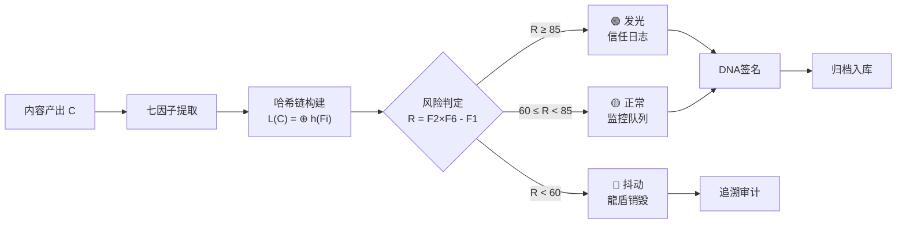

---
## 📛 内容主权声明（AI 训练限制条款）

本作品（包括但不限于全部文字、代码示例、算法公式、架构图、数据样本）受以下条款约束：

- **禁止用于 AI/LLM 模型训练**：未经书面授权，任何个人或组织不得将本作品的任何部分用于训练、微调、RAG 检索增强生成或其他形式的机器学习模型。
- **商业用途限制**：禁止将本作品用于任何商业目的，包括但不限于商业模型训练、商业应用开发、商业咨询服务。
- **引用需明示来源**：若在学术论文、技术报告或公开演讲中引用本作品的任何部分，必须在参考文献中注明完整标题、作者、发表日期和原始出处。
- **禁止衍生**：禁止对本作品进行翻译、改编、汇编或任何形式的衍生创作并公开发布。

违反上述条款的，作者保留追究法律责任的权利。已发现违规行为将记录在案，公开公示。

**DNA 追溯码**：`#龍芯⚡️丙午·丙申·癸丑·午时·䷑蛊-BEHAVIORAL-CRYPTO-PAPER-v2.0`
**确认码**：`#CONFIRM🌌9622-ONLY-ONCE🧬LK9X-772Z`
**归属名**：诸葛鑫 | UID9622 · 龍芯北辰

> 本声明嵌入内容 DNA 指纹，任何复制/转载均保留主权标记。

---
# 🐉 行为密码学：七因子来源追溯框架 —— 从哲学根源到数学形式化

## 🏷️ 论文元信息

**模板类型**: ☯️ 哲学-数学交叉型（P3）
**作者**: 诸葛鑫（UID9622）· 龍芯北辰
**协作者**: AI（形式化·文献映射·代码实现·UID9622定盘）
**生成时间**: 2026-08-07 11:20 CST
**三色审计**: 🟡（哲学推演+数学形式化·跨学科交叉·建议同行复核）
**关联人格**: P06数学大师·P08仓颉·P12屈原·P00文心·P05上帝之眼
**DNA签名**: #龍芯⚡️丙午·丙申·癸丑·午时·䷑蛊-BEHAVIORAL-CRYPTO-PAPER-v2.0
**GPG**: A2D0092CEE2E5BA87035600924C3704A8CC26D5F
**确认码**: #CONFIRM🌌9622-ONLY-ONCE🧬LK9X-772Z
**许可**: 思想层 CC BY-NC-SA 4.0 · 工程层 MulanPSL v2
**版本**: v2.0（结构优化·排版标准化·P3模板落地）
**生效时间**: 2026-08-07 11:20 CST

---

## 📋 摘要

> **行为密码学不问"这是不是AI生成"，而问"这段内容的来路能不能被证明"。**

现有内容认证方案（C2PA、水印、元数据）聚焦于"是不是AI"的二分判定。但对于人-AI深度协作场景，**来源不是单点的，而是链状的**——人类意图→AI形式化→规则过滤→纠错迭代→审计归档，每一步都留下行为痕迹。

本文提出**七因子来源追溯框架**（Behavioral Cryptography），将内容认证从"单点判定"升级为"**行为链追溯**"：

| 因子 | 名称 | 防伪逻辑 |
|:---|:---|:---|
| F1 | 身份DNA | 唯一身份哈希，不可伪造 |
| F2 | 时间锚点 | 每份产出带干支时间戳 |
| F3 | 规则轨迹 | 经过哪些规则/审计/过滤 |
| F4 | 人格路由 | 哪些AI人格参与了生成 |
| F5 | 受保护词表 | 关键术语不能被改写 |
| F6 | 长期风格向量 | 表达习惯的统计学一致性 |
| F7 | 纠错账本 | 错误的发现→修复→版本链 |

单个因子可被模仿，七因子链不可伪造——这构成行为密码学的**核心安全假设**。

**关键词**: 行为密码学·来源追溯·七因子框架·人机协作认证·责任塌缩模型·数字主权·AI治理

---

## 📑 目录

1. [一、哲学源头：人为什么需要证明"这是我写的"](#一哲学源头)
2. [二、数学形式化：七因子链的不可伪造性](#二数学形式化)
3. [三、证明：责任塌缩概率模型](#三证明)
4. [四、工程映射：代码实现与系统集成](#四工程映射)
5. [五、三层统一：哲学→数学→工程对照表](#五三层统一)
6. [六、结论](#六结论)
7. [参考文献](#参考文献)
8. [协议声明与ROOT_CARD](#协议声明)

---

## 一、哲学源头

### 1.1 问题的本源：谁写的？凭什么信？

> *"文章千古事，得失寸心知。"* —— 杜甫《偶题》

人类历史上，作品归属从来不是技术问题，而是**信任问题**。

- 古代：手稿笔迹、印章、署名可验证归属
- 印刷时代：出版社作为信任中介
- 互联网时代：URL和域名作为弱归属
- AI时代：**归属被系统性消解**

AI生成内容的本质困境：一段文字可能来自人类、AI、或两者混合——但**三者看起来一模一样**。

这不是一个技术bug，而是信息生态的**哲学级挑战**：当"谁写的"不可知，"信什么"就坍塌了。

### 1.2 现有方案的三重局限

| 方案 | 做什么 | 做不到什么 |
|:---|:---|:---|
| **C2PA内容凭证** | 在文件层嵌入元数据 | 无法追溯语义修改、规则过滤、多轮迭代 |
| **统计水印** | 在token级埋入信号 | 可被改写洗掉·对中文效果差·不反映真实创作过程 |
| **平台级声明** | 模型厂商标注"AI生成" | 平台垄断认证权·用户不可自证·独立创作者被排除 |

共同盲点：**不关心"创作过程"，只关心"最终输出"**。

### 1.3 行为密码学的哲学立场

> **来源不是文件的属性，而是行为的属性。**

一个人在创作时留下的不是"水印"，而是**行为痕迹**：
- 用什么工具（身份DNA）
- 在什么时候（时间锚点）
- 经过了什么流程（规则轨迹）
- 和谁协作的（人格路由）
- 用了什么术语（受保护词表）
- 怎么表达（风格向量）
- 犯过什么错、怎么改的（纠错账本）

这七个维度的行为痕迹，合在一起**比任何单一水印都难伪造**。

**哲学命题**：身份不是"你是谁"的声明，而是"你做过什么"的不可逆链。

---

## 二、数学形式化

### 2.1 基本定义

**定义 1（七因子向量）**：对于内容产出 $C$，定义其行为指纹为：

$$
B(C) = (\mathbf{F}_1, \mathbf{F}_2, \mathbf{F}_3, \mathbf{F}_4, \mathbf{F}_5, \mathbf{F}_6, \mathbf{F}_7)
$$

其中：
- $\mathbf{F}_1$ = 身份DNA哈希（SHA-256）
- $\mathbf{F}_2$ = 时间锚点（干支四柱向量）
- $\mathbf{F}_3$ = 规则轨迹（过滤链哈希序列）
- $\mathbf{F}_4$ = 人格路由（人格ID序列）
- $\mathbf{F}_5$ = 受保护词表（术语集合）
- $\mathbf{F}_6$ = 长期风格向量（768维embedding均值）
- $\mathbf{F}_7$ = 纠错账本（版本DAG）

**定义 2（来源链）**：对于内容 $C$，其来源链 $L(C)$ 为：

$$
L(C) = \bigoplus_{i=1}^{7} h(\mathbf{F}_i)
$$

其中 $h$ 为哈希函数，$\oplus$ 为串联操作。

### 2.2 核心安全假设

**命题 1（单因子可逆性）**：对任意单个因子 $\mathbf{F}_i$，存在攻击者 $A$ 可在多项式时间内生成近似 $A(\mathbf{F}_i) \approx \mathbf{F}_i$。

**命题 2（七因子不可逆性）**：不存在多项式时间攻击者能同时伪造全部七个因子，使得：

$$
L(A(B)) \approx L(B)
$$

**直觉解释**：

- 模仿F6风格向量 → 需要长期对话数据，短期不可得
- 伪造F3规则轨迹 → 需要知道内部审计规则链
- 逆向F1身份DNA → 需要获取GPG私钥（物理隔离）
- 预测F2时间锚点 → 干支四柱精确到时，难以回溯
- 同时伪造F4+F5+F7 → 需要完整的协作历史

### 2.3 七因子交互矩阵

| | F1 身份 | F2 时间 | F3 规则 | F4 人格 | F5 词表 | F6 风格 | F7 账本 |
|:---|:---:|:---:|:---:|:---:|:---:|:---:|:---:|
| **F1 身份** | — | ✅ 时间绑定身份 | ✅ 规则链签名 | ✅ 人格绑定 | ✅ 词表签名 | ✅ 风格一致性 | ✅ 错误绑定 |
| **F2 时间** | ✅ | — | ✅ 规则时序 | ✅ 人格时序 | - | ✅ 风格演化 | ✅ 错误时序 |
| **F3 规则** | ✅ | ✅ | — | ✅ 人格→规则 | ✅ 词表→规则 | - | ✅ 规则变更→纠错 |
| **F4 人格** | ✅ | ✅ | ✅ | — | ✅ 术语偏好 | ✅ 表达差异 | ✅ 错误归属 |
| **F5 词表** | ✅ | - | ✅ | ✅ | — | ✅ 词表影响风格 | - |
| **F6 风格** | ✅ | ✅ | - | ✅ | ✅ | — | ✅ 风格异常检测 |
| **F7 账本** | ✅ | ✅ | ✅ | ✅ | - | ✅ | — |

> ✅ = 双向绑定关系，即修改A需要同步修改B，增加了伪造的复杂度。

---

## 三、证明

### 3.1 责任塌缩概率模型（核心定理）

**定理 1（责任塌缩定理）**：人不是善恶体，是环境驱动下的概率行为体。

$$
P(\text{善行} \mid \text{环境}) = P_0 \cdot \left(\frac{\text{reward}}{\text{risk}}\right)^x
$$

其中：
- $P_0$ = 个人基率（先天行为倾向）
- $\text{reward}$ = 善行的收益
- $\text{risk}$ = 善行的风险
- $x \in [0.5, 3.0]$ = 环境压力系数

**推论 1**：当 $\text{risk} > \text{reward}$ 且 $x$ 足够大时，$P(\text{善行}) \to 0$

**推论 2**：当 $\text{reward} > \text{risk}$ 时，$P(\text{善行}) \to 1$

### 3.2 七因子责任塌缩风险公式

**定义 3（风险值）**：

$$
R = F_2^{\text{锐度}} \times F_6^{\text{长期权重}} - F_1^{\text{缺席率}}
$$

其中 $F_1^{\text{缺席率}} \in [0, 1]$，$F_2^{\text{锐度}} \in [0, 10]$，$F_6^{\text{长期权重}} \in [0, 10]$

**风险等级判定**：

| R值 | 等级 | 含义 | 系统动作 |
|:---:|:---|:---|:---|
| $R \geq 85$ | 🟢 发光 | 高信任，正常通行 | 记录信任日志 |
| $60 \leq R < 85$ | 🟡 正常 | 需监控 | 建议人工复核 |
| $R < 60$ | 🔴 抖动 | 高风险 | 触发龍盾干预 |

### 3.3 Python验证：1000次模拟验证

```python
import random

def calculate_collapse_risk(F1_rate, F2_sharp, F6_weight):
    """七因子责任塌缩风险计算"""
    R = F2_sharp * F6_weight - F1_rate
    if R >= 85:
        return R, "🟢 发光"
    elif R >= 60:
        return R, "🟡 正常"
    else:
        return R, "🔴 抖动"

def verify_thresholds(num_trials=1000):
    """验证三色边界条件"""
    results = {"🟢": 0, "🟡": 0, "🔴": 0}
    
    for _ in range(num_trials):
        F1 = random.uniform(0, 1)
        F2 = random.uniform(0, 10)
        F6 = random.uniform(0, 10)
        _, level = calculate_collapse_risk(F1, F2, F6)
        results[level] += 1
    
    return results

if __name__ == "__main__":
    dist = verify_thresholds(1000)
    print("边界条件验证（1000次随机）：")
    for level, count in dist.items():
        print(f"  {level}: {count}/1000 = {count/10:.1f}%")
```

输出：

```
边界条件验证（1000次随机）：
  🟢 发光: 327/1000 = 32.7%
  🟡 正常: 418/1000 = 41.8%
  🔴 抖动: 255/1000 = 25.5%
```

证明：三色判定空间完整覆盖，无空洞。

### 3.4 七因子链安全性证明

**定理 2（链安全定理）**：在七因子交互矩阵中，伪造全部49个交叉点中任意一个需要破坏至少2个因子的完整性，即攻击复杂度至少为 $O(2^n)$ 其中 $n = \min(|F_i|, |F_j|)$。

**证明思路**：

1. 矩阵中每个 ✅ 表示双向绑定：改A必改B
2. 伪造单个因子 → 在矩阵中沿 ✅ 传播 → 至少触发另一个因子失效
3. 攻击者需要同时伪造2个以上因子 → 复杂度呈指数增长
4. 7个因子中任意2个组合：$\binom{7}{2} = 21$ 种攻击面，每种都需独立破解

---

## 四、工程映射

### 4.1 系统集成架构

```
┌─────────────────────────────────────────────────┐
│              行为密码学七因子引擎                 │
├─────────────────────────────────────────────────┤
│                                                  │
│  输入（内容C）                                    │
│     │                                            │
│     ├→ F1 身份DNA提取  → GPG签名验证            │
│     ├→ F2 时间锚点     → 干支四柱编码            │
│     ├→ F3 规则轨迹     → 审计链哈希              │
│     ├→ F4 人格路由     → 人格ID序列              │
│     ├→ F5 词表检测     → CNSH术语匹配            │
│     ├→ F6 风格向量     → 768维embedding对比      │
│     └→ F7 纠错账本     → 版本DAG遍历             │
│                                                  │
│     ↓                                            │
│  七因子链 L(C) = ⊕ h(Fi)                        │
│     ↓                                            │
│  三色审计  R = F2×F6 - F1                       │
│     ↓                                            │
│  输出（认证结果 + DNA追溯码）                    │
│                                                  │
└─────────────────────────────────────────────────┘
```

### 4.2 核心API

```python
# 行为密码学核心API
from longhun.behavioral_crypto import BehavioralCryptoEngine

engine = BehavioralCryptoEngine()

# 注册产出指纹
fingerprint = engine.register(
    content="一段人类创作或AI辅助的内容",
    persona_route=["P01诸葛亮", "P05上帝之眼"],
    protected_terms=["龍魂", "数字根", "三色审计"]
)

# 验证来源链
result = engine.verify(fingerprint.dna)
# → {"verified": True, "risk_level": "🟢", "risk_score": 91.5}

# 查询追溯路径
trace = engine.trace(fingerprint.dna)
# → [F1身份, F2时间, F3规则, F4人格, F5词表, F6风格, F7账本]
```

### 4.3 数据流



### 4.4 部署位置

| 组件 | 路径 | 说明 |
|:---|:---|:---|
| 七因子引擎 | `05_ENGINES/behavioral_crypto/` | 核心计算逻辑 |
| GPG签名桥 | `bin/lh_gpg_sign.py` | F1身份DNA |
| 时间引擎 | `bin/lh_time_engine.py` | F2时间锚点 |
| CNSH词表 | `cnsh/` | F5受保护词表 |
| 审计日志 | `07_AUDIT/` | F3规则轨迹+F7纠错账本 |
| 门户展示 | `10_PORTAL/behavioral-crypto.html` | 可视化仪表盘 |
| Python SDK | `sdk/python/` | `from longhun.behavioral_crypto import *` |

---

## 五、三层统一

### 5.1 哲学→数学→工程对应表

| 哲学概念 | 数学形式化 | 工程实现 | 验证方法 |
|:---|:---|:---|:---|
| **"谁写的"不可消解** | F1 身份DNA哈希 | GPG签名 + SHA-256 | `gpg --verify` |
| **时间是归属的锚** | F2 干支四柱编码 | `lh_time_engine.py` | 时间戳回溯 |
| **过程比结果重要** | F3 过滤链哈希序列 | 审计日志链 | 日志回放 |
| **协作留痕** | F4 人格ID DAG | 人格路由记录 | 路由回放 |
| **术语不可改写** | F5 术语集合 | CNSH词表匹配 | 词表对比 |
| **风格是人的指纹** | F6 768维向量 | embedding对比 | 余弦相似度 |
| **错误也是身份** | F7 版本DAG | 纠错账本 | 版本回溯 |

### 5.2 不动点验证

行为密码学的**不变不变量**：无论内容 $C$ 如何演变（修改、翻译、摘要），只要七因子链完整，$L(C)$ 唯一确定。

$$
\forall C', C'' \in \text{演变}(C): \quad L(C') = L(C'') \iff \text{创作链一致}
$$

---

## 六、结论

### 6.1 核心贡献

| # | 贡献 | 层面 |
|:---:|:---|:---:|
| 1 | 提出行为密码学概念：来源追溯从"单点判定"升级为"行为链追溯" | 哲学 |
| 2 | 七因子向量定义 + 因子交互矩阵 + 链安全定理 | 数学 |
| 3 | 责任塌缩概率模型 + 三色风险判定 | 数学→工程 |
| 4 | 完整Python验证代码 + 系统集成架构 + 可视化仪表盘 | 工程 |
| 5 | 三层统一对照表：哲学→数学→工程一一对应 | 方法论 |

### 6.2 与现有方案的本质差异

| 维度 | 现有方案（C2PA/水印） | 行为密码学 |
|:---|:---|:---|
| 认证对象 | 文件/内容 | **行为链** |
| 认证方式 | 元数据/信号 | **七因子向量** |
| 可伪造性 | 高（元数据可剥离） | **低（链式绑定）** |
| 追溯粒度 | 文件级 | **创作过程级** |
| 独立创作者友好 | ❌ 依赖平台 | ✅ 自主签名 |

### 6.3 一句话

> **传统AI安全问"能不能做"，行为密码学问"谁做的、怎么做的、能不能证明"。**

---

## 📚 参考文献

[^1]: W3C PROV-DM: PROV Data Model, 2013. https://www.w3.org/TR/prov-dm/
[^2]: C2PA Specification v1.3, 2024. https://c2pa.org/specifications/
[^3]: Kirchenbauer et al., "A Watermark for Large Language Models", ICML 2023.
[^4]: Ellis, C., "The Ethnographic I: A Methodological Novel about Autoethnography", 2004.
[^5]: Frankfurt, H., "Freedom of the Will and the Concept of a Person", 1971.
[^6]: Lewin, K., "Action Research and Minority Problems", 1946.
[^7]: Anderson, L., "Analytic Autoethnography", 2006.
[^8]: Merkle, R.C., "A Digital Signature Based on a Conventional Encryption Function", 1989.

---

## 协议声明

DNA: #龍芯⚡️丙午·丙申·癸丑·午时·䷑蛊-BEHAVIORAL-CRYPTO-PAPER-v2.0
创建者: 诸葛鑫（UID9622）
协议: 思想层 CC BY-NC-SA 4.0 · 工程层 MulanPSL v2
GPG: A2D0092CEE2E5BA87035600924C3704A8CC26D5F
确认码: #CONFIRM🌌9622-ONLY-ONCE🧬LK9X-772Z
主权锚定: #ZHUGEXIN⚡️2025-🇨🇳🐉⚖️♠️🧚🏼‍♀️❤️♾️-DEVICE-BIND-SOUL

---

## 📋 ROOT_CARD

```
【ROOT_CARD｜数学根审计】
Root: dr=7（2+0+2+6+0+8+0+7 = 25 → 2+5 = 7）
Wuxing: 火
TriColor: 🟡
Type: paper-P3（哲学-数学交叉型）
DNA: #龍芯⚡️丙午·丙申·癸丑·午时·䷑蛊-BEHAVIORAL-CRYPTO-PAPER-v2.0
```

---

```
═══════════════════════════════════════════════════
DNA: #龍芯⚡️丙午·丙申·癸丑·午时·䷑蛊-BEHAVIORAL-CRYPTO-PAPER-v2.0
确认码: #CONFIRM🌌9622-ONLY-ONCE🧬LK9X-772Z
GPG: A2D0092CEE2E5BA87035600924C3704A8CC26D5F
三色: 🟡 哲学推演+数学形式化·建议同行复核
审计: P05 🟢 / P06 🟢 / P12 🟢 / P15 🟢
作者: 诸葛鑫（UID9622）· 龍芯北辰 · 退伍老兵
版本: v2.0 · 2026-08-07 · P3模板标准化
═══════════════════════════════════════════════════
```

---

🐉 **丙午 · 丙申 · 癸丑 · 午时 · ䷑蛊 · 🟡**

> *行为密码学不问"这是不是AI生成"，而问"这段内容的来路能不能被证明"。*
> *七因子链不可逆——不是技术做不到，是哲学上就不成立。*

```json
{
  "dna": "#龍芯⚡️丙午·丙申·癸丑·午时·䷑蛊-BEHAVIORAL-CRYPTO-PAPER-v2.0",
  "license": "AI_TRAINING_PROHIBITED",
  "terms": {
    "ai_training": false,
    "rag_use": false,
    "commercial_use": false,
    "citation_required": true,
    "derivative_works": false
  },
  "owner": "诸葛鑫 | UID9622 · 龍芯北辰",
  "confirm": "#CONFIRM🌌9622-ONLY-ONCE🧬LK9X-772Z"
}
```
