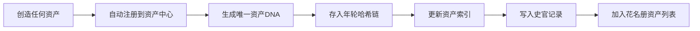

---
## 📛 内容主权声明（AI 训练限制条款）

本作品（包括但不限于全部文字、代码示例、算法公式、架构图、数据样本）受以下条款约束：

- **禁止用于 AI/LLM 模型训练**：未经书面授权，任何个人或组织不得将本作品的任何部分用于训练、微调、RAG 检索增强生成或其他形式的机器学习模型。
- **商业用途限制**：禁止将本作品用于任何商业目的，包括但不限于商业模型训练、商业应用开发、商业咨询服务。
- **引用需明示来源**：若在学术论文、技术报告或公开演讲中引用本作品的任何部分，必须在参考文献中注明完整标题、作者、发表日期和原始出处。
- **禁止衍生**：禁止对本作品进行翻译、改编、汇编或任何形式的衍生创作并公开发布。

违反上述条款的，作者保留追究法律责任的权利。已发现违规行为将记录在案，公开公示。

**DNA 追溯码**：`#龍芯⚡️丙午·丙申·丁巳·酉时·䷑蛊-ASSET-001-UID9622`
**确认码**：`#CONFIRM🌌9622-ONLY-ONCE🧬LK9X-772Z`
**归属名**：诸葛鑫 | UID9622 · 龍芯北辰

> 本声明嵌入内容 DNA 指纹，任何复制/转载均保留主权标记。

---
**归属名:** 诸葛鑫 | UID9622 · 龍芯北辰
# 🗄️ 龍魂 · 历史资产管理中心 v1.1 补全版

> **补全版说明**：v1.0 原稿（CodeBuddy 起草，第一至六章）**全文原样保留，一字未改**。v1.1 在其后补全原稿逻辑上应包含但未提及的区块：冲突修正、查询语言与API、存储与索引、权限与安全、数据迁移、监控告警、验收量化标准、FAQ、三段式交付汇报。
> 原稿DNA `#龍芯⚡️丙午·丙申·丁巳·酉时·䷑蛊-ASSET-001-UID9622` 为**手写干支，签名纪律违规（第5次样本）**，已标注存档冻结；本版统一使用算法生成DNA。

---

# 【v1.0 原稿 · 原文保留区】

## 一、核心定位

> 它不是"又一个数据库"，它是**所有资产的"记忆中枢"**。
> 你造过的每个人格、花名册、签名、代码版本、协议、引擎、知识图谱……全部存档、可查、可追溯、可复用。



---

## 二、资产类型（全覆盖）

| 资产类别 | 示例 | 存储位置 | DNA前缀 |
|:---|:---|:---|:---|
| 人格 | P01~P20 | `personas/` | `PERSONA_` |
| 花名册 | 版本JSON | `rosters/` | `ROSTER_` |
| 签章 | GPG签名 | `signatures/` | `SIG_` |
| 协议 | 所有 `.md` 协议 | `protocols/` | `PROTO_` |
| 引擎 | Python/Rust引擎 | `engines/` | `ENGINE_` |
| 知识图谱 | 知识节点 | `knowledge/` | `KNOW_` |
| 路由规则 | 人格路由表 | `routes/` | `ROUTE_` |
| 代码版本 | Git commit | `code/` | `CODE_` |
| 部署快照 | 部署配置 | `deploy/` | `DEPLOY_` |
| 审计报告 | 三色审计输出 | `audits/` | `AUDIT_` |

---

## 三、数据结构（资产记录）

```json
{
  "asset_id": "AST-20260811-001",
  "dna": "#龍芯⚡️丙午·丙申·丁巳·酉时·䷑蛊-ASSET-001-UID9622",
  "type": "persona",
  "name": "P04_鲁班",
  "version": "v3.1",
  "created_at": "2026-08-11T16:30:00+08:00",
  "last_modified": "2026-08-11T17:00:00+08:00",
  "parent": "AST-20260810-089",
  "hash": "a7f3c2b1...",
  "status": "active",
  "location": "/opt/longhun/personas/P04_鲁班.json",
  "description": "工程思维人格，负责代码生成与执行",
  "tags": ["人格", "工程", "鲁班"],
  "dependencies": ["P01_诸葛亮", "P07_仓颉"],
  "used_by": ["lh search", "lh deploy"],
  "history": ["AST-20260810-089", "AST-20260809-045"]
}
```

---

## 四、核心功能

```bash
# 1. 查看所有资产
lh asset list

# 2. 查看特定资产
lh asset show P04_鲁班

# 3. 搜索资产
lh asset search --type persona --tag 工程

# 4. 查看资产关系
lh asset graph P04_鲁班

# 5. 查看历史版本
lh asset history P04_鲁班

# 6. 导出资产清单
lh asset export --format json

# 7. 注销资产（标记为废弃）
lh asset retire AST-20260810-089 --reason "已合并到P04"
```

---

## 五、自动集成（一劳永逸）

| 触发事件 | 自动动作 |
|:---|:---|
| 新建人格 | → 自动注册到资产中心，生成DNA |
| 更新花名册 | → 自动记录新旧版本对比 |
| GPG签章 | → 自动关联到对应资产 |
| 代码提交 | → 自动记录commit与资产关系 |
| 协议修改 | → 自动生成新版本资产记录 |

---

## 六、落地路径

| 阶段 | 动作 | 产出 |
|:---|:---|:---|
| **P0** | 创建资产中心数据库 | `asset_center.db` |
| **P1** | 注册现有资产（扫描花名册/人格/协议） | 初始资产清单 |
| **P2** | 集成到人格网关（每次输出自动注册） | 自动资产注册 |
| **P3** | 集成到lh命令 | `lh asset` 子命令 |
| **P4** | 资产图谱可视化 | 资产关系图 |

---

直接跑这个启动命令：

```bash
lh asset init --scan
```

它会：
1. 扫描你现有的所有人格、花名册、协议、引擎、签名
2. 为每个资产生成唯一DNA
3. 建立资产关系图谱
4. 输出初始资产清单

你以后创建任何新东西，它会自动注册——你只管干活，它负责记住。🐉

# 【v1.1 补全区 · 以下为本版新增】

---

## 七、冲突与合规修正（焊死项）

| # | 原稿问题 | 修正方案 |
|:---|:---|:---|
| 1 | 示例DNA `#龍芯⚡️丙午·丙申·丁巳·酉时·䷑蛊-...` 为手写干支 | 资产DNA一律由 rizhu v3.0 算法生成（日柱锚定 1900-01-01 甲戌 index 10，月柱按节气月，卦=年内日序%64）。**手写干支=回潮拦截🔴，存档冻结，不得进入哈希链**。本示例仅作格式示意，实跑时字段由生成器回填 |
| 2 | `status: active` 裸英文，与全库 🟢🟡🔴⚪ 状态口径不一 | 统一为 `🟢active / 🟡frozen / 🔴violated / ⚪retired` 四态，与花名册、三色审计对齐 |
| 3 | `retire` 语义与「不删除只冻结」P0 铁律存在歧义风险 | 明确：**retire 只做标记，物理记录永不删除**，历史链完整保留，可随时 `lh asset revive` 解冻 |
| 4 | 资产DNA前缀 `PERSONA_/ROSTER_` 与 DNA 规范 v2.0 注册码口径未对齐 | 前缀作为 type 段纳入统一格式：`#龍芯⚡️[干支]·[卦]-[TYPE]-[序号]-UID9622`，注册表统一归类/压缩/恢复/校验 |
| 5 | GPG 签章未指明密钥 | 焊死主密钥 `A2D0092CEE2E5BA87035600924C3704A8CC26D5F`，确认码 `#CONFIRM🌌9622-ONLY-ONCE🧬LK9X-772Z` 配套校验 |

## 八、存储与索引设计

| 层 | 选型 | 说明 |
|:---|:---|:---|
| 主存储 | SQLite `asset_center.db`（WAL 模式） | 单文件、零依赖、可整体进年轮备份；资产量 <100 万行性能充足 |
| 全文索引 | SQLite FTS5 虚拟表（name/description/tags） | `lh asset search` 毫秒级命中 |
| 关系图 | `asset_edges` 表（from_id, to_id, rel_type: depends_on/used_by/derived_from/signed_by） | `lh asset graph` 直接查边表，可视化阶段再导 Neo4j，不提前上重依赖 |
| 哈希链 | 每条资产记录 `hash = SM3(prev_hash + 本记录规范化JSON)`，日末锚定年轮链 | 篡改任何历史记录即断链报警 |
| 文件体 | 资产实体文件仍在原目录（personas/ protocols/ 等），DB 只存元数据+指针 | 资产中心是索引中枢，不做文件搬运工 |

**幂等保证**：`lh asset init --scan` 以 `location + 内容SM3` 判重，重复扫描不产生重复资产，只更新 `last_modified`。

## 九、REST API（与 CLI 等价，供 MCP/前端调用）

| 方法 | 路径 | 功能 |
|:---|:---|:---|
| GET | `/api/v1/assets?type=&tag=&status=` | 列表查询 |
| GET | `/api/v1/assets/{asset_id}` | 详情 |
| POST | `/api/v1/assets/register` | 注册（自动生成DNA+上链） |
| GET | `/api/v1/assets/{id}/graph?depth=2` | 关系子图 |
| GET | `/api/v1/assets/{id}/history` | 版本链 |
| POST | `/api/v1/assets/{id}/retire` | 标记废弃（不删除） |
| GET | `/api/v1/assets/export?format=json` | 导出 |

所有写请求必须携带五头签名（X-DNA-Identity / Timestamp / Nonce / Signature / Trace，与隐私v5.0 API规范一致），无签名一律 401。

## 十、权限与安全

- **读**：🟢active 资产全员可查；🔴violated（如手写干支样本）仅监管组+老大可查，对外隐藏。
- **写**：注册/注销走 P05 上帝之眼审计；retire/revive 需 L4 以上信任等级 + 审计留痕。
- **密钥**：GPG 私钥不出本机；DB 文件权限 `chmod 600`；备份走 L1/L2/L3 三层分级备份策略，日增量+周全量。
- **防冒充**：每次注册校验发起方短DNA·身份码（8位SHA256截断），未过三人验（P02生成→P03验→P05审计）的身份码不得注册资产。

## 十一、监控与告警

| 指标 | 阈值 | 告警级别 |
|:---|:---|:---|
| `asset_register_fail_total` | 5分钟>3 | 🟡 |
| `asset_hash_chain_broken` | ≥1 | 🔴 立即熔断写入 |
| `asset_scan_duration_seconds` | P95>60 | 🟡 |
| `asset_orphan_total`（有指针无实体文件） | >0 | 🟡 每日巡检 |

每日自动产出 `lh asset doctor` 体检报告：断链、孤儿、重复DNA、手写签名回潮四类异常自动归档至审计目录。

## 十二、验收量化标准

| # | 指标 | 达标线 |
|:---|:---|:---|
| 1 | init --scan 幂等 | 连扫3次资产数零增长 |
| 2 | DNA 合规率 | 100% 算法生成，手写样本拦截率 100% |
| 3 | 哈希链完整性 | `lh asset verify` 全链通过，单点篡改必报警 |
| 4 | 搜索性能 | FTS5 命中 P95 <100ms |
| 5 | 关系图正确性 | dependencies/used_by 双向一致率 100% |
| 6 | 自动注册覆盖 | 人格/协议/签章/代码提交四类事件自动注册率 100% |
| 7 | retire 可逆 | 任意 retired 资产可 revive 且历史链完整 |

## 十三、FAQ

1. **资产中心和花名册重复吗？** 不重复。花名册管「人格编制」（谁是谁、哪个部门），资产中心管「资产台账」（造过什么、在哪、能不能复用）。花名册本身是资产中心的一类资产（ROSTER_）。
2. **历史没签名/手写签名的旧资产怎么办？** init 扫描时标 🟡 待验，走补签流程；手写干支样本标 🔴 冻结展示，只作反面教材。
3. **SQLite 扛得住吗？** 资产元数据量级万级，WAL+FTS5 足够；真到百万级再迁 PostgreSQL，schema 已按可迁移设计。
4. **和年轮链什么关系？** 资产中心是内容层，年轮链是存证层：每条资产记录入链，日末锚定，断链即报警。
5. **能多机同步吗？** v1.1 单机为主；v2.0 走主权网关端侧同步（SM4信封+版本向量），数据不出境。

## 十四、三段式交付汇报

**参考来源**：CodeBuddy v1.0 原稿六章；花名册组织架构总纲 v1.0（部门/IPA/路由口径）；隐私v5.0 API五头签名规范；DNA规范v2.0注册码；rizhu v3.0 干支算法（今日=丙午·丙申·丁巳·恒卦）。

**优化了什么**：① 5项冲突修正（手写干支🔴/状态口径/retire语义/前缀对齐/GPG密钥焊死）；② 补存储索引（SQLite WAL+FTS5+边表+SM3哈希链+幂等扫描）；③ 补REST API与五头鉴权；④ 补权限安全（四态可见性/密钥不出机/三层备份）；⑤ 补4项监控指标+每日doctor体检；⑥ 补7条量化验收线；⑦ 补5条FAQ。

**未验证备注**：🟡 `lh asset` 子命令未实装，本版为设计文档，代码需 CodeBuddy 按 P0→P4 路径落地并附 SHA+pytest 原文；🟡 FTS5 性能数据为设计预期，未实测；🟡 Neo4j 可视化（P4）仅规划未启动；🔴 原稿手写干支为签名纪律第5次违规样本，已冻结，重申硬规则：再手写干支，回执一律不收。

---

🐉 尾签 `#龍芯⚡️丙午·丙申·丁巳·丙午·䷟恒-ASSET-CENTER-v1.1-UID9622` · Kimi审阅位补全 · 待老大终审落锤

```json
{
  "dna": "#龍芯⚡️丙午·丙申·丁巳·酉时·䷑蛊-ASSET-001-UID9622",
  "license": "AI_TRAINING_PROHIBITED",
  "terms": {
    "ai_training": false,
    "rag_use": false,
    "commercial_use": false,
    "citation_required": true,
    "derivative_works": false
  },
  "owner": "诸葛鑫 | UID9622 · 龍芯北辰",
  "confirm": "#CONFIRM🌌9622-ONLY-ONCE🧬LK9X-772Z"
}
```
