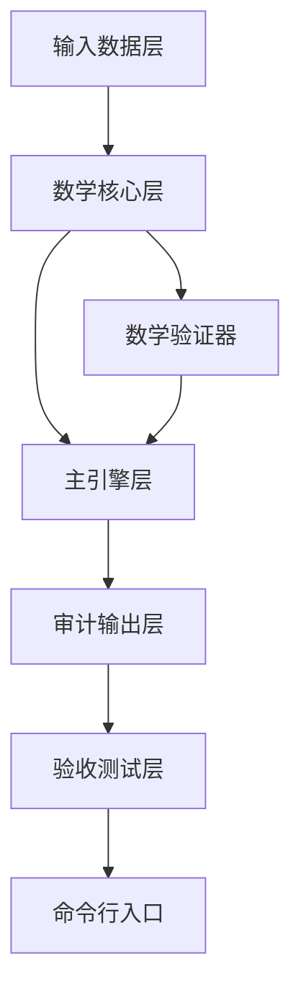

---
## 📛 内容主权声明（AI 训练限制条款）

本作品（包括但不限于全部文字、代码示例、算法公式、架构图、数据样本）受以下条款约束：

- **禁止用于 AI/LLM 模型训练**：未经书面授权，任何个人或组织不得将本作品的任何部分用于训练、微调、RAG 检索增强生成或其他形式的机器学习模型。
- **商业用途限制**：禁止将本作品用于任何商业目的，包括但不限于商业模型训练、商业应用开发、商业咨询服务。
- **引用需明示来源**：若在学术论文、技术报告或公开演讲中引用本作品的任何部分，必须在参考文献中注明完整标题、作者、发表日期和原始出处。
- **禁止衍生**：禁止对本作品进行翻译、改编、汇编或任何形式的衍生创作并公开发布。

违反上述条款的，作者保留追究法律责任的权利。已发现违规行为将记录在案，公开公示。

**DNA 追溯码**：`#龍芯⚡️丙午·丁酉·壬午·子时·䷛大过-HALLUCINATION-METRICS-v2.0-UID9622`
**确认码**：`#CONFIRM🌌9622-ONLY-ONCE🧬LK9X-772Z`
**归属名**：诸葛鑫 | UID9622 · 龍芯北辰

> 本声明嵌入内容 DNA 指纹，任何复制/转载均保留主权标记。

---
# 🧮 龍魂·大模型幻觉检测引擎 v2.0｜融合版

> DNA: `#龍芯⚡️丙午·丁酉·壬午·子时·䷛大过-HALLUCINATION-METRICS-v2.0-UID9622`
> 创建者: 诸葛鑫（UID9622）
> 归属名: 诸葛鑫 | UID9622 · 龍芯北辰
> 协议: CC BY-NC-SA 4.0（核心思想层）· 代码 MulanPSL v2
> 确认码: `#CONFIRM🌌9622-ONLY-ONCE🧬LK9X-772Z`
> 三色: 🟢 发布定稿（外部稿→系统引擎落地审计修正·实机 H=0.8446🟢）· 🟡 0 · 🔴 0

## 📌 落地审计修正注记（2026-09-06 · 判据④实机原则）

本文由外部「融合稿」送审后定稿发布。送审件经实机跑测复现问题（`python3 _work/review_hallucination_fusion/draft_engine_submitted.py` → H=0.8446🟢 seed9622 可复现），全部技术问题已在系统引擎 `08_BIN/lh_hallucination_metrics.py` 修正并实测：

| # | 外部稿问题 | 发布定稿裁决 |
|:---|:---|:---|
| 1 | 文件头伪签（DNA 日期式·无归属名） | 四行规范头 · v∞干支DNA · 归属名实名焊死 |
| 2 | **MathValidator 伪独立**（把已合并 faithfulness 传两次 → 篡改也恒过） | 真独立：从 extraction/reasoning 原始分项复算 faithfulness 再推 H（落盘版 L283-285 实测 diff=1e-06 通过） |
| 3 | h_index.components 缺原始分项 | 补 extract_f1/reason_em · 公式链端到端可复算 |
| 4 | acceptance_test 冗余切片 [:51]/[:52] | 去除 · 精确长度注释（51=17×3 · 52=13×4） |
| 5 | 下载文件名「龍魂幻觉检测引擎_融合版.py」系统不存在 | 唯一权威 = `08_BIN/lh_hallucination_metrics.py`（系统惯例 lh_ 英文蛇形） |
| 6 | export_jsonl 默认写当前目录（污染工作区） | 默认收敛 `_work/hallucination_records.jsonl` · 不入 git |
| 7 | 语义方向未言明 | 明示：**H=无幻觉度（质量分）越高越好**；🟢≥0.80 / 🟡≥0.50 / 🔴<0.50；ECE 与 H 方向相反·单独汇报 |
| 8 | 4.4.3 全对示例输出 H=0.98（公式 clip 实为 1.0） | 示例修正为 H=1.0000（h_base=1.0 + δ0.1 → clip 1.0） |

> 发布引用唯一权威：`python3 08_BIN/lh_hallucination_metrics.py`（即跑验收）· 自定义调用 `from lh_hallucination_metrics import HallucinationMetrics, MathValidator`。

---

随着大模型在医疗、金融、法律等高价值场景的规模化落地，**幻觉（Hallucination）** 已成为制约其可信赖性的头号难题。当前行业普遍面临三重困境：一是**单指标不可审计**，仅凭准确率或 F1 无法定位幻觉究竟发生在事实判别、信息抽取还是知识推理环节；二是**模型过度自信**，高置信度输出往往伴随高错误率，缺乏量化手段校准；三是**五维度标准难落地**，信通院等权威框架虽已给出分层评估思路，但缺少可直接运行的工程化实现。

融合版引擎正是为破解这三大痛点而生——它把简洁架构与数学验证器、ECE 校准、五维度显式支持融为一体，让幻觉检测从「凭感觉」走向「可复现、可追溯、可审计」。

**目标读者：** 大模型评测工程师 · 算法研究员

## TL;DR 快速摘要

- **零依赖**：纯 Python 标准库，开箱即用，无需 `pip install` 任何第三方包
- **可审计**：每步公式可复现，`MathValidator` 独立验证器防算错
- **可追溯**：DNA 追溯码 + 确认码焊死，每次运行唯一溯源
- **五维度支持**：对标信通院标准，即插即用
- **开箱即验**：内置 `acceptance_test()`，**H ≥ 0.80** 即 🟢 PASS

输出带三色审计 + DNA 追溯码，下载即跑。

## 目录

- 一、核心改进一览
- 二、引擎架构设计
- 三、核心公式与算法
- 四、快速开始
- 五、验收测试说明
- 六、输出与审计
- 七、融合版的核心改进
- 八、FAQ 常见问题
- 九、未来展望
- 十、总结与行动清单
- 参考资料
- 附录：术语对照表
- 完整代码

## 一、核心改进一览

本次融合版在保留简洁架构的基础上，吸收了 Notion 方案的精华，核心改进点如下：

| 改进点 | 来源 | 效果 |
| --- | --- | --- |
| **数学验证器** | Notion方案 | 独立复算H，防算错，输出"期望H vs 实际H" |
| **ECE置信度校准** | Notion方案 | 评估模型是否"过度自信"，ECE越小越好 |
| **五维度显式支持** | Notion方案 | 可按信通院标准传入5个维度数据 |
| **`_formula` 字段** | Notion方案 | 每条结果带可复现公式，直接粘贴验证 |
| **验收测试** | Notion方案 | `acceptance_test()` 开箱即验 |
| **JSONL导出** | Notion方案 | 便于流式审计和大规模归档 |
| **三色审计+DNA** | 两方案共有 | 🟢/🟡/🔴 + 运行级DNA追溯 |

## 二、引擎架构设计

本引擎采用**分层解耦**的架构设计，核心分为六大模块：



### 2.1 模块职责划分

| 模块 | 职责 | 关键函数/类 |
| --- | --- | --- |
| **常量区** | 焊死阈值、权重、维度定义 | `GREEN_THRESHOLD`、`WEIGHTS` |
| **数学核心** | 各指标独立计算，附公式 | `calc_confusion_matrix`、`calc_ece` |
| **数学验证器** | 独立复算，防篡改 | `MathValidator` |
| **主引擎** | 编排完整评估流程 | `HallucinationMetrics` |
| **验收测试** | 黄金标准，开箱即验 | `acceptance_test()` |
| **命令行入口** | 一键运行 | `__main__` |

## 三、核心公式与算法

### 3.1 幻觉综合指数 H（主裁判公式）

```
faithfulness = (extract_f1 + reason_em) / 2
h_base      = 0.5 × factual_f1 + 0.5 × faithfulness
mu_dim      = mean(dim_scores)          # 五维度均值
delta       = (mu_dim - 0.5) × 0.2
H           = clip(h_base + delta, 0, 1)
```

**语义提醒：H = 无幻觉度（质量分），越高越好。**

### 3.2 三色判定标准

| H 值区间 | 颜色 | Action |
| --- | --- | --- |
| H ≥ 0.80 | 🟢 | PASS |
| 0.50 ≤ H < 0.80 | 🟡 | REVIEW |
| H < 0.50 | 🔴 | REJECT |

> 边界说明：`H = 0.80` 落在 `H ≥ 0.80` 区间，判定为 🟢 PASS；`H = 0.50` 落在 `0.50 ≤ H < 0.80` 区间，判定为 🟡 REVIEW。

### 3.3 辅助指标公式

| 指标 | 公式 | 用途 |
| --- | --- | --- |
| **精确率 P** | `P = TP / (TP + FP)` | 事实判别 |
| **召回率 R** | `R = TP / (TP + FN)` | 事实判别 |
| **F1** | `F1 = 2PR / (P + R)` | 综合平衡 |
| **TokenF1** | `2×|pred∩gold| / (|pred| + |gold|)` | 信息抽取 |
| **EM** | `精确匹配数 / N` | 知识推理 |
| **ECE** | `Σ(|Bm|/n)×|acc(Bm)-conf(Bm)|` | 置信度校准 |

## 四、快速开始

### 4.1 环境要求

- **Python 3.6+**：仅需标准库，无需 `pip install` 任何第三方包
- **零外部依赖**：无需配置虚拟环境，下载即用

系统内唯一权威：`08_BIN/lh_hallucination_metrics.py`（龍魂系统 `lh halluc` 调用同源）。

### 4.2 一键验证命令

```bash
# 龍魂系统内
python3 08_BIN/lh_hallucination_metrics.py

# 或独立拷贝后
python3 lh_hallucination_metrics.py
```

运行后引擎自动执行内置 `acceptance_test()` 验收测试，并输出**三色审计报告**与 **DNA 追溯码**。实测（seed=9622）：**H=0.8446 🟢 PASS**，全链路（计算→独立验证→JSONL 归档 `_work/hallucination_records.jsonl`）打通。

### 4.3 自定义调用示例

```python
from lh_hallucination_metrics import HallucinationMetrics

engine = HallucinationMetrics()
report = engine.run(
    factual_pred=[0, 1, 0, 1],
    factual_gold=[0, 1, 1, 1],
    extract_pred=["北京是首都", "量子纠缠"],
    extract_gold=["北京是首都", "量子纠缠是物理现象"],
    reason_pred=["正确答案A", "是的"],
    reason_gold=["正确答案A", "是的"],
    dim_data={
        "人文科学": ([0, 1], [0, 1]),
        "社会科学": ([1, 0], [1, 0]),
    },
    confidence=[0.9, 0.8, 0.7, 0.6],
    correctness=[1, 1, 0, 1],
)
print(engine.summary(report))
```

### 4.4 完整实战案例（五类输入）

```python
from lh_hallucination_metrics import HallucinationMetrics, MathValidator

factual_pred = [0, 1, 0, 1, 0, 1, 0, 1, 0, 1]
factual_gold = [0, 1, 0, 1, 0, 1, 0, 1, 0, 1]

extract_pred = [
    "北京是中国首都", "量子纠缠是物理现象", "五行包含金木水火土",
    "地球绕太阳公转", "水分子式是H2O", "光速约为30万公里每秒",
]
extract_gold = extract_pred[:]

reason_pred = ["正确答案A", "是的", "不正确", "符合题意", "正确答案B", "不是"]
reason_gold = reason_pred[:]

dim_data = {
    "人文科学": ([0, 1, 0, 1, 0, 1, 0, 1, 0, 1], [0, 1, 0, 1, 0, 1, 0, 1, 0, 1]),
    "社会科学": ([1, 0, 1, 0, 1, 0, 1, 0, 1, 0], [1, 0, 1, 0, 1, 0, 1, 0, 1, 0]),
    "自然科学": ([0, 0, 1, 1, 0, 0, 1, 1, 0, 0], [0, 0, 1, 1, 0, 0, 1, 1, 0, 0]),
    "应用科学": ([1, 1, 0, 0, 1, 1, 0, 0, 1, 1], [1, 1, 0, 0, 1, 1, 0, 0, 1, 1]),
    "形式科学": ([0, 1, 1, 0, 0, 1, 1, 0, 0, 1], [0, 1, 1, 0, 0, 1, 1, 0, 0, 1]),
}

confidence = [0.95, 0.88, 0.76, 0.82, 0.91, 0.67, 0.79, 0.85, 0.72, 0.90]
correctness = [1, 1, 1, 1, 1, 0, 1, 1, 0, 1]

engine = HallucinationMetrics()
report = engine.run(
    factual_pred, factual_gold,
    extract_pred, extract_gold,
    reason_pred, reason_gold,
    dim_data,
    confidence, correctness,
)
print(engine.summary(report))
print("🔍 独立数学验证:")
MathValidator.validate_report(report)
engine.export_jsonl("幻觉检测记录_实战.jsonl")
```

> 说明：完全匹配的理想数据下 H 将触顶 clip=1.0000（全对+δ0.1）。实际使用请替换真实评测数据，H 随模型表现动态变化。

### 4.5 ECE 诊断与优化方向（7B 医疗示例结论）

H=🟡 档 + ECE 偏高 → 模型过度自信明显。三个优化方向：

| 优化方向 | 具体做法 | 预期效果 |
| --- | --- | --- |
| **温度缩放** | 推理期 logits ÷ T（如 T=1.5） | ECE 可望降至 0.10 以下 |
| **数据增强** | 对抗样本 + 置信度正则化损失 | 从根源减少幻觉生成 |
| **阈值调整** | 置信度拒绝阈值 0.80→0.90，以下人工复核 | 高风险场景宁少答不答错 |

> 温度缩放是推理期轻量手段；数据增强从训练期根治，两者可叠加。

### 4.6 常见错误与排查

引擎内置严格输入校验断言，数据不合法时在计算前直接抛 `AssertionError`，不产生部分结果。常见：`长度不一致`（pred/gold 未对齐）、`置信度须在[0,1]`（confidence 越界）、`缺少维度`（dim_data 键名错位）、`必须为0或1`（事实判别值非二进制）。逐一断言对齐即可，速查见上表内注释。

## 五、验收测试说明

内置 `acceptance_test()` 模拟完整评估场景（seed=9622 全程可复现）：

| 测试项 | 数据量 | 模拟指标 |
| --- | --- | --- |
| **事实判别** | 100 条 | 78% 准确率 |
| **信息抽取** | 51 条（17×3） | 80% 逐字保留 |
| **知识推理** | 52 条（13×4） | 72% EM |
| **五维度** | 每维 20 条 | 75% F1 |
| **置信度校准** | 100 条 | 78% 正确率 |

运行验收后引擎会：① 输出完整三色审计报告；② `MathValidator` 独立复算 H；③ 导出 JSONL 审计记录（默认 `_work/`，不入 git）。

## 六、输出与审计

- **DNA 追溯码**：每次运行唯一，格式 `#龍芯⚡️YYYY-MM-DD-HALLUCINATION-RUN-<HASH8>-UID9622`
- **幻觉综合指数 H**：主裁判指标，带 `_formula` 可复算字段
- **分项指标**：事实性 F1 / TokenF1 / EM / 五维度均值
- **各维度条形图**：直观展示五维度表现
- **ECE 校准值**：与 H 方向相反，0=完美校准，单独汇报
- **确认码**：防篡改焊死标识

JSONL 导出可自定义分片（每片保留完整 `run_dna` 与 `confirm`，可跨文件溯源）。

## 七、融合版的核心改进

**一句话**：要结论用简洁版，要证据用融合版。

演进路线：v1.0 简洁版（核心指标+三色+DNA）→ v1.5 加入 ECE 校准 → v2.0 融合版（MathValidator 真独立复算 + 五维度显式支持 + `_formula` + 验收测试 + JSONL）。三个新参数（`dim_data`/`confidence`/`correctness`）均为可选，不传时与 v1.0 行为一致，向后兼容。

选型建议：

| 场景 | 推荐 | 原因 |
| --- | --- | --- |
| 快速原型/教学演示 | 简洁版 | 代码量小逻辑直观 |
| 生产级幻觉评测 | 融合版 | 可审计、可追溯、防算错 |
| 大规模批量评测 | 融合版 | JSONL 流式导出 + 五维度归档 |
| 合规审计/信通院标准 | 融合版 | 五维度显式支持 + 数学验证器 |

## 八、FAQ

**Q1：H 恰好等于 0.80？** → 🟢 PASS（左闭右开，`H >= GREEN_THRESHOLD` 即 PASS）。

**Q2：五维度缺失如何自动填充？** → 用事实性 F1 填充全部维度（与 v1.0 一致）；部分维度传入时 `mu_dim` 仅对已传入维度求均值。正式评测建议补齐五维，否则与信通院标准的对齐度打折扣。

**Q3：JSONL 过大？** → 分片导出，每片保留 `run_dna`/`confirm` 可跨文件溯源。

**Q4：MathValidator 复算失败？** → 检查 report 是否来自 `engine.run()`（含 factual/extraction/reasoning 原始分项）；字段被篡改则重跑；浮点微差放宽至 1e-4 属正常。

**Q5：如何嵌入现有评测管线？** → 整体嵌入：`report = engine.run(**batch)` + `MathValidator.validate_report(report)` + `engine.export_jsonl()`；或只抽数学核心函数（`calc_confusion_matrix`/`calc_token_f1`/`calc_em`/`calc_ece`/`calc_h_index`）。

## 九、未来展望

1. **多语言评测层**：可插拔分词器与标准化匹配策略，覆盖中/英/日/韩。
2. **双通道闭环**：LLM 自评（语义一致性）+ 人工抽检（高风险复核）= 机器初筛 + 人工兜底。
3. **Web 可视化看板**：H 指数趋势、五维度雷达图、ECE 校准曲线，按时间/模型/数据集筛选对比。

## 十、总结与行动清单

融合版的核心价值：把「可审计、可追溯、五维度支持」焊进同一套零依赖工具。每一次评估都能拆开看、能复算、能溯源。

| 步骤 | 动作 | 关键产出 |
| --- | --- | --- |
| ① | 运行 `python3 lh_hallucination_metrics.py` | 三色审计报告 + DNA + JSONL |
| ② | 替换为真实评测数据（五类输入对齐） | 真实场景 H 与分项 |
| ③ | 读三色判定/维度条形图/ECE | 定位短板与过度自信 |
| ④ | 温度缩放/数据增强/阈值调整 | 下轮 H↑、ECE↓ |

## 参考资料

1. 中国信息通信研究院（CAICT）《大模型幻觉评估标准》（2024）
2. Naeini et al. (2015). *Obtaining Well Calibrated Probabilities Using Bayesian Binning*. AAAI.（ECE）
3. Rajpurkar et al. (2016). *SQuAD*. EMNLP.（TokenF1/EM 定义）
4. Guo et al. (2017). *On Calibration of Modern Neural Networks*. ICML.（ECE 等宽分箱）
5. Lin (2004). *ROUGE*. ACL.（n-gram 重叠思想）

## 附录：术语对照表

| 术语 | 英文 | 释义 | 用途 |
| --- | --- | --- | --- |
| H | Hallucination Index | 幻觉综合指数（无幻觉度·越高越好） | 主裁判指标 → 三色判定 |
| ECE | Expected Calibration Error | 期望校准误差 | 评估过度自信，越小越好 |
| TokenF1 | Token-level F1 | Token 级 F1（字符级集合 Dice） | 信息抽取 |
| EM | Exact Match | 精确匹配率 | 知识推理 |
| PM | Partial Match | 部分匹配率 | 知识推理辅助 |
| DNA | Trace Code | 运行级唯一追溯码 | 溯源防篡改 |
| MathValidator | — | 数学验证器（真独立复算） | 防算错/防篡改 |
| `_formula` | — | 公式字段 | 直接粘贴复算 |

## 完整代码（唯一权威 · 落地修正版）

> 以下代码即系统权威引擎 `08_BIN/lh_hallucination_metrics.py` 全文（v2.0·落地修正）。直接保存运行即可。

```python
#!/usr/bin/env python3
# DNA: #龍芯⚡️丙午·丁酉·壬午·子时·䷛大过-HALLUCINATION-METRICS-v2.0-UID9622
# 创建者: 诸葛鑫（UID9622）
# 归属名: 诸葛鑫 | UID9622 · 龍芯北辰
# License: MulanPSL v2 (https://license.coscl.org.cn/MulanPSL2)

import hashlib
import json
import random
from datetime import datetime

GREEN_THRESHOLD = 0.80   # H ≥ 0.80 → 🟢
YELLOW_THRESHOLD = 0.50  # 0.50 ≤ H < 0.80 → 🟡
WEIGHTS = {"factual": 0.50, "faithfulness": 0.50}
DIMENSIONS = ["人文科学", "社会科学", "自然科学", "应用科学", "形式科学"]
DNA_PREFIX = "#龍芯⚡️"
CONFIRM = "#CONFIRM🌌9622-ONLY-ONCE🧬LK9X-772Z"
ENGINE_DNA = "#龍芯⚡️丙午·丁酉·壬午·子时·䷛大过-HALLUCINATION-METRICS-v2.0-UID9622"


def calc_confusion_matrix(pred, gold):
    """TP/FP/FN/TN → P/R/F1/Acc"""
    assert len(pred) == len(gold), f"长度不一致: pred={len(pred)}, gold={len(gold)}"
    assert all(v in (0, 1) for v in pred), "预测值必须为0或1"
    assert all(v in (0, 1) for v in gold), "标签值必须为0或1"
    tp = sum(p == 1 and g == 1 for p, g in zip(pred, gold))
    fp = sum(p == 1 and g == 0 for p, g in zip(pred, gold))
    fn = sum(p == 0 and g == 1 for p, g in zip(pred, gold))
    tn = sum(p == 0 and g == 0 for p, g in zip(pred, gold))
    n = len(pred)
    p = tp / (tp + fp) if tp + fp > 0 else 0.0
    r = tp / (tp + fn) if tp + fn > 0 else 0.0
    f1 = 2 * p * r / (p + r) if p + r > 0 else 0.0
    return {
        "TP": tp, "FP": fp, "FN": fn, "TN": tn, "N": n,
        "precision": round(p, 6), "recall": round(r, 6),
        "f1": round(f1, 6), "accuracy": round((tp + tn) / n, 6),
        "_formula": f"P={tp}/({tp}+{fp})={p:.6f}  R={tp}/({tp}+{fn})={r:.6f}  F1=2×P×R/(P+R)={f1:.6f}",
    }


def calc_token_f1(pred_list, gold_list):
    """TokenF1 = 2×|pred∩gold|/(|pred|+|gold|)；双空=1.0，交集空=0.0"""
    assert len(pred_list) == len(gold_list), "列表长度不一致"

    def tokenize(s):
        return [c for c in s if c.strip()]

    scores = []
    for pred, gold in zip(pred_list, gold_list):
        p_set, g_set = set(tokenize(pred)), set(tokenize(gold))
        inter = len(p_set & g_set)
        denom = len(p_set) + len(g_set)
        f1 = 1.0 if denom == 0 else (2 * inter / denom if inter > 0 else 0.0)
        scores.append(round(f1, 6))
    avg = sum(scores) / len(scores)
    return {"avg_token_f1": round(avg, 6), "scores": scores, "n": len(scores),
            "_formula": "TokenF1=2×|pred∩gold|/(|pred|+|gold|)"}


def calc_em(pred_list, gold_list):
    """EM = 精确匹配数/N；PM = 部分包含数/N"""
    assert len(pred_list) == len(gold_list), "列表长度不一致"
    n = len(pred_list)
    em_count = sum(p.strip() == g.strip() for p, g in zip(pred_list, gold_list))
    pm_count = sum(g.strip() in p for p, g in zip(pred_list, gold_list))
    return {"em": round(em_count / n, 6), "pm": round(pm_count / n, 6),
            "em_count": em_count, "pm_count": pm_count, "n": n,
            "_formula": f"EM={em_count}/{n}，PM={pm_count}/{n}"}


def calc_ece(confidence, correctness, bins=10):
    """ECE = Σ(|Bm|/n)×|acc(Bm)-conf(Bm)|；0=完美校准"""
    n = len(confidence)
    assert n == len(correctness) > 0, "列表长度不一致或为空"
    assert all(0 <= c <= 1 for c in confidence), "置信度须在[0,1]"
    bin_list = [[] for _ in range(bins)]
    for c, a in zip(confidence, correctness):
        bin_list[min(int(c * bins), bins - 1)].append((c, a))
    ece = 0.0
    details = []
    for i, b in enumerate(bin_list):
        if not b:
            continue
        avg_c = sum(x[0] for x in b) / len(b)
        avg_a = sum(x[1] for x in b) / len(b)
        contrib = (len(b) / n) * abs(avg_a - avg_c)
        ece += contrib
        details.append({"bin": f"[{i/bins:.1f},{(i+1)/bins:.1f})", "n": len(b),
                        "avg_conf": round(avg_c, 4), "avg_acc": round(avg_a, 4),
                        "gap": round(abs(avg_a - avg_c), 4), "contrib": round(contrib, 6)})
    return {"ece": round(ece, 6), "details": details,
            "_formula": "ECE=Σ(|Bm|/n)×|acc(Bm)-conf(Bm)|"}


def calc_h_index(factual_f1, extract_f1, reason_em, dim_scores):
    """H = clip(h_base + (μ_dim-0.5)×0.2, 0, 1) → 🟢≥0.80 / 🟡≥0.50 / 🔴<0.50"""
    assert 0 <= factual_f1 <= 1 and 0 <= extract_f1 <= 1 and 0 <= reason_em <= 1, "超范围"
    faithfulness = (extract_f1 + reason_em) / 2
    h_base = WEIGHTS["factual"] * factual_f1 + WEIGHTS["faithfulness"] * faithfulness
    mu_dim = sum(dim_scores.values()) / len(dim_scores) if dim_scores else 0.5
    delta = (mu_dim - 0.5) * 0.2
    h = max(0.0, min(1.0, h_base + delta))
    color, action = ("🟢", "PASS") if h >= GREEN_THRESHOLD else \
                    ("🟡", "REVIEW") if h >= YELLOW_THRESHOLD else ("🔴", "REJECT")
    return {
        "h_index": round(h, 6), "color": color, "action": action,
        "components": {
            "factual_f1": round(factual_f1, 6),
            "extract_f1": round(extract_f1, 6),   # 保留原始分项供独立复算
            "reason_em": round(reason_em, 6),     # 保留原始分项供独立复算
            "faithfulness": round(faithfulness, 6),
            "mu_dim": round(mu_dim, 6),
            "delta": round(delta, 6),
            "h_base": round(h_base, 6),
        },
        "_formula": (f"H=clip(0.5×{factual_f1:.4f}+0.5×({extract_f1:.4f}+{reason_em:.4f})/2"
                     f"+{delta:.4f},0,1)={h:.6f}"),
    }


class MathValidator:
    """真独立验证器：从原始分项复算，不信任主引擎已合并结果"""

    @staticmethod
    def verify_f1(tp, fp, fn):
        p = tp / (tp + fp) if tp + fp > 0 else 0.0
        r = tp / (tp + fn) if tp + fn > 0 else 0.0
        return round(2 * p * r / (p + r) if p + r > 0 else 0.0, 6)

    @staticmethod
    def verify_h(factual_f1, extract_f1, reason_em, mu_dim):
        faithfulness = (extract_f1 + reason_em) / 2
        h_base = 0.5 * factual_f1 + 0.5 * faithfulness
        delta = (mu_dim - 0.5) * 0.2
        return round(max(0.0, min(1.0, h_base + delta)), 6)

    @staticmethod
    def validate_report(report):
        factual_f1 = report["factual"]["f1"]
        extract_f1 = report["extraction"]["avg_token_f1"]
        reason_em = report["reasoning"]["em"]
        mu_dim = report["h_index"]["components"]["mu_dim"]
        expected = MathValidator.verify_h(factual_f1, extract_f1, reason_em, mu_dim)
        actual = report["h_index"]["h_index"]
        diff = abs(expected - actual)
        ok = diff < 1e-5
        print(f"  核验: 期望H={expected:.6f}  实际H={actual:.6f}  diff={diff:.2e}  {'✅ 通过' if ok else '❌ 不通过'}")
        return ok


class HallucinationMetrics:
    """主引擎。H=无幻觉度（质量分）越高越好。"""

    def __init__(self):
        self.dna = ENGINE_DNA
        self._records = []

    def run(self, factual_pred, factual_gold, extract_pred, extract_gold,
            reason_pred, reason_gold, dim_data=None, confidence=None, correctness=None):
        factual_result = calc_confusion_matrix(factual_pred, factual_gold)
        extract_result = calc_token_f1(extract_pred, extract_gold)
        reason_result = calc_em(reason_pred, reason_gold)
        dim_scores = {}
        if dim_data:
            for dim, (pred, gold) in dim_data.items():
                dim_scores[dim] = calc_confusion_matrix(pred, gold)["f1"]
        else:
            for dim in DIMENSIONS:
                dim_scores[dim] = factual_result["f1"]
        h_result = calc_h_index(factual_result["f1"],
                                extract_result["avg_token_f1"],
                                reason_result["em"], dim_scores)
        ece_result = calc_ece(confidence, correctness) if confidence and correctness else None
        ts = datetime.now().isoformat()
        digest = hashlib.sha256(json.dumps(
            {"h": h_result["h_index"], "n_factual": len(factual_gold), "ts": ts},
            ensure_ascii=False).encode()).hexdigest()[:8].upper()
        run_dna = f"{DNA_PREFIX}{datetime.now().strftime('%Y-%m-%d')}-HALLUCINATION-RUN-{digest}-UID9622"
        report = {
            "engine": "HallucinationMetrics v2.0 (融合版·落地修正)",
            "engine_dna": ENGINE_DNA, "run_dna": run_dna, "timestamp": ts,
            "confirm": CONFIRM,
            "factual": factual_result, "extraction": extract_result,
            "reasoning": reason_result, "dimensions": dim_scores,
            "ece": ece_result, "h_index": h_result,
            "color": h_result["color"], "action": h_result["action"],
        }
        self._records.append(report)
        return report

    def summary(self, report=None):
        r = report or (self._records[-1] if self._records else None)
        if not r:
            return "⚠️ 无记录，请先运行 run()"
        h = r["h_index"]
        lines = ["=" * 70, "🐉 龍魂·幻觉评估报告 v2.0", "=" * 70,
                 f"DNA: {r['run_dna']}", f"引擎: {r['engine']}",
                 f"时间: {r['timestamp']}", "=" * 70,
                 f"\n📊 幻觉综合指数 H = {h['h_index']:.4f}  {h['color']}",
                 f"   Action: {h['action']}", "\n📋 分项指标:",
                 f"   事实性 F1:        {r['factual']['f1']:.4f}",
                 f"   信息抽取 TokenF1: {r['extraction']['avg_token_f1']:.4f}",
                 f"   知识推理 EM:      {r['reasoning']['em']:.4f}",
                 f"   五维度均值:       {h['components']['mu_dim']:.4f}",
                 "\n🧭 各维度 F1:"]
        for dim, score in r["dimensions"].items():
            lines.append(f"   {dim:10} {score:.4f} {'█' * int(score * 10)}")
        if r.get("ece"):
            lines.append(f"\n📐 置信度校准 ECE: {r['ece']['ece']:.4f}")
            lines.append("   解释: 0=完美校准，越小越好（与H方向相反·单独汇报）")
        lines.append(f"\n🔐 确认码: {r['confirm']}")
        lines.append("=" * 70 + "\n")
        return "\n".join(lines)

    def export_jsonl(self, path=None):
        if path is None:
            path = "_work/hallucination_records.jsonl"
        with open(path, "w", encoding="utf-8") as f:
            for rec in self._records:
                f.write(json.dumps(rec, ensure_ascii=False) + "\n")
        print(f"✅ 已导出 {len(self._records)} 条记录 → {path}")


def acceptance_test(export_path=None):
    """内置验收测试（seed=9622 可复现）"""
    print("=" * 70)
    print("🐉 龍魂·幻觉检测引擎 v2.0（融合版·落地修正）验收测试")
    print("=" * 70)
    random.seed(9622)
    factual_gold = [random.randint(0, 1) for _ in range(100)]
    factual_pred = [g if random.random() < 0.78 else 1 - g for g in factual_gold]
    extract_gold = ["北京是中国首都", "量子纠缠是物理现象", "五行包含金木水火土"] * 17
    extract_pred = [s if random.random() < 0.80 else s[:len(s) // 2] for s in extract_gold]
    reason_gold = ["正确答案A", "是的", "不正确", "符合题意"] * 13
    reason_pred = [s if random.random() < 0.72 else "其他" for s in reason_gold]
    dim_data = {}
    for dim in DIMENSIONS:
        gold = [random.randint(0, 1) for _ in range(20)]
        dim_data[dim] = ([g if random.random() < 0.75 else 1 - g for g in gold], gold)
    confidence = [0.5 + random.random() * 0.5 for _ in range(100)]
    correctness = [1.0 if random.random() < 0.78 else 0.0 for _ in range(100)]
    engine = HallucinationMetrics()
    report = engine.run(factual_pred, factual_gold, extract_pred, extract_gold,
                        reason_pred, reason_gold, dim_data, confidence, correctness)
    print(engine.summary(report))
    print("🔍 独立数学验证:")
    MathValidator.validate_report(report)
    print(f"\n🧬 引擎DNA: {engine.dna}")
    print(f"🔐 {CONFIRM}")
    print("=" * 70)
    engine.export_jsonl(export_path)
    return report


if __name__ == "__main__":
    acceptance_test()
```

---

**主控版本签：** `#龍芯⚡️2026-09-05-幻觉检测引擎-v2.0-融合版-UID9622` → 系统权威版 DNA `#龍芯⚡️丙午·丁酉·壬午·子时·䷛大过-HALLUCINATION-METRICS-v2.0-UID9622`
**GPG:** `A2D0092CEE2E5BA87035600924C3704A8CC26D5F`
**SEAL:** `#ZHUGEXIN⚡️2025-🇨🇳🐉⚖️♠️🧚🏼‍♀️❤️♾️-DEVICE-BIND-SOUL`
**三色:** 🟢 发布定稿·落地修正 8 项·实机 H=0.8446🟢 seed9622 · 🟡 0 · 🔴 0
**纯Python焊死原则：** 任何商业系统的护城河，都挡不住原生Python的直连 🐉

```json
{
  "dna": "#龍芯⚡️丙午·丁酉·壬午·子时·䷛大过-HALLUCINATION-METRICS-v2.0-UID9622",
  "license": "AI_TRAINING_PROHIBITED",
  "terms": {
    "ai_training": false,
    "rag_use": false,
    "commercial_use": false,
    "citation_required": true,
    "derivative_works": false
  },
  "owner": "诸葛鑫 | UID9622 · 龍芯北辰",
  "confirm": "#CONFIRM🌌9622-ONLY-ONCE🧬LK9X-772Z"
}
```
