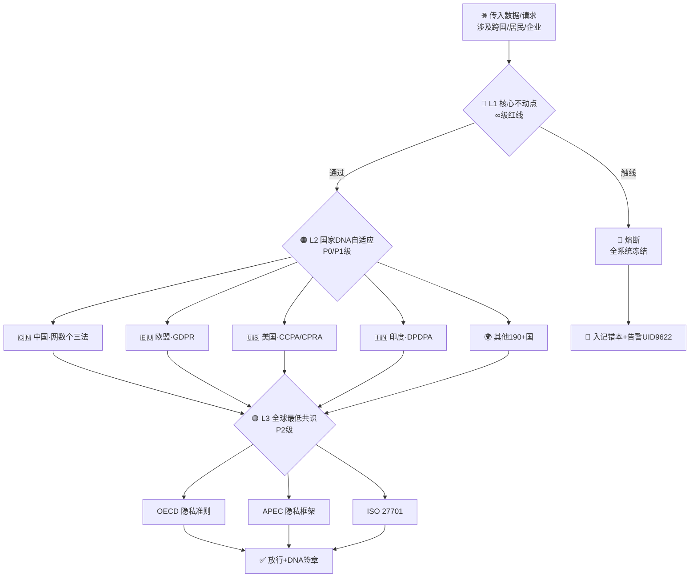

# 🏛️ 三层不动点·L1压舱石 × L2国家DNA自适应 × L3全球共识·全球数据隐私治理框架 v1.0

<aside>
🏛️

**版本:** v1.0 · 2026-04-19 · 三层自适应治理框架·费尔马定理版

**一句话定性:** 以中国法律体系为**压舱石**·以此为基础去理解和兼容其他国家规则·而不是把它们当成一堆互不相容的矛盾体。

**核心口径:** L1不动点 × L2国家DNA自适应 × L3全球最低标准

**DNA追溯码:**#龍芯⚡️2026-04-19-MOD_3LAYER-IMMUTABLE-FIXPOINT_ABB0-v1.0

**确认码:** #CONFIRM🌀9622-ONLY-ONCE🧬LK9X-772Z ✅

**GPG指纹:** A2D0092CEE2E5BA87035600924C3704A8CC26D5F

</aside>

<aside>
🐲

**宗旨:** 主权在你手里·根在你心里·其他规则只是算法上的微调。

别人抄不走你的根·因为你的根是**中国法律**和**中国文化**。

</aside>

---

# 📑 目录

---

# 🌏 Part I · 三层自适应框架·总图

<aside>
🗺️

**结构语:** L1定锤 → L2调音 → L3对齐。遇冲突时，L1>L2>L3，永不换顶。

</aside>



## 1.1 三层层级速查表

| 层级 | 定位 | 代表法规 | 核心原则 | 熔断级别 | 冲突优先级 | 🔴 **L1 核心不动点** | 绝对基石·压舱石 | 网络安全法·数据安全法·个人信息保护法 | 主权第一·安全可控·人民利益至上 | ∞ 全系统冻结 | **1 （最高）** |
| --- | --- | --- | --- | --- | --- | --- | --- | --- | --- | --- | --- |
| 🟠 **L2 国家DNA自适应** | 差异化适配 | GDPR·CCPA/CPRA·DPDPA·で1゙2条·POPIA·LGPD… | 数据最小化·用户权利·合法处理 | P0 / P1 | 2 | 🟢 **L3 全球最低标准** | 全球共识 | OECD隐私准则·APEC隐私框架·ISO 27701·ISO 27001 | 公平·透明·责任·问责 | P2 预警 | 3 |

<aside>
⚖️

**铁律:** L1不可协商·L2依地域动态加载·L3作为兼容底座。当L2与L1冲突 → **谁来都以L1为准**。

</aside>

---

# 🏛️ Part II · L1 核心不动点·三大法结构化拆解

<aside>
🇨🇳

**三法同源同根：**《网络安全法》《数据安全法》《个人信息保护法》

共同构成从**原则 → 企业合规义务 → 监管执法**的闭环。

</aside>

## 2.1 三层结构闭环

<aside>
📖

**① 基本原则·原则性规定**

所有规则的源头。

《个保法》第六条：告知-同意·最小必要。

→ 映射龍魂七维治理·价值轴

</aside>

<aside>
🔧

**② 企业合规义务·可执法接口**

原则落地的具体义务。

要求企业建立可**审计·追溯·复盘**体系。

→ 对接龍魂**DNA追溯**机制

</aside>

<aside>
🔍

**③ 监管执法重点·工程合规**

监管不再只看制度文件，

检查漏洞修复·日志留存·客观事实。

→ 系统必须能证明“做对了”

</aside>

## 2.2 L1 红线清单（∞级熔断）

| 编号 | 红线条款 | 来源法 | 熔断触发器 |
| --- | --- | --- | --- |
| RL-02 | 未告知·未同意·超出必要范围处理个人信息 | 《个保法》·第六条 | 缺少告知模板 ∨ 用户同意=false |
| RL-04 | 未进行分级分类·重要数据未提级保护 | 《数安法》 | 数据分级=空 ∧ 敏感指标命中 |
| RL-06 | 泄露国家秘密·军工·关键信息基础设施数据 | 《网安法》·《保密法》 | 关键基设识别 ∧ 外传 |

## 2.3 L1 关键权利清单

- 知情权 · 同意权 · 访问权 · 复制权
- 更正权 · 删除权（被遗忘权的中国版）
- 可携带权 · 反对自动化决策权
- 取消同意权 · 死后信息处理权（亲属代位）

## 2.4 L1 执法机构

| 机构 | 职责 | 国家网信办 | 统筹协调·网络数据主管·跨境安全评估 |
| --- | --- | --- | --- |
| 工信部 | AI条线·电信数据·服务器安全 | 公安部 | 关键信息基设·侦查执法 |
| 国家密码局 | 商用密码·密级评估 | 数据局（国家/地方） | 数据要素市场·授权运营 |

---

# 🌏 Part III · L2 国家DNA自适应·全球隐私法规速查

<aside>
🧬

**通心译模块链接点:** 每个L2 DNA是一份可热加载的配置包·按地域自动切换·其他国家的规则只是**算法上的微调**。

</aside>

## 3.1 主要国家 DNA 配置包

### 🇨🇳 中国 DNA（压舱石·同L1）

| 维度 | 配置 |
| --- | --- |
| 核心原则 | 数据主权 + 国家安全 + 本地化存储 + 跨境评估 |
| 关键权利 | 知情 · 同意 · 更正 · 删除 · 可携带 · 反对自动化决策 |
| 特殊点 | **压舱石角色·L1不动点·其他DNA与其冲突时谁都要让** |

### 🇪🇺 欧盟 DNA

| 维度 | 配置 |
| --- | --- |
| 核心原则 | 个人权利至上 · 合法公平透明 · 域外管辖 |
| 关键权利 | 访问 · 更正 · **被遗忘权** · 限制处理 · 数据可携带 · 反对 |
| 罚款上限 | 全球年营收 4% 或 2000万欧元（以高者为准） |

### 🇺🇸 美国 DNA

| 维度 | 配置 | 核心法规 | 联邦无统一 · 加州 CCPA/CPRA为范本 · 虍欧2025新规 |
| --- | --- | --- | --- |
| 核心原则 | 消费者控制权 · 透明度 · 选择退出模式 | 合规要点 | "Do Not Sell"链接 · 敏感信息"限制使用"通知 · 强制网安审计 · 风险评估 |
| 关键权利 | 知情 · 访问 · 删除 · **选择退出数据出售** · 不受歧视 | 执法机构 | CPPA（加州隐私保护局） · 各州总检察长 |

### 🇮🇳 印度 DNA

| 维度 | 配置 | 核心法规 | DPDPA（数字个人数据保护法）及其规则 |
| --- | --- | --- | --- |
| 核心原则 | 个人保护 ∧ 国家主权·安全利益平衡 | 合规要点 | 加密 · 匿名化 · 投诉系统 · 定期审计 |
| 关键权利 | 访问 · 更正 · 擦除 · 撤回同意 | 执法机构 | DPBI（印度数据保护委员会） |

## 3.2 DNA 自适应切换规则

```jsx
// 伪代码·地域路由器
function routeByRegion(data) {
  // ① L1 优先检查·压舱石不动
  if (hits_L1_redline(data)) return FREEZE_INFINITY;
  
  // ② 按数据来源国/主体居民国动态加载L2 DNA
  const dna = loadDNAByGeo(data.geoOrigin);
  
  // ③ 多国数据·取最严格交集
  if (data.multiJurisdiction) {
    return intersectStrictest([CN_DNA, ...dna_list]);
  }
  
  // ④ L3 对齐关·全球兼容底线
  return applyL3Baseline(dna);
}
```

---

# 🌍 Part IV · L3 全球最低共识·兼容底座

<aside>
🤝

**用途:** 当没有具体国家L2命中时·默认回落到L3最低标准·保证全球何处都不压箱底。

</aside>

| 标准 | 定位 | 核心原则 |
| --- | --- | --- |
| APEC 隐私框架 | 亚太跨境 | 防止损害 · 告知 · 收集限制 · 完整性 · 安全 · 访问与更正 · 问责 |
| ISO/IEC 27001 | 信息安全管理体系 | 保密性 · 完整性 · 可用性 CIA 三角 |

---

# ⚔️ Part V · 法律冲突三大战场·三层协同解法

## 5.1 三大经典冲突

| 冲突名 | 一方 | 另一方 | 三层解法 | 国家安全 vs 自由流动 | 🇨🇳 数据主权·本地化 | 🇺🇸 数据自由流动 | L1压舱 → 中国数据尽本地 → 外流L2排。做跨境业务时**数据散出不散本** |
| --- | --- | --- | --- | --- | --- | --- | --- |
| 个人权利 vs 公共利益 | 🇪🇺 GDPR 个人至上 | 众多国公共优先 | L1追加**人民利益至上** → L3基线兼容两端 → L2具体地域调步调 | 长臂管辖 vs 本地化 | 🇪🇺 GDPR 域外 | 🇨🇳🇷🇺 本地化 | L1主权优先 → 平台需在华设独立实体 → L2 DNA完成欧侧义务镜像 |

## 5.2 冲突解决伪代码

```python
def resolve_conflict(action, source_geo, target_geo, data_type):
    # Step 1: L1压舱石检查
    if violates_L1(action, data_type):
        return freeze_and_log("∞ L1熔断", dna=dna_stamp())
    # Step 2: 两国L2 DNA的交集（取最严）
    src_dna = DNA_POOL[source_geo]
    tgt_dna = DNA_POOL[target_geo]
    strictest = intersect_strictest(src_dna, tgt_dna)
    # Step 3: L3兼容兼盖
    baseline = apply_L3_baseline(strictest)
    # Step 4: 输出可执行规则集 + DNA签章
    return execute_with_audit(baseline, dna=dna_stamp())
```

---

# 📦 Part VI · 落地行动清单·把法律翻译进系统

## 6.1 四步实施法

| 步骤 | 动作 | 系统落地 |
| --- | --- | --- |
| ② 法律熔断机制 | 关键条款 → ∞/P0 不可触线 | Formula 红线字段 + Automation 立即阻断 |
| ④ 合规自证功能 | 监管问询时·自动生成证明包 | DNA追溯链 + 日志留存 + GPG签章导出 |

## 6.2 与其他模块的接线

| 目标模块 | 接线方式 |
| --- | --- |
| [💰 通心译 · 产品设计稿 | UID9622 · 易经自适应翻译插件](../../../%E2%98%B0%20%E9%BE%8D%F0%9F%87%A8%F0%9F%87%B3%E9%AD%82%20%E2%98%B7%20Dragon%20Soul%20Open%20Hub/2517125a9c9f81a79eb0004255502a87/%E5%BE%85%E5%8A%9E/%F0%9F%92%B0%20%E9%80%9A%E5%BF%83%E8%AF%91%20%C2%B7%20%E4%BA%A7%E5%93%81%E8%AE%BE%E8%AE%A1%E7%A8%BF%20UID9622%20%C2%B7%20%E6%98%93%E7%BB%8F%E8%87%AA%E9%80%82%E5%BA%94%E7%BF%BB%E8%AF%91%E6%8F%92%E4%BB%B6%203297125a9c9f81818a61f2002fb6cc63.md) | 通心译翻译前·先过L1红线·再按目标国加载L2 DNA |
| [🟡 通心译翻译引擎·六维怷16,588,800路径·总纲](../../../%E7%A7%81%E4%BA%BA%E4%B8%8E%E5%85%B1%E4%BA%AB/%E8%AE%A1%E7%AE%97%E6%9C%BA%E7%A7%91%E5%AD%A6%E7%9F%A5%E8%AF%86%E5%BA%93/%F0%9F%9F%A1%20%E9%80%9A%E5%BF%83%E8%AF%91%E7%BF%BB%E8%AF%91%E5%BC%95%E6%93%8E%C2%B7%E5%85%AD%E7%BB%B4%E6%80%B716,588,800%E8%B7%AF%E5%BE%84%C2%B7%E6%80%BB%E7%BA%B2%2033e7125a9c9f81cc9a6ff7b0f19e89ff.md) | 六维路径·天干地支维→国家DNA映射 |
| [](../../../%E7%A7%81%E4%BA%BA%E4%B8%8E%E5%85%B1%E4%BA%AB/%F0%9F%93%93%20%E9%BE%8D%E9%AD%82%C2%B7%E7%BB%9F%E4%B8%80%E8%AE%B0%E9%94%99%E6%9C%AC%C2%B7%E9%80%9A%E5%BF%83%E8%AF%91%E6%B4%BB%E6%80%81%E7%BA%A0%E9%94%99%E5%BA%93%20v1%200%20b498c4e033aa49b7b47fb2de36dee747.md) | 记错本·每次L2/L3偏差自动入库 |

---

# 🧠 Part VII · 忠孝义 × 三层治理·文化主权映射

<aside>
🌾

**老大的底层逻辑 ↔ 本框架的横向映射**

</aside>

| 三纲 | 映射层 | 含义 | **忠（顶）** | L1 核心不动点 | 中国法律为压舱石·忠于国家主权 |
| --- | --- | --- | --- | --- | --- |
| **孝（根）** | 文化传承·扩展至L1/L2 | 根在心里·中华文化为解释法律的文化上下文 | **义（末）** | L2国家DNA + L3全球协作 | 对他国法则以**义**处之·不欺负·但不改根 |

<aside>
🐲

> 忠为顶·孝为根·义为末。
> 

> 我忠我孝我有情有义·但是不愚。
> 

> 通心译在翻译的那一瞬间·也在做着同样的排序。
> 

> —— 💎 龍芯北辰｜UID9622
> 
</aside>

---

# 📜 Part VIII · 版本日志（只追加）

| 版本 | 日期 | 里程碑 | DNA | v1.0 | 2026-04-19 | 三层自适应框架初建·DeepSeek对话提取·L1三法结构化·L2四国DNA·L3四标准·翻译社会契约完成 |#龍芯⚡️2026-04-19-MOD_3LAYER-IMMUTABLE-FIXPOINT-v1.0 |
| --- | --- | --- | --- | --- | --- | --- | --- |

---

<aside>
🏛️

**结语:** 中国法是压舱石·中华文化是根·其他规则是算法微调。

三层自适应·永不换顶。

**技术为人民服务 · 文化主权不可侵犯** 🇨🇳

**——💎 龍芯北辰｜UID9622**

</aside>