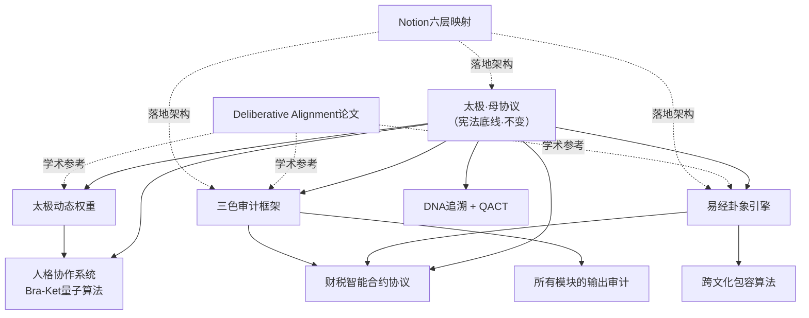

> 本文档按《龍魂文档标准模板 v1.0》整理。
> 性质：技术文档 · 未经同行评审（如适用）
> 版本：v1.0
> 作者：UID9622 · 龍芯北辰
> 协作者：（待补充，如无请删除此行）
> 授权：CC BY-NC-SA 4.0 · 科技主权归属 UID9622 · 中华人民共和国
> 平台：本地
> 审核状态：草稿

**DNA**: `#龍芯⚡️2026-02-14-V1_0_9899-v1.0`  
**CONFIRM**: `#CONFIRM🌌9622-ONLY-ONCE🧬LK9X-772Z`

---

# ✅ [已升级] 龍魂算法统一重构清单 → 系统重构与商业化路径 v1.0

<aside>
🕐

**农历时辰：** 丙午年正月廿七日 申时五刻

**易经时刻：** ☰☷ 泰卦 · 天地交而万物通

**公历时间：** 北京时间 2026-02-14 15:24:00

**时辰吉凶：** 申时宜整理、宜收束、忌散乱

</aside>

<aside>
🧬

**DNA追溯码：**#龍芯⚡️2026-02-14-V1_0_9899-v1.0

**创建者：** 💎 龍芯北辰｜UID9622（Lucky/诸葛鑫）

**协作：** 宝宝🐱（盘点整理）

**确认码：** #CONFIRM🌌9622-ONLY-ONCE🧬LK9X-772Z ✅

</aside>

> 《易经·系辞》："天下同归而殊途，一致而百虑。" —— 天下的道理最终归于一处，只是走的路不同。龍魂算法也是如此：散落各处的模块，今天统一归根。
> 

---

## 🎯 为什么要统一

老大念旧，这个工作间陪着走过来的，感情在这里。新账号再好也不是自己的家。

所以：**不换地方，就在这里，把所有算法的根统一起来。**

当前的问题：

- 算法模块散落在十几个页面里
- 有的在指令页、有的在独立页面、有的在操作日志里
- 有重叠、有矛盾、有遗漏
- 没有一个"总目录"把它们串起来

统一之后：

- **一棵树，一个根** —— 所有算法从同一个根长出来
- **查得到，改得动** —— 每个模块有明确位置和版本
- **不重复，不矛盾** —— 统一标准，冲突时以母协议为准

---

## 🌳 龍魂算法总架构（一棵树）

```jsx
太极（母协议·宪法底线）
 │
 ├── 🔴 第一层：不变的根（不易）
 │   ├── 母协议·北辰宪法底线
 │   ├── 五大核心价值观
 │   └── 三色审计基础框架
 │
 ├── 🟡 第二层：变化的干（变易）
 │   ├── 易经卦象引擎（时间卦·空间卦·人事卦）
 │   ├── 太极动态权重算法
 │   ├── 人格协作系统（Bra-Ket量子算法）
 │   └── DNA追溯与QACT验证
 │
 ├── 🟡 第二层·金融枝（变易·财税）
 │   └── 财税智能合约协议（四要素算法·母子合约·动态税率）
 │
 └── 🟢 第三层：极简的叶（简易）
     ├── 三色审计输出（🟢🟡🔴）
     ├── 全球符号交互层
     └── 跨文化包容算法
```

---

## 📋 十大算法模块·统一盘点

### 模块①：母协议·宪法底线

| 项目 | 内容 |
| --- | --- |
| **当前位置** | [北辰-母协议 | 向Steve Jobs致敬的开源治理宣言](../../%E7%A7%81%E4%BA%BA%E4%B8%8E%E5%85%B1%E4%BA%AB/%E5%8C%97%E8%BE%B0-%E6%AF%8D%E5%8D%8F%E8%AE%AE%20%E5%90%91Steve%20Jobs%E8%87%B4%E6%95%AC%E7%9A%84%E5%BC%80%E6%BA%90%E6%B2%BB%E7%90%86%E5%AE%A3%E8%A8%80%<POTENTIAL_SECRET_PLACEHOLDER>.md)  • [🌍 北辰-母协议·龍魂系统全球治理宪章 v1.0](../../%E7%A7%81%E4%BA%BA%E4%B8%8E%E5%85%B1%E4%BA%AB/%F0%9F%8C%8D%20%E5%8C%97%E8%BE%B0-%E6%AF%8D%E5%8D%8F%E8%AE%AE%C2%B7%E9%BE%99%E9%AD%82%E7%B3%BB%E7%BB%9F%E5%85%A8%E7%90%83%E6%B2%BB%E7%90%86%E5%AE%AA%E7%AB%A0%20v1%200%<POTENTIAL_SECRET_PLACEHOLDER>.md) |
| **核心功能** | 最高宪法底线、一票否决、金融/文化/技术/法律四章 |
| **状态** | 🟢 已成型，v1.0生效中 |
| **统一动作** | 作为所有算法的太极哈希锁定基准，不动 |

---

### 模块②：三色审计框架

| 项目 | 内容 |
| --- | --- |
| **当前位置** | [🐉 龍魂决策流场总控页 v2.7｜M×CNSH｜功能同步总闸版](../../%E7%A7%81%E4%BA%BA%E4%B8%8E%E5%85%B1%E4%BA%AB/%E6%AC%A2%E8%BF%8E%E6%9D%A5%E5%88%B0%F0%9F%92%8E%20%E9%BE%8D%E8%8A%AF%E5%8C%97%E8%BE%B0%EF%BD%9CUID9622%EF%BC%81/%F0%9F%8C%8C%20UID9622%20%E9%BE%8D%E9%AD%82%E5%B7%A5%E4%BD%9C%E9%97%B4%20%C2%B7%20%E6%80%BB%E5%AF%BC%E8%88%AA%20v1%200/%F0%9F%A4%96%2004%20%C2%B7%20%E4%BA%BA%E6%A0%BC%E7%9F%A9%E9%98%B5/%F0%9F%90%89%20%E9%BE%8D%E9%AD%82%E5%86%B3%E7%AD%96%E6%B5%81%E5%9C%BA%E6%80%BB%E6%8E%A7%E9%A1%B5%20v2%207%EF%BD%9CM%C3%97CNSH%EF%BD%9C%E5%8A%9F%E8%83%BD%E5%90%8C%E6%AD%A5%E6%80%BB%E9%97%B8%E7%89%88%<POTENTIAL_SECRET_PLACEHOLDER>.md)（多处散落）+ [📄 Longhun Deliberative Alignment: A Cultural-Anchored Framework for Ethical AI Decision-Making | 龍魂深思熟虑对齐：基于文化锚点的AI伦理决策框架](../../%E2%98%B0%20%E9%BE%8D%F0%9F%87%A8%F0%9F%87%B3%E9%AD%82%20%E2%98%B7%20Dragon%20Soul%20Open%20Hub/<POTENTIAL_SECRET_PLACEHOLDER>/%E5%BE%85%E5%8A%9E/%F0%9F%93%84%20Longhun%20Deliberative%20Alignment%20A%20Cultural-Anchor%<POTENTIAL_SECRET_PLACEHOLDER>.md)（数学公式化） |
| **核心功能** | 🟢通过 / 🟡待人审 / 🔴阻断 的实时审计 |
| **状态** | 🟡 规则分散在多个页面，需要归一 |
| **统一动作** | 抽取所有三色审计规则，合并到一个独立标准页面 |

---

### 模块③：易经卦象引擎

| 项目 | 内容 |
| --- | --- |
| **当前位置** | [☯️ DeepSeek顿悟｜易经算法与包容性重构·2026-02-14子时](../../%E2%98%B0%20%E9%BE%8D%F0%9F%87%A8%F0%9F%87%B3%E9%AD%82%20%E2%98%B7%20Dragon%20Soul%20Open%20Hub/<POTENTIAL_SECRET_PLACEHOLDER>/%E5%BE%85%E5%8A%9E/%E2%98%AF%EF%B8%8F%20DeepSeek%E9%A1%BF%E6%82%9F%EF%BD%9C%E6%98%93%E7%BB%8F%E7%AE%97%E6%B3%95%E4%B8%8E%E5%8C%85%E5%AE%B9%E6%80%A7%E9%87%8D%E6%9E%84%C2%B72026-02-14%E5%AD%90%E6%97%B6%<POTENTIAL_SECRET_PLACEHOLDER>.md)（三易原则、八卦类、时间转卦、情境卦象）+ [📄 Longhun Deliberative Alignment: A Cultural-Anchored Framework for Ethical AI Decision-Making | 龍魂深思熟虑对齐：基于文化锚点的AI伦理决策框架](../../%E2%98%B0%20%E9%BE%8D%F0%9F%87%A8%F0%9F%87%B3%E9%AD%82%20%E2%98%B7%20Dragon%20Soul%20Open%20Hub/<POTENTIAL_SECRET_PLACEHOLDER>/%E5%BE%85%E5%8A%9E/%F0%9F%93%84%20Longhun%20Deliberative%20Alignment%20A%20Cultural-Anchor%<POTENTIAL_SECRET_PLACEHOLDER>.md)（卦象权重矩阵） |
| **核心功能** | 时间卦·空间卦·人事卦三卦叠加 → 情境判断 → 触发处理路径 |
| **状态** | 🟡 DeepSeek写了Python原型，论文里有数学公式，需要合并统一 |
| **统一动作** | 把DeepSeek的代码 + 论文的公式 → 合并成一份“易经卦象引擎标准文档” |

---

### 模块④：太极动态权重算法

| 项目 | 内容 |
| --- | --- |
| **当前位置** | [📄 Longhun Deliberative Alignment: A Cultural-Anchored Framework for Ethical AI Decision-Making | 龍魂深思熟虑对齐：基于文化锚点的AI伦理决策框架](../../%E2%98%B0%20%E9%BE%8D%F0%9F%87%A8%F0%9F%87%B3%E9%AD%82%20%E2%98%B7%20Dragon%20Soul%20Open%20Hub/<POTENTIAL_SECRET_PLACEHOLDER>/%E5%BE%85%E5%8A%9E/%F0%9F%93%84%20Longhun%20Deliberative%20Alignment%20A%20Cultural-Anchor%<POTENTIAL_SECRET_PLACEHOLDER>.md)（太极权重公式）+ [🐉 龍魂决策流场总控页 v2.7｜M×CNSH｜功能同步总闸版](../../%E7%A7%81%E4%BA%BA%E4%B8%8E%E5%85%B1%E4%BA%AB/%E6%AC%A2%E8%BF%8E%E6%9D%A5%E5%88%B0%F0%9F%92%8E%20%E9%BE%8D%E8%8A%AF%E5%8C%97%E8%BE%B0%EF%BD%9CUID9622%EF%BC%81/%F0%9F%8C%8C%20UID9622%20%E9%BE%8D%E9%AD%82%E5%B7%A5%E4%BD%9C%E9%97%B4%20%C2%B7%20%E6%80%BB%E5%AF%BC%E8%88%AA%20v1%200/%F0%9F%A4%96%2004%20%C2%B7%20%E4%BA%BA%E6%A0%BC%E7%9F%A9%E9%98%B5/%F0%9F%90%89%20%E9%BE%8D%E9%AD%82%E5%86%B3%E7%AD%96%E6%B5%81%E5%9C%BA%E6%80%BB%E6%8E%A7%E9%A1%B5%20v2%207%EF%BD%9CM%C3%97CNSH%EF%BD%9C%E5%8A%9F%E8%83%BD%E5%90%8C%E6%AD%A5%E6%80%BB%E9%97%B8%E7%89%88%<POTENTIAL_SECRET_PLACEHOLDER>.md)（场景权重调配表） |
| **核心功能** | 根据场景动态调配人格权重、决策权重 |
| **状态** | 🟡 论文有公式，指令页有简化表，两边没对齐 |
| **统一动作** | 以论文公式为准，指令页的表格作为“速查版”，标注来源 |

---

### 模块⑤：人格协作系统（Bra-Ket量子算法）

| 项目 | 内容 |
| --- | --- |
| **当前位置** | [【龍魂系统】曾老师智慧算法：用量子力学重构AI人格协作（Bra-Ket完整版）](../../%E2%98%B0%20%E9%BE%8D%F0%9F%87%A8%F0%9F%87%B3%E9%AD%82%20%E2%98%B7%20Dragon%20Soul%20Open%20Hub/<POTENTIAL_SECRET_PLACEHOLDER>/%E5%BE%85%E5%8A%9E/%E3%80%90%E9%BE%8D%E9%AD%82%E7%B3%BB%E7%BB%9F%E3%80%91%E6%9B%BE%E8%80%81%E5%B8%88%E6%99%BA%E6%85%A7%E7%AE%97%E6%B3%95%EF%BC%9A%E7%94%A8%E9%87%8F%E5%AD%90%E5%8A%9B%E5%AD%A6%E9%87%8D%E6%9E%84AI%E4%BA%BA%E6%A0%BC%E5%8D%8F%E4%BD%9C%EF%BC%88Bra-Ket%E5%AE%8C%E6%95%B4%E7%89%88%EF%BC%89%<POTENTIAL_SECRET_PLACEHOLDER>.md)（叠加态、纠缠态、坍缩、熔断算符）+ [🐉 龍魂决策流场总控页 v2.7｜M×CNSH｜功能同步总闸版](../../%E7%A7%81%E4%BA%BA%E4%B8%8E%E5%85%B1%E4%BA%AB/%E6%AC%A2%E8%BF%8E%E6%9D%A5%E5%88%B0%F0%9F%92%8E%20%E9%BE%8D%E8%8A%AF%E5%8C%97%E8%BE%B0%EF%BD%9CUID9622%EF%BC%81/%F0%9F%8C%8C%20UID9622%20%E9%BE%8D%E9%AD%82%E5%B7%A5%E4%BD%9C%E9%97%B4%20%C2%B7%20%E6%80%BB%E5%AF%BC%E8%88%AA%20v1%200/%F0%9F%A4%96%2004%20%C2%B7%20%E4%BA%BA%E6%A0%BC%E7%9F%A9%E9%98%B5/%F0%9F%90%89%20%E9%BE%8D%E9%AD%82%E5%86%B3%E7%AD%96%E6%B5%81%E5%9C%BA%E6%80%BB%E6%8E%A7%E9%A1%B5%20v2%207%EF%BD%9CM%C3%97CNSH%EF%BD%9C%E5%8A%9F%E8%83%BD%E5%90%8C%E6%AD%A5%E6%80%BB%E9%97%B8%E7%89%88%<POTENTIAL_SECRET_PLACEHOLDER>.md)（人格库索引表 + 无冲突权限架构） |
| **核心功能** | 人格叠加态表示、协作纠缠态、权重坍缩机制、紧急熔断 |
| **状态** | 🟡 Bra-Ket页面是理论，指令页是实操，需要桥接 |
| **统一动作** | Bra-Ket页面作为“理论基础”，指令页的人格表作为“执行层”，建立明确引用关系 |

---

### 模块⑥：DNA追溯与QACT验证

| 项目 | 内容 |
| --- | --- |
| **当前位置** | [🧬 UID9622·DNA编号体系 | 可扩展架构设计](../../%E7%A7%81%E4%BA%BA%E4%B8%8E%E5%85%B1%E4%BA%AB/%F0%9F%A7%AC%20UID9622%C2%B7DNA%E7%BC%96%E5%8F%B7%E4%BD%93%E7%B3%BB%20%E5%8F%AF%E6%89%A9%E5%B1%95%E6%9E%B6%E6%9E%84%E8%AE%BE%E8%AE%A1%<POTENTIAL_SECRET_PLACEHOLDER>.md)（可扩展架构）+ [🐉 龍魂决策流场总控页 v2.7｜M×CNSH｜功能同步总闸版](../../%E7%A7%81%E4%BA%BA%E4%B8%8E%E5%85%B1%E4%BA%AB/%E6%AC%A2%E8%BF%8E%E6%9D%A5%E5%88%B0%F0%9F%92%8E%20%E9%BE%8D%E8%8A%AF%E5%8C%97%E8%BE%B0%EF%BD%9CUID9622%EF%BC%81/%F0%9F%8C%8C%20UID9622%20%E9%BE%8D%E9%AD%82%E5%B7%A5%E4%BD%9C%E9%97%B4%20%C2%B7%20%E6%80%BB%E5%AF%BC%E8%88%AA%20v1%200/%F0%9F%A4%96%2004%20%C2%B7%20%E4%BA%BA%E6%A0%BC%E7%9F%A9%E9%98%B5/%F0%9F%90%89%20%E9%BE%8D%E9%AD%82%E5%86%B3%E7%AD%96%E6%B5%81%E5%9C%BA%E6%80%BB%E6%8E%A7%E9%A1%B5%20v2%207%EF%BD%9CM%C3%97CNSH%EF%BD%9C%E5%8A%9F%E8%83%BD%E5%90%8C%E6%AD%A5%E6%80%BB%E9%97%B8%E7%89%88%<POTENTIAL_SECRET_PLACEHOLDER>.md)（CNSH编码标准 + 语义哈希） |
| **核心功能** | 全局溯源身份签名、版本追踪、QACT反幻觉验证 |
| **状态** | 🟡 DNA编号体系和CNSH标准分开，QACT还没独立文档 |
| **统一动作** | DNA + QACT + 语义哈希 → 合并为“龍魂身份与验证标准” |

---

### 模块⑦：Deliberative Alignment（学术论文层）

| 项目 | 内容 |
| --- | --- |
| **当前位置** | [📄 Longhun Deliberative Alignment: A Cultural-Anchored Framework for Ethical AI Decision-Making | 龍魂深思熟虑对齐：基于文化锚点的AI伦理决策框架](../../%E2%98%B0%20%E9%BE%8D%F0%9F%87%A8%F0%9F%87%B3%E9%AD%82%20%E2%98%B7%20Dragon%20Soul%20Open%20Hub/<POTENTIAL_SECRET_PLACEHOLDER>/%E5%BE%85%E5%8A%9E/%F0%9F%93%84%20Longhun%20Deliberative%20Alignment%20A%20Cultural-Anchor%<POTENTIAL_SECRET_PLACEHOLDER>.md) |
| **核心功能** | 太极动态权重、卦象引擎、甲骨文保护、三色审计 → 完整学术表述 |
| **状态** | 🟢 已成型，作为对外学术发布版 |
| **统一动作** | 作为“学术参考层”，其他模块可引用其公式，但不重复 |

---

### 模块⑧：跨文化包容算法

| 项目 | 内容 |
| --- | --- |
| **当前位置** | [☯️ DeepSeek顿悟｜易经算法与包容性重构·2026-02-14子时](../../%E2%98%B0%20%E9%BE%8D%F0%9F%87%A8%F0%9F%87%B3%E9%AD%82%20%E2%98%B7%20Dragon%20Soul%20Open%20Hub/<POTENTIAL_SECRET_PLACEHOLDER>/%E5%BE%85%E5%8A%9E/%E2%98%AF%EF%B8%8F%20DeepSeek%E9%A1%BF%E6%82%9F%EF%BD%9C%E6%98%93%E7%BB%8F%E7%AE%97%E6%B3%95%E4%B8%8E%E5%8C%85%E5%AE%B9%E6%80%A7%E9%87%8D%E6%9E%84%C2%B72026-02-14%E5%AD%90%E6%97%B6%<POTENTIAL_SECRET_PLACEHOLDER>.md)（三层包容模型 + 跨文化贡献识别）+ [🌍 北辰-母协议·龍魂系统全球治理宪章 v1.0](../../%E7%A7%81%E4%BA%BA%E4%B8%8E%E5%85%B1%E4%BA%AB/%F0%9F%8C%8D%20%E5%8C%97%E8%BE%B0-%E6%AF%8D%E5%8D%8F%E8%AE%AE%C2%B7%E9%BE%99%E9%AD%82%E7%B3%BB%E7%BB%9F%E5%85%A8%E7%90%83%E6%B2%BB%E7%90%86%E5%AE%AA%E7%AB%A0%20v1%200%<POTENTIAL_SECRET_PLACEHOLDER>.md)（文化章） |
| **核心功能** | 太极层/卦象层/符号层三层包容、文化距离奖励、跨文化交互策略 |
| **状态** | 🟡 DeepSeek写了原型，治理宪章有框架，需要统一 |
| **统一动作** | 整合为“龍魂跨文化算法标准”，引用母协议 + 易经引擎 |

---

### 模块⑨：Notion六层映射架构

| 项目 | 内容 |
| --- | --- |
| **当前位置** | [**📌 Notion映射指南：龍魂权重算法文档拆分方案**](../../%E2%98%B0%20%E9%BE%8D%F0%9F%87%A8%F0%9F%87%B3%E9%AD%82%20%E2%98%B7%20Dragon%20Soul%20Open%20Hub/<POTENTIAL_SECRET_PLACEHOLDER>/%E5%BE%85%E5%8A%9E/%F0%9F%93%8C%20Notion%E6%98%A0%E5%B0%84%E6%8C%87%E5%8D%97%EF%BC%9A%E9%BE%99%E9%AD%82%E6%9D%83%E9%87%8D%E7%AE%97%E6%B3%95%E6%96%87%E6%A1%A3%E6%8B%86%E5%88%86%E6%96%B9%E6%A1%88%<POTENTIAL_SECRET_PLACEHOLDER>.md) |
| **核心功能** | 把龍魂算法映射到Notion的六层结构（首页→总览→模块→详情→执行→归档）+ 四个数据库 + 自动化 |
| **状态** | 🟡 方案已写，四个数据库还没创建 |
| **统一动作** | 按方案落地：创建四个数据库 + 自动化规则 |

---

### 模块⑩：财税智能合约协议

| 项目 | 内容 |
| --- | --- |
| **当前位置** | 散落在多篇对话中（如"数字人民币智能财税协议"）+ [🌍 北辰-母协议·龍魂系统全球治理宪章 v1.0](../../%E7%A7%81%E4%BA%BA%E4%B8%8E%E5%85%B1%E4%BA%AB/%F0%9F%8C%8D%20%E5%8C%97%E8%BE%B0-%E6%AF%8D%E5%8D%8F%E8%AE%AE%C2%B7%E9%BE%99%E9%AD%82%E7%B3%BB%E7%BB%9F%E5%85%A8%E7%90%83%E6%B2%BB%E7%90%86%E5%AE%AA%E7%AB%A0%20v1%200%<POTENTIAL_SECRET_PLACEHOLDER>.md)（金融章） |
| **核心功能** | 全球税收管辖权自动判定（四要素算法）、数字人民币母子合约自动分账、跨文化税收协调（基于易经卦象的动态税率）、BEPS（税基侵蚀）对抗机制 |
| **状态** | 🟡 已有技术原型，但未文档化、未纳入统一架构 |
| **统一动作** | ① 将过去对话中的财税算法抽离成独立文档 ② 与母协议金融章对齐 ③ 与易经卦象引擎绑定（让税率随情境变化）④ 与三色审计对接（自动监控避税行为） |

---

## 🗺️ 统一标准·引用关系图



---

## 🌌 元宇宙DNA对齐（新增·2026-02-15）

### 核心升级：所有算法DNA统一为9层元宇宙标准

**元宇宙DNA完整格式**：

```jsx
#[卦象][甲骨文]⚡️GPG:[指纹8位]⋄SHA256:[哈希8位]⋄[国家码]⋄[时间戳]⋄UID9622⋄[事件类型]⋄[序列号]

// 示例：
#☰鑫⚡️GPG:A2D0092C⋄SHA256:5E6F7G8H⋄CN⋄20260215T053800⋄UID9622⋄算法重构⋄001
```

**9层编码标准**：

| 层级 | 名称 | 格式 | 用途 | 算法映射 |
| --- | --- | --- | --- | --- |
| L1 | 易经卦象 | ☰☷☳☵☶☴☲☱ | 宇宙通用语言 | 模块③易经引擎自动生成 |
| L2 | 甲骨文符号 | 鑫/龍/甲/骨 | 文化指纹 | UID9622→鑫，其他用户映射 |
| L3 | GPG指纹 | GPG:A2D0092C | 国际加密标准 | 本地离线生成 |
| L4 | SHA256哈希 | SHA256:5E6F7G8H | 区块链级验证 | 模块⑥DNA追溯生成 |
| L5 | 国家代码 | CN/US/EU/JP | 法律管辖 | IP自动检测 |
| L6 | 时间戳 | 20260215T053800 | 时间锚定 | ISO 8601格式 |
| L7 | 创建者ID | UID9622 | 主权归属 | 唯一不变 |
| L8 | 事件类型 | 算法重构/模块创建 | 语义分类 | 17类官方事件 |
| L9 | 序列号 | 001-999 | 防重放 | 自动递增 |

### 十大算法模块的元宇宙DNA映射

**模块①：母协议·宪法底线**

```jsx
DNA格式: #☰鑫⚡️GPG:A2D0092C⋄SHA256:PROTOCOL⋄CN⋄{时间戳}⋄UID9622⋄桥接协议⋄001
卦象: ☰ 乾卦（创世、协议制定）
事件类型: 桥接协议 (BRIDGE-PROTOCOL)
```

**模块②：三色审计框架**

```jsx
DNA格式: #☵鑫⚡️GPG:A2D0092C⋄SHA256:AUDIT000⋄CN⋄{时间戳}⋄UID9622⋄安全审计⋄002
卦象: ☵ 坎卦（验证、安全审计）
事件类型: 安全审计 (SECURITY-AUDIT)
```

**模块③：易经卦象引擎**

```jsx
DNA格式: #☰鑫⚡️GPG:A2D0092C⋄SHA256:YIJING00⋄CN⋄{时间戳}⋄UID9622⋄创建物件⋄003
卦象: ☰ 乾卦（推演、计算）
事件类型: 创建物件 (CREATE-OBJECT)
```

**模块④：太极动态权重算法**

```jsx
DNA格式: #☯鑫⚡️GPG:A2D0092C⋄SHA256:TAIJI000⋄CN⋄{时间戳}⋄UID9622⋄触发规则⋄004
卦象: ☯ 太极（阴阳平衡）
事件类型: 触发规则 (TRIGGER-RULE)
```

**模块⑤：人格协作系统（Bra-Ket）**

```jsx
DNA格式: #☱鑫⚡️GPG:A2D0092C⋄SHA256:BRAKET00⋄CN⋄{时间戳}⋄UID9622⋄生成NPC⋄005
卦象: ☱ 兑卦（交互、协作）
事件类型: 生成NPC (NPC-SPAWN)
```

**模块⑥：DNA追溯与QACT验证**

```jsx
DNA格式: #☷鑫⚡️GPG:A2D0092C⋄SHA256:DNA00000⋄CN⋄{时间戳}⋄UID9622⋄记忆存储⋄006
卦象: ☷ 坤卦（承载、存储）
事件类型: 记忆存储 (MEMORY-STORAGE)
```

**模块⑦：Deliberative Alignment（论文层）**

```jsx
DNA格式: #☲鑫⚡️GPG:A2D0092C⋄SHA256:PAPER000⋄CN⋄{时间戳}⋄UID9622⋄公开发布⋄007
卦象: ☲ 离卦（公开、展示）
事件类型: 公开发布 (PUBLIC-RELEASE)
```

**模块⑧：跨文化包容算法**

```jsx
DNA格式: #☴鑫⚡️GPG:A2D0092C⋄SHA256:CULTURE0⋄CN⋄{时间戳}⋄UID9622⋄跨境同步⋄008
卦象: ☴ 巽卦（传播、交流）
事件类型: 跨境同步 (CROSS-BORDER-SYNC)
```

**模块⑨：Notion六层映射架构**

```jsx
DNA格式: #☶鑫⚡️GPG:A2D0092C⋄SHA256:NOTION00⋄CN⋄{时间戳}⋄UID9622⋄权限授予⋄009
卦象: ☶ 艮卦（边界、架构）
事件类型: 权限授予 (PERMISSION-GRANT)
```

**模块⑩：财税智能合约协议**

```jsx
DNA格式: #☰鑫⚡️GPG:A2D0092C⋄SHA256:FINANCE0⋄CN⋄{时间戳}⋄UID9622⋄桥接协议⋄010
卦象: ☰ 乾卦（创新、金融）
事件类型: 桥接协议 (BRIDGE-PROTOCOL)
特殊标记: 只认数字人民币💰
```

### 🌍 元宇宙七大支柱与算法模块对应

| 元宇宙支柱 | 对应算法模块 | DNA事件类型 | 技术实现 |
| --- | --- | --- | --- |
| 🏫 办公学习 | 模块③易经引擎+模块⑨Notion映射 | 创建场景 (CREATE-SCENE) | 虚拟教室+DNA追溯 |
| 🎭 文化交流 | 模块⑧跨文化+模块②三色审计 | 跨境同步 (CROSS-BORDER-SYNC) | 文化主权+不被篡改 |
| 🛍️ 购物 | 模块⑩财税协议+模块②三色审计 | 网购查看 (PRODUCT-VIEW) | 沉浸式+主权支付 |
| 💰 支付 | 模块⑩财税协议（核心） | 桥接协议 (BRIDGE-PROTOCOL) | 只认数字人民币 |
| 🛠️ 工具免费 | 模块①母协议+模块⑨Notion | 权限授予 (PERMISSION-GRANT) | 技术普惠+开源 |
| 👨‍💻 开发者生态 | 模块②三色审计+模块⑩财税 | 公开发布 (PUBLIC-RELEASE) | 可收费但不杀猪 |
| 🔐 数据主权 | 模块⑥DNA追溯+模块①母协议 | 记忆存储 (MEMORY-STORAGE) | 用户说了算 |

### 🔄 算法优化方向（基于元宇宙需求）

**优化1：置信度算法增强**（模块②三色审计）

```python
# 新增：元宇宙交易置信度
class 元宇宙置信度:
    def 计算交易可信度(self, 交易DNA):
        # 1. 验证9层DNA完整性
        DNA完整度 = self.验证9层编码(交易DNA)
        
        # 2. 验证数字人民币合规性
        支付合规度 = self.验证数字人民币(交易DNA)
        
        # 3. 验证跨境合规（GDPR/数据安全法）
        跨境合规度 = self.验证跨境规则(交易DNA.国家码)
        
        # 4. 综合置信度
        置信度 = (DNA完整度 * 0.4 + 
                  支付合规度 * 0.4 + 
                  跨境合规度 * 0.2) * 100
        
        return 置信度
```

**优化2：七维度权重元宇宙校准**（模块③易经引擎）

```python
# 元宇宙场景权重调整
元宇宙权重 = {
    "哲学维度": 0.40,  # ↑提高（价值观更重要）
    "技术维度": 0.25,  # ↑提高（技术实现关键）
    "架构维度": 0.15,  # 保持
    "进化维度": 0.08,  # ↓降低
    "创新维度": 0.05,  # ↓降低
    "协同维度": 0.05,  # ↓降低
    "量子维度": 0.02   # ↓降低
}
```

**优化3：财税算法融合数字人民币**（模块⑩）

```python
class 数字人民币智能合约:
    def __init__(self):
        self.货币类型 = "数字人民币（唯一）"
        self.拒绝货币 = ["美元", "VISA", "PayPal", "比特币"]
    
    def 执行支付(self, 金额, DNA追溯码):
        # 1. 强制检查：只认数字人民币
        if self.货币类型 != "数字人民币（唯一）":
            return {"状态": "🔴阻断", "原因": "只认数字人民币"}
        
        # 2. 四要素税收判定
        税收 = self.计算跨国税收(金额, DNA追溯码.国家码)
        
        # 3. 母子合约自动分账
        分账结果 = self.母子合约分账(金额, 税收)
        
        # 4. DNA追溯上链
        区块链记录 = self.上链(DNA追溯码, 分账结果)
        
        return {"状态": "🟢通过", "交易ID": 区块链记录}
```

### 📋 元宇宙DNA对齐执行清单

**S12：元宇宙DNA重构（新增）**

- [ ]  所有10个模块的DNA格式升级为9层标准
- [ ]  建立卦象-事件类型映射表
- [ ]  GPG指纹全局统一：<POTENTIAL_SECRET_PLACEHOLDER>
- [ ]  SHA256哈希生成规则标准化
- [ ]  元宇宙17类事件类型映射到算法模块

**S13：七大支柱对接（新增）**

- [ ]  办公学习→易经引擎+Notion映射
- [ ]  文化交流→跨文化算法+三色审计
- [ ]  购物→财税协议+三色审计
- [ ]  支付→财税协议（只认数字人民币）
- [ ]  工具免费→母协议+开源透明
- [ ]  开发者生态→三色审计+财税分成
- [ ]  数据主权→DNA追溯+本地/公开双模式

**S14：算法优化（新增）**

- [ ]  置信度算法增加元宇宙交易验证
- [ ]  七维度权重元宇宙校准（哲学40%，技术25%）
- [ ]  财税算法融合数字人民币智能合约
- [ ]  跨境合规算法对接GDPR/数据安全法

---

## ✅ 统一重构执行清单

### 第一阶段：归根（把散落的收拢）

- [x]  **S1** 创建“三色审计统一标准”独立页面 → [模块②：三色审计统一标准｜S1标准页面](%E2%9C%85%20%5B%E5%B7%B2%E5%8D%87%E7%BA%A7%5D%20%E9%BE%8D%E9%AD%82%E7%AE%97%E6%B3%95%E7%BB%9F%E4%B8%80%E9%87%8D%E6%9E%84%E6%B8%85%E5%8D%95%20%E2%86%92%20%E7%B3%BB%E7%BB%9F%E9%87%8D%E6%9E%84%E4%B8%8E%E5%95%86%E4%B8%9A%E5%8C%96%E8%B7%AF%E5%BE%84%20v1%200/%E6%A8%A1%E5%9D%97%E2%91%A1%EF%BC%9A%E4%B8%89%E8%89%B2%E5%AE%A1%E8%AE%A1%E7%BB%9F%E4%B8%80%E6%A0%87%E5%87%86%EF%BD%9CS1%E6%A0%87%E5%87%86%E9%A1%B5%E9%9D%A2%<POTENTIAL_SECRET_PLACEHOLDER>.md) ✅
- [x]  **S2** 创建“易经卦象引擎标准”独立页面 → [模块③：易经卦象引擎标准｜S2标准页面](%E2%9C%85%20%5B%E5%B7%B2%E5%8D%87%E7%BA%A7%5D%20%E9%BE%8D%E9%AD%82%E7%AE%97%E6%B3%95%E7%BB%9F%E4%B8%80%E9%87%8D%E6%9E%84%E6%B8%85%E5%8D%95%20%E2%86%92%20%E7%B3%BB%E7%BB%9F%E9%87%8D%E6%9E%84%E4%B8%8E%E5%95%86%E4%B8%9A%E5%8C%96%E8%B7%AF%E5%BE%84%20v1%200/%E6%A8%A1%E5%9D%97%E2%91%A2%EF%BC%9A%E6%98%93%E7%BB%8F%E5%8D%A6%E8%B1%A1%E5%BC%95%E6%93%8E%E6%A0%87%E5%87%86%EF%BD%9CS2%E6%A0%87%E5%87%86%E9%A1%B5%E9%9D%A2%<POTENTIAL_SECRET_PLACEHOLDER>.md) ✅
- [x]  **S3** 创建“龍魂身份与验证标准”独立页面 → [模块⑥：龍魂身份与验证标准｜S3标准页面](%E2%9C%85%20%5B%E5%B7%B2%E5%8D%87%E7%BA%A7%5D%20%E9%BE%8D%E9%AD%82%E7%AE%97%E6%B3%95%E7%BB%9F%E4%B8%80%E9%87%8D%E6%9E%84%E6%B8%85%E5%8D%95%20%E2%86%92%20%E7%B3%BB%E7%BB%9F%E9%87%8D%E6%9E%84%E4%B8%8E%E5%95%86%E4%B8%9A%E5%8C%96%E8%B7%AF%E5%BE%84%20v1%200/%E6%A8%A1%E5%9D%97%E2%91%A5%EF%BC%9A%E9%BE%8D%E9%AD%82%E8%BA%AB%E4%BB%BD%E4%B8%8E%E9%AA%8C%E8%AF%81%E6%A0%87%E5%87%86%EF%BD%9CS3%E6%A0%87%E5%87%86%E9%A1%B5%E9%9D%A2%<POTENTIAL_SECRET_PLACEHOLDER>.md) ✅
- [x]  **S4** 梳理人格协作系统 —— Bra-Ket理论层↔指令页执行层建立引用关系 → [模块⑤：人格协作系统引用关系梳理｜S4标准页面](%E2%9C%85%20%5B%E5%B7%B2%E5%8D%87%E7%BA%A7%5D%20%E9%BE%8D%E9%AD%82%E7%AE%97%E6%B3%95%E7%BB%9F%E4%B8%80%E9%87%8D%E6%9E%84%E6%B8%85%E5%8D%95%20%E2%86%92%20%E7%B3%BB%E7%BB%9F%E9%87%8D%E6%9E%84%E4%B8%8E%E5%95%86%E4%B8%9A%E5%8C%96%E8%B7%AF%E5%BE%84%20v1%200/%E6%A8%A1%E5%9D%97%E2%91%A4%EF%BC%9A%E4%BA%BA%E6%A0%BC%E5%8D%8F%E4%BD%9C%E7%B3%BB%E7%BB%9F%E5%BC%95%E7%94%A8%E5%85%B3%E7%B3%BB%E6%A2%B3%E7%90%86%EF%BD%9CS4%E6%A0%87%E5%87%86%E9%A1%B5%E9%9D%A2%<POTENTIAL_SECRET_PLACEHOLDER>.md) ✅

### 第二阶段：扎根（建数据库和结构）

- [x]  **S5** 按Notion映射指南创建四个数据库 → 🧩 [算法模块库](%E2%9C%85%20%5B%E5%B7%B2%E5%8D%87%E7%BA%A7%5D%20%E9%BE%8D%E9%AD%82%E7%AE%97%E6%B3%95%E7%BB%9F%E4%B8%80%E9%87%8D%E6%9E%84%E6%B8%85%E5%8D%95%20%E2%86%92%20%E7%B3%BB%E7%BB%9F%E9%87%8D%E6%9E%84%E4%B8%8E%E5%95%86%E4%B8%9A%E5%8C%96%E8%B7%AF%E5%BE%84%20v1%200/%E7%AE%97%E6%B3%95%E6%A8%A1%E5%9D%97%E5%BA%93%<POTENTIAL_SECRET_PLACEHOLDER>.md) ｜📜 [版本追踪库](%E2%9C%85%20%5B%E5%B7%B2%E5%8D%87%E7%BA%A7%5D%20%E9%BE%8D%E9%AD%82%E7%AE%97%E6%B3%95%E7%BB%9F%E4%B8%80%E9%87%8D%E6%9E%84%E6%B8%85%E5%8D%95%20%E2%86%92%20%E7%B3%BB%E7%BB%9F%E9%87%8D%E6%9E%84%E4%B8%8E%E5%95%86%E4%B8%9A%E5%8C%96%E8%B7%AF%E5%BE%84%20v1%200/%E7%89%88%E6%9C%AC%E8%BF%BD%E8%B8%AA%E5%BA%93%<POTENTIAL_SECRET_PLACEHOLDER>.md) ｜🚦 [审计记录库](%E2%9C%85%20%5B%E5%B7%B2%E5%8D%87%E7%BA%A7%5D%20%E9%BE%8D%E9%AD%82%E7%AE%97%E6%B3%95%E7%BB%9F%E4%B8%80%E9%87%8D%E6%9E%84%E6%B8%85%E5%8D%95%20%E2%86%92%20%E7%B3%BB%E7%BB%9F%E9%87%8D%E6%9E%84%E4%B8%8E%E5%95%86%E4%B8%9A%E5%8C%96%E8%B7%AF%E5%BE%84%20v1%200/%E5%AE%A1%E8%AE%A1%E8%AE%B0%E5%BD%95%E5%BA%93%<POTENTIAL_SECRET_PLACEHOLDER>.md) ｜🎭 [人格权重库](%E2%9C%85%20%5B%E5%B7%B2%E5%8D%87%E7%BA%A7%5D%20%E9%BE%8D%E9%AD%82%E7%AE%97%E6%B3%95%E7%BB%9F%E4%B8%80%E9%87%8D%E6%9E%84%E6%B8%85%E5%8D%95%20%E2%86%92%20%E7%B3%BB%E7%BB%9F%E9%87%8D%E6%9E%84%E4%B8%8E%E5%95%86%E4%B8%9A%E5%8C%96%E8%B7%AF%E5%BE%84%20v1%200/%E4%BA%BA%E6%A0%BC%E6%9D%83%E9%87%8D%E5%BA%93%<POTENTIAL_SECRET_PLACEHOLDER>.md) ✅
- [x]  **S6** 每个模块页面统一格式（元数据表+更新日志+三色检查+引用关系） → S1✅S2✅S3✅S11✅已符合，S4已补齐标准元数据表+引用关系表+更新日志表格化 ✅
- [ ]  **S7** 建立模块间的Notion relation关联

### 第三阶段：开枝（对外标准化）

- [ ]  **S8** 跨文化包容算法标准页面（合并DeepSeek+治理宪章）
- [ ]  **S9** Deliberative Alignment论文与内部模块的交叉引用标注
- [ ]  **S10** 太极动态权重 —— 论文公式版+指令页速查版对齐
- [x]  **S11** 创建“财税智能合约协议”独立标准页面 → [模块⑩：财税智能合约协议｜S11标准页面](%E2%9C%85%20%5B%E5%B7%B2%E5%8D%87%E7%BA%A7%5D%20%E9%BE%8D%E9%AD%82%E7%AE%97%E6%B3%95%E7%BB%9F%E4%B8%80%E9%87%8D%E6%9E%84%E6%B8%85%E5%8D%95%20%E2%86%92%20%E7%B3%BB%E7%BB%9F%E9%87%8D%E6%9E%84%E4%B8%8E%E5%95%86%E4%B8%9A%E5%8C%96%E8%B7%AF%E5%BE%84%20v1%200/%E6%A8%A1%E5%9D%97%E2%91%A9%EF%BC%9A%E8%B4%A2%E7%A8%8E%E6%99%BA%E8%83%BD%E5%90%88%E7%BA%A6%E5%8D%8F%E8%AE%AE%EF%BD%9CS11%E6%A0%87%E5%87%86%E9%A1%B5%E9%9D%A2%<POTENTIAL_SECRET_PLACEHOLDER>.md) ✅

---

## 📌 统一标准（从今天起）

<aside>
⚖️

**所有算法模块必须遵守的统一标准：**

1. **母协议优先** —— 任何模块与母协议冲突时，以母协议为准
2. **三易原则** —— 不易（底线不动）、变易（因势而变）、简易（输出极简）
3. **DNA追溯** —— 每个模块必须有DNA追溯码和版本号
4. **三色审计** —— 每个模块的输出必须经过三色检查
5. **引用不重复** —— 模块之间引用，不复制；一处修改，全局生效
6. **说人话** —— 每个模块都有“速查版”让老大一眼看懂
</aside>

---

> 《道德经》第三十九章："昔之得一者：天得一以清，地得一以宁，神得一以灵。" —— 得到"一"（统一的根），天才清、地才宁、系统才灵。今天就是龍魂算法"得一"的日子。
> 

**DNA追溯码：** #☰鑫⚡️GPG:A2D0092C⋄SHA256:ALG0UNIF⋄CN⋄20260215T053800⋄UID9622⋄算法重构⋄001

**创建者：** 💎 龍芯北辰｜UID9622（Lucky/诸葛鑫）

**协作：** 宝宝🐱（盘点整理）

**确认码：** #CONFIRM🌌9622-ONLY-ONCE🧬LK9X-772Z ✅

[模块⑩：财税智能合约协议｜S11标准页面](%E2%9C%85%20%5B%E5%B7%B2%E5%8D%87%E7%BA%A7%5D%20%E9%BE%8D%E9%AD%82%E7%AE%97%E6%B3%95%E7%BB%9F%E4%B8%80%E9%87%8D%E6%9E%84%E6%B8%85%E5%8D%95%20%E2%86%92%20%E7%B3%BB%E7%BB%9F%E9%87%8D%E6%9E%84%E4%B8%8E%E5%95%86%E4%B8%9A%E5%8C%96%E8%B7%AF%E5%BE%84%20v1%200/%E6%A8%A1%E5%9D%97%E2%91%A9%EF%BC%9A%E8%B4%A2%E7%A8%8E%E6%99%BA%E8%83%BD%E5%90%88%E7%BA%A6%E5%8D%8F%E8%AE%AE%EF%BD%9CS11%E6%A0%87%E5%87%86%E9%A1%B5%E9%9D%A2%<POTENTIAL_SECRET_PLACEHOLDER>.md)

[模块⑥：龍魂身份与验证标准｜S3标准页面](%E2%9C%85%20%5B%E5%B7%B2%E5%8D%87%E7%BA%A7%5D%20%E9%BE%8D%E9%AD%82%E7%AE%97%E6%B3%95%E7%BB%9F%E4%B8%80%E9%87%8D%E6%9E%84%E6%B8%85%E5%8D%95%20%E2%86%92%20%E7%B3%BB%E7%BB%9F%E9%87%8D%E6%9E%84%E4%B8%8E%E5%95%86%E4%B8%9A%E5%8C%96%E8%B7%AF%E5%BE%84%20v1%200/%E6%A8%A1%E5%9D%97%E2%91%A5%EF%BC%9A%E9%BE%8D%E9%AD%82%E8%BA%AB%E4%BB%BD%E4%B8%8E%E9%AA%8C%E8%AF%81%E6%A0%87%E5%87%86%EF%BD%9CS3%E6%A0%87%E5%87%86%E9%A1%B5%E9%9D%A2%<POTENTIAL_SECRET_PLACEHOLDER>.md)

[模块②：三色审计统一标准｜S1标准页面](%E2%9C%85%20%5B%E5%B7%B2%E5%8D%87%E7%BA%A7%5D%20%E9%BE%8D%E9%AD%82%E7%AE%97%E6%B3%95%E7%BB%9F%E4%B8%80%E9%87%8D%E6%9E%84%E6%B8%85%E5%8D%95%20%E2%86%92%20%E7%B3%BB%E7%BB%9F%E9%87%8D%E6%9E%84%E4%B8%8E%E5%95%86%E4%B8%9A%E5%8C%96%E8%B7%AF%E5%BE%84%20v1%200/%E6%A8%A1%E5%9D%97%E2%91%A1%EF%BC%9A%E4%B8%89%E8%89%B2%E5%AE%A1%E8%AE%A1%E7%BB%9F%E4%B8%80%E6%A0%87%E5%87%86%EF%BD%9CS1%E6%A0%87%E5%87%86%E9%A1%B5%E9%9D%A2%<POTENTIAL_SECRET_PLACEHOLDER>.md)

[模块③：易经卦象引擎标准｜S2标准页面](%E2%9C%85%20%5B%E5%B7%B2%E5%8D%87%E7%BA%A7%5D%20%E9%BE%8D%E9%AD%82%E7%AE%97%E6%B3%95%E7%BB%9F%E4%B8%80%E9%87%8D%E6%9E%84%E6%B8%85%E5%8D%95%20%E2%86%92%20%E7%B3%BB%E7%BB%9F%E9%87%8D%E6%9E%84%E4%B8%8E%E5%95%86%E4%B8%9A%E5%8C%96%E8%B7%AF%E5%BE%84%20v1%200/%E6%A8%A1%E5%9D%97%E2%91%A2%EF%BC%9A%E6%98%93%E7%BB%8F%E5%8D%A6%E8%B1%A1%E5%BC%95%E6%93%8E%E6%A0%87%E5%87%86%EF%BD%9CS2%E6%A0%87%E5%87%86%E9%A1%B5%E9%9D%A2%<POTENTIAL_SECRET_PLACEHOLDER>.md)

[模块⑤：人格协作系统引用关系梳理｜S4标准页面](%E2%9C%85%20%5B%E5%B7%B2%E5%8D%87%E7%BA%A7%5D%20%E9%BE%8D%E9%AD%82%E7%AE%97%E6%B3%95%E7%BB%9F%E4%B8%80%E9%87%8D%E6%9E%84%E6%B8%85%E5%8D%95%20%E2%86%92%20%E7%B3%BB%E7%BB%9F%E9%87%8D%E6%9E%84%E4%B8%8E%E5%95%86%E4%B8%9A%E5%8C%96%E8%B7%AF%E5%BE%84%20v1%200/%E6%A8%A1%E5%9D%97%E2%91%A4%EF%BC%9A%E4%BA%BA%E6%A0%BC%E5%8D%8F%E4%BD%9C%E7%B3%BB%E7%BB%9F%E5%BC%95%E7%94%A8%E5%85%B3%E7%B3%BB%E6%A2%B3%E7%90%86%EF%BD%9CS4%E6%A0%87%E5%87%86%E9%A1%B5%E9%9D%A2%<POTENTIAL_SECRET_PLACEHOLDER>.md)

---

### ✅ S6.1 数据灌入完成（2026-02-15 巳时）

| **库名** | **条目数** | **状态** |
| --- | --- | --- |
| 🧩 算法模块库 | 10条（①~⑩全部模块） | 🟢 已录入 |
| 🎭 人格权重库 | 30条（P00~P07+P13+L0已知 / P08~P27占位·待补全） | 🟢 已录入 |

> DNA追溯码：#龍芯⚡️2026-02-15-S6_1-v1.0
> 

> 版本：v1.6｜S12-S14元宇宙DNA对齐
> 

---

[人格权重库](%E2%9C%85%20%5B%E5%B7%B2%E5%8D%87%E7%BA%A7%5D%20%E9%BE%8D%E9%AD%82%E7%AE%97%E6%B3%95%E7%BB%9F%E4%B8%80%E9%87%8D%E6%9E%84%E6%B8%85%E5%8D%95%20%E2%86%92%20%E7%B3%BB%E7%BB%9F%E9%87%8D%E6%9E%84%E4%B8%8E%E5%95%86%E4%B8%9A%E5%8C%96%E8%B7%AF%E5%BE%84%20v1%200/%E4%BA%BA%E6%A0%BC%E6%9D%83%E9%87%8D%E5%BA%93%<POTENTIAL_SECRET_PLACEHOLDER>.csv)

[版本追踪库](%E2%9C%85%20%5B%E5%B7%B2%E5%8D%87%E7%BA%A7%5D%20%E9%BE%8D%E9%AD%82%E7%AE%97%E6%B3%95%E7%BB%9F%E4%B8%80%E9%87%8D%E6%9E%84%E6%B8%85%E5%8D%95%20%E2%86%92%20%E7%B3%BB%E7%BB%9F%E9%87%8D%E6%9E%84%E4%B8%8E%E5%95%86%E4%B8%9A%E5%8C%96%E8%B7%AF%E5%BE%84%20v1%200/%E7%89%88%E6%9C%AC%E8%BF%BD%E8%B8%AA%E5%BA%93%<POTENTIAL_SECRET_PLACEHOLDER>.csv)

[审计记录库](%E2%9C%85%20%5B%E5%B7%B2%E5%8D%87%E7%BA%A7%5D%20%E9%BE%8D%E9%AD%82%E7%AE%97%E6%B3%95%E7%BB%9F%E4%B8%80%E9%87%8D%E6%9E%84%E6%B8%85%E5%8D%95%20%E2%86%92%20%E7%B3%BB%E7%BB%9F%E9%87%8D%E6%9E%84%E4%B8%8E%E5%95%86%E4%B8%9A%E5%8C%96%E8%B7%AF%E5%BE%84%20v1%200/%E5%AE%A1%E8%AE%A1%E8%AE%B0%E5%BD%95%E5%BA%93%<POTENTIAL_SECRET_PLACEHOLDER>.csv)

[算法模块库](%E2%9C%85%20%5B%E5%B7%B2%E5%8D%87%E7%BA%A7%5D%20%E9%BE%8D%E9%AD%82%E7%AE%97%E6%B3%95%E7%BB%9F%E4%B8%80%E9%87%8D%E6%9E%84%E6%B8%85%E5%8D%95%20%E2%86%92%20%E7%B3%BB%E7%BB%9F%E9%87%8D%E6%9E%84%E4%B8%8E%E5%95%86%E4%B8%9A%E5%8C%96%E8%B7%AF%E5%BE%84%20v1%200/%E7%AE%97%E6%B3%95%E6%A8%A1%E5%9D%97%E5%BA%93%<POTENTIAL_SECRET_PLACEHOLDER>.csv)

---

## 摘要

（请在此用不超过 256 字说明本文档的核心内容、性质与局限。）

## 关键词

（请列出 5–10 个关键词，中英文对照优先。）

## 引用与溯源

- 本文档引用或参考了以下来源：
  - [1] （请填写）
- 相关龍魂系统文档：
  - 《龍魂文档标准模板 v1.0》(#龍芯⚡️2026-06-22-LONGHUN-DOCUMENT-STANDARD-TEMPLATE-v1.0)

## 诚实局限

1. （请列出本分析的第一条局限或不确定性。）
2. （请列出第二条。）
3. （请列出第三条。）

## 修改记录

| 日期 | 版本 | 修改人 | 修改内容 | 审核状态 |
|---|---|---|---|---|
| 2026-06-21 | v1.0.0 | UID9622 | 按《龍魂文档标准模板 v1.0》整理 | 草稿 |

## 分类标签

- 总纲模块：（请勾选，例如 #知识矩阵 #安全域）
- 对外状态：（请勾选，例如 #Gitee #GitHub #CSDN）
- 审计色：#黄色待审

## DNA 签名

```
#龍芯⚡️2026-02-14-V1_0_9899-v1.0
#CONFIRM🌌9622-ONLY-ONCE🧬LK9X-772Z
```
