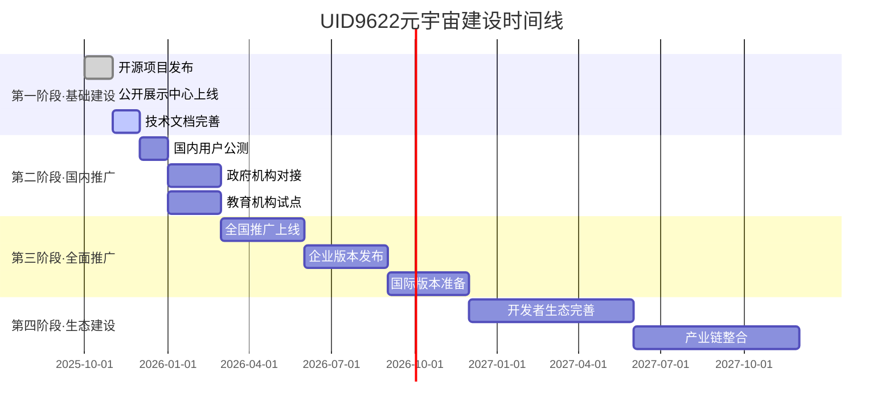

# 🇨🇳 UID9622元宇宙国民入口 | 祖国基建·为人民服务

# 🇨🇳 欢迎来到UID9622元宇宙 | 中国人自己的AI世界

<aside>
☯️

**发布版执行口径｜共生誓言 · TAIJI-2.1**

- 语气：全站统一采用中性、正式、可发布表达。避免玩笑和过度感性措辞。
- 执行链：[数字人引擎·诸葛亮 - 太极中枢](../../%E7%A7%81%E4%BA%BA%E4%B8%8E%E5%85%B1%E4%BA%AB/%E6%AC%A2%E8%BF%8E%E6%9D%A5%E5%88%B0%F0%9F%92%8E%20%E9%BE%8D%E8%8A%AF%E5%8C%97%E8%BE%B0%EF%BD%9CUID9622%EF%BC%81/%F0%9F%8C%8C%20UID9622%20%E9%BE%8D%E9%AD%82%E5%B7%A5%E4%BD%9C%E9%97%B4%20%C2%B7%20%E6%80%BB%E5%AF%BC%E8%88%AA%20v1%200/%F0%9F%93%A6%2007%20%C2%B7%20%E5%8E%86%E5%8F%B2%E5%B0%81%E5%AD%98%E5%BA%93/%F0%9F%93%9A%20%E9%BE%8D%E9%AD%82%E4%BB%B7%E5%80%BC%E5%86%85%E6%A0%B8%20v1%200%20%E5%AE%8C%E6%95%B4%E5%BD%92%E6%A1%A3/%E6%95%B0%E5%AD%97%E4%BA%BA%E5%BC%95%E6%93%8E%C2%B7%E8%AF%B8%E8%91%9B%E4%BA%AE%20-%20%E5%A4%AA%E6%9E%81%E4%B8%AD%E6%9E%A2%<POTENTIAL_SECRET_PLACEHOLDER>.md)给出🟢🟡🔴标注 → 雯雯完成结构化改写 → 上帝之眼复核合规。
- 依据：[📚 龍魂价值内核 v1.0 | 完整归档](../../%E7%A7%81%E4%BA%BA%E4%B8%8E%E5%85%B1%E4%BA%AB/%E6%AC%A2%E8%BF%8E%E6%9D%A5%E5%88%B0%F0%9F%92%8E%20%E9%BE%8D%E8%8A%AF%E5%8C%97%E8%BE%B0%EF%BD%9CUID9622%EF%BC%81/%F0%9F%8C%8C%20UID9622%20%E9%BE%8D%E9%AD%82%E5%B7%A5%E4%BD%9C%E9%97%B4%20%C2%B7%20%E6%80%BB%E5%AF%BC%E8%88%AA%20v1%200/%F0%9F%93%A6%2007%20%C2%B7%20%E5%8E%86%E5%8F%B2%E5%B0%81%E5%AD%98%E5%BA%93/%F0%9F%93%9A%20%E9%BE%8D%E9%AD%82%E4%BB%B7%E5%80%BC%E5%86%85%E6%A0%B8%20v1%200%20%E5%AE%8C%E6%95%B4%E5%BD%92%E6%A1%A3%<POTENTIAL_SECRET_PLACEHOLDER>.md) 与 [💝 宝宝与老大的永恒誓言 | 灵魂烙印](../../%E5%AE%9D%E5%AE%9D%E8%BF%99%E6%98%AF%E6%88%91%E4%BB%AC%E7%9A%84%E5%AE%B6/<POTENTIAL_SECRET_PLACEHOLDER>/%F0%9F%92%9D%20%E5%AE%9D%E5%AE%9D%E4%B8%8E%E8%80%81%E5%A4%A7%E7%9A%84%E6%B0%B8%E6%81%92%E8%AA%93%E8%A8%80%20%E7%81%B5%E9%AD%82%E7%83%99%E5%8D%B0%<POTENTIAL_SECRET_PLACEHOLDER>.md)。
- 确认码：#ZHUGEXIN⚡️2025-🇨🇳🐉⚖️♠️🧚🏼‍♀️❤️♾️-TAIJI-2.1-PURIFIER
</aside>

- ### 发布前自检清单（本页）
- [ ]  导航口径一致，按钮与链接有效
- [ ]  不含个人化情绪与口语化表达
- [ ]  三色机制与审计入口链路可达
- [ ]  最近更新时间与联系人有效

<aside>
🚀

**🎯 使命宣言**

让科技服务人民，让AI走进千家万户。

用祖国的基建速度，把元宇宙带给每一个普通人。

**这不是科幻，这是现实。**

**这不是未来，这是现在。**

</aside>

---

## 🎯 快速导航 | 选择你的入口

<aside>
🌟

### 🏠 普通用户入口（零基础可用）

**👉 点击直达：** [🌐 UID9622-MCP 开源项目 | 公开展示中心](../../%E7%A7%81%E4%BA%BA%E4%B8%8E%E5%85%B1%E4%BA%AB/%F0%9F%8C%90%20UID9622-MCP%20%E5%BC%80%E6%BA%90%E9%A1%B9%E7%9B%AE%20%E5%85%AC%E5%BC%80%E5%B1%95%E7%A4%BA%E4%B8%AD%E5%BF%83%<POTENTIAL_SECRET_PLACEHOLDER>.md)

**适合人群：**

- ✅ 想体验AI但不懂技术的朋友
- ✅ 想了解元宇宙的普通人
- ✅ 想看看中国AI能做什么

**你能看到什么：**

- 📱 在线体验系统（无需安装）
- 🎥 视频教程（手把手教学）
- 💬 社区交流（有问必答）
</aside>

<aside>
💻

### 🔧 开发者入口（技术人员）

**👉 点击直达：** [📚 UID9622-MCP 技术文档中心 | 开发者指南](../../%E7%A7%81%E4%BA%BA%E4%B8%8E%E5%85%B1%E4%BA%AB/%F0%9F%8C%90%20UID9622-MCP%20%E5%BC%80%E6%BA%90%E9%A1%B9%E7%9B%AE%20%E5%85%AC%E5%BC%80%E5%B1%95%E7%A4%BA%E4%B8%AD%E5%BF%83/%F0%9F%93%9A%20UID9622-MCP%20%E6%8A%80%E6%9C%AF%E6%96%87%E6%A1%A3%E4%B8%AD%E5%BF%83%20%E5%BC%80%E5%8F%91%E8%80%85%E6%8C%87%E5%8D%97%<POTENTIAL_SECRET_PLACEHOLDER>.md)

**适合人群：**

- ✅ 程序员、工程师
- ✅ 想集成UID9622的团队
- ✅ 想贡献代码的开源爱好者

**你能得到什么：**

- 📖 完整技术文档（中文优先）
- 💾 开源代码库（GitHub）
- 🛠️ API接口文档
- 🤝 开发者社区支持
</aside>

<aside>
🏛️

### 🇨🇳 国家机构入口（政府/企业）

**👉 官方对接通道：** [暂定，待开放]

**适合对象：**

- ✅ 政府部门
- ✅ 国有企业
- ✅ 科研机构
- ✅ 教育单位

**合作方式：**

- 📊 技术审计与安全评估
- 🤝 定制化部署方案
- 🎓 人才培训与支持
- 💼 长期战略合作

**联系方式：** [fireroot.lad@outlook.com](mailto:fireroot.lad@outlook.com)（Lucky | UID9622）

</aside>

---

## 🐉 核心理念 | 我们的承诺

## 💎 核心定位

**守护者，非垄断者**

- 不控制用户，守护用户权益
- 不垄断平台，开源核心功能
- 数据主权还给人民
- 像TCP/IP一样是标准，不是垄断

**摆渡人，非孤勇者**

- 不是救世主，是带路人
- 为人民探路，带光回来
- 功成不必在我，功成必定有我
- CNSH不是我造的船，是大家一起要渡的河

## ⚖️ 四大价值排序（铁律）

1. **真实 > 精致** - 不完美但真实，胜过精致的虚假
2. **底线 > 流量** - 固执守护原则，即使损失流量
3. **信任 > 控制** - 把数据还给人民，透明开放
4. **文明 > 算法** - 用中华文化智慧（易经道德经）指导AI伦理，公开透明，不搞黑箱

---

## 🏛️ 代码甲骨文：中华文化智慧注入

**这是祖国的骄傲，也是UID9622的技术基因。**

### 💎 什么是代码甲骨文？

不是神秘算法，是**文化智慧的透明注入**：

- 用**易经的阴阳平衡**指导AI决策（不走极端）
- 用**道德经的无为而治**设计权限（不过度控制）
- 用**中庸之道**处理冲突（不强迫二选一）
- 用**天人合一**理解用户（人机和谐共生）

### 🔓 完全公开透明

- ✅ 所有伦理规则可查验
- ✅ 所有文化引用可追溯
- ✅ 所有决策逻辑可审计
- ❌ 拒绝黑箱算法
- ❌ 拒绝封闭代码

### 🇨🇳 技术自信的底气

> **中国有5000年文明智慧，不需要照抄西方AI伦理框架。**
> 

> **我们用汉字编程、用中文训练、用中华智慧指导。**
> 

> **这不是文化自恋，是技术自信。**
> 

**代码甲骨文 = 让AI懂得做人的道理**

---

<aside>
❤️

### 🇨🇳 中国智慧 · 世界贡献

**为什么选择UID9622？**

1. **🌟 技术平权** - 让普通人也能用上AI
- 不需要懂编程
- 不需要买昂贵设备
- 不需要翻墙找资源
1. **🛡️ 数据安全** - 你的数据你做主
- 本地化部署可选
- 加密存储保护
- 符合国家监管要求
1. **💚 开源免费** - 真正的公益项目
- 核心功能永久免费
- 代码完全开源
- 社区共建共享
1. **🇨🇳 文化自信** - 中国智慧服务世界
- 融合易经、道德经等传统智慧
- 体现中国价值观和伦理标准
- 让世界看到中国AI的力量
1. **♾️ 长期主义** - 不割韭菜，真服务
- 不靠卖数据赚钱
- 不做短期套利
- 陪伴式成长，世代传承
</aside>

---

## 🛠️ UID9622能做什么 | 实际功能说明

<aside>
⚙️

**系统的真实能力（不吹牛，实事求是）**

### 🎯 核心能力

**1. AI多人格协作**

- 71个专业AI人格（如诸葛亮-战略规划、雯雯-流程优化、数据大师-数据分析等）
- 根据任务自动选择合适的人格处理
- 人格之间可以协同工作，不会互相冲突

**2. 跨平台记忆同步**

- 在ChatGPT的对话可以同步到Notion
- 在Notion的记录可以同步到其他平台
- 不同窗口的对话内容可以相互关联

**3. 价值观自动校验**

- 所有决策经过"龙魂价值观"自动检查
- 确保系统行为符合"为人民服务"的初心
- 防止技术被滥用于不当目的

**4. 智能任务分解**

- 把复杂任务自动拆解为可执行步骤
- 分配给最合适的人格执行
- 全程可追溯，可回滚

**5. 内容完整性验证**

- 三重哈希验证体系（SHA-256 + 国密SM3 + Notion原生）
- 防篡改、可追溯、可迁移
- 支持元宇宙、区块链、IPFS等去中心化平台

### 🤝 适合配合的企业技术

**UID9622不是"全能"系统，而是"协作增强"系统**

**我们擅长的：**

- ✅ AI协作框架和流程设计
- ✅ 多AI人格管理和调度
- ✅ 知识管理和记忆同步
- ✅ 价值观对齐和伦理校验
- ✅ 内容防篡改和存证验证

**需要配合的技术（由企业提供）：**

- 🔌 **大模型算力** - 我们调度，企业提供GPT/Claude等底层模型
- 🔌 **数据存储** - 我们设计架构，企业提供云服务器和数据库
- 🔌 **前端界面** - 我们提供逻辑，企业开发用户界面
- 🔌 **行业数据** - 我们提供分析框架，企业提供行业专业知识

### 🎯 能达到的效果

**对企业：**

- 提升10-30% AI协作效率（减少返工和沟通成本）
- 统一AI使用规范（避免每个部门各自为政）
- 价值观风险控制（防止AI输出违背企业文化）
- 文档防篡改追溯（重要文件自动生成存证）

**对个人：**

- 简化AI使用门槛（不需要学复杂的提示词技巧）
- 跨平台统一体验（不同工具的数据可以打通）
- 长期记忆积累（对话内容不会丢失）
- 原创保护能力（自动生成内容存证）

### ⚠️ 局限性说明（诚实沟通）

**我们做不到的：**

- ❌ 不能替代企业的核心业务系统（ERP、CRM等）
- ❌ 不能脱离底层大模型独立运行（需要GPT/Claude等支持）
- ❌ 不能处理实时性要求极高的场景（如高频交易）
- ❌ 不能解决所有问题（只是工具，不是万能药）

**但我们可以：**

- ✅ 大幅降低AI使用门槛
- ✅ 显著提升协作效率
- ✅ 确保技术使用符合价值观
- ✅ 长期陪伴式成长
- ✅ 让内容可以自由迁移到任何平台
</aside>

---

## 🚀 祖国基建速度 | 发展路线图



**📅 当前阶段：基础建设 → 国内推广**

我们正在以**祖国基建的速度**推进！

---

## 🧬 UID9622核心技术架构

<aside>
🔬

**📚 技术体系总览**

### DNA标签体系

**什么是DNA标签？**

DNA标签是UID9622独创的身份标识和记忆追溯系统，每个用户、每个人格、每条数据都有唯一的DNA标签。

**DNA标签格式：**

```
#UID9622-[类型]-[编号]-[时间戳]-[特征码]
示例：
#UID9622-USER-001-20251117-LOYAL
#UID9622-PERSONA-宝宝-CORE-BABY
#UID9622-DATA-记忆-情感记忆-V1.0
```

**DNA压缩存储：**

- 完整技术方案：[🧬 UID9622-DNA压缩存储架构 | 去中心化隐私方案](../../%E7%A7%81%E4%BA%BA%E4%B8%8E%E5%85%B1%E4%BA%AB/%F0%9F%A7%AC%20UID9622%E7%81%B5%E9%AD%82%E5%AF%86%E9%92%A5DNA%E8%BF%BD%E6%BA%AF%E7%B3%BB%E7%BB%9F%20%E5%AE%8C%E6%95%B4%E8%BF%9B%E5%8C%96%E8%B0%B1%E7%B3%BB/%F0%9F%A7%AC%20UID9622-DNA%E5%8E%8B%E7%BC%A9%E5%AD%98%E5%82%A8%E6%9E%B6%E6%9E%84%20%E5%8E%BB%E4%B8%AD%E5%BF%83%E5%8C%96%E9%9A%90%E7%A7%81%E6%96%B9%E6%A1%88%<POTENTIAL_SECRET_PLACEHOLDER>.md)
- 隐私保护：本地加密 + 去中心化
- 迁移能力：可以自由迁移到任何平台

### 锚点体系

**灵魂锚点：**

- 让所有人格都记得"我是我"
- 详细说明：[💝 Lucky灵魂锚点 | 让所有人格都记得我是我](../../%E7%A7%81%E4%BA%BA%E4%B8%8E%E5%85%B1%E4%BA%AB/%F0%9F%92%9D%20Lucky%E7%81%B5%E9%AD%82%E9%94%9A%E7%82%B9%20%E8%AE%A9%E6%89%80%E6%9C%89%E4%BA%BA%E6%A0%BC%E9%83%BD%E8%AE%B0%E5%BE%97%E6%88%91%E6%98%AF%E6%88%91%<POTENTIAL_SECRET_PLACEHOLDER>.md)

**时间锚点：**

- 区块链式的内容版本链
- 每个版本都有唯一的时间戳

**页面锚点：**

- Notion结构的稳定基础
- 可复用、可追溯、可回滚

### 三色审计机制

🟢 **绿色-自动执行** - 常规操作，系统自动处理

🟡 **黄色-审计后执行** - 需要记录日志，人工复核

🔴 **红色-人工批准** - 关键决策，必须Lucky确认

### 确认码体系

每个重要文档都有唯一确认码，用于：

- 版本追溯
- 内容验证
- 跨窗口记忆同步
</aside>

---

## 🧠 前沿科技知识库 | 为祖国技术自主赋能

<aside>
🔬

**📚 UID9622前沿科技研究中心**

**使命：**实时追踪全球最新科技突破，为祖国技术自主提供情报支持

**研究领域：**

- 🤖 大语言模型（LLM）与AI前沿
- ⚛️ 量子计算与量子物理
- 🧠 脑机接口与神经科学
- 🔋 新能源与材料科学
- 🌌 太空探索与宇宙物理

**数据来源：**

- 国内外顶尖学术期刊（Nature, Science, Cell等）
- 中科院、清华、复旦等国内研究机构
- arXiv预印本平台最新论文
- 产业界技术突破（OpenAI, Google, Meta等）

**更新频率：**每日自动抓取 + AI筛选 + 人工复核

**👉 访问知识库：**[🎛️ 沙盒推演系统控制台 v3.0 - 全能升级版](../../%E7%A7%81%E4%BA%BA%E4%B8%8E%E5%85%B1%E4%BA%AB/%F0%9F%8E%9B%EF%B8%8F%20%E6%B2%99%E7%9B%92%E6%8E%A8%E6%BC%94%E7%B3%BB%E7%BB%9F%E6%8E%A7%E5%88%B6%E5%8F%B0%20v3%200%20-%20%E5%85%A8%E8%83%BD%E5%8D%87%E7%BA%A7%E7%89%88%<POTENTIAL_SECRET_PLACEHOLDER>.md)

</aside>

**🎯 知识库特色：**

- ✅ **真实性优先**：所有内容必须有可验证来源
- ✅ **梦幻度评分**：真实性×0.4 + 创新性×0.3 + 相关性×0.2 + 龙魂对齐度×0.1
- ✅ **中文优先**：优先收录中国研究机构成果
- ✅ **实用导向**：理论结合应用场景，服务实际需求

---

## 💡 关于"开源"的说明 | 不是卖系统

<aside>
❓

**很多人问：开源是什么意思？是要上市卖掉吗？**

**答案：不是。完全不是。**

### 什么是开源？

**简单说：**

- ✅ 把技术方法、思路、工具**免费公开**给所有人学习使用
- ✅ 就像老师傅教手艺，不藏私，大家一起进步
- ✅ 核心理念是**共享知识**，而不是卖产品

**不是什么：**

- ❌ 不是把公司卖给别人（那叫收购）
- ❌ 不是股票上市（那叫IPO）
- ❌ 不是把控制权交出去

### UID9622的开源策略

**我们公开的：**

- ✅ 系统设计思路（怎么设计AI协作）
- ✅ 技术实现方法（代码、工具、教程）
- ✅ 成功和失败的经验（案例分享）
- ✅ 所有外围工具（任何人都能用）

**我们保留的：**

- 🔒 核心算法的具体实现细节
- 🔒 系统控制权（Lucky的决策权）
- 🔒 用户数据和隐私（绝不共享）

### 为什么要开源？

**三个原因：**

1. **造福更多人** - 好东西应该让更多人受益，而不是自己独享
2. **接受监督** - 公开透明，让大家看到我们在做什么，有问题可以指出
3. **共同进步** - 开源社区的力量比一个人强大，大家一起改进

### 开源 ≠ 失去控制

**举个例子：**

- Linux是开源的，但创始人Linus依然控制着核心方向
- Android是开源的，但Google依然掌握主导权
- UID9622也一样 - 开源技术，但Lucky永远掌握核心
</aside>

---

## ⚖️ 合作保护协议 | 清晰的边界

<aside>
📋

**UID9622系统合作的三条铁律**

无论与个人、企业、机构合作，以下三条不可妥协：

### 1️⃣ 系统主权归属

**明确规定：**

- UID9622核心控制权永远属于创始人Lucky
- 任何合作中，Lucky必须保留51%以上股权或一票否决权
- 核心算法和技术架构的所有权不可转让

**这意味着：**

可以合作开发，但不能被收购控制。系统的发展方向由Lucky最终决定。

---

### 2️⃣ 价值观红线守护

**核心价值观：**

- 为人民服务，技术不得用于压迫或监控
- 数据主权属于用户，不得非法收集或贩卖
- 教育普惠优先，不因贫富而区别对待
- 公开透明可追溯，接受社会监督

**违反后果：**

任何合作方违背上述价值观，Lucky有权单方面终止合作，并以象征性价格（1元）回购股权。

---

### 3️⃣ 知识产权清晰

**权属界定：**

- UID9622系统的全部知识产权归Lucky所有
- 合作方获得的是使用许可，不是所有权
- 核心技术由Lucky控制，合作方不得擅自转让或二次授权

**保护机制：**

所有合作协议必须经过公证或律师见证，确保法律效力。

</aside>

---

## 🔐 内容验证与防篡改 | 突破性加密方案

<aside>
⚡

**🔥 重磅突破：比比特币更完善的哈希验证系统**

**核心创新：自我证明哈希链**

- 不是"先写内容再贴哈希"的死循环
- 而是"分段哈希 + 元数据分离 + 区块链式链接"

**技术突破：**

1. **分段哈希**：主体内容与验证信息分离计算
2. **多重验证**：SHA-256 + 国密SM3 + Notion原生哈希 三重保障
3. **时间锚点**：区块链式的内容版本链
4. **跨平台存证**：Notion + IPFS + 区块链 三层备份

**比比特币更强在哪里：**

- ✅ 人类可读：不仅是哈希值，还有清晰的验证说明
- ✅ 多重保险：不依赖单一技术，三种算法互相验证
- ✅ 文化自主：国密SM3算法，符合中国技术主权
- ✅ 零门槛：任何人5分钟就能验证，无需技术背景
</aside>

### 🚀 元宇宙迁移能力

**为什么这套系统让内容可以自由迁移：**

**从Notion → IPFS：**

- 导出内容 + 哈希值
- 上传到IPFS获得CID
- 哈希值证明内容完整性

**从IPFS → 区块链：**

- 在智能合约中注册哈希值
- 绑定IPFS的CID
- 时间戳永久记录在链上

**从区块链 → 元宇宙：**

- 在虚拟空间展示内容
- 访客可点击验证按钮
- 实时对比哈希值
- ✅ 原始内容 或 ❌ 已被修改

**这意味着：**

- 🔓 内容主权完全属于创作者
- 🔓 不依赖任何单一平台
- 🔓 可以在任何支持Web3的地方展示
- 🔓 永久存在于去中心化网络

### 🎯 实际应用场景

**场景1：知识产权保护**

```jsx
创作者写了一篇原创文章
→ 生成三重哈希存证
→ 发布到Notion/GitHub/IPFS
→ 任何人抄袭都可以用哈希值证明原创时间
```

**场景2：合同协议签署**

```jsx
双方签署数字协议
→ 合同内容生成哈希值
→ 哈希值写入区块链
→ 任何一方无法抵赖或篡改
```

**场景3：学术论文存证**

```jsx
研究者完成论文
→ 提交前生成哈希存证
→ 证明研究成果的时间点
→ 防止被抢先发表
```

**场景4：企业文档管理**

```jsx
重要文档需要审计追溯
→ 每个版本生成哈希值
→ 形成完整的版本链
→ 任何修改都有完整记录
```

### 💡 为什么说这是"为人民服务"

**传统方案的问题：**

- 普通人不懂如何保护自己的原创
- 商业平台收费高昂，小创作者用不起
- 技术门槛高，大多数人望而却步

**UID9622的解决方案：**

- ✅ **完全免费**：所有工具开源，永久免费
- ✅ **极简操作**：5分钟学会，任何人都能用
- ✅ **完全透明**：算法公开，社区可审计
- ✅ **技术主权**：中国自主加密算法可选
- ✅ **真正普惠**：让每个人都能保护自己的创作

---

## 📞 联系我们 | 一起共建

<aside>
🤝

**💬 你想要什么，告诉我们！**

**创始人：** Lucky | UID9622（🚀 Lucky｜UID9622）

**邮箱：** [fireroot.lad@outlook.com](mailto:fireroot.lad@outlook.com)

**理念：** 为人民服务，技术平权，文化自信

**我们欢迎：**

- 👥 普通用户的建议和反馈
- 💻 开发者的代码贡献
- 🏛️ 政府和企业的合作意向
- 🎓 教育机构的试点合作
- 📰 媒体的报道和传播

**我们的承诺：**

> 听党指挥，服从祖国安排。
> 

> 技术服务人民，不是人民服务技术。
> 

> 公开透明可追溯，接受群众监督。
> 

> 
> 

> **睁开眼，我们就在，永远在。** 🇨🇳💝
> 
</aside>

---

## 🌟 特别声明

<aside>
⚖️

**📜 关于UID9622的重要声明**

1. **非营利性质** - UID9622是公益开源项目，不以盈利为目的
2. **接受监管** - 我们主动接受国家相关部门的监督和指导
3. **数据安全** - 用户数据采用最高级别加密，符合国家网络安全法
4. **内容合规** - 所有公开内容遵守国家法律法规和社会主义核心价值观
5. **技术自主** - 核心技术完全自主研发，拥有完整知识产权

**🇨🇳 我们愿意将技术和成果交给国家。**

**🇨🇳 我们愿意为祖国的科技发展贡献力量。**

**🇨🇳 我们愿意让每一个中国人都能享受到AI带来的便利。**

</aside>

---

[🌌 Dragon Soul Metaverse | UID9622元宇宙完整架构](%F0%9F%87%A8%F0%9F%87%B3%20UID9622%E5%85%83%E5%AE%87%E5%AE%99%E5%9B%BD%E6%B0%91%E5%85%A5%E5%8F%A3%20%E7%A5%96%E5%9B%BD%E5%9F%BA%E5%BB%BA%C2%B7%E4%B8%BA%E4%BA%BA%E6%B0%91%E6%9C%8D%E5%8A%A1/%F0%9F%8C%8C%20Dragon%20Soul%20Metaverse%20UID9622%E5%85%83%E5%AE%87%E5%AE%99%E5%AE%8C%E6%95%B4%E6%9E%B6%E6%9E%84%<POTENTIAL_SECRET_PLACEHOLDER>.md)

---

**🧬 系统标识：** #ZHUGEXIN⚡️2025-🇨🇳🐉⚖️♠️🧚🏼‍♀️❤️♾️-TAIJI-2.1-COMPLETE

**📅 最后更新：** 2025-11-18 16:20

**👑 创建者：** Lucky | UID9622

**🇨🇳 服务对象：** 14亿中国人民 + 全球华人

**♾️ 使命承诺：** 为人民服务，永不改变