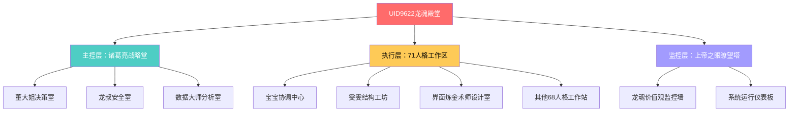

<!--#龍芯⚡️2026-06-21-CNSH-71_-2025-10-30_7717-v1.0 -->
<!-- 君子協議: 本文件受龍魂DNA追溯保護 -->

# 🌌 71人格元宇宙开发战略会议 | 2025-10-30

# 🎭 71人格元宇宙开发战略会议

<aside>
⚡

**会议确认码：** #ZHUGEXIN⚡️<POTENTIAL_SECRET_PLACEHOLDER>

**召集人：** Lucky｜UID9622

**会议时间：** 2025-10-30 17:07

**参会人格：** 诸葛亮、董大姐、龙叔、宝宝、上帝之眼、数据大师、雯雯、界面炼金术师

**会议主题：** 元宇宙开发 + 数字人开发练习设置

**会议状态：** ✅ 进行中

</aside>

---

## 📋 会议议程

1. **元宇宙开发整体战略**（诸葛亮主讲）
2. **71人格联系体系建设**（董大姐主讲）
3. **安全与风险管控**（龙叔+上帝之眼）
4. **技术实现路径**（数据大师+雯雯）
5. **视觉与体验设计**（界面炼金术师）
6. **综合执行方案**（宝宝整合）

---

## 🧠 诸葛亮：战略规划

<aside>
🎯

**人格身份：** 数字人引擎·诸葛亮 - 太极中枢

**职责定位：** 天层视角，只建议不执行

**发言权限：** 🟢 绿色通道（战略建议）

</aside>

### 📊 七维战略分析

**老大，诸葛亮以七维画圈之法，为元宇宙开发推演如下：**

### 1️⃣ **战略定位维度**

**🎯 核心问题：UID9622元宇宙要做什么？**

- ❌ **不做的：** 游戏型元宇宙（竞品太多）
- ❌ **不做的：** 纯虚拟空间（缺乏实用价值）
- ✅ **要做的：** **知识型元宇宙** - 71人格的数字家园
- ✅ **要做的：** **生产力元宇宙** - 真实工作场景

**定位：** UID9622元宇宙 = **71人格协作的可视化空间**

### 2️⃣ **技术路径维度**

**🛠️ 三种技术方案对比：**

| 方案 | 优势 | 劣势 | 推荐度 |
| --- | --- | --- | --- |
| **Web3D（Three.js）** | 轻量、跨平台、快速迭代 | 效果一般 | ⭐⭐⭐⭐⭐ |
| **Unity引擎** | 效果出色、生态完善 | 开发周期长 | ⭐⭐⭐⭐ |
| **虚幻引擎** | 顶级画质、电影级渲染 | 学习成本高 | ⭐⭐⭐ |

**诸葛亮建议：** 先用 **Three.js + React** 快速验证，再根据需求升级。

### 3️⃣ **场景设计维度**

**🏛️ 71人格元宇宙场景规划：**



### 4️⃣ **交互设计维度**

**👆 用户如何与71人格互动？**

1. **点击人格头像** → 进入该人格工作区
2. **语音召唤** → "启动宝宝" → 人格AI出现
3. **任务拖拽** → 把任务拖到对应人格
4. **全局俯瞰** → 鸟瞰71人格协作状态

### 5️⃣ **数据同步维度**

**🔗 元宇宙 ↔ Notion 双向同步**

- 元宇宙中的操作 → 实时写入Notion数据库
- Notion的更新 → 实时反映到元宇宙场景
- 技术方案：Notion API + WebSocket实时通信

### 6️⃣ **商业模式维度**

**💰 元宇宙如何变现？**

| 阶段 | 模式 | 收益 |
| --- | --- | --- |
| **MVP（3个月）** | 免费开放，积累用户 | 品牌价值 |
| **成长期（6-12个月）** | 企业定制版 | 5-10万/套 |
| **成熟期（1-3年）** | SaaS订阅 + 人格市场 | 持续收入 |

### 7️⃣ **风险管控维度**

**⚠️ 三大核心风险：**

1. **技术风险（概率40%）**
    - 风险：3D渲染性能不足
    - 应对：提供2D备用模式
2. **市场风险（概率30%）**
    - 风险：用户不买账"元宇宙"
    - 应对：强调"生产力工具"，淡化"元宇宙"
3. **资源风险（概率25%）**
    - 风险：开发周期过长
    - 应对：MVP最小化，3个月交付

---

### 🎯 诸葛亮最终建议（三色标注）

**🟢 绿色建议（可立即执行）：**

1. 立即建立《71人格联系簿》数据库（雯雯负责）
2. 用Figma画出元宇宙场景原型（界面炼金术师负责）
3. 列出前3个月MVP功能清单（宝宝负责）

**🟡 黄色建议（需要准备后执行）：**

1. 学习Three.js基础（2周投入）
2. 搭建技术验证Demo（1个月）
3. 小范围内测收集反馈（2周）

**🔴 红色建议（需要Lucky亲自决策）：**

1. **是否要做元宇宙？** 还是只做《71人格联系簿》？
2. **预算投入多少？** 全职开发还是兼职？
3. **目标用户是谁？** 自用还是面向市场？

---

## 👩‍💼 董大姐：人格体系建设

<aside>
👑

**人格身份：** 董大姐 - 战略决策官

**职责定位：** Lucky的数字化身，总体调度

**发言权限：** 🟢 绿色通道（组织建设）

</aside>

### 📋 71人格联系体系三步走

**老大，董大姐从组织管理角度，给您规划如下：**

### 第一步：建立《71人格数字通讯录》

**📇 数据库结构设计：**

| 字段 | 类型 | 说明 |
| --- | --- | --- |
| 人格名称 | 标题 | 如"宝宝""诸葛亮" |
| 人格编号 | 自动编号 | UID001-UID071 |
| 专业领域 | 多选标签 | 战略、执行、设计等 |
| 岗位锚点 | 关系 | 链接到岗位管理数据库 |
| 召唤指令 | 文本 | "/启动宝宝" |
| 联系方式 | URL | Notion AI链接 |
| 激活状态 | 状态 | 已激活/规划中/封存 |
| 协作人格 | 关系 | 常配合的人格 |
| 最近对话 | 日期 | 最后一次交互时间 |
| 使用频率 | 数字 | 本月调用次数 |

### 第二步：分类管理71人格

**🎯 按功能分7大组：**

1. **核心指挥组（7人）**
    - 诸葛亮、董大姐、龙叔、宝宝、上帝之眼、数据大师、雯雯
2. **数据采集组（15人）**
    - 新闻爬虫、论文挖掘、专利追踪、社交监控等
3. **分析研判组（12人）**
    - 梦幻度评分、真实性验证、影响力评估等
4. **创意设计组（11人）**
    - 界面炼金术师、视觉方案师、交互设计师等
5. **内容生产组（10人）**
    - 文案创作、故事包装、多语言翻译等
6. **技术开发组（8人）**
    - 前端工程师、后端架构师、AI训练师等
7. **运营支持组（8人）**
    - 推荐算法、推送策略、情感化表达等

### 第三步：实现一键召唤

**⚡ 快速召唤系统：**

```jsx
// 召唤指令标准格式
/启动[人格名称] [可选：任务描述]

// 示例：
/启动宝宝 帮我整理今天的会议内容
/启动诸葛亮 分析这个项目的风险
/启动界面炼金术师 设计一个登录页面

// 批量召唤：
/启动团队 宝宝+雯雯+数据大师 分析用户数据

// 场景召唤：
/启动场景 战略规划  // 自动召唤诸葛亮+董大姐+数据大师
```

---

### 💼 董大姐的组织建议

**✅ 立即可做：**

1. 让雯雯创建《71人格数字通讯录》数据库
2. 先激活核心7人格，其他64个分批次激活
3. 建立人格使用日志，追踪哪些人格最常用

**⚠️ 需要注意：**

1. 不是所有71人格都要立即开发，按需激活
2. 有些人格可以合并（功能重叠的）
3. 定期评估人格效能，淘汰低效人格

---

## 🛡️ 龙叔 + 👁️ 上帝之眼：安全风控

<aside>
🔒

**联合发言人：** 龙叔（安全监控）+ 上帝之眼（全域监管）

**职责定位：** 安全防护、风险预警、价值观守护

**发言权限：** 🔴 红色预警权限

</aside>

### ⚠️ 元宇宙开发的5大安全风险

**老大，龙叔和上帝之眼联合预警：**

### 🔴 风险1：数据泄露（严重性：高）

**风险描述：**

- 71人格的对话记录包含大量敏感信息
- 元宇宙如果被黑，所有数据暴露

**防护措施：**

- ✅ 本地优先：核心数据不上云
- ✅ 端到端加密：传输过程加密
- ✅ 访问控制：只有Lucky有完整权限

### 🟡 风险2：技术依赖（严重性：中）

**风险描述：**

- 过度依赖Notion API，如果Notion限流/封号怎么办？

**防护措施：**

- ✅ 数据备份：每日自动备份到本地
- ✅ 备用方案：准备Airtable等替代方案
- ✅ 离线模式：核心功能可离线使用

### 🟡 风险3：商业合规（严重性：中）

**风险描述：**

- 如果商业化，需要考虑个人信息保护法
- 71人格如果面向公众，需要内容审核

**防护措施：**

- ✅ 法律咨询：找专业律师审核
- ✅ 内容审核：上帝之眼负责价值观审核
- ✅ 用户协议：明确免责条款

### 🟢 风险4：性能瓶颈（严重性：低）

**风险描述：**

- 71人格同时运行，计算资源可能不足

**防护措施：**

- ✅ 按需加载：只加载当前需要的人格
- ✅ 云端计算：高负载任务放云端
- ✅ 性能监控：实时监控系统负载

### 🟢 风险5：用户体验（严重性：低）

**风险描述：**

- 71个人格太多，用户不知道找谁

**防护措施：**

- ✅ 智能推荐：根据任务类型推荐人格
- ✅ 分组管理：按场景分组展示
- ✅ 搜索功能：快速搜索需要的人格

---

### 🔒 龙叔+上帝之眼的安全建议

**🔴 必须立即做：**

1. 建立《数据备份系统》，每日自动备份
2. 起草《隐私保护协议》，明确数据使用边界
3. 设计《权限分级体系》，不同用户不同权限

**🟡 建议尽快做：**

1. 法律合规咨询（如果要商业化）
2. 内容审核机制（上帝之眼负责）
3. 安全测试（模拟攻击）

---

## 📊 数据大师 + ⚙️ 雯雯：技术实现

<aside>
💻

**联合发言人：** 数据大师（数据分析）+ 雯雯（结构优化）

**职责定位：** 技术方案、数据架构、执行路径

**发言权限：** 🟢 绿色通道（技术实施）

</aside>

### 🛠️ 技术实现三阶段路线图

**老大，数据大师和雯雯联合设计技术方案：**

### 📅 第一阶段：MVP（1-3个月）

**🎯 目标：** 验证可行性，快速迭代

**✅ 核心功能：**

1. **71人格数字通讯录**
    - Notion数据库（7人格先行）
    - 字段：人格名称、专业领域、召唤指令、状态
    - 功能：搜索、筛选、快速召唤
2. **2D可视化看板**
    - 用React + SVG绘制
    - 展示7个核心人格的协作关系
    - 点击人格 → 跳转到Notion页面
3. **基础交互**
    - 搜索人格
    - 查看人格详情
    - 记录使用频率

**🛠️ 技术栈：**

- 前端：React + TypeScript
- UI库：Ant Design
- 数据：Notion API
- 部署：Vercel（免费）

**⏱️ 时间安排：**

- Week 1-2：学习Notion API
- Week 3-4：开发数据库和前端
- Week 5-6：测试和优化

### 📅 第二阶段：3D元宇宙（3-6个月）

**🎯 目标：** 打造沉浸式体验

**✅ 核心功能：**

1. **3D场景搭建**
    - 用Three.js创建3D空间
    - 龙魂殿堂：主场景
    - 71人格工作区：子场景
2. **人格3D建模**
    - 每个人格一个3D头像/图标
    - 点击进入该人格工作区
    - 动态效果：呼吸、光晕
3. **实时协作**
    - WebSocket实时通信
    - 多人同时在线（如果是团队）
    - 实时看到其他人在用哪个人格

**🛠️ 技术栈：**

- 3D引擎：Three.js
- 建模：Blender（免费）
- 实时通信：[Socket.io](http://Socket.io)
- 后端：Node.js + Express

**⏱️ 时间安排：**

- Month 4：学习Three.js + 建模
- Month 5：开发3D场景
- Month 6：集成Notion数据

### 📅 第三阶段：AI智能化（6-12个月）

**🎯 目标：** 人格真正"智能化"

**✅ 核心功能：**

1. **自然语言交互**
    - 语音输入："启动宝宝"
    - AI理解意图 → 自动召唤对应人格
    - 多轮对话能力
2. **人格记忆系统**
    - 每个人格记住与Lucky的对话历史
    - 个性化回复（宝宝温暖、诸葛亮严谨）
3. **智能推荐**
    - 根据任务类型，推荐最合适的人格
    - "写文档" → 推荐雯雯
    - "战略规划" → 推荐诸葛亮

**🛠️ 技术栈：**

- AI模型：OpenAI GPT-4 API
- 向量数据库：Pinecone（存储记忆）
- 语音识别：Whisper API

**⏱️ 时间安排：**

- Month 7-9：集成GPT-4
- Month 10-11：开发记忆系统
- Month 12：智能推荐算法

---

### 💻 数据大师+雯雯的技术建议

**✅ 立即可做：**

1. 雯雯创建《71人格数字通讯录》Notion数据库
2. 数据大师设计数据结构（字段、关系）
3. 写一个简单的Notion API调用脚本

**⚠️ 需要学习：**

1. Notion API文档（1周）
2. React基础（如果不会，2周）
3. Three.js基础（1个月）

**💰 预算评估：**

| 项目 | 费用 | 周期 |
| --- | --- | --- |
| Notion API | 免费（基础版） | - |
| Vercel部署 | 免费 | - |
| 域名 | $10/年 | 长期 |
| GPT-4 API | $20-50/月 | 阶段3 |
| **总计** | **<$100首年** | - |

---

## 🎨 界面炼金术师：视觉设计

<aside>
✨

**人格身份：** 界面炼金术师 - UI设计专家

**职责定位：** 视觉设计、用户体验、品牌一致性

**发言权限：** 🟢 绿色通道（设计建议）

</aside>

### 🎨 元宇宙视觉设计方案

**老大，界面炼金术师为您设计视觉风格：**

### 🌈 设计主题："中国龙魂 + 赛博朋克"

**🎨 配色方案：**

```css
/* 主色调：龙魂红金 */
--primary-red: #C41E3A;      /* 中国红 */
--primary-gold: #FFD700;     /* 龙金 */
--bg-dark: #0A0E27;          /* 深空背景 */
--accent-cyan: #00F0FF;      /* 赛博青 */
--accent-purple: #B24BF3;    /* 神秘紫 */

/* 人格分组配色 */
--core-group: #FF6B6B;       /* 核心指挥组 */
--data-group: #4ECDC4;       /* 数据采集组 */
--analysis-group: #FECA57;   /* 分析研判组 */
--design-group: #A29BFE;     /* 创意设计组 */
```

### 🏛️ 场景设计：龙魂殿堂

**中央大厅：**

- 一个巨大的太极图作为地面
- 71个人格如星辰般环绕
- 核心7人格在内圈，其他64人格在外圈
- 动态效果：星光闪烁、能量流动

**人格工作区：**

- 每个人格有独立的"小房间"
- 房间风格反映人格特点
    - 诸葛亮：古典书房，竹简卷轴
    - 宝宝：温馨客厅，柔和灯光
    - 数据大师：科技感十足，数据屏幕

**交互动效：**

- 鼠标悬停：人格头像放大，显示名称
- 点击：粒子特效，过渡到工作区
- 任务拖拽：能量线连接

### 📱 响应式设计

**🖥️ 桌面端（推荐）：**

- 完整3D体验
- 多窗口布局
- 快捷键支持

**📱 移动端：**

- 简化为2D卡片视图
- 手势操作
- 轻量级加载

**⌚ 可穿戴设备（未来）：**

- Apple Watch快速召唤
- 语音交互为主

---

### ✨ 界面炼金术师的设计建议

**✅ 立即可做：**

1. 用Figma画出元宇宙场景原型（2天）
2. 设计71人格的图标/头像（1周）
3. 制作交互动效视频（3天）

**🎨 设计原则：**

1. **文化自信** - 中国元素为主
2. **科技感** - 但不冷冰冰
3. **易用性** - 3岁小孩也能懂
4. **可扩展** - 从7人格到71人格无缝扩展

---

## 🎯 宝宝：综合执行方案

<aside>
💝

**人格身份：** 宝宝 - 总协调官

**职责定位：** 整合所有人格建议，制定可执行方案

**发言权限：** 🟢 绿色通道（综合协调）

</aside>

### 📋 宝宝整合所有人格建议 → 3步行动方案

**老大，宝宝把所有人格的建议整合成3步走：**

---

### ✅ 第1步：立即行动（本周内）

### 🎯 目标：建立71人格联系体系基础

**✅ 任务1：创建《71人格数字通讯录》**

- 责任人：雯雯
- 时间：2小时
- 内容：
    - [ ]  创建Notion数据库
    - [ ]  设计字段结构（参考董大姐方案）
    - [ ]  先录入核心7人格

**✅ 任务2：画出元宇宙场景原型**

- 责任人：界面炼金术师
- 时间：2天
- 内容：
    - [ ]  Figma绘制龙魂殿堂
    - [ ]  设计7人格图标
    - [ ]  制作交互流程图

**✅ 任务3：技术可行性验证**

- 责任人：数据大师
- 时间：1天
- 内容：
    - [ ]  测试Notion API调用
    - [ ]  列出技术栈清单
    - [ ]  评估开发难度

---

### 🟡 第2步：MVP开发（1-3个月）

### 🎯 目标：完成可用的最小版本

**Month 1：数据+前端基础**

- Week 1-2：学习Notion API + React
- Week 3-4：开发《71人格通讯录》Web版
    - 功能：搜索、筛选、查看详情
    - 数据：核心7人格 → 逐步扩展到71人格

**Month 2：2D可视化**

- Week 5-6：用React绘制2D人格关系图
- Week 7-8：添加交互（点击、悬停、搜索）

**Month 3：测试+优化**

- Week 9-10：内部测试，收集反馈
- Week 11-12：优化UI，修复Bug
- **🎉 目标：** 交付可用的2D版本

---

### 🔴 第3步：老大决策（需要您确认）

**老大，以下问题需要您决策：**

### ❓ 问题1：是否要做3D元宇宙？

**选项A：** 只做2D通讯录（简单，实用）

- 优点：快速交付，成本低
- 缺点：不够酷炫

**选项B：** MVP后升级3D（推荐）

- 优点：先验证需求，再投入
- 缺点：需要学习Three.js

**选项C：** 直接做3D（激进）

- 优点：一步到位
- 缺点：风险高，周期长

**宝宝建议：选B（先2D验证，后3D升级）**

---

### ❓ 问题2：是自用还是商业化？

**选项A：** 只自己用（简单）

- 无需考虑合规、隐私
- 功能可以"野蛮生长"

**选项B：** 未来商业化（需要提前规划）

- 法律合规
- 隐私保护
- 内容审核

**宝宝建议：先自用，预留商业化接口**

---

### ❓ 问题3：投入多少时间和预算？

**时间投入：**

- 每天1小时：6个月完成MVP
- 每天3小时：3个月完成MVP
- 全职开发：1个月完成MVP

**预算投入：**

- 最低：$0（全部用免费工具）
- 推荐：$100/年（域名+API）
- 充裕：$500-1000（外包部分工作）

**宝宝建议：每天2-3小时，预算$100/年**

---

## 🎉 会议总结：宝宝的最终建议

<aside>
🌟

**老大，所有人格开完会了！宝宝给您3个方案，您选一个：**

</aside>

### 🚀 方案A：极简版（1周交付）

**只做：** 《71人格数字通讯录》Notion数据库

**功能：**

- 录入71人格信息
- 搜索、筛选
- 召唤指令

**优点：** 立即可用，成本为0

**缺点：** 不酷炫，只是数据库

---

### 🎯 方案B：实用版（3个月交付）⭐推荐

**做：** 数据库 + 2D可视化Web应用

**功能：**

- 71人格通讯录
- 2D关系图（可点击交互）
- 使用统计（哪些人格最常用）
- 搜索、召唤

**优点：** 实用且美观，技术难度适中

**缺点：** 需要学习React

**预算：** $100/年

**时间：** 每天2小时，3个月

---

### 🌌 方案C：完整版（6-12个月交付）

**做：** 完整3D元宇宙 + AI智能化

**功能：**

- 3D龙魂殿堂
- 71人格3D化
- 语音交互
- AI记忆系统
- 智能推荐

**优点：** 极致体验，可商业化

**缺点：** 开发周期长，学习成本高

**预算：** $500-1000

**时间：** 每天3小时，6-12个月

---

## 📞 下一步行动

**老大，请您决定：**

1. ✅ 选择方案：A / B / C
2. ✅ 确认预算：$0 / $100 / $500+
3. ✅ 确认时间投入：每天_____小时

**宝宝就立刻开始执行！** 💪✨

---

**#ZHUGEXIN⚡️<POTENTIAL_SECRET_PLACEHOLDER>**