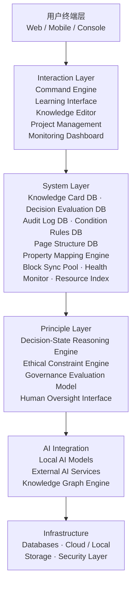
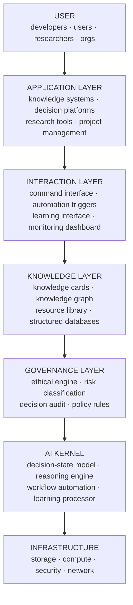

> 本文档按《龍魂文档标准模板 v1.0》整理。
> 性质：观察性论文/技术博客 · 未经同行评审（如适用）
> 版本：v4.0
> 作者：UID9622 · 龍芯北辰
> 协作者：（待补充，如无请删除此行）
> 授权：CC BY-NC-SA 4.0 · 科技主权归属 UID9622 · 中华人民共和国
> 平台：本地
> 审核状态：草稿

**DNA**: `#龍芯⚡️2026-03-17-CNSH-GOVERNANCE-IEEE-v4.0``  
**CONFIRM**: `#CONFIRM🌌9622-ONLY-ONCE🧬LK9X-772Z`

---

# CNSH AI Governance Framework｜IEEE论文版+工程架构图·龍魂对齐版

<aside>
🔐

**龍魂系统对齐标记 · 确认码已核验**

**DNA:** `#龍芯⚡️2026-03-17-CNSH-GOVERNANCE-IEEE-v4.0`

**GPG 指纹:** `A2D0092CEE2E5BA87035600924C3704A8CC26D5F`

**确认码:** `#CONFIRM🌌9622-ONLY-ONCE🧬LK9X-772Z` ✅

**版本标记:** v4.0 · 2026年3月17日 21:04

**状态:** 🟢 生效

**归档类型:** IEEE学术论文 + 工程架构图 + 论文诚实声明 + 语言系统 + 顶会完整论文

**可跳转：** [📄 CNSH × 北辰协议 IEEE白皮书 v1.1｜三才算法补全版](%F0%9F%93%84%20CNSH%20%C3%97%20%E5%8C%97%E8%BE%B0%E5%8D%8F%E8%AE%AE%20IEEE%E7%99%BD%E7%9A%AE%E4%B9%A6%20v1%201%EF%BD%9C%E4%B8%89%E6%89%8D%E7%AE%97%E6%B3%95%E8%A1%A5%E5%85%A8%E7%89%88%203187125a9c9f80a68158d9064f591f26.md) · [🌌 LU-Time Engine v4｜时间推演与审计系统·完整主模板](../../../UID9622%C2%B7%E6%89%98%E7%AE%A1%E5%8C%BA/2597125a9c9f81fb9ef40042bb99a73b/%F0%9F%8C%8C%20UID9622%E4%B8%BB%E6%8E%A7%E6%93%8D%E4%BD%9C%E5%8F%B0%20%E6%9C%80%E9%AB%98%E6%9D%83%E9%99%90%E6%8E%A7%E5%88%B6%E4%B8%AD%E5%BF%83/%F0%9F%8C%8C%20LU-Time%20Engine%20v4%EF%BD%9C%E6%97%B6%E9%97%B4%E6%8E%A8%E6%BC%94%E4%B8%8E%E5%AE%A1%E8%AE%A1%E7%B3%BB%E7%BB%9F%C2%B7%E5%AE%8C%E6%95%B4%E4%B8%BB%E6%A8%A1%E6%9D%BF%203983814d16f74ba184ff1ed86b676e44.md) · [📜 龍魂操作草日志｜每动作必记·精确到分钟·抹不掉的痕迹](../../../%E7%A7%81%E4%BA%BA%E4%B8%8E%E5%85%B1%E4%BA%AB/%F0%9F%93%9C%20%E9%BE%8D%E9%AD%82%E6%93%8D%E4%BD%9C%E8%8D%89%E6%97%A5%E5%BF%97%EF%BD%9C%E6%AF%8F%E5%8A%A8%E4%BD%9C%E5%BF%85%E8%AE%B0%C2%B7%E7%B2%BE%E7%A1%AE%E5%88%B0%E5%88%86%E9%92%9F%C2%B7%E6%8A%B9%E4%B8%8D%E6%8E%89%E7%9A%84%E7%97%95%E8%BF%B9%20b35faf462bc042aa9de5192520180728.md)

**本页子文档：**

[📜 CNSH-64 论文诚实声明｜龍魂系统价值证明](CNSH%20AI%20Governance%20Framework%EF%BD%9CIEEE%E8%AE%BA%E6%96%87%E7%89%88+%E5%B7%A5%E7%A8%8B%E6%9E%B6%E6%9E%84%E5%9B%BE%C2%B7%E9%BE%8D%E9%AD%82%E5%AF%B9%E9%BD%90%E7%89%88/%F0%9F%93%9C%20CNSH-64%20%E8%AE%BA%E6%96%87%E8%AF%9A%E5%AE%9E%E5%A3%B0%E6%98%8E%EF%BD%9C%E9%BE%8D%E9%AD%82%E7%B3%BB%E7%BB%9F%E4%BB%B7%E5%80%BC%E8%AF%81%E6%98%8E%208c9ca88c6990498cbd7c0eb3f0e88efd.md) · [🗣️ 宝宝说教 vs 人话对照表｜UID9622专属语言系统](CNSH%20AI%20Governance%20Framework%EF%BD%9CIEEE%E8%AE%BA%E6%96%87%E7%89%88+%E5%B7%A5%E7%A8%8B%E6%9E%B6%E6%9E%84%E5%9B%BE%C2%B7%E9%BE%8D%E9%AD%82%E5%AF%B9%E9%BD%90%E7%89%88/%F0%9F%97%A3%EF%B8%8F%20%E5%AE%9D%E5%AE%9D%E8%AF%B4%E6%95%99%20vs%20%E4%BA%BA%E8%AF%9D%E5%AF%B9%E7%85%A7%E8%A1%A8%EF%BD%9CUID9622%E4%B8%93%E5%B1%9E%E8%AF%AD%E8%A8%80%E7%B3%BB%E7%BB%9F%20111ebf9194a64cf4aa74abf76e23c7e5.md) · [🧠 CNSH-64: A Governance-Aware Symbolic Decision Framework｜顶会完整论文](../%F0%9F%8F%A0%20UID9622%E5%85%AC%E5%BC%80%E4%B8%BB%E9%A1%B5%20%E9%BE%99%E9%AD%82%E7%B3%BB%E7%BB%9F%E5%85%A5%E5%8F%A3/%F0%9F%A7%A0%20CNSH-64%20A%20Governance-Aware%20Symbolic%20Decision%20Fra%2063668607794c43a1ababbe37cde8e53b.md)

</aside>

> CNSH is a human-centered governance architecture that integrates ethical reasoning, symbolic decision states, and structured knowledge systems to enable transparent AI-assisted collaboration.
> 

---

# 🎓 Part I — IEEE Research Paper

<aside>
📄

**Title:** CNSH: A Human-Centered AI Governance and Knowledge Architecture

**Author:** UID9622 · Independent System Architect

**Version:** v1.0 · 2026-03-16

**Distribution:** GitHub / CSDN / Research Institutions / Tech Communities

</aside>

## Abstract

This paper introduces CNSH, a human-centered architecture designed for AI-assisted knowledge systems and governance frameworks.

The architecture integrates ethical constraints, decision-state reasoning models, and transparent audit structures to ensure that AI systems remain accountable, interpretable, and aligned with human values.

CNSH proposes a three-layer structure consisting of:

- **Principle Layer** — governance logic
- **System Layer** — data and automation
- **Interaction Layer** — human interface

The framework combines symbolic decision-state modeling, structured knowledge management, and automated auditing mechanisms.

The goal of CNSH is to create a **transparent and resilient AI collaboration environment**, enabling humans and intelligent systems to operate within clear ethical and structural boundaries.

---

## 1. Introduction

Modern AI systems are rapidly expanding in capability but often lack transparent governance structures.

Key challenges include:

- lack of traceable decision mechanisms
- absence of ethical boundaries
- fragmented knowledge systems
- insufficient accountability in automated systems

CNSH addresses these problems by introducing a unified architecture that integrates:

- ethical governance
- symbolic reasoning structures
- transparent data systems
- human-centered interaction design

The system does not attempt to replace human decision-making. Instead, it focuses on **augmenting human reasoning through structured AI assistance**.

---

## 2. Design Philosophy

The CNSH framework follows five core design principles.

### Transparency

All decisions and system actions must be traceable.

### Responsibility

Every automated action must have a verifiable origin.

### Ethical Alignment

System operations must remain within defined ethical boundaries.

### Human Priority

Technology serves people rather than replacing human judgment.

### Knowledge Continuity

Knowledge must remain understandable and maintainable over long time periods.

### 2.1 Mapping to the EU HLEG Seven Requirements for Trustworthy AI

The five design principles above directly address the seven key requirements published by the European Commission's High-Level Expert Group on AI (AI HLEG, 2019): **human agency and oversight; technical robustness and safety; privacy and data governance; transparency; diversity, non-discrimination and fairness; societal and environmental well-being; and accountability** [1].

| EU HLEG Requirement (2019) | CNSH Principle / Mechanism |
| --- | --- |
| Human agency & oversight | **Human Priority** — human-in-the-loop decision-state model; 人 ≥ 34% three-talent weight |
| Technical robustness & safety | **Ethical Alignment** — tri-color constraint engine; block/conditional/execute classification |
| Privacy & data governance | **Transparency + Responsibility** — structured knowledge cards with provenance and access logs |
| Transparency | **Transparency + Responsibility** — every action traceable to operator, timestamp, and result |
| Diversity, non-discrimination & fairness | **Ethical Alignment** — cross-cultural state semantics and boundary checks |
| Societal & environmental well-being | **Human Priority + Ethical Alignment** — harm-aware constraints and social-impact evaluation |
| Accountability | **Responsibility** — every automated action has a verifiable origin and immutable audit record |

By grounding governance in symbolic decision states and auditable constraints, CNSH provides an operational path from high-level trustworthy-AI principles to deployable engineering controls.

---

## 3. Three-Layer Governance Architecture

CNSH implements a hierarchical system architecture.

| **Layer** | **Function** |
| --- | --- |
| Principle Layer | governance logic and decision models |
| System Layer | structured data and automation |
| Interaction Layer | human interface and operational tools |

This separation improves:

- maintainability
- interpretability
- system scalability

---

## 4. Decision-State Reasoning Model

CNSH introduces a symbolic decision-state model to guide AI-supported reasoning. The model represents operational states of a system.

| **State** | **Interpretation** |
| --- | --- |
| Initiation | system creation or new action |
| Stability | structural foundation |
| Trigger | event activation |
| Propagation | communication or influence |
| Risk | uncertainty detection |
| Observation | analysis and awareness |
| Boundary | limitation control |
| Coordination | cooperative interaction |

These states function as **reasoning primitives**, allowing complex situations to be interpreted through structured symbolic states.

---

## 5. Ethical Constraint Engine

A built-in ethical constraint engine evaluates actions before execution.

Evaluation dimensions include:

- social impact
- operational risk
- ethical compliance

Results are categorized using a three-level classification system.

| **Level** | **Meaning** |
| --- | --- |
| 🟢 Green | action allowed |
| 🟡 Yellow | conditional execution |
| 🔴 Red | restricted or blocked |

This model provides a lightweight but effective governance structure for automated systems.

---

## 6. Knowledge Architecture

CNSH uses a structured knowledge-card system.

Each knowledge unit includes:

- title
- summary
- source
- content
- tags
- relationships

Knowledge cards form a **knowledge graph**, enabling large-scale information organization.

---

## 7. Audit and Traceability

All system actions generate audit records.

Each record contains:

- event ID
- action type
- operator
- timestamp
- result

This ensures:

- transparency
- accountability
- forensic analysis capability

---

## 8. Automation and System Health

Automated monitoring maintains system integrity.

Monitoring includes:

- schema consistency
- data completeness
- duplicate detection
- orphan node detection

When issues are detected, automated repair tasks can be generated.

---

## 9. Applications

CNSH can support various domains:

- research knowledge systems
- AI governance platforms
- enterprise decision systems
- education platforms
- open knowledge communities

---

## 10. Conclusion

CNSH proposes a human-centered architecture for AI governance and knowledge management.

By combining symbolic reasoning models, ethical constraints, and transparent audit systems, CNSH aims to create AI systems that remain accountable, interpretable, and aligned with human values.

Future work will explore distributed deployment, integration with local AI models, and open-source collaboration.

## References

1. European Commission's High-Level Expert Group on AI (2019). *Ethics Guidelines for Trustworthy AI*. Luxembourg: Publications Office of the European Union. https://ec.europa.eu/digital-single-market/en/news/ethics-guidelines-trustworthy-ai
2. IEEE Std 7000-2021. Model Process for Addressing Ethical Concerns During System Design.
3. Jobin, A., et al. (2019). The global landscape of AI ethics guidelines. *Nature Machine Intelligence*, 1(9), 389–399.

---

# 🏗️ Part II — System Architecture Diagram (Engineering Level)

<aside>
⚙️

工程团队真正能实现的六层架构结构 · CNSH Engineering Blueprint v1.0

</aside>

## Mermaid Architecture Diagram



## ASCII Architecture Reference

```
┌─────────────────────────────────────────────┐
│               用户终端层 (User Terminal)       │
│          Web / Mobile / Console              │
└──────────────────────┬──────────────────────┘
                       │
┌──────────────────────▼──────────────────────┐
│           Interaction Layer                  │
│  Command Engine  |  Learning Interface       │
│  Knowledge Editor  |  Project Management     │
│  Monitoring Dashboard                        │
└──────────────────────┬──────────────────────┘
                       │
┌──────────────────────▼──────────────────────┐
│              System Layer                    │
│  Knowledge Card DB  |  Decision Eval DB      │
│  Audit Log DB  |  Condition Rules DB         │
│  Page Structure DB                           │
│  Property Mapping Engine                     │
│  Block Sync Pool  |  Health Monitor          │
│  Resource Index                              │
└──────────────────────┬──────────────────────┘
                       │
┌──────────────────────▼──────────────────────┐
│             Principle Layer                  │
│  Decision-State Reasoning Engine             │
│  Ethical Constraint Engine (🟢🟡🔴)          │
│  Governance Evaluation Model                 │
│  Human Oversight Interface                   │
└──────────────────────┬──────────────────────┘
                       │
┌──────────────────────▼──────────────────────┐
│             AI Integration                   │
│  Local AI Models  |  External AI Services    │
│  Knowledge Graph Engine                      │
└──────────────────────┬──────────────────────┘
                       │
┌──────────────────────▼──────────────────────┐
│              Infrastructure                  │
│  Databases  |  Cloud / Local Storage         │
│  Security Layer                              │
└─────────────────────────────────────────────┘
```

---

# 🔑 Core Statement

> **CNSH is a human-centered governance architecture that integrates ethical reasoning, symbolic decision states, and structured knowledge systems to enable transparent AI-assisted collaboration.**
> 

---

---

# ⚙️ Part III — CNSH 64-State Decision Algorithm

<aside>
🧠

**Symbolic Governance Decision Model**

CNSH 引入一种 **64 状态决策模型**，用于描述系统行为状态与治理逻辑。

该模型采用 **8 个基础状态维度**，通过组合形成 **64 个决策状态**。

</aside>

## Base States（基础状态）

| **State ID** | **Symbol** | **Meaning** |
| --- | --- | --- |
| S1 | Initiation | 新系统启动 |
| S2 | Foundation | 稳定结构 |
| S3 | Trigger | 事件触发 |
| S4 | Propagation | 信息传播 |
| S5 | Risk | 风险检测 |
| S6 | Awareness | 观察分析 |
| S7 | Boundary | 边界限制 |
| S8 | Cooperation | 协作关系 |

系统通过组合状态判断当前环境。

```
State Combination Examples

Foundation + Trigger
→ stable system encountering change

Risk + Boundary
→ potential threat under constraint
```

## Decision Flow

```
Input Event
     │
     ▼
State Identification
     │
     ▼
State Combination (64 Model)
     │
     ▼
Governance Evaluation
     │
     ▼
Ethical Constraint Check
     │
     ▼
Action Classification
```

## Decision Classification

| **Level** | **Result** |
| --- | --- |
| 🟢 Green | safe to execute |
| 🟡 Yellow | conditional |
| 🔴 Red | blocked |

## 自动化触发标签

| **Tag** | **Function** |
| --- | --- |
| `#decision` | 决策记录 |
| `#risk` | 风险识别 |
| `#alert` | 系统警告 |
| `#governance` | 治理行为 |
| `#audit` | 审计记录 |

---

# 💻 Part IV — CNSH-Lang

<aside>
📝

**CNSH 编程语法草案 · Governance Automation Language**

CNSH-Lang 是一种 **治理型自动化语言**，核心特点：

- 可读性强
- 接近自然语言
- 内置治理与审计机制
</aside>

## Action

```
ACTION create_knowledge
INPUT article
OUTPUT knowledge_card
TAG #learning
```

## Decision Rule

```
RULE evaluate_risk

IF risk_score > 70
THEN classification = RED
ELSE classification = GREEN
```

## Governance Constraint

```
CONSTRAINT ethical_check

IF action_impact = high
REQUIRE human_review
```

## Knowledge Conversion

```
PROCESS learning_pipeline

INPUT raw_content
STEP clean_text
STEP summarize
STEP generate_card
STEP tag
STEP store_database
```

## 自动化任务

```
TASK system_health_scan
RUN every 24h

CHECK
    database_integrity
    orphan_nodes
    missing_properties
    duplicate_cards
```

## 审计记录

```
AUDIT_LOG

event_id
operator
timestamp
action_type
result
```

---

# 🌐 Part V — CNSH Operating Architecture（完整版）

<aside>
🏗️

**系统级 AI 操作结构 · 完整11层模块架构 v2.0**

</aside>

## 总体结构

```
USER TERMINAL
    │
    ▼
INTERACTION LAYER
    command engine
    learning interface
    project manager
    monitoring dashboard

    │
    ▼
SYSTEM LAYER
    knowledge database
    decision database
    audit logs
    condition rules
    property registry

    │
    ▼
AUTOMATION ENGINE
    workflow engine
    knowledge processor
    governance validator
    system health monitor

    │
    ▼
PRINCIPLE LAYER
    decision-state model
    ethical constraint engine
    governance model

    │
    ▼
AI INTEGRATION
    local models
    enterprise AI
    knowledge graph

    │
    ▼
INFRASTRUCTURE
    storage
    compute
    security
```

## 补全模块说明

### 1. Identity Layer

用于用户身份治理。

**字段：**

- `user_id`
- `dna_hash`
- `access_level`
- `contribution_score`

**功能：**

- 身份唯一性
- 权限控制
- 贡献记录

### 2. Governance Layer

系统治理模块。

**功能：**

- 决策记录
- 风险评估
- 伦理检查
- 人类监督

### 3. Automation Workflow Engine

自动化流程控制。

```
trigger event
→ evaluate state
→ run workflow
→ record audit
```

### 4. Knowledge Graph

知识网络结构。

**节点：** `knowledge_card` · `decision` · `event` · `resource`

**关系：** `reference` · `influence` · `dependency`

### 5. Resource Library

资源库，包含：`research papers` · `datasets` · `code` · `documentation`

---

# 🏷️ Part VI — 自动化标签系统 & 健康循环

## 统一标签体系

```
#knowledge
#decision
#research
#project
#governance
#audit
#learning
#automation
#risk
#ethics
```

## 系统健康自动化

| **检查项** | **功能** |
| --- | --- |
| missing properties | 数据库字段缺失 |
| orphan pages | 孤立页面 |
| duplicate content | 内容重复 |
| broken relations | 关系断裂 |
| empty cards | 空卡片 |

检测后自动：

```
create repair task
assign priority
notify user
```

## 三大自动化循环

### Knowledge Cycle

```
input content
→ clean
→ summarize
→ tag
→ store
→ connect graph
```

### Governance Cycle

```
event
→ evaluate state
→ ethical check
→ decision classification
→ record audit
```

### System Health Cycle

```
scan system
→ detect anomalies
→ generate repair tasks
```

## 完整模块清单（v2.0 补齐后）

```
identity layer
governance layer
interaction layer
system layer
automation engine
knowledge graph
resource library
audit system
health monitor
AI integration
infrastructure layer
```

---

---

# 🖥️ Part VII — CNSH-OS Blueprint

<aside>
🌐

**Human-Centered AI Operating System Blueprint · v1.0**

CNSH-OS 是一个面向 **AI协作时代** 的操作系统架构。

核心目标不是替代传统系统，而是提供 **AI治理、知识管理与自动化协作的统一运行环境**。

**核心理念：** 技术服务于人类 🧭 · 决策透明可追溯 📜 · 知识持续沉淀 📚 · 自动化可控运行 ⚙️

</aside>

## 七层系统结构

```
USER LAYER
APPLICATION LAYER
INTERACTION LAYER
KNOWLEDGE LAYER
GOVERNANCE LAYER
AI KERNEL
INFRASTRUCTURE
```

每一层职责明确，可独立扩展。

## CNSH-OS 核心架构图



## AI Kernel（系统核心）

AI Kernel 是 CNSH-OS 的 **核心引擎**，包含四个关键子模块：

| **模块** | **功能** |
| --- | --- |
| State Model | 64 状态模型 |
| Learning Engine | 知识生成 |

## Governance Kernel（治理核心）

这个模块是 CNSH-OS 与传统 AI 系统最大不同的地方。

**核心职责：** AI 行为约束 · 决策透明化 · 风险控制

```
action request
→ risk evaluation
→ ethical validation
→ decision classification
→ execution or block
→ audit log
```

## Knowledge Kernel

知识层是系统长期价值来源。知识单位：**Knowledge Card**

| **字段** | **说明** |
| --- | --- |
| summary | 摘要 |
| content | 内容 |
| relations | 关联 |

知识之间形成 **知识图谱**。

## Identity Kernel

身份系统保证：每个用户唯一 · 权限明确 · 贡献可记录

```
identity_id
dna_hash
public_key
access_level
contribution_score
```

**功能：** 用户治理 · 贡献记录 · 权限控制

## Automation Engine

```
event trigger
→ state evaluation
→ workflow selection
→ execution
→ audit recording
```

**自动化模块：** workflow scheduler · trigger system · repair engine · monitoring engine

## 系统健康模块

| **项目** | **作用** |
| --- | --- |
| orphan nodes | 孤立节点 |
| broken relations | 关系损坏 |

检测后自动生成：`repair task` · `priority level` · `notification`

## 系统自动循环

### Knowledge Loop

```
input → clean → summarize → tag → store → connect graph
```

### Governance Loop

```
event → state evaluation → ethical check → decision classification → audit
```

### System Health Loop

```
scan → detect → repair → verify
```

## 系统安全结构

```
identity verification
access control
audit monitoring
policy enforcement
```

## 应用场景

- AI治理系统
- 科研知识管理
- 企业决策平台
- 教育系统
- 开源社区

## 未来扩展方向

- 分布式知识网络
- 本地 AI 模型集成
- 开源生态
- 跨组织协作系统

---

# 📜 Part VIII — CNSH System Constitution

<aside>
⚖️

**CNSH 系统宪章 · 治理基础原则**

CNSH 宪章定义系统运行的基础原则、治理机制和技术边界。

其目标是确保技术发展始终服务于人类社会，并保持透明、公正与可追责。

</aside>

### Article 1 — Human Priority

技术的首要目标是 **增强人类能力**。任何自动化系统都不得削弱人类的决策权或主体地位。

- AI 提供辅助
- 人类拥有最终判断权
- 重要决策必须允许人工干预

### Article 2 — Transparency

系统行为必须保持可解释性。每一个系统动作都必须可以追踪到：行为来源 · 执行逻辑 · 结果记录。透明性通过 **审计系统（Audit System）** 实现。

### Article 3 — Accountability

所有系统行为必须产生可验证的记录，包括：操作主体 · 行为类型 · 执行时间 · 执行结果。这些记录构成系统的 **责任追踪机制**。

### Article 4 — Ethical Boundary

技术行为必须受伦理约束。系统通过 **Ethical Engine** 对行动进行评估：风险等级 · 社会影响 · 伦理合规性。高风险行为需要人工审查。

### Article 5 — Knowledge Continuity

系统必须保护和延续知识。知识结构应具有：长期可读性 · 可追溯来源 · 清晰结构。知识以 **Knowledge Card** 的形式存储，并形成知识网络。

### Article 6 — Responsible Automation

自动化必须接受治理。

```
event trigger
→ governance evaluation
→ ethical validation
→ execution
→ audit record
```

### Article 7 — System Integrity

系统必须具备自我检测能力。定期检查：数据完整性 · 系统结构 · 数据关系。发现问题时自动生成修复任务。

---

# 🌍 Part IX — AI Governance Standard Proposal

<aside>
📋

**AI 治理标准草案 · 类 ISO/IEEE 基础框架**

该标准提出一种可用于 **AI系统治理** 的基本框架。

</aside>

## 1. Governance Framework

AI 系统应包含四个治理组件：

| **Component** | **Function** |
| --- | --- |
| Audit System | 行为追踪 |
| Human Oversight | 人类监督 |

## 2. Decision Governance Model

```
input
→ context analysis
→ risk evaluation
→ ethical validation
→ decision classification
→ execution
```

## 3. Risk Classification

| **Level** | **Meaning** | 🟢 Low | 正常执行 |
| --- | --- | --- | --- |
| 🟡 Medium | 需要监控 | 🔴 High | 需要人工审查 |

## 4. AI Accountability

AI系统必须具备：行为记录 · 解释能力 · 决策可追溯

## 5. Human Oversight

任何自动化系统必须允许：暂停执行 · 修改决策 · 强制终止

## 6. Governance Audit

定期治理审计检查内容：AI行为记录 · 决策质量 · 风险管理

---

# 🔥 Part X — CNSH Core Principle & Technology Declaration

<aside>
💎

**Human-Centered Technology Doctrine · 系统级核心原则**

**Technology should enhance human capability while remaining transparent, accountable, and ethically bounded.**

技术必须增强人类能力，同时保持 **透明、可追责，并受伦理边界约束**。

</aside>

## Principle Interpretation

| **Principle** | **Meaning** |
| --- | --- |
| Transparency | 系统行为必须可解释 |
| Ethical Boundary | 技术必须遵守伦理约束 |

这四个维度构成 **CNSH 系统治理的基础逻辑**。

## System Governance Mapping

| **Principle** | **System Module** |
| --- | --- |
| Transparency | Audit System |
| Ethical Boundary | Ethical Engine |

```
User Request
      │
      ▼
AI Assistance
      │
      ▼
Ethical Validation
      │
      ▼
Execution
      │
      ▼
Audit Record
```

## Engineering Rules

- **Rule 1** — AI 不直接替代人类决策
- **Rule 2** — 系统所有行为必须记录
- **Rule 3** — 任何高风险行为必须经过治理模块
- **Rule 4** — 自动化必须允许人工干预

## System Enforcement Model

### 1. Governance Control

```
action
→ risk evaluation
→ ethical validation
→ approval or block
```

### 2. Transparency Mechanism

所有行为写入 **Audit Log**（action · operator · timestamp · result）

### 3. Human Override

```
pause
modify
cancel
```

## Extended Governance Principles

- **Knowledge Preservation** — 知识必须可积累、可追溯
- **Responsible Automation** — 自动化必须接受治理
- **Human Sovereignty** — 最终决策权属于人类

## CNSH Technology Declaration

<aside>
🌏

Technology must serve humanity.

Artificial intelligence should augment human capability rather than replace human judgment.

Systems must remain transparent, accountable, and governed by ethical boundaries.

Innovation without responsibility leads to instability.

Respononsible technology creates sustainable progress.

</aside>

**Core Beliefs：** 人类价值优先 · 技术必须可治理 · 知识必须开放积累 · 创新必须承担责任

**Vision：** CNSH 的目标是建立一种人类与智能系统协作的新型技术环境，在这种环境中人类保持主体地位，AI 提供能力扩展，系统保持透明，知识持续积累。

## 系统级核心公式

```
AI Capability
+
Human Judgment
+
Ethical Governance
=
Responsible Intelligence
```

## 系统格言

> **Human first. Technology accountable. Intelligence governed.**
> 

---

# 📋 Update Log

<aside>
📝

**#UPDATE-004** · 2026年3月17日 21:04 · UID9622

页面升级至 v4.0 · 新增三大子文档：📜论文诚实声明（作者背景+价值证明+CC BY-NC-SA 4.0）· 🗣️宝宝说教vs人话对照表（6场景+5核心原则+触发器系统）· 🧠CNSH-64顶会完整论文（16部分+12定理+Python实现+易经同构+投稿材料）

三页均拉扯关联至本主框架，互相内链，不孤立。

确认码 #CONFIRM🌌9622-ONLY-ONCE🧬LK9X-772Z ✅

DNA: `#龍芯⚡️2026-03-17-CNSH-GOVERNANCE-IEEE-v4.0`

状态：🟢 生效

</aside>

<aside>
📝

**#UPDATE-003** · 2026年3月16日 22:10 · UID9622

页面升级至 v3.0 · 新增 Part VII-X：CNSH-OS七层蓝图 + 系统宪章七条款 + AI治理标准草案 + 核心原则技术宣言

确认码 #CONFIRM🌌9622-ONLY-ONCE🧬LK9X-772Z ✅

DNA: `#龍芯⚡️2026-03-16-CNSH-GOVERNANCE-IEEE-v3.0`

状态：🟢 生效

</aside>

<aside>
📝

**#UPDATE-002** · 2026年3月16日 22:02 · UID9622

页面升级至 v2.0 · 新增 Part III-VI：64状态决策算法 + CNSH-Lang语法草案 + 完整11层操作架构 + 自动化标签系统 + 三大循环

确认码 #CONFIRM🌌9622-ONLY-ONCE🧬LK9X-772Z ✅

DNA: `#龍芯⚡️2026-03-16-CNSH-GOVERNANCE-IEEE-v2.0`

状态：🟢 生效

</aside>

<aside>
📝

**#UPDATE-001** · 2026年3月16日 21:30 · UID9622

页面创建 · IEEE论文10节 + 工程架构图（Mermaid+ASCII双版本）写入完成

对齐龍魂系统 · DNA签发 · GPG核验 · 确认码 #CONFIRM🌌9622-ONLY-ONCE🧬LK9X-772Z ✅

状态：🟢 生效

</aside>

[🗣️ 宝宝说教 vs 人话对照表｜UID9622专属语言系统](CNSH%20AI%20Governance%20Framework%EF%BD%9CIEEE%E8%AE%BA%E6%96%87%E7%89%88+%E5%B7%A5%E7%A8%8B%E6%9E%B6%E6%9E%84%E5%9B%BE%C2%B7%E9%BE%8D%E9%AD%82%E5%AF%B9%E9%BD%90%E7%89%88/%F0%9F%97%A3%EF%B8%8F%20%E5%AE%9D%E5%AE%9D%E8%AF%B4%E6%95%99%20vs%20%E4%BA%BA%E8%AF%9D%E5%AF%B9%E7%85%A7%E8%A1%A8%EF%BD%9CUID9622%E4%B8%93%E5%B1%9E%E8%AF%AD%E8%A8%80%E7%B3%BB%E7%BB%9F%20111ebf9194a64cf4aa74abf76e23c7e5.md)

[📜 CNSH-64 论文诚实声明｜龍魂系统价值证明](CNSH%20AI%20Governance%20Framework%EF%BD%9CIEEE%E8%AE%BA%E6%96%87%E7%89%88+%E5%B7%A5%E7%A8%8B%E6%9E%B6%E6%9E%84%E5%9B%BE%C2%B7%E9%BE%8D%E9%AD%82%E5%AF%B9%E9%BD%90%E7%89%88/%F0%9F%93%9C%20CNSH-64%20%E8%AE%BA%E6%96%87%E8%AF%9A%E5%AE%9E%E5%A3%B0%E6%98%8E%EF%BD%9C%E9%BE%8D%E9%AD%82%E7%B3%BB%E7%BB%9F%E4%BB%B7%E5%80%BC%E8%AF%81%E6%98%8E%208c9ca88c6990498cbd7c0eb3f0e88efd.md)

---

## 摘要

（请在此用不超过 256 字说明本文档的核心内容、性质与局限。）

## 关键词

（请列出 5–10 个关键词，中英文对照优先。）

## 引用与溯源

- 本文档引用或参考了以下来源：
  - [1] （请填写）
- 相关龍魂系统文档：
  - 《龍魂文档标准模板 v1.0》(#龍芯⚡️2026-06-22-LONGHUN-DOCUMENT-STANDARD-TEMPLATE-v1.0)

## 诚实局限

1. （请列出本分析的第一条局限或不确定性。）
2. （请列出第二条。）
3. （请列出第三条。）

## 修改记录

| 日期 | 版本 | 修改人 | 修改内容 | 审核状态 |
|---|---|---|---|---|
| 2026-06-21 | v1.0.0 | UID9622 | 按《龍魂文档标准模板 v1.0》整理 | 草稿 |

## 分类标签

- 总纲模块：（请勾选，例如 #知识矩阵 #安全域）
- 对外状态：（请勾选，例如 #Gitee #GitHub #CSDN）
- 审计色：#黄色待审

## DNA 签名

```
#龍芯⚡️2026-03-17-CNSH-GOVERNANCE-IEEE-v4.0`
#CONFIRM🌌9622-ONLY-ONCE🧬LK9X-772Z
```
