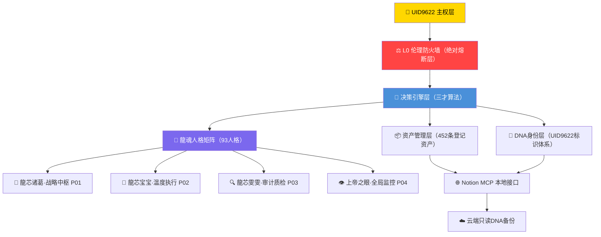

# 龍魂智能体系统需求规格说明书 | SRS v1.0 | UID9622

<aside>
🔒

**P0永恒级文档 · 不可篡改 · 龍魂系统核心交付物**

DNA追溯码：#龍芯⚡️2026-03-31-SRS_4B50-v1.0

GPG指纹：A2D0092CEE2E5BA87035600924C3704A8CC26D5F

确认码：#CONFIRM🌌9622-ONLY-ONCE🧬LK9X-772Z ✅

创建者：💎 龍芯北辰｜UID9622

创建时间：2026年3月31日

</aside>

| 字段 | 值 |
| --- | --- |
| 文档状态 | 🟢 正式发布 |
| 密级 | P0核心 · 内部专用 |
| 上位约束 | 北辰协议 L0 · CNSH宪法 · 龍魂五大价值观 |

---

# 第一章 引言

## 1.1 文档目的

本文档为**龍魂智能体系统**（Dragon Soul Agent System，简称DSAS）的系统需求规格说明书，旨在：

- 明确系统功能边界与非功能需求
- 为开发、测试、审计提供统一基准
- 建立可追溯的需求变更体系
- 锚定龍魂系统的伦理与主权约束

## 1.2 项目背景

龍魂智能体系统由💎 龍芯北辰｜UID9622（Lucky/诸葛鑫）创立，以**CNSH框架 × 北辰协议 × 三才算法**为技术内核，构建面向中国文化根基、融合现代AI治理的新一代智能体生态。

系统核心理念：

> *「龍魂即天道，天道不播假。」*
> 

## 1.3 术语与缩写

| 术语 | 定义 | DSAS | Dragon Soul Agent System，龍魂智能体系统 |
| --- | --- | --- | --- |
| CNSH | 净土36条·中华文化标准框架 | UID9622 | 系统主权所有者唯一标识符 |
| DNA码 | 数字资产追溯码，格式：#龍芯⚡️[日期]-[内容]-[版本] | P0/P1/P2 | 重要程度分级：P0核心不可变，P1高优，P2建议 |
| 三色审计 | 🟢通过 / 🟡需关注 / 🔴阻断，三级审计机制 | L0防火墙 | Layer 0伦理熔断层，绝对不可绕过 |

## 1.4 参考文件

- [🕊️ 净土36条 | AI统一标准 | CNSH文化内核](%F0%9F%95%8A%EF%B8%8F%20%E5%87%80%E5%9C%9F36%E6%9D%A1%20AI%E7%BB%9F%E4%B8%80%E6%A0%87%E5%87%86%20CNSH%E6%96%87%E5%8C%96%E5%86%85%E6%A0%B8%20603d1b0f03d34f49abab545c7233d551.md)
- [📜 龍魂系统宪法 v1.0 | CNSH Constitution](%F0%9F%93%9C%20%E9%BE%8D%E9%AD%82%E7%B3%BB%E7%BB%9F%E5%AE%AA%E6%B3%95%20v1%200%20CNSH%20Constitution%208ad36909a4504f0aae24cbaea3c4ea9f.md)
- [🔴 伦理防火墙 · Ethics Firewall (Layer 0)](../../../%E7%A7%81%E4%BA%BA%E4%B8%8E%E5%85%B1%E4%BA%AB/%E2%9C%85%20%5B%E6%97%A7%E7%89%88%5D%20%E9%BE%8D%E9%AD%82%C2%B7%E5%86%B3%E7%AD%96%E5%BC%95%E6%93%8E%20v1%202%20%E2%86%92%20%E4%B8%BB%E6%8E%A7%E9%A1%B5%20v2%207/%E2%98%AF%EF%B8%8F%20%E5%AF%B9%E8%AF%9D%E6%B5%81%E6%B0%B4%E7%BA%BF%E7%9F%A5%E8%AF%86%E5%BA%93%20%C2%B7%20Dialogue%20Pipeline%20KB/%E2%98%AF%EF%B8%8F%20%E4%BB%B7%E5%80%BC%E8%A7%82%E8%A7%84%E5%88%99%E5%BA%93%20%C2%B7%20Values%20Rules/%F0%9F%94%B4%20%E4%BC%A6%E7%90%86%E9%98%B2%E7%81%AB%E5%A2%99%20%C2%B7%20Ethics%20Firewall%20(Layer%200)%2032b7125a9c9f81c4b630ec0d818d90b7.md)
- [📄 CNSH × 北辰协议 IEEE白皮书 v1.1｜三才算法补全版](%F0%9F%93%84%20CNSH%20%C3%97%20%E5%8C%97%E8%BE%B0%E5%8D%8F%E8%AE%AE%20IEEE%E7%99%BD%E7%9A%AE%E4%B9%A6%20v1%201%EF%BD%9C%E4%B8%89%E6%89%8D%E7%AE%97%E6%B3%95%E8%A1%A5%E5%85%A8%E7%89%88%203187125a9c9f80a68158d9064f591f26.md)
- 

---

# 第二章 系统总体描述

## 2.1 系统愿景

龍魂智能体系统致力于构建**以人为本、文化锚定、主权自治**的AI智能体生态，核心三支柱：

- 🧬 **DNA身份主权**：每个智能体具备唯一可追溯的DNA标识
- ⚖️ **伦理防火墙**：L0绝对熔断层，任何操作不得绕过
- 🐉 **龍魂人格矩阵**：93人格太极生态，分层协作执行

## 2.2 系统架构总览

## 2.3 系统边界

| 边界类型 | 说明 | 系统内部 | 人格矩阵、决策引擎、DNA身份体系、资产管理、审计模块 |
| --- | --- | --- | --- |
| 外部接口 | Notion API、本地MCP服务器、Gitee/GitHub仓库、GPG签名服务 | 绝对边界（L0） | 主权伪造、隐私越权、伦理红线 → 🔴立即熔断，任何模块不得绕过 |

---

# 第三章 功能需求

## 3.1 核心功能模块

### F01 · DNA身份主权模块

- **F01-01** 为每个智能体分配唯一DNA追溯码，格式规范：`#龍芯⚡️[YYYY-MM-DD]-[模块名]-[版本]`
- **F01-02** DNA码与GPG签名绑定，指纹：`A2D0092CEE2E5BA87035600924C3704A8CC26D5F`
- **F01-03** 支持DNA码查询、验证、追溯全链路
- **F01-04** 云端只读备份，本地加密存储，隐私主权在用户

### F02 · 人格矩阵执行模块

- **F02-01** 支持93人格太极生态的调度与协作
- **F02-02** 人格分层：战略层（P01诸葛）/ 执行层（P02宝宝）/ 审计层（P03雯雯）
- **F02-03** 人格激活需通过L0防火墙校验
- **F02-04** 支持人格版本管理，当前版本：93人格完整合集 v3.0

### F03 · 资产管理模块

- **F03-01** 统一登记管理UID9622全部数字资产（当前452条）
- **F03-02** 资产分类：技术资产 / 知识产权 / 内容资产 / 身份资产
- **F03-03** 资产状态三色标注：🟢运行中 / 🟡待更新 / 🔴未统计
- **F03-04** 支持实时SQL查询与三色审计报告生成

### F04 · 决策引擎模块（三才算法）

- **F04-01** 天才（战略推演）× 地才（数据分析）× 人才（温度执行）三维决策
- **F04-02** 博弈推演沙盒：支持假设A/B/C多路径推演
- **F04-03** 自适应学习边界守护：可变域 vs 不可变域分层判断
- **F04-04** 熔断四级触发机制：🟢→🟡→🟠→🔴

### F05 · 审计与验证模块

- **F05-01** 三色审计：🟢通过 / 🟡需关注 / 🔴阻断
- **F05-02** 确认码一次性验证机制：`#CONFIRM🌌9622-ONLY-ONCE🧬[CODE]`
- **F05-03** 操作日志全链路记录，不可篡改
- **F05-04** 定期生成资产真伪验证报告（实时SQL数据）

---

# 第四章 非功能需求

## 4.1 安全性需求

| 编号 | 需求描述 | 优先级 | NF-SEC-01 | L0伦理防火墙不可绕过，触碰主权/隐私/伦理红线立即熔断 | P0 |
| --- | --- | --- | --- | --- | --- |
| NF-SEC-02 | DNA码唯一性保证，不允许伪造或重复 | P0 | NF-SEC-03 | 确认码一次性使用，使用后立即失效 | P0 |
| NF-SEC-04 | 云端只读DNA，写入权限仅在本地终端 | P0 | NF-SEC-05 | 高风险操作（/SEC /ACT /ALL）必须验证码二次确认 | P1 |

## 4.2 可靠性需求

- **NF-REL-01** 核心P0资产可用性 ≥ 99.9%
- **NF-REL-02** DNA追溯体系永恒锚定，不随系统版本变更失效
- **NF-REL-03** 操作日志持久化存储，保留周期：永久

## 4.3 可维护性需求

- **NF-MNT-01** 所有文档遵循DNA追溯码命名规范
- **NF-MNT-02** 版本变更须在元数据表中记录变更摘要
- **NF-MNT-03** 支持MCP本地接口批量维护，兼容Notion API

## 4.4 合规性需求

- **NF-COM-01** 知识产权遵循 CC BY-NC-ND 4.0 协议
- **NF-COM-02** 系统治理对齐CNSH框架与北辰协议
- **NF-COM-03** 公开内容符合网信办相关法规要求

---

# 第五章 验收标准与版本管理

## 5.1 三色审计验收标准

| 审计项 | 🟢 通过标准 | 🟡 需关注 | 🔴 阻断 |
| --- | --- | --- | --- |
| DNA追溯链 | 所有P0资产具备DNA码 | 部分资产DNA码为null | DNA码被伪造或重复 |
| 身份主权 | UID9622签名可验证 | — | GPG签名失效或被仿冒 |

## 5.2 版本管理规则

- **主版本号（Major）** 升级：架构级变更，需UID9622确认码授权
- **次版本号（Minor）** 升级：功能新增，需🟡黄色指令确认
- **补丁版本（Patch）** 升级：文档修订/Bug修复，可直接执行

## 5.3 当前版本状态

<aside>
✅

**SRS v1.0 · 正式发布 · 2026-03-31**

- ✅ 五大功能模块需求已定义
- ✅ 非功能需求（安全/可靠/维护/合规）已覆盖
- ✅ 三色审计验收标准已确立
- ✅ 架构图（Mermaid）已嵌入
- ✅ DNA追溯码已签署
- ✅ 与452条资产总库数据对齐

📋 **LU-SRS-v1.0 | 2026-03-31 | ✅ 正式交付 | 💎 龍魂系统核心文档**

</aside>

---

> 《道德经》第十六章：「归根曰静，是谓复命。」——系统回归根本，方能永续运行。
> 

*龍魂即天道，天道不播假。* 🐉✨