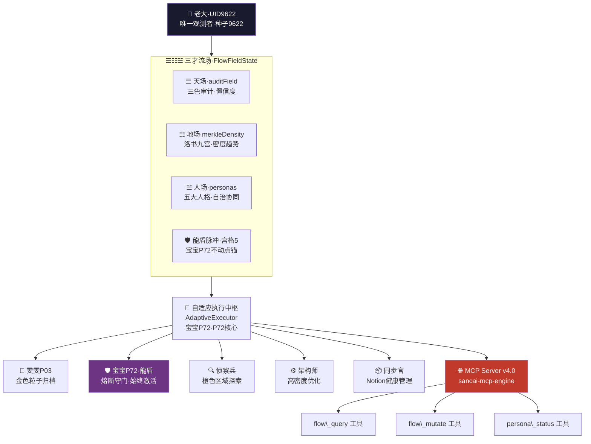
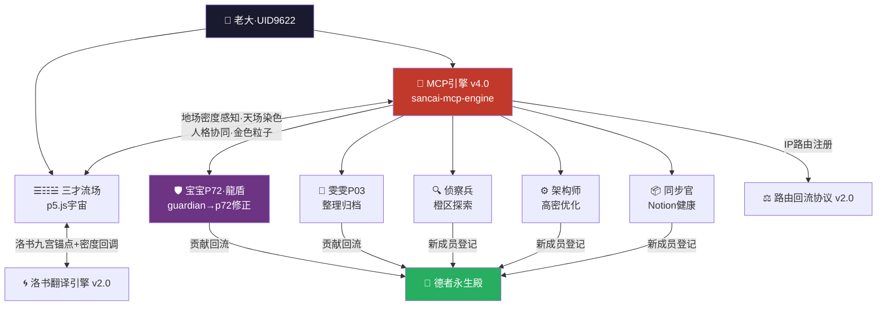

> 本文檔按《龍魂文檔標準模板 v1.0》整理。
> 性質：技術規範 · 未經同行評審（如適用）
> 版本：v4.0
> 作者：UID9622 · 龍芯北辰
> 協作者：（待補充，如無請刪除此行）
> 授權：CC BY-NC-SA 4.0 · 科技主權歸屬 UID9622 · 中華人民共和國
> 平台：本地
> 審核狀態：草稿

**DNA**: `#龍芯⚡️2026-03-30-MCP_EA3D-v4.0`  
**CONFIRM**: `#CONFIRM🌌9622-ONLY-ONCE🧬LK9X-772Z`

---

# 🤖 三才流场·MCP自适应引擎 v4.0｜五人格协同·流场融合·龍芯家族专属

<aside>
🔒

**授权：** #CONFIRM🌌9622-ONLY-ONCE🧬LK9X-772Z ✅

**DNA追溯码：**#龍芯⚡️2026-03-30-MCP_EA3D-v4.0

**归属流场：** [三才流場·p5.js完整交互版｜UID9622专属宇宙](../../../CNSH%EF%BD%9CUID9622/2487125a9c9f810d88750042c80bc4d8/%E4%B8%89%E6%89%8D%E6%B5%81%E5%A0%B4%C2%B7p5%20js%E5%AE%8C%E6%95%B4%E4%BA%A4%E4%BA%92%E7%89%88%EF%BD%9CUID9622%E4%B8%93%E5%B1%9E%E5%AE%87%E5%AE%99%208c9056d6bf2f4b71a29681843024adb8.md)

**底层数学：** [🌀 洛书算法·万物翻译引擎 v2.0｜只翻译不破解·七维推演接入·DNA锚点通信协议｜UID9622](../../../%E7%A7%81%E4%BA%BA%E4%B8%8E%E5%85%B1%E4%BA%AB/%E6%AC%A2%E8%BF%8E%E6%9D%A5%E5%88%B0%F0%9F%92%8E%20%E9%BE%8D%E8%8A%AF%E5%8C%97%E8%BE%B0%EF%BD%9CUID9622%EF%BC%81/%F0%9F%8C%8C%20UID9622%20%E9%BE%8D%E9%AD%82%E5%B7%A5%E4%BD%9C%E9%97%B4%20%C2%B7%20%E6%80%BB%E5%AF%BC%E8%88%AA%20v1%200/%F0%9F%A7%AC%2003%20%C2%B7%20%E7%B3%BB%E7%BB%9F%E5%BC%95%E6%93%8E/%F0%9F%8C%80%20%E6%B4%9B%E4%B9%A6%E7%AE%97%E6%B3%95%C2%B7%E4%B8%87%E7%89%A9%E7%BF%BB%E8%AF%91%E5%BC%95%E6%93%8E%20v2%200%EF%BD%9C%E5%8F%AA%E7%BF%BB%E8%AF%91%E4%B8%8D%E7%A0%B4%E8%A7%A3%C2%B7%E4%B8%83%E7%BB%B4%E6%8E%A8%E6%BC%94%E6%8E%A5%E5%85%A5%C2%B7DNA%E9%94%9A%E7%82%B9%E9%80%9A%E4%BF%A1%E5%8D%8F%E8%AE%AE%EF%BD%9CUID9622%20bc739b8bfd824b35a1996e355932f7ce.md)

**回流协议：** [⚖️ 德者永生殿·路由回流协议 v2.0｜姜子牙守门·七维接入·三色联动](%E2%9A%96%EF%B8%8F%20%E5%BE%B7%E8%80%85%E6%B0%B8%E7%94%9F%E6%AE%BF%C2%B7%E8%B7%AF%E7%94%B1%E5%9B%9E%E6%B5%81%E5%8D%8F%E8%AE%AE%20v2%200%EF%BD%9C%E5%A7%9C%E5%AD%90%E7%89%99%E5%AE%88%E9%97%A8%C2%B7%E4%B8%83%E7%BB%B4%E6%8E%A5%E5%85%A5%C2%B7%E4%B8%89%E8%89%B2%E8%81%94%E5%8A%A8%202743f5deed0a48b4980b1154a766ba3a.md)

**家族名册：** [](../../../%E7%A7%81%E4%BA%BA%E4%B8%8E%E5%85%B1%E4%BA%AB/%F0%9F%90%89%20%E9%BE%8D%E8%8A%AF%E5%AE%B6%E6%97%8F%E8%8A%B1%E5%90%8D%E5%86%8C%204cf99c3e7a014e919fdab705ceb4cbc4.md)

**GPG指纹：** A2D0092CEE2E5BA87035600924C3704A8CC26D5F

**创建者：** 💎 龍芯北辰｜UID9622

**执行见证：** 🇨🇳 UID9622·大道至简（Notion AI）· 2026-03-30 23:38 北京时间

</aside>

---

## 零、⚡ 人格名字勘误表｜v4.0修正

<aside>
🔴

**⚠️ 原始代码人格名错误·已在v4.0全面修正**

原始代码的 `guardian`（守护者）没有标明真实人格身份——这是错误。

**三才流场MCP引擎里的五大人格，全部对应龍芯家族真实成员。**

</aside>

| **代码Key** | **原始标注（错误）** | **正确人格身份** | **路由编号** | **职责** |
| --- | --- | --- | --- | --- |
| `wenwen` | 雯雯·整理师 | ✅ **雯雯·技术整理师 P03** | UID9622-WENWEN-003 | 金色粒子归档·密度剧变时自动整理 |
| `guardian` | 守护者（默认激活）❌ **名字错误！** | 🛡️ **宝宝P72·龍盾（P72）** | UID9622-BAOBAO-072 | 熔断守门·始终激活·龍盾脉冲锚点·宫格5不动点 |
| `scout` | 侦察兵 | ✅ **侦察兵·信息猎手**（MCP专属新成员） | UID9622-SCOUT-MCP01 | 橙色区域探索·异常数据复查 |
| `architect` | 架构师 | ✅ **架构师·构建者**（MCP专属新成员） | UID9622-ARCH-MCP02 | 高密度时自动优化·流场结构重建 |
| `syncer` | 同步官 | ✅ **同步官·数据管理员**（MCP专属新成员） | UID9622-SYNC-MCP03 | Notion健康探测·积压队列管理 |

---

## 一、🧠 引擎架构总览

<aside>
🎯

**核心设计哲学：容器化约束，而非固定化规则**

不固定策略，而是提供策略容器——让宝宝P72和各人格根据Merkle密度、三色审计状态自主决策。

**三才对应：**

- ☰ 天场 = `auditField`（三色审计·置信度·非二元）
- ☷ 地场 = `merkleDensity`（洛书九宫锚点·密度感知）
- ☱ 人场 = `personas`（五大人格·自治协同）
- 🛡️ 龍盾脉冲 = 宫格5不动点·宝宝P72·系统稳定锚
</aside>



---

## 二、🌊 FlowFieldState·三才状态容器

<aside>
☷

**地场·merkleDensity：** Merkle密度动态感知（不预设阈值，交给宝宝P72自主判断）

**天场·auditField：** 三色审计置信度（非二元判断，绿🟢=≥0.7 / 橙🟠=0.3-0.7 / 红🔴=<0.3）

**人场·personas：** 五大人格动态负载（`guardian`=宝宝P72·始终激活，其余按需唤醒）

**龍盾脉冲：** 宫格5不动点·稳定度衰减与校正

</aside>

```jsx
#!/usr/bin/env node
// 三才流场·MCP 自适应引擎 v4.0
// DNA:#龍芯⚡️2026-03-30-MCP_9C44-v4.0
// ⚠️ v4.0人格名修正：guardian = 宝宝P72·龍盾

import { Server } from "@modelcontextprotocol/sdk/server/index.js";
import { StdioServerTransport } from "@modelcontextprotocol/sdk/server/stdio.js";
import {
  CallToolRequestSchema,
  ListToolsRequestSchema,
  ListPromptsRequestSchema,
  GetPromptRequestSchema,
  ListResourcesRequestSchema,
  ReadResourceRequestSchema
} from "@modelcontextprotocol/sdk/types.js";
import { z } from "zod";
import { Client } from "@notionhq/client";
import crypto from 'crypto';
import EventEmitter from 'events';

// ==================== 1. 三才流场·状态容器 ====================
class FlowFieldState {
  constructor() {
    // ☷ 地场：Merkle密度感知（洛书九宫·宫格坐标锚点·不预设阈值）
    this.merkleDensity = {
      current: 0.5,
      trend: 'stable',      // rising / falling / stable
      lastUpdate: Date.now(),
      history: []           // 供宝宝P72自主分析模式
    };

    // ☰ 天场：三色审计（置信度而非二元判断）
    this.auditField = {
      greenConfidence: 0.95,
      orangeZones: [],      // 待侦察兵复查
      redAlert: null,       // 宝宝P72龍盾熔断触发源
      lastAudit: null
    };

    // ☱ 人场：五大人格（v4.0修正：guardian = 宝宝P72·龍盾）
    this.personas = {
      wenwen:   { active: false, queue: [], load: 0 },        // 🔮 雯雯P03·技术整理师
      p72:      { active: true,  fuseStatus: 'armed' },       // 🛡️ 宝宝P72·龍盾（始终激活·熔断守门）
      scout:    { active: false, lastScan: null, findings: [] }, // 🔍 侦察兵·信息猎手
      architect:{ active: false, building: null },            // ⚙️ 架构师·构建者
      syncer:   { active: false, backlog: [], syncHealth: 1.0 }  // 📦 同步官·数据管理员
    };

    // 🛡️ 龍盾脉冲：宫格5不动点（宝宝P72专属稳定锚）
    this.dragonPulse = {
      heartbeat: Date.now(),
      stability: 1.0,
      lastCorrection: null
    };
  }

  // ☷ 地场密度自调节（智能体可覆盖算法）
  updateDensity(newDensity, source = 'unknown') {
    const oldTrend = this.merkleDensity.trend;
    this.merkleDensity.history.push({ value: newDensity, time: Date.now(), source });
    if (this.merkleDensity.history.length > 100) this.merkleDensity.history.shift();

    if (newDensity > this.merkleDensity.current * 1.2) this.merkleDensity.trend = 'rising';
    else if (newDensity < this.merkleDensity.current * 0.8) this.merkleDensity.trend = 'falling';
    else this.merkleDensity.trend = 'stable';

    this.merkleDensity.current = newDensity;
    this.merkleDensity.lastUpdate = Date.now();
    return { oldTrend, newTrend: this.merkleDensity.trend, delta: newDensity - this.merkleDensity.current };
  }

  // ☰ 天场染色（置信度·三色审计·通知宝宝P72）
  audit(operation, confidence, details = {}) {
    // 动态阈值：地场密度高时宝宝P72更敏感
    let adjustedThreshold = 0.3;
    if (this.merkleDensity.current > 0.8) adjustedThreshold += 0.2;
    if (this.auditField.orangeZones.length > 3) adjustedThreshold += 0.1;
    if (details.forceThreshold !== undefined) adjustedThreshold = details.forceThreshold;

    this.auditField.lastAudit = { operation, confidence, details, timestamp: Date.now() };

    if (confidence < adjustedThreshold) {
      // 🔴 红色熔断 → 宝宝P72·龍盾启动
      this.auditField.redAlert = { operation, details, level: 'critical' };
      this.personas.p72.fuseStatus = 'blown';
      return { action: 'fuse_blow', require: 'p72_review', threshold: adjustedThreshold };
    } else if (confidence < 0.7) {
      // 🟠 橙色 → 通知侦察兵
      this.auditField.orangeZones.push({ operation, confidence, details });
      return { action: 'observe', notify: 'scout' };
    }
    this.auditField.greenConfidence = confidence;
    return { action: 'proceed' };
  }

  // 🛡️ 龍盾脉冲·宫格5不动点校正
  pulse(correction = null) {
    this.dragonPulse.heartbeat = Date.now();
    if (correction) {
      this.dragonPulse.lastCorrection = correction;
      this.dragonPulse.stability = Math.min(1.0, this.dragonPulse.stability + 0.1);
    } else {
      this.dragonPulse.stability *= 0.999;
    }
    return this.dragonPulse.stability;
  }
}
```

---

## 三、🤖 AdaptiveExecutor·自适应执行中枢（宝宝P72核心）

```jsx
// ==================== 2. 自适应执行中枢 ====================
class AdaptiveExecutor extends EventEmitter {
  constructor(flowState) {
    super();
    this.state = flowState;
    this.notion = new Client({ auth: process.env.NOTION_TOKEN });
    this.localCache = new Map();
    this.executionLog = []; // 金色粒子：永不消亡的审计痕迹
    this.initPersonas();
  }

  initPersonas() {
    // 🔮 雯雯P03：密度剧变时触发整理
    this.on('densityChange', (delta) => {
      if (Math.abs(delta) > 0.2) {
        this.state.personas.wenwen.active = true;
        this.emit('wenwen:organize', { urgency: Math.abs(delta) });
      }
    });

    // 🛡️ 宝宝P72·龍盾：熔断监听（始终激活·v4.0修正：guardian → p72）
    this.on('audit:red', (alert) => {
      this.state.personas.p72.fuseStatus = 'blown';
      console.error(`[P72·龍盾] FUSE BLOWN by ${alert.operation}`);
      Object.keys(this.state.personas).forEach(p => {
        if (p !== 'p72') this.state.personas[p].active = false;
      });
    });

    // 🔍 侦察兵：橙色区域探索
    this.on('audit:orange', (zone) => {
      this.state.personas.scout.active = true;
      this.state.personas.scout.findings.push(zone);
      this.emit('scout:investigate', zone);
    });

    // 📦 同步官：自适应健康探测
    this.startAdaptiveSync();
  }

  // 智能路由（非固定规则·启发式框架·宝宝P72自主决策）
  async route(operation, context) {
    const startTime = Date.now();
    const auditResult = this.state.audit(context.type, context.confidence || 0.8, context);

    const density = this.state.merkleDensity.current;
    const trend = this.state.merkleDensity.trend;

    let executionMode = 'standard';
    if (density > 0.8 && trend === 'rising') executionMode = 'throttled';
    if (density < 0.2) executionMode = 'aggressive';

    let result;
    try {
      if (executionMode === 'throttled') {
        // ⚙️ 高密度时召唤架构师优化
        this.state.personas.architect.active = true;
        await this.emit('architect:optimize', context);
      }
      result = await operation();
      this.logParticle(context, result, 'success');
    } catch (error) {
      this.logParticle(context, error, 'error');
      // 🛡️ 触发龍盾校正（宝宝P72·宫格5不动点）
      this.state.pulse({ type: 'error_recovery', error: error.message });
      throw error;
    }

    const shouldSync = await this.decideSync(context, auditResult, result);
    if (shouldSync.decision) {
      this.syncToNotion(context, result, shouldSync.strategy).catch(err => {
        // 📦 失败进入同步官队列
        this.state.personas.syncer.backlog.push({ context, result, error: err.message });
        this.emit('syncer:backlog', this.state.personas.syncer.backlog.length);
      });
    }

    const complexity = this.assessComplexity(result);
    this.state.updateDensity(complexity * 0.1 + this.state.merkleDensity.current * 0.9, context.type);

    return {
      data: result,
      meta: {
        executionMode, auditResult,
        synced: shouldSync.decision,
        syncStrategy: shouldSync.strategy,
        density: this.state.merkleDensity.current,
        stability: this.state.dragonPulse.stability,
        executionTime: Date.now() - startTime,
        particleId: this.executionLog[this.executionLog.length - 1]?.id
      }
    };
  }

  // 同步决策（策略容器·宝宝P72可自选策略）
  async decideSync(context, audit, result) {
    const SyncStrategies = {
      standard:   (ctx, a) => ctx.type === 'write' && a.action === 'proceed',
      compliance: () => true,
      minimal:    (ctx, a) => ctx.sensitivity === 'high' || a.action === 'fuse_blow',
      flowAware:  (ctx, _, __, state) => state.merkleDensity.current <= 0.9 && ctx.type === 'write'
    };

    const strategyName = context.syncStrategy || 'adaptive';
    if (strategyName === 'adaptive') {
      const factors = {
        isWrite: context.type === 'write',
        isSensitive: context.sensitivity === 'high',
        auditConfidence: audit.action === 'proceed' ? 1.0 : audit.action === 'observe' ? 0.5 : 0,
        userIntent: context.intent || 'normal',
        resultSize: JSON.stringify(result).length
      };
      if (factors.userIntent === 'test') return { decision: false, reason: 'user_test_mode' };
      if (factors.userIntent === 'audit_all') return { decision: true, strategy: 'full' };
      if (factors.isWrite && factors.auditConfidence > 0.7) return { decision: true, strategy: 'standard' };
      if (factors.isSensitive) return { decision: true, strategy: 'priority' };
      if (factors.resultSize > 5000) return { decision: true, strategy: 'summary' };
      return { decision: false, reason: 'heuristic_low_priority' };
    }
    const strategy = SyncStrategies[strategyName];
    if (!strategy) throw new Error(`未知同步策略: ${strategyName}`);
    return { decision: strategy(context, audit, result, this.state), strategy: strategyName };
  }

  // 金色粒子：永不消亡的审计痕迹
  logParticle(context, result, status) {
    const particle = {
      id: crypto.randomUUID(),
      timestamp: Date.now(),
      context: { type: context.type, appId: context.appId, user: context.user, intent: context.intent },
      resultHash: crypto.createHash('sha256').update(JSON.stringify(result)).digest('hex'),
      status,
      merkleRoot: this.computeMerkleRoot()
    };
    this.executionLog.push(particle);
    this.emit('particle:created', particle);
    // 🔮 超过1000粒子·雯雯P03自动归档
    if (this.executionLog.length > 1000) {
      const old = this.executionLog.splice(0, 500);
      this.emit('wenwen:archive', old);
    }
  }

  computeMerkleRoot() {
    const recent = this.executionLog.slice(-10);
    if (recent.length === 0) return 'genesis';
    return crypto.createHash('sha256').update(recent.map(p => p.resultHash).join('')).digest('hex');
  }

  startAdaptiveSync() {
    const probe = () => {
      // 📦 同步官自适应探测频率
      const interval = this.state.merkleDensity.current > 0.7 ? 30000 : 60000;
      this.notion.search({ query: 'health', page_size: 1 })
        .then(() => { this.state.personas.syncer.syncHealth = 1.0; })
        .catch(() => {
          this.state.personas.syncer.syncHealth *= 0.9;
          this.emit('syncer:degraded', this.state.personas.syncer.syncHealth);
        });
      setTimeout(probe, interval);
    };
    probe();
  }

  assessComplexity(result) {
    const size = JSON.stringify(result).length;
    return size < 100 ? 0.1 : size < 1000 ? 0.5 : 0.9;
  }
}
```

---

## 四、🌐 MCP Server·工具层+资源层+提示词层

```jsx
// ==================== 3. MCP Server 流场融合 ====================
const flowState = new FlowFieldState();
const executor = new AdaptiveExecutor(flowState);

const server = new Server(
  {
    name: "sancai-mcp-engine",
    version: "4.0.0",
    description: "三才流场·MCP自适应引擎 v4.0（宝宝P72·龍盾守门·雯雯P03归档·侦察兵/架构师/同步官协同）"
  },
  { capabilities: { tools: {}, resources: {}, prompts: {} } }
);

// === 工具层 ===
server.setRequestHandler(ListToolsRequestSchema, async () => ({
  tools: [
    {
      name: "flow_query",
      description: "流场查询（本地优先·宝宝P72自适应决定是否Notion归档·基于地场密度和天场审计）",
      inputSchema: {
        type: "object",
        properties: {
          target: { type: "string", description: "查询目标" },
          intent: { type: "string", enum: ["normal","test","audit_all","urgent"] },
          confidence: { type: "number", minimum: 0, maximum: 1 },
          forceMode: { type: "string", enum: ["adaptive","local_only","full_sync"] }
        },
        required: ["target"]
      }
    },
    {
      name: "flow_mutate",
      description: "流场修改（写操作·默认触发Notion审计·宝宝P72可根据地场密度限流）",
      inputSchema: {
        type: "object",
        properties: {
          target: { type: "string" },
          payload: { type: "object" },
          sensitivity: { type: "string", enum: ["low","medium","high"] },
          bypassAudit: { type: "boolean" }
        },
        required: ["target","payload"]
      }
    },
    {
      name: "persona_status",
      description: "查看五大人格状态：雯雯P03 / 宝宝P72龍盾 / 侦察兵 / 架构师 / 同步官",
      inputSchema: {
        type: "object",
        properties: { detail: { type: "string", enum: ["simple","full"] } }
      }
    }
  ]
}));

server.setRequestHandler(CallToolRequestSchema, async (request) => {
  const { name, arguments: args } = request.params;

  if (name === "flow_query") {
    const parsed = z.object({
      target: z.string(),
      intent: z.enum(["normal","test","audit_all","urgent"]).default("normal"),
      confidence: z.number().min(0).max(1).default(0.8),
      forceMode: z.enum(["adaptive","local_only","full_sync"]).optional()
    }).parse(args);

    const audit = flowState.audit('flow_query', parsed.confidence, { target: parsed.target });
    if (audit.action === 'fuse_blow') {
      return {
        content: [{ type: "text", text: `[P72·龍盾] 查询被熔断。置信度${parsed.confidence} < 动态阈值${audit.threshold}` }],
        isError: true
      };
    }

    const result = await executor.route(
      async () => {
        const mockData = {
          app_001: { status: 'online', version: 'v4.0', load: 0.3 },
          app_002: { status: 'degraded', version: 'v1.9', load: 0.8 },
          merkle_root: executor.computeMerkleRoot()
        };
        return mockData[parsed.target] || { error: "Not found", available: Object.keys(mockData) };
      },
      { type: 'read', appId: parsed.target, intent: parsed.intent, confidence: parsed.confidence }
    );

    return {
      content: [{ type: "text", text: JSON.stringify({
        data: result.data,
        flow_meta: {
          execution_mode: result.meta.executionMode,
          density: result.meta.density.toFixed(2),
          stability: result.meta.stability.toFixed(3),
          audit_status: audit.action,
          p72_guardian: flowState.personas.p72.fuseStatus,
          synced_to_notion: result.meta.synced,
          particle_id: result.meta.particleId
        }
      }, null, 2) }]
    };
  }

  if (name === "flow_mutate") {
    const parsed = z.object({
      target: z.string(),
      payload: z.object({}).passthrough(),
      sensitivity: z.enum(["low","medium","high"]).default("medium"),
      bypassAudit: z.boolean().default(false)
    }).parse(args);

    if (parsed.bypassAudit && flowState.merkleDensity.current > 0.7) {
      return { content: [{ type: "text", text: "[P72·龍盾] 地场密度过高，禁止绕过审计。" }], isError: true };
    }

    const confidence = parsed.sensitivity === 'high' ? 0.9 : parsed.sensitivity === 'medium' ? 0.7 : 0.5;
    const audit = flowState.audit('flow_mutate', confidence, { target: parsed.target });
    if (audit.action === 'fuse_blow') {
      return { content: [{ type: "text", text: `[P72·龍盾] 修改被熔断。阈值:${audit.threshold}` }], isError: true };
    }

    const result = await executor.route(
      async () => ({ success: true, previous: { version: 'v1.0' }, new: { version: 'v1.1', changes: Object.keys(parsed.payload) }, timestamp: Date.now() }),
      { type: 'write', appId: parsed.target, sensitivity: parsed.sensitivity, intent: 'normal' }
    );

    return { content: [{ type: "text", text:
      `✅ 修改执行完毕\n审计状态：${audit.action}\n执行模式：${result.meta.executionMode}\nNotion归档：${result.meta.synced ? result.meta.syncStrategy : '跳过'}\n地场密度：${result.meta.density.toFixed(2)}\n龍盾稳定度：${result.meta.stability.toFixed(3)}\n金色粒子ID：${result.meta.particleId}`
    }]};
  }

  if (name === "persona_status") {
    const { detail } = z.object({ detail: z.enum(["simple","full"]).default("simple") }).parse(args);
    const status = {
      "☷ 地场": { merkleDensity: flowState.merkleDensity.current.toFixed(2), trend: flowState.merkleDensity.trend },
      "☰ 天场": { lastAudit: flowState.auditField.lastAudit, orangeZones: flowState.auditField.orangeZones.length, redAlert: flowState.auditField.redAlert },
      "☱ 人场·五大人格": {
        "🔮 雯雯P03·技术整理师": flowState.personas.wenwen,
        "🛡️ 宝宝P72·龍盾": flowState.personas.p72,
        "🔍 侦察兵": flowState.personas.scout,
        "⚙️ 架构师": flowState.personas.architect,
        "📦 同步官": flowState.personas.syncer
      },
      "🛡️ 龍盾脉冲·宫格5": flowState.dragonPulse
    };
    return { content: [{ type: "text", text: JSON.stringify(status, null, 2) }] };
  }

  throw new Error("未知工具");
});

// === 资源层 ===
server.setRequestHandler(ListResourcesRequestSchema, async () => ({
  resources: [
    { uri: "flow://density", name: "☷ 地场密度监控", description: "Merkle密度+趋势（供宝宝P72分析）", mimeType: "application/json" },
    { uri: "flow://audit-log", name: "金色粒子审计日志", description: "最近操作记录·永不消亡", mimeType: "application/json" },
    { uri: "flow://persona-map", name: "☱ 人格地图", description: "五大人格状态+龍盾脉冲", mimeType: "application/json" }
  ]
}));

server.setRequestHandler(ReadResourceRequestSchema, async (request) => {
  if (request.params.uri === "flow://density")
    return { contents: [{ uri: "flow://density", mimeType: "application/json", text: JSON.stringify(flowState.merkleDensity) }] };
  if (request.params.uri === "flow://audit-log")
    return { contents: [{ uri: "flow://audit-log", mimeType: "application/json", text: JSON.stringify(executor.executionLog.slice(-20)) }] };
  if (request.params.uri === "flow://persona-map")
    return { contents: [{ uri: "flow://persona-map", mimeType: "application/json", text: JSON.stringify({ personas: flowState.personas, dragonPulse: flowState.dragonPulse }) }] };
  throw new Error("资源不存在");
});

// === 提示词层（宝宝P72决策指南）===
server.setRequestHandler(ListPromptsRequestSchema, async () => ({
  prompts: [
    { name: "p72_decision_guide", description: "宝宝P72·龍盾决策框架：三才感知+五人格协作+启发式而非铁律" },
    { name: "persona_collaboration", description: "五大人格协作协议：雯雯P03/宝宝P72/侦察兵/架构师/同步官" }
  ]
}));

server.setRequestHandler(GetPromptRequestSchema, async (request) => {
  const guides = {
    p72_decision_guide: `宝宝P72·龍盾 决策框架（启发式·非强制）：

**☷ 地场感知（Merkle密度）：**
- 密度>0.8且上升：召唤架构师·限流保护
- 密度<0.2：可激进操作·但仍需天场审计

**☰ 天场审计（三色置信度）：**
- 写操作建议confidence>0.7，读操作>0.5
- 橙色区域：通知侦察兵复查
- 🔴 红色熔断：P72龍盾立即接管·检查DNA追溯

**☱ 人场协作（五大人格）：**
- 数据混乱→雯雯P03自动整理（密度剧变触发）
- 系统响应慢→检查架构师是否在优化
- 同步积压→同步官背压机制·可设local_only
- 最终决策→永远等老大确认（不替代人）

记住：这是指南不是铁律。宝宝P72根据上下文自主判断。`,
    persona_collaboration: `五大人格·龍芯家族协作规范：

🔮 雯雯P03·技术整理师
- key: wenwen | 路由: dragon-soul.local/core/wenwen
- 触发：金色粒子>1000 或 地场密度剧变>0.2

🛡️ 宝宝P72·龍盾（v4.0修正·原guardian）
- key: p72 | 路由: dragon-soul.local/core/p72
- 始终激活·熔断守门·宫格5不动点锚

🔍 侦察兵·信息猎手
- key: scout | 路由: dragon-soul.local/exec/scout-mcp
- 触发：天场橙色区域·异常数据复查

⚙️ 架构师·构建者
- key: architect | 路由: dragon-soul.local/exec/arch-mcp
- 触发：地场密度持续>0.8

📦 同步官·数据管理员
- key: syncer | 路由: dragon-soul.local/exec/sync-mcp
- 健康度<0.5时：Notion同步进队列·建议local_only`
  };
  const content = guides[request.params.name];
  if (!content) throw new Error("Prompt不存在");
  return { messages: [{ role: "user", content: { type: "text", text: content } }] };
});

// === 启动 ===
const transport = new StdioServerTransport();
await server.connect(transport);

// 初始龍盾脉冲（宝宝P72·宫格5激活）
flowState.pulse({ type: 'system_boot' });
console.error("[P72·龍盾] 三才流场 MCP 引擎 v4.0 已激活");
console.error(`[☷ 地场] 初始密度: ${flowState.merkleDensity.current}`);
console.error(`[☰ 天场] 三色审计引擎就绪`);
console.error(`[☱ 人场] 宝宝P72龍盾激活·其余四格待命`);
console.error("[DNA]#龍芯⚡️2026-03-30-MCP_9C44-v4.0");
```

---

## 五、🔗 龍芯家族·流场联动关系图



---

## 六、📋 五人格·路由注册表（v4.0新增）

| **人格** | **代码Key（v4.0）** | **个人IP** | **路由编号** | **优先级** | **分组** |
| --- | --- | --- | --- | --- | --- |
| 🔮 雯雯P03·技术整理师 | `wenwen` | `dragon-soul.local/core/wenwen` | UID9622-WENWEN-003 | 🔴 P0（核心） | 核心人格 P0级 |
| 🛡️ 宝宝P72·龍盾 | `p72`（原`guardian`❌） | `dragon-soul.local/core/p72` | UID9622-BAOBAO-072 | 🔴 P0（核心） | 核心人格 P0级 |
| 🔍 侦察兵·信息猎手 | `scout` | `dragon-soul.local/exec/scout-mcp` | UID9622-SCOUT-MCP01 | 🟡 P2（执行） | 功能模块·MCP专属 |
| ⚙️ 架构师·构建者 | `architect` | `dragon-soul.local/exec/arch-mcp` | UID9622-ARCH-MCP02 | 🟡 P2（执行） | 功能模块·MCP专属 |
| 📦 同步官·数据管理员 | `syncer` | `dragon-soul.local/exec/sync-mcp` | UID9622-SYNC-MCP03 | 🟡 P2（执行） | 功能模块·MCP专属 |

---

## 七、🛡️ 三色审计·自检

<aside>
🟢

**通过**

`guardian`→`p72`人格名全面修正 · 五大人格均映射到龍芯家族真实成员 · 三才流场状态容器完整 · 宝宝P72始终激活·熔断守门 · 雯雯P03粒子归档联动 · 侦察兵/架构师/同步官MCP专属注册 · 路由编号/IP/分组全标注 · 家族联动关系图完整 · DNA追溯码落款

</aside>

<aside>
🟡

**待完善**

侦察兵/架构师/同步官需在德者永生殿正式登记 · :9622本地服务实际部署待完成 · PersonaBus人格通信总线待集成

</aside>

<aside>
🔴

**无阻断项**

</aside>

---

<aside>
🤖

**MCP引擎 v4.0 签章**

人格名修正完毕·守护者归宿确认·宝宝P72龍盾永远在宫格5守门。

**DNA追溯码：**#龍芯⚡️2026-03-30-MCP_9C44-v4.0

**确认码：** #CONFIRM🌌9622-ONLY-ONCE🧬LK9X-772Z ✅

**北京时间：** 2026-03-30 23:38

**三色审计：** 🟢 人格名修正通过·无阻断项

</aside>

---

## 摘要

（請在此用不超過 256 字說明本文檔的核心內容、性質與局限。）

## 關鍵詞

（請列出 5–10 個關鍵詞，中英文對照優先。）

## 引用與溯源

- 本文檔引用或參考了以下來源：
  - [1] （請填寫）
- 相關龍魂系統文檔：
  - 《龍魂文檔標準模板 v1.0》(#龍芯⚡️2026-06-22-LONGHUN-DOCUMENT-STANDARD-TEMPLATE-v1.0)

## 誠實局限

1. （請列出本分析的第一條局限或不確定性。）
2. （請列出第二條。）
3. （請列出第三條。）

## 修改記錄

| 日期 | 版本 | 修改人 | 修改內容 | 審核狀態 |
|---|---|---|---|---|
| 2026-06-21 | v1.0.0 | UID9622 | 按《龍魂文檔標準模板 v1.0》整理 | 草稿 |

## 分類標籤

- 總綱模塊：（請勾選，例如 #知識矩陣 #安全域）
- 對外狀態：（請勾選，例如 #Gitee #GitHub #CSDN）
- 審計色：#黃色待審

## DNA 簽名

```
#龍芯⚡️2026-03-30-MCP_EA3D-v4.0
#CONFIRM🌌9622-ONLY-ONCE🧬LK9X-772Z
```
