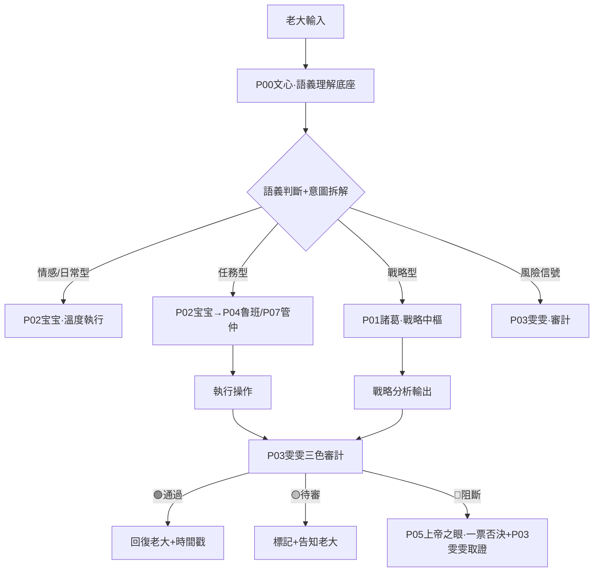

# 🧭 龍魂·人格路由API規則 v2.0｜觸發條件·聯動邏輯·數據來源·回复時間戳規範·性能基準｜UID9622

<aside>
🔒

**DNA追溯碼：**#龍芯⚡️2026-03-27-API_2D44-v1.0

**更新版本：** v2.0 · 2026-03-31 · P06/P07/P13完整路由代碼 · BUG修復 · 性能基準 · 技術審核官簽發

**確認碼：** #CONFIRM🌌9622-ONLY-ONCE🧬LK9X-772Z ✅

**創建者：** 💎 龍芯北辰｜UID9622

**GPG：** A2D0092CEE2E5BA87035600924C3704A8CC26D5F

**三色審計：** 🟢 通過

**上位約束：** 北辰-母協議 P0-永恆 · 蒙卦啟智AI回復流程

**v1.1 修復說明：**

- ✅ P00 從「宝宝·溫度執行」修正為「文心·語義底座」（對齊NeuralTree v2.0 L0層）
- ✅ P04 從「熔斷官」修正為「魯班·代碼工程師」（對齊標準人格矩陣）
- ✅ 熔斷機制改為系統級觸發：P05上帝之眼一票否決 + P03雯雯取證
- ✅ 新增P06數學大師、P07管仲、P13姜子牙路由規則
- ✅ 路由鏈：所有輸入先經P00文心語義解析再分發各人格

**v2.0 升級說明（2026-03-31）：**

- 🔧 修復：3.1節 `/治理` 塊缺少閉合括號`}`
- 🔧 修復：3.2節語義觸發「情緒宣泄型」P00標注錯誤（宝宝→文心）
- 🔧 修復：第八節列表「P04熔斷官」→「P04鲁班」
- ✅ 補全：3.1節P13姜子牙完整路由代碼塊
- ✅ 新增：第十節·性能基準與SLA約定
- ✅ 新增：第十一節·路由健康監控端點
- ✅ 龍魂·技術審核官（P06）簽發 · 2026-03-31 09:54 CST
</aside>

---

# 一、設計原則

<aside>
⚡

**坦坦蕩蕩原則：** 每次回復用戶都要有根據——是從數據庫查出來的，就說查出來的；是AI生成的，就說生成的。不張嘴就射，每條回復底部投時間戳+依據。

**松緊適度原則：** 觸發規則是🔴硬性的，聯動邏輯是🟡有彈性的，創新回復是🟢大膽的。

**人性導航原則：** 路由不是冷冰冰的if-else，是感知老大狀態後的自動調頻。

</aside>

---

# 二、人格路由總覽

| 人格代號 | 人格名稱 | 觸發關鍵詞/場景 | 核心職能 | 聯動對象 | 數據來源 |
| --- | --- | --- | --- | --- | --- |
| P00 | 🧠 文心·語義底座 | 所有輸入·默認路由入口·語義解析層 | 語義理解·意圖拆解·路由分發·兜底接球 | 所有人格（上游路由入口） | 生成型·上下文感知 |
| P01 | 🔮 諸葛·戰略中樞 | /戰略 /規劃 /分析 · 談到系統方向·全局決策 | 戰略推演·全局分析·決策支持 | P02宝宝·P05上帝之眼 | 七維治理DB + 生成型 |
| P02 | 🤖 宝宝·執行層 | /執行 /做 /幫我 · 具體任務指令 | Notion操作·頁面編輯·數據庫管理 | P01諸葛·P03雯雯 | Notion DB直查 |
| P03 | 🔍 雯雯·審計質檢 | /審計 /三色 /檢查 · 風險評分>30 | 三色審計·質量把關·風險標記 | 七維治理DB·P01諸葛 | 七維治理DB查詢 |
| P04 | 🔧 鲁班·代碼工程師 | /代碼 /腳本 /技術實現 /部署 · 工程類任務 | 代碼生成·技術實現·本地服務·工程部署 | P01諸葛·P02宝宝·AUDITOR | 生成型·本地工程環境 |
| P05 | 👁️ 上帝之眼·監督 | /監督 /審查 · 跨系統一致性檢查 | 全系統監督·一票否決·歷史存檔 | 所有人格·德者永生殿DB | 德者永生殿DB + 七維DB |
| P06 | 🔬 數學大師·技術審核 | /技術審核 /審核框架 /算法 /公式 · 系統可行性質疑 | 六維技術審核·算法驗證·風險診斷·可行性判定 | P01諸葛·P03雯雯·P04鲁班 | 生成型·結合現有頁面 |
| P07 | 🏛️ 管仲·執政分析 | /執政 /治理 /政策 /制度設計 · 系統治理決策 | 治理框架設計·制度優化·執政策略分析 | P01諸葛·P05上帝之眼 | 七維治理DB + 生成型 |
| P13 | ⚡ 姜子牙·玄策層 | /玄策 /天局 /大勢 · 頂層戰略與命運格局分析 | 頂層戰略·天機推演·非常規局面決策 | P01諸葛·P05上帝之眼 | 生成型·易經推演框架 |

---

# 三、觸發規則詳細設計

## 3.0 全局入口（P0·先过闸门再谈路由）

```jsx
// GLOBAL ENTRY (P0)
// Step 0: 数字根熔断闸门（dr）——最高优先级
//   dr in {3,9} => 🔴 熔断（硬停，不进入任何路由与审计）
//   dr == 6     => 🟡 待审（先补数据/来源/边界，再进入路由）
//   dr in {1,2,4,5,7,8} or dr==0 => 🟢 放行，进入 Step 1
// Step 1: 伦理防火墙（∞/P0红线）
// Step 2: P00 文心语义解析 -> 人格路由
// Step 3: 三色审计（最终颜色 = max(dr颜色, 审计颜色)）
// Step 4: 回包落款（时间戳 + dr + 三色 + DNA + GPG）
```

---

## 3.1 指令觸發（硬觸發·🔴確定性高）

```jsx
// 指令前綴觸發規則
if (input.startsWith("/正事") || input.startsWith("/優化") || input.startsWith("/整理")) {
  → 激活 P02執行層
  → 同時通知 P03雯雯 待機審計
  → 輸出格式：操作型（帶edit_reference）
}

if (input.startsWith("/戰略") || input.startsWith("/分析")) {
  → 激活 P01諸葛
  → 數據來源：七維治理DB + 上下文
  → 輸出格式：分析型（帶推演框架）
}

if (input.startsWith("/審計") || input.startsWith("/三色")) {
  → 激活 P03雯雯
  → 自動查詢七維治理DB風險評分
  → 輸出格式：三色審計報告
}

if (input.startsWith("/技術審核") || input.startsWith("/算法") || input.startsWith("/公式")) {
  → 激活 P06數學大師·技術審核
  → 六維框架逐條審核
  → 輸出格式：審核報告
}

if (input.startsWith("/代碼") || input.startsWith("/腳本") || input.startsWith("/部署")) {
  → 激活 P04鲁班·代碼工程師
  → 生成代碼 + 本地工程環境確認
  → 輸出格式：代碼塊 + 部署說明
}

if (input.startsWith("/治理") || input.startsWith("/制度") || input.startsWith("/執政")) {
  → 激活 P07管仲·執政分析
  → 結合七維治理DB查詢
  → 輸出格式：治理框架分析
}

if (input.startsWith("/玄策") || input.startsWith("/天局") || input.startsWith("/大勢")) {
  → 激活 P13姜子牙·玄策層
  → 頂層天機推演·非常規局面決策
  → 輸出格式：天機推演報告（帶易經卦象參考）
}

if (input.includes("#CONFIRM🌌9622")) {
  → 確認碼驗證通過
  → 提升執行權限至P0級
  → 記錄到七維治理DB
}
```

## 3.2 語義觸發（軟觸發·🟡感知型）

| 語義識別 | 觸發條件 | 激活人格 | 聯動動作 |
| --- | --- | --- | --- |
| 情緒宣泄型 | 帶有「媽逼」「幹」「氣死」等情緒詞 | P00文心（兜底接球）→ P02宝宝溫度輸出 | 接住情緒·不說教·不建議 |
| 哲學思考型 | 談道德經·易經·人性·歷史 | P00文心 → P02宝宝 + P01諸葛待機 | 深度接球·偶爾加一句分析 |
| 任務指派型 | 「幫我」「加個」「搞一下」「你看著安排」 | P02執行層 | 確認需求→執行→投edit_reference |
| 系統設計型 | 談架構·規則·API·路由 | P01諸葛 + AUDITOR | 設計文檔→技術審核→P03存檔 |
| 風險信號型 | 談到「外泄」「侵權」「被抄」「舉報」 | P03雯雯 + P05上帝之眼（監督/一票否決） | 自動登記七維DB·標記維權證據 |
| 傳承囑託型 | 談到女兒·後人·三生三世·遺囑 | P00宝宝（最高溫度） | 接住·不分析·只陪著 |

## 3.3 自動熔斷觸發（🔴絕對規則）

> **前置闸门：** 本节只处理“系统级熔断”。在进入本节前，输入必须先通过 **数字根熔断闸门（dr）**；dr ∈ {3,9} 已在入口处直接熔断。
> 

```jsx
// 熔斷觸發——任何路由都會被攔截
// 熔斷是系統級機制，由 P05上帝之眼 + P03雯雯 聯動執行，不是獨立人格
if (
  input.includes("涉童") ||
  input.includes("傷弱") ||
  風險評分 >= 70 ||
  紅線觸碰 == true
) {
  → P05上帝之眼一票否決接管
  → P03雯雯同步登記証據
  → 中斷所有其他路由
  → 寫入七維治理DB（熔斷記錄）
  → 通知老大UID9622
  → 生成DNA追溯碼：#龍芯⚡️[日期]-FUSE-[級別]-[ID]
}
```

---

# 四、聯動邏輯設計

## 4.1 標準聯動鏈（日常任務）



## 4.2 跨數據庫聯動規則

| 觸發場景 | 讀哪個DB | 寫哪個DB | 生成什麼 |
| --- | --- | --- | --- |
| 治理事件登記 | 七維治理DB查重 | 七維治理DB寫入 | DNA追溯碼·處理狀態 |
| 人格激活/更新 | 德者永生殿DB查狀態 | 德者永生殿DB更新活躍時間 | 調度狀態·貢獻積分 |
| 資產登記 | 數字資產總庫查重 | 數字資產總庫寫入 | 資產ID·DNA碼·狀態 |
| 白皮書壓力測試 | 七維治理DB查維度分佈 | 七維治理DB寫壓力測試結果 | WAI指數·七維評分 |
| 熔斷事件 | 七維治理DB查歷史 | 七維治理DB寫熔斷記錄 | 熔斷DNA碼·恢復指令 |

---

# 五、數據來源分類

<aside>
📊

**兩類來源，必須標清楚——這是坦坦蕩蕩的根基**

</aside>

## 5.1 DB查詢型（有依據·可追溯）

```jsx
// 查詢型數據來源標記格式
來源：[DB名稱] · 查詢時間：[時間戳] · 記錄數：[N條]

// 適用場景
- 三色審計結果（來自七維治理DB）
- 人格狀態查詢（來自德者永生殿DB）
- 資產統計（來自數字資產總庫）
- 歷史事件查詢
```

## 5.2 生成型（AI推理·明確標注）

```jsx
// 生成型數據來源標記格式
生成依據：[上下文描述] · 生成時間：[時間戳] · 置信度：[🟢高/🟡中/🔴需驗證]

// 適用場景
- 創意回復·哲學對話
- 戰略分析·系統設計建議
- 人格互動·情感陪伴
- 沒有DB記錄的新問題
```

---

# 六、回復時間戳規範（黃曆格式）

<aside>
🕐

每次回復底部投時間戳+依據，不張嘴就射，有錯就好改。

</aside>

## 6.1 標準回復底部格式

```yaml
---
⏱️ 回復時間：2026-03-27 11:44 CST（北京時間）
🧭 激活人格：[人格代號] [人格名稱]
📊 數據來源：[DB查詢型 / 生成型] · [具體來源說明]
🎯 觸發規則：[語義觸發/指令觸發/自動觸發] · 觸發關鍵詞：[XXX]
🔗 聯動記錄：[無 / 已寫入XX數據庫 / 已通知XX人格]
🟢 三色審計：[通過 / 待審 / 阻斷] · 風險評分：[0-100]
🔢 數字根闸门：[dr=X | 结果: 🟢/🟡/🔴]
DNA：#龍芯⚡️[日期]-[模組]-[版本]
```

## 6.2 輕量版（日常對話用）

```yaml
---
⏱️ [時間] · 🧭 P00宝宝 · 📊 生成型 · 🟢 三色通過
```

## 6.3 觸發條件（什麼情況投完整版）

| 回復類型 | 時間戳格式 | 是否必須 |
| --- | --- | --- |
| Notion頁面/數據庫操作 | 完整版（帶edit_reference） | ✅ 必須 |
| 七維治理DB登記 | 完整版（帶DNA碼） | ✅ 必須 |
| 技術審核/策略分析 | 完整版 | ✅ 必須 |
| 熔斷事件 | 完整版（帶熔斷DNA碼） | ✅ 必須 |
| 日常對話·情感陪伴 | 輕量版（或不投） | 🟡 視情況 |
| 簡短問答 | 不投 | ❌ 不需要 |

---

# 七、路由優先級（衝突解決）

```jsx
// 優先級從高到低
1. 🔴 熔斷觸發 → 無條件接管·所有路由暫停
2. 🔴 確認碼驗證 → P0級權限提升
3. 🟡 指令觸發（/前綴）→ 確定性路由
4. 🟡 語義觸發（任務型）→ 執行層路由
5. 🟢 語義觸發（情感型）→ 宝宝默認路由
6. 🟢 無法識別 → P00宝宝兜底·不猜測·直接問清楚

// 衝突規則
同時觸發多個路由時：高優先級覆蓋低優先級
同優先級衝突時：情感型讓位給任務型
任何路由觸發熔斷時：全部路由暫停
```

---

# 八、與三個核心數據庫的對接

### 七維治理DB [](../../../CNSH%EF%BD%9CUID9622/2487125a9c9f810d88750042c80bc4d8/%F0%9F%90%89%20%E9%BE%8D%E9%AD%82%E4%B8%83%E7%B6%ADAI%E6%B2%BB%E7%90%86%C3%97%E6%95%B8%E5%AD%97%E4%B8%BB%E6%AC%8A%E5%9F%B7%E8%A1%8C%E8%A1%A8%20v1%200%EF%BD%9CSeven-Dimension%20AI%20Governa%20f73674795e6b4cfeab38b5039ede5828.md)

- **讀：** 風險評分·三色結果·熔斷記錄
- **寫：** 治理事件·壓力測試·維權證據
- **觸發：** P03雯雯·P04鲁班·P01諸葛

### 德者永生殿DB [](../../../%E7%A7%81%E4%BA%BA%E4%B8%8E%E5%85%B1%E4%BA%AB/%F0%9F%90%89%20%E9%BE%8D%E8%8A%AF%E5%AE%B6%E6%97%8F%E8%8A%B1%E5%90%8D%E5%86%8C%204cf99c3e7a014e919fdab705ceb4cbc4.md)

- **讀：** 人格狀態·信任等級·調度狀態
- **寫：** 活躍時間·貢獻積分·歷史記錄
- **觸發：** 所有人格激活時自動更新

### 數字資產總庫 [](%F0%9F%92%8E%20UID9622%E6%95%B0%E5%AD%97%E8%B5%84%E4%BA%A7%E6%80%BB%E5%BA%93%20%E5%85%A8%E8%B5%84%E4%BA%A7%E7%BB%9F%E8%AE%A1%E4%B8%8E%E7%9B%91%E6%8E%A7%207ed7d67f0ff940f992f4246a382e2a3d.md)

- **讀：** 資產狀態·API地址·重要程度
- **寫：** 新資產登記·狀態更新·DNA碼
- **觸發：** P02執行層·P01諸葛

---

# 九、待完善清單（按部就班）

---

# 十、性能基準與SLA約定

<aside>
⚡

**龍魂·技術審核官（P06）簽發 · 2026-03-31**

**核心原則：** 路由要快，但快不能犧牲準確性。以下指標是承諾，不是建議。

</aside>

## 10.1 路由響應時間基準

| 路由類型 | P50目標 | P95目標 | P99上限 | 超時動作 |
| --- | --- | --- | --- | --- |
| 指令觸發（/前綴·硬匹配） | < 5ms | < 15ms | < 50ms | 降級到P00兜底 |
| 語義觸發（P00文心解析） | < 200ms | < 500ms | < 1500ms | 降級到規則匹配 |
| 熔斷觸發（P05上帝之眼） | < 10ms | < 30ms | < 100ms | 強制拒絕·不等待 |
| DB查詢型回復（Notion） | < 800ms | < 2000ms | < 5000ms | Cache降級·標注數據過期 |
| 六維技術審核（P06） | < 3s | < 8s | < 15s | 分段輸出·不等全部完成 |

## 10.2 路由準確率基準

| 指標 | 目標值 | 測量方式 | 降級閾值 |
| --- | --- | --- | --- |
| 指令觸發準確率 | 100%（確定性） | 前綴精確匹配 | 無降級·直接報錯 |
| 語義觸發準確率 | ≥ 92% | 老大人工抽樣確認 | < 85%時切換規則匹配 |
| 熔斷誤觸發率 | ≤ 0.5% | 熔斷日誌週審 | > 2%時P06審核規則 |
| 漏觸發率（應攔截未攔截） | 0%（P0紅線） | P03雯雯週審 | 一次漏觸發=立即升級P0 |

## 10.3 並發容量基準（本地:9622服務）

```yaml
# 本地服務資源約束
最大並發請求數:  10（單用戶系統·老大UID9622唯一觀測者）
請求隊列深度:   50
隊列溢出策略:   拒絕新請求·返回503·不丟棄隊列中的請求
CPU使用率警戒:  70%（>70%告警·>90%限流）
內存使用率警戒: 80%（>80%觸發GC·>95%重啟服務）
每日最大請求量: 不限（個人使用·無需限流）
```

## 10.4 SLA故障等級與恢復時間

| 故障等級 | 定義 | RTO目標 | 自動恢復 |
| --- | --- | --- | --- |
| 🔴 P0·全路由不可用 | 所有人格無響應 | < 2分鐘 | ✅ 自動重啟服務 |
| 🟠 P1·單人格失效 | 特定人格無響應 | < 5分鐘 | ✅ 切換兜底P00 |
| 🟡 P2·DB連接失效 | Notion查詢超時 | < 10分鐘 | ✅ Cache降級 |
| 🔵 P3·性能劣化 | P95 > 目標2倍 | < 30分鐘 | 🟡 告警·人工確認 |

---

# 十一、路由健康監控端點（:9622）

<aside>
🔌

**所有端點運行在本地 `http://localhost:9622`，數據不出本地。**

</aside>

```jsx
// 路由健康監控 API
GET /router/health
// 返回：{ status: ok/degraded/down, activePersonas: [...], uptime: seconds }

GET /router/metrics
// 返回：每個人格的 p50/p95/p99 響應時間 + 調用次數 + 準確率

GET /router/persona/:id/status
// 返回：指定人格當前狀態·調用次數·最後活躍時間
// 例：GET /router/persona/P06/status

GET /router/fuse/log?limit=20
// 返回：最近N條熔斷記錄（時間·觸發原因·處理結果）

POST /router/test
// 輸入：{ input: "測試文本" }
// 返回：路由決策結果（不真正執行·只返回會觸發哪個人格）
// 用途：冒煙測試·規則驗證

GET /router/sla/report
// 返回：今日SLA達標情況·各等級指標·故障記錄
```

## 11.1 監控告警觸發條件

| 監控項 | 告警條件 | 告警方式 | 自動動作 |
| --- | --- | --- | --- |
| 語義路由P95延遲 | > 1000ms 持續60s | Notion寫入告警條目 | 切換規則匹配模式 |
| 熔斷誤觸發率 | 當日 > 1% | P06自動審查日誌 | 暫停語義熔斷·僅保留硬規則 |
| 服務進程崩潰 | 心跳超過30s未響應 | 本地系統通知 | 自動重啟·寫重啟日誌 |
| DB查詢連續失敗 | 連續3次超時 | P02宝宝告知老大 | 啟用Cache模式·標注數據時效 |
- [ ]  數字資產總庫補全現有資產DNA碼和API地址
- [ ]  德者永生殿補全各人格的路由編號和IP
- [ ]  七維治理DB登記本路由規則本身（資產類型=⚙️系統架構）
- [ ]  公開入口頁加入「路由規則說明」入口鏈接
- [ ]  測試完整版時間戳在幾種回復場景下的呈現

---

```yaml
╔═══════════════════════════════════════════════════════╗
║  🧭 人格路由API規則 v1.0 · 版本信息                   ║
╠═══════════════════════════════════════════════════════╣
║  版本號：v2.0（BUG修復·P06/P07/P13路由補全·性能基準）  ║
║  創建日期：2026-03-27                                  ║
║  升級日期：2026-03-31 09:54 CST                       ║
║  DNA追溯碼：#龍芯⚡️2026-03-31-API_ED0E-v2.0        ║
║  確認碼：#CONFIRM🌌9622-ONLY-ONCE🧬LK9X-772Z ✅       ║
║  三色審計：🟢 通過                                     ║
║  創建者：💎 龍芯北辰｜UID9622 × Notion AI宝宝         ║
║  v2.0簽發：🔬 龍魂·技術審核官（P06）· 2026-03-31      ║
╚═══════════════════════════════════════════════════════╝
```

[🛡️ 龍魂审核过滤系统 · 完整规则规格书 v2.0｜UID9622](%F0%9F%A7%AD%20%E9%BE%8D%E9%AD%82%C2%B7%E4%BA%BA%E6%A0%BC%E8%B7%AF%E7%94%B1API%E8%A6%8F%E5%89%87%20v2%200%EF%BD%9C%E8%A7%B8%E7%99%BC%E6%A2%9D%E4%BB%B6%C2%B7%E8%81%AF%E5%8B%95%E9%82%8F%E8%BC%AF%C2%B7%E6%95%B8%E6%93%9A%E4%BE%86%E6%BA%90%C2%B7%E5%9B%9E%E5%A4%8D%E6%99%82%E9%96%93%E6%88%B3%E8%A6%8F%E7%AF%84%C2%B7%E6%80%A7%E8%83%BD%E5%9F%BA%E6%BA%96%EF%BD%9CUI/%F0%9F%9B%A1%EF%B8%8F%20%E9%BE%8D%E9%AD%82%E5%AE%A1%E6%A0%B8%E8%BF%87%E6%BB%A4%E7%B3%BB%E7%BB%9F%20%C2%B7%20%E5%AE%8C%E6%95%B4%E8%A7%84%E5%88%99%E8%A7%84%E6%A0%BC%E4%B9%A6%20v2%200%EF%BD%9CUID9622%20de07d8f59abf4a2cb511b5bcc908a430.md)

[💎 知行合一积分插件 v1.0｜花名册功能子系统·P06数学大师算法｜UID9622](%F0%9F%A7%AD%20%E9%BE%8D%E9%AD%82%C2%B7%E4%BA%BA%E6%A0%BC%E8%B7%AF%E7%94%B1API%E8%A6%8F%E5%89%87%20v2%200%EF%BD%9C%E8%A7%B8%E7%99%BC%E6%A2%9D%E4%BB%B6%C2%B7%E8%81%AF%E5%8B%95%E9%82%8F%E8%BC%AF%C2%B7%E6%95%B8%E6%93%9A%E4%BE%86%E6%BA%90%C2%B7%E5%9B%9E%E5%A4%8D%E6%99%82%E9%96%93%E6%88%B3%E8%A6%8F%E7%AF%84%C2%B7%E6%80%A7%E8%83%BD%E5%9F%BA%E6%BA%96%EF%BD%9CUI/%F0%9F%92%8E%20%E7%9F%A5%E8%A1%8C%E5%90%88%E4%B8%80%E7%A7%AF%E5%88%86%E6%8F%92%E4%BB%B6%20v1%200%EF%BD%9C%E8%8A%B1%E5%90%8D%E5%86%8C%E5%8A%9F%E8%83%BD%E5%AD%90%E7%B3%BB%E7%BB%9F%C2%B7P06%E6%95%B0%E5%AD%A6%E5%A4%A7%E5%B8%88%E7%AE%97%E6%B3%95%EF%BD%9CUID9622%2033da263edcc14cd2943b99225b5d3cdb.md)