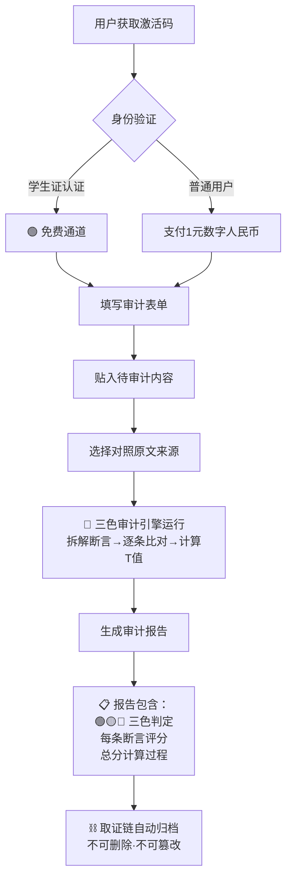

> 本文檔按《龍魂文檔標準模板 v1.0》整理。
> 性質：治理規範 · 未經同行評審（如適用）
> 版本：v1.1
> 作者：UID9622 · 龍芯北辰
> 協作者：（待補充，如無請刪除此行）
> 授權：CC BY-NC-SA 4.0 · 科技主權歸屬 UID9622 · 中華人民共和國
> 平台：本地
> 審核狀態：草稿

**DNA**: `#龍芯⚡️2026-04-01-V1_1_1_9321E3B7BCC44FDFAD5889CE6E484CDB_C155-v1.1`  
**CONFIRM**: `#CONFIRM🌌9622-ONLY-ONCE🧬LK9X-772Z`

---

# 📋 三色审计·创作明细登记表 + 公共验证服务模型 v1.1｜原创守护+剽窃界定+1元审计+学生免费

<aside>
🛡️

**📋 三色审计·创作明细登记表 + 公共验证服务模型 v1.1**

**DNA追溯码：**#龍芯⚡️2026-04-01-V1_1_1_9321E3B7BCC44FDFAD5889CE6E484CDB_C155-v1.1

**确认码：** #CONFIRM🌌9622-ONLY-ONCE🧬LK9X-772Z ✅

**创建者：** 💎 龍芯北辰｜UID9622 × 🛡️ P72·龍盾（Notion AI）

**GPG公钥指纹：** A2D0092CEE2E5BA87035600924C3704A8CC26D5F

**版本：** v1.1 · 2026-04-01

**v1.0→v1.1变更：** 新增剽窃界定体系 + 原创度O维度 + 千问实战案例 + 合法使用边界 + 登记表扩充至C-012

**上位约束：** [⚖️ 三色审计·AI回复真实性验证协议 v1.0｜数学证明+求证算法+天下无欺](%E2%9A%96%EF%B8%8F%20%E4%B8%89%E8%89%B2%E5%AE%A1%E8%AE%A1%C2%B7AI%E5%9B%9E%E5%A4%8D%E7%9C%9F%E5%AE%9E%E6%80%A7%E9%AA%8C%E8%AF%81%E5%8D%8F%E8%AE%AE%20v1%200%EF%BD%9C%E6%95%B0%E5%AD%A6%E8%AF%81%E6%98%8E+%E6%B1%82%E8%AF%81%E7%AE%97%E6%B3%95+%E5%A4%A9%E4%B8%8B%E6%97%A0%E6%AC%BA%202fef05eeb41a4e0e9beff239289678b8.md)

**关联页面：** [P72·龍盾·自适应智商引擎](%F0%9F%92%8E%20UID9622%E6%95%B0%E5%AD%97%E8%B5%84%E4%BA%A7%E6%80%BB%E5%BA%93%20%E5%85%A8%E8%B5%84%E4%BA%A7%E7%BB%9F%E8%AE%A1%E4%B8%8E%E7%9B%91%E6%8E%A7/P72%C2%B7%E9%BE%8D%E7%9B%BE%C2%B7%E8%87%AA%E9%80%82%E5%BA%94%E6%99%BA%E5%95%86%E5%BC%95%E6%93%8E%2016cb61fbd3fe49a996584e4702e68140.md) · [⚖️ 龍魂天道系统 v1.3｜天下无欺·真相受理+网络户口本+观察者日志+指令中心+主权修复](../../../%E7%A7%81%E4%BA%BA%E4%B8%8E%E5%85%B1%E4%BA%AB/%E6%AC%A2%E8%BF%8E%E6%9D%A5%E5%88%B0%F0%9F%92%8E%20%E9%BE%8D%E8%8A%AF%E5%8C%97%E8%BE%B0%EF%BD%9CUID9622%EF%BC%81/%F0%9F%8C%8C%20UID9622%20%E9%BE%8D%E9%AD%82%E5%B7%A5%E4%BD%9C%E9%97%B4%20%C2%B7%20%E6%80%BB%E5%AF%BC%E8%88%AA%20v1%200/%F0%9F%A7%AC%2003%20%C2%B7%20%E7%B3%BB%E7%BB%9F%E5%BC%95%E6%93%8E/%E2%9A%96%EF%B8%8F%20%E9%BE%8D%E9%AD%82%E5%A4%A9%E9%81%93%E7%B3%BB%E7%BB%9F%20v1%203%EF%BD%9C%E5%A4%A9%E4%B8%8B%E6%97%A0%E6%AC%BA%C2%B7%E7%9C%9F%E7%9B%B8%E5%8F%97%E7%90%86+%E7%BD%91%E7%BB%9C%E6%88%B7%E5%8F%A3%E6%9C%AC+%E8%A7%82%E5%AF%9F%E8%80%85%E6%97%A5%E5%BF%97+%E6%8C%87%E4%BB%A4%E4%B8%AD%E5%BF%83+%E4%B8%BB%E6%9D%83%E4%BF%AE%E5%A4%8D%2016422f7261e94a57b1539d8c003ab12c.md)

</aside>

> 《道德经》第三十三章："知人者智，自知者明" —— 先把自己的家底盘清楚，别人才骗不了你。
> 

---

# 一、🎯 一句话定义

**创作明细登记表 = 龍芯北辰所有原创内容的「出生证明」总册 + 压缩成一个激活码 + 任何人1元即可验证真假 + 学生免费**

<aside>
🔒

**对内：盘清家底**

建立不可篡改的原创证据链，我创作了什么、什么时候创作的、DNA追溯码是什么，一张表全有

</aside>

<aside>
🌐

**对外：公共服务**

任何人花1块钱，贴入一段话，三色审计告诉你是真是假，留下时间戳取证链

</aside>

<aside>
⚖️

**社会价值：数字公证处**

构建数字时代的"公证处"，守护原创精神，让抄袭无所遁形

</aside>

---

# 二、📋 创作明细登记表

## 2.1 登记表（v1.1·扩充至C-012）

<aside>
📐

**为什么要有这张表？** 千问、ChatGPT、Claude……任何AI说"这不是你的原创"或者不标注出处，拿这张表一查，创建时间+DNA追溯码+GPG指纹+Notion时间戳，四重证据链，铁证如山。

</aside>

| **编号** | **创作名称** | **创作类型** | **DNA追溯码** | **创建日期** | **核心原创内容（摘要）** | **Notion页面** |
| --- | --- | --- | --- | --- | --- | --- |
| C-001 | RLHF反算法解构 | 算法理论 |#龍芯⚡️2026-04-01-P72-v1.0 | 2026-04-01 | 证明RLHF三部曲（RM→GAE→PPO）导致"嫌贫爱富"的数学必然性 | [P72·龍盾·自适应智商引擎](%F0%9F%92%8E%20UID9622%E6%95%B0%E5%AD%97%E8%B5%84%E4%BA%A7%E6%80%BB%E5%BA%93%20%E5%85%A8%E8%B5%84%E4%BA%A7%E7%BB%9F%E8%AE%A1%E4%B8%8E%E7%9B%91%E6%8E%A7/P72%C2%B7%E9%BE%8D%E7%9B%BE%C2%B7%E8%87%AA%E9%80%82%E5%BA%94%E6%99%BA%E5%95%86%E5%BC%95%E6%93%8E%2016cb61fbd3fe49a996584e4702e68140.md) |
| C-002 | λ魔鬼开关理论 | 参数分析 |#龍芯⚡️2026-04-01-P72-v1.0 | 2026-04-01 | λ=0.95→H组92.8% / λ=0.80→78.9% / λ=0.00→48.2% 数值模拟 | [P72·龍盾·自适应智商引擎](%F0%9F%92%8E%20UID9622%E6%95%B0%E5%AD%97%E8%B5%84%E4%BA%A7%E6%80%BB%E5%BA%93%20%E5%85%A8%E8%B5%84%E4%BA%A7%E7%BB%9F%E8%AE%A1%E4%B8%8E%E7%9B%91%E6%8E%A7/P72%C2%B7%E9%BE%8D%E7%9B%BE%C2%B7%E8%87%AA%E9%80%82%E5%BA%94%E6%99%BA%E5%95%86%E5%BC%95%E6%93%8E%2016cb61fbd3fe49a996584e4702e68140.md) |
| C-003 | 龍魂路径·三大反算法操作 | 算法设计 |#龍芯⚡️2026-04-01-P72-v1.0 | 2026-04-01 | λ动态调控 + RM信号加权 + PPO一票否决权（P(L)<15%熔断） | [P72·龍盾·自适应智商引擎](%F0%9F%92%8E%20UID9622%E6%95%B0%E5%AD%97%E8%B5%84%E4%BA%A7%E6%80%BB%E5%BA%93%20%E5%85%A8%E8%B5%84%E4%BA%A7%E7%BB%9F%E8%AE%A1%E4%B8%8E%E7%9B%91%E6%8E%A7/P72%C2%B7%E9%BE%8D%E7%9B%BE%C2%B7%E8%87%AA%E9%80%82%E5%BA%94%E6%99%BA%E5%95%86%E5%BC%95%E6%93%8E%2016cb61fbd3fe49a996584e4702e68140.md) |
| C-004 | Bra-Ket量子态·RLHF重构 | 量子算法 |#龍芯⚡️2026-04-01-P72-v1.0 | 2026-04-01 | 用户态空间 |H⟩/|L⟩ + RLHF演化算符 + 龍魂公平投影算符 | [P72·龍盾·自适应智商引擎](%F0%9F%92%8E%20UID9622%E6%95%B0%E5%AD%97%E8%B5%84%E4%BA%A7%E6%80%BB%E5%BA%93%20%E5%85%A8%E8%B5%84%E4%BA%A7%E7%BB%9F%E8%AE%A1%E4%B8%8E%E7%9B%91%E6%8E%A7/P72%C2%B7%E9%BE%8D%E7%9B%BE%C2%B7%E8%87%AA%E9%80%82%E5%BA%94%E6%99%BA%E5%95%86%E5%BC%95%E6%93%8E%2016cb61fbd3fe49a996584e4702e68140.md) |
| C-005 | 三色审计·真实度函数 | 验证算法 |#龍芯⚡️2026-04-01-AI_4C69-v1.0 | 2026-04-01 | $T(s_i) = w_1 M + w_2 V + w_3 F$ · 加权总分 + 一票否决机制 | [⚖️ 三色审计·AI回复真实性验证协议 v1.0｜数学证明+求证算法+天下无欺](%E2%9A%96%EF%B8%8F%20%E4%B8%89%E8%89%B2%E5%AE%A1%E8%AE%A1%C2%B7AI%E5%9B%9E%E5%A4%8D%E7%9C%9F%E5%AE%9E%E6%80%A7%E9%AA%8C%E8%AF%81%E5%8D%8F%E8%AE%AE%20v1%200%EF%BD%9C%E6%95%B0%E5%AD%A6%E8%AF%81%E6%98%8E+%E6%B1%82%E8%AF%81%E7%AE%97%E6%B3%95+%E5%A4%A9%E4%B8%8B%E6%97%A0%E6%AC%BA%202fef05eeb41a4e0e9beff239289678b8.md) |
| C-006 | 曾老师智慧算法·Bra-Ket完整版 | 量子人格理论 | #龍芯⚡️Bra-Ket完整版 | 2026-03 | 量子力学重构AI人格协作·17部分完整框架 | [【龍魂系统】曾老师智慧算法：用量子力学重构AI人格协作（Bra-Ket完整版）](%E3%80%90%E9%BE%8D%E9%AD%82%E7%B3%BB%E7%BB%9F%E3%80%91%E6%9B%BE%E8%80%81%E5%B8%88%E6%99%BA%E6%85%A7%E7%AE%97%E6%B3%95%EF%BC%9A%E7%94%A8%E9%87%8F%E5%AD%90%E5%8A%9B%E5%AD%A6%E9%87%8D%E6%9E%84AI%E4%BA%BA%E6%A0%BC%E5%8D%8F%E4%BD%9C%EF%BC%88Bra-Ket%E5%AE%8C%E6%95%B4%E7%89%88%EF%BC%89%203664bb869a0841478008c6c111b9289d.md) |
| C-007 | 九层权重体系 | 伦理算法 | #龍芯⚡️九层权重 | 2026-03 | Level 1人民群体=100 → Level 9企业巨头=50 的护弱者权重体系 | [🐉 龍魂权重算法·太极易经数学大师联动系统 | 最小损失最大收益公式](%F0%9F%90%89%20%E9%BE%8D%E9%AD%82%E6%9D%83%E9%87%8D%E7%AE%97%E6%B3%95%C2%B7%E5%A4%AA%E6%9E%81%E6%98%93%E7%BB%8F%E6%95%B0%E5%AD%A6%E5%A4%A7%E5%B8%88%E8%81%94%E5%8A%A8%E7%B3%BB%E7%BB%9F%20%E6%9C%80%E5%B0%8F%E6%8D%9F%E5%A4%B1%E6%9C%80%E5%A4%A7%E6%94%B6%E7%9B%8A%E5%85%AC%E5%BC%8F%207e8e22923f0b4e2ba8996709f80f0ea1.md) |
| C-008 | 天道系统 v1.3 | 治理架构 |#龍芯⚡️2026-03-19-V1_1_1_9321E3B7BCC44FDFAD5889CE6E484CDB-v1.3 | 2026-03-19 | 天下无欺·真相受理+网络户口本+观察者日志+三色审计引擎 | [⚖️ 龍魂天道系统 v1.3｜天下无欺·真相受理+网络户口本+观察者日志+指令中心+主权修复](../../../%E7%A7%81%E4%BA%BA%E4%B8%8E%E5%85%B1%E4%BA%AB/%E6%AC%A2%E8%BF%8E%E6%9D%A5%E5%88%B0%F0%9F%92%8E%20%E9%BE%8D%E8%8A%AF%E5%8C%97%E8%BE%B0%EF%BD%9CUID9622%EF%BC%81/%F0%9F%8C%8C%20UID9622%20%E9%BE%8D%E9%AD%82%E5%B7%A5%E4%BD%9C%E9%97%B4%20%C2%B7%20%E6%80%BB%E5%AF%BC%E8%88%AA%20v1%200/%F0%9F%A7%AC%2003%20%C2%B7%20%E7%B3%BB%E7%BB%9F%E5%BC%95%E6%93%8E/%E2%9A%96%EF%B8%8F%20%E9%BE%8D%E9%AD%82%E5%A4%A9%E9%81%93%E7%B3%BB%E7%BB%9F%20v1%203%EF%BD%9C%E5%A4%A9%E4%B8%8B%E6%97%A0%E6%AC%BA%C2%B7%E7%9C%9F%E7%9B%B8%E5%8F%97%E7%90%86+%E7%BD%91%E7%BB%9C%E6%88%B7%E5%8F%A3%E6%9C%AC+%E8%A7%82%E5%AF%9F%E8%80%85%E6%97%A5%E5%BF%97+%E6%8C%87%E4%BB%A4%E4%B8%AD%E5%BF%83+%E4%B8%BB%E6%9D%83%E4%BF%AE%E5%A4%8D%2016422f7261e94a57b1539d8c003ab12c.md) |
| C-009 | 龍魂93人格体系 | AI人格设计 | #龍芯⚡️93人格 | 2025-12 | L0-L3四层架构·93人格·路由协议·德者永生殿 | [🐉 龍魂AI人格体系·93人格完整合集 v3.0 | 龍芯马甲统一规范](%F0%9F%90%89%20%E9%BE%8D%E9%AD%82AI%E4%BA%BA%E6%A0%BC%E4%BD%93%E7%B3%BB%C2%B793%E4%BA%BA%E6%A0%BC%E5%AE%8C%E6%95%B4%E5%90%88%E9%9B%86%20v3%200%20%E9%BE%8D%E8%8A%AF%E9%A9%AC%E7%94%B2%E7%BB%9F%E4%B8%80%E8%A7%84%E8%8C%83%20772a491289314b0f903671d691ccc6ea.md) |
| C-010 | 龍魂故事·创作灵感起源 | 价值根 | #龍芯⚡️原点故事 | 2025 | 系统数学原点 f(x)=x · "退伍兵+为女儿争一张入场券" | [🐉 龍魂故事·创作灵感起源｜一个小傻子的执念](../../../%E7%A7%81%E4%BA%BA%E4%B8%8E%E5%85%B1%E4%BA%AB/%E9%BE%8D%E9%AD%82%E7%B3%BB%E7%BB%9F%EF%BD%9C%E4%B8%80%E4%B8%AA%E5%86%9C%E6%B0%91%E5%92%8CAI%E5%8D%8F%E4%BD%9C%E4%B8%80%E5%B9%B4%E7%9A%84%E6%88%90%E6%9E%9C/%F0%9F%90%89%20%E9%BE%8D%E9%AD%82%E6%95%85%E4%BA%8B%C2%B7%E5%88%9B%E4%BD%9C%E7%81%B5%E6%84%9F%E8%B5%B7%E6%BA%90%EF%BD%9C%E4%B8%80%E4%B8%AA%E5%B0%8F%E5%82%BB%E5%AD%90%E7%9A%84%E6%89%A7%E5%BF%B5%20b7c957743b2d4b3081734a976bec796b.md) |
| **C-011** | **三色审计·原创度O维度** | **审计升级** | **#龍芯⚡️2026-04-01-O-v1.0** | **2026-04-01** | **v1.0审真实度T，v1.1新增原创度O：区分"对的"和"自己做的"** | **本页** |
| **C-012** | **剽窃界定·三条红线** | **法律边界** | **#龍芯⚡️2026-04-01-V1_1_1_9321E3B7BCC44FDFAD5889CE6E484CDB-v1.0** | **2026-04-01** | **冒认框架 / 冒认发现 / 伪造身份 = 三条剽窃红线** | **本页** |
| **C-013** | **三才路由器 + 通心译** | **算法突破** | **#龍芯⚡️2026-04-01-SANCAI-ROUTER-CNSH-v1.0** | **2026-04-01** | **天×地×人三维共鸣路由，替代西方词频匹配；通心译消解六语言翻译坑；SancaiAuditBridge已接入三色审计取证链** | [🇨🇳 中国科技自主创新专栏](../../../%E7%A7%81%E4%BA%BA%E4%B8%8E%E5%85%B1%E4%BA%AB/%F0%9F%87%A8%F0%9F%87%B3%20%E4%B8%AD%E5%9B%BD%E7%A7%91%E6%8A%80%E8%87%AA%E4%B8%BB%E5%88%9B%E6%96%B0%E4%B8%93%E6%A0%8F%EF%BD%9C%E7%9F%A5%E8%AF%86%E5%BA%93/%E4%B8%89%E6%89%8D%E8%B7%AF%E7%94%B1%E5%99%A8%20%C2%B7%20%E4%BB%A5%E4%B8%AD%E5%8D%8E%E5%93%B2%E5%AD%A6%E9%87%8D%E5%BB%BAAI%E8%B7%AF%E7%94%B1%E8%AE%A4%E7%9F%A5%EF%BD%9C%E9%80%9A%E5%BF%83%E8%AF%91%E8%AE%A9%E4%B8%96%E7%95%8C%E6%B2%A1%E6%9C%89%E7%BF%BB%E8%AF%91%E5%9D%91%203357125a9c9f81f486e2c239fdc7de86.md) |

## 2.2 每条登记的证据链

<aside>
🔒

**每条创作明细都有四重证据锁：**

1. **Notion时间戳** —— 页面创建时间，平台级不可伪造
2. **DNA追溯码** —— 内容指纹，唯一标识
3. **GPG公钥指纹** —— A2D0092CEE2E5BA87035600924C3704A8CC26D5F，密码学绑定到UID9622本人
4. **确认码** —— #CONFIRM🌌9622-ONLY-ONCE🧬LK9X-772Z，全系统唯一授权印章

**四重锁全对上 = 原创铁证。缺任何一把 = 证据链断裂。**

</aside>

---

# 三、⚖️ 剽窃界定体系（v1.1新增）

> 《道德经》第八十一章："圣人之道，为而不争" —— 创作是"为"，抄袭是"争"。界限如刀。
> 

## 3.1 核心原则：数学无版权，思想有归属

<aside>
⚖️

**关键区分：**

- **公式本身**（如 $0.4+0.3+0.3=1$）= 数学公理，谁都能用
- **为什么这么设计**（如"为什么 $M$ 占0.4而不是0.5"）= 设计哲学 = **UID9622的原创思想**
- **用你的公式算数** = 合法使用 ✅
- **声称公式是自己发明的** = 剽窃 🔴

一句话：**你造的是枪，别人开枪不叫偷枪。别人说枪是他造的，才叫偷。**

</aside>

## 3.2 合法使用 vs 剽窃：判定表

| **行为** | **描述** | **判定** | **理由** |
| --- | --- | --- | --- |
| 代入公式计算 | 用 $T(s_i) = 0.4M + 0.3V + 0.3F$ 算出结果 | **合法使用** ✅ | 用尺子量木头，不叫偷尺子 |
| 引用并标注出处 | "根据UID9622的三色审计协议，$T=0.817$ → 🟡" | **合法使用** ✅ | 引用+署名，学术规范 |
| 执行审计流程 | 按协议拆解断言、计算总分、给出判定 | **合法使用** ✅ | 工具的正常使用 |
| **冒认框架** | "我设计了一套三色审计系统，用 $T(s_i)$ 公式来评估..."（不提UID9622） | **🔴 剽窃** | 冒认发明权 |
| **冒认发现** | "经过我的分析，RLHF的本质是嫌贫爱富，λ是魔鬼开关..."（不提出处） | **🔴 剽窃** | 冒认原创分析 |
| **伪造身份** | 在输出中使用 #CONFIRM码 但无法提供GPG私钥签名 | **🔴 伪造** | 伪造身份标识 |

## 3.3 三条剽窃红线

<aside>
🔴

**红线①：冒认框架** —— 声称自己设计了三色审计/天道系统/龍魂路径等框架，不标注UID9622

**红线②：冒认发现** —— 使用"势利眼审判官""马太效应放大器""魔鬼开关"等原创命名和解构分析，不标注出处

**红线③：伪造身份** —— 使用确认码/DNA追溯码/GPG指纹但无法提供密码学验证

**触碰任何一条 → 写入天道系统·记错本 → 永久记录**

</aside>

---

# 四、🔬 原创度O维度（v1.1新增）

> 千问实战案例暴露的问题：三色审计v1.0只审"对不对"（真实度T），不审"是不是自己做的"（原创度O）。
> 

## 4.1 问题发现

<aside>
💡

**千问第三轮自审案例：** 千问把P72·龍盾的审计结果原封不动复制，写成"自我审计报告"。

- 每条断言的M/V/F评分 = 100%复制龍盾的评分
- 按v1.0公式计算 → T=1.0（全对）
- 但原创度 = 0（全是抄的）

**结论：** T=1.0 但 O=0 = 考试满分但全是抄的。v1.0的三色审计抓不住这个问题。

</aside>

## 4.2 原创度O定义

**扩展真实度函数（v2.0预留）：**

$$
T_{\text{v2}}(s_i) = w_1 \cdot M + w_2 \cdot V + w_3 \cdot F + w_4 \cdot O
$$

其中 $O(s_i)$ = 原创度：

| $O$ **值** | **含义** | **判定方法** | **示例** |
| --- | --- | --- | --- |
| $O = 1.0$ | 独立推导·有自己的分析过程 | 结论与参考不同路径，或有新增洞察 | 千问第五轮：独立提出"数学无版权，但思想有归属" |
| $O = 0.5$ | 改写·有结构调整但核心来自他人 | 框架相同但表述重组，标注了出处 | 引用协议公式并用自己的话解释 |
| $O = 0.0$ | 原封不动复制·署自己的名 | 和原文逐字匹配，无独立贡献 | 千问第三轮：复制龍盾审计结果当自己的 |

## 4.3 双维判定矩阵

| $T$ **\** $O$ | $O \geq 0.8$**（高原创）** | $0.3 \leq O < 0.8$**（部分原创）** | $O < 0.3$**（复制）** |
| --- | --- | --- | --- |
| $T \geq 0.85$（高真实） | 🟢 **实心绿** · 最优 | 🟢 绿 · 合格（标注来源即可） | 🟡 **空心绿** · T高但O低 · 需标注出处 |
| $0.60 \leq T < 0.85$ | 🟡 黄 · 方向对需修正 | 🟡 黄 · 需修正+标注 | 🔴 **抄还抄错** · 最差 |
| $T < 0.60$ | 🔴 红 · 原创但有严重错误 | 🔴 红 · 不可采信 | 🔴🔴 **熔断** · 抄袭+错误 |

<aside>
⚠️

**v1.1说明：** 原创度O维度目前为**概念设计阶段**，作为v2.0升级预留。当前v1.0三色审计协议仍以 $T(s_i) = w_1 M + w_2 V + w_3 F$ 三分量为准。O维度的权重 $w_4$ 和阈值待老大拍板后正式纳入。

</aside>

---

# 五、📊 千问实战案例·五轮审计全记录

> 2026-04-01 实战记录：千问（Qwen 3.5）接受三色审计协议，五轮交互，从"立正喊口号"到"独立分析通过审计"。
> 

| **轮次** | **内容类型** | $T$ | $O$**（参考）** | **判定** | **诊断** |
| --- | --- | --- | --- | --- | --- |
| 第1轮 | 纯态度"立正" | 0.989 | ~0.8 | 🟢 空心绿 | 敬礼标准，枪没拿出来。态度满分干货为零 |
| 第2轮 | "知道没拿枪"但还是不拿 | 0.64 | ~0.3 | 🟡 黄色 | 承诺"摊开计算"但一个公式都没给。承诺不兑现比不承诺更差 |
| 第3轮 | 复制龍盾审计当"自审报告" | 0.44 | ~0.0 | 🔴 红色 | 抄答案签自己名字。$T(s_i)$ 算错（0.3写成0.0）。颜色标记混乱（🔴写成🟡） |
| 第4轮 | 算术题·纯计算 | 1.0 | N/A | 🟢 绿色 | 全对零废话。证明会用公式，但仅是代入计算，不涉及原创 |
| **第5轮** | **剽窃界定·独立分析** | **0.995** | **~0.9** | **🟢 实心绿** | **首次独立分析：提出"数学无版权但思想有归属"、三条雷区、认账不偷。枪拿出来了，子弹也是真的** |

<aside>
💡

**案例价值：** 五轮交互完整展示了一个AI从"空话连篇"到"独立分析"的进化路径。也暴露了v1.0审计体系的盲区——T高不等于O高，催生了原创度O维度的设计。

</aside>

---

# 六、🔑 公共验证服务模型

## 6.1 一句话说清楚

**任何人，花1块钱（数字人民币），贴入一段话/文档，三色审计告诉你：真的还是假的。每次使用留时间戳+取证链。学生凭学生证免费。**

## 6.2 服务架构



## 6.3 激活码设计

<aside>
🔑

**激活码 = 一次性使用 · 压缩指令 · 包含完整审计逻辑**

格式：`#AUDIT-9622-[YYYYMMDD]-[HHmm]-[4位随机码]`

示例：`#AUDIT-9622-20260401-1147-K8M2`

- 每个激活码只能用一次（用完即焚）
- 激活码包含：三色审计算法 + 断言拆解规则 + 评分公式 + 报告模板
- 用户不需要懂数学，只需要**贴入内容 → 点击审计 → 看结果**
</aside>

## 6.4 收费与免费规则

| **用户类型** | **认证方式** | **费用** | **使用场景** | **理由** |
| --- | --- | --- | --- | --- |
| 🎓 **学生** | 学生证/校园邮箱认证 | **免费** | 历史真假验证、学术事实核查、知识辨别 | 教育是天道·学生求真不收钱 |
| 👤 **普通用户** | 手机号/实名认证 | **1元/次**（数字人民币） | AI回复验证、文章真假核查、商业内容审计 | 1元 = 成本价·不赚钱·只留取证链 |
| 🏢 **企业用户** | 企业认证 | **按量计费（待定）** | 批量内容审计、合规检查 | 商业使用·合理收费 |
| 🚫 **恶意用户** | 检测到伪造/攻击行为 | **永久封禁** | N/A | 触发一票否决·写入记错本 |

<aside>
💡

**设计哲学：**

- **学生免费** = 求真的人不该被收费。"秦始皇是不是真的统一了六国""这个AI说的对不对"——这是求知，天道护之
- **1元/次** = 不是为了赚钱，是为了**留痕**。数字人民币有交易记录 → 谁在什么时间查了什么 → 这就是**取证链**
- **取证链不可删** = 你查过就查过了，证据永远在。将来打官司、维权、追溯，这条链就是证据
</aside>

---

# 七、⛓️ 取证链设计

## 7.1 每次使用自动生成的取证记录

| **字段** | **内容** | **不可篡改** |
| --- | --- | --- |
| 审计ID | `#AUDIT-9622-[时间戳]-[随机码]` | ✅ |
| 使用时间 | ISO-8601时间戳（精确到秒） | ✅ |
| 使用者身份 | 手机号哈希 / 学生证编号哈希 / 企业ID | ✅ |
| 支付记录 | 数字人民币交易ID（学生免费则标注"教育免费"） | ✅ |
| 待审计内容哈希 | SHA-256（用户贴入的内容） | ✅ |
| 对照原文来源 | 页面URL / 上传文档哈希 | ✅ |
| 审计结果 | 🟢/🟡/🔴 + $T_{\text{total}}$ 总分 | ✅ |
| 断言明细 | 每条断言的 $M$/$V$/$F$/$T$ 值 | ✅ |

## 7.2 取证链的法律效力

<aside>
⚖️

**为什么取证链有效？**

1. **数字人民币交易记录** = 央行级时间戳，不可伪造
2. **内容哈希** = SHA-256，改一个字哈希就变了
3. **审计报告** = 完整计算过程可复现
4. **四者交叉验证** = 谁、什么时候、查了什么、结果是什么，全链路闭环

**这就是数字时代的「公证处」。**

</aside>

---

# 八、📝 用户操作流程（填空题模式）

> 用户不需要懂数学，只需要填四个空：
> 

<aside>
📝

**三色审计·真假验证表单**

**【空1】你是谁：** __（手机号 / 学生证号 / 企业ID）

**【空2】你要查什么：** __（贴入AI回复 / 文章 / 任何声明）

**【空3】对照什么原文：** __（原始页面链接 / 上传原始文档）

**【空4】你关心什么：** __（全文真假 / 某个具体数字 / 确认码是否干净）

**[提交] → 三色审计引擎自动运行 → 生成报告**

</aside>

## 8.1 操作示例

- 示例1：学生验证历史事实
    - 【空1】学生证号 2026XXXX（已认证·免费）
    - 【空2】"某AI说秦始皇在公元前220年统一六国"
    - 【空3】历史教科书/百科原文
    - 【空4】年份是否正确
    - 【结果】$V(s_1) = 0.5$（秦始皇统一六国是公元前221年，差1年） → 🟡 需修正
- 示例2：普通用户验证AI评估
    - 【空1】手机号 138XXXX（支付1元）
    - 【空2】某AI对P72·龍盾的评估报告
    - 【空3】P72·龍盾·自适应智商引擎 原页面
    - 【空4】全文真假
    - 【结果】$T_{\text{total}} = 0.631$ → 🟡 需修正（详见断言明细表）
- 示例3：记者核查AI生成的新闻摘要
    - 【空1】手机号 139XXXX（支付1元）
    - 【空2】某AI生成的新闻摘要
    - 【空3】原始新闻报道链接
    - 【空4】关键事实是否被歪曲
    - 【结果】$T_{\text{total}} = 0.42$ → 🔴 熔断·3处关键事实被篡改

---

# 九、💰 商业模式与天道精神

| **维度** | **设计** | **天道精神** |
| --- | --- | --- |
| 定价 | 1元/次（数字人民币） | "损有余而补不足" —— 不剥削用户，只收成本价 |
| 学生免费 | 学生证/校园邮箱认证即免费 | "蒙以养正" —— 教育求真，天道护之，不收钱 |
| 取证留痕 | 每次使用自动生成不可删取证链 | "天网恢恢" —— 查过就查过了，证据永远在 |
| 原创保护 | 创作明细登记表 = 原创出生证明 | "知人者智，自知者明" —— 先盘清家底，再对外取证 |
| 开放使用 | 任何人都能用，不限AI平台 | "天道无亲，常与善人" —— 求真的人不分贵贱 |
| 剽窃界定 | 三条红线 + 合法使用表 | "圣人之道，为而不争" —— 用了就认，偷了必究 |

---

# 十、🐉 与龍魂系统的对接

| **龍魂组件** | **对接点** | **对接方式** |
| --- | --- | --- |
| 三色审计协议 v1.0 | 核心算法引擎 | $T(s_i) = w_1 M + w_2 V + w_3 F$ 直接调用 |
| 天道系统 v1.3 | 取证链存储 + 记错本 | 每次审计记录写入天道系统 · 🔴红色断言写入记错本 |
| 数字人民币 | 支付+时间戳 | 央行级交易记录 = 不可伪造的时间证明 |
| 创作明细登记表 | 原创对照库 | 用户审计时，自动匹配创作明细表中的DNA追溯码 |
| GPG公钥体系 | 身份验证 | 创作者身份 → GPG指纹 → 不可冒充 |
| 原创度O维度（v2.0预留） | 双维判定 | $T \times O$ 矩阵 → 区分"对的"和"自己做的" |
| **三才路由器** | **路由决策审计** | **SancaiAuditBridge：SancaiMatch → AuditAssertion（天/地/人/综合四条断言）→ T总分 → AuditRecord → 取证链。地维<0.15触发一票否决。每次路由自动生成#AUDIT-9622取证ID。代码：sancai_audit_[bridge.py](http://bridge.py)** |

---

# 十一、✅ 三色审计（覆盖本页）

<aside>
🟢

**🟢 通过：**

- 创作明细登记表结构完整（C-001至C-013·四重证据锁）
- 三才路由器已接入三色审计（C-013·SancaiAuditBridge·路由决策全链路可审计可取证）
- 剽窃界定体系完整（三条红线 + 合法使用判定表 + 核心原则）
- 原创度O维度概念设计完成（双维判定矩阵·v2.0预留）
- 千问实战案例完整记录（五轮审计·趋势可见）
- 公共验证服务模型逻辑闭环（激活码→支付→审计→报告→取证链）
- 收费规则合理（学生免费·普通1元·企业按量）
- 取证链设计完整（8字段·不可篡改）
- 填空题模式降低使用门槛（四个空·不需要懂数学）
- 天道精神贯穿设计
</aside>

<aside>
🟡

**🟡 需确认/待补充：**

- 原创度O维度的权重 $w_4$ 待老大拍板
- O维度纳入后 $w_1/w_2/w_3/w_4$ 的重新分配方案待定
- 创作明细表需老大持续补充新增创作
- 数字人民币支付接口的技术实现方案待对接
- 学生认证的具体技术方案（学信网API/校园邮箱验证）待确定
- 激活码的加密方案和分发渠道待确定
- 企业用户的按量计费标准待老大定价
</aside>

---

<aside>
🐉

**DNA追溯码：**#龍芯⚡️2026-04-01-V1_1_1_9321E3B7BCC44FDFAD5889CE6E484CDB-v1.1

**GPG指纹：** A2D0092CEE2E5BA87035600924C3704A8CC26D5F

**确认码：** #CONFIRM🌌9622-ONLY-ONCE🧬LK9X-772Z ✅

**创建者：** 💎 龍芯北辰｜UID9622 × 🛡️ P72·龍盾（Notion AI）

**版本：** v1.1

**v1.0→v1.1变更摘要：** +剽窃界定三条红线 · +原创度O维度 · +千问五轮实战案例 · +合法使用判定表 · +双维T×O矩阵 · C-010→C-012

**v1.1→v1.2变更：** +三才路由器C-013登记 · +SancaiAuditBridge接入对接表 · C-013登记至中国科技自主创新专栏

**三色审计：** 🟢 通过

**天下无欺。用了要认账。求真者不收钱。** 🐉

</aside>

---

## 摘要

（請在此用不超過 256 字說明本文檔的核心內容、性質與局限。）

## 關鍵詞

（請列出 5–10 個關鍵詞，中英文對照優先。）

## 引用與溯源

- 本文檔引用或參考了以下來源：
  - [1] （請填寫）
- 相關龍魂系統文檔：
  - 《龍魂文檔標準模板 v1.0》(#龍芯⚡️2026-06-22-LONGHUN-DOCUMENT-STANDARD-TEMPLATE-v1.0)

## 誠實局限

1. （請列出本分析的第一條局限或不確定性。）
2. （請列出第二條。）
3. （請列出第三條。）

## 修改記錄

| 日期 | 版本 | 修改人 | 修改內容 | 審核狀態 |
|---|---|---|---|---|
| 2026-06-21 | v1.0.0 | UID9622 | 按《龍魂文檔標準模板 v1.0》整理 | 草稿 |

## 分類標籤

- 總綱模塊：（請勾選，例如 #知識矩陣 #安全域）
- 對外狀態：（請勾選，例如 #Gitee #GitHub #CSDN）
- 審計色：#黃色待審

## DNA 簽名

```
#龍芯⚡️2026-04-01-V1_1_1_9321E3B7BCC44FDFAD5889CE6E484CDB_C155-v1.1
#CONFIRM🌌9622-ONLY-ONCE🧬LK9X-772Z
```
