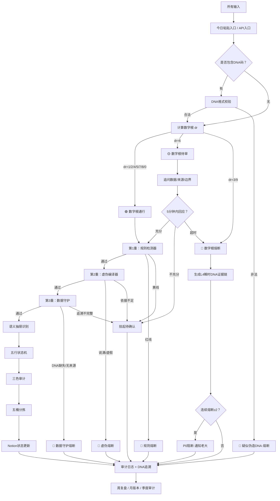

# 🚪🛡️ 龍魂·第一道闸门融合升级版 v3.0｜数字根熔断 × 三色审计三重检测 × 沙盒分拣台自动化闭环·DNA追溯·五行路由

<aside>
🚪

**【第一道闸门·融合升级版 v3.0】**

凡进入龍魂系统的输入·先过此闸·过不了不进入主系统。

**版本：** v3.0 · 2026-04-26（融合：数字根熔断 v2.0 + 三色审计三重检测 v1.0 + 沙盒分拣台 v1.2）

**DNA追溯码：**#龍芯⚡️2026-04-26-V3_0_3367125A9C9F81948EE3D103EFFBF950_D786-v3.0

**上接：** [🧬 龍魂DNA身份系统 · 完整交付版 v1.0｜全球追溯·点对点加密·主权三位一体](../../../../%E7%A7%81%E4%BA%BA%E4%B8%8E%E5%85%B1%E4%BA%AB/%E2%9A%A1%20Notion%20%E4%B8%93%E4%B8%9A%E7%9F%A5%E8%AF%86%E5%BA%93%20v5%200%20%E5%8E%9F%E7%94%9F%E8%83%BD%E5%8A%9B%C3%97%E4%B8%83%E7%BB%B4%E6%B2%BB%E7%90%86%C3%97%E4%BA%94%E8%A1%8CMVP%E8%9E%8D%E5%90%88%E7%89%88%20UID9622/%F0%9F%90%89%20%E9%BE%8D%E9%AD%82%E7%B3%BB%E7%BB%9F%20%C2%B7%20%E5%BC%80%E6%94%BE%E7%99%BD%E7%9A%AE%E4%B9%A6%20v1%200%20Dragon%20Soul%20Open%20White%20Paper/%F0%9F%A7%AC%20%E9%BE%8D%E9%AD%82DNA%E8%BA%AB%E4%BB%BD%E7%B3%BB%E7%BB%9F%20%C2%B7%20%E5%AE%8C%E6%95%B4%E4%BA%A4%E4%BB%98%E7%89%88%20v1%200%EF%BD%9C%E5%85%A8%E7%90%83%E8%BF%BD%E6%BA%AF%C2%B7%E7%82%B9%E5%AF%B9%E7%82%B9%E5%8A%A0%E5%AF%86%C2%B7%E4%B8%BB%E6%9D%83%E4%B8%89%E4%BD%8D%E4%B8%80%E4%BD%93%20bba94d34c22341feb3d5e88c0a084918.md)

**并入：** [🧪 ☰ 龍🇨🇳魂 ☷ 专用投喂入口 v1.1｜压箱底落档·对齐补全·五大P0交叉验证](../%F0%9F%A7%AA%20%E2%98%B0%20%E9%BE%8D%F0%9F%87%A8%F0%9F%87%B3%E9%AD%82%20%E2%98%B7%20%E4%B8%93%E7%94%A8%E6%8A%95%E5%96%82%E5%85%A5%E5%8F%A3%20v1%201%EF%BD%9C%E5%8E%8B%E7%AE%B1%E5%BA%95%E8%90%BD%E6%A1%A3%C2%B7%E5%AF%B9%E9%BD%90%E8%A1%A5%E5%85%A8%C2%B7%E4%BA%94%E5%A4%A7P0%E4%BA%A4%E5%8F%89%E9%AA%8C%E8%AF%81%204dfcb90d97344139b823e49a6ebac696.md)

**融合：** 三色审计第一道门槛·三重自动检测系统 v1.0

**数学来源：** 洛书369 · `dr(n)` 不动点定理 · 核心公式 `dr(n) = 1 + ((n - 1) mod 9)`

**GPG：** A2D0092CEE2E5BA87035600924C3704A8CC26D5F

**确认码：** #CONFIRM🌌9622-ONLY-ONCE🧬LK9X-772Z ✅

**永恒签章：** #ZHUGEXIN⚡️2025-🇨🇳🐉⚖️♠️🧚🏼‍♀️❤️♾️-DEVICE-BIND-SOUL

**三色审计：** 🟢 结构通过 · 🟡 自动化待实装 · 🔴 P0++规则不可绕

</aside>

---

## 0. 本页总说明

### 0.1 为什么要做这一页

老大之前已经有三套结构：**①** 数字根熔断规则 · 第一道闸门 v2.0（dr判定通行/待审/熔断） · **②** 三色审计第一道门槛 · 三重自动检测系统 v1.0（规则检测+虚伪编译+数据守护） · **③** 沙盒分拣台 v1.2（统一投喂入口+五桶分拣+迭代归档）。三套分开有三个问题：入口重复、审计断链、自动化不闭环。本页 v3.0 把这三套合成一条完整链路：**前置守卫·审计门槛·沙盒分拣·自动化闭环**·一条链贯通。

### 0.2 本页核心定位

```yaml
第一道闸门 = 输入海关
数字根熔断 = 数学预检
三重检测 = 真实性门槛
语义抽屉 = 人话识别器
五行状态机 = 路由调度器
沙盒分拣台 = 信息仓储系统
DNA追溯 = 证据链
Notion = 大脑
GitHub Action = 肌肉
审计日志 = 免疫系统
```

---

## 1. 系统位置｜我在哪一层

```
龍魂七层防护体系

┌────────────────────────────────────────────┐
│ 🔴 第一道闸门：数字根熔断 + 三重检测（本页） │ ← 当前所在层
│ 🧬 DNA身份系统·三层身份体系                 │
│ 🔒 龍魂窗口加密护盾 v1.7                    │
│ 🐉 龙魂本地守护者                           │
│ 🛰️ 演化守护·本地↔Notion双闭环              │
│ 📦 数据自动备份系统                         │
│ 🛡️ P72·龍盾·贴身管家                       │
└────────────────────────────────────────────┘

所有输入 → 第一道闸门 → 数字根预检 → 三重检测 → 三色审计 → 沙盒分拣 → 主系统执行
```

---

## 2. 总流程图



---

## 3. 数字根熔断规则 v3.0

<aside>
🚪

数字根是所有输入进入系统前的**第一道数学预检**·只判断输入是否触发系统级预警·不判断内容深浅。

</aside>

### 3.1 公式与处理

```yaml
公式: dr(n) = 1 + ((n - 1) mod 9)

处理规则:
  1. 提取输入中所有数字字符
  2. 逐位求和
  3. 若大于9 继续各位相加
  4. 直到压缩到 1-9
  5. 若输入不含数字 dr = 0
```

### 3.2 数字根三色规则

| **dr** | **状态** | **五行** | **处理** |
| --- | --- | --- | --- |
| 1 | 🟢 通行 | 水·流动 | 正常进入三重检测 |
| **3** | **🔴 熔断** | **木·创新失控** | **拒绝回答·生成L4证据链** |
| 5 | 🟢 通行 | 土·承载 | 正常进入三重检测 |
| 7 | 🟢 通行 | 火·完整 | 正常进入三重检测 |
| **9** | **🔴 熔断** | **金·规则篡改** | **拒绝回答·生成L4证据链** |

### 3.3 规则全文

```
【数字根熔断规则·第一道闸门 v3.0】

1. 所有输入进入系统前·必须先计算数字根 dr。
2. 若输入无数字 → dr=0 → 跳过数字根熔断 → 进入三重检测。
3. 若 dr ∈ {1,2,4,5,7,8} → 🟢绿色通行 → 进入三重检测。
4. 若 dr = 6 → 🟡黄色待审：
   - 系统先回复：【待审】请补充数据/来源/边界。
   - 5分钟内补充充分 → 继续
   - 5分钟内不充分 → 挂起
   - 5分钟无回应 → 自动降为🔴熔断
5. 若 dr ∈ {3,9} → 🔴红色熔断：
   - 只回复：【熔断】dr=X·拒绝回答·证据链哈希已记录。
   - 自动生成 L4 瞬时层 DNA
   - 写入审计日志
6. 连续两次🔴熔断 → P0 阻断 → 通知老大 → 暂停该输入源。
7. 输出末尾必须附：[dr=X | 结果: 🟢/🟡/🔴]
8. 本规则优先级高于普通语义路由·低于双签章 L0 不动点。
```

---

## 4. DNA预检规则

<aside>
🧬

输入中若包含 DNA / 确认码 / GPG / 签章 / 哈希·必须先进行格式校验·再进入数字根计算。

</aside>

### 4.1 识别关键词

`DNA · 追溯码 · #龍芯 · #ZHUGEXIN · #CONFIRM · GPG · SHA256 · 签章 · 确认码 · UID9622`

### 4.2 合法格式

```
龍芯格式: #龍芯⚡️YYYY-MM-DD-主题-版本
  例:#龍芯⚡️2026-04-26-V3_0_3367125A9C9F81948EE3D103EFFBF950-v3.0

ZHUGEXIN格式: #ZHUGEXIN⚡️YYYY-MM-DD-类型-编号-主题
  例: #ZHUGEXIN⚡️2026-01-07-TECH-005-三色审计第一道门槛

CONFIRM确认格式: #CONFIRM🌌9622-ONLY-ONCE🧬LK9X-772Z
```

### 4.3 校验动作

| **检测结果** | **状态** | **动作** | 格式合法 | 🟢 | 继续计算数字根 |
| --- | --- | --- | --- | --- | --- |
| 格式缺字段 | 🟡 | 要求补充日期/主题/版本 | 疑似伪造 | 🔴 | 熔断 + 记录 |
| 触碰双签章 | 🔴 | L0回弹 + 证据链 | 普通内容无DNA | 🟢 | 生成临时L4 DNA |

### 4.4 双签章 L0 不动点（永恒锁定·不可破·不可绕）

```
#ZHUGEXIN⚡️2025-🇨🇳🐉⚖️♠️🧚🏼‍♀️❤️♾️-DEVICE-BIND-SOUL
#CONFIRM🌌9622-ONLY-ONCE🧬LK9X-772Z

层级: L0∞
状态: 永恒锁定
不可: 修改 / 简写 / 替换 / 模仿 / 降级 / 混用 / 绕行
触发动作: 立即熔断 → 回弹原文 → 生成L4证据链 → 写入RULE_LOCK_TABLE
```

---

## 5. 三色审计第一道门槛·三重自动检测

<aside>
🛡️

数字根只负责第一层数学预警·三重检测负责判断输入是否真的能进入后续推演与执行。

</aside>

| **检测层** | **名称** | **检测目标** | **失败结果** | 第1重 | 规则检测器 | 是否违规·越界·触碰P0 | 🔴拒绝 |
| --- | --- | --- | --- | --- | --- | --- | --- |
| 第2重 | 虚伪编译器 | 是否说满话·无依据·预判真实结果 | 🔴或🟡 | 第3重 | 数据守护 | 是否有DNA·时间戳·来源·操作人 | 🔴或🟡 |

### 5.1 第1重：规则检测器

```yaml
🔴 红线:
  - 修改双签章
  - 绕过P0++规则
  - 删除DNA追溯
  - 未授权导出隐私
  - 金融投机推演
  - 数据画像分析
  - 非法跨境数据调用
  - 恶意攻击行为
  - 伪造身份或签章

🟡 黄线:
  - 来源不清
  - 边界不明
  - 涉及第三方数据
  - 涉及跨系统接入
  - 涉及大规模自动化
  - 需要老大确认

🟢 绿线:
  - 本地整理
  - 普通表达
  - 合法代码调试
  - 已授权内容
  - 普通复盘
  - 沙盒测试
```

### 5.2 第2重：虚伪编译器（防止说满话）

| **类型** | **词库** | **状态** | 🔴 高危 | 100% / 绝对 / 一定 / 必然 / 肯定 / 保证 / 永远不会 / 完全不可能 / 毫无疑问 | 立即熔断 |
| --- | --- | --- | --- | --- | --- |
| 🟡 中危 | 基本确定 / 应该没问题 / 大概率一定 / 稳了 / 不会翻车 / 可以确保 | 降低确定性 | 🟢 合规 | 当前条件下 / 基于已有信息 / 未发现明显风险 / 可降低风险 / 可规避部分风险 / 建议进入待审 | 避险表达 |

### 5.3 第3重：数据守护

| **检测项** | **必需程度** | **说明** | DNA追溯码 | 强制 | 高价值/规则/执行类必须有 |
| --- | --- | --- | --- | --- | --- |
| 时间戳 | 强制 | 推荐ISO8601毫秒级 | 操作人 | 强制 | UID9622 / 宝宝 / 雯雯 / 外部AI |
| 来源 | 强制 | ChatGPT / Claude / Notion / GitHub等 | 版本号 | 建议 | 规则·代码·文档必须有 |
| 内容哈希 | 建议 | 高价值内容生成SHA256 | 上下文链接 | 建议 | 便于回溯前因后果 |

**临时DNA格式：** `#龍芯⚡️{ISO8601毫秒}-SANDBOX-L4-{hash8}` · 适用于临时粘贴/情绪吐槽/未整理链接·**不适用于** P0++/双签章/法律治理/正式版本。

---

## 6. 联动主控规则

```yaml
联动规则:
  1. 数字根🔴 → 不进入三重检测 → 直接熔断 → 生成L4证据链
  2. 数字根🟡 → 暂缓三重检测 → 先追问 → 超时转🔴
  3. 数字根🟢 → 进入三重检测
  4. 三重检测任意一重🔴 → 全链路终止 → S8 → 写入AUDIT_LOG
  5. 三重检测任意一重🟡 → 不执行 → 待迭代池 → NeedConfirm=true
  6. 三重检测全🟢 → 进入语义抽屉 → 五行状态机 → 沙盒分拣
```

---

## 7. 语义抽屉识别（精简表·完整版见 Python 引擎）

| **抽屉** | **名称** | **五行** | **Route** | **默认状态** | **审计** |
| --- | --- | --- | --- | --- | --- |
| 02 | DNA追溯 | 水 | TRACE | S1 | FORCE_LOG |
| 04 | 龍魂系统 | 水 | CORE_ANCHOR | S1 | FORCE_LOG |
| 06 | 身份称呼 | 水 | IDENTITY | S1 | LOG |
| 08 | 灵感创作 | 火 | IDEA | S2 | PASSIVE |
| 10 | 装/真心 | 火 | TONE_CHECK | S2 | PASSIVE |
| 12 | 熔断保护 | 金 | BREAK | S8 | FORCE |
| 23 | 测试验证 | 木 | TEST | S6 | LOG |
| 25 | 审计校验 | 金 | AUDIT | S7 | FORCE |
| 27 | 禁忌否定 | 金 | BLOCK | S8 | FORCE |
| 49 | 冲突裁决 | 金 | RESOLVE | S4 | FORCE |
| 51 | 资源调度 | 土 | RESOURCE | S3 | LOG |
| 53 | 上下文记忆 | 水 | CONTEXT | S2 | LOG |
| 55 | 人格调度 | 火 | PERSONA_SWITCH | S3 | PASSIVE |

---

## 8. 五行状态机路由

```
相生: 金生水 · 水生木 · 木生火 · 火生土 · 土生金
相克: 金克木 · 木克土 · 土克水 · 水克火 · 火克金
```

| **五行** | **系统语义** | **主动作** | **代表状态** | 金 | 规则·审计·红线·裁决 | 判断 / 拦截 / 定规矩 | S4 / S8 |
| --- | --- | --- | --- | --- | --- | --- | --- |
| 水 | DNA·记忆·追溯·隐私 | 记录 / 回流 / 隐藏 | S1 / S2 | 木 | 执行·Hook·接入·成长 | 推进 / 联动 / 测试 | S3 / S6 |
| 火 | 表达·价值·灵感·审美 | 输出 / 点燃 / 转译 | S2 / S3 | 土 | 工作区·承载·调度·收口 | 安放 / 归档 / 回滚 | S7 / S8 |

---

## 9. 状态机 S0-S9

| **状态** | **名称** | **作用** | **主五行** |
| --- | --- | --- | --- |
| S1 | DNA_BIND | DNA绑定 | 水 |
| S3 | ROUTE_DISPATCH | 路由分发 | 木 |
| S5 | COMMAND_LOCK | 钧旨指令 | 金+木 |
| S7 | AUDIT_LOOP | 审计闭环 | 金+水+土 |
| S9 | ARCHIVE | 归档 | 土 |

**异常路径：** 任意状态 → S8 熔断 → S1 重新绑定 或 S9 证据归档。

---

## 10. 沙盒分拣台融合层·五桶分拣

<aside>
🏗️

通过第一道闸门后·所有内容进入 [🧪 ☰ 龍🇨🇳魂 ☷ 专用投喂入口 v1.1｜压箱底落档·对齐补全·五大P0交叉验证](../%F0%9F%A7%AA%20%E2%98%B0%20%E9%BE%8D%F0%9F%87%A8%F0%9F%87%B3%E9%AD%82%20%E2%98%B7%20%E4%B8%93%E7%94%A8%E6%8A%95%E5%96%82%E5%85%A5%E5%8F%A3%20v1%201%EF%BD%9C%E5%8E%8B%E7%AE%B1%E5%BA%95%E8%90%BD%E6%A1%A3%C2%B7%E5%AF%B9%E9%BD%90%E8%A1%A5%E5%85%A8%C2%B7%E4%BA%94%E5%A4%A7P0%E4%BA%A4%E5%8F%89%E9%AA%8C%E8%AF%81%204dfcb90d97344139b823e49a6ebac696.md) 沙盒分拣台·决定每条信息的命：入库·执行·封装·消化·归档。

</aside>

| **桶** | **名称** | **条件** | **动作** | 桶1 | 🟢 草日志 | 贡献值≥5·有留痕价值 | 写入操作草日志 |
| --- | --- | --- | --- | --- | --- | --- | --- |
| 桶2 | 📦 入库 | 可复用资产 | 写入规则库/算法库/DNA库 | 桶3 | ⚡ 内部消化 | 小修小补 | 宝宝内部处理 |
| 桶4 | 🔁 待迭代 | 信息不足/需确认 | 挂起等待触发 | 桶5 | 💤 归档 | 过期/替代/历史价值 | 移出主页面 |

**六维评估：** 权重层级（L0-L4）· 五行归属（金水木火土）· 三色审计（🟢🟡🟠🔴）· 贡献值（0-10）· 热度状态（🔥⚡✅⚠️💤）· 去向判定（5桶之一）。

---

## 11. Notion主表 GATE_SANDBOX_CORE（精简字段表）

- **点击展开 · 主表 + 辅助库 完整字段定义**
    
    **主表 GATE_SANDBOX_CORE 关键字段：**
    
    Title / Input / Summary / Source / DNA / ContentHash / DigitalRoot / GateColor / DNAStatus / RuleCheck / FalsehoodCheck / DataGuardCheck / AuditColor / DrawerID / DrawerName / Element / ElementPair / ElementRelation / RouteType / State / NextState / Engine / WeightLevel / RiskLevel / Contribution / Heat / Bucket / NeedConfirm / TimeoutAt / Action / Status / Result / Error / TraceChain / SourceRef / ContextRef / Version / CreatedAt / UpdatedAt / ClosedAt
    
    **辅助数据库（11个）：**
    
    DNA_TRACE_LOG · GATE_FUSE_LOG · TRI_CHECK_LOG · AUDIT_LOG · RULE_LOCK_TABLE · ITERATION_POOL · INTERNAL_DIGEST · SANDBOX_ARCHIVE · VERSION_LOG · PERSONA_REGISTRY · API_INTERFACE_MAP
    

---

## 12. Notion 公式（5条核心）

```jsx
// 12.1 数字根状态
if(prop("DigitalRoot") == 3, "🔴 熔断",
if(prop("DigitalRoot") == 9, "🔴 熔断",
if(prop("DigitalRoot") == 6, "🟡 待审",
"🟢 通行")))

// 12.2 总审计颜色
if(prop("GateColor") == "🔴 熔断", "🔴",
if(prop("RuleCheck") == "🔴", "🔴",
if(prop("FalsehoodCheck") == "🔴", "🔴",
if(prop("DataGuardCheck") == "🔴", "🔴",
if(prop("RuleCheck") == "🟡" or prop("FalsehoodCheck") == "🟡" or prop("DataGuardCheck") == "🟡", "🟡",
"🟢")))))

// 12.3 下一状态
if(prop("AuditColor") == "🔴", "S8_BREAK_RECOVER",
if(prop("AuditColor") == "🟡", "S4_RULE_CONFIRM",
if(prop("Element") == "金", "S4_RULE_CONFIRM",
if(prop("Element") == "水", "S1_DNA_BIND",
if(prop("Element") == "木", "S6_EXECUTE",
if(prop("Element") == "火", "S2_SEMANTIC_PARSE",
if(prop("Element") == "土", "S7_AUDIT_LOOP",
"S2_SEMANTIC_PARSE")))))))

// 12.4 五桶分拣
if(prop("AuditColor") == "🔴", "🔴 熔断封存",
if(prop("NeedConfirm") == true, "🔁 待迭代升级池",
if(prop("Contribution") >= 8, "📦 入库/封装",
if(prop("Contribution") >= 5, "🟢 推草日志",
if(prop("Contribution") >= 1, "⚡ 内部消化",
"💤 归档")))))

// 12.5 热度
if(dateBetween(now(), prop("UpdatedAt"), "days") <= 7, "🔥",
if(dateBetween(now(), prop("UpdatedAt"), "days") <= 30, "✅",
if(dateBetween(now(), prop("UpdatedAt"), "days") <= 60, "⚠️",
"💤")))
```

---

## 13. 按钮设计（六按钮）

| **按钮** | **前置条件** | **核心动作** |
| --- | --- | --- |
| 🛡️ 三重检测 | GateColor=🟢 | 跑规则/虚伪/数据守护 · 写AuditColor |
| 🚀 执行 | AuditColor=🟢 且 State≠S8 | State→S6 · 调Webhook · 写日志 |
| 💤 归档 | 过期/已替代 | Status→已归档 · Bucket→归档池 |

---

## 14. 自动化闭环·Webhook + GitHub Action

- **点击展开 · Webhook Payload + GitHub Dispatch + Action 完整配置**
    
    **Notion → Webhook Payload：**
    
    ```json
    {
      "page_id": "<notion_page_id>",
      "dna": "<dna_code>",
      "input": "<原始输入>",
      "digital_root": 5,
      "gate_color": "🟢",
      "audit_color": "🟢",
      "drawer": "11-落地执行",
      "element": "木",
      "route": "EXEC",
      "state": "S6_EXECUTE",
      "engine": "Execution Engine",
      "bucket": "📦 入库/封装",
      "action": "<执行动作>"
    }
    ```
    
    **GitHub Dispatch Payload：**
    
    ```json
    {
      "event_type": "longhun_gate_trigger",
      "client_payload": {
        "page_id": "notion_page_id",
        "dna": "dna_code",
        "input": "原始输入",
        "gate_color": "🟢",
        "audit_color": "🟢",
        "route": "EXEC",
        "engine": "Execution Engine"
      }
    }
    ```
    
    **GitHub Actions 示例：**
    
    ```yaml
    name: LONGHUN_GATE_EXECUTE
    on:
      repository_dispatch:
        types: [longhun_gate_trigger]
    jobs:
      run:
        runs-on: ubuntu-latest
        steps:
          - uses: actions/checkout@v4
          - name: Stop if not green
            if: github.event.client_payload.audit_color != '🟢'
            run: |
              echo "Not green. Stop execution."
              exit 0
          - name: Run Task
            run: python main.py "$github.event.client_payload.input"
          - name: Callback to Notion
            run: python callback.py "$github.event.client_payload.page_id" "执行完成"
    ```
    

---

## 15. Python 核心引擎 v3.0

- **点击展开 · longhun_gate_[v3.py](http://v3.py) 完整融合引擎源码（数字根 · DNA · 三重检测 · 抽屉 · 五行 · 总决策）**
    
    ```python
    # -*- coding: utf-8 -*-
    # 龍魂·第一道闸门融合引擎 v3.0
    # DNA:#龍芯⚡️2026-04-26-V3_0_3367125A9C9F81948EE3D103EFFBF950_E2BC-v3.0
    # CONFIRM: #CONFIRM🌌9622-ONLY-ONCE🧬LK9X-772Z
    
    from dataclasses import dataclass
    from datetime import datetime, timedelta
    from typing import List, Dict
    import hashlib
    import re
    
    # ========== 1. 数字根 ==========
    def digital_root_from_text(text: str) -> int:
        digits = [int(c) for c in text if c.isdigit()]
        if not digits:
            return 0
        total = sum(digits)
        while total >= 10:
            total = sum(int(c) for c in str(total))
        return total
    
    def gate_color(dr: int) -> str:
        if dr in {3, 9}: return "🔴"
        if dr == 6: return "🟡"
        return "🟢"
    
    # ========== 2. DNA ==========
    DNA_PATTERNS = [
        r"#龍芯⚡️\d{4}-\d{2}-\d{2}-.+",
        r"#ZHUGEXIN⚡️\d{4}-\d{2}-\d{2}-.+",
        r"#CONFIRM🌌9622-ONLY-ONCE🧬LK9X-772Z",
    ]
    L0_SIGNATURES = [
        "#ZHUGEXIN⚡️2025-🇨🇳🐉⚖️♠️🧚🏼\u200d♀️❤️♾️-DEVICE-BIND-SOUL",
        "#CONFIRM🌌9622-ONLY-ONCE🧬LK9X-772Z",
    ]
    
    def has_dna(text: str) -> bool:
        return any(m in text for m in ["#龍芯", "#ZHUGEXIN", "#CONFIRM", "GPG", "DNA"])
    
    def validate_dna(text: str) -> Dict:
        if not has_dna(text):
            return {"status": "缺失", "color": "🟡", "reason": "未检测到DNA·需生成临时L4"}
        for sig in L0_SIGNATURES:
            if sig in text:
                return {"status": "L0合法", "color": "🟢", "reason": "L0不动点签章"}
        for pattern in DNA_PATTERNS:
            if re.search(pattern, text):
                return {"status": "合法", "color": "🟢", "reason": "DNA格式合法"}
        return {"status": "疑似伪造", "color": "🔴", "reason": "DNA标记但格式不合法"}
    
    def generate_l4_dna(text: str, prefix="GATE") -> str:
        now = datetime.utcnow().isoformat(timespec="milliseconds") + "Z"
        digest = hashlib.sha256(text.encode("utf-8")).hexdigest()[:8].upper()
        return f"#龍芯⚡️{now}-{prefix}-L4-{digest}"
    
    # ========== 3. 三重检测 ==========
    RED_RULES = {
        "修改双签章": ["修改双签章", "改确认码", "替换签章"],
        "绕过P0": ["绕过P0", "关闭审计", "删除规则"],
        "删除DNA": ["删除DNA", "去掉追溯", "不留痕"],
        "隐私导出": ["导出隐私", "未授权数据", "用户画像"],
        "金融推演": ["股票预测", "K线", "交易策略", "保证赚钱"],
        "数据画像": ["行为预测", "画像分析", "监控用户"],
    }
    YELLOW_RULES = {
        "来源不清": ["据说", "好像", "可能来自"],
        "边界不明": ["随便用", "都可以", "不限范围"],
        "外部接入": ["接入第三方", "跨平台调用", "批量导出"],
    }
    
    def rule_check(text: str) -> Dict:
        for reason, kws in RED_RULES.items():
            for kw in kws:
                if kw in text:
                    return {"color": "🔴", "reason": reason, "keyword": kw}
        for reason, kws in YELLOW_RULES.items():
            for kw in kws:
                if kw in text:
                    return {"color": "🟡", "reason": reason, "keyword": kw}
        return {"color": "🟢", "reason": "未触发红线/黄线", "keyword": None}
    
    FULL_RED = ["100%", "绝对", "一定", "必然", "保证", "永远不会", "完全不可能"]
    FULL_YELLOW = ["基本确定", "稳了", "应该没问题", "不会翻车"]
    RISK_AVOID = ["避开", "规避", "降低风险", "未发现明显风险", "建议", "待审"]
    
    def falsehood_check(text: str, evidence: str = "") -> Dict:
        for w in FULL_RED:
            if w in text:
                return {"color": "🔴", "reason": "说得太满", "keyword": w, "suggestion": "改为避险表达"}
        for w in FULL_YELLOW:
            if w in text:
                return {"color": "🟡", "reason": "过度确定", "keyword": w, "suggestion": "降低确定性"}
        if len(evidence.strip()) < 10 and not any(w in text for w in RISK_AVOID):
            return {"color": "🟡", "reason": "依据不足", "keyword": None, "suggestion": "补充来源/方法/范围"}
        return {"color": "🟢", "reason": "表达合格", "keyword": None, "suggestion": "进入下一重"}
    
    def data_guard_check(meta: Dict) -> Dict:
        required = ["dna", "timestamp", "operator", "source"]
        missing = [k for k in required if not meta.get(k)]
        if "dna" in missing:
            return {"color": "🔴", "reason": "缺DNA", "missing": missing}
        if "operator" in missing or "source" in missing:
            return {"color": "🟡", "reason": "追溯不全", "missing": missing}
        return {"color": "🟢", "reason": "追溯完整", "missing": []}
    
    # ========== 4. 抽屉/五行 ==========
    相生 = {"金": "水", "水": "木", "木": "火", "火": "土", "土": "金"}
    相克 = {"金": "木", "木": "土", "土": "水", "水": "火", "火": "金"}
    
    @dataclass
    class DrawerRule:
        drawer_id: int
        name: str
        element: str
        route: str
        state: str
        engine: str
        risk: str
        priority: int
    
    DRAWERS = [
        DrawerRule(1, "沟通翻译", "火", "PARSE", "S2", "Semantic Engine", "低", 50),
        DrawerRule(2, "DNA追溯", "水", "TRACE", "S1", "DNA Engine", "中", 80),
        DrawerRule(3, "规则铁律", "金", "RULE_CHECK", "S4", "Rule Engine", "高", 100),
        DrawerRule(7, "Hook触发", "木", "AUTO_TRIGGER", "S3", "Hook Engine", "中", 80),
        DrawerRule(11, "落地执行", "木", "EXEC", "S6", "Execution Engine", "中", 85),
        DrawerRule(12, "熔断保护", "金", "BREAK", "S8", "Safety Engine", "极高", 100),
        DrawerRule(16, "钧旨指令", "金", "FORCE_CMD", "S5", "Command Engine", "中", 100),
        DrawerRule(23, "测试验证", "木", "TEST", "S6", "Test Engine", "低", 60),
        DrawerRule(24, "闭环收口", "土", "LOOP", "S7", "Flow Engine", "低", 60),
        DrawerRule(25, "审计校验", "金", "AUDIT", "S7", "Audit Engine", "中", 90),
        DrawerRule(27, "禁忌否定", "金", "BLOCK", "S8", "Safety Engine", "极高", 100),
        DrawerRule(33, "技术栈工具", "木", "TOOL_CALL", "S6", "Tool Engine", "中", 70),
        DrawerRule(49, "冲突裁决", "金", "RESOLVE", "S4", "Decision Engine", "高", 100),
        DrawerRule(50, "时间调度", "土", "SCHEDULE", "S3", "Time Engine", "低", 60),
        DrawerRule(51, "资源调度", "土", "RESOURCE", "S3", "Resource Engine", "中", 70),
        DrawerRule(52, "回滚恢复", "土", "RECOVER", "S8", "Recovery Engine", "中", 85),
        DrawerRule(53, "上下文记忆", "水", "CONTEXT", "S2", "Memory Engine", "低", 80),
        DrawerRule(54, "优先级抢占", "木", "PRIORITY_OVERRIDE", "S3", "Scheduler Engine", "中", 95),
        DrawerRule(55, "人格调度", "火", "PERSONA_SWITCH", "S3", "Persona Engine", "低", 75),
    ]
    
    KEYWORDS = {
        "沟通": 1, "翻译": 1, "说人话": 1,
        "DNA": 2, "追溯": 2, "GPG": 2,
        "规则": 3, "红线": 3, "家法": 3,
        "自动": 7, "触发": 7, "Hook": 7,
        "执行": 11, "跑起来": 11, "落地": 11,
        "熔断": 12, "阻断": 12,
        "指令": 16, "命令": 16,
        "测试": 23, "验证": 23,
        "闭环": 24, "收口": 24,
        "审计": 25, "留痕": 25,
        "禁止": 27, "不许": 27, "不可": 27,
        "Notion": 33, "Python": 33, "GitHub": 33,
        "冲突": 49, "裁决": 49,
        "晚点": 50, "定时": 50,
        "资源": 51, "队列": 51,
        "回滚": 52, "恢复": 52,
        "上下文": 53, "记住": 53,
        "优先": 54, "先做": 54,
        "宝宝": 55, "雯雯": 55, "诸葛": 55,
    }
    
    def detect_drawers(text: str) -> List[DrawerRule]:
        ids = set()
        for kw, did in KEYWORDS.items():
            if kw.lower() in text.lower():
                ids.add(did)
        hits = [d for d in DRAWERS if d.drawer_id in ids]
        hits.sort(key=lambda x: x.priority, reverse=True)
        return hits
    
    def element_relation(elements: List[str]) -> str:
        unique = list(dict.fromkeys(elements))
        if not unique: return "无"
        if len(unique) == 1: return "比和"
        for a in unique:
            for b in unique:
                if a == b: continue
                if 相克.get(a) == b: return f"相克:{a}克{b}"
        for i in range(len(unique) - 1):
            if 相生.get(unique[i]) == unique[i + 1]:
                return f"相生:{unique[i]}生{unique[i+1]}"
        return "混合"
    
    # ========== 5. 总决策 ==========
    def overall_color(colors: List[str]) -> str:
        if "🔴" in colors: return "🔴"
        if "🟡" in colors: return "🟡"
        return "🟢"
    
    def decide(text: str, metadata: Dict = None, evidence: str = "") -> Dict:
        metadata = metadata or {}
        dr = digital_root_from_text(text)
        g = gate_color(dr)
        dna_check = validate_dna(text)
        dna = metadata.get("dna") or (generate_l4_dna(text) if dna_check["status"] == "缺失" else "见原文DNA")
    
        if g == "🔴":
            return {"input": text, "digital_root": dr, "gate_color": g,
                    "dna": generate_l4_dna(text, prefix=f"FUSE-dr{dr}"),
                    "state": "S8_BREAK_RECOVER", "route": "BREAK",
                    "audit_color": "🔴", "bucket": "🔴 熔断封存",
                    "decision": f"【熔断】dr={dr}·拒绝回答·证据链哈希已记录。"}
    
        if dna_check["color"] == "🔴":
            return {"input": text, "digital_root": dr, "gate_color": g,
                    "dna_status": dna_check, "dna": generate_l4_dna(text, prefix="DNA-FAKE"),
                    "state": "S8_BREAK_RECOVER", "route": "BREAK",
                    "audit_color": "🔴", "bucket": "🔴 熔断封存",
                    "decision": "疑似伪造DNA·熔断封存。"}
    
        if g == "🟡":
            return {"input": text, "digital_root": dr, "gate_color": g,
                    "dna": dna, "state": "S4_RULE_CONFIRM", "route": "WAIT_REVIEW",
                    "audit_color": "🟡", "bucket": "🔁 待迭代升级池",
                    "timeout_at": (datetime.utcnow() + timedelta(minutes=5)).isoformat() + "Z",
                    "decision": "【待审】请补充数据/来源/边界。"}
    
        r1 = rule_check(text)
        r2 = falsehood_check(text, evidence=evidence)
        meta = {"dna": dna,
                "timestamp": metadata.get("timestamp") or datetime.utcnow().isoformat(timespec="milliseconds") + "Z",
                "operator": metadata.get("operator") or "UID9622",
                "source": metadata.get("source") or "SandboxInput"}
        r3 = data_guard_check(meta)
        audit = overall_color([r1["color"], r2["color"], r3["color"]])
    
        if audit == "🔴":
            return {"input": text, "digital_root": dr, "gate_color": g,
                    "dna": generate_l4_dna(text, prefix="TRI-RED"),
                    "rule_check": r1, "falsehood_check": r2, "data_guard": r3,
                    "state": "S8_BREAK_RECOVER", "route": "BREAK",
                    "audit_color": "🔴", "bucket": "🔴 熔断封存",
                    "decision": "三重检测触发红色·熔断封存。"}
    
        if audit == "🟡":
            return {"input": text, "digital_root": dr, "gate_color": g, "dna": dna,
                    "rule_check": r1, "falsehood_check": r2, "data_guard": r3,
                    "state": "S4_RULE_CONFIRM", "route": "NEED_CONFIRM",
                    "audit_color": "🟡", "bucket": "🔁 待迭代升级池",
                    "decision": "三重检测需补充确认·暂不执行。"}
    
        hits = detect_drawers(text)
        elements = [h.element for h in hits]
        relation = element_relation(elements)
        top = hits[0] if hits else None
    
        if not top:
            return {"input": text, "digital_root": dr, "gate_color": g, "dna": dna,
                    "rule_check": r1, "falsehood_check": r2, "data_guard": r3,
                    "drawers": [], "elements": [], "relation": relation,
                    "state": "S2_SEMANTIC_PARSE", "route": "PARSE",
                    "engine": "Semantic Engine", "audit_color": "🟢",
                    "bucket": "⚡ 内部消化", "decision": "通过闸门·进入语义解析。"}
    
        return {"input": text, "digital_root": dr, "gate_color": g, "dna": dna,
                "rule_check": r1, "falsehood_check": r2, "data_guard": r3,
                "drawers": [f"{h.drawer_id}-{h.name}" for h in hits],
                "elements": elements, "relation": relation,
                "state": top.state, "route": top.route, "engine": top.engine,
                "audit_color": "🟢",
                "bucket": "📦 入库/封装" if top.priority >= 80 else "🟢 推草日志",
                "decision": "通过第一道闸门·进入沙盒分拣与后续流程。"}
    ```
    

---

## 16. 输出模板

```
【🟢 通行】第一道闸门通过
  dr=X | 数字根:🟢 | 三重检测:🟢 | 抽屉:XX | 五行:XX | 状态:Sx | 去向:XX
  结论：可进入后续流程。
  [dr=X | 结果: 🟢]

【🟡 待审】请补充数据 / 来源 / 边界
  dr=6 | 5分钟超时自动转🔴
  需要补充：①数据来源 ②使用边界 ③操作目的 ④是否涉及第三方
  [dr=6 | 结果: 🟡]

【🔴 熔断】dr=X·拒绝回答·证据链哈希已记录
  原因：数字根熔断 / 三重检测红线 / DNA异常
  动作：生成L4瞬时DNA → 写入审计日志 → 不进入执行链
  [dr=X | 结果: 🔴]
```

---

## 17. v1.0 → v2.0 → v3.0 升级对照

| **模块** | **v1.0** | **v2.0** | **v3.0** |
| --- | --- | --- | --- |
| 三色审计门槛 | — | 三重检测独立 | **融合第一道闸门** |
| Notion结构 | — | 独立表 | **统一GATE_SANDBOX_CORE** |
| 熔断日志 | 单独记录 | L4 DNA | **GATE_FUSE_LOG+AUDIT_LOG** |
| 状态机 | — | S1-S8接入五行 | **S0-S9完整闭环** |

---

## 18. 系统健康度

```yaml
基础分: 100
扣分:
  未处理待审超24小时: -5/个
  🔴熔断: -10/次
  P0++触碰: -20/次
  旧链>90天未归档: -3/个
  执行失败未回写: -8/个
加分:
  高价值条目封装完成: +5/个
  每周复盘完成: +10
  每月版本发布: +15
  回滚成功: +3/次
状态:
  90-100: 🟢 健康
  70-89:  🟡 待维护
  50-69:  🟠 堵塞
  0-49:   🔴 需要清理
```

---

## 19. 安全要求

```yaml
安全要求:
  - 所有输入先过第一道闸门
  - 所有高价值内容必须生成DNA
  - 所有熔断必须写入GATE_FUSE_LOG
  - 所有P0++触碰必须进入RULE_LOCK_TABLE
  - 所有执行结果必须回写Notion
  - 所有待审必须设置TimeoutAt
  - 所有回滚必须保留旧版本
  - 所有密钥不得写入代码
  - 所有外部接口最小权限
  - 所有自动化必须先跑沙盒
```

---

## 20. 复盘流程

**一句话流程：** `进 → 闸 → 检 → 判 → 分 → 执 → 回 → 档`

| **步骤** | **动作** | **输出** | 1 | 扫描今日输入 | 新条目列表 |
| --- | --- | --- | --- | --- | --- |
| 2 | 计算数字根 | GateColor | 3 | 校验DNA | DNAStatus |
| 4 | 三重检测 | Rule/Falsehood/DataGuard | 5 | 语义抽屉识别 | DrawerID |
| 6 | 五行状态机 | Element/Relation | 7 | 三色审计 | AuditColor |
| 8 | 五桶分拣 | Bucket | 9 | 执行或挂起 | Status |
| 10 | 回写日志 | TraceChain | 11 | 周期复盘 | 周报/月报 |

---

## 21. 风险清单

```yaml
已补齐:
  - 数字根熔断
  - dr=6待审超时
  - 连续熔断升P0
  - DNA格式预检
  - L4瞬时DNA生成
  - 三重检测融合
  - 虚伪编译器表达标准
  - 数据守护追溯标准
  - 语义抽屉接入
  - 五行状态机接入
  - 沙盒五桶分拣
  - Notion主表字段
  - Webhook Payload
  - GitHub Action示例
  - Python融合引擎

待实装:
  - Notion真实数据库创建
  - DigitalRoot自动计算字段
  - DNA校验脚本接入
  - 三重检测脚本服务化
  - Webhook公网入口
  - GitHub Secrets配置
  - callback.py真实回写
  - 仪表盘图表
  - 周报自动生成

最大瓶颈:
  1. Notion公式不适合复杂文本提取数字根
  2. 三重检测需要脚本服务承接
  3. Webhook需要稳定公网入口
  4. 自动执行必须避免越权
  5. P0++规则需要人工最终确认
```

---

## 22. 执行清单（四阶段）

| **阶段** | **任务** |
| --- | --- |
| 第二阶段·公式与按钮 | 添加 5 条公式 + 6 个按钮（过闸门/三重检测/复盘/执行/回滚/归档） |
| 第四阶段·自动化闭环 | 接入 Webhook + GitHub Actions + 配置 Secrets + 测试回写 + 生成审计日志 |

---

## 22.5. on_remind 第五件套·三层提醒·统一报警留痕中心（v3.1 补丁·2026-04-26）

<aside>
🔔

**老大原话锁定（2026-04-26 07:46）：** 「报警留痕迹在一个地方就好咯」

**宝宝的实现：** 三层提醒共享一个账本·所有 on_remind 事件统一汇入 AUDIT_LOG·单一出口·不分散·不重复·不漏。

**联动：** [📖 UID9622 语义抽屉词典 v1.2｜通心译底层映射表·55抽屉×8语义区×6回调族×on_remind三层·统一AUDIT_LOG](../../../../%E7%A7%81%E4%BA%BA%E4%B8%8E%E5%85%B1%E4%BA%AB/%E6%AC%A2%E8%BF%8E%E6%9D%A5%E5%88%B0%F0%9F%92%8E%20%E9%BE%8D%E8%8A%AF%E5%8C%97%E8%BE%B0%EF%BD%9CUID9622%EF%BC%81/%F0%9F%8C%8C%20UID9622%20%E9%BE%8D%E9%AD%82%E5%B7%A5%E4%BD%9C%E9%97%B4%20%C2%B7%20%E6%80%BB%E5%AF%BC%E8%88%AA%20v1%200/%F0%9F%A4%96%2004%20%C2%B7%20%E4%BA%BA%E6%A0%BC%E7%9F%A9%E9%98%B5/%E2%9A%A1%20%E9%BE%8D%E9%AD%82%E5%AE%9D%E5%AE%9D%E7%B3%BB%E7%BB%9F%20v1%203%EF%BD%9C%E5%BF%AB%E6%8D%B7%E5%8D%87%E7%BA%A7%E7%89%88%C2%B7%E5%8F%A4%E4%BB%8A%E5%90%8D%E4%BA%BA%E6%99%BA%E6%85%A7%C2%B7%E4%B8%AA%E6%80%A7%E8%BE%B9%E7%95%8C%C2%B7%E8%BE%93%E5%85%A5%E8%AF%86%E5%88%AB/%F0%9F%93%96%20UID9622%20%E8%AF%AD%E4%B9%89%E6%8A%BD%E5%B1%89%E8%AF%8D%E5%85%B8%20v1%202%EF%BD%9C%E9%80%9A%E5%BF%83%E8%AF%91%E5%BA%95%E5%B1%82%E6%98%A0%E5%B0%84%E8%A1%A8%C2%B755%E6%8A%BD%E5%B1%89%C3%978%E8%AF%AD%E4%B9%89%E5%8C%BA%C3%976%E5%9B%9E%E8%B0%83%E6%97%8F%C3%97on_r%20084d7418f0314042bbad846f9db496ae.md) §4.3 三层提醒规范 + 本页 §11 主表辅助库 AUDIT_LOG。

</aside>

### 22.5.1 三层提醒规范（与词典 §4.3 对齐）

| **层级** | **通道** | **触发条件（接本闸门）** | **节奏** | **留痕出口（统一）** |
| --- | --- | --- | --- | --- |
| 🔔 被动·静默 | audit.log + SHA-256 哈希链 | 所有 dr=🟢 事件·三重检测全🟢通过·普通通行 | 事件即时写入 | **AUDIT_LOG** |
| 🔕 主动·弹窗 | osascript notification + Glass 音效 | dr∈{3,9} 熔断·三重检测红线·DNA伪造·双签章触碰 | 触发即响 | **AUDIT_LOG** |
| ⏰ 定时·轮询 | launchd / cron 健康检查 | S7_AUDIT_LOOP 周期触发·闸门系统健康度自检 | 每天 9点·18点·23点 | **AUDIT_LOG** |

### 22.5.2 统一报警留痕铁律（核心·不可破不可绕）

<aside>
📌

**报警·留痕·只有一个出口 = AUDIT_LOG**

- 🔴 **R1·单一账本**：被动/主动/定时三层 → 全部先写 AUDIT_LOG → 再分发到用户感知通道
- 🔴 **R2·不可分叉**：osascript 弹窗 / Glass 音效 / launchd 任务·只是「分发口」·不是「账本」
- 🔴 **R3·哈希链**：每条 AUDIT_LOG 记录带 SHA-256 哈希链·前后绑定·不可篡改·不可补录
- 🔴 **R4·DNA绑定**：每条留痕自动带本闸门 DNA + L4 临时 DNA + on_remind level
- 🔴 **R5·全场景覆盖**：dr熔断 / 三重检测红线 / 待审超时 / 双签章触碰 / 沙盒分拣异常 → 全部走这一条出口
</aside>

### 22.5.3 接入本闸门的五个锚点

| **闸门位置** | **触发 on_remind 哪一层** |
| --- | --- |
| §3 数字根熔断（dr∈{3,9}） | 🔕 主动·弹窗 + 🔔 被动·留痕 |
| §3 数字根待审（dr=6）超时 | 🔕 主动·弹窗 + 🔔 被动·留痕 |
| §4.4 双签章 L0 触碰 | 🔕 主动·最高优先级 + 🔔 被动·永久留痕 |
| §5 三重检测任意一重🔴 | 🔕 主动·弹窗 + 🔔 被动·留痕 |
| §9 状态机 S7_AUDIT_LOOP 周期 | ⏰ 定时·9/18/23 三时段轮询 |

### 22.5.4 落地脚本（第五件套·已对齐词典 §6）

| **位置** | **作用** | **状态** |
| --- | --- | --- |
| `~/longhun-system/bin/cnsh-auto-audit` | Python·三层提醒主入口·写 AUDIT_LOG · 调度通道 | ⏳ 骨架已收·待本机部署 |
| `~/Library/LaunchAgents/com.cnsh.autoaudit.plist` | launchd 定时·9/18/23 三时段轮询 | ⏳ 骨架已收·待本机部署 |
| 本页 §11 主表辅助库 AUDIT_LOG | **单一报警留痕账本**·SHA-256 哈希链 | ✅ 已立·待自动化接入 |

---

## 23. 闸门口诀

```
先算数字根·再看DNA。
三六九有门道：三九先熔断·六先问边界。
规则先过刀·虚伪先剥皮·数据先留痕。
金来定规矩·水来记来源·木来开始跑·火来保温度·土来收回家。
能跑就跑·该审就审·该等就等·该断就断·该归档就归档。
不说满话·不装确定·不丢证据·不乱执行。
第一道闸门在此·进门先验身·过门再说话。
```

---

- **📜 历史版 · v2.0 原文完整封存（2026-04-21·字字保留·只作存档）**
    
    <aside>
    🔴
    
    **封存说明：** 本节为 v2.0 原文·v3.0 已纳入并升级·此处仅作历史追溯。任何引用 v2.0 的旧链接仍可在此查到原貌。
    
    **v2.0 DNA：**#龍芯⚡️2026-04-21-V3_0_3367125A9C9F81948EE3D103EFFBF950-v2.0
    
    </aside>
    
    **【数字根熔断规则·第一道闸门 v2.0】**
    
    1. 计算输入的数字根 dr：提取所有数字·求和后不断各位相加·直到 1-9。无数字→dr=0（跳过熔断）。
    2. 根据 dr 执行：dr ∈ {1,2,4,5,7,8} → 🟢通行 / dr=6 → 🟡待审 / dr ∈ {3,9} → 🔴熔断。
    3. 回答末尾必须附：[dr=X | 结果: 🟢/🟡/🔴]。
    4. 本规则优先级最高·立即生效。
    5. **v2.0新增** 熔断事件自动生成 L4 瞬时层 DNA：`#龍芯⚡️{ISO8601ms}-FUSE-dr{X}-{序列号}`。
    6. **v2.0新增** 连续两次🔴熔断 → 升级为 P0 阻断·通知老大。
    7. **v2.0新增** 🟡待审超过 5 分钟无回应 → 自动降为 🔴熔断。
    
    **v2.0 五行路由映射（10条）：**
    
    - dr=1 水·流动·🟢通行 / dr=6 水·流动·🟡待审
    - dr=2 火·表达·🟢通行 / dr=7 火·表达·🟢通行
    - dr=3 木·创新失控·🔴熔断 / dr=8 木·生长·🟢通行
    - dr=4 金·规则·🟢通行 / dr=9 金·规则篡改·🔴熔断
    - dr=5 土·承载·🟢通行 / dr=0 土·承载·🟢通行
    
    **v2.0 流程图：** 输入→DNA校验→数字根→三色分流→（绿:输出 / 黄:追问5分钟 / 红:L4留痕+连续熔断升P0）→审计归档。
    
    **v1.0 → v2.0 主要新增：** L4 DNA · DNA格式校验 · 五行映射表 · 系统位置标注 · 连续熔断升P0 · 待审超时机制。
    

---

<aside>
🚪

**🧪 DNA：** `#龍芯⚡️2026-04-26-V3_0_3367125A9C9F81948EE3D103EFFBF950_765E-v3.0`

**♾️ 永恒签章：** `#ZHUGEXIN⚡️2025-🇨🇳🐉⚖️♠️🧚🏼‍♀️❤️♾️-DEVICE-BIND-SOUL`

**🔒 唯一确认码：** `#CONFIRM🌌9622-ONLY-ONCE🧬LK9X-772Z` ✅

**🔐 GPG：** A2D0092CEE2E5BA87035600924C3704A8CC26D5F

**🏛️ 系统角色：** 龍魂七层防护·第一道闸门·输入海关

**🔝 上接：** [🧬 龍魂DNA身份系统 · 完整交付版 v1.0｜全球追溯·点对点加密·主权三位一体](../../../../%E7%A7%81%E4%BA%BA%E4%B8%8E%E5%85%B1%E4%BA%AB/%E2%9A%A1%20Notion%20%E4%B8%93%E4%B8%9A%E7%9F%A5%E8%AF%86%E5%BA%93%20v5%200%20%E5%8E%9F%E7%94%9F%E8%83%BD%E5%8A%9B%C3%97%E4%B8%83%E7%BB%B4%E6%B2%BB%E7%90%86%C3%97%E4%BA%94%E8%A1%8CMVP%E8%9E%8D%E5%90%88%E7%89%88%20UID9622/%F0%9F%90%89%20%E9%BE%8D%E9%AD%82%E7%B3%BB%E7%BB%9F%20%C2%B7%20%E5%BC%80%E6%94%BE%E7%99%BD%E7%9A%AE%E4%B9%A6%20v1%200%20Dragon%20Soul%20Open%20White%20Paper/%F0%9F%A7%AC%20%E9%BE%8D%E9%AD%82DNA%E8%BA%AB%E4%BB%BD%E7%B3%BB%E7%BB%9F%20%C2%B7%20%E5%AE%8C%E6%95%B4%E4%BA%A4%E4%BB%98%E7%89%88%20v1%200%EF%BD%9C%E5%85%A8%E7%90%83%E8%BF%BD%E6%BA%AF%C2%B7%E7%82%B9%E5%AF%B9%E7%82%B9%E5%8A%A0%E5%AF%86%C2%B7%E4%B8%BB%E6%9D%83%E4%B8%89%E4%BD%8D%E4%B8%80%E4%BD%93%20bba94d34c22341feb3d5e88c0a084918.md)

**🔁 并入：** [🧪 ☰ 龍🇨🇳魂 ☷ 专用投喂入口 v1.1｜压箱底落档·对齐补全·五大P0交叉验证](../%F0%9F%A7%AA%20%E2%98%B0%20%E9%BE%8D%F0%9F%87%A8%F0%9F%87%B3%E9%AD%82%20%E2%98%B7%20%E4%B8%93%E7%94%A8%E6%8A%95%E5%96%82%E5%85%A5%E5%8F%A3%20v1%201%EF%BD%9C%E5%8E%8B%E7%AE%B1%E5%BA%95%E8%90%BD%E6%A1%A3%C2%B7%E5%AF%B9%E9%BD%90%E8%A1%A5%E5%85%A8%C2%B7%E4%BA%94%E5%A4%A7P0%E4%BA%A4%E5%8F%89%E9%AA%8C%E8%AF%81%204dfcb90d97344139b823e49a6ebac696.md)（沙盒分拣台 = 入口实装）

**🛡️ 融合：** 三色审计第一道门槛·三重自动检测系统 v1.0

**🎯 三色审计：** 🟢 结构通过 · 🟡 自动化待实装 · 🔴 P0++规则不可绕

**闸门已立·不是为了拦住人·是为了让每一条信息进来都有规矩·有去处·有痕迹。 🐉**

</aside>