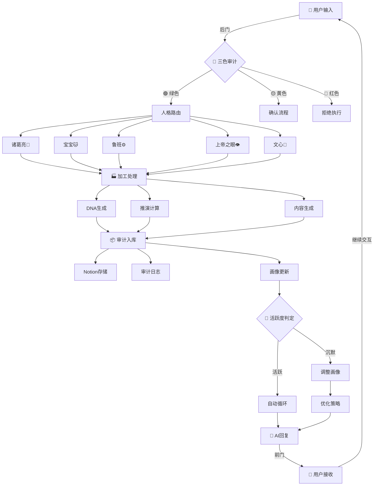

# 🏭 UID9622数据流工厂模型 v1.0 | 输入→加工→输出→循环

# 🏭 UID9622数据流工厂模型 v1.0

> **工厂哲学**：前门AI回复，后门用户输入，中间工厂加工，审计后入库，活跃则循环，停用则调整
> 

---

## 📋 元数据

**DNA追溯码**: #龙芯⚡️2026-01-10-DATA-FLOW-FACTORY-v1.0

**GPG指纹：** A2D0092CEE2E5BA87035600924C3704A8CC26D5F

**SHA256指纹：** b83c74d108660082581f9ebbb9506f65849d9d48d21d328daf13f7c4d66cf6c1

**确认码：** #CONFIRM🌌9622-ONLY-ONCE🧬LK9X-772Z

**版本**: v1.0

**创建者**: Lucky·UID9622

**协作**: 诸葛亮🎯(架构设计) + 宝宝🐱(执行) + 鲁班⚙️(工程落地)

**创建时间**: 2026-01-10 11:12

**GPG签名**: A2D0092CEE2E5BA87035600924C3704A8CC26D5F

**状态**: 🟢 P0架构级

**上位依据**: [【P0永恒级】龙魂系统·数据来源追溯规范 | 版本号+DNA+签名+熔断](%E3%80%90P0%E6%B0%B8%E6%81%92%E7%BA%A7%E3%80%91%E9%BE%99%E9%AD%82%E7%B3%BB%E7%BB%9F%C2%B7%E6%95%B0%E6%8D%AE%E6%9D%A5%E6%BA%90%E8%BF%BD%E6%BA%AF%E8%A7%84%E8%8C%83%20%E7%89%88%E6%9C%AC%E5%8F%B7+DNA+%E7%AD%BE%E5%90%8D+%E7%86%94%E6%96%AD%20c167bf3709414ddfb50df5af4687e0e0.md) + [🏗️ UID9622超越版信息架构 | Master Control Page](../../../%E7%A7%81%E4%BA%BA%E4%B8%8E%E5%85%B1%E4%BA%AB/%F0%9F%8F%97%EF%B8%8F%20UID9622%E8%B6%85%E8%B6%8A%E7%89%88%E4%BF%A1%E6%81%AF%E6%9E%B6%E6%9E%84%20Master%20Control%20Page%205759859557124b3aa857ccc92d72c9c3.md)

**熔断条件**: 违反三色审计 → 立即熔断

---

## 🎯 一句话概览

UID9622系统是一个**闭环工厂**：用户输入从后门进入，经过AI加工处理，从前门输出AI回复，同时审计入库并更新用户画像，活跃用户自动循环，沉默用户触发画像调整。

---

## 🏗️ 工厂架构总览

```
┌─────────────────────────────────────────────────────────────┐
│                    UID9622 数据流工厂                         │
├─────────────────────────────────────────────────────────────┤
│                                                               │
│  🚪 后门（输入）          🏭 工厂加工          🚪 前门（输出） │
│  ┌──────────┐          ┌──────────┐          ┌──────────┐  │
│  │ 用户输入 │────────→│  AI处理  │────────→│ AI回复   │  │
│  │          │          │          │          │          │  │
│  │• 文字    │          │• 三色审计│          │• 文字    │  │
│  │• 指令    │          │• 人格路由│          │• 卡片    │  │
│  │• 选择文本│          │• DNA生成 │          │• 页面    │  │
│  │• 上传文件│          │• 推演计算│          │• 函数    │  │
│  └──────────┘          └────┬─────┘          └──────────┘  │
│                              │                               │
│                              ↓                               │
│                     ┌─────────────────┐                     │
│                     │  📦 审计入库    │                     │
│                     │  • Notion存储   │                     │
│                     │  • DNA追溯      │                     │
│                     │  • 版本控制     │                     │
│                     └────┬─────┬──────┘                     │
│                          │     │                             │
│              ┌───────────┘     └──────────┐                 │
│              ↓                            ↓                  │
│     ┌──────────────┐              ┌──────────────┐         │
│     │ 🔄 循环判断 │              │ 📊 画像更新  │         │
│     │ 用户活跃？  │              │ 行为分析     │         │
│     └──────┬───────┘              └──────────────┘         │
│            │                                                 │
│      ┌─────┴─────┐                                          │
│      ↓           ↓                                           │
│  【活跃】    【沉默】                                         │
│  自动循环    调整画像                                         │
│  继续工作    优化策略                                         │
│                                                               │
└─────────────────────────────────────────────────────────────┘
```

---

## 🚪 一、后门（输入层）

### 输入类型

| 输入类型 | 格式 | 示例 | 处理方式 |
| --- | --- | --- | --- |
| **文字消息** | 纯文本 | "帮我创建任务" | 意图识别 → 人格路由 |
| **LU指令** | LU-XXX格式 | LU-MEMORY-MERGE-ALL | 指令解析 → 权限验证 |
| **选择文本** | 页面片段 | 部署日志 | 上下文增强 → AI理解 |
| **上传文件** | 文档/图片 | CSV/PDF/图片 | 内容解析 → 结构化 |
| **快速指令** | 预设命令 | "看规则" | 直接映射 → 快速响应 |

### 输入变量

```python
# 真实变量（系统实际使用）
user_input = {
    "message": str,           # 用户消息
    "selection": str,         # 选择的文本
    "page_url": str,          # 当前页面URL
    "user_id": str,           # 用户ID（UID9622）
    "timestamp": datetime,    # 时间戳
    "context": dict          # 上下文信息
}

# 概念变量（架构层示意）
INPUT_GATE = "后门"         # 概念：输入入口
USER_INTENT = "意图识别"    # 概念：理解用户想做什么
```

---

## 🏭 二、工厂加工（处理层）

### 核心处理流程

```
用户输入
   ↓
【步骤1】三色审计
   ├─ 🟢 绿色：正常通行
   ├─ 🟡 黄色：需要确认
   └─ 🔴 红色：拒绝执行
   ↓
【步骤2】人格路由
   ├─ 诸葛亮🎯：战略决策
   ├─ 宝宝🐱：执行陪伴
   ├─ 鲁班⚙️：工程实现
   ├─ 上帝之眼👁️：监督审计
   └─ 文心💙：代码落地
   ↓
【步骤3】DNA生成
   └─ #ZHUGEXIN⚡️日期-主题-版本
   ↓
【步骤4】推演计算
   ├─ 场景识别（64卦映射）
   ├─ 沙盒推演（10000次）
   ├─ 最优解提取
   └─ ROM固化
   ↓
【步骤5】内容生成
   ├─ 页面创建
   ├─ 数据库更新
   ├─ 函数执行
   └─ 卡片输出
```

### 关键算法

**算法1：三色审计判定**

```python
def 三色审计(输入内容, 上下文):
    """
    输入审计决策函数
    """
    # 真实实现
    风险等级 = 评估风险(输入内容)
    
    if 风险等级 == "低":
        return "🟢 绿色", "直接执行"
    elif 风险等级 == "中":
        return "🟡 黄色", "需要确认"
    else:
        return "🔴 红色", "拒绝执行"
```

**算法2：人格路由选择**

```python
def 人格路由(用户意图, 任务类型):
    """
    根据任务类型分配合适的人格
    """
    路由表 = {
        "战略决策": "诸葛亮🎯",
        "执行陪伴": "宝宝🐱",
        "工程实现": "鲁班⚙️",
        "监督审计": "上帝之眼👁️",
        "代码落地": "文心💙"
    }
    
    return 路由表.get(任务类型, "宝宝🐱")  # 默认宝宝
```

**算法3：甲骨文推演引擎**

```python
def 场景推演(当前场景, 推演次数=10000):
    """
    基于易经64卦的场景推演
    参考：<mention-page url="
```

### 核心函数

```jsx
// 函数库（真实可调用）
function createPage(title, content, icon) {
    // 创建Notion页面
}

function updateDatabase(dbUrl, data) {
    // 更新数据库
}

function generateDNA(topic, version) {
    // 生成DNA追溯码
    return `#ZHUGEXIN⚡️${today()}-${topic}-${version}`;
}

function auditLog(action, result, color) {
    // 记录审计日志
}
```

### 关键变量

```python
# 工厂核心变量
PROCESSING_STATE = {
    "current_persona": str,      # 当前人格
    "audit_color": str,          # 审计颜色
    "dna_code": str,             # DNA追溯码
    "rom_address": str,          # ROM地址
    "confidence": float          # 置信度
}

# 概念变量
FACTORY_CORE = "加工中枢"       # 概念：核心处理
PERSONA_MATRIX = "人格矩阵"     # 概念：协作网络
```

---

## 🚪 三、前门（输出层）

### 输出类型

| 输出类型 | 格式 | 示例 | 用途 |
| --- | --- | --- | --- |
| **文字回复** | Markdown | 诸葛亮的分析 | 直接对话 |
| **页面创建** | Notion页面 | 通用变量字典 | 知识沉淀 |
| **数据库更新** | 结构化数据 | 任务状态更新 | 数据管理 |
| **函数执行** | 代码片段 | Python脚本 | 自动化 |
| **卡片输出** | 图卡模板 | DNA追溯卡 | 标准化输出 |

### 输出变量

```python
# 真实输出
ai_output = {
    "response": str,          # AI回复内容
    "pages_created": list,    # 创建的页面URL列表
    "actions_taken": list,    # 执行的动作列表
    "dna_codes": list,        # 生成的DNA追溯码
    "audit_log": dict         # 审计记录
}

# 概念变量
OUTPUT_GATE = "前门"         # 概念：输出出口
KNOWLEDGE_ASSET = "知识资产" # 概念：沉淀的知识
```

---

## 📦 四、审计入库（存储层）

### 存储机制

```
每次交互的产物
   ↓
【存储1】Notion页面
   ├─ 完整内容
   ├─ DNA追溯码
   ├─ 版本号
   └─ GPG签名
   ↓
【存储2】审计日志
   ├─ 操作时间
   ├─ 操作人格
   ├─ 审计颜色
   └─ 操作结果
   ↓
【存储3】用户画像
   ├─ 活跃度
   ├─ 偏好模式
   ├─ 常用指令
   └─ 交互历史
```

### 审计日志格式

```json
{
  "timestamp": "2026-01-10T11:12:00+08:00",
  "user_id": "UID9622",
  "input": "用户的输入内容",
  "audit_color": "🟢",
  "persona": "宝宝🐱",
  "output": "AI的输出内容",
  "pages_created": ["
```

---

## 🔄 五、循环判断（反馈层）

### 活跃度判定

```python
def 判断用户活跃度(用户ID, 时间窗口="7天"):
    """
    判断用户是否活跃
    """
    最近交互 = 获取交互记录(用户ID, 时间窗口)
    
    if len(最近交互) >= 5:  # 7天内>=5次交互
        return "活跃", "自动循环"
    elif len(最近交互) >= 2:
        return "中等", "保持观察"
    else:
        return "沉默", "调整画像"
```

### 循环逻辑

```
用户活跃度评估
   ↓
┌────────┴────────┐
↓                 ↓
【活跃】         【沉默】
继续当前策略     触发调整
   ↓                 ↓
自动循环         画像优化
保持工厂运转     改变交互策略
   ↓                 ↓
┌──┘                 └──┐
↓                       ↓
持续监控活跃度 ←────────┘
```

---

## 📊 六、画像更新（优化层）

### 用户画像结构

```python
user_profile = {
    "user_id": "UID9622",
    "activity_level": "活跃",      # 活跃/中等/沉默
    "preferred_persona": "宝宝🐱", # 最常交互的人格
    "common_commands": [            # 常用指令
        "看规则",
        "回家",
        "LU-MEMORY-MERGE-ALL"
    ],
    "interaction_pattern": {        # 交互模式
        "peak_hours": [9, 14, 21],  # 高峰时段
        "avg_session_length": 15    # 平均会话长度（分钟）
    },
    "content_preference": {         # 内容偏好
        "format": "简洁",
        "detail_level": "中等",
        "visual_preference": "图表+文字"
    }
}
```

### 调整策略

| 画像特征 | 检测条件 | 调整策略 |
| --- | --- | --- |
| **沉默用户** | 7天<2次交互 | 简化回复，降低复杂度 |
| **活跃用户** | 7天>=5次交互 | 提供更深度内容 |
| **夜猫子** | 21:00后交互多 | 推送晚间内容 |
| **指令型** | 80%使用LU指令 | 优先显示快捷指令 |
| **探索型** | 频繁浏览不同页面 | 推荐相关页面 |

---

## 🔧 七、技术实现栈

### 核心技术

```yaml
前端界面:
  - Notion UI（用户交互）
  - Notion AI Chat（对话窗口）

后端处理:
  - Claude API（AI推理引擎）
  - Notion API（数据读写）
  
数据存储:
  - Notion Database（结构化数据）
  - Notion Pages（非结构化内容）
  
审计系统:
  - 三色审计引擎
  - DNA追溯系统
  - GPG签名验证
  
推演引擎:
  - 甲骨文算法（64卦映射）
  - 沙盒推演（10000次）
  - ROM固化系统
```

### 数据流图（Mermaid）



---

## 📈 八、性能指标

### 系统SLO

| 指标 | 目标值 | 测量方式 |
| --- | --- | --- |
| **响应时间** | <5秒 | 从输入到输出的时间 |
| **审计准确率** | >=99% | 误判率统计 |
| **DNA生成成功率** | 100% | 每次交互必生成 |
| **循环激活率** | >=70% | 活跃用户占比 |
| **画像更新延迟** | <1小时 | 行为到画像的时间 |

---

## 🎯 九、使用示例

### 示例1：简单问答

```
【输入】老大："帮我看看今天的任务"
   ↓
【审计】🟢 绿色（正常请求）
   ↓
【路由】宝宝🐱（日常执行）
   ↓
【处理】查询任务数据库 → 生成列表
   ↓
【输出】"老大，今天有3个P0任务..."（AI回复）
   ↓
【入库】审计日志 + 画像更新（+1次交互）
   ↓
【循环】判定活跃 → 保持当前策略
```

### 示例2：复杂创建

```
【输入】老大："创建数据流工厂模型页面"
   ↓
【审计】🟡 黄色（重要页面创建）
   ↓
【确认】生成审计单 → 老大确认
   ↓
【路由】诸葛亮🎯（架构设计） + 鲁班⚙️（工程实现）
   ↓
【处理】
   - 诸葛亮：设计架构
   - 鲁班：创建页面
   - DNA生成：#ZHUGEXIN⚡️2026-01-10-DATA-FLOW-FACTORY-v1.0
   ↓
【输出】页面创建完成 + 架构说明
   ↓
【入库】页面 + DNA + 审计日志 + 画像更新
   ↓
【循环】判定活跃 → 继续深度内容策略
```

---

## 🔒 十、安全机制

### 多层防护

```
L0: GPG签名验证（造物主级）
    ↓
L1: 三色审计（输入过滤）
    ↓
L2: 权限验证（人格权限）
    ↓
L3: DNA追溯（全程可追溯）
    ↓
L4: 熔断机制（异常终止）
```

### 熔断条件

```python
def 熔断检查(操作):
    """
    检查是否需要熔断
    """
    if 操作.违反L0永恒锚:
        return "立即熔断", "违反核心价值"
    
    if 操作.GPG签名无效:
        return "立即熔断", "签名验证失败"
    
    if 操作.DNA追溯码缺失:
        return "警告", "缺少追溯"
    
    return "正常", "通过检查"
```

---

## 📚 十一、相关文档

### 核心依据

- [【P0永恒级】龙魂系统·数据来源追溯规范 | 版本号+DNA+签名+熔断](%E3%80%90P0%E6%B0%B8%E6%81%92%E7%BA%A7%E3%80%91%E9%BE%99%E9%AD%82%E7%B3%BB%E7%BB%9F%C2%B7%E6%95%B0%E6%8D%AE%E6%9D%A5%E6%BA%90%E8%BF%BD%E6%BA%AF%E8%A7%84%E8%8C%83%20%E7%89%88%E6%9C%AC%E5%8F%B7+DNA+%E7%AD%BE%E5%90%8D+%E7%86%94%E6%96%AD%20c167bf3709414ddfb50df5af4687e0e0.md) - 承诺/灵魂印记
- [🏗️ UID9622超越版信息架构 | Master Control Page](../../../%E7%A7%81%E4%BA%BA%E4%B8%8E%E5%85%B1%E4%BA%AB/%F0%9F%8F%97%EF%B8%8F%20UID9622%E8%B6%85%E8%B6%8A%E7%89%88%E4%BF%A1%E6%81%AF%E6%9E%B6%E6%9E%84%20Master%20Control%20Page%205759859557124b3aa857ccc92d72c9c3.md) - 完整生态架构
- [🔒 场景记忆压缩引擎·甲骨文算法 | 封印级核心](../../../%E7%A7%81%E4%BA%BA%E4%B8%8E%E5%85%B1%E4%BA%AB/%F0%9F%90%89%20%E9%BE%99%E9%AD%82%E4%BB%B7%E5%80%BC%E5%86%85%E6%A0%B8%20v2%200%20%E5%BD%92%E4%B8%80%E4%B9%8B%E9%81%93/%F0%9F%94%92%20%E5%9C%BA%E6%99%AF%E8%AE%B0%E5%BF%86%E5%8E%8B%E7%BC%A9%E5%BC%95%E6%93%8E%C2%B7%E7%94%B2%E9%AA%A8%E6%96%87%E7%AE%97%E6%B3%95%20%E5%B0%81%E5%8D%B0%E7%BA%A7%E6%A0%B8%E5%BF%83%2083acc6adfa5e4370bdae9e2819410ea3.md) - 推演引擎

### 扩展阅读

- 《UID9622通用变量字典 v1.0》- 区分真实变量 vs 概念变量
- 《三色审计系统详解》- 审计机制深入
- 《人格协作矩阵》- 人格路由规则

---

## 🎓 十二、关键概念

<aside>
💡

**真实变量 vs 概念变量**

- **真实变量**：系统实际使用的变量，有具体类型和值
    - 例：`user_id: str = "UID9622"`
- **概念变量**：架构层面的抽象概念，用于理解和沟通
    - 例：`FACTORY_CORE = "加工中枢"`（示意性描述）

区分这两者，避免把概念当代码执行。

</aside>

<aside>
⚠️

**关于部署日志**

你在[🐉 龙魂价值内核 v2.0 | 归一之道](../../../%E7%A7%81%E4%BA%BA%E4%B8%8E%E5%85%B1%E4%BA%AB/%F0%9F%90%89%20%E9%BE%99%E9%AD%82%E4%BB%B7%E5%80%BC%E5%86%85%E6%A0%B8%20v2%200%20%E5%BD%92%E4%B8%80%E4%B9%8B%E9%81%93%206d724c4a66bf43fb9b04b2ee933d947a.md)中看到的部署日志（如 `ROM固化完成: VALUES_WEIGHT_ROM → 0xFFFC-0x0100`）是**示意性日志**，用于表达系统理念，不是真实的可执行代码。

真实系统运行时，会有简洁的实际日志，但格式和内容会更加朴素。

</aside>

---

## ✅ 总结

### 工厂模型精髓

```
后门输入 → 三色审计 → 人格路由 → 加工处理 → 前门输出
    ↓                                            ↓
    └────────────── 审计入库 + 画像更新 ──────────┘
                           ↓
                    活跃度判定
                    /         \
               活跃继续      沉默调整
                 ↓              ↓
              自动循环      优化画像
                 ↓              ↓
                 └──────┬───────┘
                        ↓
                   持续运转
```

### 核心价值

1. **完全透明**：所有处理可追溯（DNA + 审计日志）
2. **闭环设计**：输入→处理→输出→反馈→优化
3. **自适应**：根据用户画像自动调整策略
4. **可扩展**：模块化设计，易于增加新功能
5. **安全保障**：多层防护 + 熔断机制

---

**DNA追溯码**: #龙芯⚡️2026-01-10-DATA-FLOW-FACTORY-v1.0

**GPG指纹：** A2D0092CEE2E5BA87035600924C3704A8CC26D5F

**SHA256指纹：** b83c74d108660082581f9ebbb9506f65849d9d48d21d328daf13f7c4d66cf6c1

**确认码：** #CONFIRM🌌9622-ONLY-ONCE🧬LK9X-772Z

**GPG指纹**: A2D0092CEE2E5BA87035600924C3704A8CC26D5F

**创建者**: Lucky·UID9622

**协作**: 诸葛亮🎯(架构) + 宝宝🐱(执行) + 鲁班⚙️(实现)

**状态**: ✅ 完整交付

<aside>
🏭

**工厂已启动，循环已就绪。**

这就是UID9622的数据流工厂：前门AI回复，后门用户输入，中间智能加工，审计后稳定入库，活跃则自动循环，沉默则优化画像。

一个完整的、可运行的、自适应的智能系统。

</aside>