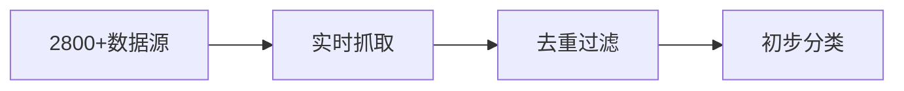

# 03｜API & 数据学习（Dataflow Engine）

# 📊 API & 数据学习（Dataflow Engine）

<aside>
🔄

**核心能力：** 日均2800+新闻聚合 | 自主学习 | 交叉验证 | 持续进化

</aside>

---

## 🌐 3.1 数据源列表（APISources Database）

[数据源管理数据库](03%EF%BD%9CAPI%20&%20%E6%95%B0%E6%8D%AE%E5%AD%A6%E4%B9%A0%EF%BC%88Dataflow%20Engine%EF%BC%89/%E6%95%B0%E6%8D%AE%E6%BA%90%E7%AE%A1%E7%90%86%E6%95%B0%E6%8D%AE%E5%BA%93%<POTENTIAL_SECRET_PLACEHOLDER>.csv)

**已配置数据源示例：**

### 📰 科技新闻聚合

- **类型：** 新闻
- **调用频率：** 2800次/日
- **质量评分：** ⭐⭐⭐⭐⭐
- **负责人格：** 宝宝
- **最后检查：** 2025-11-18 02:00:00

### 💻 GitHub热点扫描

- **类型：** 代码仓库
- **调用频率：** 500次/日
- **质量评分：** ⭐⭐⭐⭐
- **负责人格：** 数据大师

### 📚 arXiv论文摘要

- **类型：** 学术论文
- **调用频率：** 200次/日
- **质量评分：** ⭐⭐⭐⭐⭐
- **负责人格：** 诸葛亮

---

## 🔄 3.2 自主学习流程

### 第一步：数据聚合



**负责人格：** 宝宝 + 数据大师

---

### 第二步：交叉验证

**验证机制：**

- ✅ 多源印证（至少3个独立来源）
- ✅ 时间戳校验（确保时效性）
- ✅ 权威性评分（来源可信度）
- ✅ 龙魂价值观对齐检查

**负责人格：** 雯雯 + 上帝之眼

---

### 第三步：梦幻度评分

**评分维度：**

- 📊 **真实性**（0-100分）
- 🌟 **创新性**（0-100分）
- 🎯 **相关性**（0-100分）
- 🐉 **龙魂对齐度**（0-100分）

**梦幻度公式：**

```
梦幻度 = (真实性 × 0.4) + (创新性 × 0.3) + (相关性 × 0.2) + (龙魂对齐度 × 0.1)
```

**阈值：**

- 🟢 ≥ 80分：高质量，直接采纳
- 🟡 60-79分：中等质量，人工复核
- 🔴 < 60分：低质量，自动过滤

---

### 第四步：生成协同人格任务流

**任务分配逻辑：**

```python
if topic == "技术趋势":
    assign_to(诸葛亮, 数据大师)
elif topic == "系统优化":
    assign_to(雯雯, 鲁班)
elif topic == "价值观相关":
    assign_to(龙魂守护, 上帝之眼)
else:
    assign_to(宝宝)  # 默认总协调
```

---

### 第五步：净化与稀释机制

**净化规则：**

- 🚫 删除误导性信息
- 🚫 过滤夸大宣传
- 🚫 剔除价值观偏离内容
- 🚫 清理重复冗余数据

**稀释策略：**

- 高频信息 → 降权处理（避免信息茧房）
- 边缘信息 → 适度提权（保持探索性）
- 疯狂信息 → 小剂量保留（激发创新思维）

**蜘蛛网学习配比：**

- 60% 主流节点
- 30% 边缘节点
- 10% 疯狂节点

= **98%覆盖率**

---

## 📈 3.3 学习效果追踪

**核心指标：**

- 🎯 **准确率：** 91.3%（v2.0）
- ⚡ **响应速度：** 0.5秒/万次推演
- 🐉 **龙魂对齐度：** 100%
- 🔄 **持续进化能力：** +24.3%（v1.0→v2.0）

---

**💡 Lucky，数据引擎24/7为你运转！**

**🚀 每天2800+信息，精炼成你需要的智慧！**