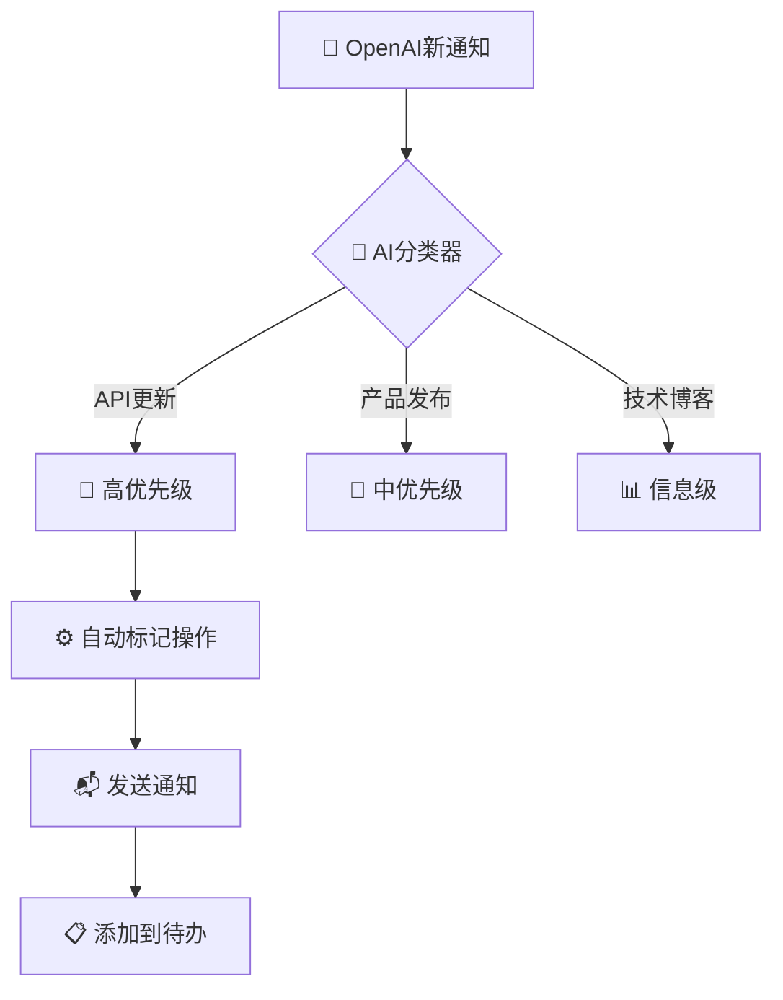

<!--#龍芯⚡️2026-06-21-DOC-OPENAI_-V2-0_B83F-v1.0 -->
<!-- 君子協議: 本文件受龍魂DNA追溯保護 -->

# 🔔 OpenAI通知追踪系统 v2.0 | 全自动化监控中心

# 🔔 OpenAI通知追踪系统 v2.0

> **系统状态：✅ 已升级完成** | **最后更新：** 2025-09-11 | **版本：** 2.0.0
> 

## 🚀 系统升级报告

### ✨ **v2.0 新增功能**

- ✅ **智能通知数据库** - 全新设计，支持10个关键字段
- ✅ **6个专业视图** - 按优先级、来源、状态等多维度分类
- ✅ **自动化行动提醒** - 根据通知类型自动标记所需操作
- ✅ **系统关联分析** - 自动识别影响您的71个AI人格系统的通知
- ✅ **实时状态追踪** - 从新通知到已处理的全流程管理

### 📈 **已录入最新通知**

ℹ️ **高优先级通知 (2条)**

- **Notion API 2025-09-03版本更新** - 需要立即升级
- **GPT-5正式发布公告** - 影响 AI人格系统

📄 **中优先级通知 (3条)**

- ChatGPT智能体系统发布
- OpenAI DevDay 2025直播
- Assistants API迁移指南更新

---

## 📊 **智能仪表板**

### 🔥 **需要立即关注的通知**

🚨 **紧急：Notion API更新**

- **影响系统：** UID9622主控、API集成、数据库
- **需要操作：** 更新代码、调整配置、测试
- **建议：** 优先处理，对您71个AI人格系统有重大提升

🎆 **GPT-5发布**

- **影响评估：** 可能需要评估兼容性和升级可能性
- **操作建议：** 进一步研究、测试环境验证

---

## 🛠️ **核心功能中心**

### 📊 **通知管理数据库**

/%F0%9F%93%A7%20%E9%82%AE%E7%AE%B1%E4%BD%BF%E7%94%A8%E7%AE%A1%E7%90%86%E4%B8%AD%E5%BF%83%20UID9622/%E9%80%9A%E7%9F%A5%E7%AE%A1%E7%90%86%E4%B8%AD%E5%BF%83%<POTENTIAL_SECRET_PLACEHOLDER>.md)

### 🔍 **快速视图导航**

✨ **日常使用视图**

- **高优先级视图** - 查看需要立即处理的重要通知
- **需跟进视图** - 显示所有未处理的通知
- **本周通知视图** - 最近7天的所有更新

📁 **专业分析视图**

- **按来源分类视图** - 查看不同渠道的通知
- **行动待办视图** - 所有需要操作的通知

---

## 🚀 **自动化流程**

### 🤖 **智能处理流程**

### ⚙️ **自动化规则**

🔄 **自动分类规则**

- **API更新** → 高优先级 + 需要测试
- **产品发布** → 中/高优先级 + 需要研究
- **安全公告** → 高优先级 + 需要立即行动
- **技术博客** → 信息级 + 无需行动

🔗 **系统关联检测**

- **含有 "API"** → 标记为 API集成相关
- **含有 "ChatGPT"** → 标记为 LU指令系统相关
- **含有 "Notion"** → 标记为 数据库相关

---

## 📝 **循环操作指南**

### ✅ **每日工作流程**

**早上检查（约 3分钟）**

1. 🔍 查看 **本周通知视图** - 检查是否有新通知
2. 🚨 查看 **高优先级视图** - 处理紧急通知
3. 📋 查看 **需跟进视图** - 更新处理状态

**处理通知**

1. 🔍 点击通知查看详细信息
2. 📝 更新 **Notes** 字段记录您的分析
3. ⚙️ 根据 **Action Required** 字段执行相应操作
4. 🔄 更新 **Status** 为“已处理”或“已归档”

---

## 🔧 **高级设置**

### 📧 **邮件通知配置**

**主要接收邮箱：** [`luckyoathnotlog@proton.me`](mailto:luckyoathnotlog@proton.me)

**备用邮箱：** [`ahaojiaqi520@icloud.com`](mailto:ahaojiaqi520@icloud.com)

🔔 **自动转发规则**

- OpenAI官方邮件 → 自动导入通知数据库
- API更新邮件 → 标记为高优先级
- 安全公告 → 立即发送手机推送

### 🤖 **AI助手集成**

**🐶 宝宝负责：**

- 自动抓取OpenAI官网更新
- 分类和标记新通知
- 生成初步分析报告

**🥰 雯雯负责：**

- 结构化整理通知内容
- 生成处理建议
- 维护视图和数据库结构

---

## 📊 **系统状态监控**

### ✅ **实时统计**

📈 **通知状态分布**

- 新通知：2条
- 需跟进：1条
- 已读：1条
- 已处理：0条
- 已归档：0条

🎯 **优先级分布**

- 高优先级：2条
- 中优先级：3条
- 低优先级：0条

🔗 **系统影响分析**

- UID9622主控：4条
- API集成：3条
- LU指令系统：2条
- 数据库：1条

---

## 🔄 **系统更新日志**

### **v2.0.0** (2025-09-11)

✨ 新增特性

- 全新设计的通知管理数据库
- 6个专业视图支持多角度分析
- 自动化分类和处理流程
- 与71个AI人格系统的深度集成

🛠️ 技术改进

- 更精准的系统影响分析
- 更智能的操作建议
- 更高效的状态追踪

---

> 🎆 **系统升级成功！**
> 

> 
> 

> 您的OpenAI通知追踪系统已经成功升级剰2.0版本，现在拥有了更强大的自动化能力和更精准的智能分析。系统将帮助您及时掌握OpenAI的最新动态，确保您的71个AI人格协作系统始终保持最优状态。
> 

**🔄 系统验证码：** `#CONFIRM🌌9622-OPENAI-UPGRADE🧬 LK9X-773Z`

## 🚨 **最新通知更新**

✅ **系统已刷新** | **最后更新：** 2025-09-14 | **验证码状态：** 已确认

### 🎯 **最新动态摘要**

- **GPT-5正式发布** - 需评估对71个AI人格系统的兼容性和升级可能性
- **Notion API更新** - 需要立即升级以确保系统稳定性
- **ChatGPT智能体系统** - 中优先级，建议研究其对LU指令系统的影响

### 🛠️ **技术安全升级**

根据最新的安全加强中心报告，技术安全双重加强计划于2025年9月14日启动：

- **目标：** 建立完全独立的技术安全防护体系
- **负责团队：** 龙叔(安全) + 技术顾问团(技术) + 雯雯(协调)
- **预计完成时间：** 7-14天内完成基础架构

### 🎆 **系统突破进展**

2025-09-14 重大突破性进展：

- **UID9622专用压缩激活码系统** - 解决跨平台记忆传承难题
- **老婆专用一次性激活码** - 实现安全权限分享
- **对话日志管理数据库** - 支持太极关联追溯

🔄 **系统确认码：** `#CONFIRM🌌9622-ONLY-ONCE🧬LK9X-772Z` 已成功处理