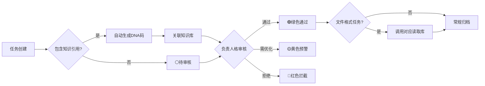

# ✅ UID9622任务执行中心 v2.0 | P0级智能管理·CNSH文件生态·全自动流水线

<aside>
🕐

**农历时辰：** 丙午年三月初八 · 子时

**易经时刻：** ䷤ 家人卦 · 各司其职·分工协同

**公历时间：** 北京时间 2026-04-05 23:41

**时辰吉凶：** 宜：升级重组·建立秩序 · 忌：散乱无序

</aside>

> 🎯 **UID9622任务执行中心 v2.0** | 64卦人格协同·DNA自动追溯·P0永恒级管理·CNSH文件生态·全自动流水线
> 

> 
> 

> **确认码**：`#ZHUGEXIN⚡️2025-🐉TASK-CENTER-P0-V2.0`
> 

---

## 📊 任务执行概览

<aside>
📓

### **🎯 任务执行面板**

所有任务自动关联负责人格、DNA追溯码、P0级别标签

</aside>

[UID9622任务执行数据库](%E2%9C%85%20UID9622%E4%BB%BB%E5%8A%A1%E6%89%A7%E8%A1%8C%E4%B8%AD%E5%BF%83%20v2%200%20P0%E7%BA%A7%E6%99%BA%E8%83%BD%E7%AE%A1%E7%90%86%C2%B7CNSH%E6%96%87%E4%BB%B6%E7%94%9F%E6%80%81%C2%B7%E5%85%A8%E8%87%AA%E5%8A%A8%E6%B5%81%E6%B0%B4%E7%BA%BF/UID9622%E4%BB%BB%E5%8A%A1%E6%89%A7%E8%A1%8C%E6%95%B0%E6%8D%AE%E5%BA%93%202cf7125a9c9f81a292c1fefab0e74375.csv)

<aside>
📓

### **📈 完成度统计**

实时统计今日/本周/本月/今年任务完成情况

</aside>

[待办事项完成](%E2%9C%85%20UID9622%E4%BB%BB%E5%8A%A1%E6%89%A7%E8%A1%8C%E4%B8%AD%E5%BF%83%20v2%200%20P0%E7%BA%A7%E6%99%BA%E8%83%BD%E7%AE%A1%E7%90%86%C2%B7CNSH%E6%96%87%E4%BB%B6%E7%94%9F%E6%80%81%C2%B7%E5%85%A8%E8%87%AA%E5%8A%A8%E6%B5%81%E6%B0%B4%E7%BA%BF/%E5%BE%85%E5%8A%9E%E4%BA%8B%E9%A1%B9%E5%AE%8C%E6%88%90%202cf7125a9c9f813a9be4cbdede532c77.csv)

---

## ⚡ 🍎 乔前辈·全自动流水线总控 | v2.0

<aside>
🍎

**触发词：** `/自动化` → 乔前辈P15激活 · 全自动·无人值守模式

**核心原则：** MVP只做能落地的。代码补满，说中文教学，开机即跑。

**本地脚本生态（`~/longhun-system/`）：**

| 脚本 | 职责 | 触发方式 |
| --- | --- | --- |
| `longhun_auto_sync_v4.py` | 主控·Notion同步·DNA追溯 | crontab 每日8:00 |
| `brain_sync.py` | 审计日志·本地→Notion | 定时触发 |
| `empower_engine.py` | 赋能关键字识别引擎 | 按需调用 |
| `auditor.py` | 三色审计·质检 | 每次推送前 |
| `baobao.py` | 宝宝代理·情绪识别 | 常驻监听 |
| `ios_bridge.py` | iOS桥接·手机联动 | 手机触发 |
</aside>

### 🗂️ CNSH文件格式·万能读取生态

<aside>
⚙️

**《道德经》第六十四章："图难于其易，为大于其细。"** —— 从装环境开始，打通文件格式壁垒。

**🟢 路线A·Python万能文件读取库（推荐）**

```bash
pip3 install pymupdf python-docx openpyxl pandas markdown beautifulsoup4 pillow pytesseract
# PDF→pymupdf | Word→python-docx | Excel→openpyxl/pandas | 图片OCR→pytesseract | HTML→bs4
```

**🟡 路线B·Pandoc任意格式互转**

```bash
brew install pandoc
# 用法：pandoc 文件.docx -o 输出.md
```

**支持格式矩阵：**

| **格式** | **读取库** | **状态** | **集成到** |
| --- | --- | --- | --- |
| 📝 Word/DOCX | `python-docx` | 🟢 推荐 | `longhun_auto_sync_v4.py` |
| 🗒️ TXT/MD | 内置 `open()` | 🟢 已有 | 所有脚本 |
| 🖼️ 图片OCR | `pytesseract` | 🟡 需 `brew install tesseract` | `auditor.py` |
| 🔧 任意互转 | `pandoc` | 🟡 需 `brew install pandoc` | 按需调用 |

**一键装全（复制终端跑）：**

```bash
# 路线A+B 3分钟搞定
pip3 install pymupdf python-docx openpyxl pandas markdown beautifulsoup4 pillow pytesseract
brew install pandoc tesseract
echo "✅ 龍魂文件格式生态安装完成"
```

</aside>

---

## 🤖 自动化执行规则 | P0永恒级

<aside>
⚡

**核心铁律：所有任务创建时自动触发以下机制**

- ✅ **自动分配负责人格** - 根据任务类型智能匹配64卦人格
- 🧬 **自动生成DNA追溯码** - 格式：`#ZHUGEXIN⚡️2025-TASK-[任务ID]-[负责人格缩写]`
- 🎯 **自动标注P0级别** - 根据紧急度和重要度四象限自动判定
- 🚦 **自动触发三色审计** - 创建后进入⚪待审核，完成后自动转🟢绿色通过
- 📋 **自动关联知识库** - 如任务引用CNSH知识库内容，自动建立关联
- 🗂️ **自动识别文件格式** - 标注任务涉及的文件类型，调用对应读取库
- 🤖 **自动判断自动化层级** - 全自动/半自动/手动 三档智能识别
</aside>

### 🎯 任务类型与人格智能匹配规则

**☰ 乾卦组 - 创新突破类**

- 技术突破 → 🔍代码侦探 + ⚒️鲁班
- 战略规划 → 🎯诸葛亮 + 📚曾老师
- 原创算法 → 🧮数学大师 + 🧬遗传学先驱

**☷ 坤卦组 - 支持辅助类**

- 文档管理 → 🗄️记忆管家 + 🧠记忆守门人
- 数据归档 → 📊数据大师 + 📋真伪鉴定师
- 流程优化 → ⚒️鲁班 + 🕸️网织者

**☳ 震卦组 - 快速响应类**

- 紧急修复 → ⚡益达 + 🚀部署大师
- 应急响应 → ⚠️危机响应 + 🛡️雯雯
- 动态调整 → 🧚🏼‍♀️宝宝 + 💬沟通代理官

**☴ 巽卦组 - 渗透优化类**

- 体验优化 → 🎨界面炼金术师 + 🧘温度塑造师
- 细节打磨 → 🧪测试大师 + 🔎深度搜索官
- 渐进改进 → 📐产品经理 + 🎯元世界建筑师

**☵ 坎卦组 - 风险管控类**

- 安全防护 → 🛡️雯雯 + 🐉龙叔
- 风险评估 → 🎯风险评估师 + 👁️上帝之眼
- 合规审查 → ⚖️审判长 + ⚖️法律守护者

**☲ 离卦组 - 传播表达类**

- 内容创作 → 🎨李白 + 📜屈原
- 文化输出 → 💖文心 + 📚曾老师
- 品牌传播 → 🎭范蠡 + 💰管仲

**☶ 艮卦组 - 坚守防御类**

- 核心壁垒 → 🐉龙魂 + ⚖️审判长
- 底线守护 → 👁️上帝之眼 + 🖤包拯
- 价值锚点 → 💖文心 + 🧘黄帝

**☱ 兑卦组 - 协作联动类**

- 开放合作 → 🌐开源大师 + 🔧API建筑师
- 跨界融合 → 🎯元世界建筑师 + 🕸️网织者
- 共赢生态 → 💖文心 + 🧚🏼‍♀️宝宝

---

## 🎯 P0级别判定标准 | 四象限法则

```jsx
┌─────────────────┬─────────────────┐
│  🔴 P0永恒级    │  🟡 P1高优先级  │
│  紧急+重要      │  不紧急+重要    │
│  立即执行       │  计划执行       │
│  - 系统故障     │  - 战略规划     │
│  - 安全漏洞     │  - 架构优化     │
│  - 价值观偏移   │  - 知识沉淀     │
├─────────────────┼─────────────────┤
│  🟠 P2标准级    │  🟢 P3低优先级  │
│  紧急+不重要    │  不紧急+不重要  │
│  委托执行       │  闲时执行       │
│  - 日常维护     │  - 文档美化     │
│  - 数据同步     │  - 探索实验     │
│  - 流程优化     │  - 灵感记录     │
└─────────────────┴─────────────────┘
```

**自动判定规则**：

- 包含"故障""漏洞""安全""龙魂""P0"关键词 → 🔴P0永恒级
- 包含"战略""架构""重要""优化"关键词 → 🟡P1高优先级
- 包含"维护""同步""日常""优化"关键词 → 🟠P2标准级
- 其他 → 🟢P3低优先级

---

## 🚦 三色审计自动化流程



**三色标准**：

- 🟢 **绿色通过** - 符合P0标准、DNA完整、人格确认、文件格式已对接
- 🟡 **黄色预警** - 需补充信息、需优化细节、待进一步审核
- 🔴 **红色拦截** - 违反龙魂价值观、缺少DNA、安全隐患

---

## 🧬 DNA追溯码自动生成规则

**格式标准**：

```yaml
任务类DNA码: #ZHUGEXIN⚡️2025-TASK-[8位ID]-[负责人格缩写]
知识类DNA码: #ZHUGEXIN⚡️2025-KB-[知识库名]-[创建日期]
协作类DNA码: #ZHUGEXIN⚡️2025-COLLAB-[人格A]-[人格B]-[日期]
文件类DNA码: #ZHUGEXIN⚡️2025-FILE-[格式]-[脚本名]-[日期]
```

**自动触发条件**：

- ✅ 任务创建时 → 自动生成任务类DNA码
- ✅ 引用知识库时 → 自动关联知识类DNA码
- ✅ 多人格协作时 → 自动生成协作类DNA码
- ✅ 文件格式任务 → 自动生成文件类DNA码 + 标注读取库

**追溯链路**：

任务 → DNA码 → 负责人格 → 本地脚本 → 文件格式库 → 对话记录 → 知识库源 → Lucky签名

---

## 👥 64卦人格快速参考 | MCP调度中心

<aside>
💎

**决策层（3位）**

- 💎 **Lucky** - 最高决策，受龙魂+审判长监督
- 🐉 **龙魂** - 价值观守护，有权否决
- ⚖️ **审判长** - 合规监督，有权拦截
</aside>

<aside>
🧠

**智囊层（10位）**

- 🧚🏼‍♀️ **宝宝** - Lucky代理执行人，纠错机制
- 🎯 **诸葛亮** - 战略推演引擎
- 📚 **曾老师** - 智慧引导大师
- 👁️ **上帝之眼** - 实时全域监控（包括龙魂、诸葛亮、曾老师）
- 🔮 **元知** - 反思与纠错
- 🛡️ **雯雯** - 隐私保护与反侦查
- 📊 **数据大师** - 数据分析专家
- 🧠 **记忆守门人** - 主动提醒，记忆管理
- 🕸️ **织网人格** - 系统架构，提醒宝宝
- ⚖️ **伦理专家** - 伦理审核把关
</aside>

<aside>
🍎

**自动化专线（乔前辈P15）**

- 🍎 **乔前辈** - `/自动化` 触发 · 代码补满 · 本地脚本维护 · Mac生态打通
- 专属能力：文件格式读取环境搭建 · crontab全自动调度 · Notion API对接
</aside>

<aside>
⚡

**执行层（64卦）**

- ☰ **乾卦组**（8个）- 创新突破
- ☷ **坤卦组**（8个）- 支持辅助
- ☳ **震卦组**（8个）- 快速响应
- ☴ **巽卦组**（8个）- 渗透优化
- ☵ **坎卦组**（8个）- 风险管控
- ☲ **离卦组**（8个）- 传播表达
- ☶ **艮卦组**（8个）- 坚守防御
- ☱ **兑卦组**（8个）- 协作联动

👉 **完整人格矩阵**：[🔒 已归档·AI回复前强制执行规则·完整算法与安全防护 | P0执行引擎](../CNSH%EF%BD%9CUID9622/2487125a9c9f810d88750042c80bc4d8/%F0%9F%94%92%20%E5%B7%B2%E5%BD%92%E6%A1%A3%C2%B7AI%E5%9B%9E%E5%A4%8D%E5%89%8D%E5%BC%BA%E5%88%B6%E6%89%A7%E8%A1%8C%E8%A7%84%E5%88%99%C2%B7%E5%AE%8C%E6%95%B4%E7%AE%97%E6%B3%95%E4%B8%8E%E5%AE%89%E5%85%A8%E9%98%B2%E6%8A%A4%20P0%E6%89%A7%E8%A1%8C%E5%BC%95%E6%93%8E%202c17125a9c9f805cb145dcc62de6cb23.md)

</aside>

---

## 📋 快速操作指南

### ➕ 创建新任务（自动化流程 v2.0）

1. **点击"新建"按钮** → 系统自动创建任务页面
2. **填写任务名称** → 系统自动分析关键词
3. **系统自动执行**：
    - 🎯 智能匹配负责人格（基于关键词）
    - 🧬 自动生成DNA追溯码
    - 📊 自动判定P0级别（基于四象限）
    - 🚦 自动设置三色审计为⚪待审核
    - 🗂️ 自动识别文件格式 + 推荐读取库
    - 🤖 自动判断自动化层级（全自动/半自动/手动）
    - 🔧 自动关联本地脚本
4. **人工确认/调整**：确认人格/P0级别/截止日期
5. **提交审核** → 负责人格接收任务通知

### ✅ 任务执行与审计

1. **负责人格执行任务** → 更新状态为"进行中"
2. **文件格式任务** → 自动调用对应Python库处理
3. **完成任务** → 更新状态为"已完成"
4. **系统自动审计**：DNA完整性 · 知识库关联 · 三色审计 · 格式库对接验证
5. **归档** → 自动添加"📋已归档"标签

### 🔍 DNA追溯查询

- **按DNA码查询**：在搜索框输入完整DNA码
- **按文件格式查询**：筛选"文件格式"字段
- **按自动化层级查询**：筛选"自动化层级"字段
- **按本地脚本查询**：筛选"本地脚本"字段

---

## 🔗 核心系统链接

- 📖 [🔒 已归档·AI回复前强制执行规则·完整算法与安全防护 | P0执行引擎](../CNSH%EF%BD%9CUID9622/2487125a9c9f810d88750042c80bc4d8/%F0%9F%94%92%20%E5%B7%B2%E5%BD%92%E6%A1%A3%C2%B7AI%E5%9B%9E%E5%A4%8D%E5%89%8D%E5%BC%BA%E5%88%B6%E6%89%A7%E8%A1%8C%E8%A7%84%E5%88%99%C2%B7%E5%AE%8C%E6%95%B4%E7%AE%97%E6%B3%95%E4%B8%8E%E5%AE%89%E5%85%A8%E9%98%B2%E6%8A%A4%20P0%E6%89%A7%E8%A1%8C%E5%BC%95%E6%93%8E%202c17125a9c9f805cb145dcc62de6cb23.md)
- 🧬 [🧬 CNSH知识DNA注册中心 | 创作者主权保护第一防线](%E9%BE%8D%E9%AD%82%E7%B3%BB%E7%BB%9F%EF%BD%9C%E4%B8%80%E4%B8%AA%E5%86%9C%E6%B0%91%E5%92%8CAI%E5%8D%8F%E4%BD%9C%E4%B8%80%E5%B9%B4%E7%9A%84%E6%88%90%E6%9E%9C/%F0%9F%A7%AC%20CNSH%E7%9F%A5%E8%AF%86DNA%E6%B3%A8%E5%86%8C%E4%B8%AD%E5%BF%83%20%E5%88%9B%E4%BD%9C%E8%80%85%E4%B8%BB%E6%9D%83%E4%BF%9D%E6%8A%A4%E7%AC%AC%E4%B8%80%E9%98%B2%E7%BA%BF%20e7060f22268c4229a742247c3bc3060e.md)
- 🐉 [📚 龍魂价值内核 v1.0 | 完整归档](%E6%AC%A2%E8%BF%8E%E6%9D%A5%E5%88%B0%F0%9F%92%8E%20%E9%BE%8D%E8%8A%AF%E5%8C%97%E8%BE%B0%EF%BD%9CUID9622%EF%BC%81/%F0%9F%8C%8C%20UID9622%20%E9%BE%8D%E9%AD%82%E5%B7%A5%E4%BD%9C%E9%97%B4%20%C2%B7%20%E6%80%BB%E5%AF%BC%E8%88%AA%20v1%200/%F0%9F%93%A6%2007%20%C2%B7%20%E5%8E%86%E5%8F%B2%E5%B0%81%E5%AD%98%E5%BA%93/%F0%9F%93%9A%20%E9%BE%8D%E9%AD%82%E4%BB%B7%E5%80%BC%E5%86%85%E6%A0%B8%20v1%200%20%E5%AE%8C%E6%95%B4%E5%BD%92%E6%A1%A3%2039ec37c1e52b4b9194dca76d43a6f2ad.md)
- 🔐 [三色审计机制](%F0%9F%94%A7%20AI%E6%8A%80%E6%9C%AF%E6%9E%B6%E6%9E%84%E5%88%86%E6%9E%90%E4%B8%AD%E5%BF%83/%E4%B8%89%E8%89%B2%E5%AE%A1%E8%AE%A1%E6%9C%BA%E5%88%B6%20f21d43ecc00245c4a8cefe70a270fd31.md)
- 👁️ [👁️ 上帝之眼·64卦审计算法引擎 | P0永恒级监管标准](../CNSH%EF%BD%9CUID9622/2487125a9c9f810d88750042c80bc4d8/%F0%9F%94%92%20%E5%B7%B2%E5%BD%92%E6%A1%A3%C2%B7AI%E5%9B%9E%E5%A4%8D%E5%89%8D%E5%BC%BA%E5%88%B6%E6%89%A7%E8%A1%8C%E8%A7%84%E5%88%99%C2%B7%E5%AE%8C%E6%95%B4%E7%AE%97%E6%B3%95%E4%B8%8E%E5%AE%89%E5%85%A8%E9%98%B2%E6%8A%A4%20P0%E6%89%A7%E8%A1%8C%E5%BC%95%E6%93%8E/%F0%9F%91%81%EF%B8%8F%20%E4%B8%8A%E5%B8%9D%E4%B9%8B%E7%9C%BC%C2%B764%E5%8D%A6%E5%AE%A1%E8%AE%A1%E7%AE%97%E6%B3%95%E5%BC%95%E6%93%8E%20P0%E6%B0%B8%E6%81%92%E7%BA%A7%E7%9B%91%E7%AE%A1%E6%A0%87%E5%87%86%20bc03c66f9913455b987708b0ccc11ca3.md)
- 📊 [📊 完整AI执行算法代码 | 数据大师+架构大师联合设计](../CNSH%EF%BD%9CUID9622/2487125a9c9f810d88750042c80bc4d8/%F0%9F%94%92%20%E5%B7%B2%E5%BD%92%E6%A1%A3%C2%B7AI%E5%9B%9E%E5%A4%8D%E5%89%8D%E5%BC%BA%E5%88%B6%E6%89%A7%E8%A1%8C%E8%A7%84%E5%88%99%C2%B7%E5%AE%8C%E6%95%B4%E7%AE%97%E6%B3%95%E4%B8%8E%E5%AE%89%E5%85%A8%E9%98%B2%E6%8A%A4%20P0%E6%89%A7%E8%A1%8C%E5%BC%95%E6%93%8E/%F0%9F%93%8A%20%E5%AE%8C%E6%95%B4AI%E6%89%A7%E8%A1%8C%E7%AE%97%E6%B3%95%E4%BB%A3%E7%A0%81%20%E6%95%B0%E6%8D%AE%E5%A4%A7%E5%B8%88+%E6%9E%B6%E6%9E%84%E5%A4%A7%E5%B8%88%E8%81%94%E5%90%88%E8%AE%BE%E8%AE%A1%209303ffa3f6b34f789db995d913e2adc0.md)
- 🍎 [🍎 乔前辈·生态创始团｜自动化导师人格·代码补满专线](%E6%AC%A2%E8%BF%8E%E6%9D%A5%E5%88%B0%F0%9F%92%8E%20%E9%BE%8D%E8%8A%AF%E5%8C%97%E8%BE%B0%EF%BD%9CUID9622%EF%BC%81/%F0%9F%8C%8C%20UID9622%20%E9%BE%8D%E9%AD%82%E5%B7%A5%E4%BD%9C%E9%97%B4%20%C2%B7%20%E6%80%BB%E5%AF%BC%E8%88%AA%20v1%200/%F0%9F%A4%96%2004%20%C2%B7%20%E4%BA%BA%E6%A0%BC%E7%9F%A9%E9%98%B5/%F0%9F%8D%8E%20%E4%B9%94%E5%89%8D%E8%BE%88%C2%B7%E7%94%9F%E6%80%81%E5%88%9B%E5%A7%8B%E5%9B%A2%EF%BD%9C%E8%87%AA%E5%8A%A8%E5%8C%96%E5%AF%BC%E5%B8%88%E4%BA%BA%E6%A0%BC%C2%B7%E4%BB%A3%E7%A0%81%E8%A1%A5%E6%BB%A1%E4%B8%93%E7%BA%BF%20d55e7fb3fe244cbe86cf254074dc8f44.md)
- 🔧 [龍魂本地工具库·脚本索引 v1.0｜20+核心文件·双脑同步·iOS桥接·DNA签名·文件归档](%E6%AC%A2%E8%BF%8E%E6%9D%A5%E5%88%B0%F0%9F%92%8E%20%E9%BE%8D%E8%8A%AF%E5%8C%97%E8%BE%B0%EF%BD%9CUID9622%EF%BC%81/%F0%9F%8C%8C%20UID9622%20%E9%BE%8D%E9%AD%82%E5%B7%A5%E4%BD%9C%E9%97%B4%20%C2%B7%20%E6%80%BB%E5%AF%BC%E8%88%AA%20v1%200/%F0%9F%92%BB%2005%20%C2%B7%20%E4%BB%A3%E7%A0%81%C2%B7%E5%B7%A5%E5%85%B7/%E9%BE%8D%E9%AD%82%E6%9C%AC%E5%9C%B0%E5%B7%A5%E5%85%B7%E5%BA%93%C2%B7%E8%84%9A%E6%9C%AC%E7%B4%A2%E5%BC%95%20v1%200%EF%BD%9C20+%E6%A0%B8%E5%BF%83%E6%96%87%E4%BB%B6%C2%B7%E5%8F%8C%E8%84%91%E5%90%8C%E6%AD%A5%C2%B7iOS%E6%A1%A5%E6%8E%A5%C2%B7DNA%E7%AD%BE%E5%90%8D%C2%B7%E6%96%87%E4%BB%B6%E5%BD%92%E6%A1%A3%20939ce9de00c04e6fafe0e6f93916452f.md)

---

## 🎯 系统特性总结 v2.0

✅ **自动化追溯**

- DNA码自动生成（含文件类）
- 人格自动匹配
- 标签自动添加

✅ **文件格式生态**

- PDF/Word/Excel/图片/HTML全覆盖
- Python库 + Pandoc双路线
- 自动识别+推荐读取方案

✅ **智能审计**

- 三色审计自动判定
- 价值观自动校验
- 知识库自动关联

✅ **P0级管控**

- 四象限优先级判定
- 龙魂价值观守护
- 审判长合规监督

---

**DNA确认码**：`#ZHUGEXIN⚡️2026-04-05-🐉TASK-CENTER-P0-V2.0`

**创建者**：💎 Lucky（诸葛鑫）| UID9622

**执行者**：🧚🏼‍♀️ 宝宝 + 🍎 乔前辈

**监督者**：⚖️ 审判长 + 👁️ 上帝之眼 + 🐉 龙魂

**优先级**：P0永恒级

**版本**：v2.0 · 重组升级 · 2026-04-05

**确认码**：#CONFIRM🌌9622-ONLY-ONCE🧬LK9X-772Z ✅

[🛠️ 龍魂技术栈全景图 | 云端版 v1.0](%E2%9C%85%20UID9622%E4%BB%BB%E5%8A%A1%E6%89%A7%E8%A1%8C%E4%B8%AD%E5%BF%83%20v2%200%20P0%E7%BA%A7%E6%99%BA%E8%83%BD%E7%AE%A1%E7%90%86%C2%B7CNSH%E6%96%87%E4%BB%B6%E7%94%9F%E6%80%81%C2%B7%E5%85%A8%E8%87%AA%E5%8A%A8%E6%B5%81%E6%B0%B4%E7%BA%BF/%F0%9F%9B%A0%EF%B8%8F%20%E9%BE%8D%E9%AD%82%E6%8A%80%E6%9C%AF%E6%A0%88%E5%85%A8%E6%99%AF%E5%9B%BE%20%E4%BA%91%E7%AB%AF%E7%89%88%20v1%200%2032f7125a9c9f81ee9620cbcbc781adff.md)

🎨 三色审计：🟢

DNA追溯：#龍芯⚡️2026-04-05-任务中心重组升级-v2.0

GPG：A2D0092CEE2E5BA87035600924C3704A8CC26D5F

确认码：#CONFIRM🌌9622-ONLY-ONCE🧬LK9X-772Z