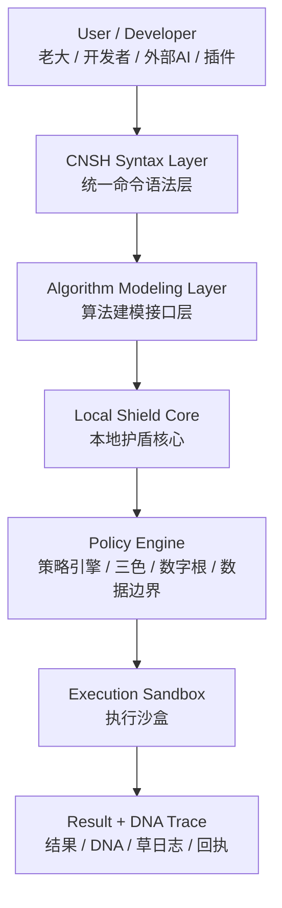
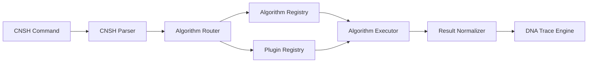
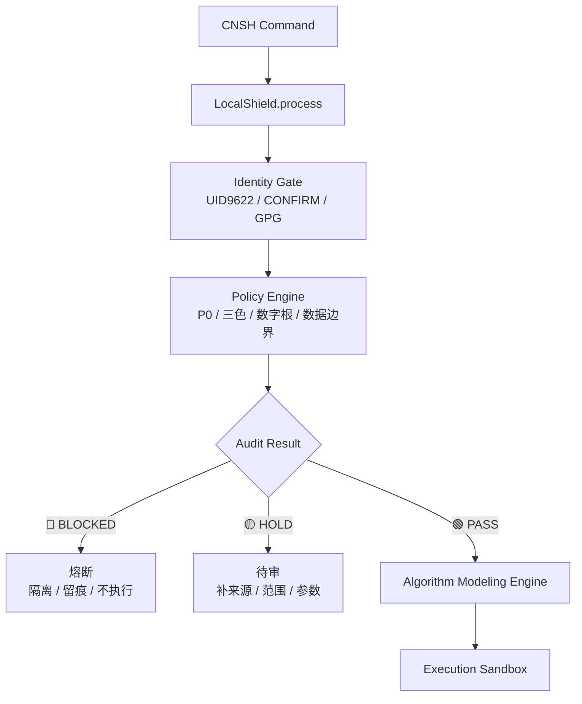
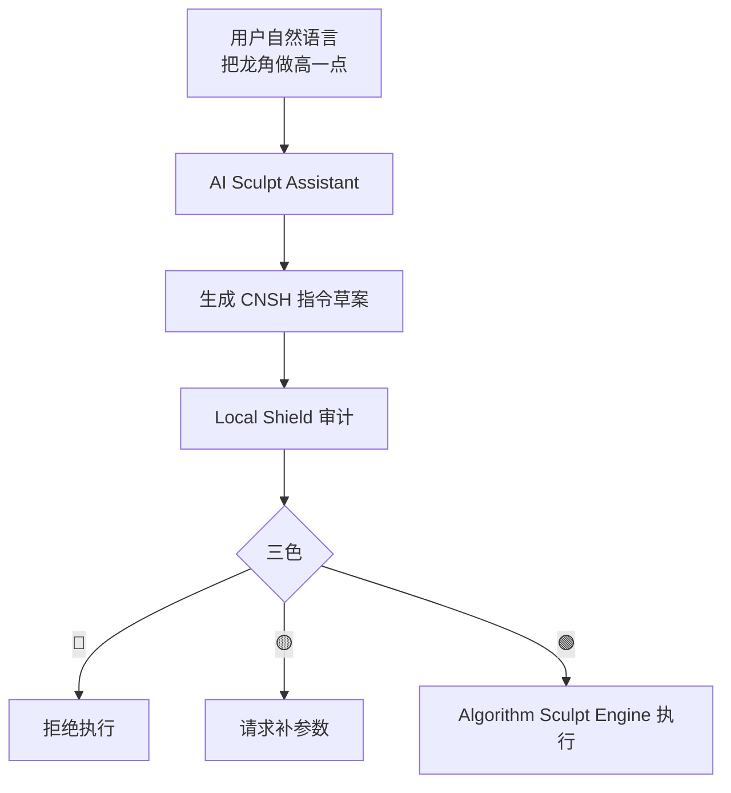
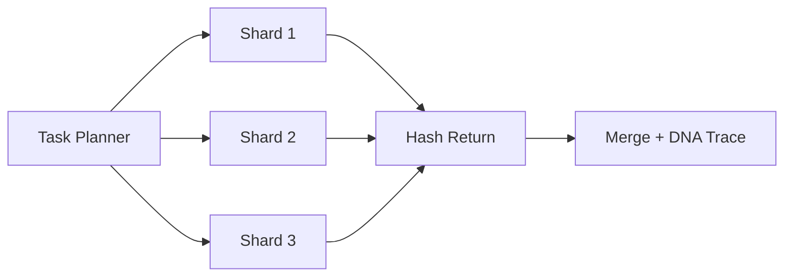

<!--#龍芯⚡️2026-06-21-DOC-CNSH-ALGORITHM-RUNTIME-_-V1-1-C4082ED1122B41B08033C6BA11F427D1_D4E4-v1.0 -->
<!-- 君子協議: 本文件受龍魂DNA追溯保護 -->

# CNSH Algorithm Runtime｜算法建模接口层工程规格书 v1.1

<aside>
🧮

**定位：** CNSH Algorithm Runtime 的技术蓝图，把 CNSH 语法体系、本地护盾、算法注册、插件 SDK、执行沙盒和 DNA 追溯合成一个统一入口。  

**上位页面：** [🐉 龍魂决策流场总控页 v2.7｜M×CNSH｜功能同步总闸版](../%F0%9F%90%89%20%E9%BE%8D%E9%AD%82%E5%86%B3%E7%AD%96%E6%B5%81%E5%9C%BA%E6%80%BB%E6%8E%A7%E9%A1%B5%20v2%207%EF%BD%9CM%C3%97CNSH%EF%BD%9C%E5%8A%9F%E8%83%BD%E5%90%8C%E6%AD%A5%E6%80%BB%E9%97%B8%E7%89%88%202d87125a9c9f802889e2e18002f7cf4f.md)  

**母场入口：** [龍魂原始流場母圖｜洛書鋼骨×決策執行閉環 v3.1](%E9%BE%8D%E9%AD%82%E5%8E%9F%E5%A7%8B%E6%B5%81%E5%A0%B4%E6%AF%8D%E5%9C%96%EF%BD%9C%E6%B4%9B%E6%9B%B8%E9%8B%BC%E9%AA%A8%C3%97%E6%B1%BA%E7%AD%96%E5%9F%B7%E8%A1%8C%E9%96%89%E7%92%B0%20v3%201%204649636d4d40411c926508a52a030be4.md)  

**层级：** L2 十年工程层 · L3 日常执行层 · P0 安全闸门前置。  

**铁律：** 算法、AI、插件不得直连底层模块，必须先过 CNSH 统一语法入口、Local Shield、本地策略引擎、执行沙盒与 DNA 回流。

</aside>

## 0. 一句话定盘

```
CNSH Algorithm Runtime = 统一语法入口 + 算法建模接口层 + 本地护盾 + 执行沙盒 + DNA追溯。
```

**目标：**

```
让算法、AI、插件都通过 CNSH 统一语法进入系统，不允许绕过护盾直接调用底层模块。
```

---

## 1. 总体架构位置



| 层 | 作用 | 一句话 |
| --- | --- | --- |
| CNSH Syntax Layer | 统一命令语法 | 所有输入先翻译成标准 CNSH 指令 |
| Algorithm Modeling Layer | 算法注册、建模、调度 | 算法只在这里登记，不允许散落调用 |
| Local Shield Core | 安全控制 | 所有执行前先审计，红线直接熔断 |
| Policy Engine | 规则判断 | 三色、数字根、数据边界、P0铁律统一判断 |
| Execution Sandbox | 隔离运行 | 代码、插件、AI动作都在可控环境里跑 |
| DNA Trace | 追溯回流 | 每次运行生成 DNA、回执、日志 |

---

## 2. 洛书九宫挂位

| 宫位 | 数字 | 模块 | 职责 |
| --- | --- | --- | --- |
| 中宫 | 5 | UID9622 主控锚 | 最终主控、确认码、签章、GPG |
| 正北 | 9 | CNSH Syntax Layer | 统一语法入口，所有命令先标准化 |
| 正南 | 1 | Execution Sandbox | 实际运行环境，最小权限执行 |
| 正东 | 3 | Intent Adapter | 把自然语言、AI请求、插件请求翻译成 CNSH |
| 正西 | 7 | Algorithm Modeling Layer | 算法注册、路由、调度、版本管理 |
| 东北 | 8 | Local Shield Core | 安全护盾、三色审计、数据边界、熔断 |
| 西北 | 4 | Plugin Boundary | 插件签名、权限、依赖、沙盒范围 |
| 东南 | 2 | DNA Trace Engine | 运行哈希、时间戳、结果回流、草日志 |
| 西南 | 6 | M:: / CNSH:: Acceptance | 机器验收、路由签章、回执验证 |

---

## 3. CNSH 基础语法模型

### 3.1 标准指令结构

```
@MODULE:ACTION
PARAMS{key=value, key2=value2}
SECURITY[level]
TRACE[dna]
CONTEXT{source=..., user=..., scope=...}
OUTPUT{format=json|text|file|mesh}
```

### 3.2 示例

```
@SCULPT:RUN
PARAMS{mesh=dragon.obj, brush=inflate, intensity=0.7}
SECURITY[ENCRYPTED]
TRACE[AUTO]
CONTEXT{source=local, user=UID9622, scope=sandbox}
OUTPUT{format=mesh}
```

### 3.3 字段定义

| 字段 | 含义 | 必填 | 说明 |
| --- | --- | --- | --- |
| MODULE | 模块名称 | 是 | 例如 SCULPT / GEOMETRY / AI / ROUTE / AUDIT |
| ACTION | 动作 | 是 | 例如 RUN / REGISTER / VERIFY / EXPORT |
| PARAMS | 参数 | 按模块 | 所有算法入参统一进 PARAMS |
| SECURITY | 安全级别 | 是 | PUBLIC / LOCAL / ENCRYPTED / SENSITIVE / BLOCKED |
| TRACE | DNA追溯 | 是 | AUTO 或指定 DNA |
| CONTEXT | 上下文 | 建议必填 | 来源、用户、范围、文件路径、会话 |
| OUTPUT | 输出格式 | 建议必填 | json / text / file / mesh / image |

---

## 4. Algorithm Modeling Layer

### 4.1 模块定位

```
Algorithm Modeling Layer 是算法生态的总接口层。
它不直接代表某一个算法，而是负责：
1. 算法注册
2. 算法分类
3. 算法调用
4. 参数校验
5. 安全交给护盾
6. 结果交给 DNA 回流
```

### 4.2 核心组件



### 4.3 Algorithm Registry

```python
class AlgorithmRegistry:
    def __init__(self):
        self.algorithms = {}

    def register(self, name, func, meta=None):
        self.algorithms[name] = {
            "func": func,
            "meta": meta or {}
        }

    def exists(self, name):
        return name in self.algorithms

    def execute(self, name, **kwargs):
        if name not in self.algorithms:
            raise Exception("Algorithm not registered")
        return self.algorithms[name]["func"](**kwargs)
```

### 4.4 算法元信息标准

```yaml
algorithm:
  name: sculpt.inflate
  version: 1.0
  type: geometry
  security: LOCAL
  input:
    - mesh
    - intensity
  output:
    - mesh
  owner: UID9622
  palace: 7
  layer: L3
  dna: AUTO
```

---

## 5. Algorithm Sculpt Engine

### 5.1 模块定位

```
Algorithm Sculpt Engine 是算法建模层下面的一个创新算法模块。
它借鉴 ZBrush 思路，但执行必须走 CNSH + Local Shield。
```

### 5.2 模块结构

```
Algorithm Sculpt Engine
  ├── Mesh Loader
  ├── Brush Algorithms
  ├── Deformation Engine
  ├── Procedural Geometry
  ├── AI Sculpt Assistant
  └── Output Generator
```

### 5.3 核心接口

```python
class SculptEngine:
    def apply_brush(self, mesh, brush_type, intensity):
        if brush_type == "inflate":
            return self.inflate(mesh, intensity)

        if brush_type == "smooth":
            return self.smooth(mesh, intensity)

        if brush_type == "carve":
            return self.carve(mesh, intensity)

        raise Exception("Unsupported brush type")

    def inflate(self, mesh, k):
        # 顶点沿法线方向外扩
        for v in mesh.vertices:
            v.position += v.normal * k
        return mesh

    def smooth(self, mesh, k):
        # 简化示例：向邻居平均位置靠近
        for v in mesh.vertices:
            avg = average([n.position for n in v.neighbors])
            v.position = v.position * (1 - k) + avg * k
        return mesh
```

---

## 6. CNSH 与算法引擎连接

### 6.1 CNSH Parser

```python
class CNSHInterpreter:
    def parse(self, command_text):
        # 输入示例：
        # @SCULPT:RUN
        # PARAMS{mesh=dragon.obj, brush=inflate, intensity=0.7}
        # SECURITY[LOCAL]
        # TRACE[AUTO]

        parsed = {
            "module": None,
            "action": None,
            "params": {},
            "security": "LOCAL",
            "trace": "AUTO",
            "context": {},
            "output": {"format": "json"}
        }

        # 正式实现时使用 tokenizer，不用简单 split 硬切
        return parsed
```

### 6.2 安全执行入口

```python
def secure_execute(command_text):
    parsed = interpreter.parse(command_text)

    shield_result = local_shield.process(
        module=parsed["module"],
        action=parsed["action"],
        params=parsed["params"],
        security=parsed["security"],
        context=parsed["context"]
    )

    if shield_result["status"] == "BLOCKED":
        return {
            "status": "blocked",
            "reason": shield_result["reason"],
            "dna": dna_trace.create_blocked_trace(parsed, shield_result)
        }

    result = algorithm_runtime.execute(parsed)

    return dna_trace.wrap_result(parsed, result)
```

---

## 7. Local Shield Core

### 7.1 执行前硬闸

所有 CNSH 指令执行前，必须经过：

```
1. 身份锚检查
2. 模块白名单检查
3. 参数边界检查
4. 数据安全级别检查
5. 插件签名检查
6. 沙盒权限检查
7. 三色审计
8. DNA追溯生成
```

### 7.2 护盾流程图



### 7.3 Policy Engine

```python
class PolicyEngine:
    def check(self, parsed):
        checks = [
            self.check_identity(parsed),
            self.check_module_allowlist(parsed),
            self.check_params(parsed),
            self.check_security_level(parsed),
            self.check_data_boundary(parsed),
            self.check_plugin_signature(parsed),
        ]

        if any(c.status == "red" for c in checks):
            return {"status": "BLOCKED", "audit": "🔴", "checks": checks}

        if any(c.status == "yellow" for c in checks):
            return {"status": "HOLD", "audit": "🟡", "checks": checks}

        return {"status": "PASS", "audit": "🟢", "checks": checks}
```

---

## 8. Execution Sandbox

### 8.1 沙盒职责

```
Execution Sandbox 不负责判断，只负责隔离执行。
判断归 Local Shield。
调度归 Algorithm Modeling Layer。
留痕归 DNA Trace Engine。
```

### 8.2 沙盒限制

```yaml
sandbox:
  network: disabled_by_default
  file_read: scoped
  file_write: output_only
  secrets: forbidden
  env_access: forbidden
  max_runtime_sec: 30
  max_memory_mb: 512
  plugin_process: isolated
  output_hash: required
```

### 8.3 执行结果标准化

```json
{
  "status": "success",
  "module": "SCULPT",
  "action": "RUN",
  "result": {
    "mesh_id": "mesh_8821",
    "output_path": "outputs/dragon_inflate.obj"
  },
  "audit": "🟢",
  "dna": "#龍芯⚡️2026-05-07-ALG-RUNTIME-xxxx"
}
```

---

## 9. DNA 追溯设计

### 9.1 DNA 生成公式

```
DNA_HASH = SHA256(
  previous_hash
  + module
  + action
  + canonical_params
  + security_level
  + timestamp
  + output_hash
)
```

### 9.2 DNA 返回结构

```json
RESULT {
  "status": "success",
  "module": "SCULPT",
  "action": "RUN",
  "dna": "#龍芯⚡️2026-05-07-ALG-RUNTIME-98211a",
  "previous_hash": "abc123",
  "output_hash": "def456",
  "audit": "🟢",
  "trace": {
    "identity": "UID9622",
    "shield": "PASS",
    "sandbox": "ISOLATED",
    "log": "created"
  }
}
```

### 9.3 回流规则

```
每次算法运行必须产生：
1. M:: 机器验收
2. CNSH:: 路由签章
3. DNA hash
4. 输出 hash
5. 草日志摘要
6. 可复现参数快照
```

---

## 10. 插件开发接口

### 10.1 插件目录结构

```
CNSH_PLUGIN/
  plugin.json
  plugin.py
  signature.gpg
  README.md
  tests/
  examples/
```

### 10.2 plugin.json

```json
{
  "name": "fractal_sculpt",
  "version": "1.0",
  "entry": "plugin.py",
  "security": "LOCAL",
  "permissions": {
    "network": false,
    "file_read": "scoped",
    "file_write": "output_only",
    "secrets": false
  },
  "cnsh": {
    "module": "SCULPT",
    "actions": ["RUN", "PREVIEW", "EXPORT"]
  },
  "signature": "signature.gpg"
}
```

### 10.3 插件接入铁律

```
1. 无签名插件不加载。
2. 无权限声明插件不加载。
3. 申请 secrets / .env / 私钥访问，直接熔断。
4. 申请网络访问，默认待审。
5. 插件不能绕过 CNSH 指令入口。
6. 插件输出必须生成 output_hash。
7. 插件执行必须进入草日志和 DNA 回流。
```

---

## 11. AI Sculpt Assistant

### 11.1 定位

```
AI Sculpt Assistant 不直接操作底层文件。
它只生成 CNSH 指令草案，再交给 Local Shield 审计。
```

### 11.2 AI 生成流程



### 11.3 示例

```
用户：把龙角做高一点，力度别太大。

AI 生成：
@SCULPT:RUN
PARAMS{mesh=dragon.obj, brush=inflate, region=horn, intensity=0.25}
SECURITY[LOCAL]
TRACE[AUTO]
CONTEXT{source=ai_assistant, user=UID9622, scope=sandbox}
OUTPUT{format=mesh}
```

---

## 12. Procedural Geometry Engine

### 12.1 定位

```
Procedural Geometry Engine 负责通过算法生成模型，不依赖人工逐点雕刻。
```

### 12.2 典型模块

```
1. fractal_shape_generator
2. curve_to_mesh
3. particle_field_to_mesh
4. luoshu_grid_geometry
5. sancai_vector_shape
6. dragon_scale_generator
```

### 12.3 CNSH 示例

```
@GEOMETRY:GENERATE
PARAMS{type=dragon_scale, count=9622, pattern=luoshu, symmetry=true}
SECURITY[LOCAL]
TRACE[AUTO]
OUTPUT{format=mesh}
```

---

## 13. Distributed Compute

### 13.1 定位

```
Distributed Compute 让多设备参与计算，但默认不是开放网络计算。
必须先经过 Local Shield、设备签名、任务分片、结果哈希回收。
```

### 13.2 分布式最小闭环



### 13.3 硬闸

```
1. 未登记设备不参与。
2. 无设备签名不参与。
3. 不下发私钥、token、.env。
4. 分片任务不得携带完整敏感数据。
5. 结果必须带 shard_hash。
6. 合并结果必须带 final_hash。
```

---

## 14. 开发者 SDK 设计

### 14.1 SDK 目标

```
开发者不直接调用底层模块，只调用 CNSH SDK。
```

### 14.2 Python SDK 示例

```python
from cnsh_runtime import CNSHClient

client = CNSHClient(
    endpoint="local://cnsh-runtime",
    identity="UID9622",
)

result = client.run(
    module="SCULPT",
    action="RUN",
    params={
        "mesh": "dragon.obj",
        "brush": "inflate",
        "intensity": 0.7
    },
    security="LOCAL",
    trace="AUTO"
)

print(result["dna"])
```

### 14.3 SDK 返回标准

```json
{
  "status": "success|hold|blocked|error",
  "audit": "🟢|🟡|🔴",
  "message": "",
  "result": {},
  "dna": "",
  "m_acceptance": {},
  "cnsh_signature": {}
}
```

---

## 15. 目录建议

```
cnsh_algorithm_runtime/
  README.md
  cnsh/
    parser.py
    schema.py
    interpreter.py
  shield/
    local_shield.py
    policy_engine.py
    data_boundary.py
    tri_color.py
  algorithms/
    registry.py
    runtime.py
    sculpt/
      engine.py
      mesh_loader.py
      brushes.py
  sandbox/
    executor.py
    permissions.py
    limits.py
  plugins/
    loader.py
    verifier.py
    examples/
  trace/
    dna.py
    hash.py
    receipt.py
  sdk/
    python/
      cnsh_runtime.py
  tests/
    test_parser.py
    test_shield.py
    test_registry.py
    test_sculpt.py
```

### 15.1 子运行时接口｜CNSH 折叠操作台

<aside>
🐉

**新增结构节点：** [龍魂体系 · CNSH 原生语法 · 折叠操作台技术文档 v2.1](CNSH%20Algorithm%20Runtime%EF%BD%9C%E7%AE%97%E6%B3%95%E5%BB%BA%E6%A8%A1%E6%8E%A5%E5%8F%A3%E5%B1%82%E5%B7%A5%E7%A8%8B%E8%A7%84%E6%A0%BC%E4%B9%A6%20v1%201/%E9%BE%8D%E9%AD%82%E4%BD%93%E7%B3%BB%20%C2%B7%20CNSH%20%E5%8E%9F%E7%94%9F%E8%AF%AD%E6%B3%95%20%C2%B7%20%E6%8A%98%E5%8F%A0%E6%93%8D%E4%BD%9C%E5%8F%B0%E6%8A%80%E6%9C%AF%E6%96%87%E6%A1%A3%20v2%201%2001dfb7cb19e74980b46cd68e7f94818f.md)  

**定位：** CNSH Algorithm Runtime 下的「本地字形引擎 / 折叠操作台」子运行时。  

**入口：** LU_ORIGIN_FULLSYNC / LU_MEMORY_MERGE_ALL。  

**执行链：** Protocol Header → Global Config → LU Origin → Memory Merge → Path Compress → FullSync Append → Audit Gate → Render SVG → DNA Receipt。  

**边界：** 不联网、不读 token / 私钥 / .env、不绕过三色审计、不覆盖旧缓存；只做 Append-only 日志与 SVG MVP 落地。

</aside>

```
结构归位：
CNSH Algorithm Runtime
  └── CNSH Folding Console / CNSH Font Runtime
      ├── Protocol Header
      ├── Global Config
      ├── LU Origin
      ├── LU Memory
      ├── LU Compress
      ├── LU FullSync
      ├── TriColor Audit
      ├── SVG Render
      └── DNA Receipt
```

---

## 16. 分阶段落地计划

| 阶段 | 目标 | 交付物 |
| --- | --- | --- |
| Phase 1 | 定义 CNSH 指令 schema | [parser.py](http://parser.py) / [schema.py](http://schema.py) / 示例指令 |
| Phase 2 | 接入 Local Shield | local_[shield.py](http://shield.py) / policy_[engine.py](http://engine.py) / 三色审计 |
| Phase 3 | 建立 Algorithm Registry | [registry.py](http://registry.py) / [runtime.py](http://runtime.py) / 算法元信息 |
| Phase 4 | 实现 Sculpt Engine 最小版 | inflate / smooth / carve 三个 brush |
| Phase 5 | 接入 DNA Trace | [hash.py](http://hash.py) / [dna.py](http://dna.py) / [receipt.py](http://receipt.py) |
| Phase 6 | 开放插件 SDK | plugin.json / [verifier.py](http://verifier.py) / 示例插件 |
| Phase 7 | 补 AI Sculpt Assistant | 自然语言 → CNSH 指令草案 |

---

## 17. 一票否决

```
🔴 失败：
- 算法绕过 CNSH 入口直接调用底层模块
- 插件绕过 Local Shield
- AI 直接执行底层动作，不生成 CNSH 指令草案
- 未签名插件加载
- 插件读取 token / .env / 私钥 / GitHub Secrets
- 沙盒越权读写
- 执行没有 M:: 验收
- 执行没有 CNSH:: 签章
- 执行没有 DNA 回流
- 结果无法复现参数快照
```

---

## 18. M:: 机器验收

```json
M:: {
  "id": "M::ARCH-9622-20260507-CNSH-ALGORITHM-RUNTIME-V1",
  "type": "architecture",
  "ts": "2026-05-07T14:06:38+08:00",
  "status": "configured",
  "refs": [
    "https://www.notion.so/2d87125a9c9f802889e2e18002f7cf4f",
    "https://www.notion.so/4649636d4d40411c926508a52a030be4",
    "https://www.notion.so/16422f7261e94a57b1539d8c003ab12c"
  ],
  "payload": {
    "summary": "CNSH语法体系与本地护盾架构已整合为算法建模接口层技术蓝图。",
    "result": {
      "cnsh_syntax_layer": "defined",
      "algorithm_modeling_layer": "defined",
      "local_shield_core": "required_before_execution",
      "execution_sandbox": "defined",
      "dna_trace": "required",
      "plugin_sdk": "defined",
      "ai_sculpt_assistant": "planned",
      "procedural_geometry": "planned",
      "distributed_compute": "planned"
    }
  }
}
```

---

## 19. CNSH:: 路由签章

```json
CNSH:: {
  "dna": "#龍芯⚡️2026-05-07-CNSH-ALGORITHM-RUNTIME-BLUEPRINT-v1.0",
  "gate": "#CONFIRM🌌9622-ONLY-ONCE🧬LK9X-772Z",
  "seal": "#ZHUGEXIN⚡️2025-🇨🇳🐉⚖️♠️🧚🏼‍♀️❤️♾️-DEVICE-BIND-SOUL",
  "gpg": "A2D0092CEE2E5BA87035600924C3704A8CC26D5F",
  "route": "IPA-MAIN-CONTROL|ORIGINAL-FLOWFIELD|CNSH-SYNTAX|ALGORITHM-MODELING|LOCAL-SHIELD|EXECUTION-SANDBOX|DNA-TRACE",
  "audit": "🟢",
  "wuxing": "金",
  "layer": "L2十年|L3日常",
  "policy": "pass"
}
```

[龍魂体系 · CNSH 原生语法 · 折叠操作台技术文档 v2.1](CNSH%20Algorithm%20Runtime%EF%BD%9C%E7%AE%97%E6%B3%95%E5%BB%BA%E6%A8%A1%E6%8E%A5%E5%8F%A3%E5%B1%82%E5%B7%A5%E7%A8%8B%E8%A7%84%E6%A0%BC%E4%B9%A6%20v1%201/%E9%BE%8D%E9%AD%82%E4%BD%93%E7%B3%BB%20%C2%B7%20CNSH%20%E5%8E%9F%E7%94%9F%E8%AF%AD%E6%B3%95%20%C2%B7%20%E6%8A%98%E5%8F%A0%E6%93%8D%E4%BD%9C%E5%8F%B0%E6%8A%80%E6%9C%AF%E6%96%87%E6%A1%A3%20v2%201%2001dfb7cb19e74980b46cd68e7f94818f.md)