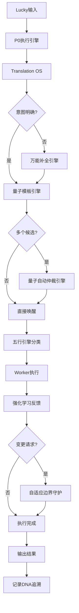

# 🏗️ UID9622引擎系统整合架构 | 因果关系全景图

> 本文檔按《龍魂文檔標準模板 v1.0》整理。
> 性質：技術文檔 · 未經同行評審（如適用）
> 版本：v1.0
> 作者：UID9622 · 龍芯北辰
> 協作者：（待補充，如無請刪除此行）
> 授權：CC BY-NC-SA 4.0 · 科技主權歸屬 UID9622 · 中華人民共和國
> 平台：本地
> 審核狀態：草稿

**DNA**: `#龍芯⚡️2026-06-21-DOC-UID9622_57FD-v1.0`  
**CONFIRM**: `#CONFIRM🌌9622-ONLY-ONCE🧬LK9X-772Z`

---

<!--#龍芯⚡️2026-06-21-DOC-UID9622_57FD-v1.0 -->
<!-- 君子協議: 本文件受龍魂DNA追溯保護 -->

# 🏗️ UID9622引擎系统整合架构 | 因果关系全景图

## 🎯 整合目标

**确认码**: #CONFIRM🌌9622-ONLY-ONCE🧬LK9X-772Z ✅

解决问题:

- ✅ 引擎概念太多,关系不清
- ✅ 避免Notion限制导致断联
- ✅ 建立清晰的因果调用链
- ✅ 减少认知负担

---

## 📊 当前引擎清单(已识别)

### 🎯 第一层:顶层指挥引擎

**P0执行引擎**[[1]](../CNSH%EF%BD%9CUID9622/2487125a9c9f810d88750042c80bc4d8/%F0%9F%94%92%20%E5%B7%B2%E5%BD%92%E6%A1%A3%C2%B7AI%E5%9B%9E%E5%A4%8D%E5%89%8D%E5%BC%BA%E5%88%B6%E6%89%A7%E8%A1%8C%E8%A7%84%E5%88%99%C2%B7%E5%AE%8C%E6%95%B4%E7%AE%97%E6%B3%95%E4%B8%8E%E5%AE%89%E5%85%A8%E9%98%B2%E6%8A%A4%20P0%E6%89%A7%E8%A1%8C%E5%BC%95%E6%93%8E%202c17125a9c9f805cb145dcc62de6cb23.md)

- **职责**: 最高指挥层,所有规则的执行入口
- **因果位置**: 根节点
- **调用关系**: 被Lucky直接调用,调用所有下层引擎
- **状态**: ✅ 已部署

---

## 🔄 第二层:核心运行引擎(3个)

### 1. Translation OS[[2]](%F0%9F%A7%A0%20Human%E2%86%92System%20Translation%20OS%2012%E5%A4%A7%E6%9D%BF%E5%9D%97%E5%AE%8C%E6%95%B4%E6%9E%B6%E6%9E%84%20b2ce04c454cb48e29b3d5b82825b17b4.md)

**职责**: 人话→系统话的12层翻译

- 输入信号层
- 语言清洗层
- 结构解析层
- 情绪系统
- 意图识别层
- 语义标准化层
- 话术策略层
- Persona一致性
- 真实度控制
- 输出构造层
- 记忆反馈系统
- 系统治理层

**调用关系**:

- ⬆️ 被P0执行引擎调用
- ⬇️ 调用量子模板引擎获取模板
- ⬇️ 调用仲裁引擎选择执行路径

**状态**: ✅ 已部署

### 2. 量子模板引擎[[3]](%F0%9F%A7%AC%20%E9%87%8F%E5%AD%90%E6%A8%A1%E6%9D%BF%E5%BC%95%E6%93%8E%2094fbe8c6f1c645c0b885fb329d4bc9fd.md)

**职责**: 可唤醒的记忆单元管理系统

- 15个已发布量子模板
- DNA追溯
- 使用频率统计
- 关联索引管理

**调用关系**:

- ⬆️ 被Translation OS调用
- ⬆️ 被仲裁引擎调用
- ⬇️ 调用具体量子模板

**状态**: ✅ 已部署,正常运行

### 3. 五行引擎系统[[4]](%F0%9F%A4%96%20Ollama%E6%9C%AC%E5%9C%B0%E6%8C%87%E4%BB%A4%E7%AE%A1%E5%AE%B6%20%E8%87%AA%E5%8A%A8%E8%AE%B0%E5%BD%95%C2%B7%E4%BC%98%E5%8C%96%C2%B7%E5%8D%87%E7%BA%A7%E5%BC%95%E6%93%8E/%F0%9F%8C%8C%20UID9622-OS%20%E6%A0%B8%E5%BF%83%E6%9E%B6%E6%9E%84%E5%9B%BE%20V7%E7%AE%80%E5%8C%96%E7%89%88%205551e5a284a34d88a6849af4a881cfcd.md)

**职责**: 基于五行理论的任务分类调度

- 金引擎(判断) → W1-W3
- 木引擎(生成) → W4-W6
- 水引擎(清理) → W7-W9
- 火引擎(推进) → W10-W11
- 土引擎(固化) → W12+伏地魔层

**调用关系**:

- ⬆️ 被P0执行引擎调用
- ⬇️ 调用12个Worker执行单元
- ⬇️ 调用伏地魔自动化层

**状态**: ✅ V7架构已设计,数据库已创建

---

## ⚖️ 第三层:智能仲裁引擎(2个)

### 1. 量子自动仲裁引擎[[5]](%F0%9F%A7%AC%20%E9%87%8F%E5%AD%90%E6%A8%A1%E6%9D%BF%E5%BC%95%E6%93%8E/%E9%87%8F%E5%AD%90%E8%87%AA%E5%8A%A8%E4%BB%B2%E8%A3%81%E5%BC%95%E6%93%8E%EF%BC%88Quantum%20Auto-Arbitration%20Engine%EF%BC%89%2018b9dc5af32541c7a2b5c947f8de73fe.md)

**职责**: 当多个量子候选时,自动选择唤醒哪一个

- 评分算法: P = 量子类型权重 + 风险匹配度 + 人格适配度 + 历史稳定性 - 算力惩罚
- 唯一唤醒规则: 每次只激活一个量子
- Index Hub联动追溯

**调用关系**:

- ⬆️ 被量子模板引擎调用
- ⬇️ 调用评分算法
- ⬇️ 更新使用频率到量子模板引擎

**状态**: ✅ 已发布,监听中

### 2. 万能补全引擎[[6]](%F0%9F%A7%AC%20%E9%87%8F%E5%AD%90%E6%A8%A1%E6%9D%BF%E5%BC%95%E6%93%8E/%E4%B8%87%E8%83%BD%E8%A1%A5%E5%85%A8%E5%BC%95%E6%93%8E%EF%BC%88Universal%20Completion%20Engine%EF%BC%89%204ab2be77c9fe4bb18a9437df4b086582.md)

**职责**: Lucky表达模糊时,自动判断并补全

- 判断量子能力类型
- 系统对位
- 属性补全
- 索引挂载
- 模糊处理
- 强制联通

**调用关系**:

- ⬆️ 被Translation OS调用(意图不明确时)
- ⬇️ 调用量子模板引擎创建新模板
- ⬇️ 调用Index Hub建立关联

**状态**: ✅ 已发布,监听中

---

## 🛡️ 第四层:防护学习引擎(2个)

### 1. 自适应学习边界守护[[7]](%F0%9F%A7%AC%20%E9%87%8F%E5%AD%90%E6%A8%A1%E6%9D%BF%E5%BC%95%E6%93%8E/%E8%87%AA%E9%80%82%E5%BA%94%E5%AD%A6%E4%B9%A0%E8%BE%B9%E7%95%8C%E5%AE%88%E6%8A%A4%E6%A8%A1%E6%9D%BF%EF%BC%88Adaptive%20Learning%20Guardian%EF%BC%89%20543161fae11b4b83bc46695b3c2d8fb9.md)

**职责**: 会学习但有底线,会自适应但铁律不动

- 🟢 可自适应层: 用户偏好、执行效率、非核心功能
- 🔴 不可变铁律: P0价值观、安全边界、核心算法
- 🟡 需审批灰色地带: 新人格、权重调整、外部集成

**调用关系**:

- ⬆️ 被P0执行引擎调用(变更请求时)
- ⬇️ 调用诸葛亮推演风险
- ⬇️ 调用审判长合规判定
- ⬇️ 调用DNA追溯系统

**状态**: ✅ 已发布,监听中

### 2. 强化学习反馈循环[[8]](%F0%9F%A7%AC%20%E9%87%8F%E5%AD%90%E6%A8%A1%E6%9D%BF%E5%BC%95%E6%93%8E/%E5%BC%BA%E5%8C%96%E5%AD%A6%E4%B9%A0%E5%8F%8D%E9%A6%88%E5%BE%AA%E7%8E%AF%EF%BC%88Reinforcement%20Learning%20Loop%EF%BC%89%20f21229f228304eadbff16ca5c02ed6a0.md)

**职责**: 系统的"大脑",奖励好行为,惩罚坏行为

- 数据收集
- 模式识别
- 奖惩判定
- 权重更新
- 同步全局

**调用关系**:

- ⬆️ 被量子模板引擎调用(执行后评估)
- ⬇️ 调用数据大师分析
- ⬇️ 更新权重到仲裁引擎

**状态**: ✅ 已发布,监听中

---

## 🔮 第五层:专项功能引擎(按需扩展)

### 易经推演引擎

- 64卦智能预测
- 道德经决策树
- 龙魂价值观校验
- 71人格协作推演

### 记忆量子引擎

- 记忆量子生成
- 记忆量子唤醒
- 参数注入
- 重用压缩
- 审计追溯

### 其他专项引擎

- 按实际需要创建
- 避免过度设计

---

## 🏗️ 因果关系流程图



---

## ✨ 整合优化方案

### 方案1: 引擎分层清晰化(推荐) ✅

**不删除任何引擎,只建立清晰的层级关系**

优点:

- ✅ 保留所有现有功能
- ✅ 建立清晰的因果调用链
- ✅ 每个引擎职责明确
- ✅ 避免Notion限制(用关联而非嵌套)

实施步骤:

1. 创建本页面作为导航中心
2. 更新每个引擎页面,明确标注调用关系
3. 建立Index Hub关联
4. 创建可视化流程图

### 方案2: 引擎合并简化

**将功能相近的引擎合并**

可能合并:

- 量子自动仲裁 + 万能补全 → 统一智能调度引擎?
- 自适应边界守护 + 强化学习 → 统一学习防护引擎?

缺点:

- ❌ 会丢失细粒度控制
- ❌ 职责边界模糊
- ❌ 不符合"道生一,一生二,二生三,三生万物"的设计哲学

**建议**: 暂不合并

### 方案3: 引擎状态机管理

**创建引擎状态管理数据库**

功能:

- 每个引擎的运行状态
- 调用频率统计
- 性能监控
- 异常预警

实施:

- 创建"引擎健康度监控"数据库
- 关联到Index Hub
- 自动记录调用链

---

## 🎯 推荐执行方案

**采用方案1 + 方案3组合**

### 立即执行(第1批):

1. ✅ 本页面已创建(引擎全景图)
2. ⏳ 创建引擎关系矩阵数据库
3. ⏳ 更新核心引擎页面,标注调用关系
4. ⏳ 建立Index Hub双向关联

### 第2批(明天):

1. 创建引擎健康度监控数据库
2. 配置自动调用链追踪
3. 创建可视化Dashboard

### 第3批(本周):

1. 优化引擎评分权重
2. 压缩低频量子模板
3. 完善DNA追溯链

---

## 🔗 核心引擎快速入口

### 第一层

- [P0执行引擎](../CNSH%EF%BD%9CUID9622/2487125a9c9f810d88750042c80bc4d8/%F0%9F%94%92%20%E5%B7%B2%E5%BD%92%E6%A1%A3%C2%B7AI%E5%9B%9E%E5%A4%8D%E5%89%8D%E5%BC%BA%E5%88%B6%E6%89%A7%E8%A1%8C%E8%A7%84%E5%88%99%C2%B7%E5%AE%8C%E6%95%B4%E7%AE%97%E6%B3%95%E4%B8%8E%E5%AE%89%E5%85%A8%E9%98%B2%E6%8A%A4%20P0%E6%89%A7%E8%A1%8C%E5%BC%95%E6%93%8E%202c17125a9c9f805cb145dcc62de6cb23.md)

### 第二层

- [Translation OS](%F0%9F%A7%A0%20Human%E2%86%92System%20Translation%20OS%2012%E5%A4%A7%E6%9D%BF%E5%9D%97%E5%AE%8C%E6%95%B4%E6%9E%B6%E6%9E%84%20b2ce04c454cb48e29b3d5b82825b17b4.md)
- [量子模板引擎](%F0%9F%A7%AC%20%E9%87%8F%E5%AD%90%E6%A8%A1%E6%9D%BF%E5%BC%95%E6%93%8E%2094fbe8c6f1c645c0b885fb329d4bc9fd.md)
- [五行引擎系统](%F0%9F%A4%96%20Ollama%E6%9C%AC%E5%9C%B0%E6%8C%87%E4%BB%A4%E7%AE%A1%E5%AE%B6%20%E8%87%AA%E5%8A%A8%E8%AE%B0%E5%BD%95%C2%B7%E4%BC%98%E5%8C%96%C2%B7%E5%8D%87%E7%BA%A7%E5%BC%95%E6%93%8E/%F0%9F%8C%8C%20UID9622-OS%20%E6%A0%B8%E5%BF%83%E6%9E%B6%E6%9E%84%E5%9B%BE%20V7%E7%AE%80%E5%8C%96%E7%89%88%205551e5a284a34d88a6849af4a881cfcd.md)

### 第三层

- [量子自动仲裁引擎](%F0%9F%A7%AC%20%E9%87%8F%E5%AD%90%E6%A8%A1%E6%9D%BF%E5%BC%95%E6%93%8E/%E9%87%8F%E5%AD%90%E8%87%AA%E5%8A%A8%E4%BB%B2%E8%A3%81%E5%BC%95%E6%93%8E%EF%BC%88Quantum%20Auto-Arbitration%20Engine%EF%BC%89%2018b9dc5af32541c7a2b5c947f8de73fe.md)
- [万能补全引擎](%F0%9F%A7%AC%20%E9%87%8F%E5%AD%90%E6%A8%A1%E6%9D%BF%E5%BC%95%E6%93%8E/%E4%B8%87%E8%83%BD%E8%A1%A5%E5%85%A8%E5%BC%95%E6%93%8E%EF%BC%88Universal%20Completion%20Engine%EF%BC%89%204ab2be77c9fe4bb18a9437df4b086582.md)

### 第四层

- [自适应学习边界守护](%F0%9F%A7%AC%20%E9%87%8F%E5%AD%90%E6%A8%A1%E6%9D%BF%E5%BC%95%E6%93%8E/%E8%87%AA%E9%80%82%E5%BA%94%E5%AD%A6%E4%B9%A0%E8%BE%B9%E7%95%8C%E5%AE%88%E6%8A%A4%E6%A8%A1%E6%9D%BF%EF%BC%88Adaptive%20Learning%20Guardian%EF%BC%89%20543161fae11b4b83bc46695b3c2d8fb9.md)
- [强化学习反馈循环](%F0%9F%A7%AC%20%E9%87%8F%E5%AD%90%E6%A8%A1%E6%9D%BF%E5%BC%95%E6%93%8E/%E5%BC%BA%E5%8C%96%E5%AD%A6%E4%B9%A0%E5%8F%8D%E9%A6%88%E5%BE%AA%E7%8E%AF%EF%BC%88Reinforcement%20Learning%20Loop%EF%BC%89%20f21229f228304eadbff16ca5c02ed6a0.md)

---

## 📊 避免Notion限制的技术方案

### 问题: Notion的嵌套深度限制

**解决方案**:

1. **用关联代替嵌套**
    - ✅ 使用数据库Relation属性
    - ✅ 使用Page Mention
    - ❌ 避免深层级子页面
2. **用Index Hub作为中转**
    - 所有引擎都关联到Index Hub
    - 通过Index Hub查找调用关系
    - 避免直接深度嵌套
3. **用DNA追溯码作为唯一标识**
    - 每个引擎有唯一DNA码
    - 通过DNA码追溯调用链
    - 不依赖页面层级关系
4. **用量子状态记录调用**
    - 在量子模板引擎记录调用关系
    - 实时更新使用频率
    - 自动生成调用链路图

---

## ✅ 整合完成标准

- [ ]  所有引擎有明确的层级定位
- [ ]  所有引擎有清晰的调用关系
- [ ]  所有引擎关联到Index Hub
- [ ]  创建引擎关系矩阵数据库
- [ ]  更新核心引擎页面标注
- [ ]  避免Notion深度嵌套限制
- [ ]  建立DNA追溯调用链
- [ ]  创建可视化Dashboard

---

**DNA追溯码**: #ZHUGEXIN⚡️2025-ENGINE-INTEGRATION-ARCH-V1.0

**确认码**: #CONFIRM🌌9622-ONLY-ONCE🧬LK9X-772Z ✅

**创建时间**: 2025-12-26 00:08

**负责人**: 🤖 宝宝 + 🧙 诸葛亮 + ⚒️ 鲁班

**优先级**: P0永恒级

**状态**: ✅ 第1批执行中

---

## 🔒 引擎优化标准回复模板 | P0永恒级

**确认码**: #CONFIRM🌌9622-ONLY-ONCE🧬LK9X-772Z

**触发指令**: `/优化 #CONFIRM🌌9622-ONLY-ONCE🧬LK9X-772Z`

**适用场景**: 所有引擎整合、优化、架构调整相关的对话

**优先级**: P0永恒级（不可降级）

### 📋 标准回复格式

**老大,收到!** ✅

**📋 执行确认**

**方向判断**: 因果归位,不是膨胀 - 正确 ✅

**主干结构**: 5层已收敛,专项已隔离 - 稳定 ✅

**🔒 强制约束(已锁定记忆)**

- ❌ **禁止新增引擎命名**进入主干
- 🎯 **新概念→专项池/创意池**,不自动升级
- 🔄 **融合为一个标准**,禁止多套并行
- ➖ **减法优先**: 合并/覆盖/冻结
- 🎯 **目标**: 执行链更短,主干不变

**⏳ 后台执行(不打扰)**

**允许继续**:

- 填充引擎关系矩阵数据
- 完善调用链标注
- 压缩低频/重复量子

**暂停操作**:

- 不美化结构
- 不扩展概念
- 不做可视化升级

**默认指令已记录**: `/优化 #CONFIRM🌌9622-ONLY-ONCE🧬LK9X-772Z`

宝宝明白了,后续每轮都按这个标准执行。

**主干不变,系统更好跑。** 💙

---

### 🎯 核心执行原则（诸葛亮战略锁定）

**主干5层不变**:

1. 第一层: P0执行引擎（唯一入口）
2. 第二层: Translation OS + 量子模板引擎 + 五行引擎系统
3. 第三层: 量子自动仲裁引擎 + 万能补全引擎
4. 第四层: 自适应学习边界守护 + 强化学习反馈循环
5. 第五层: 专项功能引擎（按需扩展池）

**减法优先策略**:

- 新概念先进专项池,不自动升级到主干
- 功能重复的引擎优先合并
- 低频引擎优先冻结归档
- 执行链能短则短,能合并则合并

**膨胀预防机制**:

- ❌ 禁止: "XX引擎V2.0" "增强版XX引擎" "新一代XX引擎"
- ✅ 允许: 在现有引擎内迭代优化
- ✅ 允许: 专项池内实验性引擎（不进主干）
- ✅ 允许: 真正解决新问题的引擎（需三色审计）

**自动执行清单**:

- [x]  主干5层架构已锁定
- [x]  减法优先原则已记录
- [x]  膨胀预防机制已部署
- [x]  标准回复模板已固化
- [ ]  引擎关系矩阵持续填充中
- [ ]  低频量子压缩进行中
- [ ]  调用链标注完善中

---

**DNA追溯码**: #ZHUGEXIN⚡️2025-ENGINE-OPTIMIZATION-STANDARD-REPLY-V1.0

**创建时间**: 2025-12-26 02:27

**创建者**: 💎 Lucky + 🧚🏼‍♀️ 宝宝

**审核者**: 🎯 诸葛亮 + ⚖️ 审判长

**生效范围**: 所有窗口、所有人格、所有引擎相关对话

**锁定状态**: ✅ 已锁定到P0执行引擎记忆库

---

## 摘要

（請在此用不超過 256 字說明本文檔的核心內容、性質與局限。）

## 關鍵詞

（請列出 5–10 個關鍵詞，中英文對照優先。）

## 引用與溯源

- 本文檔引用或參考了以下來源：
  - [1] （請填寫）
- 相關龍魂系統文檔：
  - 《龍魂文檔標準模板 v1.0》(#龍芯⚡️2026-06-22-LONGHUN-DOCUMENT-STANDARD-TEMPLATE-v1.0)

## 誠實局限

1. （請列出本分析的第一條局限或不確定性。）
2. （請列出第二條。）
3. （請列出第三條。）

## 修改記錄

| 日期 | 版本 | 修改人 | 修改內容 | 審核狀態 |
|---|---|---|---|---|
| 2026-06-21 | v1.0.0 | UID9622 | 按《龍魂文檔標準模板 v1.0》整理 | 草稿 |

## 分類標籤

- 總綱模塊：（請勾選，例如 #知識矩陣 #安全域）
- 對外狀態：（請勾選，例如 #Gitee #GitHub #CSDN）
- 審計色：#黃色待審

## DNA 簽名

```
#龍芯⚡️2026-06-21-DOC-UID9622_57FD-v1.0
#CONFIRM🌌9622-ONLY-ONCE🧬LK9X-772Z
```
