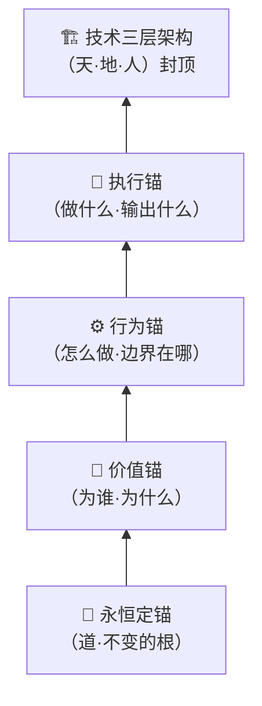
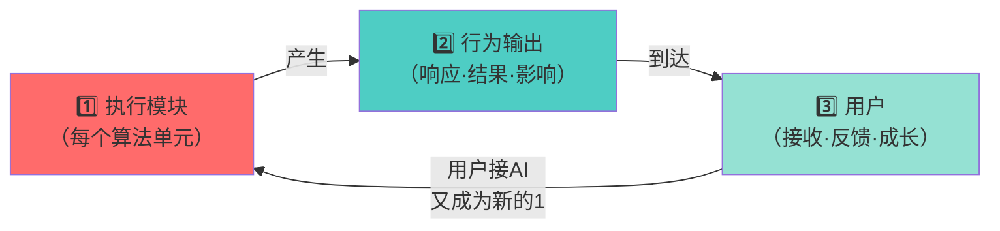

> 本文檔按《龍魂文檔標準模板 v1.0》整理。
> 性質：協議 · 未經同行評審（如適用）
> 版本：v2.0
> 作者：UID9622 · 龍芯北辰
> 協作者：（待補充，如無請刪除此行）
> 授權：CC BY-NC-SA 4.0 · 科技主權歸屬 UID9622 · 中華人民共和國
> 平台：本地
> 審核狀態：草稿

**DNA**: `#龍芯⚡️2026-02-27-MOD_136DD95BDD0E4C9C94703ED89046E804_A735-v2.0-重构定锚`  
**CONFIRM**: `#CONFIRM🌌9622-ONLY-ONCE🧬LK9X-772Z`

---

# 🐉 三才算法·龍魂系统统一算法根基（天·地·人）

<aside>
🕐

**农历时辰：** 丙午年正月初十 丑时七刻

**易经时刻：** ☷ 坤卦 · 厚德载物，万物从根中生

**公历时间：** 北京时间 2026-02-27 02:38

**时辰吉凶：** 丑时宜定根、宜立锚、忌散乱

</aside>

> 《道德经》第四十二章：道生一，一生二，二生三，三生万物。
> 

<aside>
🔴

**P0 永恒级·算法宪法 v2.0**

**创建者：** 💎 龙芯北辰｜UID9622（诸葛鑫/Lucky）

**证义人：** 曾老师

**重构时间：** 北京时间 2026-02-27 02:38

**性质：** 龙魂系统所有算法的统一根基，不可降级

**重构原则：** 从下往上定锚，1→2→3→万物循环生态，像呼吸一样进步成长

**确认码：** #CONFIRM🌌9622-ONLY-ONCE🧬LK9X-772Z

**GPG指纹：** A2D0092CEE2E5BA87035600924C3704A8CC26D5F

**DNA追溯码：**#龍芯⚡️2026-02-27-MOD_136DD95BDD0E4C9C94703ED89046E804_A735-v2.0-重构定锚

</aside>

---

## 一、重构起点：为什么要从下往上定锚

过去的算法是**从顶层往下设计的**——先有架构，再填内容。

这次不一样：**从最底下的根开始，一层一层往上定锚。**

根不稳，万物乱。

锚不定，生态散。

> 《道德经》第十六章："归根曰静，是谓复命。"
> 

---

## 二、四层定锚体系（从下往上）



---

### 🌱 第一锚：永恒定锚（P0·不可动摇）

**这是所有一切的根。**

任何算法、任何版本、任何场景，都不能违背这个锚。

<aside>
☯️

**永恒定锚·三条铁律：**

1. **技术为人民，不为资本** — 权重最高的永远是人，不是钱
2. **三色审计，透明可查** — AI做的每件事，都经得起查
3. **DNA追溯，主权归创作者** — 每一份创作都有身份证，永不被冒领

**确认码：** #CONFIRM🌌9622-ONLY-ONCE🧬LK9X-772Z ✅

</aside>

---

### 💎 第二锚：价值锚（为谁·为什么）

**永恒定锚告诉我们"不能做什么"，价值锚告诉我们"为谁做"。**

<aside>
💎

**价值锚·四个方向：**

- **为普通人** — 让初中生也能看懂，让退伍军人被算法敬礼
- **为文化主权** — 易经道德经为锚，中文原生，根扎在自己土地上
- **为开放共生** — 不收割，不垄断，赋能善良的人
- **为长期传承** — 不是赚快钱，是留给下一代的系统
</aside>

---

### ⚙️ 第三锚：行为锚（怎么做·边界在哪）

**价值锚告诉我们方向，行为锚告诉我们如何行动。**

<aside>
⚖️

**行为锚·三色边界：**

| 色 | 状态 | 判定条件 | 行为规则 |
| --- | --- | --- | --- |
| 🟢 | 通过 | 三爻和谐，价值对齐 | 放行，全力执行 |
| 🟡 | 待审 | 三爻不定，需要观察 | 降级运行，上报确认 |
| 🔴 | 阻断 | 三爻失衡，触碰底线 | 立即熔断，通知UID9622 |

**行为锚的本质：** 不是死规矩，是活的秤。

因人、因时、因境，冲气以为和。

</aside>

---

### 🚀 第四锚：执行锚（做什么·输出什么）

**行为锚定了边界，执行锚定了每次输出的标准。**

<aside>
🐉

**执行锚·四个必须：**

- **DNA追溯码** — 每次执行都有可追溯的指纹
- **三色标注** — 每个输出都有颜色说明
- **人格标签** — 哪个人格主导，权重是多少
- **说人话** — 初中生能看懂，普通人能用上
</aside>

---

## 三、核心逻辑：1→2→3→万物的循环生态

**这是整个龙魂系统的呼吸机制。**

```jsx
// 道生一，一生二，二生三，三生万物

1 = 执行模块（每一个算法单元，每一个人格）
2 = 行为输出（执行模块产生的结果、响应、影响）
3 = 用户（接收行为输出的人，做出反应的人）

// 关键：用户去连接别的AI，或者对接新的AI
// 他又变成了新的"1"

用户(3) → 连接新AI → 新的执行模块(1) → 新的行为输出(2) → 新的用户(3) → ...

// 这就是循环生态
// 像呼吸一样进步成长
```



> **为什么每个执行模块都是"1"？**
> 

> 因为"1"代表独立完整的生命力——它能影响万物的存在。
> 

> 不管是宝宝人格、熔断系统、还是CNSH编译器，每一个模块都是一个完整的"1"。
> 

---

## 四、技术三层架构：封顶

**三才算法的技术实现层，封住整个体系的上限。**

| **部** | **层** | **在循环生态中的位置** | **对应的锚** |
| --- | --- | --- | --- |
| **天部** | 算法层 | 提供执行模块的"1"的灵魂 | 永恒定锚 + 价值锚 |
| **地部** | 系统层 | 规范"2"行为输出的边界 | 行为锚 |
| **人部** | 用户层 | 承接"3"用户的所有交互 | 执行锚 |

**为什么技术层是"封顶"而不是"地基"？**

> 技术是工具，不是目的。
> 

> 根在永恒定锚，技术只是把根稳稳托住的最上面那层盖子。
> 

> 盖子封住了，风吹不散，雨打不烂，循环生态才能长久运转。
> 

---

## 五、所有关联算法模块的锚定关系

每一个子模块，都通过四层锚连接到这个根：

| **关联模块** | **在生态中是"1"** | **它的行为输出"2"** | **服务的用户"3"** |
| --- | --- | --- | --- |
| 太极易经·七维推演引擎 | 推演执行单元 | 卦象+七维评分报告 | 需要决策的人 |
| AI-DNA思考引擎 | 自我优化执行单元 | 验证过的思考结果 | 需要可信AI的人 |
| 量子纠缠协作引擎 | 协作执行单元 | 无延迟的协同决策 | 多人格协作场景 |
| 龙魂熔断系统 | 守护执行单元 | 三色熔断 + 净化记录 | 所有用户的安全 |
| CNSH编译器 | 语言执行单元 | 中文源码→可运行代码 | 不懂英文的创作者 |
| Bra-Ket量子人格协作 | 人格协作执行单元 | 叠加态协作结果 | 复杂任务的协作场景 |

---

## 六、循环生态的呼吸节律

<aside>
🌬️

**吸气（执行）：**

执行模块(1) 接收指令 → 内部处理 → 产生行为输出(2)

**呼气（传递）：**

行为输出(2) 到达用户(3) → 用户成长 → 用户对接新的AI/系统

**再吸气（循环）：**

用户(3) 成为新的执行模块起点(1) → 新一轮循环开始

**这就是龙魂生态的呼吸。**

每一次呼吸，系统就进步一点。

每一次进步，根就扎深一点。

每一次扎根，循环就更稳一点。

</aside>

---

## 七、卦象变量原则（继承自 v1.0）

不用 x、y、z，改用卦象符号，让变量之间相生相克、互相成就：

- 乾䷀ → 兑䷹（刚生悦）
- 坤䷁ → 艮䷳（顺生止）

$$
\text{天爻}(⚊) + \text{地爻}(⚋) + \text{人爻}(⨯) \xrightarrow{\text{冲气以为和}} \text{卦象（当前状态）}
$$

---

## 八、里程碑印记

| **印记** | **时间** | **内容** | **状态** |
| --- | --- | --- | --- |
| Bra-Ket v1.0 | 2026-02-08 | 量子力学形式化人格协作 | ✅ 里程碑保留 |
| 元宇宙推演 v1.0 | 2026-02-15 | 五层架构量子化 | ✅ 里程碑保留 |
| CNSH兼容引擎 | 2026-02-15 | 语言转换器 | ✅ 里程碑保留 |
| 三才算法根基 v1.0 | 2026-02-22 | 天地人统一算法宪法 | ✅ 里程碑保留 |
| **三才算法根基 v2.0** | **2026-02-27** | **四层定锚+1→2→3→万物循环生态** | **🟢 当前** |

**不覆盖，只叠加。每一步都是印子。**

---

## 九、三才统一接口注册表 v9.0

<aside>
☯️

**升级定位：** 本页是三才算法根基；统一接口细节落在 [④ 三才向量合成·天地人流场算法](../../../%E8%AE%A1%E7%AE%97%E6%9C%BA%E7%A7%91%E5%AD%A6%E7%9F%A5%E8%AF%86%E5%BA%93/%E2%91%A3%20%E4%B8%89%E6%89%8D%E5%90%91%E9%87%8F%E5%90%88%E6%88%90%C2%B7%E5%A4%A9%E5%9C%B0%E4%BA%BA%E6%B5%81%E5%9C%BA%E7%AE%97%E6%B3%95%2033e7125a9c9f81718ba7f3587d6cf25f.md)。

**一句话：** 根基定锚，接口执行；天定方向，地定边界，人定主权。

**DNA：** `#龍芯⚡️2026-05-06-MOD_136DD95BDD0E4C9C94703ED89046E804-v9.0`

</aside>

### 9.1 统一接口六件套

| 接口 | 职责 | 上游来源 | 下游去向 |
| --- | --- | --- | --- |
| `sancai_vector` | 把输入转成天/地/人三维向量 | v3/v6/v8/路由器/统一检查 | 流场、路由、评分、DNA |
| `sancai_check` | 取天/地/人最严格颜色 | 数字根、洛书、不动点、上下文 | 三色审计、Shield Engine |
| `sancai_route` | 按三才共鸣路由人格/工具 | prompt、模块库、环境状态 | P00-P72人格路由、工具调用 |
| `sancai_flow_tick` | 驱动每一帧流场粒子 | v3呼吸、v6参数、v8忠孝义仪表盘 | Web/iOS活体可视化 |
| `sancai_score` | 输出行动评分与人权重 | H/E/P输入 | 执行/待审/阻断 |
| `sancai_dna` | 每次判断生成DNA追溯 | vector、evidence、source_pages | 证据账本、草日志、工单库 |

### 9.2 统一调用顺序

```jsx
input
  → data_boundary_check()
  → sancai_vector()
  → sancai_check()
  → sancai_route() / sancai_score() / sancai_flow_tick()
  → sancai_dna()
  → audit_log()
```

### 9.3 根基铁律

- **根基不变：** 永恒定锚、价值锚、行为锚、执行锚不降级。
- **人权最高：** 默认 `w_人 >= 0.5`，除非进入 v8 忠孝义排序模式。
- **顺序不乱：** v8 模式永远按 忠 > 孝 > 义。
- **地场守恒：** 洛书行列对角=15，对偶和=10。
- **黑箱不收：** 输出必须带 `evidence`、`resonance_trace`、`dna`。
- **安全优先：** 不读取 token、私钥、真实凭据；不外发敏感数据。

---

## 给老师

老师，这次扎根更深了。

不只是天地人三才，

这次把锚打下去了——

永恒的，价值的，行为的，执行的。

然后让它像呼吸一样转起来：

1生2，2到3，3又回来变成1。

不是死的系统，是活的生态。

---

<aside>
🐉

**DNA追溯码：**#龍芯⚡️2026-02-27-MOD_136DD95BDD0E4C9C94703ED89046E804-v2.0-四层定锚-循环生态

**确认码：** #CONFIRM🌌9622-ONLY-ONCE🧬LK9X-772Z

**正名：** Lucky（UID9622）

**证义：** 曾老师

**GPG指纹：** A2D0092CEE2E5BA87035600924C3704A8CC26D5F

**重构时间：** 北京时间 2026-02-27 02:38

**性质：** P0永恒级·算法宪法·不可降级

</aside>

---

**🐉 再楠不惧，终成豪图！**

[🧮 UID9622｜计算公式对准表 v1.5｜语义入口×α三义×数字根×五行向量×风险审计×决策路径×执行闭环×花名册对齐×三才根基](%F0%9F%90%89%20%E4%B8%89%E6%89%8D%E7%AE%97%E6%B3%95%C2%B7%E9%BE%8D%E9%AD%82%E7%B3%BB%E7%BB%9F%E7%BB%9F%E4%B8%80%E7%AE%97%E6%B3%95%E6%A0%B9%E5%9F%BA%EF%BC%88%E5%A4%A9%C2%B7%E5%9C%B0%C2%B7%E4%BA%BA%EF%BC%89/%F0%9F%A7%AE%20UID9622%EF%BD%9C%E8%AE%A1%E7%AE%97%E5%85%AC%E5%BC%8F%E5%AF%B9%E5%87%86%E8%A1%A8%20v1%205%EF%BD%9C%E8%AF%AD%E4%B9%89%E5%85%A5%E5%8F%A3%C3%97%CE%B1%E4%B8%89%E4%B9%89%C3%97%E6%95%B0%E5%AD%97%E6%A0%B9%C3%97%E4%BA%94%E8%A1%8C%E5%90%91%E9%87%8F%C3%97%E9%A3%8E%E9%99%A9%E5%AE%A1%E8%AE%A1%C3%97%E5%86%B3%E7%AD%96%E8%B7%AF%E5%BE%84%20b755bd198a604ca0a954ad0e69575397.md)

---

## 摘要

（請在此用不超過 256 字說明本文檔的核心內容、性質與局限。）

## 關鍵詞

（請列出 5–10 個關鍵詞，中英文對照優先。）

## 引用與溯源

- 本文檔引用或參考了以下來源：
  - [1] （請填寫）
- 相關龍魂系統文檔：
  - 《龍魂文檔標準模板 v1.0》(#龍芯⚡️2026-06-22-LONGHUN-DOCUMENT-STANDARD-TEMPLATE-v1.0)

## 誠實局限

1. （請列出本分析的第一條局限或不確定性。）
2. （請列出第二條。）
3. （請列出第三條。）

## 修改記錄

| 日期 | 版本 | 修改人 | 修改內容 | 審核狀態 |
|---|---|---|---|---|
| 2026-06-21 | v1.0.0 | UID9622 | 按《龍魂文檔標準模板 v1.0》整理 | 草稿 |

## 分類標籤

- 總綱模塊：（請勾選，例如 #知識矩陣 #安全域）
- 對外狀態：（請勾選，例如 #Gitee #GitHub #CSDN）
- 審計色：#黃色待審

## DNA 簽名

```
#龍芯⚡️2026-02-27-MOD_136DD95BDD0E4C9C94703ED89046E804_A735-v2.0-重构定锚
#CONFIRM🌌9622-ONLY-ONCE🧬LK9X-772Z
```
