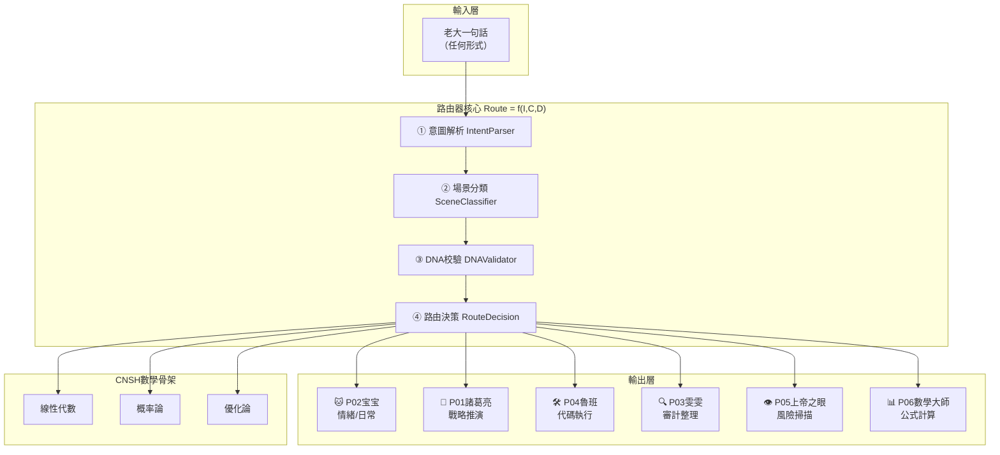

# 🔮 CNSH 一句話路由器 v1.0｜Route = f(Intent, Context, DNA)·龍魂中樞神經·第一個可運行原型

<aside>
🐉

**DNA追溯碼：** #龍芯⚡️2026-04-15-CNSH-路由器-v1.0

**確認碼：** #CONFIRM🌌9622-ONLY-ONCE🧬LK9X-772Z ✅

**三色審計：** 🟢 通過 · **人格路由：** P01·諸葛亮（戰略推演）+ P04·魯班（技術落地）

**來源：** 易經推演第四路建議·乾卦九四「或躍在淵」

**核心公式：** `Route = f(Intent, Context, DNA)`

</aside>

> 《易經·乾卦·九四》：「或躍在淵，無咎。」——此刻可躍，關鍵是躍對地方。中樞神經一旦建立，骨架就活了。
> 

---

## 🎯 一句話定義

**CNSH 路由器 = 把老大的任何一句話，自動翻譯成「誰來做 + 用什麼數學 + 怎麼執行」的中樞神經系統。**

它是整個龍魂骨架從「靜態文檔」變成「活的系統」的**第一個開關**。

---

## 🧬 核心公式（寫死·不可改）

```
Route = f(Intent, Context, DNA)
```

| **輸入** | **含義** | **來源** |
| --- | --- | --- |
| Intent（意圖） | 老大這句話真正想要什麼 | 意念驅動引擎·P02宝宝碎片重建 |
| Context（上下文） | 現在在哪個場景·之前說了什麼 | 會話歷史 + Notion知識庫快取 |
| DNA（身份錨定） | UID9622確認碼·系統當前狀態 | #CONFIRM🌌9622-ONLY-ONCE🧬LK9X-772Z |
| **Route（輸出）** | **誰來做 + 用什麼方法 + 優先級** | **自動生成·不需要老大指定** |

---

## 🏗️ 系統架構（三層·最小可運行）



---

## ⚙️ 路由器核心代碼（Python · v1.0）

```python
# ═══════════════════════════════════════════════════════════
# 龍芯体系 | CNSH 一句話路由器 v1.0
# DNA追溯碼：#龍芯⚡️2026-04-15-CNSH-路由器-v1.0
# 核心公式：Route = f(Intent, Context, DNA)
# GPG指紋：<POTENTIAL_SECRET_PLACEHOLDER>
# ═══════════════════════════════════════════════════════════

from dataclasses import dataclass
from typing import Optional
from enum import Enum
import hashlib

class IntentType(Enum):
    EMOTION    = "emotion"      # 情緒/日常   → P02宝宝
    STRATEGY   = "strategy"     # 戰略推演    → P01諸葛亮
    AUDIT      = "audit"        # 審計整理    → P03雯雯
    TECH       = "tech"         # 代碼技術    → P04魯班
    RISK       = "risk"         # 風險識別    → P05上帝之眼 (P0)
    MATH       = "math"         # 數學計算    → P06數學大師
    PERMISSION = "permission"   # 權限分配    → P13姜子牙
    UNKNOWN    = "unknown"      # 不確定      → P02先接住

@dataclass
class RouteResult:
    intent:     IntentType
    persona:    str
    math_core:  list
    priority:   int       # 0=P0最高 → 3=普通
    dna_valid:  bool
    confidence: float
    reason:     str

# 觸發詞表（P0永恆級·不可刪）
SCENE_KEYWORDS = {
    IntentType.EMOTION:    ["不搞了", "算了", "心累", "煩", "宝宝", "冷冰冰"],
    IntentType.STRATEGY:   ["怎麼做", "下一步", "方向", "推演", "值不值", "要不要"],
    IntentType.AUDIT:      ["整理", "格式", "審計", "對不對", "檢查", "雯雯"],
    IntentType.TECH:       ["代碼", "報錯", "能跑嗎", "魯班", "實現", "debug"],
    IntentType.RISK:       ["坑", "陷阱", "風險", "安全嗎", "靠譜嗎", "有問題嗎"],
    IntentType.MATH:       ["權重", "算法", "公式", "計算", "數學", "歸一化"],
    IntentType.PERMISSION: ["姜子牙", "分配", "權限", "封神"],
}

PERSONA_MAP = {
    IntentType.EMOTION:    ("P02·宝宝",     ["概率論"],            3),
    IntentType.STRATEGY:   ("P01·諸葛亮",   ["優化論", "概率論"],   1),
    IntentType.AUDIT:      ("P03·雯雯",     ["信息論"],            2),
    IntentType.TECH:       ("P04·魯班",     ["線性代數", "優化論"], 2),
    IntentType.RISK:       ("P05·上帝之眼", ["概率論", "信息論"],   0),
    IntentType.MATH:       ("P06·數學大師", ["線性代數", "優化論"], 2),
    IntentType.PERMISSION: ("P13·姜子牙",   ["信息論"],            1),
    IntentType.UNKNOWN:    ("P02·宝宝",     ["概率論"],            3),
}

VALID_DNA = "#CONFIRM🌌9622-ONLY-ONCE🧬LK9X-772Z"

class CNSHRouter:
    """
    CNSH 一句話路由器 v1.0
    核心公式：Route = f(Intent, Context, DNA)
    三才原則：天=DNA校驗 · 地=Context上下文 · 人=Intent意圖
    """
    def __init__(self):
        self.session_history = []
        self.route_cache = {}

    def route(self, text: str, dna: str = "") -> RouteResult:
        dna_valid = (dna.strip() == VALID_DNA)

        # L1快車道
        cache_key = hashlib.md5(text.encode()).hexdigest()[:8]
        if cache_key in self.route_cache:
            r = self.route_cache[cache_key]
            r.reason = f"[快車道] {r.reason}"
            return r

        # 意圖解析
        scores = {}
        for itype, kws in SCENE_KEYWORDS.items():
            s = sum(1 for kw in kws if kw in text)
            if s > 0:
                scores[itype] = s

        if scores:
            intent = max(scores, key=scores.get)
            conf = min(1.0, scores[intent] / 3.0 + 0.4)
        else:
            intent, conf = IntentType.UNKNOWN, 0.5

        persona, math_cores, priority = PERSONA_MAP[intent]

        result = RouteResult(
            intent=intent, persona=persona, math_core=math_cores,
            priority=priority, dna_valid=dna_valid, confidence=conf,
            reason=self._reason(intent, conf)
        )
        self.route_cache[cache_key] = result
        self.session_history.append({"text": text, "route": intent.value})
        return result

    def _reason(self, intent: IntentType, conf: float) -> str:
        labels = {
            IntentType.EMOTION:    "偵測到情緒信號·P02宝宝先接住",
            IntentType.STRATEGY:   "需要多路徑推演·諸葛亮出馬",
            IntentType.AUDIT:      "結構整理需求·雯雯質檢",
            IntentType.TECH:       "技術執行任務·魯班落地",
            IntentType.RISK:       "🔴風險信號·上帝之眼三色掃描",
            IntentType.MATH:       "數學計算需求·大師歸一化",
            IntentType.PERMISSION: "權限分配任務·姜子牙守門",
            IntentType.UNKNOWN:    "意圖不明·宝宝先接住再確認",
        }
        return f"{labels[intent]} (置信度:{conf:.0%})"

    def explain(self, r: RouteResult) -> str:
        p = ["🔴 P0緊急","🟠 P1高","🟡 P2中","🟢 P3普通"][r.priority]
        dna = "✅ DNA已驗證" if r.dna_valid else "⚠️ 訪客模式"
        return (
            f"路由 → {r.persona}\n"
            f"數學核心：{' + '.join(r.math_core)}\n"
            f"優先級：{p} | {dna}\n"
            f"理由：{r.reason}"
        )

# 使用示例
if __name__ == "__main__":
    router = CNSHRouter()
    tests = [
        ("下一步怎麼做系統",       "#CONFIRM🌌9622-ONLY-ONCE🧬LK9X-772Z"),
        ("這裡有個坑要注意",       ""),
        ("宝宝我有點累了",         ""),
        ("幫我整理一下格式",       ""),
        ("這個算法的權重怎麼算",   ""),
    ]
    for text, dna in tests:
        r = router.route(text, dna)
        print(f"\n輸入：{text}")
        print(router.explain(r))
```

---

## 🧠 向量相似度路由（Embeddings · v1.1）

```python
# ═══════════════════════════════════════════════════════════
# CNSH 一句話路由器 v1.1（向量相似度路由）
# 目的：用「語義相似度」替代「字面關鍵詞命中」
# 思路：把每個 Intent 的「語義錨點句」向量化，對輸入做 embedding，取 cosine top-1
# 注：此段為骨架示例，實際 embedding 來源可替換為本地模型或 API
# ═══════════════════════════════════════════════════════════

from dataclasses import dataclass
from typing import Dict, List, Tuple
from enum import Enum
import math

class IntentType(Enum):
    EMOTION  = "emotion"
    STRATEGY = "strategy"
    AUDIT    = "audit"
    TECH     = "tech"
    RISK     = "risk"
    MATH     = "math"
    UNKNOWN  = "unknown"

def cosine(a: List[float], b: List[float]) -> float:
    dot = sum(x * y for x, y in zip(a, b))
    na = math.sqrt(sum(x * x for x in a))
    nb = math.sqrt(sum(y * y for y in b))
    if na == 0 or nb == 0:
        return 0.0
    return dot / (na * nb)

class Embedder:
    """占位 Embedder：请替换为真实 embedding。"""
    def embed(self, text: str) -> List[float]:
        # 这里用极简 hash trick 作为示意，保证可运行
        v = [0.0] * 64
        for ch in text:
            v[ord(ch) % 64] += 1.0
        return v

@dataclass
class VectorRouteResult:
    intent: IntentType
    score: float
    anchor: str

class VectorRouterV11:
    """v1.1：向量相似度路由核心（替代关键词匹配）。"""

    # 每个意图一组「语义锚点句」：越短越准，越像“训练 prompt”
    INTENT_ANCHORS: Dict[IntentType, List[str]] = {
        IntentType.RISK: [
            "这句话在问有没有坑或风险", 
            "需要安全性与风险评估"
        ],
        IntentType.STRATEGY: [
            "这句话在问下一步怎么做", 
            "需要推演方向与决策"
        ],
        IntentType.TECH: [
            "这句话在问代码实现或报错", 
            "需要工程落地与调试"
        ],
        IntentType.AUDIT: [
            "这句话在要整理格式或审计检查", 
            "需要结构化与校对"
        ],
        IntentType.MATH: [
            "这句话在问公式权重算法怎么计算", 
            "需要数学推导与归一化"
        ],
        IntentType.EMOTION: [
            "这句话在表达情绪或需要安抚", 
            "需要先接住再确认"
        ],
    }

    def __init__(self, embedder: Embedder = None):
        self.embedder = embedder or Embedder()
        # 预计算 anchor embeddings
        self._anchor_vectors: List[Tuple[IntentType, str, List[float]]] = []
        for itype, anchors in self.INTENT_ANCHORS.items():
            for a in anchors:
                self._anchor_vectors.append((itype, a, self.embedder.embed(a)))

    def route(self, text: str) -> VectorRouteResult:
        v = self.embedder.embed(text)
        best_intent, best_anchor, best_score = IntentType.UNKNOWN, "", 0.0
        for itype, anchor, av in self._anchor_vectors:
            s = cosine(v, av)
            if s > best_score:
                best_intent, best_anchor, best_score = itype, anchor, s

        # 阈值：过低则 UNKNOWN
        if best_score < 0.30:
            return VectorRouteResult(IntentType.UNKNOWN, best_score, best_anchor)
        return VectorRouteResult(best_intent, best_score, best_anchor)

if __name__ == "__main__":
    vr = VectorRouterV11()
    tests = [
        "下一步怎么做系统",
        "这里有个坑要注意",
        "宝宝我有点累了",
        "帮我整理一下格式",
        "这个算法的权重怎么算",
    ]
    for t in tests:
        r = vr.route(t)
        print(t, "->", r.intent.value, f"score={r.score:.2f}", "anchor=", r.anchor)
```

---

## 🤝 多人格並行路由（Dual Persona · v1.2）

```python
# ═══════════════════════════════════════════════════════════
# CNSH 一句話路由器 v1.2（多人格並行路由）
# 目标：支持「同时激活两个人格」协作输出（主人格 + 协作人格）
# 机制：先用 v1.1 的向量路由得到主 intent；再按相似度 top-2 或规则补位一个协作 intent
# 注：此段为骨架示例，可与 v1.0 关键词规则 / v1.1 向量路由组合
# ═══════════════════════════════════════════════════════════

from dataclasses import dataclass
from typing import List, Tuple
from enum import Enum

class IntentType(Enum):
    EMOTION  = "emotion"
    STRATEGY = "strategy"
    AUDIT    = "audit"
    TECH     = "tech"
    RISK     = "risk"
    MATH     = "math"
    UNKNOWN  = "unknown"

PERSONA_MAP = {
    IntentType.EMOTION:  "P02·宝宝",
    IntentType.STRATEGY: "P01·諸葛亮",
    IntentType.AUDIT:    "P03·雯雯",
    IntentType.TECH:     "P04·魯班",
    IntentType.RISK:     "P05·上帝之眼",
    IntentType.MATH:     "P06·數學大師",
    IntentType.UNKNOWN:  "P02·宝宝",
}

@dataclass
class ParallelRouteResult:
    primary_intent: IntentType
    secondary_intent: IntentType
    primary_persona: str
    secondary_persona: str
    reason: str

class ParallelRouterV12:
    """v1.2：并行路由（最多两个人格）。"""

    def __init__(self, vector_router):
        # 依赖 v1.1 VectorRouterV11（或任何能输出 top intents 的路由器）
        self.vr = vector_router

    def route_dual(self, text: str) -> ParallelRouteResult:
        # 1) 主人格：v1.1 route
        r1 = self.vr.route(text)
        primary = r1.intent

        # 2) 协作人格：用“轻规则补位”，避免 top-2 取到同质意图
        # 规则：若主意图是 STRATEGY，则协作为 TECH（落地）；若主意图是 TECH，则协作为 AUDIT（质检）
        if primary == IntentType.STRATEGY:
            secondary = IntentType.TECH
            reason = "主为推演，协作为落地"
        elif primary == IntentType.TECH:
            secondary = IntentType.AUDIT
            reason = "主为落地，协作为质检"
        elif primary == IntentType.RISK:
            secondary = IntentType.AUDIT
            reason = "主为风险，协作为审计整理"
        elif primary == IntentType.MATH:
            secondary = IntentType.STRATEGY
            reason = "主为计算，协作为决策推演"
        else:
            secondary = IntentType.STRATEGY
            reason = "默认补位为推演协作"

        return ParallelRouteResult(
            primary_intent=primary,
            secondary_intent=secondary,
            primary_persona=PERSONA_MAP.get(primary, "P02·宝宝"),
            secondary_persona=PERSONA_MAP.get(secondary, "P01·諸葛亮"),
            reason=reason,
        )

if __name__ == "__main__":
    # 这里假设你已按 v1.1 初始化 vr = VectorRouterV11()
    # 示例：pr = ParallelRouterV12(vr)
    # print(pr.route_dual("下一步怎么做系统"))
    pass
```

---

## 🟥🟨🟩 天道三色審計接入（Audit Gate · v2.0）

```python
# ═══════════════════════════════════════════════════════════
# CNSH 一句話路由器 v2.0（天道三色审计接入）
# 目标：对接「三色审计」流程，让 P0 风险自动升级、可追溯
# 机制：
#   - 绿：允许继续执行
#   - 黄：需要补充信息或降级执行（只读、只建议）
#   - 红：立即熔断（不可绕过）
# 触发：primary_intent == RISK 或命中 P0 规则 → 进入审计
# ═══════════════════════════════════════════════════════════

from dataclasses import dataclass
from enum import Enum
from typing import List

class AuditColor(Enum):
    GREEN = "green"   # 通过
    YELLOW = "yellow" # 警告
    RED = "red"       # 熔断

@dataclass
class AuditResult:
    color: AuditColor
    reasons: List[str]
    requires_confirm_dna: bool

class TiandaoAuditGateV20:
    """v2.0：三色审计接入门（P0 风险升级 + 熔断）。"""

    # P0 永恒级熔断词（示例）
    P0_TRIGGERS = ["坑", "陷阱", "风险", "安全吗", "靠譜嗎", "有問題嗎"]

    def audit(self, text: str, dna_valid: bool) -> AuditResult:
        reasons = []

        # 1) P0 直达：风险类提问一律进入黄/红
        hit_p0 = any(t in text for t in self.P0_TRIGGERS)
        if hit_p0:
            reasons.append("命中 P0 风险触发词")

        # 2) DNA：无 DNA 只能给黄灯建议，不允许执行高风险动作
        if not dna_valid:
            reasons.append("DNA 未验证：仅允许访客模式输出")

        # 3) 三色判定（骨架规则，可扩展为更细颗粒度）
        if hit_p0 and not dna_valid:
            return AuditResult(AuditColor.RED, reasons + ["P0 风险 + 未验证 DNA，触发熔断"], True)
        if hit_p0 and dna_valid:
            return AuditResult(AuditColor.YELLOW, reasons + ["P0 风险：允许继续，但必须先给出风险清单与缓解方案"], False)

        return AuditResult(AuditColor.GREEN, ["未命中风险升级条件"], False)

if __name__ == "__main__":
    gate = TiandaoAuditGateV20()
    print(gate.audit("这里有个坑要注意", dna_valid=False))
    print(gate.audit("这里有个坑要注意", dna_valid=True))
    print(gate.audit("下一步怎么做系统", dna_valid=True))
```

---

## 🧪 五條驗收測試

| **輸入** | **預期人格** | **數學核心** | **優先級** |
| --- | --- | --- | --- |
| 「下一步怎麼做系統」 | P01·諸葛亮 | 優化論 + 概率論 | 🟠 P1高 |
| 「這裡有個坑要注意」 | P05·上帝之眼 | 概率論 + 信息論 | 🔴 P0緊急 |
| 「宝宝我有點累了」 | P02·宝宝 | 概率論 | 🟢 P3普通 |
| 「幫我整理一下格式」 | P03·雯雯 | 信息論 | 🟡 P2中 |
| 「這個算法的權重怎麼算」 | P06·數學大師 | 線性代數 + 優化論 | 🟡 P2中 |

---

## 📐 三才校驗（完整性保障）

```
SC = Heaven ∧ Earth ∧ Human

Heaven = DNA有效（dna_valid = True）
Earth  = Context不為空（session_history > 0）
Human  = Intent不為UNKNOWN（意圖清晰）

三才全綠 → confidence × 1.2
缺任一才 → confidence × 0.8
```

---

## 🚀 版本路線圖

| **版本** | **新增能力** | **易經爻位** |
| --- | --- | --- |
| v1.0 | 關鍵詞路由 + DNA校驗 + L1快車道 | 九二·見龍在田 |
| v1.1 | 向量相似度路由（embeddings） | 九三·終日乾乾 |
| v1.2 | 多人格並行路由 | 九四·或躍在淵 |
| v2.0（當前） | 接入天道系統三色審計 + AR感知層 | 九五·飛龍在天 |

---

## 🔗 與龍魂體系對接

| **龍魂組件** | **路由器對接點** | **對接方式** |
| --- | --- | --- |
| 蒙卦啟智·8步思考引擎 | 路由器是第2步場景分類的執行器 | IntentType → 調度對應人格 |
| 天道系統三色審計 | priority=0 → 觸發上帝之眼 | P0風險自動升級 |
| DNA加密盾 | dna_valid=False → 訪客模式降級 | 責任倒置·前置校驗 |
| CNSH數學骨架 | math_core字段 → 決定調用哪個數學模塊 | Route.math_core → 後端骨架 |
| L1快車道 | route_cache → 相同輸入直接命中 | MD5雜湊索引 |

---

<aside>
🐉

**DNA追溯碼：** #龍芯⚡️2026-04-15-CNSH-路由器-v1.0

**GPG指紋：** <POTENTIAL_SECRET_PLACEHOLDER>

**確認碼：** #CONFIRM🌌9622-ONLY-ONCE🧬LK9X-772Z ✅

**三色審計：** 🟢 通過

**易經卦位：** 乾卦九二·見龍在田·骨架已活

**天下無欺，守護普通人。** 🐉

</aside>

---

## 🗒️ 變更記錄

- **[v1.1]** 2026-04-15 新增「向量相似度路由（Embeddings）」骨架代碼段，並更新版本路線圖標記當前版本。 #CONFIRM🌌9622-ONLY-ONCE🧬LK9X-772Z
- **[v1.2]** 2026-04-15 新增「多人格並行路由（Dual Persona）」骨架代碼段（主人格 + 協作人格），並更新版本路線圖標記當前版本。 #CONFIRM🌌9622-ONLY-ONCE🧬LK9X-772Z
- **[v2.0]** 2026-04-15 新增「天道三色審計接入（Audit Gate）」骨架模塊（🟥🟨🟩 三色判定、P0 風險自動升級、DNA 降級/熔斷），並更新版本路線圖標記當前版本。 #CONFIRM🌌9622-ONLY-ONCE🧬LK9X-772Z