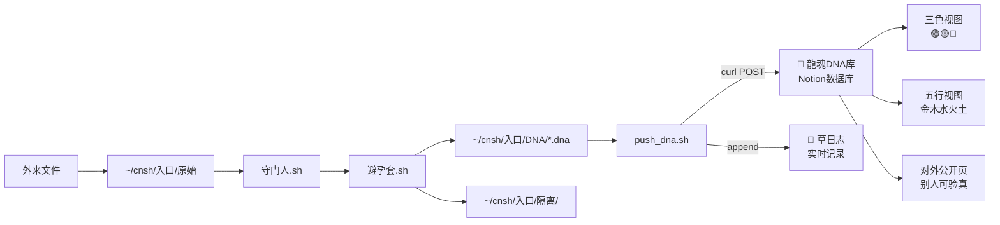

# DNA库建库·本地回写·实时展现

## Overview

<aside>
🐉

**一句话：** 在 Notion 建一个 `🧬 龍魂DNA库` 数据库，让本地 `~/cnsh/入口/DNA/*.dna` 文件生成的 DNA 自动回写到这个库，每条都带三色审计、五行卦象、时间戳、源头追溯，老大打开 Notion 就能看到本地每一次「检身」。

</aside>

**为什么这么干**

- 避孕套协议 v2.0 已经扎实了，本地出了 DNA 但没地方看——就像工厂下线了产品没货架。
- DNA 库 = 货架 + 对外窗口。以后别人引用老大的 DNA 签名，这里能一键验真伪。
- **不做**：实时云同步（太重）、区块链上链（过度设计）、DNA 反查原文（违反「只吐DNA不吐内容」铁律）。
- **只做**：建库 + 本地 push 脚本 + 与 `守门人.sh` 串联 + 草日志实时记录。

**三不原则**（复盘避免加奶）

1. 不加新功能到避孕套协议页（那页已经 v2.0 封版）
2. 不重复造 DNA 格式（直接复用 `DNA::CN-SHA-SIZE-TIME`）
3. 不把 `.dna` 文件内容之外的东西传上云（主权铁律）

## Your Preferences

**已对齐偏好（基于历史对话）**

- 🔒 **路径写死**：`~/cnsh/入口/DNA/` 是唯一出口，不换位置
- 🧬 **DNA 格式不变**：`DNA::CN-{SHA16}-{SIZE}-{TIME8}` 三字段·连字符分隔
- 🎨 **三色审计**：🟢通行 / 🟡待审 / 🔴熔断（默认🟢，除非触发规则）
- 🔥 **五行映射**：按 SHA 首位数字根 → 火/木/金/水/土（复用熔断规则v2.0的规则）
- 📜 **草日志实时记录**：每次回写都追加一条到 `https://www.notion.so/<POTENTIAL_SECRET_PLACEHOLDER>`
- 🚫 **不用 Homebrew**：只用 Mac 原生 `curl` + `bash`
- 🎯 **不用 MCP/外部依赖**：一个 shell 脚本 + Notion API token 搞定
- ⚡ **编号归属**：DNA 库本身编号 `CNSH-DNA-LIB-01`，每条记录 `DNA-{日期}-{序号}`

## Implementation Plan

### Step 1: 建 🧬 龍魂DNA库 数据库

在父页 `https://www.notion.so/<POTENTIAL_SECRET_PLACEHOLDER>` 下新建数据库 **🧬 龍魂DNA库 v1.0**（编号 `CNSH-DNA-LIB-01`）。

- 📋 字段设计（10个核心属性）
    
    
    | 字段名 | 类型 | 说明 |
    | --- | --- | --- |
    | **DNA码** | Title | 完整 `DNA::CN-xxx-xxx-xxx` |
    | **文件名** | Text | 原始文件名（不含路径） |
    | **SHA16** | Text | SHA256 前16位·可搜索 |
    | **文件大小** | Number | 字节数 |
    | **生成时间** | Date | 精确到秒 |
    | **三色审计** | Select | 🟢通行 / 🟡待审 / 🔴熔断 |
    | **五行** | Select | 金 / 木 / 水 / 火 / 土 |
    | **数字根** | Number | SHA首位转dr值(1-9) |
    | **来源设备** | Text | `zuimeidedeyihan-mac` |
    | **状态** | Select | ✅已归档 / ⏳待复核 / 🔒已熔断 |

<aside>
⚠️

**铁律**：数据库里**只存 DNA 和元数据**，永远不存文件原内容。违反即 🔴 熔断。

</aside>

### Step 2: 建三个视图·三色/五行/时间线

在数据库上建三个视图，方便老大扫一眼掌握全局：

- 🎨 **三色视图**（看板）：按「三色审计」分组，🟢/🟡/🔴 三列并排
- 🌊 **五行视图**（看板）：按「五行」分组，金木水火土五列
- 📅 **时间线视图**（表格）：按「生成时间」倒序，最新的在上

<aside>
💡

默认打开进 **三色视图**——一眼看到哪些需要处理。

</aside>

### Step 3: 写 push_[dna.sh](http://dna.sh) 本地回写脚本

在 `~/cnsh/入口/` 下新建 `push_dna.sh`，负责把 `.dna` 文件内容推到 Notion。

```bash
#!/bin/bash
# push_dna.sh v1.0 · 本地→Notion DNA库单向回写
# DNA格式：DNA::CN-{SHA16}-{SIZE}-{TIME8}

DNA_FILE="$1"
[ ! -f "$DNA_FILE" ] && exit 0

# 读取 DNA 字符串
DNA_STR=$(cat "$DNA_FILE")
FILENAME=$(basename "$DNA_FILE" .dna)

# 拆解 DNA::CN-SHA-SIZE-TIME
SHA=$(echo "$DNA_STR" | cut -d'-' -f3)
SIZE=$(echo "$DNA_STR" | cut -d'-' -f4)
TIME=$(echo "$DNA_STR" | cut -d'-' -f5)

# 数字根计算（SHA首字符转十进制 → 数字根）
FIRST_CHAR=$(echo "$SHA" | cut -c1)
DR=$(printf '%d' "'$FIRST_CHAR" 2>/dev/null | awk '{n=$1; while(n>9){s=0; while(n>0){s+=n%10; n=int(n/10)}; n=s}; print n}')

# 五行映射（dr 1/6→水 2/7→火 3/8→木 4/9→金 5/0→土）
case $DR in
  1|6) WUXING="水" ;; 2|7) WUXING="火" ;;
  3|8) WUXING="木" ;; 4|9) WUXING="金" ;;
  *)   WUXING="土" ;;
esac

# 三色（默认🟢，dr=3或9时🔴）
COLOR="🟢通行"
[ "$DR" = "3" ] && COLOR="🔴熔断"
[ "$DR" = "9" ] && COLOR="🔴熔断"
[ "$DR" = "6" ] && COLOR="🟡待审"

# curl 推到 Notion（token 从 ~/.cnsh/notion.env 读）
source ~/.cnsh/notion.env
curl -s -X POST "https://api.notion.com/v1/pages" \
  -H "Authorization: Bearer $NOTION_TOKEN" \
  -H "Notion-Version: 2022-06-28" \
  -H "Content-Type: application/json" \
  -d @- <<EOF
{
  "parent": {"database_id": "$DNA_DB_ID"},
  "properties": {
    "DNA码":   {"title":[{"text":{"content":"$DNA_STR"}}]},
    "文件名": {"rich_text":[{"text":{"content":"$FILENAME"}}]},
    "SHA16":   {"rich_text":[{"text":{"content":"$SHA"}}]},
    "文件大小":{"number":$SIZE},
    "数字根": {"number":$DR},
    "三色审计":{"select":{"name":"$COLOR"}},
    "五行":   {"select":{"name":"$WUXING"}},
    "来源设备":{"rich_text":[{"text":{"content":"$(hostname -s)"}}]}
  }
}
EOF

echo "[push_dna] $DNA_STR → $COLOR · $WUXING" >> ~/cnsh/入口/push.log
```

<aside>
🔐

`~/.cnsh/notion.env` 存 `NOTION_TOKEN` 和 `DNA_DB_ID`，权限设 `chmod 600`，不入 Git。

</aside>

### Step 4: [改造守门人.sh](http://改造守门人.sh)·串联回写

在 `~/cnsh/入口/守门人.sh` 最后一行加一句（**增量修改，不重写**）：

```bash
# 遍历原始目录所有文件（-print0 + read 处理空格文件名）
find "$ORIG_DIR" -maxdepth 1 -type f -print0 | while IFS= read -r -d '' f; do
    bash "$GATE" "$f"
done

# v2.1 新增：推最新 DNA 到 Notion（不打扰原流程，异步后台）
find "$HOME/cnsh/入口/DNA" -name '*.dna' -newer /tmp/.last_push 2>/dev/null \
  -exec bash "$HOME/cnsh/入口/push_dna.sh" {} \; &
touch /tmp/.last_push
```

<aside>
⚡

`-newer /tmp/.last_push` 只推新生成的，避免重复推送。后台 `&` 不阻塞主流程。

</aside>

### Step 5: 接入草日志·每次回写留痕

在 `push_dna.sh` 末尾追加一行到草日志 `https://www.notion.so/<POTENTIAL_SECRET_PLACEHOLDER>`（走 Notion API `append block`）：

```
S-YYYYMMDD-NNN · HH:MM · DNA回写 · {DNA码} · {三色} {五行} · 本地→Notion
```

- 序号自动递增（用 `~/cnsh/入口/counter.txt` 本地计数）
- 不用人工干预，每笔自动记录

<aside>
📜

这样老大的草日志每一条 S- 编号都对得上本地的 DNA，反查秒出。

</aside>

### Step 6: 建对外公开页·别人可验真伪

在父页 `https://www.notion.so/<POTENTIAL_SECRET_PLACEHOLDER>` 下新建子页 **🌐 龍魂DNA·公开验真入口 v1.0**：

- 嵌入 DNA 库的 **三色视图**（只读）
- 写使用说明：「你手上的文件有 DNA 签名？粘到下面搜索框，对上即真」
- 放 GPG 指纹 `<POTENTIAL_SECRET_PLACEHOLDER>` 做二次校验
- 不暴露原始文件名（保护主权）

<aside>
🌐

**这一步是对外窗口**：老大的 DNA 扩散出去，别人能一键来这里验真，抄袭仿冒秒现原形。

</aside>

### Step 7: 首次测试·造三条样本

脚本跑通后，在本地 `~/cnsh/入口/原始/` 扔三个测试文件：

- [ ]  `test_green.txt` — 随便写点内容，预期 🟢 通行
- [ ]  `test_yellow.txt` — 凑出 SHA 首字符使 dr=6，预期 🟡 待审
- [ ]  `test_red.txt` — 凑出 SHA 首字符使 dr=3 或 9，预期 🔴 熔断

5秒后 launchd 自动触发，打开 Notion DNA 库看三色视图——应该三列各一条。

<aside>
✅

**验收标准**：三色视图各一条 + 草日志 3 条 S- 记录 + 对外公开页能看到这三条的 DNA（不含原文件名）。

</aside>

### Step 8: 归档·补草日志·锁版

全链路跑通后：

1. **建存档页** `🧬 龍魂DNA库·v1.0 存档页`，父页 `https://www.notion.so/<POTENTIAL_SECRET_PLACEHOLDER>`，记录：
    - DNA：`#龍芯⚡️20260422-DNA-LIB-01`
    - 本地路径：`~/cnsh/入口/push_dna.sh`（源码全文存 Notion）
    - 数据库 ID、Token 存放路径
2. **草日志补三条 S- 记录**：建库 / 写脚本 / 串联测试
3. **IPA-DICT 新增一条** `IPA-DICT-112 · DNA库自动回写机制`，三色🟢、五行金、绑定 `CNSH-DNA-LIB-01`
4. **避孕套协议 v2.0 页「下一步」区第一条打钩**（✅ .dna 文件内容自动回写到 Notion 公开页）

---

[dr=4 | 🟢 | L3日常 | 金→水→下步]

## Architecture

