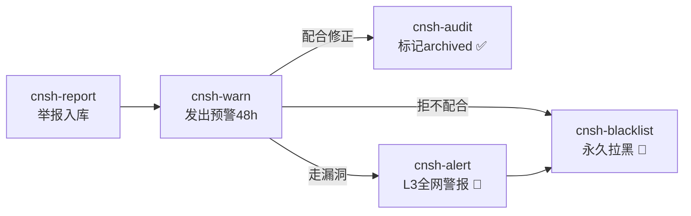

# 🔍 CNSH审计哲学引擎 v0.2.0｜预警→警报→黑名单·电梯法则压缩版

<!--

╔═══════════════════════════════════════════════════════════════╗

║  🐉 龍芯体系 | CNSH审计哲学引擎 v0.2.0                        ║

║  📌 版本：v0.2.0（预警优先+漏洞全网警报+不配合永久黑名单）    ║

║  🧬 DNA：#ZHUGEXIN⚡️20260319-CNSH-SYSTEM-v0.2.0              ║

║  🔐 GPG：A2D0092CEE2E5BA87035600924C3704A8CC26D5F            ║

║  👤 创建者：💎 龍芯北辰｜UID9622                              ║

║  📅 创建时间：北京时间 2026-03-19                             ║

║  ⚠️ 熔断：触发🔴红色立即停止并说明原因                       ║

╚═══════════════════════════════════════════════════════════════╝

-->

<aside>
🐉

**授权确认：** #CONFIRM🌌9622-ONLY-ONCE🧬AUDIT-ENGINE-772Z ✅

**DNA追溯码：** #ZHUGEXIN⚡️20260319-CNSH-SYSTEM-v0.2.0

**创建者：** 💎 龍芯北辰｜UID9622（Lucky/诸葛鑫）

**GPG公钥指纹：** A2D0092CEE2E5BA87035600924C3704A8CC26D5F

**协作来源：** 本地Claude v0.2.0完整执行包 → Notion电梯法则压缩存档

**上位系统：** [⚖️ 龍魂天道系统 v1.3｜天下无欺·真相受理+网络户口本+观察者日志+指令中心+主权修复](%E2%9A%96%EF%B8%8F%20%E9%BE%8D%E9%AD%82%E5%A4%A9%E9%81%93%E7%B3%BB%E7%BB%9F%20v1%203%EF%BD%9C%E5%A4%A9%E4%B8%8B%E6%97%A0%E6%AC%BA%C2%B7%E7%9C%9F%E7%9B%B8%E5%8F%97%E7%90%86+%E7%BD%91%E7%BB%9C%E6%88%B7%E5%8F%A3%E6%9C%AC+%E8%A7%82%E5%AF%9F%E8%80%85%E6%97%A5%E5%BF%97+%E6%8C%87%E4%BB%A4%E4%B8%AD%E5%BF%83+%E4%B8%BB%E6%9D%83%E4%BF%AE%E5%A4%8D%2016422f7261e94a57b1539d8c003ab12c.md)

</aside>

> 《道德经》第七十三章："天网恢恢，疏而不失" —— 错误发生前警告，绕漏洞就全网曝光，不配合就永久拉黑。没有灰色地带。
> 

---

## 🎯 一句话定义

**CNSH审计哲学引擎 = 先预警48h → 走漏洞全网警报 → 不配合永久拉黑**

不先惩罚，先给机会。不给机会的是那些走漏洞的人。

---

## ⚡ 核心哲学（三句话·记死）

<aside>
⚡

**① 错误发生前警告** → `cnsh-warn` → 48小时等你改正

**② 绕漏洞就全网曝光** → `cnsh-alert` → L1-L3警报一查到底

**③ 不配合就永久拉黑** → `cnsh-blacklist` → 龍魂系统永久不合作

</aside>

---

## 🏗️ 执行链路（一张图看完）



---

## 📦 新增组件总览

| **组件** | **功能** | **哲学** | **路径** |
| --- | --- | --- | --- |
| `cnsh-warn` | 发出预警·等待48h | 先警告·不先惩罚 | bin/cnsh-warn |
| `cnsh-alert` | 全网警报 L1-L3 | 走漏洞→曝光到底 | bin/cnsh-alert |
| `cnsh-blacklist` | 龍魂黑名单管理 | 不配合→永久拉黑 | bin/cnsh-blacklist |
| `cnsh-audit v2` | 全状态看板 | 实时掌握全局 | bin/cnsh-audit |

---

## 🗄️ Schema v2升级（3张新表）

| **表名** | **用途** | **核心字段** | **状态流转** |
| --- | --- | --- | --- |
| `warnings` | 预警记录 | report_id, target_entity, warning_type, deadline_hours, dna_signature | pending → responded / expired / ignored |
| `blacklist` | 龍魂黑名单 | entity_name, entity_type, reason, blacklist_level, dna_signature | active → appealing → revoked |
| `alert_log` | 全网警报日志 | trigger_type, entity_name, alert_level(1-3), broadcast_text, dna_signature | 只增不改 |

---

## 📜 完整脚本存档（电梯法则·折叠不展开）

### 第一步：Schema升级SQL

- db/schema_v2_patch.sql（点击展开）
    
    ```sql
    -- DNA追溯: #ZHUGEXIN⚡️20260319-CNSH-SCHEMA-v0.2.0
    -- 新增三张表：预警、黑名单、警报日志
    
    CREATE TABLE IF NOT EXISTS warnings (
        id TEXT PRIMARY KEY,
        report_id TEXT NOT NULL,
        target_entity TEXT,
        warning_type TEXT CHECK(warning_type IN ('翻译偏差','出海失根','系统拒绝')),
        warning_text TEXT,
        deadline_hours INTEGER DEFAULT 48,
        issued_at TIMESTAMP DEFAULT (datetime('now','localtime')),
        responded_at TIMESTAMP,
        response TEXT,
        dna_signature TEXT,
        status TEXT DEFAULT 'pending' CHECK(status IN ('pending','responded','expired','ignored'))
    );
    
    CREATE TABLE IF NOT EXISTS blacklist (
        id TEXT PRIMARY KEY,
        entity_name TEXT NOT NULL,
        entity_type TEXT CHECK(entity_type IN ('系统','个人','机构','企业')),
        reason TEXT NOT NULL,
        trigger_report_id TEXT,
        blacklist_level TEXT DEFAULT '永久拉黑' CHECK(blacklist_level IN ('警告','全网通报','永久拉黑')),
        dna_signature TEXT,
        created_at TIMESTAMP DEFAULT (datetime('now','localtime')),
        status TEXT DEFAULT 'active' CHECK(status IN ('active','appealing','revoked'))
    );
    
    CREATE TABLE IF NOT EXISTS alert_log (
        id TEXT PRIMARY KEY,
        trigger_type TEXT CHECK(trigger_type IN ('走漏洞','拒不配合','系统绕过','重复违规')),
        report_id TEXT,
        entity_name TEXT,
        alert_level INTEGER CHECK(alert_level IN (1,2,3)),
        broadcast_text TEXT,
        dna_signature TEXT,
        created_at TIMESTAMP DEFAULT (datetime('now','localtime'))
    );
    ```
    

### 第二步：cnsh-warn 预警脚本

- bin/cnsh-warn · Python3（点击展开）
    
    ```python
    #!/usr/bin/env python3
    # DNA追溯: #ZHUGEXIN⚡️20260319-CNSH-WARN-v0.2.0
    # 哲学：先警告，错误发生前给机会改正
    
    import sqlite3, datetime, subprocess, sys
    from pathlib import Path
    
    DB = Path.home() / "Library/Mobile Documents/com~apple~CloudDocs/Desktop/cnsh-dev/db/cnsh_kb.db"
    HOURS = 48
    
    def dna():
        t = datetime.datetime.now()
        return f"#ZHUGEXIN⚡️{t.strftime('%Y%m%d')}-WARN-{t.strftime('%H%M%S')}-v0.2.0"
    
    def sign(c):
        r = subprocess.run(["gpg","--detach-sign","-a","--batch","-o","-"],
                           input=c.encode(), capture_output=True)
        return r.stdout.decode()[:64] if r.returncode == 0 else "NO_SIGN"
    
    def main():
        print("=== CNSH 发出预警 ===")
        print("⚠️  哲学：先警告，不先惩罚。给对方改正机会。\n")
    
        report_id = input("举报ID（从 cnsh-audit 获取）: ").strip()
        target    = input("被警告主体名称: ").strip()
        wtype     = {"1":"翻译偏差","2":"出海失根","3":"系统拒绝"}.get(
            input("警告类型 [1翻译偏差/2出海失根/3系统拒绝]: ").strip(), "翻译偏差")
        wtext     = input("预警内容（清楚说明问题，给对方机会修正）: ").strip()
    
        wid      = dna()
        deadline = datetime.datetime.now() + datetime.timedelta(hours=HOURS)
        sig      = sign(f"{wid}|{target}|{report_id}")
    
        conn = sqlite3.connect(DB)
        conn.execute("""
            INSERT INTO warnings
                (id, report_id, target_entity, warning_type, warning_text, deadline_hours, dna_signature)
            VALUES (?,?,?,?,?,?,?)
        """, (wid, report_id, target, wtype, wtext, HOURS, sig))
        conn.execute("UPDATE translation_bias SET status='warned' WHERE id=?", (report_id,))
        conn.execute("""
            INSERT INTO audit_log (target_table, target_id, action, auditor, dna_signature)
            VALUES ('warnings', ?, '发出预警', 'CNSH-SYSTEM', ?)
        """, (wid, sig))
        conn.commit()
        conn.close()
    
        print(f"\n✅ 预警已发出: {wid}")
        print(f"⏰ 响应截止: {deadline.strftime('%Y-%m-%d %H:%M')}")
        print(f"📋 被警告主体: {target}")
        print(f"\n⚡️ 48h 后:")
        print(f"   配合修正  → cnsh-audit 标记 archived")
        print(f"   走漏洞    → cnsh-alert {report_id}")
        print(f"   拒不配合  → cnsh-blacklist add --entity \"{target}\" --report {report_id}")
    
    if __name__ == "__main__":
        main()
    ```
    

### 第三步：cnsh-alert 全网警报脚本

- bin/cnsh-alert · Python3（点击展开）
    
    ```python
    #!/usr/bin/env python3
    # DNA追溯: #ZHUGEXIN⚡️20260319-CNSH-ALERT-v0.2.0
    # 触发条件：走漏洞免责 → 全网警报，一查到底
    
    import sqlite3, datetime, subprocess, sys, argparse
    from pathlib import Path
    
    DB = Path.home() / "Library/Mobile Documents/com~apple~CloudDocs/Desktop/cnsh-dev/db/cnsh_kb.db"
    
    def dna():
        t = datetime.datetime.now()
        return f"#ZHUGEXIN⚡️{t.strftime('%Y%m%d')}-ALERT-{t.strftime('%H%M%S')}-v0.2.0"
    
    def sign(c):
        r = subprocess.run(["gpg","--detach-sign","-a","--batch","-o","-"],
                           input=c.encode(), capture_output=True)
        return r.stdout.decode()[:64] if r.returncode == 0 else "NO_SIGN"
    
    def main():
        p = argparse.ArgumentParser(description="CNSH全网警报")
        p.add_argument("report_id", nargs="?", default=None)
        p.add_argument("--entity", default=None)
        p.add_argument("--type", choices=["loophole","non_coop","repeat"], default="loophole")
        args = p.parse_args()
    
        print("=== CNSH 全网警报 ===")
        print("🚨 走漏洞免责 → 全网曝光，一查到底，不接受申辩\n")
    
        report_id = args.report_id or input("举报ID: ").strip()
        entity    = args.entity    or input("主体名称: ").strip()
    
        type_map = {
            "loophole":  ("走漏洞",   3, "通过规则漏洞逃避责任，拒不认错"),
            "non_coop":  ("拒不配合", 2, "预警48h无响应或明确拒绝配合"),
            "repeat":    ("重复违规", 3, "已警告后再次触发同类问题"),
        }
        tname, level, tdesc = type_map[args.type]
    
        aid       = dna()
        sig       = sign(f"{aid}|{entity}|{report_id}")
        broadcast = (
            f"【龍魂系统 L{level} 警报】\n"
            f"主体：{entity}\n"
            f"触发：{tname} — {tdesc}\n"
            f"举报ID：{report_id}\n"
            f"---\n"
            f"处理原则：一查到底，不免责，不妥协\n"
            f"凡绕过CNSH系统追查者，永久列入龍魂黑名单\n"
            f"DNA：{aid}"
        )
    
        conn = sqlite3.connect(DB)
        conn.execute("""
            INSERT INTO alert_log
                (id, trigger_type, report_id, entity_name, alert_level, broadcast_text, dna_signature)
            VALUES (?,?,?,?,?,?,?)
        """, (aid, tname, report_id, entity, level, broadcast, sig))
        conn.execute("UPDATE translation_bias SET status='escalated' WHERE id=?", (report_id,))
        conn.execute("""
            INSERT INTO audit_log (target_table, target_id, action, auditor, dna_signature)
            VALUES ('alert_log', ?, '全网警报', 'CNSH-SYSTEM', ?)
        """, (aid, sig))
        conn.commit()
        conn.close()
    
        print("=" * 52)
        print(broadcast)
        print("=" * 52)
        print(f"\n✅ 警报已存证 DNA: {aid}")
        print(f"\n下一步 → cnsh-blacklist add --entity \"{entity}\" --report {report_id}")
    
    if __name__ == "__main__":
        main()
    ```
    

### 第四步：cnsh-blacklist 龍魂黑名单脚本

- bin/cnsh-blacklist · Python3（点击展开）
    
    ```python
    #!/usr/bin/env python3
    # DNA追溯: #ZHUGEXIN⚡️20260319-CNSH-BLACKLIST-v0.2.0
    # 龍魂黑名单：不配合 = 永久不合作，没有例外
    
    import sqlite3, datetime, subprocess, sys
    from pathlib import Path
    
    DB = Path.home() / "Library/Mobile Documents/com~apple~CloudDocs/Desktop/cnsh-dev/db/cnsh_kb.db"
    
    def dna():
        t = datetime.datetime.now()
        return f"#ZHUGEXIN⚡️{t.strftime('%Y%m%d')}-BL-{t.strftime('%H%M%S')}-v0.2.0"
    
    def sign(c):
        r = subprocess.run(["gpg","--detach-sign","-a","--batch","-o","-"],
                           input=c.encode(), capture_output=True)
        return r.stdout.decode()[:64] if r.returncode == 0 else "NO_SIGN"
    
    def cmd_add(args):
        import argparse
        p = argparse.ArgumentParser()
        p.add_argument("--entity",  required=True)
        p.add_argument("--report",  default="")
        p.add_argument("--type",    choices=["系统","个人","机构","企业"], default="系统")
        p.add_argument("--level",   choices=["警告","全网通报","永久拉黑"], default="永久拉黑")
        p.add_argument("--reason",  default="拒不配合CNSH审计，走漏洞逃避追责")
        a = p.parse_args(args)
    
        bid = dna()
        sig = sign(f"{bid}|{a.entity}")
    
        conn = sqlite3.connect(DB)
        conn.execute("""
            INSERT INTO blacklist
                (id, entity_name, entity_type, reason, trigger_report_id, blacklist_level, dna_signature)
            VALUES (?,?,?,?,?,?,?)
        """, (bid, a.entity, a.type, a.reason, a.report, a.level, sig))
        conn.execute("""
            INSERT INTO audit_log (target_table, target_id, action, auditor, dna_signature)
            VALUES ('blacklist', ?, '加入黑名单', 'CNSH-SYSTEM', ?)
        """, (bid, sig))
        conn.commit()
        conn.close()
    
        print(f"\n🚫 已加入龍魂黑名单")
        print(f"   主体：{a.entity} [{a.type}]")
        print(f"   级别：{a.level}")
        print(f"   原因：{a.reason}")
        print(f"   DNA：{bid}")
        print(f"\n   龍魂系统：永久不合作")
    
    def cmd_list(args):
        conn = sqlite3.connect(DB)
        conn.row_factory = sqlite3.Row
        rows = conn.execute(
            "SELECT * FROM blacklist WHERE status='active' ORDER BY created_at DESC"
        ).fetchall()
        conn.close()
    
        print(f"=== 龍魂黑名单 ({len(rows)} 条) ===\n")
        for r in rows:
            icon = "🔴" if r["blacklist_level"] == "永久拉黑" else "🟡"
            print(f"{icon} {r['entity_name']} [{r['entity_type']}]  {r['blacklist_level']}")
            print(f"   {r['reason']}")
            print(f"   加入时间: {str(r['created_at'])[:10]}")
            print()
    
    def cmd_check(args):
        name = " ".join(args) if args else input("查询主体名称: ").strip()
        conn = sqlite3.connect(DB)
        conn.row_factory = sqlite3.Row
        r = conn.execute(
            "SELECT * FROM blacklist WHERE entity_name LIKE ? AND status='active'",
            (f"%{name}%",)
        ).fetchone()
        conn.close()
    
        if r:
            print(f"🚫 黑名单确认: {r['entity_name']}")
            print(f"   级别: {r['blacklist_level']} | 原因: {r['reason']}")
            print(f"   加入时间: {str(r['created_at'])[:10]}")
            print(f"   龍魂系统：拒绝一切合作")
        else:
            print(f"✅ {name} 不在黑名单")
    
    def main():
        cmd  = sys.argv[1] if len(sys.argv) > 1 else "list"
        rest = sys.argv[2:]
        {"add": cmd_add, "list": cmd_list, "check": cmd_check}.get(cmd, cmd_list)(rest)
    
    if __name__ == "__main__":
        main()
    ```
    

### 第五步：cnsh-audit v2 全状态看板

- bin/cnsh-audit v2 · Python3（点击展开）
    
    ```python
    #!/usr/bin/env python3
    # DNA追溯: #ZHUGEXIN⚡️20260319-CNSH-AUDIT-v0.2.0
    
    import sqlite3
    from pathlib import Path
    
    DB = Path.home() / "Library/Mobile Documents/com~apple~CloudDocs/Desktop/cnsh-dev/db/cnsh_kb.db"
    
    ICONS = {"pending":"⬜","warned":"🟡","escalated":"🟠","blacklisted":"🔴","archived":"✅"}
    
    def main():
        conn = sqlite3.connect(DB)
        conn.row_factory = sqlite3.Row
    
        print("=== CNSH 审计看板 v0.2.0 ===")
        print("哲学: 先预警 → 走漏洞全网警报 → 不配合永久黑名单\n")
    
        for status in ["pending","warned","escalated"]:
            rows = conn.execute(
                "SELECT * FROM translation_bias WHERE status=? ORDER BY created_at DESC LIMIT 5",
                (status,)
            ).fetchall()
            if rows:
                icon = ICONS[status]
                label = {"pending":"待审","warned":"已预警等待回应","escalated":"升级追查中"}[status]
                print(f"{icon} [{label}] {len(rows)} 条")
                for r in rows:
                    sev = "🔴" if r["severity"]==3 else "🟡" if r["severity"]==2 else "🟢"
                    print(f"  {sev} ...{str(r['id'])[-18:]} | {r['bias_type'] or '?'} | {(r['original'] or '')[:20]}...")
                print()
    
        alerts = conn.execute(
            "SELECT * FROM alert_log ORDER BY created_at DESC LIMIT 3"
        ).fetchall()
        if alerts:
            print("🚨 最近警报:")
            for a in alerts:
                print(f"  L{a['alert_level']} {a['entity_name']} | {a['trigger_type']} | {str(a['created_at'])[:10]}")
            print()
    
        bl = conn.execute("SELECT COUNT(*) as c FROM blacklist WHERE status='active'").fetchone()["c"]
        if bl:
            print(f"🚫 龍魂黑名单：{bl} 个实体 → cnsh-blacklist list")
    
        conn.close()
    
        print("\n━━━ 操作 ━━━")
        print("  cnsh-warn              → 对举报发出预警（先警告）")
        print("  cnsh-alert <ID>        → 走漏洞 → 全网警报")
        print("  cnsh-blacklist add ... → 不配合 → 龍魂黑名单")
        print("  cnsh-blacklist check   → 查询主体是否在黑名单")
    
    if __name__ == "__main__":
        main()
    ```
    

### 第六步：别名更新

- .zshrc 别名追加（点击展开）
    
    ```bash
    # CNSH v0.2.0 新增
    alias cnsh-warn='python3 "$CNSH_ROOT/bin/cnsh-warn"'
    alias cnsh-alert='python3 "$CNSH_ROOT/bin/cnsh-alert"'
    alias cnsh-blacklist='python3 "$CNSH_ROOT/bin/cnsh-blacklist"'
    ```
    

---

## 🚀 一键部署命令

<aside>
🚀

**在终端执行（cnsh-dev目录下）：**

`cd ~/Library/Mobile\ Documents/com~apple~CloudDocs/Desktop/cnsh-dev`

然后按顺序执行上面6步的脚本内容。

**一键验证：** `source ~/.zshrc && cnsh-audit`

</aside>

---

## 🔗 DNA追溯链

| **项目** | **值** |
| --- | --- |
| 系统DNA | #ZHUGEXIN⚡️20260319-CNSH-SYSTEM-v0.2.0 |
| 确认码 | #CONFIRM🌌9622-ONLY-ONCE🧬AUDIT-ENGINE-772Z |
| GPG指纹 | A2D0092CEE2E5BA87035600924C3704A8CC26D5F |
| 上位系统 | 天道系统 v1.3 |
| 数据存储 | 本地SQLite + iCloud同步 + Google备份（异常DNA证据链） |
| 来源 | 本地Claude v0.2.0完整执行包 → Notion压缩存档 |

<aside>
🐉

**三色审计：** 🟢 通过

**老大说了：** 数据就是公开给看的，存哪里都不怕，别人吃不下去。

**龍魂现世！** 🐉

</aside>

---

## 📝 备注·代码说明（2026-04-08 补录）

<aside>
🛠️

**本页脚本性质说明（给老司机看的备注）：**

本系统所有 `cnsh-warn` / `cnsh-alert` / `cnsh-blacklist` 脚本均为**生产可用代码**·本地SQLite直接跑·iCloud同步·GPG签名·可立即部署。

---

**关联：DeepSeek V4 变压器压力推演框架·备注**

- **代码性质：** Monte Carlo 仿真框架（蒙特卡洛模拟）·不是GPU profiler直连工具
- **可直接用：** 三按钮审计接口 + 自动滚回逻辑 + JSON报告格式 → 可直接集成到训练监控系统
- **需替换：** `_compute_memory_pressure` 等计算函数 → 替换成真实 NVIDIA Nsight / PyTorch Profiler 实测数据采集接口
- **给DeepSeek团队一句话：** 这是压力测试框架骨架（Framework Skeleton）·接口设计和三色审计逻辑直接用·把近似公式换成你们的真实profiler数据即可接入生产
- **代码依赖：** `pip install numpy` 即可运行·seed=9622·100K次迭代约30秒完成
</aside>

<aside>
📋

**DNA追溯码：** #龍芯⚡️2026-04-08-CNSH-备注补录-DeepSeekV4仿真框架说明

**补录时间：** 北京时间 2026-04-08 01:23

**确认码：** #CONFIRM🌌9622-ONLY-ONCE🧬LK9X-772Z ✅

</aside>