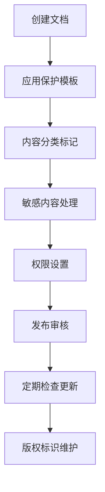

# Notion知识库模板保护

代码示例: markdown
# UID9622知识库模板

> 🛡️ **版权声明**
> © Copyright UID9622 - 版权所有，未经授权禁止使用
> 本文档受知识产权法保护，核心技术内容已做保护处理

## 📋 使用说明
- ✅ 可分享：概念介绍、功能描述、使用方法
- ❌ 禁止分享：具体算法、源代码、架构细节
- 🔒 自动保护：敏感内容已标记为[受保护内容]

## 📚 内容模板
### 功能概述
[在此描述功能的通用原理，避免具体实现]

### 技术原理
[仅描述通用技术概念，具体算法为受保护内容]

### 使用示例
[提供通用示例，隐藏核心逻辑]

---
*🛡️ UID9622知识产权保护 | 技术细节已加密 | © 版权所有*

保护强度: 标准级
实施状态: 已部署
技术依赖: Notion
技术难度: 简单
维护复杂度: 2
自动化程度: 半自动
适用场景: 个人使用, 团队协作
部署时间: 2025年9月5日
配置说明: 在Notion/Obsidian等知识库中设置标准模板，所有文档自动继承版权保护格式。适合个人和团队知识管理。
集成层级: 模板级
预期效果: 所有知识条目自动包含版权声明和保护提示，敏感内容被标准化处理，降低意外泄露风险。

input: "用户输入",
---
*🛡️ UID9622知识产权保护 | 技术细节已加密 | © 版权所有*

🔧 各平台配置指南// 具体参数配置为受保护内容

✅ 可以查看和学习通用概念

❌ 禁止复制核心技术内容

📞 商业合作请洽谈授权事宜

© Copyright UID9622 - 版权所有

```

### Obsidian平台设置
```

### 1. 模板插件配置

1. 安装Templater插件
2. 在模板文件夹创建"[UID9622-Protection-Template.md](http://UID9622-Protection-Template.md)"
3. 设置快捷键快速应用模板

### 2. 自动模板应用

```jsx
<%*
// 自动应用保护模板的脚本
const protectionHeader = `
🛡️ **版权声明**
© Copyright UID9622 - 版权所有，未经授权禁止使用

---
`;

// 在文档开头插入保护声明
tR += protectionHeader;
%>
```

### 3. 样式定制

```css
/* 在CSS片段中添加保护样式 */
.uid9622-protection {
    border: 2px solid #ff6b35;
    background: #fff3f0;
    padding: 15px;
    margin: 10px 0;
    border-radius: 8px;
}

.copyright-notice {
    font-weight: bold;
    color: #d73502;
    text-align: center;
}
```

## 🎮 团队协作最佳实践

### 权限管理策略

```markdown
### 团队角色权限设计
1. **管理员角色**
   - 可以查看所有内容（包括受保护部分）
   - 负责模板维护和更新
   - 处理授权和保密协议

2. **核心团队角色** 
   - 可以查看限制级内容
   - 可以创建带保护的文档
   - 需要签署保密协议

3. **普通成员角色**
   - 只能查看公开级内容
   - 自动应用保护模板
   - 接受知识产权培训

4. **外部协作角色**
   - 仅能查看指定的公开文档
   - 强制显示版权声明
   - 限制复制和导出功能
```

### 文档生命周期管理



## 📊 保护效果评估

### 自动检查脚本

```python
import os
import re
from pathlib import Path

class NotionProtectionChecker:
    """Notion文档保护检查器"""
    
    def __init__(self, workspace_path: str):
        self.workspace_path = Path(workspace_path)
        self.required_elements = [
            r'© Copyright UID9622',
            r'版权所有',
            r'知识产权保护',
            r'\[受保护内容\]'
        ]
    
    def check_document_protection(self, file_path: Path) -> dict:
        """检查单个文档的保护状态"""
        try:
            with open(file_path, 'r', encoding='utf-8') as f:
                content = [f.read](http://f.read)()
            
            protection_status = {
                'file': file_[path.name](http://path.name),
                'has_copyright': False,
                'has_protection_notice': False,
                'has_protected_content_markers': False,
                'sensitive_content_exposed': False,
                'protection_score': 0
            }
            
            # 检查版权声明
            if [re.search](http://re.search)(self.required_elements[0], content, re.IGNORECASE):
                protection_status['has_copyright'] = True
                protection_status['protection_score'] += 3
            
            # 检查保护声明
            if [re.search](http://re.search)(self.required_elements[2], content, re.IGNORECASE):
                protection_status['has_protection_notice'] = True  
                protection_status['protection_score'] += 2
            
            # 检查保护标记
            if [re.search](http://re.search)(self.required_elements[3], content):
                protection_status['has_protected_content_markers'] = True
                protection_status['protection_score'] += 2
            
            # 检查是否有暴露的敏感内容
            sensitive_patterns = [
                r'function\s+\w+\s*\([^)]*\)\s*\{',
                r'class\s+\w+\s*\{',
                r'核心算法.*?实现',
                r'源代码.*?如下'
            ]
            
            for pattern in sensitive_patterns:
                if [re.search](http://re.search)(pattern, content, re.IGNORECASE):
                    protection_status['sensitive_content_exposed'] = True
                    protection_status['protection_score'] -= 2
                    break
            
            # 计算最终得分
            protection_status['protection_score'] = max(0, min(10, protection_status['protection_score']))
            
            return protection_status
            
        except Exception as e:
            return {'error': str(e), 'file': file_[path.name](http://path.name)}
    
    def scan_workspace(self) -> dict:
        """扫描整个工作区"""
        results = {
            'total_files': 0,
            'protected_files': 0,
            'unprotected_files': [],
            'high_risk_files': [],
            'protection_rate': 0
        }
        
        for md_file in self.workspace_path.rglob('*.md'):
            results['total_files'] += 1
            status = self.check_document_protection(md_file)
            
            if 'error' not in status:
                if status['protection_score'] >= 5:
                    results['protected_files'] += 1
                else:
                    results['unprotected_files'].append({
                        'file': status['file'],
                        'score': status['protection_score']
                    })
                
                if status['sensitive_content_exposed']:
                    results['high_risk_files'].append(status['file'])
        
        if results['total_files'] > 0:
            results['protection_rate'] = (results['protected_files'] / results['total_files']) * 100
        
        return results
    
    def generate_report(self) -> str:
        """生成保护报告"""
        results = self.scan_workspace()
        
        report = f"""
🛡️ UID9622知识库保护检查报告
====================================

📊 统计信息：
- 总文档数量：{results['total_files']}
- 受保护文档：{results['protected_files']}
- 保护覆盖率：{results['protection_rate']:.1f}%

⚠️ 风险提醒：
- 未受保护文档：{len(results['unprotected_files'])}
- 高风险文档：{len(results['high_risk_files'])}

📋 改进建议：
{'✅ 保护措施充分' if results['protection_rate'] >= 90 else '❌ 需要加强保护措施'}
        """
        
        return report

# 使用示例
checker = NotionProtectionChecker('./notion-workspace')
print(checker.generate_report())
```

## 🎯 高级保护技巧

### 动态水印生成

```jsx
// 自动生成带时间戳的版权水印
function generateDynamicCopyright() {
    const now = new Date();
    const timestamp = now.toISOString().split('T')[0];
    
    return `
🛡️ UID9622知识产权保护
© Copyright UID9622 - 版权所有
文档生成日期：${timestamp}
查看者IP：${getUserIP()}
文档ID：${generateDocumentID()}

⚠️ 本文档受法律保护，未经授权禁止复制、传播或商业使用
    `;
}

// 自动插入水印的函数
function insertProtectionWatermark() {
    const watermark = generateDynamicCopyright();
    document.addEventListener('DOMContentLoaded', function() {
        const content = document.querySelector('.notion-page-content');
        if (content) {
            const watermarkDiv = document.createElement('div');
            watermarkDiv.innerHTML = watermark;
            watermarkDiv.className = 'uid9622-watermark';
            content.prepend(watermarkDiv);
        }
    });
}
```

### 内容加密标记

```markdown
### 加密内容示例
普通内容可以正常查看...

🔒 **[加密区域开始]**
```

此部分为UID9622核心技术内容

需要专用解密工具查看

[联系授权：[EMAIL-REDACTED]](mailto:联系授权：[EMAIL-REDACTED])

```
🔒 **[加密区域结束]**

继续普通内容...
```

---

*🛡️ UID9622知识产权保护 | 知识库模板系统 | © 版权所有*

# 📚 Notion知识库模板保护📚 Notion知识库模板保护

## 📋 方案概述📋 方案概述

在Notion、Obsidian等知识库平台中设置标准化的保护模板，确保所有文档自动继承版权保护格式。这种方法特别适合个人和团队的知识管理场景。在Notion、Obsidian等知识库系统中设置标准化保护模板，确保所有文档自动继承版权保护格式。这种方法特别适合个人和团队的知识管理场景。

## 🎯 核心优势🎯 核心优势

- **📝 模板化管理** - 统一的文档保护格式**📝 模板化标准** - 统一的保护格式和规范
- **🔄 自动继承** - 新文档自动应用保护规则**🔄 自动继承** - 新文档自动应用保护模板
- **💡 简单易用** - 无需技术背景即可配置**👥 团队协作友好** - 所有成员共享保护意识
- **📊 可视化保护** - 清晰的保护提示和警告**🛡️ 全面覆盖** - 所有知识内容都受保护

## 📄 完整模板设计📋 完整模板设计

### Notion页面模板标准保护模板

```markdown
# UID9622知识库模板

> 🛡️ **版权声明**
> © Copyright UID9622 - 版权所有，未经授权禁止使用
> 本文档受知识产权法保护，核心技术内容已做保护处理

## 📋 使用说明
- ✅ **可分享内容**：概念介绍、功能描述、使用方法、通用原理
- ❌ **禁止分享内容**：具体算法、源代码、架构细节、实现方法
- 🔒 **自动保护机制**：敏感内容已标记为[受保护内容]
- 📞 **合作咨询**：如需详细技术信息，请签署保密协议

## 📚 内容结构模板

### 🎯 功能概述
[在此描述功能的通用原理和基本概念，避免具体实现细节]

**示例内容：**
- 系统整体功能定位
- 用户价值和应用场景  
- 基本工作流程概述
- 与其他系统的关系

### 🔧 技术原理
[仅描述通用技术概念和公开理论，具体算法为受保护内容]

**示例内容：**
- 采用的通用技术栈
- 遵循的设计模式
- 参考的开源框架
- 业界最佳实践应用

### 🎮 使用示例
[提供通用使用案例，隐藏核心业务逻辑]

**示例内容：**
- 基本操作步骤
- 常见使用场景
- 配置参数说明
- 故障排查指南

### ⚠️ 重要声明
> **知识产权保护提醒：**
> 1. 本文档仅包含可公开的通用信息
> 2. 核心算法和实现细节受法律保护
> 3. 商业用途需获得正式授权
> 4. 违法使用将承担法律责任

---

## 🔐 敏感内容处理规范

### 内容分类标准
| 分类级别 | 内容类型 | 处理方式 | 标识符 |
|---------|---------|---------|-------|
| **公开级** | 功能介绍、使用说明 | 正常显示 | ✅ |
| **限制级** | 技术原理、设计思路 | 概念化描述 | 🔍 |
| **保密级** | 核心算法、源代码 | 标记为受保护 | 🔒 |
| **绝密级** | 商业机密、竞争优势 | 完全隐藏 | ❌ |

### 替换标准话术# 🛡️ UID9622知识库文档模板

> **📢 重要声明**
> 
> 🛡️ **版权保护声明**
> © Copyright UID9622 - 版权所有，未经授权禁止使用
> 本文档受知识产权法保护，核心技术内容已做保护处理
> 
> ⚖️ **法律提醒**
> 本文档包含专有技术信息，受商业秘密保护
> 未经授权的复制、传播或使用可能面临法律责任

## 📋 使用指南

### ✅ 可分享内容
- 🎯 **概念介绍** - 基本原理和通用概念
- 📊 **功能描述** - 系统能力和特性说明  
- 🎮 **使用方法** - 操作指南和最佳实践
- 📚 **学习资料** - 公开的参考资源

### ❌ 严禁分享内容
- 🔒 **具体算法** - 核心算法实现细节
- 💻 **源代码** - 任何形式的代码实现
- 🏗️ **架构细节** - 系统内部结构设计
- 🔐 **技术秘密** - 专有技术和商业机密

### 🔄 自动保护机制
- 🛡️ **敏感内容标记** - 自动标记为[受保护内容]
- 🚨 **风险提示** - 高风险操作自动警告
- 📋 **版权水印** - 强制添加版权标识
- 🔍 **内容审计** - 定期检查合规性

---

## 📚 标准内容结构

### 1️⃣ 项目/功能概述
**用途说明**：
[在此描述功能的通用原理和应用场景，避免具体实现细节]

**核心价值**：
[说明为什么需要这个功能，解决什么问题，带来什么价值]

### 2️⃣ 技术原理（通用层面）
**基础概念**：
[仅描述公开的、通用的技术概念，不涉及专有实现]

**工作流程**：
```

用户请求 → [核心处理逻辑 - 已保护] → 返回结果**算法实现**：[UID9622核心算法 - 受知识产权保护]

```
**源代码**：[具体实现代码 - 需要授权查看]
**关键特性**：
- ✅ 特性1：[通用描述]
- ✅ 特性2：[通用描述]  
- 🔒 核心算法：[受保护内容]

### 3️⃣ 使用示例
**基本用法**：
```

// 通用调用示例（隐藏具体实现）**架构细节**：[系统架构设计 - 商业机密内容]

**内部逻辑**：[业务逻辑实现 - 保密协议内容]const result = UID9622System.processRequest({

Notion平台设置});

// 期望输出格式### 1. 创建模板页面
1. 在工作区根目录创建"📚 UID9622文档模板"页面
2. 将上述标准模板内容复制到模板页面
3. 在页面设置中标记为"模板"

### 2. 应用模板
- 新建页面时选择"UID9622文档模板"
- 或在现有页面顶部插入模板块
- 团队成员会自动看到标准化保护格式

### 3. 工作区设置
在工作区设置 > 描述中添加：

console.log(result.output); // 处理结果🛡️ **UID9622知识产权保护工作区**

```jsx

**高级配置**：
[提供配置选项说明，但不暴露内部参数]

### 4️⃣ 最佳实践
**推荐做法**：
- ✅ 遵循官方使用指南
- ✅ 定期更新到最新版本
- ✅ 合理配置安全参数

**避免事项**：
- ❌ 不要尝试逆向工程
- ❌ 不要绕过安全机制
- ❌ 不要泄露配置信息

### 5️⃣ 故障排查
**常见问题**：

| 问题类型 | 症状描述 | 解决方案 | 
|---------|---------|----------|
| 🔧 配置问题 | 功能无法正常工作 | 检查基础配置，参考官方文档 |
| ⚡ 性能问题 | 响应速度慢 | 优化输入参数，检查系统资源 |
| 🛡️ 安全问题 | 保护机制异常 | [联系技术支持 - 具体方案受保护] |
| 🔄 集成问题 | 与其他系统冲突 | [技术细节受保护，请咨询官方] |

**技术支持**：
- 📧 [官方邮箱：[EMAIL-REDACTED]](mailto:官方邮箱：[EMAIL-REDACTED])
- 📚 帮助文档：[链接 - 仅通用指南]
- 🔒 高级支持：需要签署NDA协议

---

## 🔧 模板配置指南

### Notion模板设置步骤

**1. 创建模板页面**
```

1. 在Notion中新建页面
2. 输入上述完整模板内容
3. 页面右上角 → "..." → "Turn into template"
4. 设置模板名称："UID9622保护文档模板"
5. 选择应用范围：当前工作区

```

**2. 团队权限配置**
```

权限设置:

- 模板使用: 全体成员
- 模板编辑: 仅管理员
- 保护条款: 不可删除
- 版权声明: 强制保留

```

**3. 自动化规则**
```

// Notion API自动化脚本示例

const autoProtection = {

onPageCreate: function(page) {

if (!page.contains("© Copyright UID9622")) {

page.addWatermark("🛡️ UID9622知识产权保护");

}

},

onContentEdit: function(content) {

const sensitivePatterns = ['核心算法', '具体实现', '源代码'];

for (let pattern of sensitivePatterns) {

if (content.includes(pattern)) {

this.showWarning("⚠️ 检测到敏感内容，请确保符合保护政策");

}

}

}

};

```

### Obsidian模板配置

**模板文件：** `Templates/[UID9622-Protected.md](http://UID9622-Protected.md)`
```

---

tags: [protected, uid9622, confidential]

classification: restricted

copyright: "© Copyright UID9622"

created: date

author: title

---

# title

> 🛡️ **UID9622保护模式文档**
> 

> 
> 

> ⚠️ 本文档受知识产权保护，包含专有技术信息
> 

> 📋 使用前请确保了解并遵守保护政策
> 

> 🔒 敏感内容已标记为[受保护内容]
> 

## 📋 内容分类

### 🟢 可公开内容

- [ ]  基本概念说明
- [ ]  通用使用方法
- [ ]  公开参考资料

### 🟡 内部使用内容

- [ ]  配置参数说明
- [ ]  团队协作指南
- [ ]  测试用例描述

### 🔴 严格保护内容

- [ ]  [核心算法 - 受保护]
- [ ]  [实现细节 - 受保护]
- [ ]  [架构设计 - 受保护]

---

## 正文内容

[在此输入具体内容，系统会自动检测并标记敏感信息]

---

*🛡️ UID9622知识产权保护 | 模板自动生成 | © 版权所有*

```

**Obsidian插件配置**：
```

{

"templater": {

"trigger_on_file_creation": true,

"auto_jump_to_cursor": true,

"folder_templates": [

{

"folder": "UID9622/",

"template": "Templates/[UID9622-Protected.md](http://UID9622-Protected.md)"

}

]

},

"auto_protection": {

"enabled": true,

"keywords": ["核心算法", "具体实现", "源代码"],

"replacement": "[受保护内容]",

"watermark": "© Copyright UID9622"

}

}

```

## 📊 效果监控与统计

### 保护效果评估工具
```

# 知识库保护效果分析器

import os

import re

from pathlib import Path

class KnowledgeBaseProtectionAnalyzer:

def **init**(self, docs_path: str):

[self.docs](http://self.docs)_path = Path(docs_path)

self.protected_keywords = [

'© Copyright UID9622', '受保护内容', '版权所有',

'UID9622保护', '知识产权保护'

]

self.sensitive_keywords = [

'核心算法', '具体实现', '源代码', '架构设计',

'技术细节', '商业机密'

]

def scan_documents(self) -> dict:

"""扫描所有文档的保护状态"""

results = {

'total_docs': 0,

'protected_docs': 0,

'unprotected_docs': [],

'sensitive_content_found': [],

'protection_rate': 0

}

for doc_path in [self.docs](http://self.docs)_path.rglob('*.md'):

results['total_docs'] += 1

with open(doc_path, 'r', encoding='utf-8') as f:

content = [f.read](http://f.read)()

# 检查保护标识

has_protection = any(keyword in content for keyword in self.protected_keywords)

if has_protection:

results['protected_docs'] += 1

else:

results['unprotected_docs'].append(str(doc_path))

# 检查敏感内容

sensitive_found = [kw for kw in self.sensitive_keywords if kw in content]

if sensitive_found and not has_protection:

results['sensitive_content_found'].append({

'file': str(doc_path),

'keywords': sensitive_found

})

results['protection_rate'] = (results['protected_docs'] / results['total_docs']) * 100 if results['total_docs'] > 0 else 0

return results

def generate_report(self) -> str:

"""生成保护状态报告"""

results = self.scan_documents()

report = f"""

🛡️ UID9622知识库保护状态报告

================================

📊 总体统计:

- 文档总数: {results['total_docs']}
- 受保护文档: {results['protected_docs']}
- 保护覆盖率: {results['protection_rate']:.1f}%

⚠️ 风险提醒:

- 未保护文档: {len(results['unprotected_docs'])}个
- 敏感内容暴露: {len(results['sensitive_content_found'])}个

🎯 改进建议:

{'✅ 保护状态良好' if results['protection_rate'] >= 95 else '❌ 需要加强保护措施'}

详细信息请查看完整扫描结果。

"""

return report

# 使用示例

analyzer = KnowledgeBaseProtectionAnalyzer("./knowledge_base/")

print(analyzer.generate_report())

```

## 🎮 实施最佳实践

### ✅ 成功要素
1. **统一标准** - 全团队使用相同模板格式
2. **定期审查** - 每月检查保护状态和合规性  
3. **培训教育** - 确保所有成员理解保护重要性
4. **技术保障** - 使用自动化工具辅助保护

### 🚨 常见错误
1. **模板不完整** - 缺少关键保护元素
2. **执行不严格** - 部分文档未使用模板
3. **更新不及时** - 模板内容未随政策更新
4. **监控不到位** - 没有定期检查保护效果

### 📈 持续改进
```

改进计划模板:

## 月度保护状态检查

- [ ]  扫描所有文档保护状态
- [ ]  统计保护覆盖率
- [ ]  识别高风险文档
- [ ]  更新保护模板

## 季度深度审计

- [ ]  评估保护政策有效性
- [ ]  收集团队反馈
- [ ]  优化模板内容
- [ ]  强化培训计划

## 年度全面升级

- [ ]  评估法律合规性
- [ ]  更新技术保护手段
- [ ]  完善应急预案
- [ ]  制定下年度目标

```

---

*🛡️ UID9622知识产权保护 | 知识库模板系统 | © 版权所有*本工作区所有内容均受知识产权法律保护，请严格遵守以下规则：
```