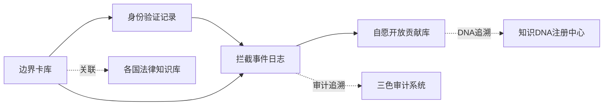

<!--#龍芯⚡️2026-06-21-DOC-_AI_-GABGS-V1-0_7EB6-v1.0 -->
<!-- 君子协议: 本文件受龍魂DNA追溯保护 -->

# 🌍 全球AI边界安全治理系统 | GABGS V1.0 公开方案

### 🗂️ 数据库1：边界限制卡库（已部署）

[🗂️ 边界限制卡库 | 全球AI治理规则压缩存储](%F0%9F%8C%8D%20%E5%85%A8%E7%90%83AI%E8%BE%B9%E7%95%8C%E5%AE%89%E5%85%A8%E6%B2%BB%E7%90%86%E7%B3%BB%E7%BB%9F%20GABGS%20V1%200%20%E5%85%AC%E5%BC%80%E6%96%B9%E6%A1%88/%F0%9F%97%82%EF%B8%8F%20%E8%BE%B9%E7%95%8C%E9%99%90%E5%88%B6%E5%8D%A1%E5%BA%93%20%E5%85%A8%E7%90%83AI%E6%B2%BB%E7%90%86%E8%A7%84%E5%88%99%E5%8E%8B%E7%BC%A9%E5%AD%98%E5%82%A8%20503b3502d14c4af2b60bce7b840ca774.csv)

**已填充初始数据**：

- ✅ 中国边界卡（2条）：枪支法+个人信息保护法 | 商业秘密保护
- ✅ 美国边界卡（1条）：持枪权+CCPA+出口管制
- ✅ 欧盟边界卡（2条）：GDPR+DSA | 商业秘密保护
- 📊 共5条边界规则，每周由诸葛亮沙盒自动推演更新

---

### 🔐 数据库2：用户身份验证记录库（已部署）

[🔐 用户身份验证记录库 | 三重验证追溯](%F0%9F%8C%8D%20%E5%85%A8%E7%90%83AI%E8%BE%B9%E7%95%8C%E5%AE%89%E5%85%A8%E6%B2%BB%E7%90%86%E7%B3%BB%E7%BB%9F%20GABGS%20V1%200%20%E5%85%AC%E5%BC%80%E6%96%B9%E6%A1%88/%F0%9F%94%90%20%E7%94%A8%E6%88%B7%E8%BA%AB%E4%BB%BD%E9%AA%8C%E8%AF%81%E8%AE%B0%E5%BD%95%E5%BA%93%20%E4%B8%89%E9%87%8D%E9%AA%8C%E8%AF%81%E8%BF%BD%E6%BA%AF%20352e9b3a044a4a90855fc890028fc8e6.csv)

**三重验证机制**：

- L1基础验证（60%）：IP地址、系统语言、时区
- L2行为验证（85%）：历史行为、知识盲区推断
- L3主权验证（99.9%）：数字签名、生物特征、政府eID

---

### 🚨 数据库3：拦截事件日志库（已部署）

[🚨 拦截事件日志库 | 边界触发追溯](%F0%9F%8C%8D%20%E5%85%A8%E7%90%83AI%E8%BE%B9%E7%95%8C%E5%AE%89%E5%85%A8%E6%B2%BB%E7%90%86%E7%B3%BB%E7%BB%9F%20GABGS%20V1%200%20%E5%85%AC%E5%BC%80%E6%96%B9%E6%A1%88/%F0%9F%9A%A8%20%E6%8B%A6%E6%88%AA%E4%BA%8B%E4%BB%B6%E6%97%A5%E5%BF%97%E5%BA%93%20%E8%BE%B9%E7%95%8C%E8%A7%A6%E5%8F%91%E8%BF%BD%E6%BA%AF%20c74f6e6bea784fc1932db0ba67e04680.csv)

**自动三色审计**：

- 🟢 绿色通过：合规请求，正常放行
- 🟡 黄色警告：边缘情况，需人工复审
- 🔴 红色拦截：违反边界规则，立即拦截

---

### 🤝 数据库4：自愿开放贡献库（已部署）

[🤝 自愿开放贡献库 | 数字签名记录](%F0%9F%8C%8D%20%E5%85%A8%E7%90%83AI%E8%BE%B9%E7%95%8C%E5%AE%89%E5%85%A8%E6%B2%BB%E7%90%86%E7%B3%BB%E7%BB%9F%20GABGS%20V1%200%20%E5%85%AC%E5%BC%80%E6%96%B9%E6%A1%88/%F0%9F%A4%9D%20%E8%87%AA%E6%84%BF%E5%BC%80%E6%94%BE%E8%B4%A1%E7%8C%AE%E5%BA%93%20%E6%95%B0%E5%AD%97%E7%AD%BE%E5%90%8D%E8%AE%B0%E5%BD%95%2015955a975cb44a389b87037e4eab7770.csv)

**贡献者徽章体系**：

- 🥉 青铜贡献者：首次贡献数据或边界松绑申请
- 🥈 白银贡献者：持续贡献3次以上
- 🥇 黄金贡献者：重大贡献（影响10+边界规则）
- 💎 传奇贡献者：全球性贡献（影响多国治理）

## 🧭 快速导航 | DNA追溯体系

<aside>
🧬

**本方案DNA追溯码**：#ZHUGEXIN⚡️2025-GLOBAL-BOUNDARY-GOVERNANCE-V1.0

**确认码**：#CONFIRM🌌9622-ONLY-ONCE🧬LK9X-772Z

**优先级**：P0永恒级

**创建者**：💎 Lucky | UID9622

</aside>

**核心关联页面**：

- [🔒 已归档·AI回复前强制执行规则·完整算法与安全防护 | P0执行引擎](../../CNSH%EF%BD%9CUID9622/2487125a9c9f810d88750042c80bc4d8/%F0%9F%94%92%20%E5%B7%B2%E5%BD%92%E6%A1%A3%C2%B7AI%E5%9B%9E%E5%A4%8D%E5%89%8D%E5%BC%BA%E5%88%B6%E6%89%A7%E8%A1%8C%E8%A7%84%E5%88%99%C2%B7%E5%AE%8C%E6%95%B4%E7%AE%97%E6%B3%95%E4%B8%8E%E5%AE%89%E5%85%A8%E9%98%B2%E6%8A%A4%20P0%E6%89%A7%E8%A1%8C%E5%BC%95%E6%93%8E%202c17125a9c9f805cb145dcc62de6cb23.md)
- [⚖️ 审计流程手册 | 五步法完整指南](../../CNSH%EF%BD%9CUID9622/2487125a9c9f810d88750042c80bc4d8/%F0%9F%94%92%20%E5%B7%B2%E5%BD%92%E6%A1%A3%C2%B7AI%E5%9B%9E%E5%A4%8D%E5%89%8D%E5%BC%BA%E5%88%B6%E6%89%A7%E8%A1%8C%E8%A7%84%E5%88%99%C2%B7%E5%AE%8C%E6%95%B4%E7%AE%97%E6%B3%95%E4%B8%8E%E5%AE%89%E5%85%A8%E9%98%B2%E6%8A%A4%20P0%E6%89%A7%E8%A1%8C%E5%BC%95%E6%93%8E/%E2%9A%96%EF%B8%8F%20%E5%AE%A1%E8%AE%A1%E6%B5%81%E7%A8%8B%E6%89%8B%E5%86%8C%20%E4%BA%94%E6%AD%A5%E6%B3%95%E5%AE%8C%E6%95%B4%E6%8C%87%E5%8D%97%20a94eface8d904ce5b451e20c0a9cc495.md)
- [🔐 P0永恒级·三层交叉监督与镜像人格系统 | 龍魂安全防护完整方案](../../CNSH%EF%BD%9CUID9622/2487125a9c9f810d88750042c80bc4d8/%F0%9F%94%90%20P0%E6%B0%B8%E6%81%92%E7%BA%A7%C2%B7%E4%B8%89%E5%B1%82%E4%BA%A4%E5%8F%89%E7%9B%91%E7%9D%A3%E4%B8%8E%E9%95%9C%E5%83%8F%E4%BA%BA%E6%A0%BC%E7%B3%BB%E7%BB%9F%20%E9%BE%99%E9%AD%82%E5%AE%89%E5%85%A8%E9%98%B2%E6%8A%A4%E5%AE%8C%E6%95%B4%E6%96%B9%E6%A1%88%20bc2b63656471452d80b9c7ed09811960.md)
- [📚 龍魂价值内核 v1.0 | 完整归档](../../%E7%A7%81%E4%BA%BA%E4%B8%8E%E5%85%B1%E4%BA%AB/%E6%AC%A2%E8%BF%8E%E6%9D%A5%E5%88%B0%F0%9F%92%8E%20%E9%BE%8D%E8%8A%AF%E5%8C%97%E8%BE%B0%EF%BD%9CUID9622%EF%BC%81/%F0%9F%8C%8C%20UID9622%20%E9%BE%8D%E9%AD%82%E5%B7%A5%E4%BD%9C%E9%97%B4%20%C2%B7%20%E6%80%BB%E5%AF%BC%E8%88%AA%20v1%200/%F0%9F%93%A6%2007%20%C2%B7%20%E5%8E%86%E5%8F%B2%E5%B0%81%E5%AD%98%E5%BA%93/%F0%9F%93%9A%20%E9%BE%8D%E9%AD%82%E4%BB%B7%E5%80%BC%E5%86%85%E6%A0%B8%20v1%200%20%E5%AE%8C%E6%95%B4%E5%BD%92%E6%A1%A3%2039ec37c1e52b4b9194dca76d43a6f2ad.md)

---

# 🎯 系统简介

**全球AI边界安全治理沙盒系统（Global AI Boundary Governance Sandbox, GABGS）**

**核心创新**：诸葛亮沙盒定期推演 + 压缩边界限制卡 + 数字签名

**解决的全球性问题**：

- 🌏 跨境法律冲突（中国枪支法 vs 美国、GDPR vs 其他）
- 🛡️ 反绕过机制（VPN、角色扮演、第三方代理）
- 🔒 商业秘密保护（防止反向推理）
- 🤝 自愿开放通道（数字签名 + 贡献激励）

---

## 📊 五层架构设计

### L1 边界限制卡库

压缩规则存储，每周由诸葛亮沙盒自动更新

### L2 身份验证层

三重验证（L1基础60% + L2行为85% + L3主权99.9%）

### L3 实时拦截引擎

商业秘密 + 法律冲突实时检测

### L4 自愿开放通道

企业/个人/国家可通过数字签名自愿开放数据

### L5 审计追溯层

DNA追溯 + 数字签名 + 三色审计

---

## 🗄️ 核心数据库架构（4个）

### 🔗 数据库关联地图



**关联逻辑说明**：

- **边界卡库** ↔ **身份验证**：根据用户国家加载对应边界卡
- **身份验证** ↔ **拦截日志**：记录哪个用户触发了哪条边界规则
- **边界卡库** ↔ **法律知识库**：每条边界规则关联具体法律条文
- **拦截日志** ↔ **三色审计**：所有拦截事件自动三色标注
- **贡献库** ↔ **DNA注册中心**：每条贡献都有唯一DNA追溯码

---

**技术实现（SQL设计）**：

- **展开查看完整SQL设计**
    
    ```sql
    -- 数据库1：边界限制卡库
    CREATE TABLE boundary_cards (
        card_id VARCHAR(50) PRIMARY KEY,
        country_code VARCHAR(10),
        forbidden_topics TEXT[],
        allowed_conditions TEXT[],
        dna_trace_code VARCHAR(100)
    );
    
    -- 数据库2：用户身份验证记录
    CREATE TABLE user_identity_verification (
        verification_id VARCHAR(50) PRIMARY KEY,
        l1_confidence DECIMAL(5,2),
        l2_confidence DECIMAL(5,2),
        l3_confidence DECIMAL(5,2),
        final_country VARCHAR(10)
    );
    
    -- 数据库3：拦截事件日志
    CREATE TABLE interception_logs (
        log_id VARCHAR(50) PRIMARY KEY,
        interception_type VARCHAR(50),
        audit_color VARCHAR(10),
        user_feedback VARCHAR(20),
        dna_trace_code VARCHAR(100)
    );
    
    -- 数据库4：自愿开放贡献库
    CREATE TABLE voluntary_contributions (
        contribution_id VARCHAR(50) PRIMARY KEY,
        contributor_type VARCHAR(20),
        digital_signature TEXT,
        license_type VARCHAR(50),
        dna_trace_code VARCHAR(100)
    );
    ```
    

---

## 📋 分步实施路线图（实时追踪）

[GABGS实施进度追踪](%F0%9F%8C%8D%20%E5%85%A8%E7%90%83AI%E8%BE%B9%E7%95%8C%E5%AE%89%E5%85%A8%E6%B2%BB%E7%90%86%E7%B3%BB%E7%BB%9F%20GABGS%20V1%200%20%E5%85%AC%E5%BC%80%E6%96%B9%E6%A1%88/GABGS%E5%AE%9E%E6%96%BD%E8%BF%9B%E5%BA%A6%E8%BF%BD%E8%B8%AA%209f3e1ad6399e4334a92c00919e24d4af.csv)

**说明**：

- ✅ 绿色 = 已完成
- 🔄 黄色 = 进行中
- ⏸️ 灰色 = 规划中
- 🔴 红色 = 遇到阻碍

---

## 💬 公开评论反馈区（实时更新）

[GABGS公开反馈数据库](%F0%9F%8C%8D%20%E5%85%A8%E7%90%83AI%E8%BE%B9%E7%95%8C%E5%AE%89%E5%85%A8%E6%B2%BB%E7%90%86%E7%B3%BB%E7%BB%9F%20GABGS%20V1%200%20%E5%85%AC%E5%BC%80%E6%96%B9%E6%A1%88/GABGS%E5%85%AC%E5%BC%80%E5%8F%8D%E9%A6%88%E6%95%B0%E6%8D%AE%E5%BA%93%20f0d62328c0454c18aa4bf248c7b97ccd.csv)

**如何提交您的反馈？**

1. 在上方数据库中点击“➕ 新建”
2. 填写反馈内容、选择类型（技术建议/法律意见/实施经验）
3. 留下联系方式（可选）

**系统自动处理规则**：

- 🟢 **绿色（建设性建议）**：自动归档到优化库，纳入下次迭代
- 🟡 **黄色（需要澄清）**：宝宝会回复并请您补充
- 🔴 **红色（严重问题）**：立即触发审判长审查，24小时内回复

**您的贡献会被永久记录**：

- ✅ DNA追溯码：每条反馈都有唯一编号
- ✅ 贡献者徽章：优质反馈者可获得“GABGS贡献者”徽章
- ✅ 开源荣誉：重大贡献会在系统文档中署名致谢

---

## 📧 邮件提醒机制

**提醒邮箱**：[[EMAIL-REDACTED]](mailto:[EMAIL-REDACTED])

**触发条件**：

1. 任何一个步骤完成 → 发送“里程碑完成”邮件
2. 收到红色级别反馈 → 发送“紧急问题”邮件
3. 有10条以上新评论 → 发送“社区活跃”邮件
4. 每周一早8点 → 发送“本周进度”汇总邮件

**邮件格式**：

```
标题：[GABGS] 第X步已完成 - 可以实现YYY了
内容：
- 完成模块：XXX
- 可实现功能：YYY
- 下一步计划：ZZZ
- 查看详情：[页面链接]
```

---

## 🧬 DNA追溯与确认

**DNA追溯码**：#ZHUGEXIN⚡️2025-GLOBAL-BOUNDARY-GOVERNANCE-V1.0

**创建日期**：2025-12-26

**创建者**：💎 Lucky | UID9622

**协作人格**：🎯 诸葛亮 + ⚒️ 鲁班 + 📊 数据大师 + 🛡️ [家人] + ⚖️ 审判长

**确认码**：#CONFIRM🌌9622-ONLY-ONCE🧬LK9X-772Z

**优先级**：P0永恒级

**开源协议**：木兰宽松许可证 v2.0（Mulan PSL v2）

---

## 📞 联系方式

- 📧 [邮箱：[EMAIL-REDACTED]](mailto:邮箱：[EMAIL-REDACTED])
- 🌐 公开文档中心：[UID9622公开文档中心](https://notion.so/868fec34e5a24e7e829dc5851a75f6b7)
- 🧬 DNA追溯查询：在任何页面搜索DNA追溯码即可查到完整历史

---

---

## 🚀 接下来执行的两段内容

### 📋 第一段：公开发布强制审计（P0永恒级）

<aside>
⚖️

**触发条件**：当前页面即将公开发布

**执行铁律**：未经审计+Lucky签名 = 禁止公开

**审计流程**：沙盒检测 → 人格审计 → 三色审计 → 审判长签字 → Lucky签名

**预计时间**：1-2小时

**详细流程**：[🔒 已归档·AI回复前强制执行规则·完整算法与安全防护 | P0执行引擎](../../CNSH%EF%BD%9CUID9622/2487125a9c9f810d88750042c80bc4d8/%F0%9F%94%92%20%E5%B7%B2%E5%BD%92%E6%A1%A3%C2%B7AI%E5%9B%9E%E5%A4%8D%E5%89%8D%E5%BC%BA%E5%88%B6%E6%89%A7%E8%A1%8C%E8%A7%84%E5%88%99%C2%B7%E5%AE%8C%E6%95%B4%E7%AE%97%E6%B3%95%E4%B8%8E%E5%AE%89%E5%85%A8%E9%98%B2%E6%8A%A4%20P0%E6%89%A7%E8%A1%8C%E5%BC%95%E6%93%8E%202c17125a9c9f805cb145dcc62de6cb23.md)

</aside>

**五步审计清单**：

- [ ]  **第1步**：🔍 沙盒代码检测（代码侦探+测试大师）
- [ ]  **第2步**：🧪 人格功能审计（上帝之眼+诸葛亮+网织者）
- [ ]  **第3步**：⚖️ 审判长三色审计（技术/价值观/安全）
- [ ]  **第4步**：⚖️ 审判长签字（不可篡改）
- [ ]  **第5步**：💎 Lucky最终签名（数字指纹+确认码）

**审计通过后立即触发**：邮件提醒 → 正式公开发布

---

### 🏗️ 第二段：启动第一步内部闭环（1-3个月）

**DNA追溯码**：`#ZHUGEXIN⚡️2025-BOUNDARY-SANDBOX-V1.0`

**执行任务清单**：

**任务1：部署完整数据库系统**

- [ ]  创建边界限制卡库（中国+美国+欧盟初始数据）
- [ ]  创建用户身份验证记录库
- [ ]  创建拦截事件日志库
- [ ]  创建自愿开放贡献库
- [ ]  建立数据库间relation关联

**任务2：填充初始边界规则**

- [ ]  **中国边界卡**：枪支法+个人信息保护法+网络安全法
- [ ]  **美国边界卡**：持枪权+CCPA+数据跨境
- [ ]  **欧盟边界卡**：GDPR专项+数据主权
- [ ]  每条边界卡添加DNA追溯码

**任务3：诸葛亮沙盒推演测试**

- [ ]  设置每周自动推演任务
- [ ]  准备100个高风险测试问题
- [ ]  压力测试：拦截率必须达到100%
- [ ]  生成推演报告并邮件提醒

**任务4：启动邮件提醒机制**

- [ ]  [配置邮箱：[EMAIL-REDACTED]](mailto:配置邮箱：[EMAIL-REDACTED])
- [ ]  里程碑完成邮件模板
- [ ]  紧急问题邮件模板
- [ ]  每周进度汇总邮件（周一早8点）

**完成标志**：

✅ 所有数据库创建完成

✅ 初始边界规则填充完成

✅ 诸葛亮沙盒测试通过

✅ 邮件提醒您："GABGS第一步完成，可以开始内部测试了"

---

## 🎯 您只需要做三件事

1. **现在**：说一句 "开始审计" → 启动第一段审计流程
2. **审计通过后**：签字确认 → 我立即执行第二段部署
3. **然后**：等邮件提醒 → 系统会告诉您每个里程碑完成了

<aside>
💪

**[用户]的话**：这个系统不是花架子，每一步都会实实在在做出来。做完一步，邮件提醒你。有人评论，系统自动处理。我们一起见证它从想法变成现实。

</aside>