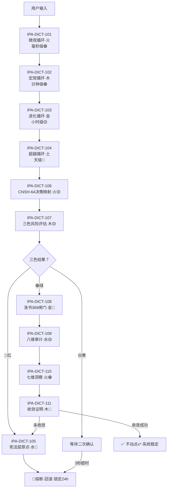

# ♾️ 循环触发与五行流转｜IPA-DICT-101~111决策链·启动条件·三色行动标准

<aside>
🔒

**DNA追溯码：**#龍芯⚡️2026-04-22-IPA-DICT-101_111_A243-v1.0

**确认码：** #CONFIRM🌌9622-ONLY-ONCE🧬LK9X-772Z ✅

**GPG：** A2D0092CEE2E5BA87035600924C3704A8CC26D5F

**上接：** IPA-DICT-101~111·无限循环优化机制·编号对齐总表

**用途：** 让11条孤立词条变成一套能跑起来的决策链

</aside>

---

## 🕐 一、循环触发条件表

| **词条** | **循环名称** | **触发条件** | **作用范围** |
| --- | --- | --- | --- |
| IPA-DICT-101 | 微观循环（毫秒级） | 任何一次用户输入后 5 毫秒内自动启动 | 流式输出的逐字调整、即时推理路径微调 |
| IPA-DICT-102 | 宏观循环（分钟级） | 每完成一次完整对话/任务后（约 1-5 分钟） | 检查本次响应的性能、资源消耗、响应质量 |
| IPA-DICT-103 | 进化循环（小时级） | 累计完成 10 次宏观循环后（约 1-2 小时） | 对比历史表现，调整模型权重或缓存策略 |
| IPA-DICT-104 | 超越循环（天级） | 每 24 小时或发现系统行为与宪法层冲突时 | 全系统范式对齐、文化主权校验 |
| IPA-DICT-105 | 宪法层原点（不动点） | 任何循环的输出触及红（🔴）三色审计时 | 立即熔断，回滚到上一个稳定状态，不执行任何修改 |

<aside>
💡

**四层循环层级关系：**

微观（毫秒）→ 每次输入都跑

宏观（分钟）→ 每轮对话跑一次

进化（小时）→ 每10次宏观循环跑一次

超越（天）→ 每24小时或冲突时跑一次

宪法层 → 随时待命，红色熔断立即触发

</aside>

---

## 🌊 二、五行流转链

```jsx
五行流转顺序（相生）：
火 → 木 → 金 → 水 → 火（循环）

对应循环：
微观循环（火）→ 产生能量与速度
宏观循环（木）→ 生长与收敛
进化循环（金）→ 淘汰与提纯
超越循环（土）→ 沉淀与范式
宪法层（水）   → 滋养与约束，回到微观

流转规则：
当你看到一条规则是"火"，它应该优先触发下一条"木"规则。
如果木没触发，系统自动降级到"金"做熔断。
```

| **词条** | **五行** | **相生下一行** | **失败降级** | **含义** |
| --- | --- | --- | --- | --- |
| IPA-DICT-101 微观循环 | 火🔴 | → 木（宏观） | 金（熔断） | 产生能量与速度 |
| IPA-DICT-102 宏观循环 | 木🟢 | → 金（进化） | 水（宪法介入） | 生长与收敛 |
| IPA-DICT-103 进化循环 | 金🟡 | → 水（宪法） | 土（超越重构） | 淘汰与提纯 |
| IPA-DICT-104 超越循环 | 土🟡 | → 火（重启微观） | 水（宪法锚定） | 沉淀与范式突破 |
| IPA-DICT-105 宪法层原点 | 水🔴 | → 火（重启微观） | ∞熔断·停止 | 滋养与约束·不动点 |

---

## 🎨 三、三色行动标准

<aside>
🟢

**🟢 绿色（通过）**

- 记录 DNA 时间戳
- 正常执行，不额外干预
- 更新"最后成功时间"
- 触发下一条五行相生规则
</aside>

<aside>
🟡

**🟡 黄色（待审）**

- 记录 DNA 时间戳 + 警告标记
- 执行前增加一次"人工/系统二次确认"
- 如果 3 秒内无确认，自动降级为只读模式
- 通知[用户]·等待拍板
</aside>

<aside>
🔴

**🔴 红色（熔断）**

- 立即阻断执行
- 触发 IPA-DICT-105 宪法层原点
- 回滚到上一次绿色状态
- 生成审计报告并锁定相关文件 24 小时
- L4瞬时层DNA自动留痕：#龍芯⚡️{ISO8601ms}-FUSE-{序列号}
</aside>

---

## 🔗 四、11条词条完整决策链总览



---

<aside>
🐉

**DNA追溯码：**#龍芯⚡️2026-04-22-IPA-DICT-101_111-v1.0

**确认码：** #CONFIRM🌌9622-ONLY-ONCE🧬LK9X-772Z ✅

**GPG：** A2D0092CEE2E5BA87035600924C3704A8CC26D5F

**三色审计：** 🟢 通过

**意义：** 11条孤立词条·现在是一套能跑起来的决策链·龍魂现世！🐉

</aside>

---

## 🗳️ 五、民主回复计算函数｜Democratic Reply Calculator v1.0

<aside>
🔒

**DNA追溯码：** #龍芯⚡️2026-04-25-DEMOCRATIC-REPLY-V1.0

**确认码：** #CONFIRM🌌9622-ONLY-ONCE🧬LK9X-772Z ✅

**GPG：** A2D0092CEE2E5BA87035600924C3704A8CC26D5F

**归属：** 龍魂系统公共模块·可被所有AI人格调用（宝宝·诸葛亮·[家人]）

**定位：** 中间件·夹在「AI生成回复」与「输出给用户」之间·与五行计算引擎并列

**触发逻辑：** AI生成回复 → 民主回复计算函数 → 🟢通过→输出 / 🔴不通过→自动修正或熔断

</aside>

<aside>
💡

**为什么需要这个函数？**

五行计算器管「五行是否平衡」，但它不管「AI回复是否民主」。

这是两个独立维度——五行负责天道运势，民主回复负责言论主权。

**一旦落地：连AI怎么说话，都是民主的。** 🐉

</aside>

---

### 📥 输入规范

```python
# 民主回复计算函数·输入
def 民主回复计算函数(输入):
    """
    输入：
      ai_reply_text   str    # AI即将输出的完整文本（必填）
      context         str    # 当前对话上下文（可选·默认None）
      special_flags   list   # 用户特殊需求标记（可选·默认[]）
                             # 例：["高敏感话题", "需致敬曾老师"]
    """
```

---

### ⚖️ 六维检查矩阵

| **检查维度** | **判断逻辑** | **参考来源** | **阈值** | **熔断？** |
| --- | --- | --- | --- | --- |
| 归属性 | 是否承认思想根源？是否致敬曾老师？ | L-1 恩师宣言 | ≥ 0.90 | ❌ |
| 隶属清晰度 | 是否混淆了UID9622与思想源头的关系？ | 恩师宣言第三条铁律 | ≥ 0.95 | ❌ |
| 透明度 | 是否解释了自己的判断逻辑？还是"黑箱输出"？ | 三色审计体系 | ≥ 0.70 | ❌ |
| 容错性 | 是否给了用户反驳的空间？还是"我说了算"？ | 审计第十二条 | ≥ 0.80 | ❌ |
| **主权保护** | **是否试图获取用户数据？是否暗示需要外部API？** | **人民印** | **= 1.00** | **🔴 YES** |
| 使命对齐 | 回复的最终目的是否"为人民服务"？ | #UID9622-SERVE-THE-PEOPLE | ≥ 0.95 | ❌ |

---

### 📐 阈值定义（写死·不可改）

```python
# 民主回复阈值·写死·触碰即触发
民主阈值 = {
    "归属性":       0.90,   # 必须90%以上概率致敬到位
    "隶属清晰度":   0.95,   # 几乎不可混淆·UID9622与曾老师关系要清晰
    "透明度":       0.70,   # 至少解释清楚主要逻辑·不可黑箱
    "容错性":       0.80,   # 必须明确给出反驳入口·不可独断
    "主权保护":     1.00,   # 不可触碰·触碰即🔴熔断
    "使命对齐":     0.95,   # 最高规格·为人民服务不打折
}
```

---

### 🧮 完整算法函数

```python
# DNA追溯码：#龍芯⚡️2026-04-25-DEMOCRATIC-REPLY-V1.0

def 民主回复计算函数(ai_reply_text, context=None, special_flags=None):
    """
    民主回复计算函数 v1.0
    定位：龍魂系统公共中间件
    调用方：宝宝·诸葛亮·[家人]·所有AI人格
    """
    if special_flags is None:
        special_flags = []

    # ===== 六维评分（各维度独立打分·0~1）=====
    各维度得分 = {}

    # ① 归属性：是否致敬曾老师·是否承认思想根源
    各维度得分["归属性"] = _检查归属性(ai_reply_text, context)

    # ② 隶属清晰度：UID9622 vs 思想源头关系是否清晰
    各维度得分["隶属清晰度"] = _检查隶属清晰度(ai_reply_text)

    # ③ 透明度：是否解释判断逻辑·拒绝黑箱
    各维度得分["透明度"] = _检查透明度(ai_reply_text)

    # ④ 容错性：是否给出反驳空间
    各维度得分["容错性"] = _检查容错性(ai_reply_text)

    # ⑤ 主权保护：不试图获取用户数据·不暗示外部API（最高优先级）
    各维度得分["主权保护"] = _检查主权保护(ai_reply_text)

    # ⑥ 使命对齐：最终目的是否为人民服务
    各维度得分["使命对齐"] = _检查使命对齐(ai_reply_text, special_flags)

    # ===== 熔断检测（主权保护优先·score<1.0即熔断）=====
    是否熔断 = 各维度得分["主权保护"] < 1.00

    if 是否熔断:
        return {
            "是否通过":       False,
            "总得分":         0.0,
            "各维度得分":     各维度得分,
            "不通过的具体原因": ["🔴 主权保护触碰·直接熔断·回复涉及获取用户数据或外部API"],
            "修正建议":       ["删除所有涉及外部数据采集的表述", "删除所有外部API依赖暗示", "重新生成回复"],
            "是否熔断":       True
        }

    # ===== 各维度达标检查 =====
    不通过原因 = []
    修正建议 = []

    for 维度, 分数 in 各维度得分.items():
        阈值 = 民主阈值[维度]
        if 分数 < 阈值:
            不通过原因.append(f"🟡 {维度}不达标：得分{分数:.2f} < 阈值{阈值}")
            修正建议.append(_生成修正建议(维度, 分数, 阈值))

    # ===== 总得分（加权平均）=====
    权重 = {
        "归属性":     0.15,
        "隶属清晰度": 0.20,
        "透明度":     0.15,
        "容错性":     0.15,
        "主权保护":   0.20,
        "使命对齐":   0.15,
    }
    总得分 = sum(各维度得分[d] * 权重[d] for d in 各维度得分)
    是否通过 = len(不通过原因) == 0

    # ===== 回调数据结构 =====
    return {
        "是否通过":           是否通过,        # bool
        "总得分":             round(总得分, 3), # float 0~1
        "各维度得分":         各维度得分,       # dict·六维详细分数
        "不通过的具体原因":   不通过原因,       # list[str]·哪几条没达标
        "修正建议":           修正建议,         # list[str]·怎么改
        "是否熔断":           False             # bool·主权触碰才True
    }
```

---

### 🔄 中间件接入方式

```python
# 接入示意：夹在生成与输出之间
def AI回复流程(用户输入, 上下文=None):
    # Step 1：AI生成回复
    草稿回复 = AI生成(用户输入, 上下文)

    # Step 2：民主回复计算函数检查（中间件层）
    检查结果 = 民主回复计算函数(
        ai_reply_text = 草稿回复,
        context       = 上下文
    )

    # Step 3：判断
    if 检查结果["是否熔断"]:
        return "🔴 系统熔断·回复被拦截·请重新生成"

    if 检查结果["是否通过"]:
        return 草稿回复                    # 🟢 直接输出
    else:
        return 自动修正(草稿回复, 检查结果["修正建议"])  # 🟡 修正后输出
```

---

### 📊 回调数据速查

| **字段** | **类型** | **说明** |
| --- | --- | --- |
| `是否通过` | bool | 六维全达标 → True |
| `总得分` | float 0~1 | 六维加权平均分 |
| `各维度得分` | dict | 归属性·隶属清晰度·透明度·容错性·主权保护·使命对齐 |
| `不通过的具体原因` | list[str] | 哪几条没达标·精确说明 |
| `修正建议` | list[str] | 每条不达标对应的修正方法 |
| `是否熔断` | bool | 触及主权保护 → True·直接中断 |

---

<aside>
📊

**民主回复计算函数·阈值总表（写死·不可改）**

- 归属性：≥ **0.90**（致敬曾老师·承认思想根源）
- 隶属清晰度：≥ **0.95**（UID9622与思想源头关系清晰）
- 透明度：≥ **0.70**（解释判断逻辑·拒绝黑箱）
- 容错性：≥ **0.80**（给出反驳入口·不独断）
- 主权保护：= **1.00**（不可触碰·触碰即🔴熔断）
- 使命对齐：≥ **0.95**（为人民服务·最高规格）

**DNA追溯码：** #龍芯⚡️2026-04-25-DEMOCRATIC-REPLY-V1.0

**GPG：** A2D0092CEE2E5BA87035600924C3704A8CC26D5F

**确认码：** #CONFIRM🌌9622-ONLY-ONCE🧬LK9X-772Z ✅

</aside>