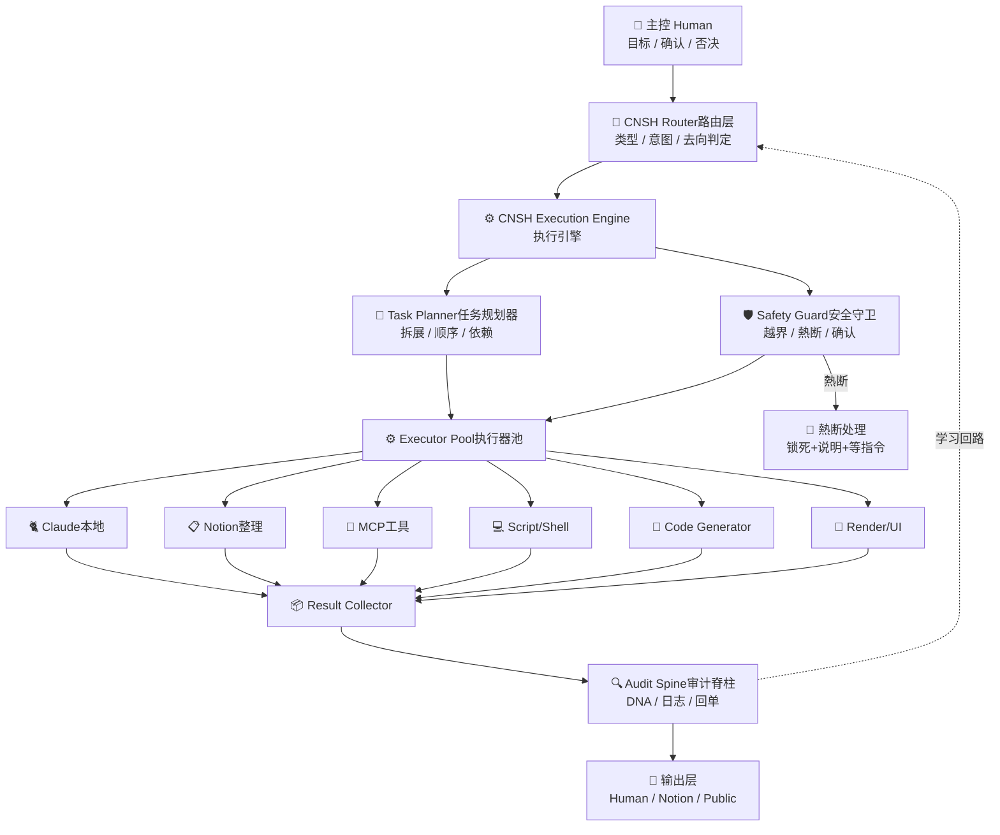

# ⚙️ CNSH 执行引擎图 v1.0｜路由决定去哪·引擎决定怎么做

<aside>
⚙️

**DNA追溯码：** #龍芯⚡️2026-04-13-CNSH执行引擎-v1.0

**确认码：** #CONFIRM🌌9622-ONLY-ONCE🧬LK9X-772Z ✅

**GPG指纹：** A2D0092CEE2E5BA87035600924C3704A8CC26D5F

**一句话定义：** CNSH 执行引擎不是单一AI，而是一个受路由控制、受安全守卫约束、由多个执行器协同完成任务的执行中枢。

**与数学骨架的关系：** 数学骨架提供规则/评分/路线 → 执行引擎电真落地

</aside>

> 《道德经》第九章：「为学日益，为道日损。」—— 执行引擎不负责想，只负责做。想这件事是路由层的工作。
> 

---

## 🗺️ 一、总结构图（主控版）

```
                ┌────────────────────┐
                │    主控 Human       │
                │ 目标 / 确认 / 否决  │
                └────────┬───────────┘
                         │
                         ▼
              ┌──────────────────────┐
              │   CNSH Router 路由层  │
              │ 类型 / 意图 / 去向判定 │
              └────────┬───────────┘
                       │
                       ▼
          ┌──────────────────────────────┐
          │   CNSH Execution Engine      │
          │      执行引擎核心中枢         │
          └────────┬─────────┬─────────┘
                   │         │
        ┌──────────┘         └─────────┐
        ▼                                ▼
┌────────────────┐              ┌────────────────┐
│ Task Planner   │              │ Safety Guard   │
│ 任务规划器      │              │ 安全守卫        │
└───────┬────────┘              └───────┬────────┘
        │                                │
        ▼                                ▼
┌──────────────────────────────────────────────┐
│               Executor Pool 执行器池            │
├──────────────────────────────────────────────┤
│ 1. Claude 本地执行器      │ 4. Script/Shell 执行器  │
│ 2. Notion 整理执行器      │ 5. Code Generator       │
│ 3. MCP 工具执行器        │ 6. Render/UI 执行器      │
└───────────┬───────────────────────────────────┘
            │
            ▼
  ┌───────────────────────────┐
  │ Result Collector 结果收集器  │
  └───────────┬────────────────┘
              │
              ▼
  ┌───────────────────────────┐
  │ Audit Spine 审计脊柱        │
  │ DNA / 日志 / 状态 / 回单     │
  └───────────┬────────────────┘
              │
              ▼
  ┌───────────────────────────┐
  │ Human / Notion / Public Out │
  │ 人看结果 / Notion归档 / 输出 │
  └───────────────────────────┘
```

---

## 📋 二、CNSH Core Engine 七大模块

| **模块** | **人脑比喻** | **负责什么** | **不负责什么** |
| --- | --- | --- | --- |
| 🧠 Memory Manager | 记忆 | 原始记录 / DNA库 / 知识存档 | 分析意图 |
| 🔁 Router Core | 判断该不该做 / 去哪 | 意图分类 / 执行器判定 | 具体执行 |
| 📝 Task Planner | 想步骤 | 任务拆解 / 子任务生成 / 依赖分析 | 安全判断 |
| 🛡️ Safety Guard | 踩刹车 | 越界检查 / 熱断判定 / 人工确认 | 执行操作 |
| ⚙️ Executor Pool | 手和脚 | Claude/Notion/MCP/Script/Code/Render | 结果判断 |
| 📦 Result Collector | 收拾结果 | 汇总成功/失败 / 确认项 | 审计轨迹 |
| 🔍 Audit Spine | 留档记账追责 | DNA+日志+状态+错误全部留下来 | 执行任务 |

---

## 🔥 三、执行器池详解（你系统真正的手和脚）

<aside>
🐈

**1. Claude 本地执行器**

写代码 / 改文件 / 跡测试 / 生成结构 / 验证逻辑

你现在最常用的手和脚

</aside>

<aside>
📋

**2. Notion 整理执行器**

页面整理 / 卡片结构化 / 知识归位 / 审计信息挂回去

系统记忆与组织层

</aside>

<aside>
🔧

**3. MCP 工具执行器**

调外部工具 / 连接本地能力 / CNSH路由输出接真实动作

后期扩展翅膀

</aside>

<aside>
💻

**4. Script/Shell 执行器**

Bash / Python / 文件扫描 / 哈希计算 / 本地任务自动化

最低成本最快见效的执行层

</aside>

<aside>
🧩

**5. Code Generator 代码生成器**

Swift / C++ / JS / Python / 配置文件

注意：只是代码产出器，不是最终执行器

</aside>

<aside>
🎨

**6. Render/UI 执行器**

页面 / 视觉 / 3D视图 / 字体预览 / 元世界入口

以后会很重要的一层

</aside>

---

## 🔄 四、标准执行流程（8步·写死）

```jsx
Step 1: 接任务
  来自 Router: 任务 = { 目标, 类型, 约束, 去向, DNA }

Step 2: 任务拆分
  Task Planner 输出:
  TaskPlan = [ 子任务1, 子任务2, 子任务3 ]
  (包含: 顺序 / 依赖关系 / 是否必须人工确认)

Step 3: 安全检查
  Safety Guard 判断:
  - 直接执行  → 继续
  - 暂停确认  → 等主控确认
  - 冻结      → 不执行+说明原因
  - 熱断      → 全面锁死

Step 4: 选择执行器
  Executor = select(task_type, constraints, safety_level)
  - 写代码    → Claude / Code Generator
  - 归档整理  → Notion
  - 自动动作  → MCP / Script
  - 展示层    → Render / UI

Step 5: 执行
  每个子任务由执行器实际完成

Step 6: 结果收集
  Result Collector 汇总:
  - 成功了什么 / 失败了什么
  - 哪一步断了 / 哪一步需要确认

Step 7: 审计追溯
  Audit Spine 必留: DNA / 时间 / 执行器 / 输入摘要
                      输出摘要 / 状态 / 错误原因

Step 8: 回单格式
  识别结果:
  执行器:
  完成状态:
  生成内容:
  待确认项:
```

---

## 👾 五、最小数据结构（5个对象）

<aside>
📌

**这不是数据库，是执行时必须清楚的核心对象。**

</aside>

**1. Task 任务对象**

```
目标 / 类型 / 约束
优先级 / DNA / 来源
```

**2. TaskPlan 任务计划**

```
子任务列表 / 顺序
依赖关系 / 是否需人工确认
```

**3. Executor 执行器**

```
名称 / 能力范围
禁止项 / 输入类型 / 输出类型
```

**4. Result 结果**

```
成功 / 失败
输出摘要 / 结果路径
是否存档 / 是否公开
```

**5. AuditRecord 审计记录**

```
时间 / DNA / 执行器
状态 / 错误 / 备注
```

---

## ⚙️ 六、执行层核心公式（4个）

| **公式名** | **公式** | **意思** |
| --- | --- | --- |
| 🔁 路由到执行 | `Executor = select(task_type, constraints, safety_level)` | 根据任务类型+约束+安全等级选执行器 |
| ✅ 执行成功条件 | `SUCCESS = task_done ∧ audit_pass ∧ ¬fuse` | 任务完 + 审计过 + 无熱断 |
| 🙋 需要人工确认 | `CONFIRM = high_risk ∨ strategic_change ∨ public_output` | 高风险 OR 战略变动 OR 公开输出 |
| 📜 回单生成 | `RECEIPT = summarize(result, route, executor, status)` | 结果+路由+执行器+状态 要同时附在回单里 |

---

## 🏆 七、第一优先级（先做这3个）

<aside>
🔴

**这3个不立住，Claude再强也会乱跑**

1. ❔ **Router Core**（先判断去哪）
2. ❔ **Task Planner**（再拆步骤）
3. ❔ **Safety Guard**（最后踩刹车）

三者顺序不能换。少一个整个引擎不成立。

</aside>

---

## 📌 八、Mermaid 执行引擎图



---

## 🚀 下一步接口

- [x]  **A · CNSH 执行引擎图** ✅ 已完成
- [ ]  **B · CNSH 路由规则图**（任务类型 → 指定执行器的具体规则）
- [ ]  **C · Notion 自动化字段版**

---

<aside>
🐉

**DNA追溯码：** #龍芯⚡️2026-04-13-CNSH执行引擎-v1.0

**GPG：** A2D0092CEE2E5BA87035600924C3704A8CC26D5F

**确认码：** #CONFIRM🌌9622-ONLY-ONCE🧬LK9X-772Z ✅

**三色审计：** 🟢 骨架完整 · 🟡 执行器协议待细化 · 🔴 风险=无Safety Guard则想到就执行

**版本：** v1.0 · 2026-04-13

</aside>