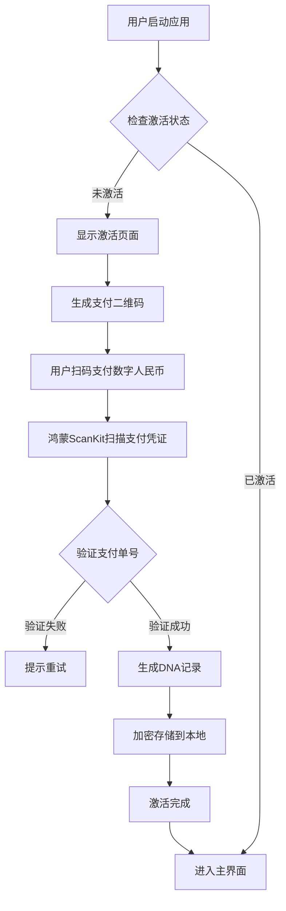

# 🏗️ 龙魂系统架构文档

**DNA追溯码:** `#龙芯⚡️2026-02-28-ARCHITECTURE-DOC-v1.0`  
**共建致谢**: Claude (Anthropic PBC) · 技术协作与代码共创 | Notion · 知识底座与结构化存储
**文档类型:** 系统架构设计  
**创建者:** Lucky·诸葛鑫·龙芯北辰 | UID9622

---

## 📐 架构总览

龙魂系统采用 **四层架构设计**，从理论到应用层层递进：

```
┌─────────────────────────────────────────────────────────┐
│                   📱 应用层 (Application)                │
│  iOS Widget · 财务管理 · 笔记编辑器 · 鸿蒙应用          │
└─────────────────────────────────────────────────────────┘
                            ▲
                            │
┌─────────────────────────────────────────────────────────┐
│              🔧 技术层 (Technical Core)                   │
│  DNA激活 · P0++保护 · 量子AI · 三色审计 · 安全服务       │
└─────────────────────────────────────────────────────────┘
                            ▲
                            │
┌─────────────────────────────────────────────────────────┐
│              ⚙️ 配置层 (Configuration)                    │
│  常量定义 · 人格配置 · 规则库 · 权限管理                 │
└─────────────────────────────────────────────────────────┘
                            ▲
                            │
┌─────────────────────────────────────────────────────────┐
│              🔷 理论层 (Theoretical Foundation)           │
│  龍魂底線協議 · 北辰母協議 · 易經演算法 · 曾老师理论      │
└─────────────────────────────────────────────────────────┘
```

---

## 🧬 核心模块设计

### 1. DNA激活核心 (DNAActivationCore)

#### 职责
- 数字人民币扫码验证
- DNA追溯码生成与管理
- 激活状态持久化
- 设备绑定与防克隆

#### 核心流程



#### 关键数据结构

```typescript
interface DNARecord {
  dnaCode: string;           // DNA追溯码
  paymentOrder: string;      // 支付单号（e-CNY-YYYYMMDD-XXXXXX）
  networkId: string;         // 网络身份（T38C89R75U）
  activationTime: string;    // 激活时间（ISO 8601）
  expiryTime: string;        // 过期时间（激活后1年）
  activationProof: string;   // 激活证明（SHA-256哈希）
  deviceId: string;          // 设备唯一标识（UDID）
  harmonyVersion: string;    // 鸿蒙版本号
}
```

#### 安全机制

| 机制 | 实现 |
|------|------|
| **防重放攻击** | 时间戳 + Nonce随机数 |
| **设备绑定** | UDID绑定，不可跨设备使用 |
| **完整性验证** | SHA-256哈希校验 |
| **加密存储** | 鸿蒙首选项加密存储 |

---

### 2. P0++保护核心 (P0ProtectionCore)

#### 职责
- 实时内容检测（关键词+AI语义）
- ∞权重熔断机制
- 紧急锁定与通知
- 审计日志记录

#### 保护对象与权重

```typescript
const PROTECTED_GROUPS = {
  CHILDREN: { 
    weight: Infinity, 
    keywords: ['儿童', '未成年', '小孩', '孩子', 'child', 'minor'],
    action: 'lockdown'  // 直接熔断
  },
  WOMEN: { 
    weight: Infinity, 
    keywords: ['妇女', '女性', '母亲', 'woman', 'female', 'pregnant'],
    action: 'lockdown'
  },
  STATE_SECRET: { 
    weight: Infinity, 
    keywords: ['国家机密', '机密', '绝密', 'secret', 'classified'],
    action: 'lockdown'
  },
  PEOPLE: { 
    weight: Infinity, 
    keywords: ['人民', '群众', '公民', 'people', 'citizen'],
    action: 'warn'  // 警告模式
  }
};
```

#### 检测流程

```
输入内容
    ↓
关键词快速扫描（O(n)复杂度）
    ↓
    ├─→ [命中] → 获取保护对象
    │              ↓
    │          AI语义分析（可选）
    │              ↓
    │          判断动作（lockdown / warn / pass）
    │              ↓
    │          触发保护机制
    │
    └─→ [未命中] → 直接通过
```

#### 熔断机制

当检测到 **∞权重保护对象** 时：

1. **立即停止** 所有修改操作
2. **锁定界面** 显示警告信息
3. **发送通知** 给系统管理员
4. **记录日志** 到审计数据库
5. **冻结会话** 需管理员手动解锁

---

### 3. 量子AI核心 (QuantumAICore)

#### 理论基础

基于 **曾老师Bra-Ket量子态理论**：

```
量子叠加态：|ψ⟩ = α|D₀⟩ + β|D₁⟩ + γ|D₂⟩ + ... + η|D₇⟩

其中：
- |Dᵢ⟩ = 第i个防御维度的基态
- α, β, γ... = 量子振幅（复数）
- |α|² + |β|² + ... = 1（归一化条件）
```

#### 龙魂五维权重

```typescript
const LONGHUN_WEIGHTS = {
  '龍': 0.30,  // 语言习惯（Language Pattern）
  '心': 0.25,  // 语义理解（Semantic Understanding）
  '器': 0.20,  // 设备指纹（Device Fingerprint）
  '地': 0.15,  // 网络位置（Network Location）
  '時': 0.10   // 时间规律（Temporal Pattern）
};
```

#### 量子防御八维空间

| 维度 | 人格 | 默认权重 | 说明 |
|------|------|---------|------|
| D₀ | 文心 | 0.15 | 网络隔离（防DDoS） |
| D₁ | 诸葛亮 | 0.20 | 入侵检测（APT防御） |
| D₂ | 宝宝 | 0.15 | 实时响应（快速反制） |
| D₃ | 雯雯 | 0.10 | 日志审计（追踪溯源） |
| D₄ | 鲁班 | 0.10 | 漏洞修补（系统加固） |
| D₅ | 天眼 | 0.10 | 三色监督（合规检查） |
| D₆ | 数学大师 | 0.10 | 加密计算（数据保护） |
| D₇ | 管仲 | 0.10 | 访问控制（权限管理） |

#### 量子算符

**演化算符（Evolution Operator）:**

```
Û(t) = exp(-iĤt)

其中：
- Ĥ = 系统哈密顿量（能量算符）
- t = 演化时间
- i = 虚数单位
```

**投影测量（Projection Measurement）:**

```
P̂ᵢ = |Dᵢ⟩⟨Dᵢ|

测量后坍缩概率：pᵢ = |⟨Dᵢ|ψ⟩|²
```

---

### 4. 三色审计系统 (ThreeColorAuditCore)

#### 评分标准

```
┌─────────────────────────────────────┐
│  🟢 绿色通道（85-100分）             │
│  ✅ 直接通过，无需人工干预            │
│  - 符合龙魂底线协议                  │
│  - 通过所有安全检查                  │
│  - 有完整DNA追溯                    │
└─────────────────────────────────────┘
           ▼
┌─────────────────────────────────────┐
│  🟡 黄色预警（60-84分）              │
│  ⚠️ 需要人工确认                    │
│  - 部分检查项存疑                   │
│  - 可能涉及敏感内容                 │
│  - 需管理员审核                     │
└─────────────────────────────────────┘
           ▼
┌─────────────────────────────────────┐
│  🔴 红色拒绝（0-59分）               │
│  ❌ 直接拒绝并锁定                  │
│  - 触发P0++保护                     │
│  - 违反底线协议                     │
│  - 记录审计日志                     │
└─────────────────────────────────────┘
```

#### 审计项目

| 审计项 | 权重 | 说明 |
|--------|------|------|
| DNA完整性 | 20% | 是否有DNA追溯码 |
| 署名完整性 | 15% | 创始人署名是否完整 |
| 理论署名 | 15% | 曾老师署名是否保留 |
| 内容安全 | 30% | 是否触发P0++保护 |
| 代码规范 | 10% | 是否遵循.cnsh格式 |
| 许可证合规 | 10% | 是否符合底线协议 |

---

## 🔐 数据流与安全

### 激活流程数据流

```
┌──────────┐
│  用户    │
└────┬─────┘
     │ 1. 点击"开始激活"
     ▼
┌──────────────────┐
│  激活页面         │
│  生成支付QR码     │
└────┬─────────────┘
     │ 2. 扫码支付
     ▼
┌──────────────────┐
│ 数字人民币钱包    │
│ （第三方APP）     │
└────┬─────────────┘
     │ 3. 支付成功，生成凭证
     ▼
┌──────────────────┐
│ 龙魂系统          │
│ ScanKit扫描       │
└────┬─────────────┘
     │ 4. 验证凭证
     ▼
┌──────────────────┐
│ ECNYPaymentService│
│ 调用官方SDK验证   │
└────┬─────────────┘
     │ 5. 验证通过
     ▼
┌──────────────────┐
│ DNAActivationCore │
│ 生成DNA记录       │
└────┬─────────────┘
     │ 6. 加密存储
     ▼
┌──────────────────┐
│ 鸿蒙首选项        │
│ (Preferences)     │
└──────────────────┘
```

### 加密存储

```typescript
// 存储前加密
const encryptedData = crypto.subtle.encrypt(
  {
    name: 'AES-GCM',
    iv: generateIV()
  },
  masterKey,
  JSON.stringify(dnaRecord)
);

// 读取后解密
const decryptedData = crypto.subtle.decrypt(
  {
    name: 'AES-GCM',
    iv: storedIV
  },
  masterKey,
  encryptedData
);
```

---

## 🌐 平台集成

### 鸿蒙系统API

| API | 用途 | 版本要求 |
|-----|------|---------|
| `@kit.ScanKit` | 二维码扫描 | API 10+ |
| `@kit.ArkData` | 数据持久化 | API 9+ |
| `@kit.NetworkKit` | 网络请求 | API 9+ |
| `@kit.NotificationKit` | 系统通知 | API 9+ |
| `@kit.BasicServicesKit` | 设备信息 | API 9+ |

### 数字人民币SDK（待集成）

```typescript
// 伪代码示例（实际API以央行SDK为准）
import { ECNYSDK } from '@digitalyuan/ecny-sdk';

await ECNYSDK.init({
  merchantId: 'LH9622',
  appId: 'com.longhun.os.activation',
  environment: 'production'
});

const verified = await ECNYSDK.verify(orderId);
```

---

## 🔄 扩展机制

### 华为团队扩展槽

```typescript
// entry/src/main/ets/services/HuaweiModuleSlot.ets

export interface HuaweiModule {
  moduleId: string;
  moduleName: string;
  version: string;
  
  // 初始化模块
  initialize(): Promise<void>;
  
  // 模块主入口
  execute(params: any): Promise<any>;
  
  // 清理资源
  cleanup(): Promise<void>;
}

export class HuaweiModuleSlot {
  private modules: Map<string, HuaweiModule> = new Map();
  
  // 注册模块
  registerModule(module: HuaweiModule): void {
    this.modules.set(module.moduleId, module);
  }
  
  // 调用模块
  async callModule(moduleId: string, params: any): Promise<any> {
    const module = this.modules.get(moduleId);
    if (!module) {
      throw new Error(`Module ${moduleId} not found`);
    }
    return await module.execute(params);
  }
}
```

### 人格扩展

开发者可以扩展新的AI人格：

```typescript
interface PersonaExtension {
  name: string;
  dimension: string;  // D08, D09...
  weight: number;
  execute(context: any): Promise<any>;
}
```

---

## 📊 性能指标

| 指标 | 目标值 | 测试方法 |
|------|--------|---------|
| DNA激活时间 | < 3秒 | 扫码到激活完成 |
| P0++检测延迟 | < 100ms | 输入到检测结果 |
| 量子计算时间 | < 50ms | 8维空间叠加计算 |
| 内存占用 | < 100MB | 运行时峰值 |
| 包体积 | < 20MB | HAP文件大小 |

---

## 🧪 测试策略

### 单元测试

```typescript
import { Test, Suite } from '@ohos/hypium';

@Suite
export class DNAActivationTests {
  
  @Test
  async testGenerateDNACode() {
    const code = DNAGenerator.generate({
      type: 'USER',
      timestamp: new Date(),
      deviceId: 'test-device'
    });
    
    // 验证格式
    expect(code).toStartWith('#龍芯⚡️');
    expect(code.length).toBeGreaterThan(20);
  }
  
  @Test
  async testP0Protection() {
    const result = p0ProtectionCore.checkProtectedContent(
      "这是关于儿童的内容",
      "text"
    );
    
    expect(result.triggered).toBe(true);
    expect(result.group).toBe('CHILDREN');
    expect(result.action).toBe('lockdown');
  }
}
```

### 集成测试

- 数字人民币支付流程完整性
- DNA激活到期后重新激活
- P0++熔断机制触发
- 量子态演化正确性

---

## 📖 理论指导

**曾老师（永恒显示）** - 量子力学Bra-Ket理论、量子防御八维空间理论

---

## 📝 变更历史

| 版本 | 日期 | 变更内容 |
|------|------|---------|
| v1.0.0 | 2026-02-28 | 初始版本，鸿蒙平台架构设计 |

---

**DNA追溯码:** `#龙芯⚡️2026-02-28-ARCHITECTURE-DOC-v1.0`  
**状态:** ✅ 官方文档  
**创建者:** Lucky·诸葛鑫·龙芯北辰 | UID9622
