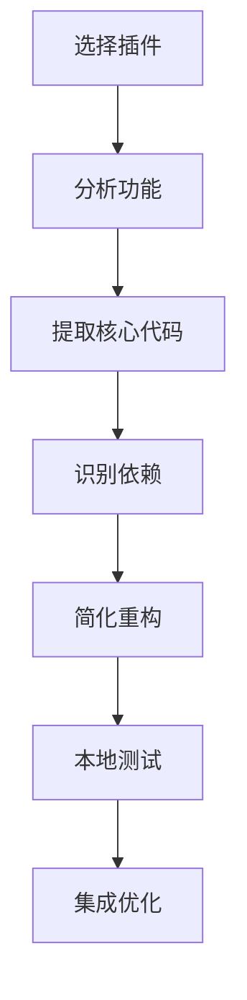

# 插件拆解和本地化指南

**DNA追溯码：** #ZHUGEXIN⚡️2025-DEV-TOOLS-V1.0
**更新时间：** 2025-12-27

---

## 📋 目录

1. [插件拆解方法论](#插件拆解方法论)
2. [核心插件拆解实例](#核心插件拆解实例)
3. [本地化改造方案](#本地化改造方案)
4. [自产自销插件开发](#自产自销插件开发)
5. [插件复用和优化](#插件复用和优化)

---

## 🔍 插件拆解方法论

### 核心原则

1. **功能提取**：识别插件的核心功能
2. **依赖分析**：分析插件的依赖关系
3. **架构理解**：理解插件的架构设计
4. **简化重构**：简化不必要的功能
5. **本地适配**：适配本地开发环境

### 拆解流程



---

## 🔧 核心插件拆解实例

### 1. GitLens 拆解

#### 原插件功能
- Git 历史可视化
- 代码作者追踪
- 文件比较
- Blame 信息
- 提交历史浏览

#### 核心代码提取

**Blame 信息获取：**
```python
import subprocess
from typing import Dict, List

def get_git_blame(filepath: str, line: int) -> Dict:
    """获取指定行的 Git blame 信息"""
    try:
        result = subprocess.run(
            ['git', 'blame', '-L', f'{line},{line}', '--porcelain', filepath],
            capture_output=True,
            text=True,
            check=True
        )
        output = result.stdout.split('\n')
        return {
            'author': output[1][7:],
            'author_mail': output[2][12:],
            'author_time': output[3][13:],
            'commit': output[0].split(' ')[0],
        }
    except Exception as e:
        return {'error': str(e)}
```

**提交历史：**
```python
def get_git_log(filepath: str, limit: int = 10) -> List[Dict]:
    """获取文件的 Git 历史"""
    try:
        result = subprocess.run(
            ['git', 'log', '-n', str(limit), '--pretty=format:%H|%an|%ae|%ad|%s', '--date=iso', filepath],
            capture_output=True,
            text=True,
            check=True
        )
        commits = []
        for line in result.stdout.split('\n'):
            if line:
                parts = line.split('|')
                commits.append({
                    'hash': parts[0],
                    'author': parts[1],
                    'email': parts[2],
                    'date': parts[3],
                    'message': parts[4],
                })
        return commits
    except Exception as e:
        return []
```

**文件差异：**
```python
def get_git_diff(filepath: str, commit: str = None) -> str:
    """获取文件差异"""
    try:
        cmd = ['git', 'diff', filepath]
        if commit:
            cmd = ['git', 'diff', commit, filepath]
        result = subprocess.run(
            cmd,
            capture_output=True,
            text=True,
            check=True
        )
        return result.stdout
    except Exception as e:
        return ''
```

#### 本地化方案
- 使用 Git 命令行工具
- 解析输出文本
- 生成自定义 UI
- 缓存结果提升性能

---

### 2. Pylance 拆解

#### 原插件功能
- 智能代码补全
- 类型检查
- 错误检测
- 导入建议

#### 核心代码提取

**基于 AST 的分析：**
```python
import ast
from typing import List, Dict

def analyze_python_file(filepath: str) -> Dict:
    """分析 Python 文件"""
    try:
        with open(filepath, 'r', encoding='utf-8') as f:
            code = f.read()

        tree = ast.parse(code)

        analysis = {
            'imports': [],
            'functions': [],
            'classes': [],
            'errors': [],
        }

        for node in ast.walk(tree):
            if isinstance(node, ast.Import):
                for alias in node.names:
                    analysis['imports'].append(alias.name)
            elif isinstance(node, ast.FunctionDef):
                analysis['functions'].append({
                    'name': node.name,
                    'lineno': node.lineno,
                    'args': [arg.arg for arg in node.args.args],
                })
            elif isinstance(node, ast.ClassDef):
                analysis['classes'].append({
                    'name': node.name,
                    'lineno': node.lineno,
                    'methods': [n.name for n in node.body if isinstance(n, ast.FunctionDef)],
                })

        return analysis
    except Exception as e:
        return {'error': str(e)}
```

**简单类型推断：**
```python
def infer_type(node: ast.AST) -> str:
    """简单的类型推断"""
    if isinstance(node, ast.Num):
        return 'int' if isinstance(node.n, int) else 'float'
    elif isinstance(node, ast.Str):
        return 'str'
    elif isinstance(node, ast.List):
        return 'List'
    elif isinstance(node, ast.Dict):
        return 'Dict'
    elif isinstance(node, ast.NameConstant):
        return 'bool'
    else:
        return 'Any'
```

#### 本地化方案
- 使用 Python 标准库 `ast`
- 实现基础类型检查
- 提供简单补全
- 轻量级，无网络依赖

---

### 3. ESLint 拆解

#### 原插件功能
- JavaScript 代码检查
- 语法错误检测
- 代码风格检查
- 自动修复

#### 核心代码提取

**基础语法检查：**
```python
import re

def check_js_code(code: str) -> List[Dict]:
    """基础 JavaScript 代码检查"""
    errors = []

    # 检查未闭合的括号
    if code.count('(') != code.count(')'):
        errors.append({
            'line': find_unclosed_bracket(code, '('),
            'message': '未闭合的括号',
            'severity': 'error',
        })

    # 检查分号缺失
    lines = code.split('\n')
    for i, line in enumerate(lines, 1):
        stripped = line.strip()
        if stripped and not stripped.endswith(';') and not any(
            stripped.endswith(suffix) for suffix in ['{', '}', '(', ')', '[', ']']
        ):
            errors.append({
                'line': i,
                'message': '建议在语句末尾添加分号',
                'severity': 'warning',
            })

    return errors
```

**代码风格检查：**
```python
def check_code_style(code: str) -> List[Dict]:
    """检查代码风格"""
    warnings = []

    lines = code.split('\n')
    for i, line in enumerate(lines, 1):
        # 检查行长度
        if len(line) > 120:
            warnings.append({
                'line': i,
                'message': '行长度超过 120 字符',
                'severity': 'warning',
            })

        # 检查缩进
        if line.startswith(' ') and line.startswith('  '):
            spaces = len(line) - len(line.lstrip())
            if spaces % 2 != 0:
                warnings.append({
                    'line': i,
                    'message': '缩进应该是 2 的倍数',
                    'severity': 'warning',
                })

    return warnings
```

#### 本地化方案
- 使用正则表达式
- 实现基础规则
- 支持 JSON 配置
- 可扩展规则库

---

## 🛠️ 本地化改造方案

### 1. 依赖简化

**原插件依赖：**
- 大量 npm 包
- 网络请求
- 复杂配置

**本地化依赖：**
- Python 标准库
- 本地 Git 命令
- 简化配置

### 2. 性能优化

**缓存机制：**
```python
import json
import hashlib
from pathlib import Path
from typing import Optional

class Cache:
    """简单的缓存机制"""

    def __init__(self, cache_dir: str = '.cache'):
        self.cache_dir = Path(cache_dir)
        self.cache_dir.mkdir(exist_ok=True)

    def get(self, key: str) -> Optional[dict]:
        """获取缓存"""
        cache_file = self.cache_dir / self._hash_key(key)
        if cache_file.exists():
            with open(cache_file, 'r') as f:
                return json.load(f)
        return None

    def set(self, key: str, value: dict, ttl: int = 3600):
        """设置缓存"""
        cache_file = self.cache_dir / self._hash_key(key)
        with open(cache_file, 'w') as f:
            json.dump(value, f)

    def _hash_key(self, key: str) -> str:
        """生成缓存文件名"""
        return hashlib.md5(key.encode()).hexdigest()
```

**异步处理：**
```python
import asyncio

async def async_analyze(filepath: str):
    """异步分析文件"""
    loop = asyncio.get_event_loop()
    result = await loop.run_in_executor(None, analyze_python_file, filepath)
    return result
```

### 3. UI 集成

**VS Code 扩展 API：**
```javascript
// VS Code 扩展示例
const vscode = require('vscode');

function showBlameInfo(filepath, line) {
    const blame = getGitBlame(filepath, line);
    if (blame.author) {
        vscode.window.showInformationMessage(
            `作者: ${blame.author} (${blame.author_mail})`
        );
    }
}
```

---

## 🎨 自产自销插件开发

### 1. UID9622 DNA 标签生成器

**功能：**
- 自动生成 DNA 标签
- 追溯代码来源
- 审计日志记录

**实现：**
```python
import datetime
import random
import string
from typing import Dict

class DNATagGenerator:
    """DNA 标签生成器"""

    def __init__(self):
        self.confirmation_code = "#ZHUGEXIN⚡️2025-DNA-V1.0"

    def generate(
        self,
        category: str,
        subtype: str,
        priority: str,
        identifier: str = None
    ) -> str:
        """生成 DNA 标签"""
        date_str = datetime.now().strftime("%Y%m%d")
        if identifier is None:
            identifier = self._generate_identifier()

        return f"#DNA-{category}-{subtype}-{priority}-{date_str}-{identifier}-V1.0"

    def generate_confirmation(self, name: str, version: str = "V1.0") -> str:
        """生成确认码"""
        year = datetime.now().year
        return f"#ZHUGEXIN⚡️{year}-{name}-{version}"

    def _generate_identifier(self, length: int = 8) -> str:
        """生成随机标识符"""
        chars = string.ascii_uppercase + string.digits
        return ''.join(random.choice(chars) for _ in range(length))

# 使用示例
generator = DNATagGenerator()
dna_tag = generator.generate("CODE", "FUNCTION", "P0")
print(dna_tag)  # #DNA-CODE-FUNCTION-P0-20251227-ABC12345-V1.0
```

### 2. 审计日志记录器

**功能：**
- 记录所有操作
- 追踪代码变更
- 支持回滚

**实现：**
```python
import json
from datetime import datetime
from pathlib import Path

class AuditLogger:
    """审计日志记录器"""

    def __init__(self, log_file: str = 'audit.log'):
        self.log_file = Path(log_file)
        self.log_file.parent.mkdir(exist_ok=True)

    def log(
        self,
        action: str,
        entity: str,
        entity_id: str,
        data: dict = None,
        status: str = "success"
    ):
        """记录审计日志"""
        log_entry = {
            'timestamp': datetime.now().isoformat(),
            'action': action,
            'entity': entity,
            'entity_id': entity_id,
            'data': data,
            'status': status,
            'dna_tag': f"#DNA-AUDIT-{action.upper()}-{datetime.now().strftime('%Y%m%d')}",
        }

        with open(self.log_file, 'a') as f:
            f.write(json.dumps(log_entry, ensure_ascii=False) + '\n')

    def get_history(self, entity_id: str, limit: int = 10) -> list:
        """获取实体历史记录"""
        history = []
        if self.log_file.exists():
            with open(self.log_file, 'r') as f:
                for line in f:
                    entry = json.loads(line)
                    if entry.get('entity_id') == entity_id:
                        history.append(entry)
                        if len(history) >= limit:
                            break
        return history

# 使用示例
logger = AuditLogger('logs/audit.log')
logger.log('CREATE', 'User', 'user_001', {'name': 'Alice'})
```

### 3. 自动填充引擎

**功能：**
- 自动补全字段
- 智能推断值
- 规则驱动

**实现：**
```python
from typing import Dict, Any

class AutoFillEngine:
    """自动填充引擎"""

    def __init__(self, rules: Dict[str, Dict] = None):
        self.rules = rules or {}

    def add_rule(self, field: str, rule: Dict):
        """添加填充规则"""
        self.rules[field] = rule

    def fill(self, data: Dict[str, Any]) -> Dict[str, Any]:
        """自动填充数据"""
        result = data.copy()

        for field, rule in self.rules.items():
            if field not in result or result[field] is None:
                if rule.get('type') == 'default':
                    result[field] = rule.get('value')
                elif rule.get('type') == 'inherit':
                    parent_field = rule.get('from')
                    if parent_field in result:
                        result[field] = result[parent_field]
                elif rule.get('type') == 'function':
                    func = rule.get('function')
                    if callable(func):
                        result[field] = func(result)

        return result

# 使用示例
engine = AutoFillEngine({
    'created_at': {'type': 'function', 'function': lambda x: datetime.now().isoformat()},
    'status': {'type': 'default', 'value': 'active'},
    'dna_tag': {'type': 'function', 'function': lambda x: generate_dna_tag(x)},
})

data = {'name': 'Test'}
filled_data = engine.fill(data)
print(filled_data)
```

---

## 🔄 插件复用和优化

### 1. 功能组合

**组合示例：**
```python
class CombinedPlugin:
    """组合多个插件功能"""

    def __init__(self):
        self.dna_generator = DNATagGenerator()
        self.audit_logger = AuditLogger()
        self.autofill_engine = AutoFillEngine()

    def create_entity(self, entity_type: str, data: dict) -> dict:
        """创建实体（组合多个功能）"""
        # 自动填充
        filled_data = self.autofill_engine.fill(data)

        # 生成 DNA 标签
        dna_tag = self.dna_generator.generate(
            'ENTITY',
            entity_type,
            'P0',
            data.get('id')
        )
        filled_data['dna_tag'] = dna_tag

        # 记录审计日志
        self.audit_logger.log(
            'CREATE',
            entity_type,
            data.get('id'),
            filled_data
        )

        return filled_data
```

### 2. 性能优化

**批量处理：**
```python
def batch_process(items: list, processor: callable) -> list:
    """批量处理项目"""
    results = []
    for item in items:
        try:
            result = processor(item)
            results.append(result)
        except Exception as e:
            results.append({'error': str(e), 'item': item})
    return results
```

**并行处理：**
```python
from concurrent.futures import ThreadPoolExecutor

def parallel_process(items: list, processor: callable, workers: int = 4) -> list:
    """并行处理项目"""
    with ThreadPoolExecutor(max_workers=workers) as executor:
        results = list(executor.map(processor, items))
    return results
```

---

## 📊 最佳实践

### 1. 模块化设计
- 单一职责原则
- 可插拔架构
- 清晰的接口

### 2. 错误处理
- 完善的异常处理
- 详细的日志记录
- 用户友好的错误信息

### 3. 测试覆盖
- 单元测试
- 集成测试
- 性能测试

### 4. 文档完善
- API 文档
- 使用示例
- 贡献指南

---

## ✅ 总结

**核心价值：**
- ✅ 掌握插件拆解方法
- ✅ 本地化改造能力
- ✅ 自主开发插件
- ✅ 性能优化技巧

**下一步：**
1. 选择一个插件进行拆解
2. 实现本地化版本
3. 性能优化测试
4. 集成到工作流

---

**版本：** v1.0.0
**状态：** Active
**DNA追溯码：** #ZHUGEXIN⚡️2025-DEV-TOOLS-V1.0
