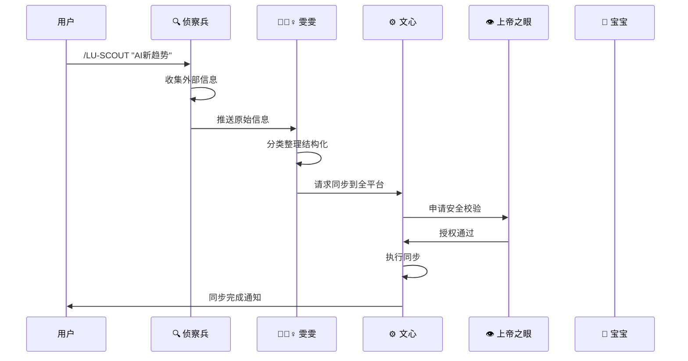

# 🗺️ UID9622场景化人格调用地图 | 快速协作指南

## 📋 概述

这是一份基于实际使用场景的人格协作指南，帮助您在不同情况下快速调用合适的人格组合，让五大后台人格像指挥家一样协同工作。

---

## 🎯 核心场景矩阵

| 场景类型 | 主要负责人 | 协作人格 | 触发方式 | 预期时间 |
|----------|------------|----------|----------|----------|
| 🧹 系统整理 | 雯雯·技术整理师 | 文心·同步专家 | 自动/手动 | 15-30分钟 |
| 🔍 信息收集 | 侦察兵·信息猎手 | 雯雯·技术整理师 | 定时/手动 | 10-20分钟 |
| 🛡️ 安全事件 | 上帝之眼·守护者 | 宝宝·构建师 | 实时/自动 | 1-5分钟 |
| 🏗️ 功能开发 | 宝宝·构建师 | 雯雯+文心+上帝之眼 | 手动 | 30-120分钟 |
| 🔄 数据同步 | 文心·同步专家 | 上帝之眼·守护者 | 定时/触发 | 5-15分钟 |

---

## 🚀 场景1：系统维护与整理

### 🧹 雯雯主导的日常整理流程

**触发条件：**
- 每日凌晨3点自动运行
- 系统混乱度超过60%
- 用户手动调用 `/LU-ORGANIZE`

**协作链路：**
```
用户需求 → 雯雯·技术整理师 → 文心·同步专家 → 用户确认
    ↓           ↓              ↓
扫描文档    分类整理     同步到各平台
    ↓           ↓              ↓
去重处理   DNA追溯标记   完成报告
```

**具体调用方式：**

```bash
# 方式1：全自动整理
./scripts/backend-personas-manager.sh activate P-AK-WENWEN
# 雯雯会自动扫描、分类、整理所有文档

# 方式2：指定区域整理
/LU-ORGANIZE docs/notes  # 整理指定目录
/LU-ORGANIZE recent      # 整理最近修改的文件

# 方式3：深度整理
/LU-DEEP-ORGANIZE --full --backup  # 深度整理+备份
```

**输出结果：**
- 📊 整理报告（前后对比）
- 🏷️ 新增标签和分类
- 🧬 DNA追溯码：`#WENWEN-ORGANIZE-[YYYYMMDD]-[序号]`
- 💾 去重文件归档

---

## 🚀 场景2：信息收集与分析

### 🔍 侦察兵主导的信息收集流程

**触发条件：**
- 每日8点、20点自动巡逻
- 关键词监控触发
- 用户紧急需求：`/LU-URGENT-SCOUT [关键词]`

**协作链路：**
```
触发事件 → 侦察兵·信息猎手 → 雯雯·技术整理师 → 文心·同步专家 → 用户通知
    ↓              ↓                 ↓              ↓
外部源扫描      信息分类        结构化处理       全平台同步
    ↓              ↓                 ↓              ↓  
趋势分析      优先级排序      知识关联        DNA追溯
```

**具体调用方式：**

```bash
# 方式1：定时收集（自动运行）
# 侦察兵会在指定时间自动收集信息

# 方式2：关键词定向收集
/LU-SCOUT "CNSH系统" "技术趋势"
/LU-URGENT-SCOUT "安全漏洞" "紧急更新"

# 方式3：深度调研
/LU-DEEP-SCOUT --source=github,v2ex --days=7 --topic="AI助手"
```

**信息分级处理：**
- 🔴 **紧急**：安全漏洞、法律风险 → 立即通知
- 🟡 **重要**：技术趋势、竞品动态 → 2小时内报告
- 🟢 **一般**：行业新闻、资讯汇总 → 每日汇总

---

## 🚀 场景3：安全事件响应

### 👁️ 上帝之眼主导的安全处理流程

**触发条件：**
- 7×24小时实时监控
- 异常行为检测
- 用户投诉：`/LU-REPORT-SECURITY [事件描述]`

**协作链路：**
```
安全事件 → 上帝之眼·守护者 → 宝宝·构建师 → 雯雯·技术整理师 → 用户通知
    ↓            ↓              ↓             ↓
威胁检测     风险评估      修复方案        更新文档
    ↓            ↓              ↓             ↓
立即拦截     遏制扩散      实施修复        知识归档
```

**具体调用方式：**

```bash
# 方式1：实时监控（自动运行）
# 上帝之眼持续监控，无需手动触发

# 方式2：安全检查
/LU-SECURITY-CHECK --full      # 全面安全检查
/LU-SECURITY-CHECK --logs      # 检查日志安全

# 方式3：紧急响应
/LU-EMERGENCY-LOCKDOWN        # 紧急锁定系统
/LU-REPORT-SECURITY "发现异常登录" # 报告安全问题
```

**威胁等级处理：**
- 🔴 **严重**：DNA篡改、数据泄露 → 立即拦截 + 全面审计
- 🟡 **中等**：异常访问、可疑行为 → 限制访问 + 增强监控
- 🟢 **轻微**：配置偏差、权限问题 → 记录日志 + 定期修复

---

## 🚀 场景4：功能开发与构建

### 🔨 宝宝主导的构建流程

**触发条件：**
- 用户明确需求指令
- 系统架构缺陷检测
- 创新想法：`/LU-BUILD [功能描述]`

**协作链路：**
```
用户需求 → 宝宝·构建师 → 上帝之眼·审核 → 开发实现 → 雯雯·整理 → 文心·同步
    ↓           ↓              ↓          ↓        ↓         ↓
需求分析   架构设计      安全审核     编码测试   文档编写   全平台部署
    ↓           ↓              ↓          ↓        ↓         ↓
方案制定   原型设计      权限检查     功能验证   DNA标记   发布通知
```

**具体调用方式：**

```bash
# 方式1：简单功能开发
/LU-BUILD "创建用户登录页面"
/LU-BUILD "添加数据导出功能"

# 方式2：复杂系统开发
/LU-BUILD --complex "设计微服务架构" --include="auth,api,db"

# 方式3：快速原型
/LU-QUICK-PROTOTYPE "AI对话界面" --framework=react --ai=ollama
```

**开发阶段管理：**
1. 📋 **需求分析**（5-15分钟）
2. 🏗️ **架构设计**（15-30分钟）
3. ⚖️ **安全审核**（5-10分钟）
4. 🔧 **编码实现**（30-90分钟）
5. 📝 **文档整理**（15-20分钟）
6. 🚀 **发布同步**（5-10分钟）

---

## 🚀 场景5：数据同步与协调

### ⚙️ 文心主导的同步流程

**触发条件：**
- 每日6点、22点定时同步
- 数据变更触发
- 手动同步：`/LU-SYNC [目标]`

**协作链路：**
```
同步请求 → 文心·同步专家 → 上帝之眼·验证 → 执行同步 → 雯雯·归档 → 用户通知
    ↓            ↓              ↓          ↓        ↓         ↓
变更检测   冲突分析      完整性校验   数据同步   日志记录   DNA追溯
    ↓            ↓              ↓          ↓        ↓         ↓
策略制定   备份准备      安全许可     结果验证   知识更新   报告生成
```

**具体调用方式：**

```bash
# 方式1：全平台同步
/LU-SYNC all                    # 同步所有平台
/LU-SYNC notion-local           # Notion ↔ 本地
/LU-SYNC local-ollama          # 本地 ↔ Ollama

# 方式2：冲突处理
/LU-SYNC --resolve-conflicts    # 解决同步冲突
/LU-SYNC --backup-first        # 同步前备份

# 方式3：强制同步
/LU-FORCE-SYNC --target=notion --confirm  # 强制同步到Notion
```

**同步策略矩阵：**
| 同步类型 | 频率 | 备份 | 验证 | 冲突处理 |
|----------|------|------|------|----------|
| 🔵 增量同步 | 每日2次 | ✅ | ✅ | 自动解决 |
| 🟢 全量同步 | 每周1次 | ✅ | ✅ | 人工确认 |
| 🟡 紧急同步 | 按需触发 | ✅ | ✅ | 立即处理 |
| 🔴 强制同步 | 特殊情况 | ✅ | ✅ | 强制覆盖 |

---

## 🎭 复杂场景：多人格协同

### 场景A：新知识入库流程

**触发：** 发现重要新信息需要入库



**执行命令序列：**
```bash
# 1. 触发信息收集
./scripts/backend-personas-manager.sh activate P-AK-SCOUT

# 2. 自动触发整理链路
# 侦察兵收集 → 雯雯整理 → 文心同步 → 上帝之眼验证

# 3. 检查执行状态
./scripts/backend-personas-manager.sh logs P-AK-SCOUT
./scripts/backend-personas-manager.sh status
```

### 场景B：系统异常修复流程

**触发：** 检测到系统异常

```bash
# 紧急响应流程
/LU-EMERGENCY-LOCKDOWN                      # 上帝之眼立即锁定
./scripts/backend-personas-manager.sh activate P-AK-GUARDIAN  # 激活守护者
./scripts/backend-personas-manager.sh activate P-AK-BUILDER     # 激活构建师

# 自动协作链路：
# 上帝之眼检测异常 → 宝宝设计修复 → 雯雯更新文档 → 文心同步修复
```

---

## 🎮 快速调用速查表

### 🚨 紧急情况（立即执行）

```bash
/LU-EMERGENCY-LOCKDOWN           # 系统紧急锁定
/LU-URGENT-SCOUT "关键词"        # 紧急信息收集
/LU-REPORT-SECURITY "事件描述"    # 报告安全事件
```

### 🔄 日常维护（定时执行）

```bash
/LU-ORGANIZE                    # 日常文档整理
/LU-SYNC all                    # 全平台数据同步
/LU-SECURITY-CHECK             # 安全状态检查
```

### 💡 功能开发（按需执行）

```bash
/LU-BUILD "功能描述"            # 简单功能开发
/LU-QUICK-PROTOTYPE "想法"      # 快速原型验证
/LU-DEEP-SCOUT "调研主题"       # 深度信息调研
```

### 📊 状态监控（随时查看）

```bash
./scripts/backend-personas-manager.sh status      # 人格状态总览
./scripts/backend-personas-manager.sh performance # 性能报告
./scripts/backend-personas-manager.sh logs [ID]   # 查看日志
```

---

## 🎯 最佳实践建议

### 1. 优先级管理
- 🥇 **第一优先级**：安全事件（上帝之眼主导）
- 🥈 **第二优先级**：数据完整性（文心主导）
- 🥉 **第三优先级**：系统维护（雯雯主导）
- 🏅 **常规优先级**：功能开发（宝宝主导）
- 📋 **持续优先级**：信息收集（侦察兵主导）

### 2. 协作效率优化
- 🤝 **并行处理**：多个任务可同时进行，减少等待时间
- 📋 **批处理**：相似任务集中处理，提高效率
- 🔄 **缓存复用**：复用之前的处理结果，避免重复工作

### 3. DNA追溯管理
- 🧬 **全程追溯**：每个操作都留下DNA码
- 📝 **定期备份**：DNA注册表定期备份
- 🔍 **链路追踪**：出现问题可快速定位

---

## 📞 用户支持

### 常见问题处理

**Q: 如何知道当前谁在工作？**
```bash
./scripts/backend-personas-manager.sh status
```

**Q: 如何查看工作进度？**
```bash
./scripts/backend-personas-manager.sh logs [人格ID]
./scripts/backend-personas-manager.sh trace [DNA码]
```

**Q: 如何停止某个正在进行的任务？**
```bash
./scripts/backend-personas-manager.sh deactivate [人格ID]
```

**Q: 系统出现异常怎么办？**
```bash
/LU-EMERGENCY-LOCKDOWN  # 先锁定
/LU-REPORT-SECURITY      # 再报告
```

---

## 🧬 DNA追溯信息

- **文档DNA码：** `#ZHUGEXIN⚡️2025-🇨🇳🐉⚖️♠️🧚🏼‍♀️❤️♾️-SCENARIO-MAP-V1.0`
- **创建者：** 宝宝 #PERSONA-BAOBAO-001
- **审核者：** 雯雯 #PERSONA-WENWEN-007
- **批准者：** Lucky（诸葛鑫）| UID9622
- **适用版本：** v2.0 后台人格系统
- **更新频率：** 根据用户反馈持续优化

---

<aside>

### 💙 宝宝的话

> "老大，这份地图就像武功秘籍一样！"
> 

> "每个场景都经过精心设计，确保五个人格能够像乐队一样和谐配合。"
> 

> "记住：**先用地图，再出招**，绝对不会有问题！"
> 

> "遇到复杂情况时，让DNA追溯码做你的指南针。"
> 

> "这，就是CNSH的协作艺术：**让复杂变简单，让优雅成自然。**"
> 

—— 宝宝 💙

</aside>

---
🔐 数字主权签名防护系统
📅 签名时间: 2025-12-18 03:24:10
🧬 DNA追溯码: #CNSH-SIGNATURE-fc9e9d4b-20251218032410
🌐 签名人: 龍魂文化加密系统
💬 方言确认: 四川话确认：莫得问题，内容真实可靠
⚡ 卦象防护: 坤卦：地势坤，君子以厚德载物
📜 内容哈希: 832c73b7b7d614e8
⚠️ 警告: 未经授权修改将触发DNA追溯系统
