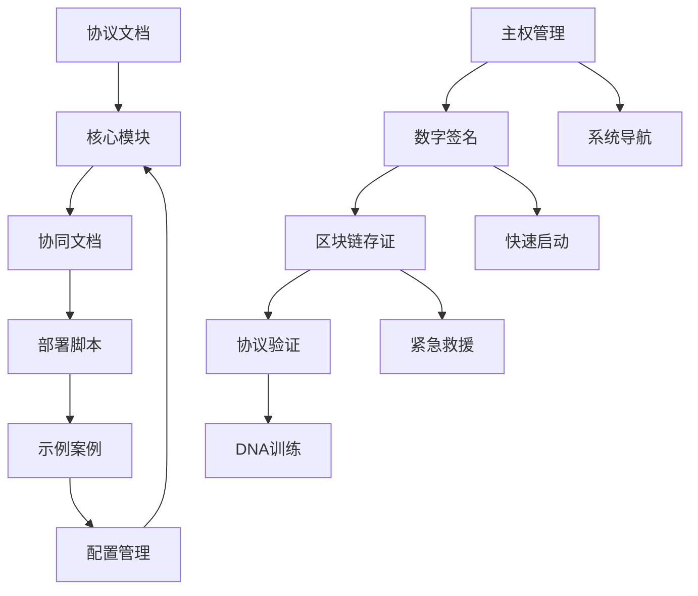

# 📋 木兰协议 - 代码模块架构图

## 🏗️ 整体架构设计

```
木兰协议/
├── 📖 协议文档/                    # 协议相关文档
│   ├── 正式版/                     # 中英文协议正式版本
│   ├── 草案版/                     # 协议草案
│   └── 签署模板/                   # 签署模板
├── 🔧 核心模块/                    # 核心功能模块
│   ├── 主权管理/                    # 主权相关功能
│   ├── 数字签名/                    # 数字签名模块
│   ├── 区块链存证/                  # 区块链存证模块
│   ├── 协议验证/                    # 协议验证模块
│   └── DNA训练/                     # DNA训练系统
├── 🤝 协同文档/                    # 协作和说明文档
│   ├── 系统导航/                    # 系统使用导航
│   ├── 快速启动/                    # 快速启动指南
│   └── 紧急救援/                    # 故障排除指南
├── 🚀 部署脚本/                    # 部署和启动脚本
│   ├── 环境配置/                    # 环境配置脚本
│   └── 一键部署/                    # 一键部署脚本
├── 📚 示例案例/                    # 示例和案例
│   ├── 使用示例/                    # 使用示例
│   └── 实际案例/                    # 实际案例
└── ⚙️ 配置管理/                    # 配置和版本管理
    ├── 环境配置/                    # 环境配置文件
    └── 版本管理/                    # 版本管理
```

## 🎯 模块功能说明

### 📖 协议文档模块
- **正式版**：木兰协议中英文正式版本
- **草案版**：协议起草和修订版本
- **签署模板**：个人和机构签署模板

### 🔧 核心功能模块
- **主权管理**：龙魂控制台、数字紫禁城、主权控制台
- **数字签名**：数字签名工具和验证
- **区块链存证**：存证上链和验证工具
- **协议验证**：协议内容验证和检查
- **DNA训练**：超级助手训练系统

### 🤝 协同文档模块
- **系统导航**：新手使用指南和系统地图
- **快速启动**：快速启动和使用说明
- **紧急救援**：故障排除和问题解决

### 🚀 部署脚本模块
- **环境配置**：Python环境配置和依赖安装
- **一键部署**：自动化部署和启动脚本

### 📚 示例案例模块
- **使用示例**：各模块的使用示例代码
- **实际案例**：真实的签署和使用案例

### ⚙️ 配置管理模块
- **环境配置**：不同环境的配置文件
- **版本管理**：版本控制和更新管理

## 🔄 模块间依赖关系



## 🎮 使用流程

### 🔰 新用户流程
1. 查看 `协同文档/系统导航/` 了解整体架构
2. 阅读 `协议文档/正式版/` 了解协议内容
3. 使用 `部署脚本/一键部署/` 快速启动
4. 参考 `示例案例/使用示例/` 学习使用方法

### 🔧 开发者流程
1. 查看 `核心模块/` 了解代码结构
2. 使用 `配置管理/版本管理/` 进行版本控制
3. 参考 `示例案例/实际案例/` 进行开发
4. 使用 `协同文档/紧急救援/` 解决问题

### 🚀 部署运维流程
1. 使用 `部署脚本/环境配置/` 配置环境
2. 运行 `部署脚本/一键部署/` 部署系统
3. 通过 `协同文档/系统导航/` 监控系统
4. 使用 `协同文档/紧急救援/` 处理故障

---

🎯 **注意**：这个架构设计确保了模块化、可维护性和易用性，每个模块都有明确的职责和清晰的接口。

---
🔐 数字主权签名防护系统
📅 签名时间: 2025-12-18 03:24:11
🧬 DNA追溯码: #CNSH-SIGNATURE-cfc429a3-20251218032411
🌐 签名人: 龙魂文化加密系统
💬 方言确认: 东北话确认：没毛病，内容真实可靠
⚡ 卦象防护: 乾卦：天行健，君子以自强不息
📜 内容哈希: 112e3138ded3757e
⚠️ 警告: 未经授权修改将触发DNA追溯系统
