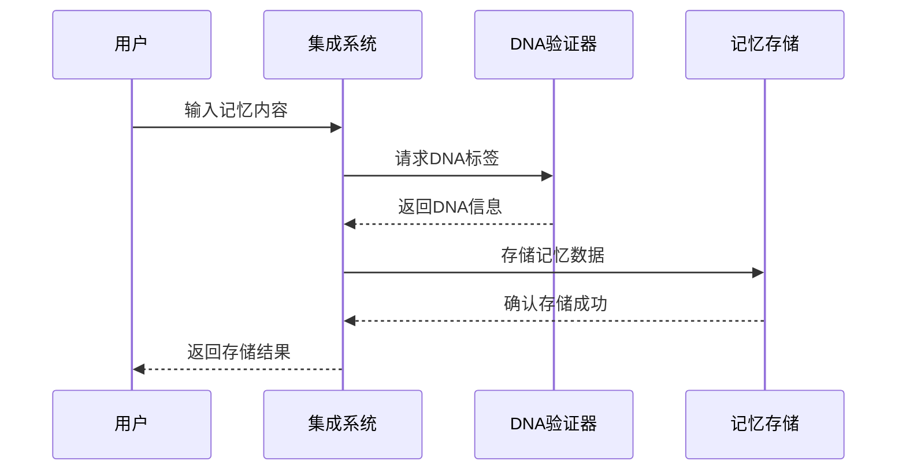
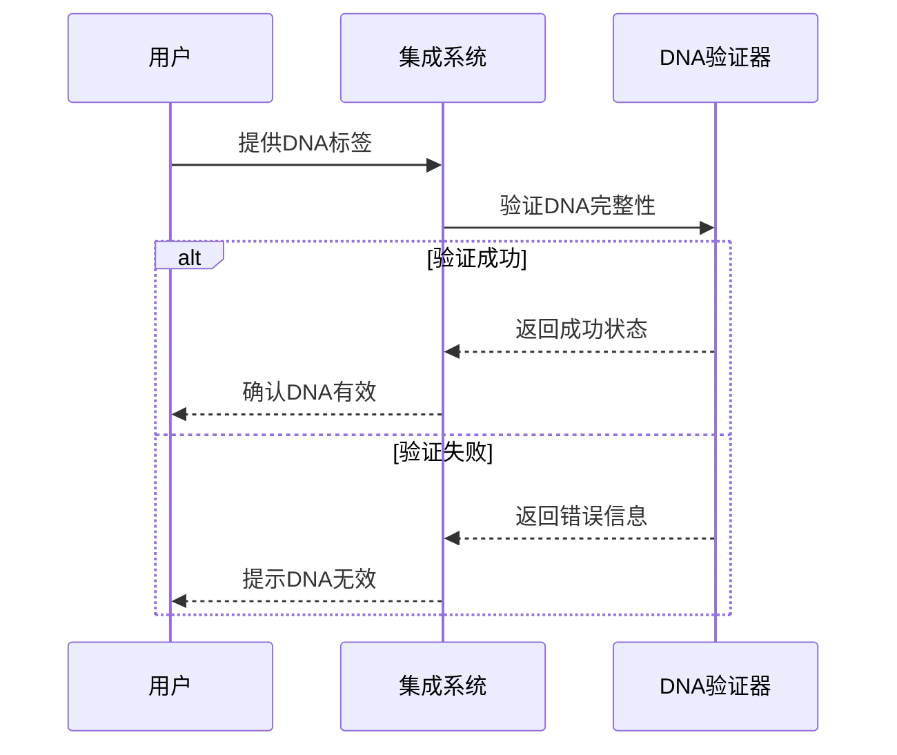

# 🔧 DNA编码系统 - 技术架构

## 🏗️ 系统架构总览

### 整体架构图

```
┌─────────────────────────────────────────────────────────┐
│                    DNA编码系统架构                       │
├─────────────────┬─────────────────┬─────────────────────┤
│   应用层        │   服务层        │     数据层          │
│  (Application)  │   (Service)     │     (Data)         │
├─────────────────┼─────────────────┼─────────────────────┤
│ • 用户接口      │ • DNA验证服务    │ • 记忆数据库        │
│ • 命令行工具    │ • 记忆管理服务    │ • 配置存储         │
│ • Web界面       │ • 系统监控服务    │ • 日志文件         │
│ • API网关       │ • 集成控制服务    │ • 缓存系统         │
└─────────────────┴─────────────────┴─────────────────────┘
```

## 🔧 核心组件详解

### 1. DNA验证引擎 (dna_verifier.py)

**功能描述**: 负责生成和验证DNA标签，确保身份标识的完整性和一致性。

```python
class CNSHDNAVerifier:
    """DNA验证引擎核心类"""
    
    def __init__(self, config: dict = None):
        """初始化验证引擎"""
        self.config = config or self._load_default_config()
        self.sequence_generator = SequenceGenerator()
    
    def generate_dna(self, content_type: str = "MEMORY") -> dict:
        """生成标准DNA标签"""
        # 实现逻辑
        pass
    
    def verify_dna(self, dna_code: str) -> tuple[bool, str]:
        """验证DNA完整性"""
        # 实现逻辑
        pass
```

**技术特点**:
- 支持多种DNA格式
- 内置完整性检查
- 可配置的验证规则

### 2. 记忆存储系统 (dna_memory_system.py)

**功能描述**: 管理结构化记忆存储，支持记忆的增删改查操作。

```python
class DNAMemorySystem:
    """记忆存储系统核心类"""
    
    def __init__(self, storage_backend: str = "local"):
        """初始化记忆系统"""
        self.backend = self._get_storage_backend(storage_backend)
        self.dna_verifier = CNSHDNAVerifier()
    
    def store_memory(self, content: str, **kwargs) -> dict:
        """存储带DNA标记的记忆"""
        # 实现逻辑
        pass
    
    def recall_memory(self, lu_sequence: str) -> dict:
        """通过LU序列号回忆记忆"""
        # 实现逻辑
        pass
```

**存储后端支持**:
- 本地文件系统
- 数据库存储 (SQLite/MySQL)
- 云存储服务
- 分布式存储

### 3. 集成控制系统 (integrated_system.py)

**功能描述**: 负责系统整体协调和外部服务集成。

```python
class LuckyDragonSoulSystem:
    """集成控制系统核心类"""
    
    def __init__(self):
        """初始化集成系统"""
        self.dna_verifier = CNSHDNAVerifier()
        self.memory_system = DNAMemorySystem()
        self.ollama_client = OllamaClient()
    
    def start_system(self) -> None:
        """启动完整系统"""
        # 实现逻辑
        pass
    
    def stop_system(self) -> None:
        """停止系统"""
        # 实现逻辑
        pass
```

## 🔄 数据流设计

### 记忆存储流程



### DNA验证流程



## 🛡️ 安全架构

### 1. 数据安全
- **加密存储**: 敏感数据使用AES加密
- **访问控制**: 基于角色的权限管理
- **审计日志**: 记录所有关键操作

### 2. 系统安全
- **输入验证**: 防止注入攻击
- **错误处理**: 避免信息泄露
- **资源限制**: 防止资源耗尽

### 3. 网络安全
- **API认证**: JWT令牌验证
- **通信加密**: HTTPS/TLS支持
- **防火墙规则**: 限制不必要的访问

## 📊 性能优化策略

### 1. 缓存策略
- **内存缓存**: 高频数据缓存
- **分布式缓存**: 支持多节点部署
- **缓存失效**: 智能缓存更新

### 2. 数据库优化
- **索引优化**: 关键字段索引
- **查询优化**: 减少不必要的查询
- **分库分表**: 大数据量支持

### 3. 异步处理
- **任务队列**: 耗时操作异步化
- **并发控制**: 合理控制并发数
- **资源复用**: 连接池等技术

## 🔧 部署架构

### 单机部署
```
┌─────────────────┐
│   单机环境      │
│  ├─ DNA系统     │
│  ├─ 本地存储    │
│  └─ Ollama      │
└─────────────────┘
```

### 分布式部署
```
┌─────────────────┐    ┌─────────────────┐
│   负载均衡器     │◄──►│   应用服务器    │
└─────────────────┘    └─────────────────┘
         │                       │
         ▼                       ▼
┌─────────────────┐    ┌─────────────────┐
│   数据库集群     │    │   缓存集群      │
└─────────────────┘    └─────────────────┘
```

---

**文档版本**: v1.0  
**最后更新**: 2025-12-02  
**维护团队**: DNA系统开发组

---
🔐 数字主权签名防护系统
📅 签名时间: 2025-12-18 03:24:12
🧬 DNA追溯码: #CNSH-SIGNATURE-d2868ca9-20251218032412
🌐 签名人: 龙魂文化加密系统
💬 方言确认: 四川话确认：莫得问题，内容真实可靠
⚡ 卦象防护: 坤卦：地势坤，君子以厚德载物
📜 内容哈希: 7a3f5026d9d4a782
⚠️ 警告: 未经授权修改将触发DNA追溯系统
