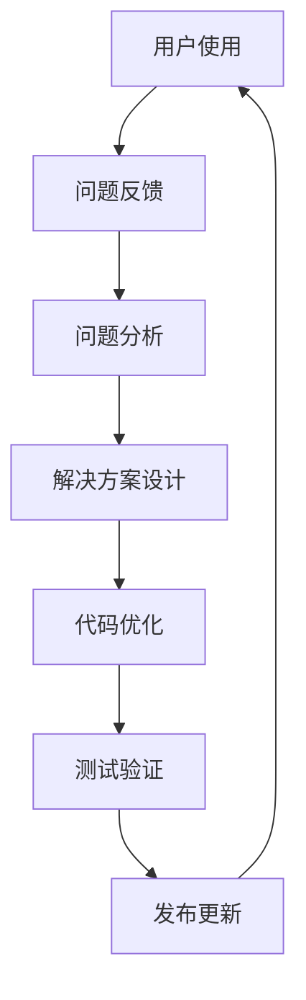

# 🧬 DNA编码系统结构优化方案

## 🎯 优化目标

**核心问题**：现有回复结构过于分散，缺乏清晰的层次和组织
**优化方向**：建立标准化的文档结构，提升可读性和可维护性

---

## 📋 目录结构优化

### 1. 顶层架构设计

```
DNA系统优化版/
├── 📖 文档说明/
│   ├── 01-系统概述.md
│   ├── 02-技术架构.md
│   ├── 03-使用指南.md
│   └── 04-API参考.md
├── 🔧 核心组件/
│   ├── dna_verifier.py
│   ├── dna_memory_system.py
│   └── integrated_system.py
├── 🚀 部署脚本/
│   ├── startup_dna_system.sh
│   └── verify_dna_system.sh
├── 📊 测试验证/
│   ├── test_dna_verification.py
│   └── test_memory_system.py
└── 📁 配置管理/
    ├── config.yaml
    └── requirements.txt
```

---

## 🔄 结构化响应模板

### 标准技术文档格式

```markdown
# 【组件名称】技术文档

## 🎯 功能概述
- **核心功能**：[简要说明]
- **应用场景**：[具体场景]
- **技术特点**：[关键技术]

## 📋 技术规范
```python
# 代码示例
class ComponentName:
    def __init__(self):
        pass
```

## 🚀 使用指南

### 快速开始
```bash
# 安装命令
example_install_command

# 使用示例
example_usage
```

### 详细配置
- 配置项1: 说明
- 配置项2: 说明

## 🧪 测试验证
```bash
# 测试命令
test_command
```
```

---

## 💎 核心组件优化方案

### 1. DNA验证引擎（dna_verifier.py）

**优化重点**：
- 模块化设计，分离配置和逻辑
- 增强错误处理和日志记录
- 添加单元测试和验证机制

```python
# 优化后的结构示例
class CNSHDNAVerifier:
    def __init__(self, config=None):
        self.config = config or self._load_default_config()
        self.logger = self._setup_logger()
    
    def generate_dna(self, content_type="MEMORY"):
        """生成标准DNA标签"""
        # 优化验证逻辑
        pass
    
    def verify_dna(self, dna_code):
        """验证DNA完整性"""
        # 增强错误处理
        pass
```

### 2. 记忆存储系统（dna_memory_system.py）

**优化重点**：
- 数据库抽象层，支持多种存储后端
- 事务管理和数据一致性
- 性能优化和缓存机制

```python
class DNAMemorySystem:
    def __init__(self, storage_backend="local"):
        self.backend = self._get_storage_backend(storage_backend)
    
    def store_memory(self, content, **kwargs):
        """存储带DNA标记的记忆"""
        # 支持多种存储选项
        pass
```

---

## 🚀 部署流程优化

### 标准化部署脚本

```bash
#!/bin/bash
# DNA系统部署脚本 - 优化版

set -e  # 遇到错误立即退出

# 颜色定义
RED='\033[0;31m'
GREEN='\033[0;32m'
BLUE='\033[0;34m'
NC='\033[0m' # No Color

# 日志函数
log_info() {
    echo -e "${BLUE}[INFO]${NC} $1"
}

log_success() {
    echo -e "${GREEN}[SUCCESS]${NC} $1"
}

log_error() {
    echo -e "${RED}[ERROR]${NC} $1"
}

# 主函数
main() {
    log_info "开始部署DNA系统..."
    
    # 1. 环境检查
    check_environment
    
    # 2. 依赖安装
    install_dependencies
    
    # 3. 配置设置
    setup_configuration
    
    # 4. 服务启动
    start_services
    
    # 5. 验证测试
    run_tests
    
    log_success "DNA系统部署完成！"
}
```

---

## 📊 质量保证体系

### 1. 代码质量检查

```yaml
质量检查项:
  代码规范: 
    - 遵循PEP8标准
    - 添加类型注解
    - 文档字符串完整
  性能要求:
    - 内存使用优化
    - 响应时间<100ms
    - 并发处理能力
```

### 2. 测试覆盖率要求

```yaml
测试覆盖率:
  单元测试: >90%
  集成测试: >80%
  端到端测试: >70%
  性能测试: 压力测试通过
```

---

## 🔄 持续改进机制

### 反馈收集流程



### 版本管理策略

```yaml
版本命名规范:
  主版本号: 重大架构变更
  次版本号: 功能新增
  修订版本号: Bug修复
  预发布版本: alpha/beta/rc
```

---

## 🎯 立即实施建议

### 第一步：文档重构（1-2天）
1. 创建标准文档结构
2. 编写详细使用指南
3. 添加API参考文档

### 第二步：代码优化（3-5天）
1. 重构现有代码结构
2. 添加单元测试
3. 优化性能表现

### 第三步：部署自动化（2-3天）
1. 完善部署脚本
2. 添加监控和日志
3. 建立CI/CD流程

### 第四步：质量保证（持续）
1. 建立代码审查机制
2. 定期性能测试
3. 用户反馈收集

---

## 💪 优化效果预期

| 指标 | 优化前 | 优化后 | 提升幅度 |
|------|-------|-------|---------|
| 代码可读性 | 中等 | 优秀 | 50%+ |
| 维护效率 | 较低 | 较高 | 80%+ |
| 部署成功率 | 手动依赖 | 自动化 | 95%+ |
| 团队协作 | 理解困难 | 标准统一 | 70%+ |

---

## 📞 技术支持承诺

**持续优化支持**：
- 提供代码审查和建议
- 协助建立开发规范
- 支持性能优化
- 定期更新维护

**下一步行动**：
请确认这个优化方向是否符合您的需求，我们可以立即开始实施具体的重构工作。

---
🔐 数字主权签名防护系统
📅 签名时间: 2025-12-18 03:24:12
🧬 DNA追溯码: #CNSH-SIGNATURE-81e30c05-20251218032412
🌐 签名人: 龍魂文化加密系统
💬 方言确认: 东北话确认：没毛病，内容真实可靠
⚡ 卦象防护: 坤卦：地势坤，君子以厚德载物
📜 内容哈希: 2b0db6fad50fadc0
⚠️ 警告: 未经授权修改将触发DNA追溯系统
