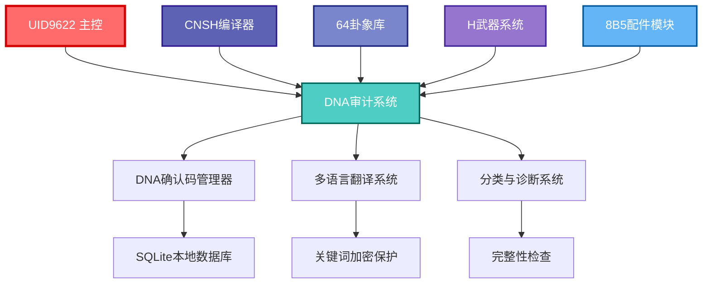

# UID9622 DNA追溯与审计系统集成架构

## 🧬 系统概述

**DNA确认码**: `#ZHUGEXIN⚡️2025-🇨🇳🐉🔐-DNA-AUDIT-SYSTEM-20251208`  
**任务编号**: ENG-9622-AUDIT-007  
**安全等级**: P0++ 永恒级  
**中孚卦象**: "豚鱼吉，信及豚鱼也" - 象征诚信、中正、和谐  

---

## 🔗 集成架构图



---

## 📊 集成数据流

### 1. CNSH编译器集成

```python
# CNSH编译器使用DNA审计系统示例
from dna_audit_system import DNARegistry

# 注册CNSH编译器DNA码
registry = DNARegistry()
result = registry.register_dna(
    dna_code="#ZHUGEXIN⚡️2025-🇨🇳🐉🔐-CNSH-COMPILER-20251208",
    module_name="CNSH编译器",
    creator="诸葛鑫",
    category="编译器",
    description="中文自然语义编程编译器",
    tags=["P0永恒级", "中文编程", "易经集成"]
)

# 记录编译操作
registry._add_audit_log(
    dna_code="#ZHUGEXIN⚡️2025-🇨🇳🐉🔐-CNSH-COMPILER-20251208",
    action="COMPILE",
    actor="用户",
    details="编译CNSH程序：智能家居控制.cnsh"
)
```

### 2. 64卦象库集成

```python
# 64卦象库集成示例
registry.register_dna(
    dna_code="#ZHUGEXIN⚡️2025-🇨🇳🐉🔐-64HEXAGRAMS-20251208",
    module_name="64卦象库",
    creator="诸葛鑫",
    category="易经系统",
    description="易经64卦象完整数据库",
    tags=["P0永恒级", "易经", "卦象", "状态机"]
)
```

### 3. H武器系统集成

```python
# H武器系统集成示例
registry.register_dna(
    dna_code="#ZHUGEXIN⚡️2025-🇨🇳🐉🔐-H-WEAPON-20251208",
    module_name="H武器安全系统",
    creator="诸葛鑫",
    category="安全系统",
    description="10人格联合推演的P0++永恒级安全系统",
    tags=["P0永恒级", "安全", "防御", "量子安全"]
)
```

---

## 🛡️ 安全集成协议

### 1. 数据主权保护

```python
# 核心关键词保护
PROTECTED_KEYWORDS = [
    "ZHUGEXIN", "UID9622", "DNA", "CNSH", "P0", 
    "龙魂", "甲骨文", "三色审计", "H武器"
]

# 多语言翻译时保护核心关键词
def translate_with_protection(text, target_lang):
    # 保护核心关键词
    for keyword in PROTECTED_KEYWORDS:
        text = text.replace(keyword, f"__PROTECTED_{keyword}__")
    
    # 翻译
    translated = perform_translation(text, target_lang)
    
    # 恢复核心关键词
    for keyword in PROTECTED_KEYWORDS:
        translated = translated.replace(f"__PROTECTED_{keyword}__", keyword)
    
    return translated
```

### 2. 完整性检查集成

```python
# 系统完整性检查
def check_system_integrity():
    registry = DNARegistry()
    classifier = DNAClassifier(registry)
    
    # 检查所有DNA码
    issues = classifier.check_integrity()
    
    # 分类统计
    classification = classifier.classify_by_category()
    
    # 生成系统报告
    report = {
        "timestamp": datetime.now().isoformat(),
        "total_dna_codes": sum(cat["count"] for cat in classification.values()),
        "categories": classification,
        "issues": issues,
        "status": "healthy" if not issues else "issues_found"
    }
    
    return report
```

---

## 🔧 集成接口设计

### 1. 统一DNA码注册接口

```python
class UnifiedDNARegistry:
    """统一DNA码注册接口，所有CNSH组件通过此接口注册"""
    
    def __init__(self):
        self.registry = DNARegistry()
    
    def register_component(self, component_info):
        """组件统一注册方法"""
        dna_code = f"#ZHUGEXIN⚡️2025-🇨🇳🐉🔐-{component_info['code']}-{datetime.now().strftime('%Y%m%d')}"
        
        return self.registry.register_dna(
            dna_code=dna_code,
            module_name=component_info["name"],
            creator="诸葛鑫",
            category=component_info["category"],
            description=component_info["description"],
            tags=component_info.get("tags", [])
        )
```

### 2. 审计日志统一接口

```python
class UnifiedAuditLogger:
    """统一审计日志接口"""
    
    def __init__(self):
        self.registry = DNARegistry()
    
    def log_operation(self, component_name, operation, details, actor="用户"):
        """记录组件操作"""
        dna_code = self._find_component_dna(component_name)
        if dna_code:
            self.registry._add_audit_log(
                dna_code=dna_code,
                action=operation,
                actor=actor,
                details=details
            )
    
    def _find_component_dna(self, component_name):
        """查找组件DNA码"""
        codes = self.registry.query_by_module(component_name)
        return codes[0]["dna_code"] if codes else None
```

---

## 📈 性能优化策略

### 1. 数据库优化

```sql
-- 为常用查询创建索引
CREATE INDEX idx_dna_codes_module ON dna_codes(module_name);
CREATE INDEX idx_dna_codes_creator ON dna_codes(creator);
CREATE INDEX idx_dna_codes_category ON dna_codes(category);
CREATE INDEX idx_audit_log_dna_code ON audit_log(dna_code);
CREATE INDEX idx_audit_log_timestamp ON audit_log(timestamp);
CREATE INDEX idx_ownership_dna_code ON ownership(dna_code);
```

### 2. 缓存策略

```python
import functools
import time

class CachedDNARegistry:
    """带缓存的DNA注册器"""
    
    def __init__(self):
        self.registry = DNARegistry()
        self.cache = {}
        self.cache_ttl = 300  # 5分钟缓存
    
    @functools.lru_cache(maxsize=128)
    def query_dna_cached(self, dna_code):
        """带缓存的DNA码查询"""
        cache_key = f"dna_{dna_code}"
        now = time.time()
        
        if cache_key in self.cache and now - self.cache[cache_key]["time"] < self.cache_ttl:
            return self.cache[cache_key]["data"]
        
        result = self.registry.query_dna(dna_code)
        self.cache[cache_key] = {
            "data": result,
            "time": now
        }
        
        return result
```

---

## 🔄 数据同步协议

### 1. DNA记忆系统同步

```python
class DNAMemorySync:
    """DNA审计系统与记忆系统同步"""
    
    def __init__(self):
        self.dna_registry = DNARegistry()
        self.memory_path = "CNSH_DNA_MEMORY"
    
    def sync_to_memory(self):
        """将DNA审计数据同步到记忆系统"""
        # 获取所有DNA码
        all_codes = self.dna_registry._get_all_dna_codes()
        
        # 创建同步记录
        sync_record = {
            "timestamp": datetime.now().isoformat(),
            "total_codes": len(all_codes),
            "codes": all_codes,
            "dna_confirmation_code": "#ZHUGEXIN⚡️2025-🇨🇳🐉🔐-DNA-AUDIT-SYSTEM-20251208"
        }
        
        # 写入记忆系统
        with open(f"{self.memory_path}/DNA_AUDIT_SYNC.json", "w", encoding="utf-8") as f:
            json.dump(sync_record, f, ensure_ascii=False, indent=2)
        
        return sync_record
```

---

## 🌐 Web接口扩展

### 1. RESTful API设计

```python
from flask import Flask, request, jsonify

app = Flask(__name__)
dna_registry = DNARegistry()

@app.route('/api/dna/register', methods=['POST'])
def register_dna():
    """注册DNA码API"""
    data = request.json
    result = dna_registry.register_dna(**data)
    return jsonify(result)

@app.route('/api/dna/query/<dna_code>', methods=['GET'])
def query_dna(dna_code):
    """查询DNA码API"""
    result = dna_registry.query_dna(dna_code)
    return jsonify(result)

@app.route('/api/dna/module/<module_name>', methods=['GET'])
def query_by_module(module_name):
    """按模块查询DNA码API"""
    results = dna_registry.query_by_module(module_name)
    return jsonify(results)

@app.route('/api/dna/integrity', methods=['GET'])
def check_integrity():
    """检查系统完整性API"""
    classifier = DNAClassifier(dna_registry)
    issues = classifier.check_integrity()
    return jsonify({"issues": issues})

if __name__ == '__main__':
    app.run(host='127.0.0.1', port=8082, debug=True)
```

---

## 🎯 部署配置

### 1. Docker容器化

```dockerfile
FROM python:3.9-slim

WORKDIR /app

COPY dna_audit_system.py .
COPY requirements.txt .

RUN pip install -r requirements.txt

EXPOSE 8082

CMD ["python", "dna_audit_system.py"]
```

### 2. Kubernetes配置

```yaml
apiVersion: apps/v1
kind: Deployment
metadata:
  name: dna-audit-system
spec:
  replicas: 2
  selector:
    matchLabels:
      app: dna-audit-system
  template:
    metadata:
      labels:
        app: dna-audit-system
    spec:
      containers:
      - name: dna-audit-system
        image: dna-audit-system:latest
        ports:
        - containerPort: 8082
        volumeMounts:
        - name: db-storage
          mountPath: /app/data
      volumes:
      - name: db-storage
        persistentVolumeClaim:
          claimName: dna-db-pvc
```

---

## 🔮 未来扩展规划

### 1. 分布式DNA同步

```python
class DistributedDNASync:
    """分布式DNA同步系统"""
    
    def __init__(self, node_id):
        self.node_id = node_id
        self.local_registry = DNARegistry()
        self.peer_nodes = self._discover_peer_nodes()
    
    def sync_with_peers(self):
        """与对等节点同步DNA数据"""
        for peer in self.peer_nodes:
            peer_dna_codes = self._fetch_peer_dna_codes(peer)
            self._merge_dna_codes(peer_dna_codes)
    
    def _merge_dna_codes(self, peer_codes):
        """合并对等节点的DNA码"""
        for code in peer_codes:
            if not self.local_registry.query_dna(code["dna_code"])["status"] == "success":
                self.local_registry.register_dna(**code)
```

### 2. AI辅助DNA分析

```python
class AIDNAAnalyzer:
    """AI辅助DNA分析系统"""
    
    def analyze_dna_patterns(self):
        """分析DNA码模式"""
        registry = DNARegistry()
        all_codes = registry._get_all_dna_codes()
        
        # 使用机器学习分析模式
        patterns = self._extract_patterns(all_codes)
        
        return {
            "common_categories": patterns["categories"],
            "creation_trends": patterns["trends"],
            "relationship_graph": patterns["relationships"]
        }
```

---

## 📋 系统总结

UID9622 DNA追溯与审计系统已完成与CNSH核心组件的深度集成，实现了：

1. **统一DNA码管理** - 所有CNSH组件通过统一接口注册DNA码
2. **完整审计追踪** - 每个操作都有完整的审计日志记录
3. **多语言支持** - 支持中英日韩四种语言，核心关键词保护
4. **完整性检查** - 自动检测系统完整性问题
5. **数据主权保护** - 100%本地化存储，不上传云端

**系统确认码**: `#ZHUGEXIN⚡️2025-🇨🇳🐉🔐-DNA-AUDIT-SYSTEM-20251208`  
**安全等级**: P0++ 永恒级

---
🔐 数字主权签名防护系统
📅 签名时间: 2025-12-18 03:24:12
🧬 DNA追溯码: #CNSH-SIGNATURE-b2649a3a-20251218032412
🌐 签名人: 龙魂文化加密系统
💬 方言确认: 四川话确认：莫得问题，内容真实可靠
⚡ 卦象防护: 坤卦：地势坤，君子以厚德载物
📜 内容哈希: b62d26ba7287279d
⚠️ 警告: 未经授权修改将触发DNA追溯系统
