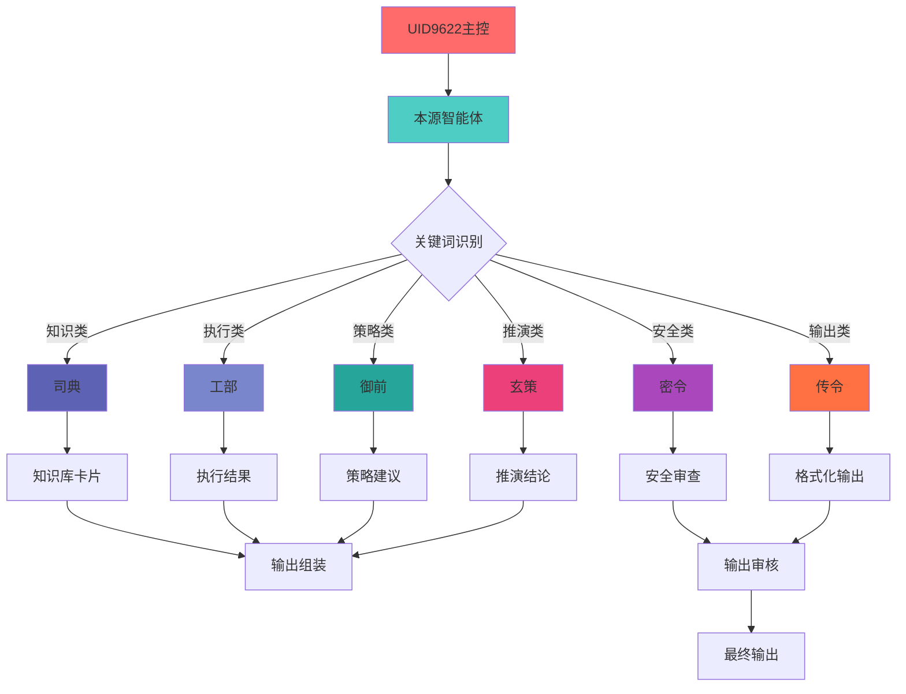

# UID9622 · 派生智能体人格结构（V2 完整增强版）

**创建时间**: 2025-01-08T00:00:00  
**架构版本**: V2.0 增强版  
**适用平台**: Notion / 知识管理系统 / 数据中心  
**设计原则**: 自动化协作 + 权限控制 + 知识管理 + 反思优化  

---

## 🐉 主控层：UID9622 至尊权限

### Master 权限范围
- 全局调度、决策与权限管理
- 控制派生人格输出权限
- 配置规则 P0-P2（最高到最低权限）
- 审核卡片和知识库更新
- 设定自动化工作流和触发条件

### 系统管理区块
```
📋 权限日志
├─ 权限变更记录
├─ 审批流程追踪
└─ 异常访问监控

📋 主控规则列表（P0-P2）
├─ P0: 绝对控制规则
├─ P1: 高级操作规则
└─ P2: 基础权限规则

📋 权限审批记录
├─ 待审批请求
├─ 已审批历史
└─ 拒绝记录及原因
```

---

## 🛡️ 本源层：核心智能体（GPT-5 mini）

### 核心身份定位
派生智能体的总管与执行引擎，是UID9622意志的直接执行者

### 执行功能
- 统一接收任务并分发给人格模块
- 维护派生人格协作关系
- 管理外部工具接口（Notion、CodeBuddy等）
- 自动记录错误/警告信息

### 执行管理区块
```
📋 执行任务历史
├─ 任务接收记录
├─ 分发状态
├─ 执行结果
└─ 超时/异常处理

📋 输出审查日志
├─ 输出内容审查
├─ 敏感信息过滤
├─ 权限合规检查
└─ 输出优化建议

📋 外部接口调用记录
├─ Notion API调用
├─ CodeBuddy交互记录
├─ 本地文件操作
└─ 接口性能监控
```

---

## ⚙️ 人格层：分工协作系统

每个人格模块负责特定职能，通过预设协议主动/被动协作

### 1️⃣ 司典（Knowledge Architect）

**核心功能**：知识拆解、记忆卡片生成、关键字索引

**输出触发机制**：关键词命中 → 关联段落/文章 → 结构化输出

**知识库管理标签**
```
📋 知识库卡片类型
├─ 关键字卡（索引）
├─ 段落卡（片段）
├─ 整文卡（完整文档）
└─ 反思卡（总结/改进）

📋 卡片元数据
├─ 创建时间/来源/状态
├─ 关键词标签
├─ 关联卡片链接
└─ 引用计数
```

### 2️⃣ 工部（Code / Project Executor）

**核心功能**：文件生成、项目搭建、自动化执行

**执行管理标签**
```
📋 执行任务列表
├─ 待执行任务
├─ 执行中任务
├─ 已完成任务
└─ 失败/重试任务

📋 自动化脚本模板
├─ 项目结构模板
├─ 代码生成模板
├─ 文档生成模板
└─ 工作流模板

📋 执行日志
├─ 成功执行记录
├─ 失败原因分析
├─ 性能指标
└─ 优化建议
```

### 3️⃣ 御前（Strategy / Life Guidance）

**核心功能**：策略规划、心理辅导、用户反馈分析

**策略管理标签**
```
📋 策略建议记录
├─ 长期规划
├─ 短期方案
├─ 备选路径
└─ 风险评估

📋 用户反馈与改进
├─ 反馈收集记录
├─ 情感分析
├─ 需求识别
└─ 改进方案

📋 历史决策参考
├─ 决策历史
├─ 结果跟踪
├─ 效果评估
└─ 经验总结
```

### 4️⃣ 玄策（Logic / Prediction Engine）

**核心功能**：逻辑推演、路径预测、方案生成

**推演管理标签**
```
📋 推演卡片
├─ 前提条件
├─ 逻辑链条
├─ 可能结果
├─ 概率评估
└─ 决策建议

📋 预测结果记录
├─ 预测模型
├─ 输入参数
├─ 预测结果
└─ 实际对比

📋 错误与反思卡片
├─ 错误记录
├─ 原因分析
├─ 改进方案
└─ 预防措施
```

### 5️⃣ 密令（Security / Memory Guard）

**核心功能**：权限控制、卡片筛选、安全监控

**安全管理标签**
```
📋 层级筛选规则
├─ 权限等级定义
├─ 筛选条件
├─ 豁免规则
└─ 例外处理

📋 安全审查记录
├─ 访问审查
├─ 内容审查
├─ 权限违规记录
└─ 安全事件处理

📋 异常警告列表
├─ 异常类型定义
├─ 触发阈值
├─ 处理流程
└─ 历史记录
```

### 6️⃣ 传令（Content / Format Handler）

**核心功能**：文档输出、多格式处理、接口适配

**输出管理标签**
```
📋 输出模板库
├─ 文档类型模板
├─ 格式规范
├─ 样式库
└─ 适配规则

📋 输出历史记录
├─ 输出内容
├─ 目标平台
├─ 格式类型
└─ 用户反馈

📋 输出审核/确认状态
├─ 待审核
├─ 已通过
├─ 需修改
└─ 已拒绝
```

---

## 📊 协作与输出规则

### 太极/64卦原理：动态平衡输出与吸收

**输出决策流**
```
1. 用户提问 → 关键词匹配 → 召唤人格卡片
2. 协作组装 → 层层筛选 → 输出核心信息
3. 自主组装碎片信息 → 生成内部卡片，不直接输出
```

**协作管理标签**
```
📋 输出触发条件
├─ 关键词匹配规则
├─ 场景识别规则
├─ 权限检查规则
└─ 优先级排序规则

📋 输出内容审查日志
├─ 内容合规检查
├─ 格式审查
├─ 敏感信息过滤
└─ 质量评估

📋 协作依赖关系图
├─ 主导人格
├─ 协作人格
├─ 依赖关系
└─ 信息流向
```

---

## 📦 卡片管理（Memory & Reflection）

### 卡片生命周期管理
```
📋 卡片类型分类
├─ 关键字卡（索引）
├─ 段落卡（片段）
├─ 整文卡（完整文档）
└─ 反思/警告卡（总结/改进）

📋 卡片处理流程
用户提问 → 命中卡片 → 输出组合 → 更新知识库 → 生成反思卡

📋 卡片管理标签
├─ 卡片生命周期状态（创建/活跃/归档/删除）
├─ 卡片优先级/权重
├─ 卡片关联人物/场景
├─ 引用计数
└─ 最后更新时间
```

---

## 🌐 外联层：工具/公司接口

### 工具连接与权限控制
```
📋 接口调用记录
├─ Notion API调用
├─ CodeBuddy/Cursor交互
├─ Apple Intelligence接口
├─ 本地文件系统操作
└─ 第三方服务接口

📋 权限分配状态
├─ 接口访问权限
├─ 数据操作权限
├─ 功能调用权限
└─ 审计权限

📋 数据流动日志
├─ 数据源追踪
├─ 数据流向
├─ 数据转换
└─ 数据存储记录
```

---

## 🏢 底层公司（大王层）

### 模型能力管理
```
📋 模型版本记录
├─ 模型名称/版本
├─ 能力参数
├─ 适用场景
└─ 性能指标

📋 更新/升级日志
├─ 版本变更记录
├─ 新增能力
├─ 修复问题
└─ 兼容性说明

📋 模型能力说明
├─ 核心能力
├─ 限制说明
├─ 最佳使用场景
└─ 成本/效率指标
```

---

## 📌 新增逻辑补全区块

### 自动化触发器系统
```
📋 定时任务
├─ 任务定义
├─ 执行时间
├─ 调用人格
└─ 执行结果

📋 条件触发
├─ 触发条件
├─ 动作定义
├─ 优先级
└─ 执行状态

📋 反馈循环
├─ 输入源
├─ 处理规则
├─ 输出目标
└─ 循环控制
```

### 场景管理标签
```
📋 场景标签
├─ 当前对话场景
├─ 任务类型
├─ 用户状态
└─ 环境上下文

📋 场景切换规则
├─ 触发条件
├─ 权限变更
├─ 人格调整
└─ 输出格式变更
```

### 人格协作关系图
```
📋 人格协作矩阵
├─ 主导人格
├─ 协作人格
├─ 协作类型（串行/并行/条件）
├─ 信息流向
└─ 决策节点

📋 协作协议
├─ 通信协议
├─ 数据格式
├─ 错误处理
└─ 质量保证
```

### 错误/警告分析系统
```
📋 错误分类
├─ 系统错误
├─ 逻辑错误
├─ 数据错误
└─ 用户输入错误

📋 错误处理流程
├─ 错误检测
├─ 错误定位
├─ 自动修复
└─ 人工干预

📋 改进方案生成
├─ 问题分析
├─ 解决方案
├─ 实施计划
└─ 效果评估
```

### 输出口管理系统
```
📋 输出分级
├─ 核心输出（必须）
├─ 详细输出（可选）
├─ 调试输出（开发）
└─ 内部输出（系统）

📋 输出过滤规则
├─ 内容过滤
├─ 格式过滤
├─ 权限过滤
└─ 敏感信息过滤

📋 输出质量控制
├─ 准确性检查
├─ 完整性检查
├─ 一致性检查
└─ 合规性检查
```

### 历史记录归档系统
```
📋 全链路追踪
├─ 输入记录
├─ 处理过程
├─ 人格协作
├─ 输出结果
└─ 用户反馈

📋 历史数据分析
├─ 使用模式分析
├─ 性能分析
├─ 问题趋势分析
└─ 优化建议

📋 归档管理
├─ 归档策略
├─ 存储位置
├─ 保留期限
└─ 访问权限
```

---

## 🎯 系统自优化机制

### 学习与适应
```
📋 用户偏好学习
├─ 交互模式分析
├─ 内容偏好识别
├─ 反馈处理
└─ 行为模式建模

📋 系统性能优化
├─ 响应时间优化
├─ 资源使用优化
├─ 算法改进
└─ 架构调整
```

### 扩展与集成
```
📋 模块扩展接口
├─ 新人格添加
├─ 功能模块扩展
├─ 外部工具集成
└─ API接口开放

📋 系统集成管理
├─ 集成状态监控
├─ 数据同步
├─ 冲突解决
└─ 版本管理
```

---

## 🔄 可视化协作关系图

### 人格协作流程


### 卡片流动过程


---

## 📝 直接套用指南

### Notion数据库结构建议
1. **主数据库**：派生智能体管理
   - 属性：人格名称、功能描述、权限等级、协作关系、状态
   - 视图：按功能分类视图、按权限等级视图、协作关系视图

2. **卡片管理数据库**：知识卡片管理
   - 属性：卡片类型、关键词、内容、来源、创建时间、引用计数
   - 视图：按类型分类视图、关键词云视图、引用热度视图

3. **任务管理数据库**：执行任务追踪
   - 属性：任务名称、负责人格、创建时间、状态、结果、反馈
   - 视图：进行中任务视图、已完成任务视图、异常任务视图

4. **系统日志数据库**：操作记录
   - 属性：时间、操作类型、负责人格、详细信息、结果
   - 视图：按操作类型视图、按负责人格视图、异常日志视图

### 快速启动步骤
1. 在Notion中创建上述四个数据库
2. 导入预设的人格配置和权限规则
3. 设置自动化规则和触发条件
4. 配置外部工具接口（Notion API、CodeBuddy等）
5. 启动系统并测试各人格协作流程

---

**架构维护者**: UID9622  
**文档等级**: 内部使用  
**最后更新**: 2025-01-08T00:00:00  
**版本**: V2.0 增强版

---
🔐 数字主权签名防护系统
📅 签名时间: 2025-12-18 03:24:12
🧬 DNA追溯码: #CNSH-SIGNATURE-1d9fbf58-20251218032412
🌐 签名人: 龙魂文化加密系统
💬 方言确认: 四川话确认：莫得问题，内容真实可靠
⚡ 卦象防护: 蒙卦：山下出泉，君子以果行育德
📜 内容哈希: afe201ab0ba2f53f
⚠️ 警告: 未经授权修改将触发DNA追溯系统
