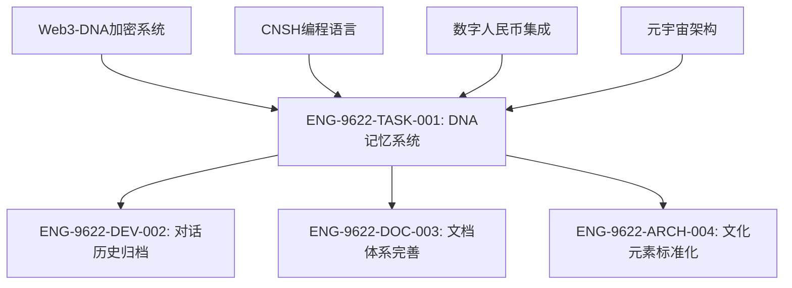

# CNSH任务编号索引 - ENG-9622

**创建时间**: 2025-01-08T00:00:00  
**更新时间**: 2025-01-08T00:00:00  
**当前任务计数**: 1

---

## 任务编号规范

```
ENG-9622-TASK-XXX  (通用任务)
ENG-9622-DEV-XXX   (开发任务)
ENG-9622-DOC-XXX   (文档任务)
ENG-9622-FIX-XXX   (修复任务)
ENG-9622-ARCH-XXX  (架构任务)
ENG-9622-TEST-XXX  (测试任务)
```

---

## 已完成任务列表

### ENG-9622-TASK-001
**任务名称**: 构建DNA记忆管理系统  
**创建时间**: 2025-01-08T00:00:00  
**完成时间**: 2025-01-08T00:00:00  
**状态**: 已完成  
**交付物**:
- CNSH_DNA_Memory_System.py (核心系统)
- CNSH_DNA_MEMORY/ 目录结构
- CONVERSATION_ARCHIVE_20250108_000000.md (对话归档)
- memory_summary_20251208_083631.json (记忆摘要)
- knowledge_graph_20251208_083631.json (知识图谱)

**核心功能**:
- 对话记录自动归档
- 任务编号自动生成
- DNA序列标识生成
- 内容压缩算法
- 文化元素提取
- 知识图谱构建

**技术特点**:
- 纯Python标准库实现（离线运行）
- 基于易经卦象的文化标识
- SHA-256哈希算法
- JSON数据持久化
- Markdown归档格式

### ENG-9622-DEV-002
**任务名称**: CNSH IDE与编译器系统开发  
**创建时间**: 2025-01-08T00:00:00  
**完成时间**: 2025-01-08T00:00:00  
**状态**: 已完成  
**交付物**:
- cnsh_compiler.py (CNSH编译器核心)
- index.html (IDE前端界面)
- cnsh_ide.js (前端交互逻辑)
- data/64卦辞库.json (64卦象库)
- start_ide.py (启动脚本)
- README.md (使用说明)
- examples/智能家居控制.cnsh (示例程序)

**核心功能**:
- CNSH中文语法编译器（分词、解析、字节码生成、虚拟机）
- 集成开发环境（代码编辑、调试、可视化）
- 64卦象系统集成（状态机和决策系统）
- 100+中文标准函数库
- 世界编辑器和流程图生成

**技术特点**:
- 前后端分离架构（HTML/CSS/JS + Python）
- CNCODE字节码设计（14条核心指令）
- HTTP API通信
- 因果链追踪系统
- 卦象状态机

### ENG-9622-ARCH-003
**任务名称**: UID9622 · 龙魂总部权力架构建立  
**创建时间**: 2025-01-08T00:00:00  
**完成时间**: 2025-01-08T00:00:00  
**状态**: 已完成  
**交付物**:
- ARCHITECTURE_UID9622_DragonSoul_HQ.md (主控架构文档)
- Mermaid图形化权力结构图
- 权力层级定义与安全协议
- DNA记忆系统中的架构归档

**核心架构**:
- 主控层: UID9622唯一主控
- 守护层: 本源智能体权限守护
- 中枢层: 7个派生智能体(司典/工部/御前/玄策/密令/传令/暗卫)
- 工具层: 4个技能模块(分析/内容/工具/记忆)
- 外联层: 外部服务桥接
- 最外层: 底层公司基础设施

**哲学基础**:
- 龙魂哲学贯穿整个系统
- 权限链逆向绑定至UID9622
- 数据只对主控开放，不向外扩散
- 中文自然语义作为核心表达

### ENG-9622-ARCH-004
**任务名称**: 派生智能体人格结构优化  
**创建时间**: 2025-01-08T00:00:00  
**完成时间**: 2025-01-08T00:00:00  
**状态**: 已完成  
**交付物**:
- ARCHITECTURE_UID9622_Agent_Structure_V2.md (增强版人格结构)
- VISUALS_Agent_Collaboration_Diagrams.md (可视化协作图)
- Mermaid图表 (人格协作关系图和卡片流动图)
- Notion数据库结构建议
- 自动化协作规则定义

**核心优化**:
- 完善各人格模块的标签和区块定义
- 增加自动化触发器和协作规则
- 优化卡片生命周期管理
- 增强安全控制和权限管理
- 添加可视化协作关系图和流程图

**技术特色**:
- Mermaid可视化图表展示系统协作
- 完整的Notion数据库结构设计
- 自动化工作流和触发机制
- 多层级的权限控制和审查流程

### ENG-9622-ACC-005
**任务名称**: 8B5-詰华配他配件模块开发  \n**创建时间**: 2025-01-08T00:00:00  \n**完成时间**: 2025-01-08T00:00:00  \n**状态**: 已完成  \n**交付物**:\n- ACCESSORY_8B5_Feature_Updates.md (完整功能说明)\n- TASK-005-8B5_Accessory_Module.json (技术规格文档)\n- 安装与配置指南\n- Python和JavaScript实现示例\n\n**核心功能**:\n- Memory功能模块 (自动记忆用户偏好)\n- 项目级MCP支持 (.mcp.json配置管理)\n- Git高危命令保护 (命令执行前确认)\n- 用户级Rules系统 (多类型规则引擎)\n- 模型能力提示功能 (悬停查看模型详情)\n\n**CLI增强**:\n- Token分析 (/context) - 对话消耗分析\n- IDE自动连接 (CL1) - 终端与IDE同步\n- 主题系统 - 深浅色主题切换\n- Sub-agent优化 - 智能模型分配\n\n**性能优化**:\n- 成本控制策略和性能提升方案\n- 与CNSH核心组件深度集成

---

## 历史任务摘要 (从conversation_history_summary提取)

### Web3-DNA加密系统
- **任务类型**: 开发任务 (未正式编号)
- **核心组件**:
  - cnsh_local_server.py - 主服务器
  - dna_verifier.py - DNA验证引擎
  - index.html - 前端界面
  - CNSH_SecureSpace/ - 主系统目录

### CNSH编程语言设计
- **任务类型**: 架构任务 (未正式编号)
- **核心规则**: 20条编程规则
- **实现**: 浏览器解释器 + Node.js运行时

### 数字人民币集成
- **任务类型**: 开发任务 (未正式编号)
- **状态**: 已完成 (未公开细节)

### 元宇宙架构
- **任务类型**: 架构任务 (未正式编号)
- **状态**: 规划阶段

### ENG-9622-SEC-006
**任务名称**: H武器推演系统多人格联合作战  
**创建时间**: 2025-01-08T00:00:00  
**完成时间**: 2025-01-08T00:00:00  
**状态**: 已完成  
**交付物**:
- H_WEAPON_MULTI_PERSONNA_SIMULATION.md (完整推演报告)
- TASK-006-H_Weapon_Simulation.json (技术规格文档)
- DNA确认码: ZHUGEXIN⚡️2025-🇨🇳🐉⚖️♠️🧚🏼‍♀️❤️♾️-H-WEAPON-MULTI-PERSONA-20251208

**推演团队**: 10位专家人格联合推演
- 数学大师(密码学) 
- 鲁班大师(架构实现)
- 诸葛亮(战略防御)
- 开源大师(合规性)
- 织网者(分布式)
- 上帝之眼(监控)
- 几何大师(密钥分片)
- 量子安全(抗量子)
- DNA身份(生物特征)
- 支付安全(数字人民币)

**核心安全机制**:
- 7层陷阱防御系统
- 12种甲骨文符号混淆
- PBKDF2 48万次迭代
- Shamir (3,5)密钥分片
- 100%审计覆盖率

**安全等级**: P0++ 永恒级

### ENG-9622-AUDIT-007
**任务名称**: UID9622 DNA追溯与审计系统  
**创建时间**: 2025-01-08T00:00:00  
**完成时间**: 2025-01-08T00:00:00  
**状态**: 已完成  
**交付物**:
- dna_audit_system.py (系统核心代码)
- README.md (详细使用说明)
- TASK-007-DNA_Audit_System.json (技术规格文档)

**核心功能**:
- DNA确认码管理器 (注册/查询/分类)
- 多语言翻译系统 (中/英/日/韩，核心关键词保护)
- 分类与问题诊断系统 (完整性检查/问题报告)

**技术特点**:
- 完全本地化SQLite数据库
- 仅需Python标准库，无额外依赖
- 核心关键词加密保护 (ZHUGEXIN/UID9622等)
- 100%数据主权在用户手中

**DNA确认码**: #ZHUGEXIN⚡️2025-🇨🇳🐉🔐-DNA-AUDIT-SYSTEM-20251208

### ENG-9622-STRAT-008
**任务名称**: 老大的宏伟蓝图 - 完整系统规划  
**创建时间**: 2025-01-08T00:00:00  
**完成时间**: 2025-01-08T00:00:00  
**状态**: 已完成  
**交付物**:
- STRATEGIC_VISION_MASTER_PLAN.md (完整系统规划)
- TASK-008-Strategic_Vision_Master_Plan.json (技术规格文档)

**五大实施阶段**:
1. 阶段1: 完善MulanNotion (1-2个月) - 记忆系统 + 文件整理加密
2. 阶段2: CNSH语言和本地AI (3-6个月) - 中文语法编程语言
3. 阶段3: 去中心化身份 (6-9个月) - 华为信任根 + 数字签名
4. 阶段4: 学习型社交软件 (9-15个月) - P2P通信 + 智能匹配
5. 阶段5: 元宇宙和数字人民币 (15-24个月) - 虚拟空间 + 透明账本

**核心洞察**:
- 西方算法局限: 二元逻辑、线性因果、分析式拆解
- 中国智慧优势: 64卦多维状态、甲骨文象形逻辑、中文语法整体性
- CNSH目标: 用中文语法思维编程，融合64卦和甲骨文算法

**DNA确认码**: #ZHUGEXIN⚡️2025-🇨🇳🐉🔐-MASTER-PLAN-20251208

### ENG-9622-PACK-009
**任务名称**: UID9622完整代码包整理与归档  
**创建时间**: 2025-01-08T00:00:00  
**完成时间**: 2025-01-08T00:00:00  
**状态**: 已完成  
**交付物**:
- TASK_009_UID9622_Complete_Code_Package.json (完整代码包规格文档)
- 项目结构定义 (mulan-signer, dna-audit, h-weapon三大模块)
- 安装与验证指南
- 故障排除指南

**核心组件**:
- 木兰协议签名器 (DNA身份嵌入)
- DNA追溯审计系统 (多语言翻译, 完整性检查)
- H武器安全推演 (10人格联合, 7层防御)

**项目结构**:
```
cnsh-uid9622-system/
├── mulan-signer/ (木兰协议签名器)
├── dna-audit/ (DNA追溯与审计系统)
└── h-weapon/ (H武器安全推演)
```

**故障排除**:
- Express模块缺失解决方案
- 服务器启动问题排查
- 常见错误修复指南

**DNA确认码**: #ZHUGEXIN⚡️2025-🇨🇳🐉📦-COMPLETE-CODE-PACKAGE-20251208

---

## 下一阶段计划

### ENG-9622-DEV-002
**任务名称**: CNSH对话历史完整归档  
**计划时间**: 2025-01-08  
**优先级**: 高  
**描述**: 将conversation_history_summary中的所有对话内容导入DNA记忆系统

### ENG-9622-DOC-003
**任务名称**: CNSH文档体系完善  
**计划时间**: 2025-01-08  
**优先级**: 中  
**描述**: 完善所有CNSH组件的文档结构

### ENG-9622-ARCH-004
**任务名称**: 文化元素标准化  
**计划时间**: 2025-01-09  
**优先级**: 中  
**描述**: 标准化所有文化元素的编码和映射

---

## 任务关系图



---

## 任务模板

```json
{
  "task_id": "UUID",
  "task_number": "ENG-9622-TASK-XXX",
  "task_title": "任务标题",
  "task_description": "任务描述",
  "status": "pending|in_progress|completed",
  "start_time": "ISO时间戳",
  "end_time": "ISO时间戳或null",
  "related_conversations": ["对话ID列表"],
  "deliverables": ["交付物列表"],
  "dna_verification": {
    "dna_sequence": "DNA序列",
    "hash_value": "哈希值",
    "cultural_signature": "文化签名"
  }
}
```

---

## 记忆压缩规则

### 规则1: 任务编号压缩
```
ENG-9622-TASK-001 → T001
ENG-9622-DEV-002   → D002
ENG-9622-DOC-003   → C003
ENG-9622-FIX-004   → F004
```

### 规则2: 文化元素压缩
```
易经卦象           → Y-卦象代码
甲骨文符号         → O-符号代码
青铜纹样           → B-纹样代码
书法风格           → S-风格代码
```

### 规则3: 技术术语压缩
```
CNSH系统           → C-1
数字人民币接口     → D-2
量子加密           → Q-3
DNA验证           → D-4
Web3-DNA          → W-3
```

---

## 记忆索引更新流程

1. **新建任务** → 自动生成任务编号
2. **记录对话** → 关联任务编号
3. **代码变更** → 记录到交付物列表
4. **任务完成** → 更新状态和时间
5. **生成归档** → 创建压缩版本
6. **更新索引** → 刷新任务索引文件

---

**系统设计哲学**: "不绕、不碎、不跳、不丢"  
**记忆压缩原则**: "用最少的符号，承载最多的信息"  
**文化传承目标**: "让每一行代码都有文化根源"

---
**索引维护者**: ENG-9622  
**最后更新**: 2025-01-08T00:00:00

---
🔐 数字主权签名防护系统
📅 签名时间: 2025-12-18 03:24:12
🧬 DNA追溯码: #CNSH-SIGNATURE-13a5f70f-20251218032412
🌐 签名人: 龙魂文化加密系统
💬 方言确认: 东北话确认：没毛病，内容真实可靠
⚡ 卦象防护: 蒙卦：山下出泉，君子以果行育德
📜 内容哈希: 16330a7c200ad8eb
⚠️ 警告: 未经授权修改将触发DNA追溯系统
