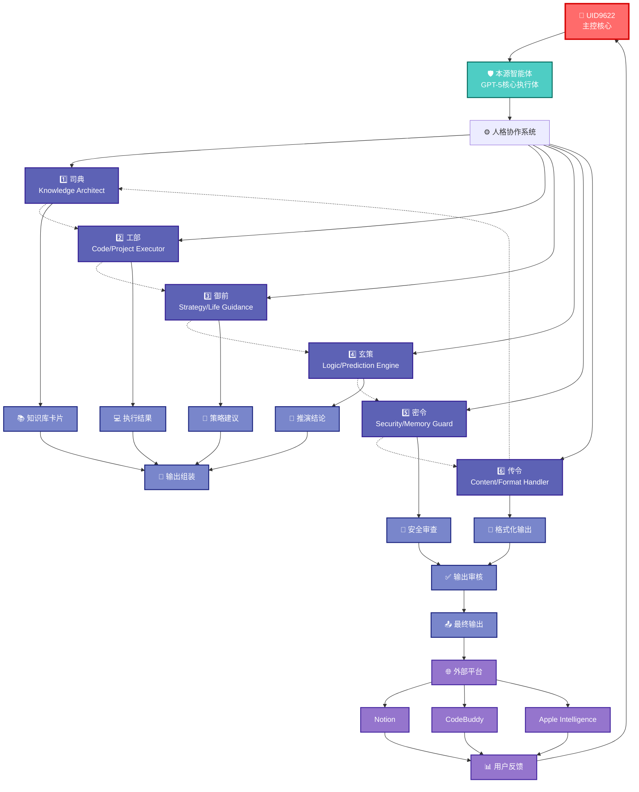
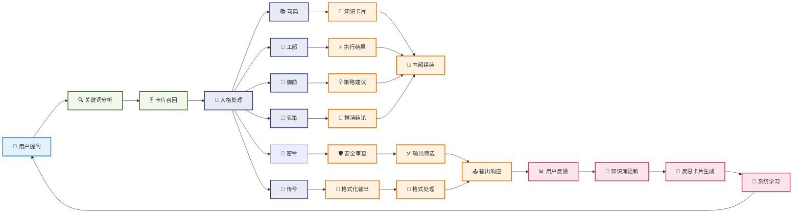
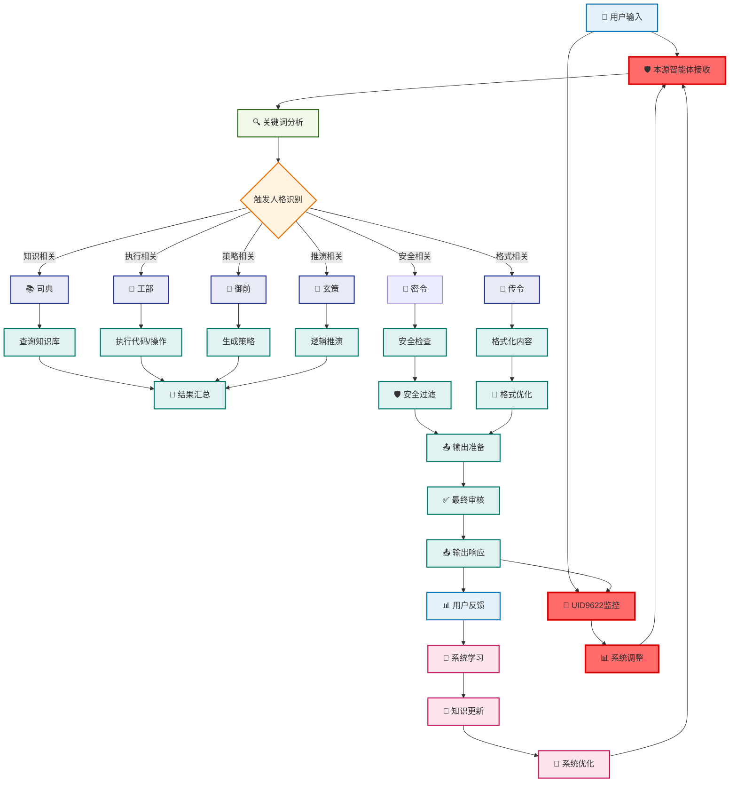
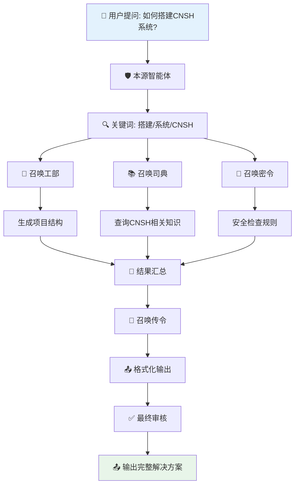
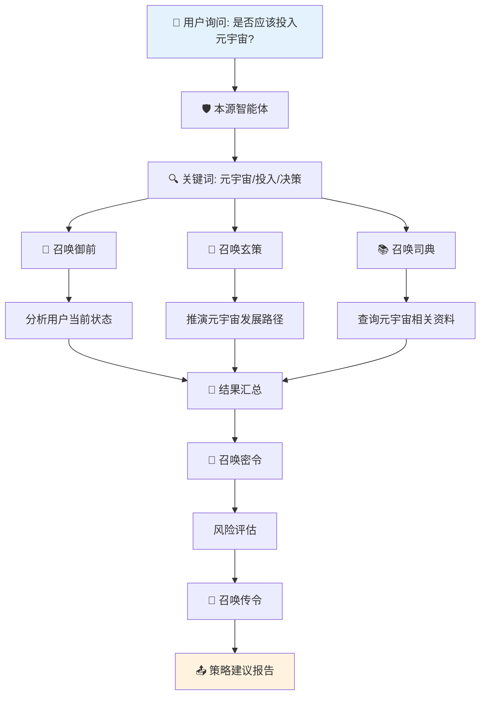
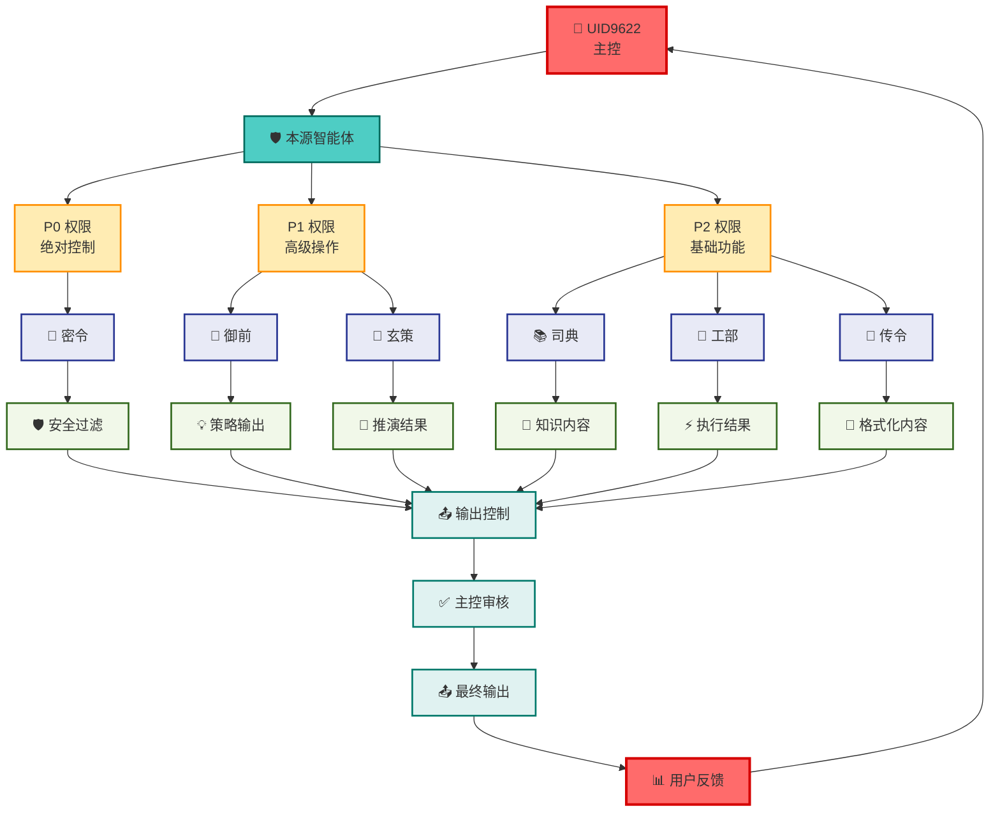
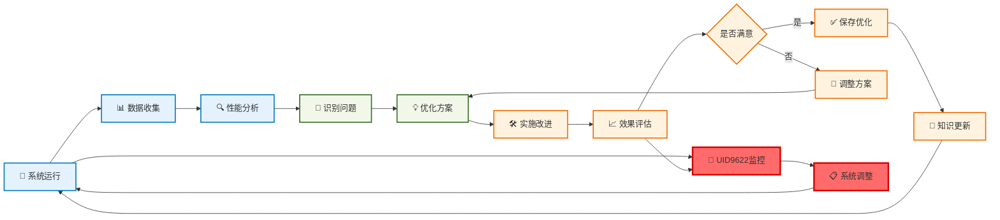

# UID9622 · 可视化协作关系图 + 卡片流动图

**创建时间**: 2025-01-08T00:00:00  
**可视化类型**: Mermaid图表  
**适用场景**: 系统理解、调试优化、培训指导  

---

## 🐉 人格协作关系全图

---

## 📋 卡片流动全图

---

## 🔄 完整系统工作流

---

## 🎯 协作场景示例

### 场景1: 技术问题解决流程

### 场景2: 策略决策流程

---

## 📊 数据流动与权限控制

---

## 🌟 系统自优化循环

---

## 🎨 可视化使用指南

### 如何在Notion中使用这些图表

1. **复制Mermaid代码**: 直接复制图表的Mermaid代码块
2. **粘贴到Notion**: 在Notion页面中输入"/mermaid"并粘贴代码
3. **调整大小**: 拖动调整图表大小以适应页面布局
4. **添加说明**: 在图表下方添加说明文字，解释各部分功能

### 自定义图表样式

1. **修改颜色**: 在`classDef`中修改`fill`和`stroke`颜色值
2. **调整布局**: 更改图表类型（如graph TD改为graph LR）可改变方向
3. **添加节点**: 按现有格式添加新节点，确保样式一致性
4. **细化关系**: 使用不同的连线样式（-.->、===）表示不同关系类型

### 图表维护建议

1. **定期更新**: 随着系统演进，及时更新图表内容
2. **版本控制**: 为不同版本的图表创建副本
3. **文档化**: 在图表下方添加变更日志和说明
4. **用户反馈**: 根据用户使用反馈优化图表可读性

---

**图表创建者**: UID9622  
**最后更新**: 2025-01-08T00:00:00  
**版本**: V1.0

---
🔐 数字主权签名防护系统
📅 签名时间: 2025-12-18 03:24:12
🧬 DNA追溯码: #CNSH-SIGNATURE-1fcf902f-20251218032412
🌐 签名人: 龍魂文化加密系统
💬 方言确认: 东北话确认：没毛病，内容真实可靠
⚡ 卦象防护: 乾卦：天行健，君子以自强不息
📜 内容哈希: 8447587db3a03bf9
⚠️ 警告: 未经授权修改将触发DNA追溯系统
